# Photoshop Layers Introduction

> Source: [https://www.photoshopessentials.com/basics/layers/layers-intro/](https://www.photoshopessentials.com/basics/layers/layers-intro/)
> Downloaded and converted to Markdown.

**Before we begin...** This version of our Photoshop Layers Introduction tutorial is for Photoshop CS5 and earlier. If you're using Photoshop CC or CS6, please see our fully-updated [Understanding Layers In Photoshop](/basics/understanding-photoshop-layers/) tutorial.

It's hard to believe there was ever a time when **layers** didn't exist inside **Photoshop**. Yet prior to Photoshop 3 (that's 3, not CS3), they didn't. Hard to believe, you say? Wait, didn't I just say that? Are you even paying attention? Well, you should be, because this is important stuff.

Layers are, without a doubt, the single most important aspect of Photoshop. Nothing worth doing in Photoshop can or should be done without layers. They're so important that they have their own [Layers panel](/basics/layers/layers-panel/) as well as their own Layer category in the Menu Bar at the top of the screen. You can add layers, delete layers, name layers, rename layers, move layers, adjust layers, mask layers, show and hide layers, blend layers, lock and unlock layers, add effects to layers, group and ungroup layers, and even change the opacity of layers. Layers are the heart and soul of Photoshop. Best of all, layers are easy to understand, once you wrap your mind around them.

"That's great!", you say, "but that doesn't tell me what layers are". Good point, so let's find out!

We can spent a lot of time discussing the theory of what layers are in Photoshop, just like we could try to learn how to ride a bike by reading a lot of theory about it. Problem is, you could read every book and website there is on the theory of bike riding and still fall on your head the first time you try to ride one (trust me on this). A better way to learn would be to simply hop on that bike and start peddling, and that's exactly how we're going to learn about layers. Fortunately, we run much less of a risk of falling on our heads while using layers, but feel free to put on a helmet if it will make you feel safer.

### What Would Life Be Like Without Layers?

Before we look at what layers are and how to use them, let's first see what working in Photoshop would be like *without* layers! We'll start by creating a new document in Photoshop. I'm using Photoshop CS5 here but any recent version will work just fine. Go up to the **File** menu in the Menu Bar along the top of the screen and choose **New**:

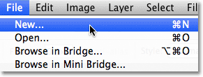

*Go to File > New.*

This opens the New Document dialog box. Enter **800 pixels** for the **Width** of the new document and **600 pixels** for the **Height**. Leave the **Resolution** value set to **72 pixels/inch.** There's no particular reason why we're using this size other than to keep us both on the same page. Finally, make sure the **Background Contents** option is set to **White**:

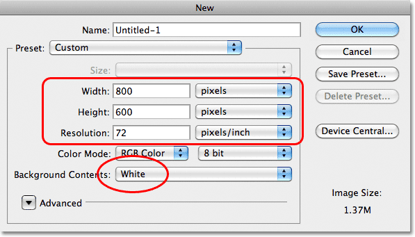

*Set the Width value to 800 pixels and the Height to 600 pixels. Background Contents should be set to White.*

When you're done, click OK to close out of the dialog box. Your new white-filled document will appear on the screen:

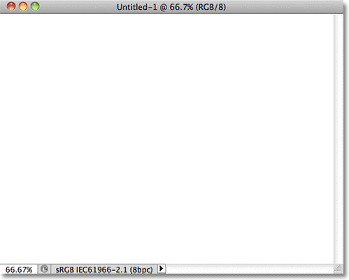

*The new document.*

Now that we have our new document open and ready to go, let's start drawing on it. We'll keep our "art work" very simple for this example, since we're really just trying to understand layers, not showcase our creative talent. Select the **Rectangular Marquee Tool** from the top of the Tools panel:

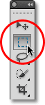

*Select the Rectangular Marquee Tool.*

With the [Rectangular Marquee Tool](/basics/selections/rectangular-marquee-tool/) selected, click somewhere near the top left corner of your document and drag out a rectangular selection. Don't worry about it's exact size or location:

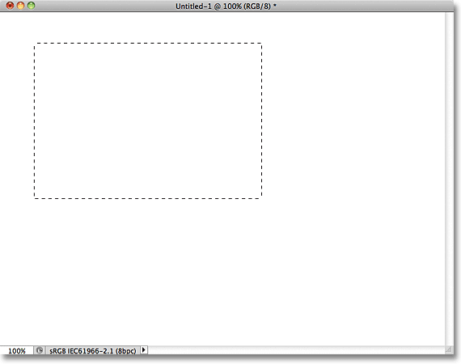

*Click and drag out a rectangular selection in the top left of the document.*

Now that we've dragged out a selection, let's fill that selection with a color. Go up to the **Edit** menu at the top of the screen and choose **Fill**:

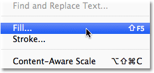

*Go to Edit > Fill.*

This open's the Fill dialog box. Change the **Use** option at the top of the dialog box to **Color**:

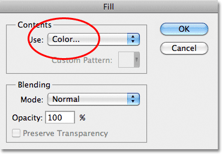

*Change the Use option to Color.*

As soon as you choose Color, Photoshop will pop open the **Color Picker** so we can choose the color we want to fill our selection with. You can pick any color you like. I"ll choose red:

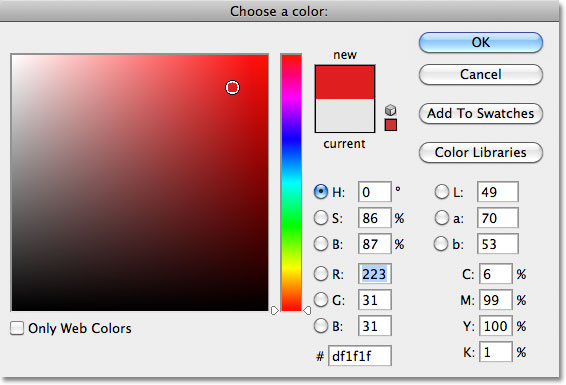

*Choose a color from the Color Picker. Any color will do.*

Once you've chosen a color, click OK to close out of the Color Picker, then click OK to close out of the Fill dialog box. Photoshop fills the selection with your color, which in my case was red:

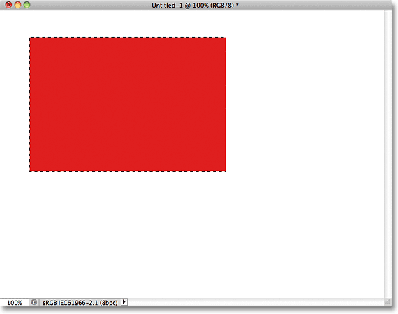

*The document after filling the selection with red.*

We don't need the selection outline around the rectangle anymore, so deselect it by going up to the **Select** menu at the top of the screen and choosing **Deselect**:

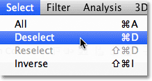

*Go to Select > Deselect to remove the selection outline from around the rectangle.*

So far so good. In fact, that first rectangle turned out so well, we should add a second one! Click inside the document with the Rectangular Marquee Tool and drag out another rectangular selection. Just for fun, start your selection from somewhere over top of the existing rectangle so that the new selection partly overlaps it

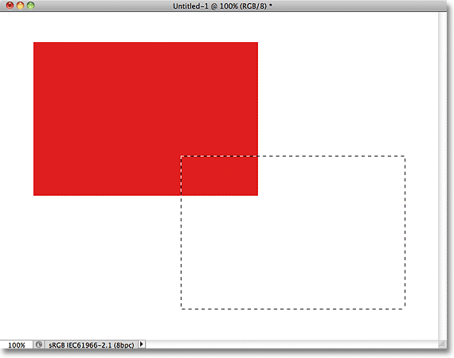

*Make sure the new selection partly overlaps the original rectangle.*

With the second selection added, go back up to the **Edit** menu and choose **Fill** so we can fill it with a color. The **Use** option at the top of the dialog box should already be set to **Color**, but if you simply click OK to close out of the dialog box, Photoshop will fill the selection with the same color you chose last time, and that's not what we want. We want a different color for this second rectangle, so click on the word Color, then re-select Color from the list of options (I know, it seems weird), at which point Photoshop will re-open the Color Picker. Choose a different color this time. I'll choose green. Again, feel free to pick any color you like as long as it's something different:

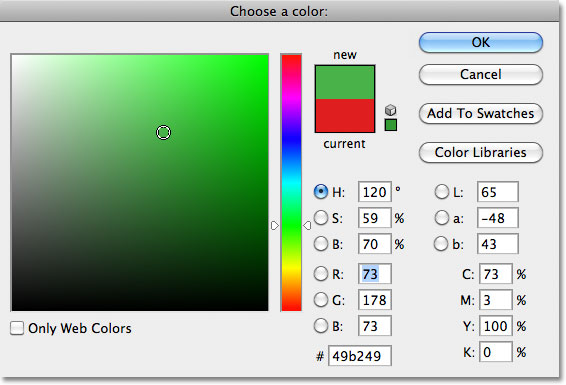

*Choose a different color for the second rectangle.*

Click OK to close out of the Color Picker, then click OK to close out of the Fill dialog box. Photoshop fills the second selection with your chosen color. To remove the selection outline from around the second rectangle, go up to the **Select** menu at the top of the screen and choose **Deselect**, just as we did last time. We now have two rectangles, each a different color, in the document. Award winning stuff:

*I call this piece "Two rectangles, two colors, one document."*

If that isn't a work of artistic genius, I don't know what is. Although.... hmmm........

Now that I've been looking at it for a while, I'm not sure I'm happy with something. See how the green rectangle overlaps the red one? I know I did that on purpose, but I think it was a mistake. It might look better if I swapped them so that the red rectangle was overlapping the green one. Yeah, that's the problem. The red shape needs to be in front of the green shape. Then my masterpiece will be complete! All I need to do here is grab the red one and move it over top of the green one.

We do that by..... um.... hmm. Wait a minute, how do we do that? I think we have a problem here. I drew the red one, then I drew the green one, and now I just need to move the red one in front of the green one. Sounds simple enough, but how? The simple answer is, I can't. There's no way to move that red shape in front of the green one because the green one isn't really in *front* of the red one at all. It's just an illusion. In fact, the two rectangles are not really two rectangles, at least not as separate independent objects. Again, It's an illusion. The green shape is simply cutting into the red one, and the [pixels](/essentials/pixels.php) that were initially red in the original rectangle were changed to green when I filled the second selection.

Speaking of illusions, the two rectangles are not really sitting in front of the white background, either. The entire thing is nothing more than a single, flat, two-dimensional image. Everything in the document - the red shape, the green shape and the white background - is essentially stuck together. We can't move anything without moving *everything*.

Let's take a quick look in our Layers panel to see what's happening. Notice that everything - the two rectangles and the white background - is sitting on a single layer. This means everything is part of the same flat image:

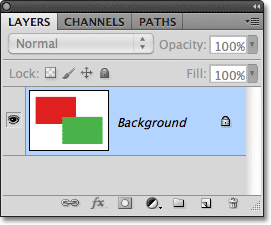

*The Layers panel showing everything on the Background layer.*

With all of our work on a single layer, we don't have many options if we want to change something. We could undo our way back through the steps to get to the point where we can make our change, or we could scrap the whole thing and start over again. Neither one of those options sounds very appealing to me. There must be a better way to work, one that will give us the freedom and flexibility to make simple changes like this without having to undo and redo anything or start over from scratch.

Fortunately, there is. Let's try the same thing, but this time using layers!

Now that we've seen what it's like to work in Photoshop without layers, let's see what layers can do for us. First, let's clear away the two rectangles we added by filling the document with white. Go up to the **Edit** menu at the top of the screen and once again choose **Fill**. When the Fill dialog box appears, change the **Use** option from Color to **White**:

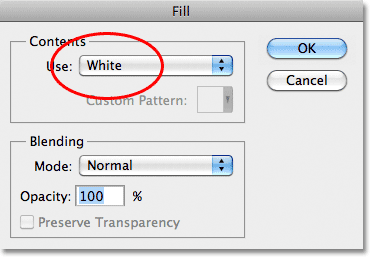

*Go to Edit > Fill, then change the Use option to White.*

Click OK to close out of the dialog box. Photoshop fills the document with white, and we're back to where we started:

*The document is once again filled with white.*

### The Layers Panel

Before we go any further, since we're going to be using layers this time, let's take a quick look at Photoshop's "Command Central" for layers - the **[Layers panel](/basics/layers/layers-panel/)**. If there's something we need to do in Photoshop that has something to do with layers, the Layers panel (or Layers *palette* as it's known in earlier versions of Photoshop) is where we do it. We use the Layers panel to create new layers, delete existing layers, move layers above and below each other, turn layers on and off in the document, add layer masks and layer effects.... the list goes on and on, and it's all done from within the Layers panel.

At the moment, the Layers panel is showing us that we have one layer in our document, which is named "Background". The Background layer is actually a special type of layer in Photoshop, which is why its name is in italics, but we'll look more closely at the Background layer in [another tutorial](/basics/layers/background-layer/). To the left of the layer's name is a preview thumbnail showing us the contents of our layer, which is currently filled with white:

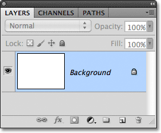

*Photoshop's Layers panel.*

When we initially added our two rectangles to the document, they were both added to the Background layer, which is why there was no way to move them independently of each other. The rectangles and the white background were all stuck together on a flat image. This way of working in Photoshop, where everything is added to a single layer, is known in technical terms as "wrong" (yep, that's a technical term) because when you need to go back and make changes, you run into a "problem" (another technical term). Let's see what happens if we create the same layout as before, but this time, we'll place everything on its own layer.

Our white background is already on the Background layer, so let's add a new layer above it for our first rectangle. To add a new layer, click on the **New Layer** icon at the bottom of the Layers panel (it's the icon directly to the left of the trash bin):

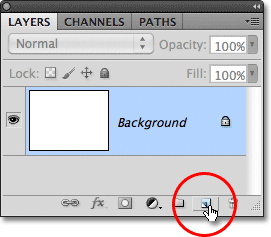

*Click on the New Layer icon.*

A new layer appears above the Background layer. Photoshop automatically names the new layer "Layer 1". If we look at the preview thumbnail to the left of the layer's name, we see that it's filled with a checkerboard pattern, which is Photoshop's way of telling us that the new layer is blank:

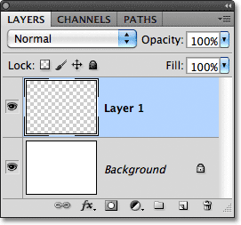

*A new blank layer named "Layer 1" appears above the Background layer.*

Notice that Layer 1 is highlighted in the Layers panel. That means it's currently the active layer. Anything we add to the document at this point will be added to Layer 1, not the Background layer below it. Let's add our first rectangle, just as we did before. Select the **Rectangular Marquee Tool** from the Tools panel if it's not still selected, then click somewhere in the top left of the document and drag out a rectangular selection:

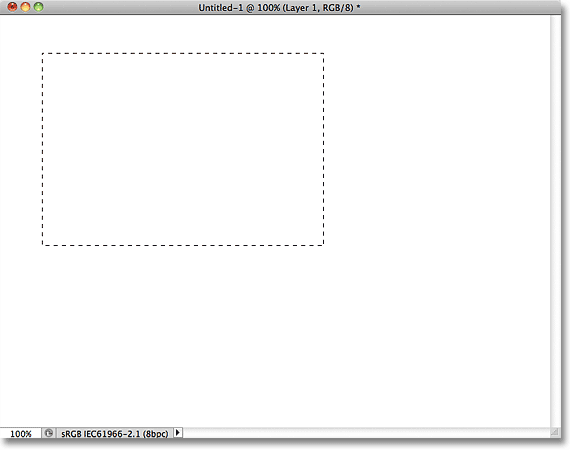

*Drawing a rectangular selection.*

Go up to the **Edit** menu at the top of the screen and choose **Fill**. When the Fill dialog box appears, change the **Use** option to **Color**, then select a color for the rectangle from the **Color Picker**. I'll choose the same red color I chose last time. Click OK to close out of the Color Picker, then click OK to close out of the Fill dialog box. Photoshop fills the selection with your chosen color. To remove the selection outline from around the rectangle, go up to the **Select** menu at the top of the screen and choose **Deselect** (I'm running through these steps quickly here simply because they're exactly the same as what we did previously). I now have my first rectangle, filled with red, just as I had before:

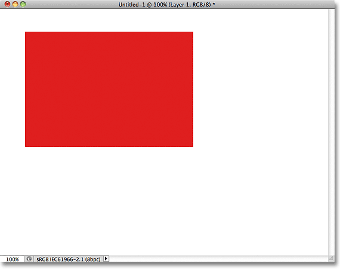

*The first rectangle appears, this time on Layer 1.*

Let's take a look at our Layers panel. We can see in the preview thumbnails that the Background layer is still filled with solid white, but the red rectangle I just added is on Layer 1 this time, so it's completely separate from the white background:

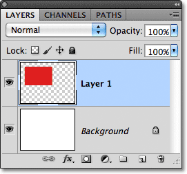

*The red shape and the white background are now independent of each other.*

Let's add our second shape. Again, we want it to be placed on its own layer, which means we need to add another new layer by clicking on the **New Layer** icon at the bottom of the Layers panel:

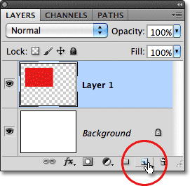

*Click on the New Layer icon again to add a second new layer.*

A second new layer appears, this time above Layer 1. Photoshop always places new layers directly above the layer that was active when we clicked on the New Layer icon, and Layer 1 happened to be active at the time. Once again Photoshop automatically names the new layer for us, this time as "Layer 2":

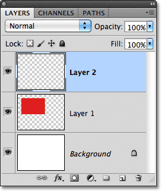

*Layer 2 is currently blank, as indicated by the checkerboard pattern in its preview thumbnail.*

With Layer 2 now the active layer (it's highlighted in the Layers panel), drag out a rectangular selection, with part of the selection overlapping the original shape. Then go to **Edit** > **Fill**, re-select **Color** for the **Use** option to open the **Color Picker**, choose a different color (I'll choose green), then click OK to close out of the Color Picker and OK to close out of the Fill dialog box. Photoshop fills the selection with the color. Go to **Select** > **Deselect** to remove the selection outline from around the shape. When you're done, your second rectangle should appear filled with color in the document:

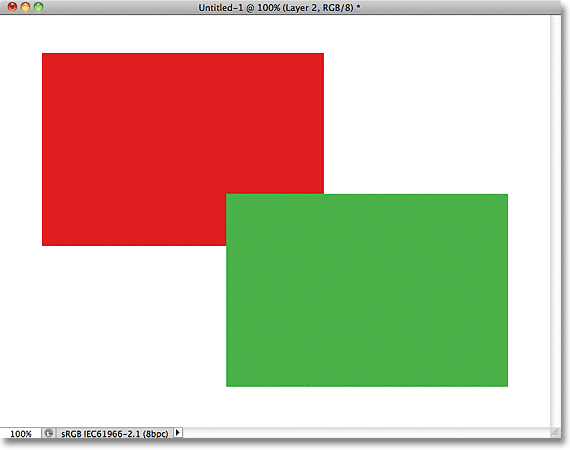

*The second rectangle is added.*

And if we look in the Layers panel, we see that the original shape remains by itself on Layer 1 while the new shape was added above it on Layer 2. The white background remains on the Background layer, which means that all three elements that make up our document (the white background, the red shape and the green shape) are now on their own separate layers and completely independent of each other:

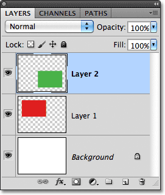

*Everything is now on its own layer.*

Previously, when everything was on a single layer, we discovered there was no way to move the red shape in front of the green one because they really were not two separate shapes. They were simply areas of red or green pixels mixed in with areas of white pixels on the same layer. But this time, with everything on its *own* layer, we really do have two separate shapes, and moving one in front of the other in the document is easy!

At the moment, the green shape appears in front of the red one in the document because the green shape is *above* the red one in the Layers panel. Imagine as you're looking at the layers from top to bottom in the Layers panel that you're looking down through the layers in the document. Any layer above another layer in the Layers panel appears in front of it in the document. If the contents of two layers overlap each other in the document, as our shapes are doing, whichever layer is below the other in the Layers panel will appear *behind* the other layer in the document. Above = in front, below = behind. It may take a while for your mind to grasp it, but it's really that simple.

This means that if we want to swap the shapes so that the red one appears in front of the green one, all we need to do is move the red shape's layer above the green shape's layer. To do that, simply click on Layer 1 to select it and make it the active layer:

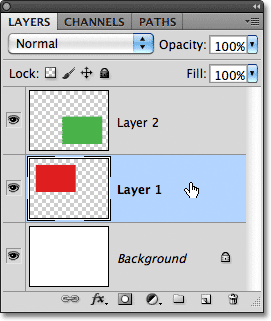

*Click on Layer 1 to select it.*

Keep your mouse button held down and drag Layer 1 straight up and above Layer 2 until you see a horizontal highlight bar appear directly above Layer 2:

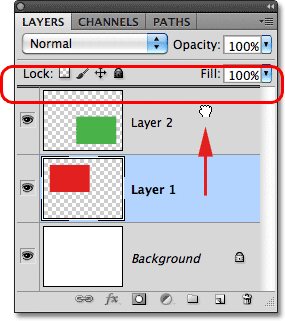

*Drag Layer 1 upward until a highlight bar appears above Layer 2.*

When the highlight bar appears, release your mouse button. Photoshop moves Layer 1 above Layer 2:

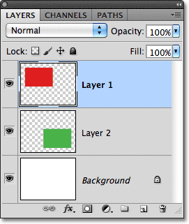

*Layer 1 now appears above Layer 2 in the Layers panel.*

With the red shape now above the green shape in the Layers panel, the red one appears in front of the green one in the document:

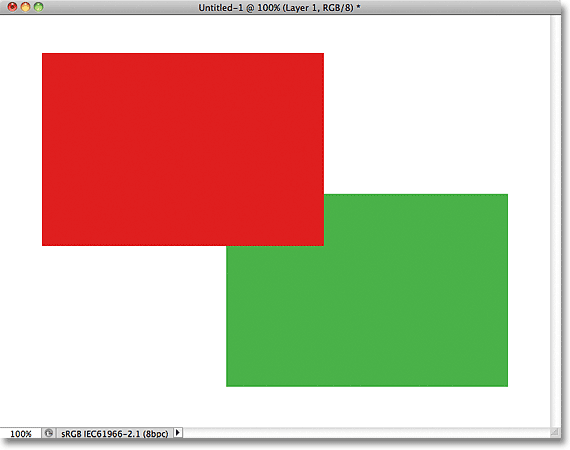

*Thanks to layers, it was easy to move one shape in front of the other.*

Without layers, moving the red shape in front of the green one would not have been possible, at least not without a lot of extra work and frustration. But with everything on its own layer, it was quick and easy! Layers keep everything separate so we can work on one element of our image without affecting any others. We can move one object in front of another as we did here. We could change an object's color without changing any other colors in the image. We could brighten someone's eyes, whiten their teeth, blur a background while leaving people or objects in front of it nice and sharp. Layers open the door to creativity in Photoshop and make everything possible.