# Photoshop Layers Panel Essentials

> Source: [https://www.photoshopessentials.com/basics/layers/layers-panel/](https://www.photoshopessentials.com/basics/layers/layers-panel/)
> Downloaded and converted to Markdown.

In Part Two of our Layers Learning Guide, take a whirlwind tour of Photoshop's Layers panel and learn the essential skills you need to benefit from all that layers have to offer!

In the previous tutorial ([Understanding Layers](/basics/understanding-photoshop-layers/)), we looked briefly at what layers are and how they make working in Photoshop so much easier. But before we can start taking advantage of all that layers have to offer, we first need to learn some essential skills for working in Photoshop's Command Central for layers—the **Layers panel**.

In this tutorial, we'll take a whirlwind tour of the Layers panel and learn everything we need to know to get up and running quickly. I'll be using Photoshop CS6 but everything we'll be covering is fully compatible with Photoshop CC. If you're using Photoshop CS5 or earlier, you can follow along here or you can check out the [original version](/basics/photoshop-cs5-layers-panel-essentials/) of our Layers panel tutorial.

The Layers panel is where we handle all of our layer-related tasks, from adding and deleting layers to adding layer masks and adjustment layers, changing layer blend modes, turning layers on and off in the document, renaming layers, grouping layers, and anything else that has anything to do with layers. Since it's one of the most commonly-used panels in all of Photoshop, Adobe set things up so that the Layers panel opens automatically for us each time we launch the program.

This tutorial is Part 2 of my [Photoshop Layers Learning Guide](/photoshop-layers-learning-guide/).

Let's get started!

## The Layers Panel In Photoshop

By default, you'll find the Layers panel in the lower right of the screen. As I mentioned, I'm using Photoshop CS6 but regardless of which version you're using, you'll find the Layers panel in the same general location:

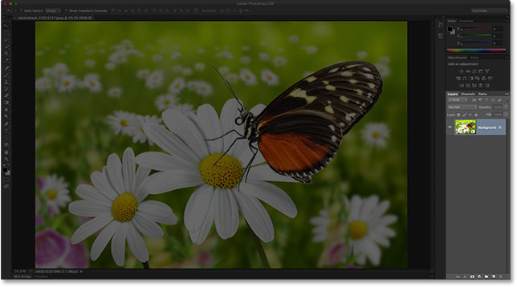
*The Layers panel is highlighted in the lower right.*

If the Layers panel is not appearing on your screen, you can access it (along with any of Photoshop's other panels) by going up to the **Window** menu in the **Menu Bar** along the top of the screen and choosing **Layers**. A checkmark to the left of a panel's name means the panel is currently open somewhere on the screen:

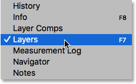
*All of Photoshop's panels can be turned on or off from the Window menu in the Menu Bar.*

I've just opened an image in Photoshop which I downloaded from [Adobe Stock](https://prf.hn/l/yOJG1MD). You can easily follow along by opening any image of your own:

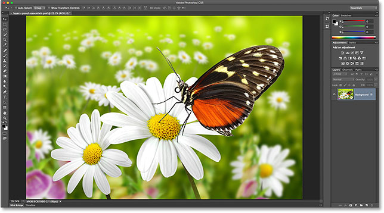
*A newly-opened image in Photoshop.*

Even though I've done nothing so far with the image other than open it, the Layers panel is already giving us some information. Let's take a closer look at what we're seeing:

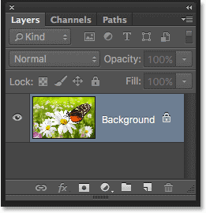
*Photoshop's Layers panel.*

### The Name Tab

First of all, how do we know that what we're looking at is, in fact, the Layers panel? We know because it says so in the **name tab** at the top of the panel:

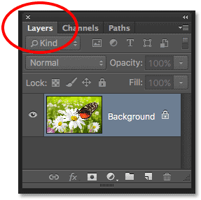
*The name tab tells us we're looking at the Layers panel.*

You may have noticed that there are two other tabs to the right of the Layers tab—**Channels** and **Paths**—both of which appear slightly dimmer than the Layers panel tab:

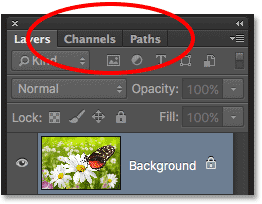
*The Channels and Paths tabs appear to the right of the Layers tab.*

These are two other panels that are grouped in with the Layers panel. There's so many panels in Photoshop that fitting them all on the screen while still leaving room to work can be a challenge, so Adobe decided to group some panels together into **panel groups** to save space.

To switch to a different panel in a group, simply click on the panel's tab. The tab of the panel that's currently open in the group appears highlighted. Don't let the fact that the Layers panel is grouped in with these two other panels confuse you, though. The Channels and Paths panels have nothing to do with the Layers panel, other than the fact that both are also commonly used in Photoshop, so we can safely ignore them while we look specifically at the Layers panel.

### The Layer Row

Each time we open a new image in Photoshop, the image opens in its own document and is placed on a layer. Photoshop represents layers in the document as rows in the Layers panel, with each layer getting its own row. Each row gives us various bits of information about the layer. I only have one layer in my document at the moment so my Layers panel is displaying a single row. But as we add more layers, additional rows will appear:

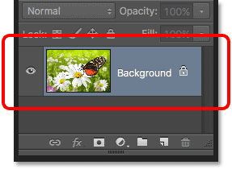
*The Layers panel displays layers as rows of information.*

### The Layer Name

Photoshop places the new image on a layer named **Background**. It's named Background because it serves as the background for our document. We can see the name of each layer displayed in its row. The Background layer is actually a special type of layer in Photoshop which I cover in detail in our [Background Layer](/basics/layers/background-layer/) tutorial:

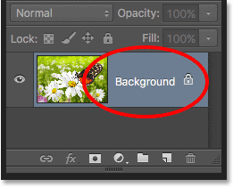
*The Layers panel displays the name of each layer.*

### The Preview Thumbnail

To the left of a layer's name is a thumbnail image known as the layer's **preview thumbnail** because it shows us a small preview of what's on that specific layer. In my case, the preview thumbnail is showing me that the Background layer contains my image. I probably could have guessed that on my own since my document only has the one layer, but it's nice to know that Photoshop has my back:

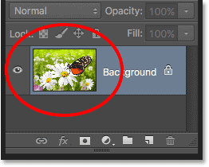
*The preview thumbnail shows us what's on each layer.*

### Adding A New Layer

To add a new layer to a document, click the **New Layer** icon at the bottom of the Layers panel:

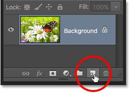
*Clicking the New Layer icon.*

A new layer appears in the Layers panel directly above the Background layer. Photoshop automatically names new layers for us. In this case, it named the layer "Layer 1". Notice that we now have two layer rows in the Layers panel, each representing a different layer:

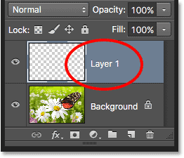
*A new layer named Layer 1 appears in the Layers panel.*

If we look in the new layer's preview thumbnail, we see a **checkerboard pattern**. The checkerboard pattern is Photoshop's way of representing transparency. Since there's nothing else being displayed in the preview thumbnail, this tells us that at the moment, the new layer is blank:

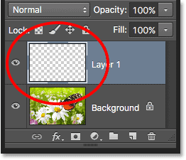
*When we add a new layer to a document, it begins life as a blank slate.*

If I click again on the New Layer icon:

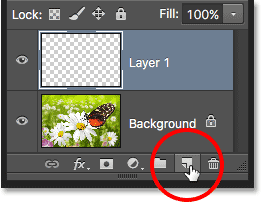
*Clicking a second time on the New Layer icon.*

Photoshop adds another new layer to my document, this time naming it "Layer 2". We now have three layer rows, each representing one of the three layers in the document:

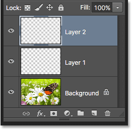
*Three layers, each on its own row in the Layers panel.*

### Moving Layers

We can move layers above and below each other in the Layers panel simply by dragging them. Right now, Layer 2 is sitting above Layer 1, but I can move Layer 2 below Layer 1 by clicking on Layer 2 and, with my mouse button still held down, dragging the layer downward until a **highlight bar** appears between Layer 1 and the Background layer. This is the spot where the layer will be placed:

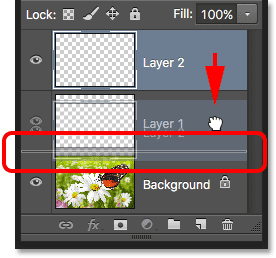
*To move a layer, click and drag it above or below another layer.*

Release your mouse button when the highlight bar appears. Photoshop drops the layer into its new position:

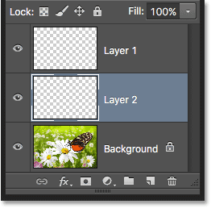
*Layer 2 now sits between Layer 1 and the Background layer.*

The only layer we can't move in the Layers panel is the Background layer. We also can't move other layers below the Background layer. All other layers can be dragged above or below other layers as needed. Again, we'll cover the [Background layer](/basics/layers/background-layer/) in much more detail in the next tutorial.

### The Active Layer

You may have noticed that when I only had the one Background layer in my document, it was highlighted in blue in the Layers panel. Then, when I added Layer 1, Layer 1 became the highlighted layer. And now Layer 2 is the highlighted layer. What’s up with the highlights?

When a layer is highlighted, it means it's currently the **active layer**. Anything we do in the document is done to the contents of the active layer. Each time we add a new layer, Photoshop automatically makes it the active layer, but we can manually change which layer is the active layer simply by clicking on the layer we need. Here, I'll make Layer 1 the active layer by clicking on it, and we see that it becomes highlighted:

*Layer 1 is now the active layer in the document.*

### Deleting A Layer

To delete a layer, simply click on it and, with your mouse button still held down, drag it down onto the **Trash Bin** icon at the bottom of the Layers panel. Release your mouse button when you're over the icon. Here, I'm deleting Layer 1:

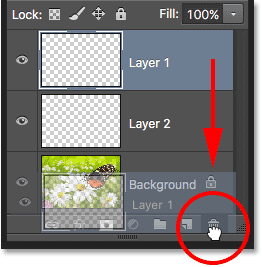
*Delete layers by clicking and dragging them into the Trash Bin.*

I'll delete Layer 2 as well by clicking and dragging it down into the Trash Bin:

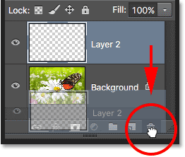
*Dragging Layer 2 into the Trash Bin to delete it.*

And now I'm back to having just a single layer, the Background layer, in my document:

*The two blank layers have been deleted.*

### Copying A Layer

We've seen how to add a new blank layer to a document, but we can also make a copy of an existing layer using the Layers panel. To copy a layer, click on it and, with your mouse button held down, drag it down onto the **New Layer** icon. I'll make a copy of my Background layer:

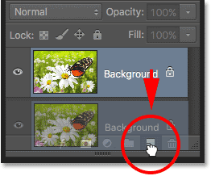
*Dragging the Background layer onto the New Layer icon to make a copy of it.*

Release your mouse button when you're over the New Layer icon. A copy of the layer will appear above the original. In my case, Photoshop made a copy of my Background layer and named it "Background copy". Notice that it also made this new layer the active layer (it's highlighted in blue):

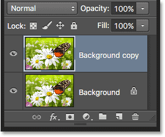
*A copy of the layer is placed above the original.*

I'm going to quickly apply a couple of Photoshop's blur filters to my Background copy layer just so we have something different on each layer. Since Photoshop's filters are beyond the scope of this tutorial, I'll go through these steps fairly quickly.

First, I'll apply the Motion Blur filter by going up to the **Filter** menu at the top of the screen, choosing **Blur**, and then choosing **Motion Blur**:

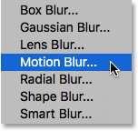
*Going to Filter > Blur > Motion Blur.*

This opens the Motion Blur dialog box. I'll set the **Angle** of the motion blur to **-45°** so that the motion runs diagonally from the upper left to the lower right. Then, because I'm working on a large, high resolution image, I'll increase the **Distance** value to around **600 pixels**. If you're using a smaller image, you may want to use a smaller value:

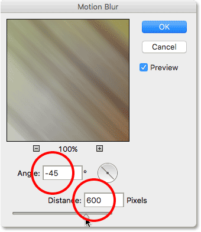
*The Motion Blur filter's dialog box.*

I'll click OK to close out of the Motion Blur dialog box, and here's the result so far:

*The effect after applying the Motion Blur filter.*

To soften the effect a bit more, I'll apply Photoshop's Gaussian Blur filter by going back up to the **Filter** menu, back to **Blur**, and this time choosing **Gaussian Blur**:

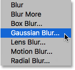
*Going to Filter > Blur > Gaussian Blur.*

I'll set the **Radius** value at the bottom of the Gaussian Blur dialog box to around **20 pixels** just to soften any harsh diagonal lines. Again, if you're using a smaller image, a smaller value may work best:

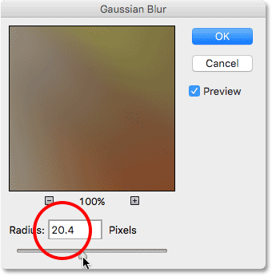
*The Gaussian Blur filter's dialog box.*

I'll click OK to close out of the dialog box, and here's the final result:

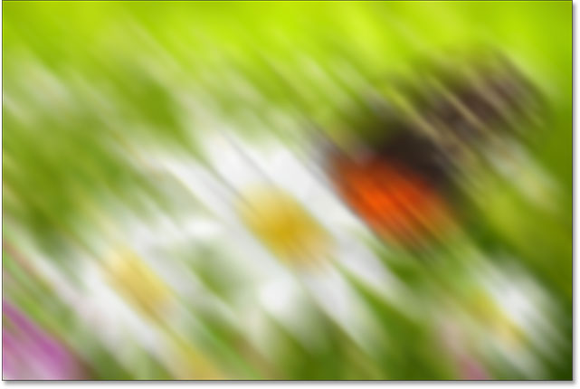
*The effect after applying the Gaussian Blur filter.*

It may *look* like I've blurred the entire image, but if we look in the Layers panel, we see that's not the case. Since the Background copy layer was the active layer when I applied the blur filters, only the Background copy layer was affected.

We can see the blurred image in the Background copy layer's preview thumbnail. The original image on the layer below it was not affected. Its preview thumbnail is still showing the original, untouched image:

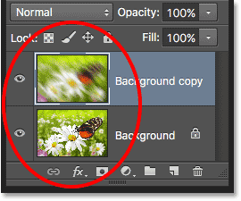
*The preview thumbnails now show very different images on each layer.*

### The Layer Visibility Icon

If I want to see the original photo again in the document, I can simply turn the blurred layer off by clicking its **layer visibility icon** to the left of the preview thumbnail. When the little eyeball is visible, it means the layer is visible in the document. Clicking the icon will hide the eyeball and hide the layer:

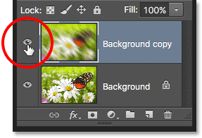
*Click the layer visibility icon to turn a layer off in the document.*

With the blurred layer hidden, the original photo reappears in the document. The blurred layer is still there; we just can't see it at the moment:

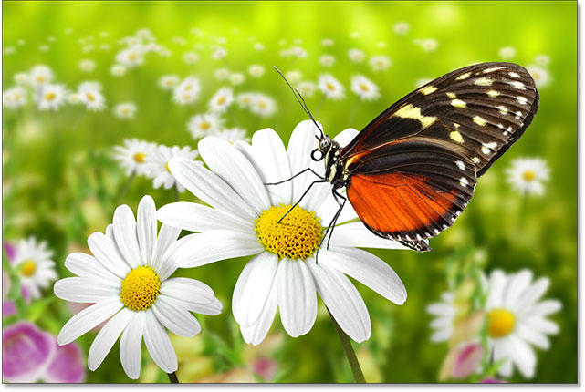
*The original image reappears in the document.*

To turn the blurred layer back on, I just need to click on the empty box where the eyeball used to be:

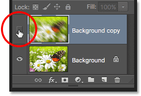
*The layer visibility icon appears empty when a layer is turned off.*

This turns the blurred layer back on the document, once again hiding the original photo from view:

*The blurring effect reappears.*

### Renaming A Layer

As we've seen, Photoshop automatically names layers for us as we add them, but the names it gives them, like "Layer 1" and "Background copy", are pretty generic and not very helpful. When we only have a couple of layers in a document, the names may not seem very important, but when we find ourselves working with 10, 20 or even 100 or more layers, it's much easier to keep them organized if they have meaningful names.

Thankfully, Photoshop makes it easy to rename a layer. Simply **double-click** directly on a layer's name in the Layers panel to highlight it:

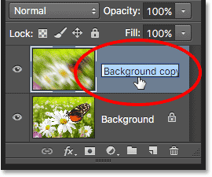
*Renaming the "Background copy" layer.*

Then, type in a new name. I'll change the name of my Background copy layer to "Blur". When you're done, press **Enter** (Win) / **Return** (Mac) on your keyboard to accept the name change:

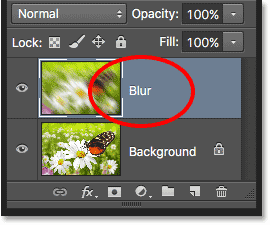
*The "Background copy" layer is now the "Blur" layer.*

### Adding a Layer Mask

Layer masks are essential for much of our Photoshop work. We won't get into the details of them here, but to add a layer mask on a layer, first make sure the layer you want to add it to is selected. Then click the **Layer Mask** icon at the bottom of the Layers panel (the rectangle with the circle in the middle):

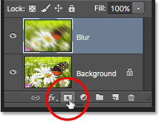
*Add a layer mask by clicking the Layer Mask icon.*

A **layer mask thumbnail** will appear to the right of the layer's preview thumbnail, letting you know that the mask has been added. Notice that the thumbnail is filled with **white**. On a layer mask, white represents the areas of the layer that remain **visible** in the document, while **black** represents areas that will be **hidden**. By default, Photoshop fills new layer masks entirely with white.

Notice also that the layer mask thumbnail shows a **white border** around it. This tells us that the mask, not the actual layer itself, is currently selected and active:

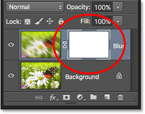
*A layer mask thumbnail appears.*

With the layer mask added, we can paint on it with a brush to reveal part of the original image below the Blur layer. To do that, I'll quickly select Photoshop's **Brush Tool** from the **Tools panel**:

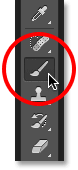
*Selecting the Brush Tool.*

To hide parts of the Blur layer, I'll need to paint on the layer mask with **black**. Photoshop uses the current **Foreground color** as the brush color, so before I start painting, I'll make sure my Foreground color is set to black.

We can see the current Foreground and Background colors in the **color swatches** near the bottom of the Tools panel. By default, whenever we have a layer mask selected, Photoshop sets the Foreground color to white and the Background color to black. To swap them and set the Foreground color to black, all we need to do is press the letter **X** on the keyboard:

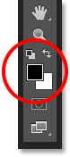
*The Foreground (upper left) and Background (lower right) color swatches.*

With my Foreground color set to black, I'll paint on the layer mask to hide those parts of the Blur layer and reveal the original image on the Background layer below it. You can adjust the size of your brush from the keyboard. Press the **left bracket key** ( **[** ) repeatedly to make the brush **smaller** or the **right bracket key** ( **]** ) to make it **larger**. To make the brush edges **softer**, press and hold your **Shift** key and press the **left bracket key** ( **[** ) repeatedly. To make the edges **harder**, hold **Shift** and press the **right bracket key** ( **]** ):

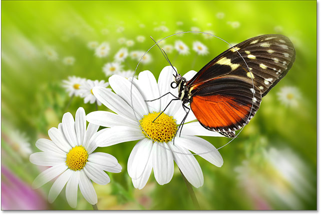
*Painting with black on the layer mask to hide areas of the Blur layer.*

If we look again at the layer mask thumbnail, we see that it's no longer filled with solid white. Some areas are still filled with white, but we can also see the areas where we've painted with black. Again, white on a mask represents the areas of the layer that remain visible in the document, while black areas are hidden from view:

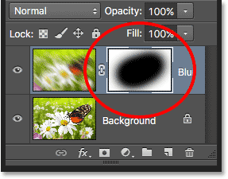
*The layer mask thumbnail after painting with the Brush Tool.*

If everything we just did there was brand new to you, don't worry. Layer masks are a whole other topic, and I explain them in much more detail in our [Understanding Layer Masks in Photoshop](/basics/layers/layer-masks/) tutorial.

#### Adding Fill Or Adjustment Layers

To the right of the Layer Mask icon at the bottom of the Layers panel is the **New Fill or Adjustment Layer** icon. It's the icon that looks like a circle split diagonally between black and white:

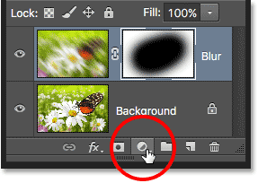
*The New Fill or Adjustment Layer icon.*

Clicking on it opens up a list of fill and adjustment layers we can choose from. Just as an example, I'll select a **Hue/Saturation** adjustment layer from the list:

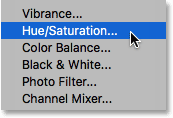
*Selecting a Hue/Saturation adjustment layer.*

A Hue/Saturation adjustment layer lets us easily change the colors in an image. In Photoshop CS6 and CC, the controls for adjustment layers appear in the **Properties panel**. In CS4 and CS5, they appear in the **Adjustments panel**. I'll quickly colorize my image by selecting the **Colorize** option, then I'll set the **Hue** value to **195** for a blue color and I'll increase the **Saturation** value to **60**. Again, don't worry if anything I'm doing here is beyond your current skill level. I'm going through some things quickly just so we can get an overall picture of how much we can do in the Layers panel:

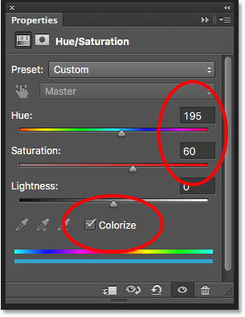
*The Properties panel (CS6 and CC).*

Here's my image after colorizing it:

*The image after colorizing it with a Hue/Saturation adjustment layer.*

Adjustment layers are another topic that falls outside the scope of this tutorial, but the reason why I went ahead and added one anyway was so we can see that any adjustment layers we add to a document appear in the Layers panel just as normal layers do. Here, my Hue/Saturation adjustment layer is sitting above the Blur layer. I’ve dragged the Layers panel a bit wider so the name of the adjustment layer ("Hue/Saturation 1") will fit:

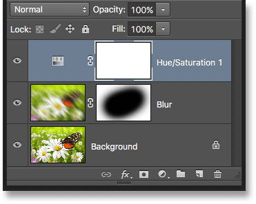
*The Layers panel displays any fill or adjustment layers we've added to the document.*

You can learn more about Photoshop's adjustment layers in our [Non-Destructive Photo Editing With Adjustment Layers](/photo-editing/adjustment-layers/) tutorial and our [Reducing File Sizes With Adjustment Layers](/photo-editing/photoshop-file-size/) tutorial, both of which are found in our [Photo Editing](/photo-editing/) section.

### Changing A Layer's Blend Mode

The Layers panel is also where we can change a layer's **blend mode**, which changes how the layer blends in with the layer(s) below it. The Blend Mode option is found in the upper left of the Layers panel directly below the name tab. It doesn't actually say "Blend Mode" anywhere, but it's the box that says "Normal" in it by default.

To select a different blend mode, click on the word "Normal" (or whatever other blend mode happens to be selected at the time), then choose a different blend mode from the list that appears. I'll select the **Color** blend mode from the list:

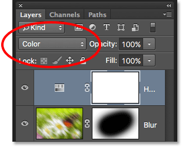
*Changing the blend mode of the active layer.*

By changing the blend mode of the Hue/Saturation adjustment layer from Normal to Color, only the colors themselves in the image are now affected by the adjustment layer. The brightness values (the lights, darks and all the shades in between) are not affected. We can see that my image now appears a bit brighter than it did a moment ago:

*Only the colors in the image are now being changed. The brightness values are unaffected.*

To learn much more about Photoshop's layer blend modes, including the Color blend mode, be sure to read our [Five Essential Blend Modes For Photo Editing](/photo-editing/layer-blend-modes/) tutorial.

### The Opacity And Fill Options

We can control a layer's level of **transparency** from the Layers panel using the **Opacity** option directly across from the Blend Mode option. An opacity value of 100% (the default value) means that we can't see through the layer at all, but the more we lower the opacity value, the more the layer(s) below it will show through. I'm going to lower the opacity of my Hue/Saturation adjustment layer down to 70%:

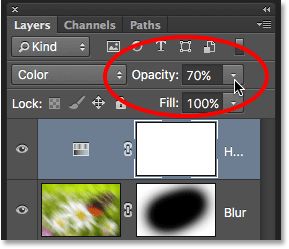
*The Opacity option controls a layer's transparency level.*

With the opacity lowered slightly, the original colors of the image begin to show through:

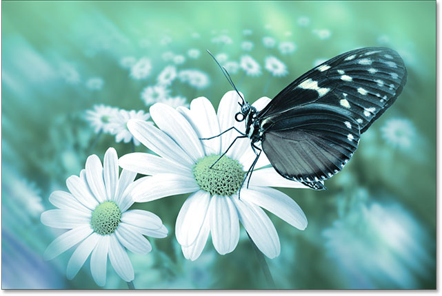
*The original colors now partially show through the adjustment layer.*

Directly below the Opacity option is the **Fill** option. Like Opacity, Fill also controls a layer's level of transparency. In most cases, these two options (Opacity and Fill) behave exactly the same way, but there is one important difference between them that has to do with **layer styles**. Again, we won't get into the details here, but to learn the difference between Opacity and Fill, check out our [Layer Opacity vs Fill](/basics/layers/opacity-vs-fill/) tutorial.

### Grouping Layers

Earlier, we learned that one of the ways we can keep our layers better organized in the Layers panel is by renaming them to something more meaningful. Another way is to group related layers together into a **layer group**. We can create a new layer group by clicking the **New Group** icon at the bottom of the Layers panel. It's the icon that looks like a folder (which is essentially what a layer group is). However, I'm not going to actually click on it because there's a better way to create a layer group:

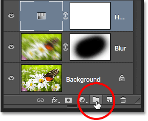
*The New Group icon.*

The problem (it's more of an inconvenience, really) with clicking the New Group icon is that it creates a new but empty group, requiring us to manually drag layers into the group ourselves. It's not a big deal, but there's a better way. I want to place my Blur layer and my adjustment layer into a new group, so the first thing I'll do is select both of them at once. I already have the adjustment layer selected, so to select the Blur layer as well, I simply need to hold down my **Shift** key as I click on the Blur layer, and now both layers are selected at the same time:

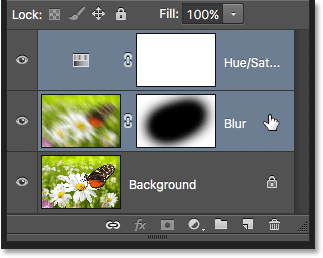
*Selecting both layers at once.*

With both layers now selected, I'll click on the **menu icon** in the top right corner of the Layers panel:

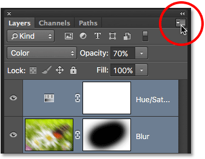
*Clicking the Layers panel menu icon.*

This opens the Layers panel menu. I'll choose **New Group from Layers** from the menu choices:

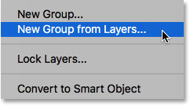
*Choose "New Group from Layers" from the Layers panel menu.*

Before creating the new group, Photoshop will pop open the New Group from Layers dialog box, giving us a chance to name the group and set some other options. I'll click OK to accept the default name and settings:

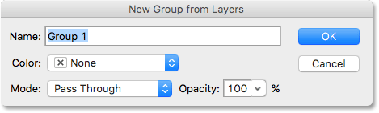
*The New Group from Layers dialog box.*

Photoshop creates the new group, gives it the default name "Group 1", and adds my two selected layers into the group. Layer groups are very much like folders in a filing cabinet. We can open the folder to see what's inside, and we can close the folder to keep everything neat and tidy. By default, layer groups are closed in the Layers panel. To open them and view the layers inside, click on the small **triangle** to the left of the folder icon:

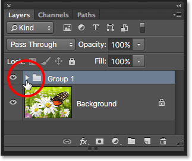
*The two selected layers are now hidden inside the group. Click the triangle to open it.*

This twirls the group open, and we can now see and access the layers inside of it. To close the group again, click again on the triangle icon:

*Layer groups are great for keeping things organized.*

To delete the group, click once again on the **menu icon** in the top right corner of the Layers panel. Then choose **Delete Group** from the menu:

*Choosing the "Delete Group" option.*

Photoshop will ask what it is that you want to delete. If you want to delete both the group *and* the layers inside the group, choose **Group and Contents**. In my case, I want to delete the group but keep the layers inside of it, so I'll choose **Group Only**:

*Choose "Group Only" to delete a group but keep any layers inside of it.*

With the group deleted, we're back to having just our three separate layers:

*The group is gone but the layers remain.*

There's lots of things we can do with layer groups in Photoshop. To learn more, check out our [Layer Groups](/basics/layers/layer-groups/) tutorial.

#### Layer Styles

Also on the bottom of the Layers panel is the **Layer Styles** icon. Layer Styles are also called Layer Effects, which is why it says "fx" in the icon:

*The Layer Styles icon.*

Layer styles give us easy ways to add lots of different effects to layers, including shadows, strokes, glows, and more. Clicking the Layer Styles icon opens a list of effects to choose from. Layer Styles are a whole other topic and beyond what we can cover here, so we'll have a complete tutorial on Layer Styles coming up:

*The Layer Styles menu.*

### Locking Layers

The Layers panel also gives us a few different ways that we can lock certain aspects of a layer. For example, if part of a layer is transparent, we can lock the transparent pixels so that we're only affecting the actual contents of the layer, not the transparent areas. Or we can lock all of the pixels, whether they're transparent or not, to prevent us from making any changes at all to the layer. We can also lock the position of the layer so we can't accidentally move it around inside the document.

There's four lock options to choose from, each represented by a small icon, and they're located just below the Blend Mode option. From left to right, we have **Lock Transparent Pixels**, **Lock Image Pixels** (which locks all of the pixels on the layer, including the transparent ones), **Lock Position**, and **Lock All**. To select any of the lock options, click its icon to enable it. Clicking the same lock option again will disable it. Note that you'll need to select an actual pixel layer (like our Blur layer) for all of the lock options to become available:

*The four layer lock options.*

If any or all of these options are selected, you'll see a small **lock icon** appear on the far right of the locked layer, as we can see on the Background layer which is locked by default:

*A small lock icon indicates one of more aspects of the layer is locked.*

### The Layer Search Bar

A new feature that was first added to the Layers panel in Photoshop CS6 is the **Search Bar** which you'll find along the very top (just below the name tab):

*The Search feature was added to the Layers panel in Photoshop CS6.*

The Search Bar allows us to quickly filter through the layers in a multi-layered document to find a specific layer, view only certain types of layers, or view only the layers that match certain criteria. To use the Search Bar, choose a **filter type** from the drop-down box on the left. By default, the filter type is set to **Kind**, which means we'll be asking Photoshop to show us only a specific kind of layer.

Depending on which filter type you've chosen, you'll see different options to the right of the filter type box. With Kind selected, you'll see a row of icons, each representing a different kind of layer. From left to right, we have **pixel layers**, **adjustment layers**, **type layers**, **shape layers**, and **smart objects**. Clicking on one of these icons will filter the layers in your document and show you only the layers of that specific kind. You can view two or more kinds of layers at once by clicking multiple icons. Click an icon again to deselect it and remove it from the search.

For example, we currently have two pixel layers and one adjustment layer in our document. If we wanted to view only the pixel layers, we could select the **pixel layers** icon. This would hide our adjustment layer and leave only the two pixel layers visible in the Layers panel:

*Filtering the Layers panel to show only the pixel layers.*

Keep in mind, though, that filtering layers in the Layers panel does *not* turn the other layers off in the document. It simply hides them from view in the Layers panel itself. If we look at our image, we can still see the effects of the Hue/Saturation adjustment layer even though the adjustment layer is not currently visible in the Layers panel:

*Filters layers in the Layers panel has no effect on their visibility in the document.*

If I wanted to view only the adjustment layer in my Layers panel, I would click again on the **pixel layers** icon to deselect it and then click on the **adjustment layers** icon beside it:

*Filtering the Layers panel to show only the adjustment layers.*

Clicking on the Filter Type box will show you a list of all the ways we can filter our layers, including by name, layer effect, blend mode, and more. As I mentioned earlier, I'm using Photoshop CS6 here, but if you're using Photoshop CC, you'll find a few additional filtering options at the bottom (Smart Object, Selected and Artboard):

*Click the Filter Type box to view all the ways we can filter our layers.*

We won't go through all of them here, especially since we only have three layers in our document. But as another quick example, I'll change my filtering type from Kind to **Name**, which lets us search for a specific layer based on the name we gave it. This is a great example of why it's so important to name our layers ourselves rather than sticking with Photoshop's generic names like "Layer 1" and "Layer 2".

With Name selected for the filter type, I'll enter the name "Blur" into the search field, and here we see that only my Blur layer remains visible:

*The Name option lets us quickly find a layer by searching for its name.*

To turn off the filtering options, set the filter type back to Kind, then make sure none of the icons are selected. Or, click the **light switch** on the right of the Search Bar to toggle the filter options on and off:

*Click the light switch to enable or disable the Search Bar.*

### Changing The Thumbnail Image Size

One last feature of the Layers panel that often comes in handy is the ability to change the size of the preview thumbnails. Larger thumbnails make it easier for us to preview the contents of each layer, but they also take up more room, limiting the number of layers we can see at once in the Layers panel without having to start scrolling. Large thumbnails can also cause your layer names to appear truncated since they can't fit entirely within the layer row.

To fit more layers into the Layers panel at once, we can make the preview thumbnails smaller, and we can do that by clicking again on the Layers panel **menu icon** and choosing **Panel Options**:

*Choosing "Panel Options" from the Layers panel menu.*

This opens the Layers Panel Options dialog box. At the top of the dialog box is the **Thumbnail Size** option with three sizes to choose from, as well as an option to turn the preview thumbnails off completely (None). I wouldn't recommend choosing None, but I'll select the smallest of the three sizes:

*Choose from three different sizes for the preview thumbnails.*

Once you've chosen a size, click OK to close out of the dialog box. We can see in my Layers panel that, with the preview thumbnails now much smaller, everything fits much better. You can go back and change the thumbnail size at any time:

*Smaller thumbnail images leave more room for more layers.*

### Where to go from here...

And there we have it! In the next lesson, we'll look at some essential [Layers panel preferences](/basics/layers/essential-layers-panel-preferences/) that will help us customize the Layers panel and keep it free of clutter so we can work in Photoshop more efficiently!

You can jump to any of the other lessons in this [Photoshop Layers series](/photoshop-layers-learning-guide/). Or visit our [Photoshop Basics](/basics/) section for more topics!