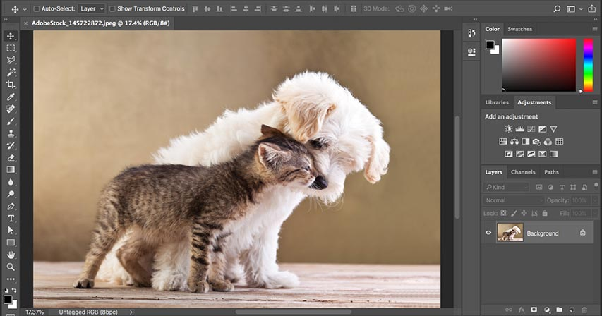

# Getting Around in Photoshop – Learning the Interface

> Source: [https://www.photoshopessentials.com/basics/learning-the-photoshop-interface/](https://www.photoshopessentials.com/basics/learning-the-photoshop-interface/)
> Downloaded and converted to Markdown.

From tools and panels to document windows, workspaces, screen modes and more! Everything you need to know about Photoshop's interface. Chapter 3 of our Photoshop Basics series!

We start with a general [tour of Photoshop's interface](/basics/getting-know-photoshop-interface/ "View tutorial") and its many features. Then we explore [Photoshop's tools and the toolbar](/basics/photoshop-tools-toolbar-overview/ "View tutorial"), including [how to reset the toolbar](/basics/reset-toolbar-photoshop-cc/ "View tutorial") and, new in Photoshop CC, [how to customize the toolbar](/basics/custom-toolbar-photoshop/ "View tutorial") to the way you work! From there, you'll learn [how to manage and work with panels](/basics/managing-panels-photoshop-cc/ "View tutorial"), and the difference between [tabbed documents and floating windows](/basics/tabbed-and-floating-documents-in-photoshop/ "View tutorial").

You'll discover how Photoshop's [multi-document layouts](/basics/view-multiple-images-photoshop/ "View tutorial") let you view two or more images at once, and even [how to move images between documents](/basics/5-ways-move-images-photoshop-documents/ "Vierw tutorial")! And we'll finish off this chapter by learning how to streamline and customize Photoshop's interface using [workspaces](/basics/photoshop-workspaces/ "View tutorial"), and how to maximize your work area with [screen modes](/basics/photoshop-screen-modes-interface-tricks/ "View tutorial")!

If you're learning Photoshop from the beginning, you'll want to make sure you've read through **Chapter 1,** [Getting Started With Photoshop](/basics/getting-started-photoshop/ "View chapter 1"), and **Chapter 2**, [Opening Images Into Photoshop](/basics/opening-images-photoshop/ "View chapter 2"), before you continue.

Need printable versions of these tutorials? All of our Photoshop tutorials are now available to [download as PDFs](/print-ready-pdfs/ "Download the PDFs")! Let's get started!

Completed all 10 lessons in Chapter 3? Congratulations! You're ready to move on to [Chapter 4 - Navigating Images in Photoshop](/basics/photoshop-image-navigation/ "Continue to Chapter 4"). Or visit our [Photoshop Basics](/basics/ "View our Photoshop Basics tutorials") section for more chapters and tutorials!