# The Legacy New Document Dialog Box In Photoshop CC

> Source: [https://www.photoshopessentials.com/basics/legacy-new-document-dialog-box-photoshop-cc/](https://www.photoshopessentials.com/basics/legacy-new-document-dialog-box-photoshop-cc/)
> Downloaded and converted to Markdown.

In a previous tutorial, we learned all about the completely redesigned New Document dialog box in Photoshop CC 2017 and how to use it to create new Photoshop documents. While many of us will see the redesign as an improvement, not everyone will agree. 

Long-time Photoshop users may prefer the smaller, more compact layout of the original New Document dialog box. Even if you're new to Photoshop, you may want to try both versions (the redesign and the original) to see which one you like best.

Thankfully, the original New Document dialog box is still around in Photoshop CC 2017. Adobe now calls it the "legacy" New Document dialog box, and in this tutorial, we'll learn how to easily switch between the redesigned version and the legacy version. We'll also take a quick look at how the legacy version works. Let's get started!

## The Redesigned New Document Dialog Box

By default, when we open the New Document dialog box in Photoshop CC, it now appears in its redesigned layout. I'll open it by clicking the **New...** button on Photoshop's [Start screen](/basics/updated-start-workspace-photoshop-cc/). We can also open the New Document dialog box by going up to the **File** menu at the top of the screen and choosing **New**, or by pressing the keyboard shortcut, **Ctrl+N** (Win) / **Command+N** (Mac):

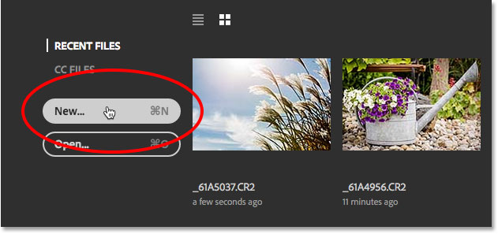
*Clicking the New... button on the Start screen.*

Whichever way you choose, the redesigned New Document dialog box appears. I covered the redesigned version in detail in our [How To Create New Documents In Photoshop CC](/basics/create-new-documents-photoshop-cc/) tutorial. Here, we'll focus just on the original, "legacy" version which we'll be seeing in a moment:

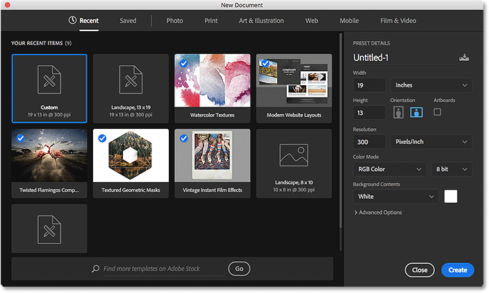
*The redesigned New Document dialog box in Photoshop CC 2017.*

I'll close out of the dialog box for now by clicking the **Close** button in the lower right. This closes the dialog box without actually creating a new document:

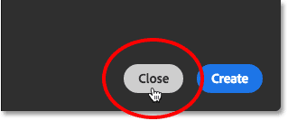
*Clicking the Close button.*

## The Legacy New Document Dialog Box

We can easily switch between the redesigned and the original version of the dialog box using Photoshop's Preferences. On a Windows PC, go up to the **Edit** menu in the Menu Bar along the top of the screen, choose **Preferences**, and then choose **General**. On a Mac, go up to the **Photoshop CC** menu at the top of the screen, choose **Preferences**, then choose **General**:

*Going to Edit (Win) / Photoshop CC (Mac) > Preferences > General.*

This opens the Preferences dialog box set to the General options. Look for the option that says **Use Legacy "New Document" Interface**. Click inside its checkbox to enable it:

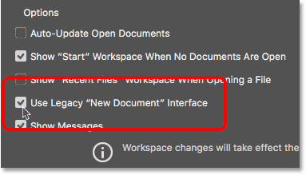
*Selecting the 'Use Legacy "New Document" Interface option.*

The change is instant so there's no need to quit and relaunch Photoshop for it to take effect. All we need to do is close out of the Preferences dialog box by clicking **OK**:

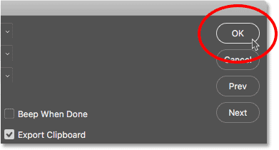
*Closing the Photoshop Preferences dialog box.*

Then, back on the Start screen, I'll once again click the **New...** button to create a new document:

*Clicking the New... button once again.*

The New Document dialog box re-opens, but this time as the smaller, legacy version. The values you see for your various settings may be different than mine, and that's because the dialog box opens with the last settings you used. If you haven't yet created a new document, it will be set to Photoshop's default document size:

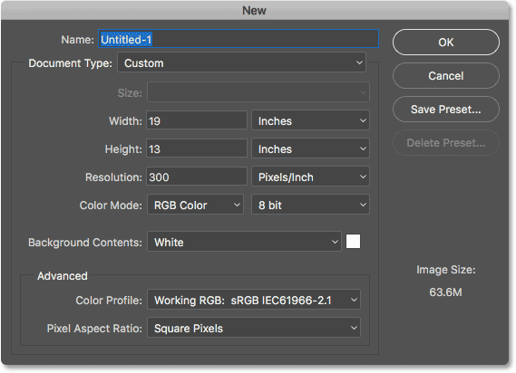
*The legacy New Document dialog box in Photoshop CC 2017.*

## Naming The New Document

Let's take a quick look at how the legacy version works. First, we can give our new document a name using the **Name** field at the top. If you don't name your document here, Photoshop will ask you to name it when you go to save the document later, so you don't really need to name it at this point. However, just as an example, I'll name the document "My new document":

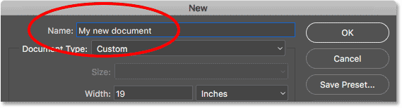
*Naming the new document.*

## Choosing A Preset

Just like with the redesigned New Document dialog box, we can start by seeing if there's already a preset we can use that matches the document size we need. Photoshop includes a few built-in presets, and as we'll see later, we can also create our own.

First, select the type of document you want to create by clicking the **Document Type** option. Mine is currently set to Custom. Yours may be set to something different:

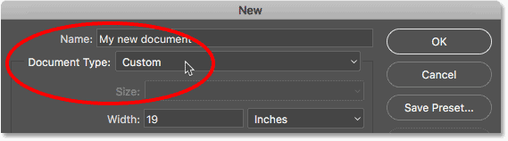
*Clicking the Document Type option.*

Then, choose the category that matches your document type. Most of the categories from the redesigned New Document dialog box are here (Photo, Web, Mobile, Art & Illustration), as well as a few others. I'll choose **Photo**:

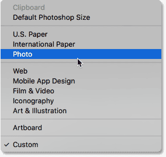
*Selecting the Photo category.*

To view the list of presets for your chosen category, click the **Size** option:

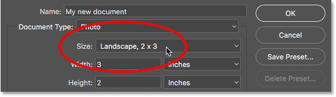
*Clicking the Size option to view the presets.*

Then, choose a preset from the list. I'll choose **Landscape, 8 x 10**:

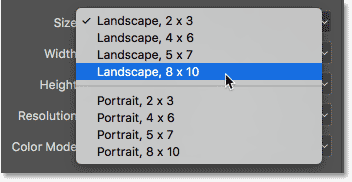
*Choosing a Photo preset.*

Once you've chosen a preset, you'll see your various document settings update. In my case, since I chose the Landscape 8 x 10 preset, we see that my **Width** value is now set to **10 inches**, the **Height** is set to **8 inches**, and the **Resolution** of the document is set to **300 Pixels/Inch** (a universal standard for high quality printing). Other settings like **Color Mode**, **Background Contents** and **Color Profile** are also based on the chosen preset:

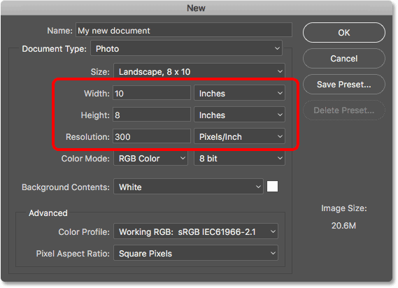
*The document settings update to the preset values.*

If you're happy with the settings, click the **OK** button in the upper right corner to close the dialog box and create your new document. I'm not going to do that just yet because in the next section, we'll learn how to create a new document using our own custom settings:

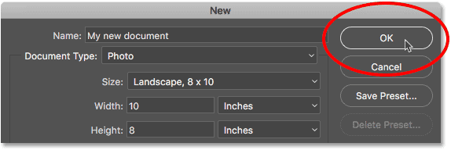
*Click OK to accept your settings and create your new document.*

## Using Custom Document Settings

If you've gone through the presets and none of them will give you the document size you're looking for, you can easily create a document using your own custom settings. Simply enter whatever values you need into the various options.

For example, if I want to create a Photoshop document that's 11 inches by 14 inches, all I need to do is set the **Width** to **11 inches** and the **Height** to **14 inches**. This will give me a document in **portrait** orientation. If I needed **landscape** orientation instead, I'd swap the values, setting the **Width** to **14 inches** and the **Height** to **11 inches**. In the redesigned New Document dialog box, there are handy buttons for instantly switching between portrait and landscape orientation. In the legacy version, we need to do it manually.

I also want to be able to print this document in high quality, so I'll leave the **Resolution** value set to **300 Pixels/Inch**. If you're creating a document for the web or for a mobile device, you don't need to worry about the [Resolution value](/essentials/the-72-ppi-web-resolution-myth/).

Notice that as soon as you start entering custom values, the **Document Type** option at the top will switch from whatever preset you had chosen previously to **Custom**:

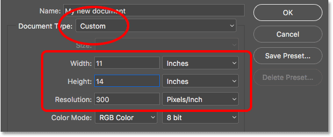
*Entering custom values for the new document.*

**Learn more:** [Image Resolution And Print Quality](/essentials/image-quality/)

I've used inches as my measurement type here, but if you click on the **Measurement Type** box for either the Width or the Height, you'll see other types you can choose from, like pixels, for example, which would be a better choice for web or mobile layouts:

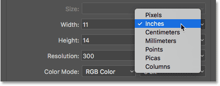
*Inches is just one of several measurement types we can choose from.*

Another option you might want to change is **Background Contents**. The default background color for a new Photoshop document is **white**. In most cases, white works fine, but to change it, click on the Background Contents box and choose a different option from the list.

One thing to note here is that unlike the redesigned New Document dialog box where we need to first open the Advanced Options before **Transparent** will appear in the Background Contents list, in the legacy version, it's available to us right away.

Choosing **Other...** at the bottom of the list will open Photoshop's **Color Picker** where you can choose a specific color for the background. You can also open the Color Picker by clicking the **color swatch** to the right of the Background Contents box:

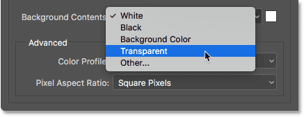
*The Background Contents options.*

Other options we can change, which are also available in the redesigned New Document dialog box, are [Color Mode](/essentials/rgb/), [Bit Depth](/essentials/16-bit/) (directly to the right of Color Mode) and [Color Profile](/essentials/essential-photoshop-color-settings-photographers/). These are more advanced options so if you're not familiar with them, you can safely leave them set to their defaults:

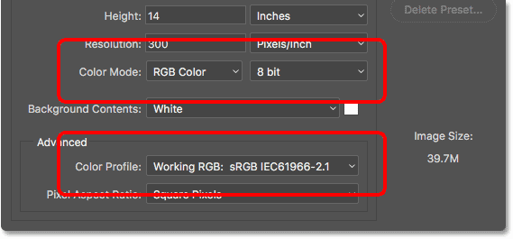
*The Color Mode, Bit Depth and Color Profile options.*

When you're happy with your settings, click the **OK** button in the top right corner to close the New Document dialog box and create your new document. Again, I'm not going to do that just yet because we have one more topic to cover, which is how to save our settings as a custom preset:

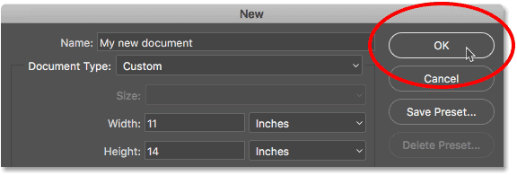
*Click OK to create your new custom Photoshop document.*

## Creating A Custom Preset

Just like with the redesigned New Document dialog box, we can save our custom settings as a new preset. To create a new preset, click the **Save Preset...** button:

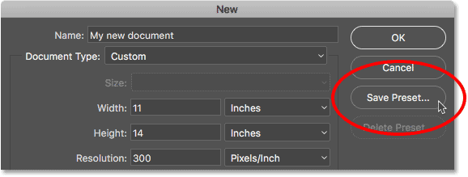
*Clicking "Save Preset...".*

This opens the **New Document Preset** dialog box. Give your new preset a descriptive name. I'll name mine "Landscape, 11 x 14". Photoshop will automatically save the Width and Height values in the preset. To save other settings as well, like Resolution and Background Contents, make sure the ones you need are selected (checked). By default, every option is selected, so unless you have a reason to not include a specific option, all you really need to do here is give your preset a name:

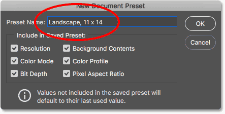
*Naming the preset in the New Document Preset dialog box.*

Click OK to save your preset and close out of the New Document Preset dialog box. If you then click on the **Document Type** option in the New Document dialog box, you'll see your saved preset in the list, ready to be selected again the next time you need it:

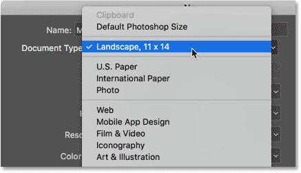
*The saved preset now appears as a Document Type option.*

If you ever need to delete the preset, first select the preset from the Document Type option, then click the **Delete Preset...** button:

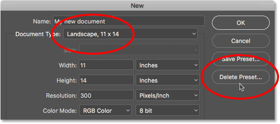
*Select the preset you want to delete, then click Delete Preset.*

With my preset saved, I'll finally go ahead and click the **OK** button in the top right corner:

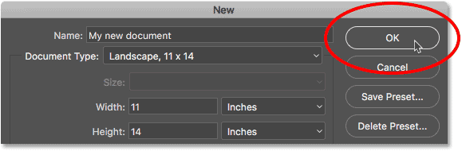
*Clicking OK to create the new document.*

This closes the New Document dialog box and opens my new document in Photoshop:

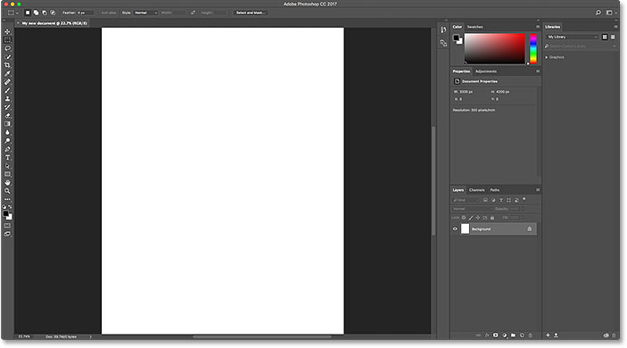
*The new document opens in Photoshop.*

## Switching Back To The Redesigned New Document Dialog Box

If, after giving the legacy New Document dialog box a try, you decide that you like the redesigned version better, simply return to Photoshop's General Preferences by going up to the **Edit** (Win) / **Photoshop CC** (Mac) menu, choosing **Preferences**, and then choosing **General**. You can also open the General Preferences using the keyboard shortcut, **Ctrl+K** (Win) / **Command+K** (Mac):

*Going to Edit (Win) / Photoshop CC (Mac) > Preferences > General.*

Then, to revert back to the redesigned version, uncheck the **Use Legacy "New Document" Interface** option:

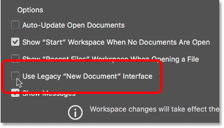
*Unchecking 'Use Legacy "New Document" Interface' in the General Preferences.*

And there we have it! That's how to easily switch between the redesigned and the legacy New Document dialog box, along with how to create new documents using the legacy version, in Photoshop CC 2017! The one big feature of the redesigned New Document dialog box that's not available to us in the legacy version is **templates**. New in Photoshop CC 2017, we can now create new documents from templates which allow us to add our own images to pre-made layouts and effects. To use the templates feature, you'll need the [redesigned New Document dialog box](/basics/create-new-documents-photoshop-cc/). I'll cover how to use templates in a separate tutorial.