# The Magic Wand Tool In Photoshop

> Source: [https://www.photoshopessentials.com/basics/selections/magic-wand-tool/](https://www.photoshopessentials.com/basics/selections/magic-wand-tool/)
> Downloaded and converted to Markdown.

The **Magic Wand Tool**, known simply as the Magic Wand, is one of the oldest selection tools in Photoshop. Unlike other selection tools that select pixels in an image based on [shapes](/basics/selections/rectangular-marquee-tool/) or by [detecting object edges](/basics/selections/magnetic-lasso-tool/), the Magic Wand selects pixels based on **tone and color**. Many people tend to get frustrated with the Magic Wand (giving it the unfortunate nickname "tragic wand") because it can sometimes seem like it's impossible to control which pixels the tool selects.

In this tutorial, we're going to look beyond the magic, discover how the wand really works, and learn to recognize the situations that this ancient but still extremely useful selection tool was designed for.

This tutorial is from our [How to make selections in Photoshop](/basics/make-selections-photoshop/) series.

## How To Use The Magic Wand Tool

### Selecting The Magic Wand

If you're using Photoshop CS2 or earlier, you can select the Magic Wand simply by clicking on its icon in the Tools palette. In Photoshop CS3, Adobe introduced the Quick Selection Tool and nested it in with the Magic Wand, so if you're using CS3 or later (I'm using Photoshop CS5 here), you'll need to click on the Quick Selection Tool in the Tools panel and keep your mouse button held down for a second or two until a fly-out menu appears. Select the Magic Wand from the menu:

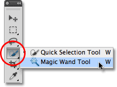
*The Magic Wand is nested behind the Quick Selection Tool in Photoshop CS3 and later.*

### The "Magic" Behind The Wand

Before we look at a real world example of the Magic Wand in action, let's see how the tool works and how there's really nothing magical about it. Here's a simple image I've created showing a black to white gradient separated by a solid red horizontal bar through its center:

*A simple gradient divided by a red bar, but you knew that already.*

As I mentioned, Photoshop's Magic Wand selects pixels based on tone and color. When we click on an area in the image with the tool, Photoshop looks at the tone and color of the area we clicked on and selects pixels that share the same color and brightness values. This makes the Magic Wand exceptional at selecting **large areas of solid color**.

For example, let's say I want to select the horizontal red bar. All I need to do is click anywhere on the red bar with the Magic Wand. Photoshop will see that I've clicked on an area of red and will instantly select every pixel in the image that shares that same shade of red, effectively selecting the red bar for me just by clicking on it:

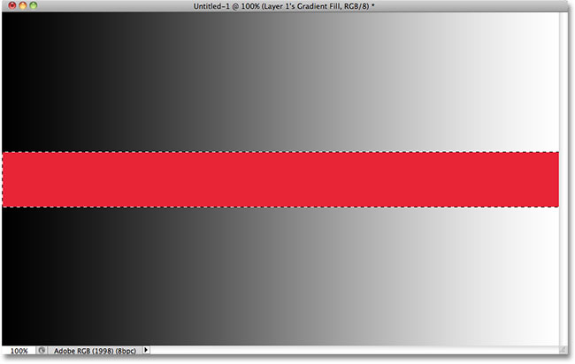
*One click with the Magic Wand is all it took to select the entire red bar.*

### Tolerance

Selecting the solid colored red bar was easy enough, since there were no other pixels in the image that shared the same shade of red, but let's see what happens if I click with the Magic Wand on one of the gradients. I'll click on an area of middle gray in the center of the gradient above the red bar:

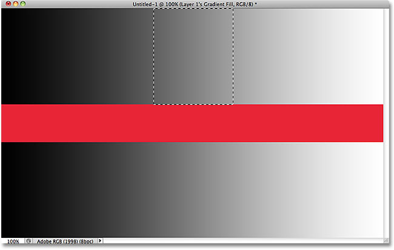
*The selected area after clicking in the middle of the upper gradient.*

This time, Photoshop selected an entire range of brightness values rather than limiting itself to pixels that were exactly the same tone and color as the middle gray area I clicked on. Why is that? To find the answer, we need to look up in the Options Bar along the top of the screen. More specifically, we need to look at the **Tolerance** value:

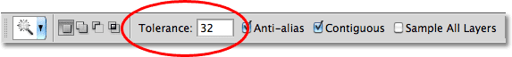
*The Magic Wand's Tolerance option.*

The Tolerance option tells Photoshop how different in tone and color a pixel can be from the area we clicked on for it to be included in the selection. By default, the Tolerance value is set to 32, which means that Photoshop will select any pixels that are the same color as the area we clicked on, plus any pixels that are up to 32 shades darker or 32 shades brighter. In the case of my gradient, which contains a total of 256 brightness levels between (and including) pure black and pure white, Photoshop selected the entire range of pixels that fell between 32 shades darker and 32 shades brighter than the shade of gray I initially clicked on.

Let's see what happens if I increase the Tolerance value and try again. I'll increase it to 64:

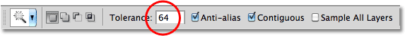
*Doubling the Tolerance value from 32 to 64.*

With Tolerance now set twice as high as it was originally, if I click with the Magic Wand on the exact same center spot in the gradient, Photoshop should now select an area twice as large as it did last time, since it will include all the pixels that are between 64 shades darker and 64 shades lighter than the initial shade of gray I click on. Sure enough, that's what we get:

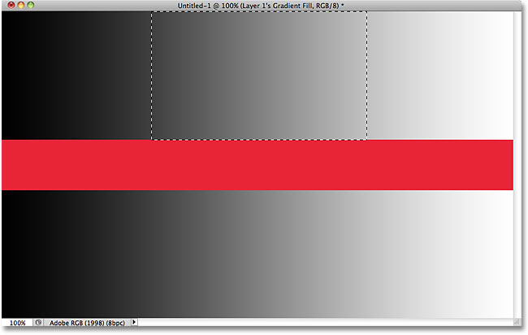
*This time, with a Tolerance setting twice as high, the selected area of the gradient is twice as large.*

What if I want to select just the specific shade of gray I click on in the gradient and nothing else? In that case, I'd set my Tolerance value to 0, which tells Photoshop not to include any pixels in the selection except those that are an exact match in color and tone to the area I click on:

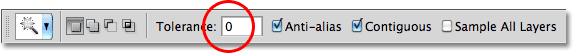
*Setting the Tolerance value to 0.*

With Tolerance set to 0, I'll click again on the same spot in the center of the gradient, and this time, we get a very narrow selection outline. Every pixel that's not an exact match to the specific shade of gray I clicked on is ignored:

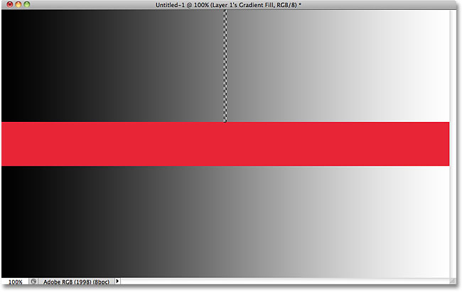
*Increasing or decreasing the Tolerance value has a big impact on which pixels in the image are selected with the Magic Wand.*

You can set the Tolerance option to any value between 0 and 255. The higher the value, the wider the range of pixels that Photoshop will select. A Tolerance setting of 255 will effectively select the entire image, so you'll usually want to try a lower value.

### Contiguous

As we were exploring the effect the Tolerance setting has on Magic Wand selections, you may have noticed something strange. Each time I clicked on the gradient above the red bar, Photoshop selected a certain range of pixels but *only* in the gradient I was clicking on. The gradient below the red bar, which is identical to the gradient I was clicking on, was completely ignored, even though it obviously contained shades of gray that should have been included in the selection. Why were the pixels in the lower gradient not included?

The reason has to do with another important option in the Options Bar - **Contiguous**. With Contiguous selected, as it is by default, Photoshop will only select pixels that fall within the acceptable tone and color range determined by the Tolerance option *and* are side by side each other in the same area you clicked on. Any pixels that are within the acceptable Tolerance range but are separated from the area you clicked on by pixels that fall outside the Tolerance range will not be included in the selection.

In the case of my gradients, the pixels in the bottom gradient that should otherwise have been included in the selection were ignored because they were cut off from the area I clicked on by the pixels in the red bar which were not within the Tolerance range. Let's see what happens when I uncheck the Contiguous option. I'll also reset my Tolerance setting to its default value of 32:

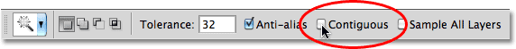
*Contiguous is selected by default. Click inside the checkbox to deselect it if needed.*

I'll click again in the center of the upper gradient with the Magic Wand, and this time, with Contiguous unchecked, the pixels in the bottom gradient that fall within the Tolerance range are also selected, even though they're still separated from the area I clicked on by the red bar:

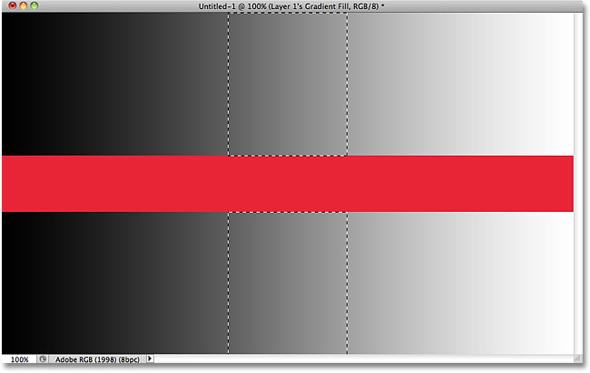
*With Contiguous unchecked, any pixels anywhere in the image that fall within the Tolerance range will be selected.*

Up next, we'll look at some additional options for the Magic Wand and a real world example of it in action as we use it to quickly select and replace the sky in a photo!

### Additional Options

Tolerance and Contiguous are the two options that have the biggest impact on the Magic Wand, but there's a couple of other options worth noting. Since the Magic Wand selects pixels and pixels are square-shaped, our selection edges can sometimes appear harsh and jagged, often referred to as a "stair stepping" effect. Photoshop can smooth out the edges by applying a slight blur to them, a process known as **anti-aliasing**. We can turn anti-aliasing for the Magic Wand on and off by checking or unchecking the **Anti-alias** option in the Options Bar. By default, it's enabled and in most cases you'll want to leave it enabled:

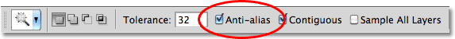
*Leave anti-aliasing enabled with the Magic Wand to smooth out otherwise jagged selection edges.*

Also by default, when you click on an image with the Magic Wand, it looks for pixels to select only on the layer that's currently active in the Layers panel. This is usually what we want, but if your document contains multiple layers and you want Photoshop to include all the layers in your selection, select the **Sample All Layers** option in the Options Bar. It's unchecked by default:

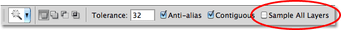
*Leave Sample All Layers unchecked to limit your selection to the active layer.*

### Real World Example

Here's an image I have open in Photoshop. I like the photo in general, but the sky could look more interesting. I think I'll replace the sky with a different one:

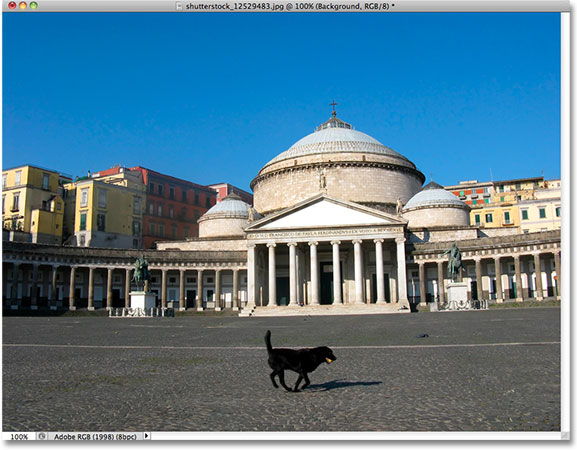
*The clear blue sky looks a bit bland.*

Replacing the sky means I'll first need to select it. As I mentioned earlier, the Magic Wand excels at selecting large areas of solid color, and since the sky is clear blue with only a slight variation in the tone, the Magic Wand will make selecting it easy. With the tool selected and all of its options in the Options Bar set back to their defaults (Tolerance 32, Contiguous checked), I'll click somewhere in the top left of the image:

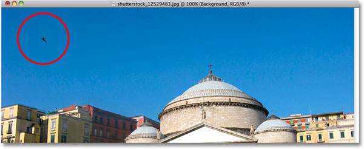
*Clicking with the Magic Wand in the top left of the sky.*

If the sky had been solid blue, the Magic Wand would have had no trouble selecting all of it with that one single click. However, the sky actually transitions from a lighter shade of blue just above the buildings to a darker shade near the top of the photo, and my Tolerance value of 32 wasn't quite high enough to cover that entire range of tonal values, leaving a large area of the sky directly above the buildings out of the selection:

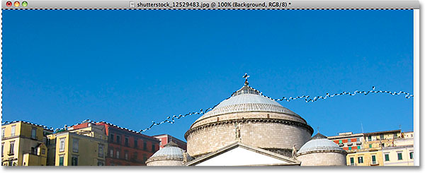
*Some lighter areas of the sky just above the buildings were not included in the selection.*

### Adding To Selections

Since my initial attempt failed to select the entire sky because my Tolerance value was too low, I *could* try again with a higher Tolerance value, but there's an easier way to fix the problem. As with Photoshop's other selection tools, the Magic Wand has the option to **add to existing selections**, which means I can keep the selection I've started with and simply add more of the sky to it!

To add to a selection, hold down your **Shift** key and click in the area you need to add. You'll see a small **plus sign** (**+**) appear in the bottom left of the Magic Wand's cursor icon letting you know you're about to add to the selection. In my case, with Shift held down, I'll click somewhere inside the sky that wasn't included in the selection initially:

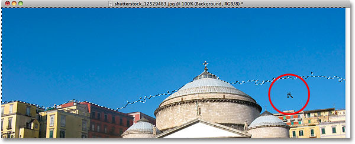
*Holding the Shift key down and clicking on the area I need to add.*

And just like that, Photoshop was able to add the remaining area of the sky to the selection. Two clicks with the Magic Wand was all it needed:

*The entire sky is now selected.*

### Selecting What You Don't Want First

Of course, since the sky is being replaced, what I *should* have selected in the image was everything *below* the sky, since that's the area I want to keep. But drawing a selection outline along the tops of the buildings with one of Photoshop's other selection tools like the [Polygonal Lasso Tool](/basics/selections/polygonal-lasso-tool/) or the [Magnetic Lasso Tool](/basics/selections/magnetic-lasso-tool/) would have taken more time and effort, while selecting the sky with the Magic Wand was quick and easy. This brings us to a popular and very handy technique to use with the Magic Wand, which is to select the area you *don't* want first and then **invert** the selection!

To invert the selection, which will select everything that wasn't selected (in my case, everything below the sky) and deselect everything that was (the sky itself), go up to the **Select** menu at the top of the screen and choose **Inverse**. Or, for a faster way to invert selections, use the keyboard shortcut **Shift+Ctrl+I** (Win) / **Shift+Command+I** (Mac):

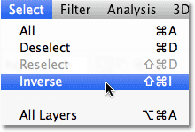
*Go to Select > Inverse.*

With the selection now inverted, the sky is no longer selected while everything below it in the image is:

*The area I need to keep is now selected.*

To replace the sky at this point, I'll press **Ctrl+J** (Win) / **Command+J** (Mac) to quickly copy the area I'm keeping to a new layer in the Layers panel:

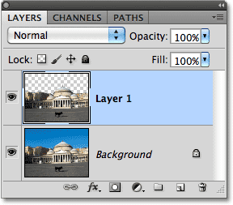
*The selection has been copied to a new layer above the original image.*

Next, I'll open the image I want to replace the original sky with. I'll press **Ctrl+A** (Win) / **Command+A** (Mac) to quickly select the entire image, then **Ctrl+C** (Win) / **Command+C** (Mac) to copy it to the clipboard:

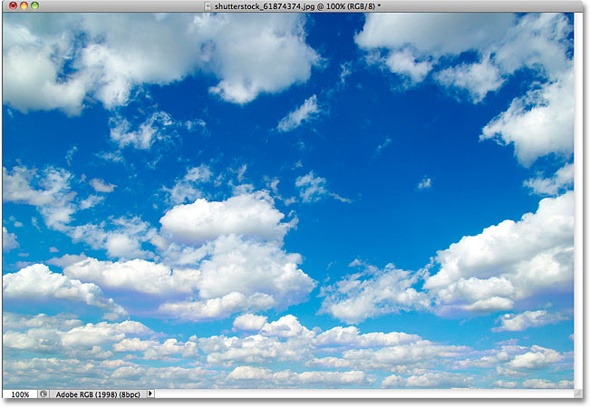
*The photo that will replace the sky in the original image.*

I'll switch back over to my original image and I'll click on the Background layer in the Layers panel to select it so that, when I paste the other sky photo into the document, it will appear between my existing two layers:

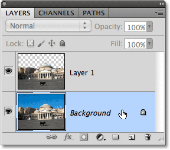
*Selecting the Background layer.*

Finally, I'll press **Ctrl+V** (Win) / **Command+V** (Mac) to paste the new image into the document. Everyone loves a blue sky, but sometimes a few clouds can make a bigger impact:

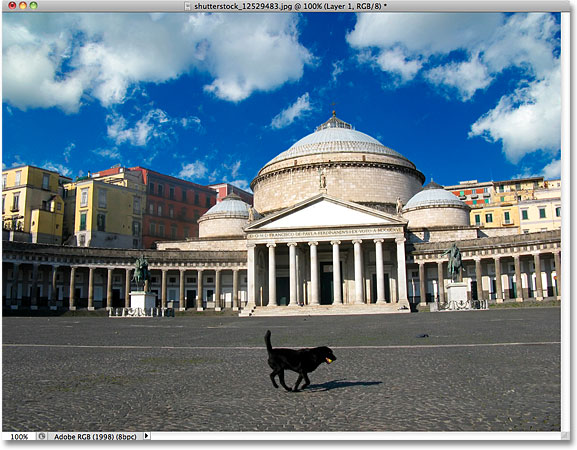
*The sky has successfully (and quite easily) been replaced.*

Like Photoshop's other selection tools, the trick to using the Magic Wand successfully and avoiding frustration is knowing when to use it and when to try something else. As we've seen in this tutorial, the Magic Wand's biggest strength is its ability to select large areas of pixels that all share the same or similar color and tone, making it perfect for things like selecting and replacing a simple sky in a photo, or for any image where the object you need to select is in front of a solid or similarly colored background. Use the "select what you don't want first" trick for times when selecting the area around the object with the Magic Wand would be faster and easier than selecting the object itself with a different tool.

And there we have it! For more about Photoshop's selection tools, see our [How to make selections in Photoshop](/basics/make-selections-photoshop/) series. Visit our [Photoshop Basics](/basics/) section for more Photoshop topics!