# The Magnetic Lasso Tool In Photoshop

> Source: [https://www.photoshopessentials.com/basics/selections/magnetic-lasso-tool/](https://www.photoshopessentials.com/basics/selections/magnetic-lasso-tool/)
> Downloaded and converted to Markdown.

If someone told you there's a selection tool in Photoshop that can select an object in a photo with 100% accuracy and all you have to do is drag a loose, lazy outline around the object with your mouse, would you believe them? No? Good for you. That person is just messin' with your head.

But what if someone told you there's a selection tool that can select an object with, say, 80-90% accuracy and all you have to do is drag that same lazy outline around it? Would you believe them now? Still no? Well, that's too bad, because there really *is* a selection tool like that. It's called the **Magnetic Lasso Tool**, and with a little practice and a basic understanding of how it works, not only will you be a believer, but you just may find yourself hopelessly attracted to it.

This tutorial is from our [How to make selections in Photoshop](/basics/make-selections-photoshop/ "Learn how to use the Photoshop selection tools") series.

The Magnetic Lasso Tool is one of three lasso tools in Photoshop. We've already looked at the first two - the standard **[Lasso Tool](../lasso-tool/)** and the **[Polygonal Lasso Tool](../polygonal-lasso-tool/)** - in previous tutorials. Like the Polygonal Lasso Tool, the Magnetic Lasso Tool can be found nested behind the standard Lasso Tool in the Tools panel. To access it, click and hold your mouse button down on the Lasso Tool until a fly-out menu appears, then select the Magnetic Lasso Tool from the list:

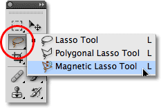
*The Magnetic Lasso Tool is hiding behind the standard Lasso Tool in the Tools panel.*

Once you've selected the Magnetic Lasso Tool, it will appear in place of the standard Lasso Tool in the Tools panel. To switch back to the Lasso Tool later, or to select the Polygonal Lasso Tool, click and hold on the Magnetic Lasso Tool until the fly-out menu reappears, then select either of the other two lasso tools from the list:

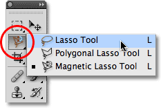
*The lasso tool you selected last appears in the Tools panel. Select the other two from the fly-out menu.*

You can cycle through the three lasso tools from your keyboard. Just hold down your **Shift** key and press the letter **L** repeatedly to switch between them (note that you may not need to include the Shift key depending on how you have things set up in Photoshop's Preferences).

Why is it called the Magnetic Lasso Tool? Well, unlike the standard Lasso Tool which gives you no help at all and relies entirely on your own ability to manually trace around the object, usually with less than stellar results, the Magnetic Lasso Tool is an **edge detection tool**, meaning that it actively searches for the edge of the object as you're moving around it, then snaps the selection outline to the edge and clings to it like a magnet!

Does this mean that Photoshop actually recognizes the object in the photo that you're trying to select? It can certainly appear that way, but no. As we learned when we looked at **[why we need to make selections in Photoshop](../why-make-selections/)**, all Photoshop ever sees is pixels of different color and brightness levels, so the Magnetic Lasso Tool tries to figure out where the edges of an object are by looking for differences in color and brightness values between the object you're trying to select and its background.

### A Better Icon For Better Selections

Of course, if the Magnetic Lasso Tool was forced to always look at the entire image as it tried to find the edges of your object, chances are it wouldn't do a very good job, so to keep things simple, Photoshop limits the area where the tool looks for edges. The problem is that by default, we have no way of seeing how wide this area is, and that's because the mouse cursor for the Magnetic Lasso Tool doesn't really tell us anything. The little magnet lets us know that we have the Magnetic Lasso Tool selected, of course, but that's about it:

*An enlarged view of the Magnetic Lasso Tool icon.*

For a much more useful icon, press the **Caps Lock** key on your keyboard. This switches the icon to a circle with a small crosshair in the center. The circle represents the width of the area that Photoshop looks for edges. Only the area inside the circle is looked at. Everything outside of it is ignored. The closer a potential edge is to the crosshair in the center of the circle, the more importance Photoshop gives it when trying to determine where the edges of your object are:

*Changing the icon to a circle allows us to see exactly where Photoshop is looking for edges.*

### Using The Magnetic Lasso Tool

Here's a photo I have open in Photoshop of a Chinese sculpture. The edges of the sculpture are well defined, so I could try to select it by tracing around it with the standard Lasso Tool. At least, I *could* do that if I was looking for an excuse to pull my hair out in frustration. A much better choice here would be the Magnetic Lasso Tool since it will end up doing most of the work for me:

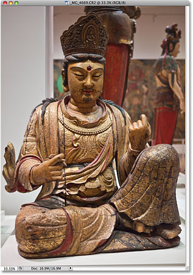
*The Magnetic Lasso Tool should have little trouble selecting the sculpture.*

To begin a selection with the Magnetic Lasso Tool, simply move the crosshair in the center of the circle directly over an edge of the object and click once, then release your mouse button. This sets a starting point for the selection. Once you have your starting point, move the Magnetic Lasso Tool around the object, always keeping the edge within the boundaries of the circle. You'll see a thin line extending out from the cursor as you drag, and Photoshop will automatically snap the line to the edge of the object, adding anchor points as it goes along to keep the line fastened in place. Unlike the standard Lasso Tool, there's no need to keep your mouse button held down as you drag around the object:

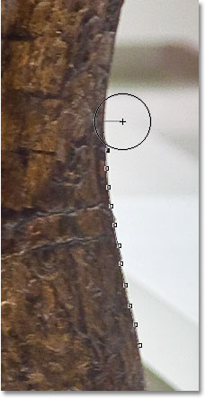
*Photoshop snaps a thin line to the edge of the object as you drag around it.*

To zoom in on the image as you're dragging around the edges, press **Ctrl++** (Win) / **Command++** (Mac). Press **Ctrl+-** (Win) / **Command+-** (Mac) later to zoom out. To scroll the image around inside the document window when you're zoomed in, hold down your **spacebar**, which temporarily switches you to the **Hand Tool**, then click and drag the image around as needed. Release the spacebar when you're done.

### Changing The Width Of The Circle

You can adjust the width of the circle, which changes the size of the area that Photoshop looks at for edges, using the **Width** option in the Options Bar. If the object you're selecting has a well-defined edge, you can use a larger width setting, which will also allow you to move faster and more freely around the object. Use a lower width setting and move more slowly around objects where the edge is not so well defined.

*The Width option adjusts the width of the area that Photoshop looks at to find edges.*

The only problem with the Width option in the Options Bar is that you have to set it before you click to begin your selection, and there's no way to change it once you've started dragging around the object. A more convenient way to adjust the width of the circle is by using the **left and right bracket keys** on your keyboard. This gives you the ability to adjust the size of the circle on the fly as you're working, which is great since you'll often need to adjust its size as you pass over different parts of the image. Press the **left bracket key ( [ )** to make the circle smaller, or the **right bracket key ( ] )** to make it larger. You'll see the value for the Width option changing in the Options Bar as you press the keys, and you'll see the circle itself changing size in the document window:

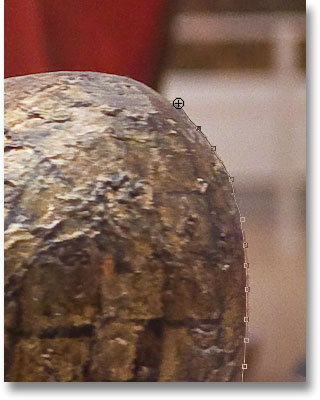
*Make the circle smaller and keep the crosshair directly over the edge when passing over potential problem areas.*

### Edge Contrast

While the width of the circle determines the size of the area that Photoshop looks at for edges, a second and equally important option when using the Magnetic Lasso Tool is **Edge Contrast**, which determines how much of a difference there must be in color or brightness value between the object and its background for Photoshop to consider something an edge.

You'll find the Edge Contrast option in the Options Bar to the right of the Width option. For areas with high contrast between the subject and its background, you can use a higher Edge Contrast value, along with a larger Width value (larger circle). Use lower Edge Contrast and Width values for areas with poor contrast between the object and background:

*Use lower Edge Contrast values for areas where the color or brightness value of the object and background are similar.*

Like the Width option, the Edge Contrast option in the Options Bar can only be set before you click to begin your selection, which doesn't make it very useful. To change it on the fly as you're working, press the **period key ( . )** on your keyboard to increase the contrast value or the **comma ( , )** to decrease it. You'll see the value changing in the Options Bar.

### Frequency

As you make your way around the object, Photoshop automatically places anchor points (little squares) along the edge to "anchor", or fasten, the line in place. If you find that there's too much of a gap between anchor points, making it difficult to keep the line clinging to the edge, you can adjust how often Photoshop adds anchor points with the **Frequency** option in the Options Bar, although again, you'll need to set this option before you click to begin the selection. The higher the value, the more anchor points will be added, but generally, the default value of 57 tends to work well:

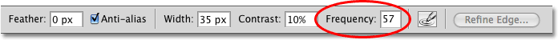
*Adjust the Frequency value to change how often Photoshop lays down anchor points.*

Rather than changing the Frequency value, an easier way to work is to simply add an anchor point manually whenever you need one. If Photoshop seems to be having trouble keeping the line in place at a certain spot, just click on the edge of the object to add an anchor point manually, then release your mouse button and continue on.

### Fixing Mistakes

If an anchor point gets added in the wrong spot, either by you or by Photoshop, press the **Backspace** (Win) / **Delete** (Mac) key on your keyboard to remove the last anchor point that was added. If you continue pressing Backspace / Delete, you'll remove additional points in the reverse order they were added, which is helpful for times when the selection outline starts acting a little crazy and unpredictable, as it sometimes does. Here, I've completely missed the hair on side of the sculpture's face, so I'll need to press Backspace / Delete a few times to remove the unwanted anchor points, then try again:

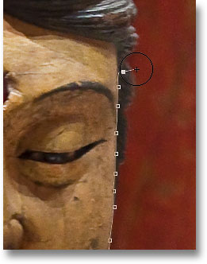
*Press Backspace (Win) / Delete (Mac) to remove anchor points when mistakes happen.*

This time, using a much smaller circle width, I have better luck. Adding some anchor points manually also helps:

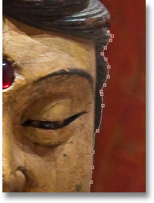
*Click to add an anchor point manually whenever you need one.*

If you've completely messed up with the Magnetic Lasso Tool and need to start over, press the **Esc** key to clear away everything you've done.

### Switching Between Lasso Tools

The Magnetic Lasso Tool can often do an amazing job of selecting an object on its own, but it also gives us easy access to Photoshop's other two lasso tools if needed. To temporarily switch to either the standard Lasso Tool or the Polygonal Lasso Tool, hold down your **Alt** (Win) / **Option** (Mac) key and click on the edge of the object. What you do next determines which of the two lasso tools you switch to.

If you continue to hold your mouse button down and begin dragging, you'll switch to the standard Lasso Tool so you can draw a freeform selection outline around areas where the Magnetic Lasso Tool is having trouble. When you're done, release your Alt / Option key, then release your mouse button to switch back to the Magnetic Lasso Tool.

If you release your mouse button after you click with the Alt / Option key held down and move your mouse cursor away from the point you clicked on, you'll switch to the Polygonal Lasso Tool which is handy for selecting areas where the edge of the object becomes straight. Keep Alt / Option held down as you click from point to point to add straight line segments. To switch back to the Magnetic Lasso Tool when you're done, release your Alt / Option key, then click on the edge of the object to add a point and release your mouse button.

I want to include the platform the sculpture is sitting on in my selection, and since the edge of the platform is straight, I'll temporarily switch to the Polygonal Lasso Tool:

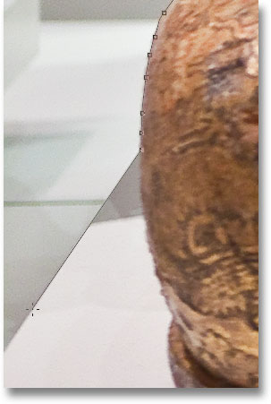
*The straight edge of the platform is exactly the sort of thing the Polygonal Lasso Tool was designed for.*

### Closing The Selection

Once you've made your way around the entire object, click back on your initial starting point to complete the selection. When you're close enough to the starting point, you'll see a small circle appear in the bottom right of the cursor icon, letting you know that you can now click to close the selection:

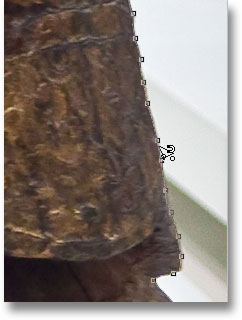
*When a small circle appears in the bottom right corner of the cursor icon, click to close the selection.*

And with that, the sculpture is selected:

*The animated selection outline, or "marching ants", appears as soon as you close the selection.*

### Subtracting Areas From The Initial Selection

As I examine the photo more closely, I notice that there's a small, narrow gap in the sculpture between the side of the body and the arm on the right, with the background showing through it:

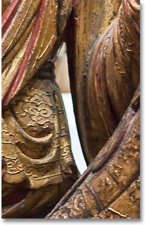
*Part of the initial selection needs to be removed.*

I need to remove that area from the selection. To do that, with the Magnetic Lasso Tool still selected, I'll hold down my **Alt** (Win) / **Option** (Mac) key, which will temporarily switch me to the **Subtract from Selection** mode. A small minus sign ( - ) appears in the bottom right corner of the cursor icon letting me know that I'm about to remove part of the existing selection:

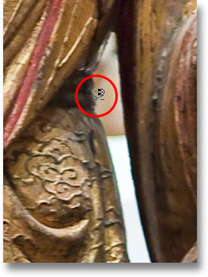
*Hold down Alt (Win) / Option (Mac) to temporarily switch to Subtract from Selection mode.*

With Alt / Option held down, I'll click once to set my starting point, then I'll release my mouse button and drag around the edge of the area I need to remove. Once I start dragging, I can release the Alt / Option key. There's no need to keep it held down the entire time. Photoshop will keep me in Subtract from Selection mode until I click back on the initial point to complete the selection. I'll press the Caps Lock key once again to switch to the circle icon so I can see exactly where Photoshop is looking for edges:

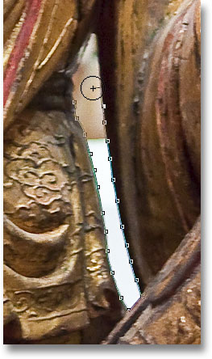
*Dragging around the area that needs to be removed with the Magnetic Lasso Tool.*

Once I've made my way around the gap, I'll click back on the initial starting point to close the selection, removing the unwanted area. Only the sculpture itself, along with the platform it's sitting on, remains selected:

*The narrow gap to the left of the sculpture's arm is no longer part of the selection.*

With the sculpture now selected, anything I do next will affect only the sculpture. The rest of the photo will be ignored. For example, I can press the letter **M** on my keyboard to quickly select Photoshop's **Move Tool**, then I'll click on the sculpture and drag it into a second image I have open to give it a different background:

*Swapping the background is just one of an endless number of things you can do thanks to selections.*

### Removing A Selection

When you're done with your selection outline and no longer need it, you can remove it by going up to the **Select** menu at the top of the screen and choosing **Deselect**, or you can press the keyboard shortcut **Ctrl+D** (Win) / **Command+D** (Mac). Or, for the fastest way to remove a selection, simply click anywhere inside of the document with the Magnetic Lasso Tool or with any of Photoshop's other selection tools.

The Magnetic Lasso Tool is without a doubt one of the best selection tools we have to work with in Photoshop, giving us much better results than we could get with the standard Lasso Tool in less time and with less effort and frustration. However, it does take a bit of practice with the Width and Edge Contrast options before you'll feel at home with it, and as with most things in life, it's not perfect.

For best results, use the Magnetic Lasso Tool as a great way to begin a selection, since it can usually do 80-90% of the work for you. Drag the Magnetic Lasso Tool around the object once, creating your initial selection, then zoom in and scroll around the selection outline looking for any areas where the Magnetic Lasso Tool messed up. Use the standard Lasso Tool, along with the Add to Selection and Subtract from Selection modes, to fix up any problems.