# How To Make Your Own Custom Photoshop Brushes

> Source: [https://www.photoshopessentials.com/basics/photoshop-brushes/make-brushes/](https://www.photoshopessentials.com/basics/photoshop-brushes/make-brushes/)
> Downloaded and converted to Markdown.

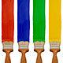

In this tutorial, we'll learn how easy it is to **make our own custom Photoshop brushes**! Photoshop ships with lots of great brushes for us to use, but it's way more fun and interesting to create our own, especially after Adobe completely revamped the brush engine in Photoshop 7, adding unprecedented painting ability to what was already the world's most powerful image editor.

Since the types of brushes we can create in Photoshop are limited only by our imagination, we'll design a very simple brush here just to see how quick and easy the whole process is. We'll also take a look at a couple of Photoshop's dynamic brush options in the Brushes panel to see how we can change the behavior of the brush after we create it.

Let's get started!

### Step 1: Create A New Photoshop Document

Let's begin by creating a brand new Photoshop document which we'll use to design our brush. Again, the purpose of this tutorial is not to learn how to create this exact brush, but rather to see how the process works from beginning to end. I'm going to create a new 200 x 200 pixel document by going up to the **File** menu in the Menu Bar at the top of the screen and choosing **New**. Or, for a faster way to create a new document, press **Ctrl+N** (Win) / **Command+N** (Mac) on your keyboard:

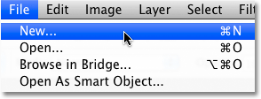
*Go to File > New.*

This opens the New Document dialog box. Enter **200** for both the **Width** and **Height** options and make sure the measurement type is set to **pixels**. Also, make sure the **Background Contents** option is set to **White** since we need white to be the background color for the brush:

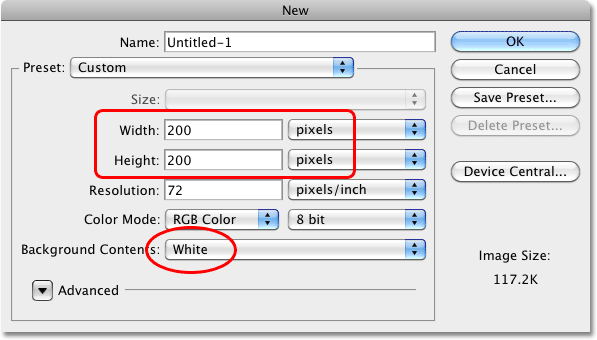
*Create a new 200 x 200 pixel document with a white background.*

Click OK when you're done to accept the settings and exit out of the dialog box. A new 200 x 200 pixel document, filled with white, will appear on your screen.

**Choosing An Initial Size For Your Brush**
Photoshop allows us to create brushes as large as 2500 x 2500 pixels, but as they say, just because you can doesn't mean you should. At that size, you'd be painting with the virtual equivalent of a floor mop. Also, painting with very large brushes requires a lot more memory and horse power from your computer which can slow your system down considerably. For typical work, you'll want to create brushes much smaller.

The size at which you initially create the brush will become its default size, and it's important to note that brushes we create ourselves are **pixel-based** brushes, which means they're essentially images and behave exactly the same way as regular images when it comes to resizing them. Brushes will usually remain crisp and sharp when we make them smaller, but if you increase their size much beyond the default, they'll become soft and dull looking. The general idea, then, is to create your new brush just large enough to suit your needs, which may involve a little trial and error. The 200 x 200 pixel size I'm using here usually works well.

### Step 2: Select The Brush Tool

Let's create our new brush using one of Photoshop's built-in brushes. First, select the **Brush Tool** from the Tools palette, or press the letter **B** on your keyboard to quickly select it with the shortcut:

*Select the Brush Tool.*

### Step 3: Select A Small Round Brush

With the Brush Tool selected, **right-click** (Win) / **Control-click** (Mac) anywhere inside the document window to display the **Brush Preset picker**, which is a miniature version of the full-blown Brushes panel that we'll look at a bit later (and we'll examine in much more detail in another tutorial). The Brush Preset picker allows us to choose from a list of preset brushes (which explains its name). To select a brush, simply click on its thumbnail. I'm going to click on the Hard Round 5 Pixels brush to select it. If you have Tool Tips enabled in Photoshop's Preferences, the name of each brush will appear as you hover over the thumbnails. Press **Enter** (Win) / **Return** (Mac) once you've chosen your brush to close out of the palette:

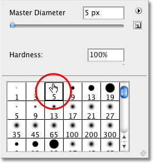
*Select a small round brush from the Preset picker, then press Enter (Win) / Return (Mac) to close out of it.*

### Step 4: Make Sure The Foreground Color Is Set To Black

Back when we created our new document in Step 1, we made sure to set the background color of our document to white. The reason is that all brushes in Photoshop are Grayscale, meaning that a brush can contain only black, white, or shades of gray in between. Areas filled with white become transparent, so you won't see them when you're painting with the brush. Areas filled with black will be 100% visible, and if your brush includes various shades of gray, those areas will be partially visible depending on how close they are to black or white, with darker shades of gray being more visible than lighter shades.

If we were to turn our new document into a brush as it is right now, the entire brush would be transparent since it contains nothing but white. Painting with an invisible brush may make an interesting statement artistically, but for more practical purposes (like this tutorial), you'll most likely want a brush you can actually see, which means we'll need to add some areas of black to the document. The black areas will become the visible shape of the brush (known as the **brush tip**).

Photoshop paints using the current **Foreground color**, and as luck would have it, the default for the Foreground color is black, which means there's a very good chance yours is already set to black. You can see the current Foreground and Background colors by looking at their color swatches near the bottom of the Tools palette (the Foreground color is the swatch in the top left). If your Foreground color is set to something other than black, press the letter **D** on your keyboard to quickly reset both the Foreground and Background colors to their defaults:

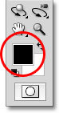
*The Foreground color is the color the brush will paint with.*

### Step 5: Paint A Series Of Horizontal Brush Strokes Inside The Document Window

With the small round brush selected and black as your Foreground color, click inside the document window and paint a series of short horizontal brush strokes. For added variety, alter the thickness of the strokes by changing the size of the brush using the handy keyboard shortcuts. Press the **left bracket key** (**[**) to make the brush smaller or the **right bracket key** (**]**) to make it larger. You'll find the bracket keys to the right of the letter P on most keyboards. When you're done, you should have a column of brush strokes that looks something like this:

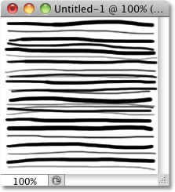
*A column of messy, random brush strokes.*

### Step 6: Create A New Brush From The Document

To create a new Photoshop brush from the document, simply go up to the **Edit** menu at the top of the screen and choose **Define Brush Preset** from the list of options (depending on which version of Photoshop you're using, the option may be called simply Define Brush):

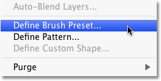
*Go to Edit > Define Brush Preset.*

Photoshop will pop open a dialog box asking you to give your new brush a name. I'm going to call mine "My New Brush". You'll probably want to choose a name that's a little more descriptive:

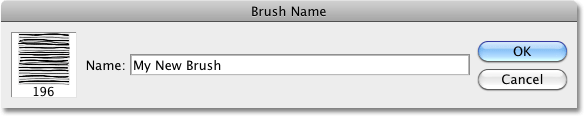
*Name the new brush.*

Click OK when you're done to close out of the dialog box, and that's all there is to it! We've successfully created a brand new custom brush in Photoshop that's ready and waiting to help us bring our creative vision to life. You can safely close out of the brush's document at this point.

To select the new brush any time you need it, first make sure you have the Brush Tool selected, then **right-click** (Win) / **Control-click** (Mac) anywhere inside your document to open the **Brush Preset picker**. Scroll down the list of available brushes until you see your brush thumbnail (newly created brushes will appear at the bottom of the list), then click on the thumbnail to select the brush. Press **Enter** (Win) / **Return** (Mac) once you've selected it to close out of the Brush Preset picker:

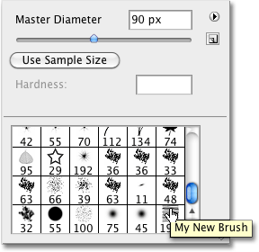
*Select your new brush from the Brush Preset picker.*

With the new brush selected, simply click and drag inside your document to paint a brush stroke:

*The newly created brush in action.*

It's a good start, but I think it's safe to say that at this stage, my new brush will be of limited use. Fortunately, now that we've created a brush tip, we can change and control how the brush behaves as we paint with it using Photoshop's **Brush Dynamics**, found in the main **Brushes panel**, which we'll take a quick look at next!

### Step 7: Open The Brushes Panel

We've seen how to select a basic, ready-made brush using the Brush Preset picker, but if want more control over how our brush behaves, we need Photoshop's main **Brushes panel**, which gives us full access to some truly amazing options. We'll save our detailed look at the Brushes panel and all of its controls for another tutorial, but let's take a quick look at a few ways we can use it to alter the appearance of our brush strokes.

To open the Brushes panel, either go up to the **Window** menu at the top of the screen and choose **Brushes** from the list, or press the **F5** key on your keyboard (press it again to close the panel), or click on the Brushes panel **toggle icon** in the Options Bar (click it again to close the panel):

*The toggle icon in the Options Bar opens and closes the Brushes panel.*

This opens the main Brushes panel, the big brother of the Brush Preset picker we saw earlier. By default when you first open the Brushes panel, the **Brush Presets** option is selected in the top left corner of the panel, which displays the same small brush icons along the right that we saw in the Brush Preset picker. To select a brush, simply click on its icon. Scroll down the list to your newly created brush and click on its icon to select it if it's not selected already. The very bottom of the Brushes panel displays a preview of what the brush stroke currently looks like. Since I haven't made any changes yet, the preview looks exactly the same as the brush stroke I painted a moment ago:

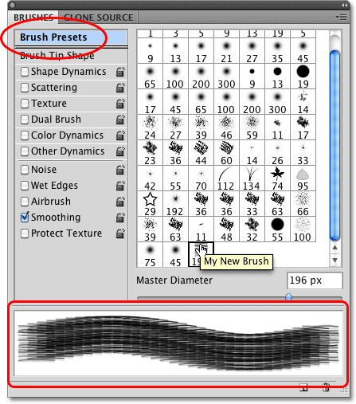
*The main Brushes panel in Photoshop set to the Brush Presets option.*

### Step 8: Adjust The Brush Tip Spacing

Click on the words **Brush Tip Shape** directly below the Brush Presets option in the top left corner of the Brushes panel:

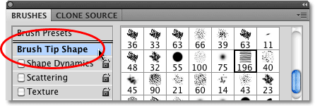
*Click on the Brush Tip Shape option.*

In the real world, if you were to paint with an actual brush, the brush would lay down a continuous coat of paint on the paper, but that's not how Photoshop works. Instead, Photoshop "stamps" the document with your brush tip as you drag your mouse. If the stamps appear close enough together, it creates the illusion of a seamless brush stroke, but if the stamps are spaced too far apart from each other, the individual stamps become obvious and the brush stroke appears ridged. Depending on the effect you're going for (like creating a dotted line, for example), you may want a lot of spacing between the stamps, but in most cases, a seamless brush stroke is more desirable.

With the Brush Tip Shape option selected in the Brushes panel, we can control the spacing between the stamps with the appropriately-named **Spacing** option at the very bottom of the panel. Spacing is controlled as a percentage of the width of your brush tip, and by default, it's set to 25%, which means that if the width of your brush tip is 100 pixels, Photoshop will lay down a new stamp every 25 pixels as you drag your mouse:

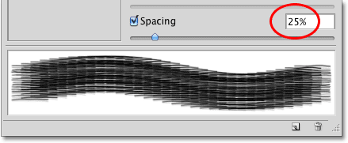
*The Spacing option controls how frequently Photoshop "stamps" the brush tip as you paint.*

For a smooth brush stroke, this default setting is usually too high. I'm going to lower mine down to around 13%. To lower the Spacing amount, either drag the slider towards the left or enter a specific value directly into the input box. You'll see the preview of the brush stroke updating to reflect the changes to the spacing:

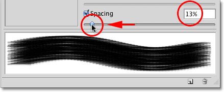
*Lower the Spacing amount for a smoother looking brush stroke.*

Now, if I paint a stroke with my brush, it appears smoother because the individual stamps are closer together:

*With the brush tip "stamps" being closer together, the stroke appears smoother.*

### Step 9: Select The Shape Dynamics Option

Click directly on the words **Shape Dynamics** below the Brush Tip Shape option we selected a moment ago, which gives us options for dynamically controlling the size, angle and roundness of the brush tip as we paint. Make sure you click on the words themselves. Clicking inside the checkbox to the left of words will turn the options on but won't give us access to their controls:

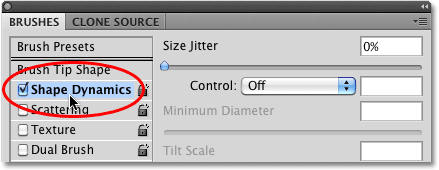
*Click directly on the words "Shape Dynamics".*

### Step 10: Set The Angle Control To "Direction"

The main problem with the look of my brush stroke is that no matter which direction I paint in, those horizontal lines that make up my brush tip remain, well, horizontal. Let's fix that so the brush tip will follow the direction of my mouse cursor. With the Shape Dynamics option selected, change the **Control** option for the brush tip **Angle** to **Direction**. Again, you'll see the brush stroke preview at the bottom of the panel update to reflect the change:

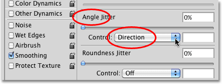
*Change the Control option for the Angle to "Direction".*

I'll paint another stroke with my brush, and this time, things look much more natural. The brush tip is following the direction I'm painting in:

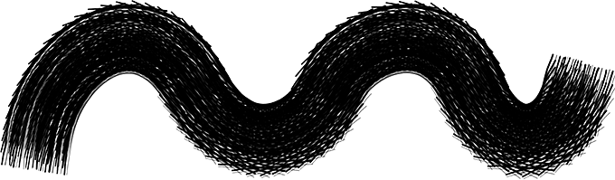
*A more natural looking brush stroke.*

### Step 11: Set The Size Control To "Pen Pressure" (Requires Pen Tablet)

If you're using a pressure-sensitive pen tablet like I am, you can tell Photoshop that you want to control the size of the brush with your pen. With the Shape Dynamics options still selected, change the **Control** option for the brush tip **Size** to **Pen Pressure**:

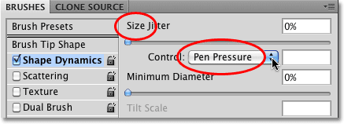
*Change the Control option for the Size of the brush to "Pen Pressure" (if you have a pen tablet, that is).*

With the Pen Pressure option selected, I can easily control the size of the brush stroke on the fly, giving my custom brush an even more natural look:

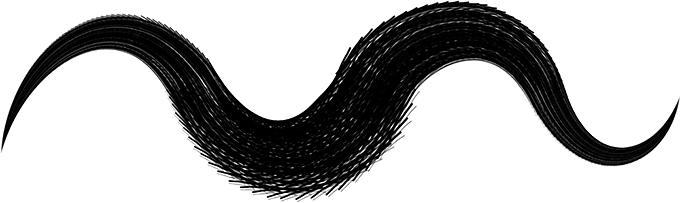
*The size of the brush can now be controlled dynamically with pen pressure.*