# Make Photoshop Your Default Image Editor In Windows 8

> Source: [https://www.photoshopessentials.com/basics/make-photoshop-default-image-editor-windows-8/](https://www.photoshopessentials.com/basics/make-photoshop-default-image-editor-windows-8/)
> Downloaded and converted to Markdown.

In this tutorial, we'll learn how to make Adobe Photoshop the default image viewer and editor for popular file formats like JPEG, PNG and TIFF in Windows 8 and 8.1.

By "default image viewer and editor", what I mean is that rather than having Windows continue to open your image files in some other program like Windows Photo Viewer or the Photos app, you'll be able to double-click on your images in Windows Explorer and have them open directly and automatically in Photoshop!

This tutorial is strictly for Windows 8 and 8.1 users. If you're using Windows 7, you'll want to check out our previous [Make Photoshop Your Default Image Editor In Windows](/essentials/default-image-editor-in-windows/) tutorial, while Mac users will want to read through the [Make Photoshop Your Default Image Editor In Mac OS X](/essentials/default-image-editor-mac/) version.

#### Turning On File Name Extensions

First, navigate to a folder on your PC that contains one or more photos. Here, I've opened a folder on my Desktop with three images inside of it. Notice, though, that the name of each file below its thumbnail is currently missing the three-letter **file extension** (.jpg, .png, .tif, etc.) which means I don't actually know which file type(s) I'm looking at:

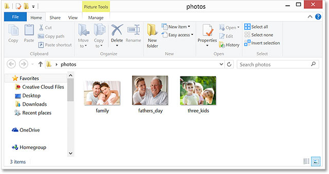
*Open a folder in Windows 8 or 8.1 that holds some images.*

If, like me, you're not seeing the file extensions after the names, click on the **View** menu at the top of the Explorer window, then select the **File name extensions** option by clicking inside its checkbox. You'll see the file extension appear after each name. In my case, I now see that my files are all JPEGs (with a .jpg extension), but the steps we're about to cover will work with other file formats as well, like PNG (.png) and TIFF (.tif):

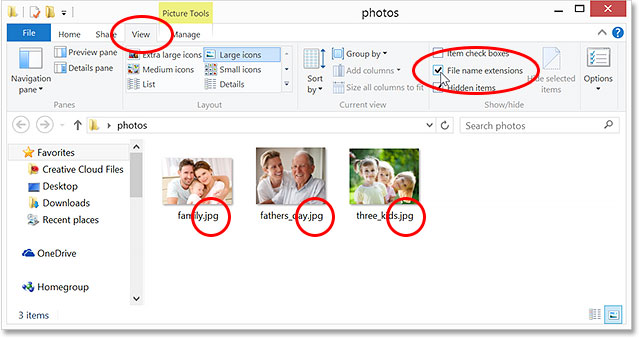
*Go to View > File name extensions to turn on the three-letter extensions after the names.*

#### The Default Image Viewer

Even though I have the very latest version of Photoshop (CC 2014) installed on my PC, and Photoshop just happens to be the world's most popular and powerful image editor, Windows doesn't care, at least not by default. Instead, it prefers to open images in one of its own programs, such as **Windows Photo Viewer** or the **Photos** app. To see what I mean, I'll double-click on one of the JPEG files (the "three kids" image on the right) to open it:

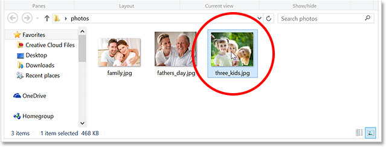
*Opening one of the images.*

And here's the problem. Instead of the image opening in Photoshop, it opened in Windows Photo Viewer. Now, this would be okay if all I wanted to do was view the image, but not if I wanted to edit it:

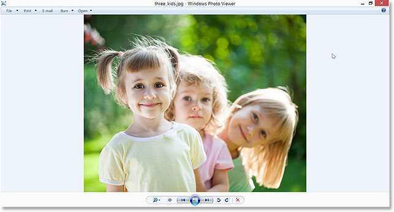
*Windows ignored Photoshop and instead opened the image in Windows Photo Viewer.*

Another possibility with Windows 8 (and 8.1) is that the image will open in the Photos app. Here's what that looks like. Again, if all I wanted to do was view the image, the Photos app would be fine, but for editing work, I'd need it to open in Photoshop. In fact, there's really no need for the Windows Photo Viewer or the Photos app when we have the world's most powerful image editor installed, so let's tell Windows to ignore those other programs and open our images in Photoshop from now on:

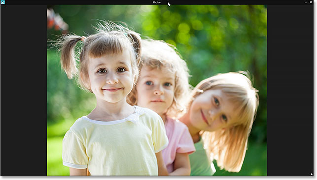
*The image open in the Photos app.*

#### Making Photoshop The Default Image Viewer And Editor

Here's how to make Photoshop the default program for both viewing and editing your images. If your image is currently open in either the Windows Photo Viewer or the Photos app, press **Alt+F4** on your keyboard to quickly exit out of the program and close it.

Again, I'll be using a JPEG file here but you can follow the exact same steps to make Photoshop the default viewer and editor for other popular image file formats like PNG and TIFF. Back in the Explorer window, **right-click** on one of your image files. Choose **Open with** from the first menu that appears, then select **Choose default program**... from the bottom of the second menu:

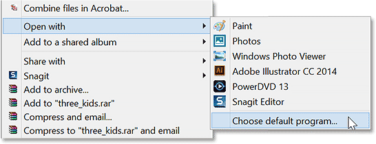
*Right-click on an image, then go to Open with > Choose default program...*

This will open a short list of available programs. If **Adobe Photoshop** appears in this first list, go ahead and click on it to select it. If you don't see Photoshop listed, click on the words **More options** at the bottom:

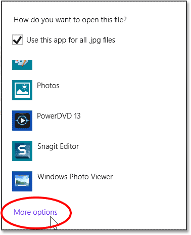
*Click "More options" if Photoshop is not showing up in the first list.*

This will open a second, larger list of programs. Click on **Adobe Photoshop** to select it and make it the new default image viewer and editor for (in this case) JPEG files. If you have multiple versions of Photoshop installed on your PC, choose the most recent version:

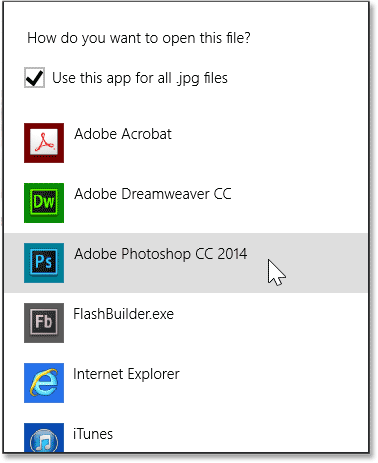
*Choosing Photoshop as the new default program for opening JPEG files.*

Two things will happen when you select Photoshop from the list. First, the image you right-clicked on will open in Photoshop so you can begin working on it:

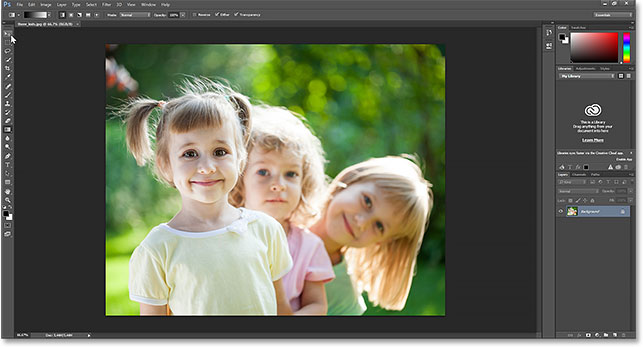
*The selected image opens in Photoshop.*

Second, and more importantly for our purposes here, you've now made Photoshop the default image viewer and editor for that particular file format. I'll close out of Photoshop for a moment and go back to my Explorer window, and I'll double-click on one of the other JPEG images to open it:

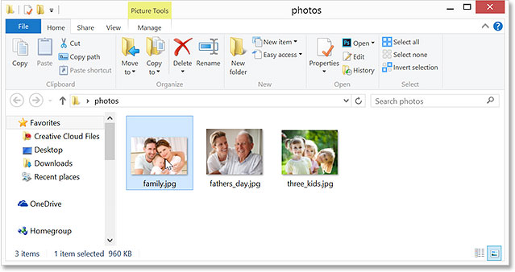
*Double-clicking on a second image in the Explorer window.*

This time, rather than opening in Windows Photo Viewer or the Photos app, the image automatically opens for me in Photoshop:

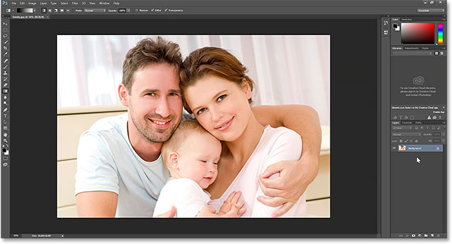
*JPEG images now open by default in Adobe Photoshop.*