# Make Photoshop Your Default Image Editor in Windows 11

> Source: [https://www.photoshopessentials.com/basics/make-photoshop-your-default-image-editor-in-windows-11/](https://www.photoshopessentials.com/basics/make-photoshop-your-default-image-editor-in-windows-11/)
> Downloaded and converted to Markdown.

Learn how to set Photoshop as your default app for opening JPEG images, PNG files and more in Microsoft's new Windows 11.

In this tutorial, I show you how to set Photoshop as your default app for opening and editing images in the new Windows 11 so you can open JPEG files, PNG files and other file types directly into Photoshop just by double-clicking on them.

I’ll go through the steps for opening JPEG files into Photoshop, but you can repeat these same steps with other file types as well.

Let's get started!

## Step 1: Navigate to an image file

In Windows 11, navigate to a folder on your computer that holds one of your JPEG images (or whichever file type you want to set to open in Photoshop).

Here I’ve opened a folder on my desktop. And inside the folder is a JPEG image. We know it’s a JPEG by the ".jpg" extension at the end of its name ([portrait image](https://adobe.prf.hn/click/camref:1100lrdjJ/destination:https%3A%2F%2Fstock.adobe.com%2Fimages%2Fattractive-african-american-woman-in-dress-and-earrings-looking-at-camera-isolated-on-blue%2F314685984) from Adobe Stock):

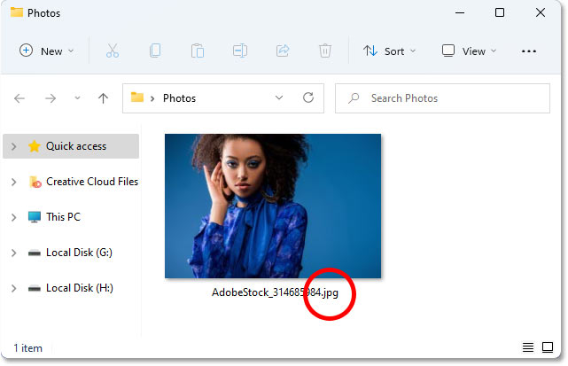
*Navigating to a JPEG image in File Explorer.*

If you’re not seeing the file extension, go up to the **View** menu:

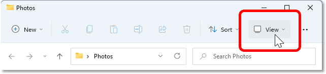
*Opening the View menu.*

Choose **Show**, and then choose **File name extensions**:

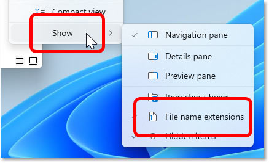
*Choosing Show > File name extensions.*

## Step 2: Open the Properties dialog box

Right-click on the image thumbnail:

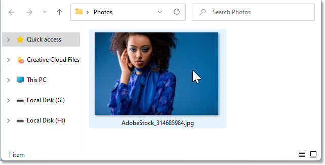
*Right-clicking on the image thumbnail.*

And choose **Properties**:

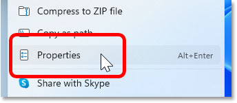
*Opening the Properties.*

Notice in the Properties dialog box that by default, JPEG files are set to open in the **Photos** app, which is not what we want:

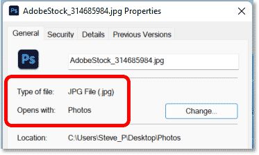
*JPEG files open in the Photos app by default.*

## Step 3: Set Photoshop as the default app

To set all JPEG files to open in Photoshop, click the **Change** button:

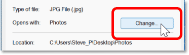
*Clicking the Change button.*

Windows will ask how you want to open JPEG files from now on. Rather than leaving it set to Photos, scroll through the list of other apps installed on your computer and select Photoshop.

If you have more than one version of Photoshop installed, select the most recent version which at the moment is [Photoshop 2021](https://clk.tradedoubler.com/click?p(264303)a(2982769)g(22913540)url(https://www.adobe.com/ca/products/photoshop.html)):

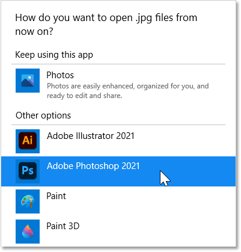
*Changing the default app for opening JPEG files to Photoshop.*

If Photoshop is not showing, scroll down to the bottom of the list and click **More apps**. Then look again for Photoshop and select it:

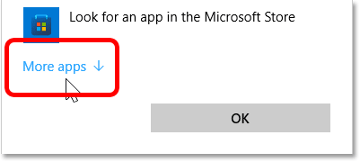
*The "More apps" link.*

Or if you still don’t see Photoshop listed, you’ll need to scroll to the bottom again, click **Look for another app on this PC**, and then navigate to where Photoshop is installed on your computer:

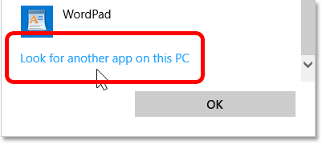
*The "Look for another app on this PC" link.*

Once you’ve selected Photoshop, click **OK** to accept the change:

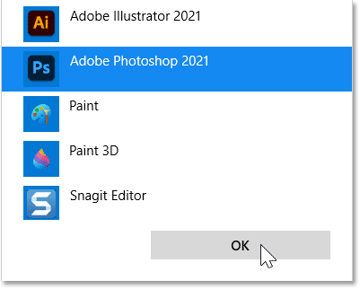
*Clicking OK.*

## Step 4: Close the Properties dialog box

Back in the Properties dialog box, it shows that JPEG files are now set to open automatically in Photoshop:

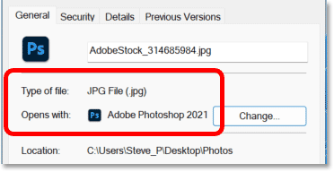
*JPEG files will now open in Photoshop.*

Click **OK** to accept it and close the dialog box:

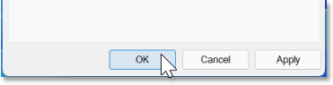
*Closing the Properties dialog box.*

## Step 5: Double-click to open the image in Photoshop

Then back in Windows, double-click on your image thumbnail:

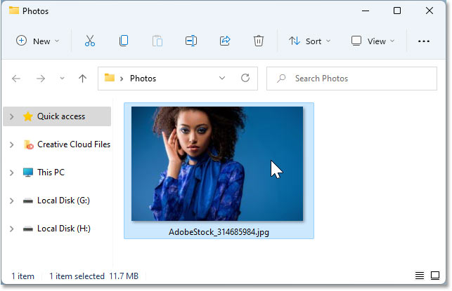
*Double-clicking on the JPEG image to open it.*

Windows will open Photoshop if it was not open already, and your JPEG image (and any other JPEG image you open in the future) will open inside it.

You can follow the same steps with each additional file type, like PNG, that you want Windows to open in Photoshop:

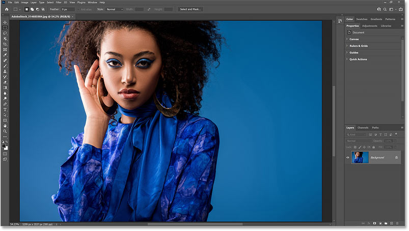
*Windows 11 now opens JPEG files in Photoshop.*

And there we have it! But what if you need to open two or more images at once, and you need them both in the same document? Check out my [How to Open Multiple Images as Layers](/basics/open-multiple-images-as-layers-in-photoshop/) tutorial. Or visit my [Photoshop Basics](/basics/) section for more topics. And don't forget, all of my tutorials are now available to [download as PDFs](/print-ready-pdfs/)!