# Managing Panels In Photoshop CS6

> Source: [https://www.photoshopessentials.com/basics/managing-panels-in-photoshop-cs6/](https://www.photoshopessentials.com/basics/managing-panels-in-photoshop-cs6/)
> Downloaded and converted to Markdown.

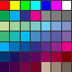

In this Photoshop CS6 tutorial, we'll learn how to manage and organize all of the **panels** that make up such a large part of Photoshop's interface.

Much of the work we do in Photoshop involves the use of panels. The Layers panel, for example, is where we add, delete, select and arrange the layers in our document. It's also where we add layer masks and layer effects. We add and work with adjustment layers using both the Adjustments and Properties panels. We can choose colors with the Color and Swatches panels, work with individual color channels using the Channels panel, go back to previous steps in our workflow with the History panel, and lots more.

With so many panels to choose from and work with, it can seem a bit overwhelming, especially if you're brand new to Photoshop, which is why knowing how to manage and arrange the panels on our screen is so important.

### Resetting The Essentials Workspace

Before we begin our look at the panels, let's first make sure we're both seeing the same panels, and in the same locations, on our screen. To do that, we just need to make sure we're both using Photoshop's default **workspace**. We'll cover [workspaces in another tutorial](/basics/photoshop-cs6-workspaces/), but basically, a workspace is a way for Photoshop to remember which panels should be displayed on the screen and where they should be located. Photoshop ships with several built-in workspaces that we can choose from, and we can even make our own. For now, if you look in the top right corner of Photoshop's interface, you'll find the **workspace selection box**. It doesn't actually say Workspace anywhere, but by default it should be set to **Essentials**. If it's not set to Essentials, click on the box and choose the Essentials workspace from the top of the list that appears:

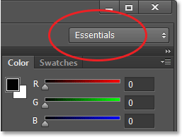
*The workspace option should be set to Essentials.*

Then, let's reset the Essentials workspace itself so that all of the panels are placed back in their default locations. There's a good chance they already are unless you've been moving things around on your own, but just to make sure, click on the word Essentials in the selection box and then choose **Reset Essentials** from down near the bottom of the menu:

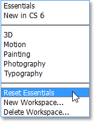
*Resetting the Essentials workspace.*

### The Panel Columns

Now that we've made sure we're both seeing the same panels, let's learn how to manage and organize them. Photoshop's panels are located in **columns** over on the right side of the screen. By default, there's two panel columns - a main column on the right and a secondary, narrow column beside it on the left (both highlighted in the screenshot below):

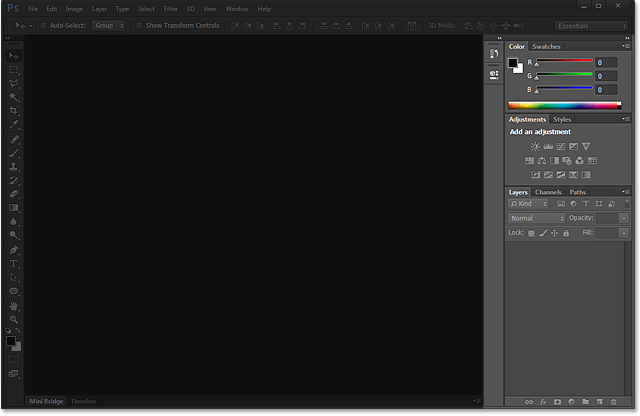
*The panels are found in two columns along the right side of Photoshop's interface.*

Let's take a closer look for a moment at the main column of panels. By default, Photoshop opens three panels for us - the **Color** panel at the top of the column, the **Adjustments** panel in the middle and the **Layers** panel at the bottom. How do we know that we're looking specifically at the Color, Adjustments and Layers panels? We know because each panel has its name displayed in a **tab** at the top of the panel:

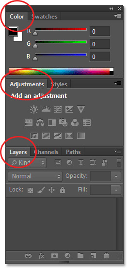
*Three panels - Color, Adjustments and Layers - open in the main panel column.*

### Panel Groups

You've probably noticed that even though there are only three panels open, there's actually *more* than three panels listed in the main column. We can clearly see other tabs with different panel names listed as well. For example, the Color panel at the top has a **Swatches** tab to the right of it. The Adjustments panel has a **Styles** tab to its right, and the Layers panel actually has *two* other tabs - **Channels** and **Paths** - beside it. What's up with that? Well, with so many panels to work with in Photoshop, Adobe had to come up with a way to prevent them from cluttering up the entire screen. The solution was to group, or "nest", two or more panels together into **panel groups**. This way, multiple panels can fit into the space of a single panel!

How does it work? Let's look again at one of the panels currently open for us - the Color panel. We know it's the Color panel because it says "Color" in the tab at the top. Yet beside it is another tab that says "Swatches". This additional tab is for another panel that's grouped in with the Color panel but is currently hiding behind it. Only one panel at a time can be active in a group, and we can tell which panel is active because the other panels have their name dimmed. To switch between panels in a group, all we need to do is **click on their tabs**. Here, I've started with the Color panel open in the group, but by clicking on the Swatches tab, the Swatches panel moves to the front of the group and becomes active. The Color panel moves to the background, but I can easily switch back to the Color panel at any time by clicking on its tab:

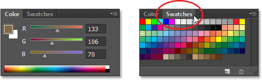
*Clicking the tab to switch from the Color panel to the Swatches panel.*

I'll do the same thing with the Adjustments panel which is currently active in a separate group. I can see that the Styles panel is nested in behind it, so to switch to the Styles panel, I'll click on its tab to bring the Styles panel to the front of the group and send the Adjustments panel to the back. When I need to see the Adjustments panel again, I just need to click on its tab:

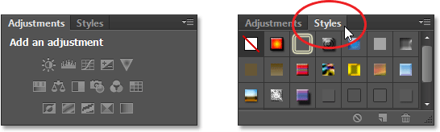
*Switching between the Adjustments and Styles panels by clicking on the tabs.*

### Changing The Order Of Panels In A Group

Notice that the Adjustments panel is listed first in the group and the Styles panel is listed second. There's no particular reason why the Adjustments panel appears first, and in fact it's easy to change the order of the panels. All we need to do is click on a panel's tab at the top of the group, and then with the mouse button still held down, drag the tab left or right. Here, I've clicked on the Adjustments tab to select it, and without lifting my mouse button, I'm dragging the panel towards the right to move it to the other side of the Styles tab:

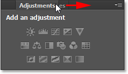
*Clicking and dragging the Adjustments tab.*

Once I've moved the tab to where I want it, I'll release my mouse button and Photoshop drops the tab into its new position. The Styles tab is now listed first in the group, with the Adjustments tab second:

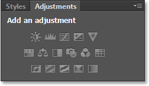
*The order of the tabs has easily been changed.*

### Moving Panels Between Groups

What if, instead of simply changing the order of the tabs in a single group, I want to move a panel to a *different* group? Let's say, for example, that I want to move the Styles panel into the same group that holds the Color and Swatches panels. To do that, I'll simply click on the Styles tab and again with my mouse button still held down, I'll begin dragging the tab up into the new panel group until a **blue highlight border** appears around the new group:

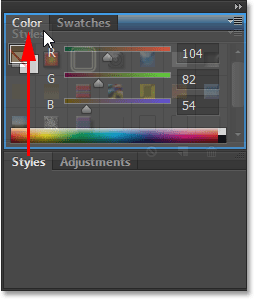
*A blue highlight border appears around the group I want to move the panel into.*

The blue border lets me know that I can now release my mouse button and Photoshop will drop the Styles panel into its new home with the Color and Swatches panels. Notice that the Adjustments panel is now all by itself in its own group, which is still considered a group even though it currently holds only one panel (after all, we could drag other panels into it any time we wanted):

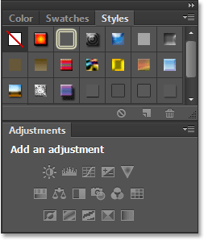
*It's easy to move panels from one group to another in Photoshop.*

### Creating New Panel Groups

As we just saw, the Adjustments panel is now in its own panel group. We can actually make a new group from any panel. Let's say I want to place the Color panel, which is currently nested in with the Swatches and Styles panels, into its own independent group, and that I want this new group to appear directly above the Adjustments panel. To do that, I'll click on the Color tab, then with my mouse button still held down, I'll begin dragging the tab down towards the Adjustments panel until a **blue highlight bar** appears between the two existing panels. It's important to note that this time, we're looking for a highlight *bar*, not a border:

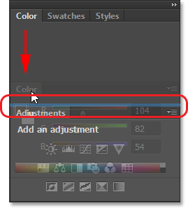
*A blue highlight bar appears between the two panel groups.*

When the highlight bar appears, I'll release my mouse button and Photoshop drops the Color panel into its own group between the other two groups:

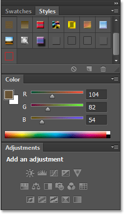
*A new group has been created for the Color panel.*

### Minimizing Panel Groups

We can temporarily minimize panel groups to free up more space for panels in other groups. To minimize a group, **double-click** on any tab in the group. While the group is minimized, all you'll see is its row of tabs along the top. Here, I've double-clicked on the Swatches tab to minimize its group:

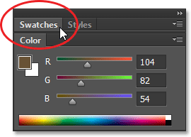
*Double-click on any tab to minimize the group.*

To maximize the group again, click **once** on a tab as I've done here on the Swatches tab. A double-click minimizes the group, a single click maximizes it:

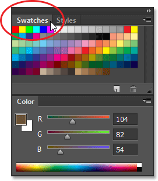
*Single-click on any tab to maximize its group.*

### Closing A Single Panel

If you no longer need a **single panel** in a group and want to close it completely, click on its tab at the top of the group to make it active, then click on the **menu icon** in the top right corner of the panel. Here, I'm clicking the Color panel's menu icon:

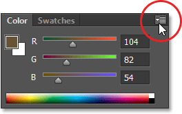
*Each panel has a menu that can be accessed by clicking its menu icon.*

Choose **Close** from the menu that appears:

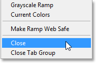
*Selecting the Close command from the Color panel menu.*

This closes that one specific panel but leaves any other panels in the group open. In this case, my Swatches panel remains open but the Color panel is now gone:

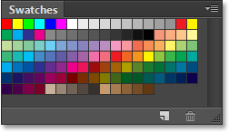
*The Color panel has been closed but the Swatches panel remains.*

### Closing A Panel Group

If you want to close an entire **panel group**, click on the same **menu icon** in the top right corner:

*Clicking again on the menu icon.*

This time, to close the whole group at once, choose **Close Tab Group** from the menu that appears:

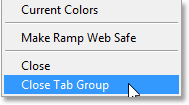
*Selecting the Close Tab Group command.*

And now the entire group (the Color panel and the Swatches panel) has disappeared:

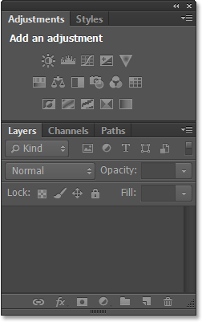
*The panel column after closing the Color and Swatches group.*

### Opening Panels From The Window Menu

To re-open a panel after we've closed it, or to open any of Photoshop's other panels, click on the **Window** menu in the **Menu Bar** along the top of the screen:

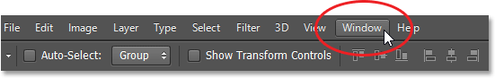
*Clicking on the Window menu in the Menu Bar.*

This opens a menu with, among other things, a complete list of every panel available to us in Photoshop. A **checkmark** beside a panel's name means the panel is currently open and active on the screen:

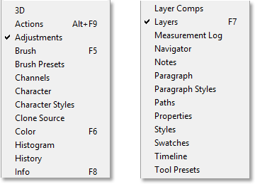
*Click on the Window menu to view the complete list of panels.*

To open a panel that isn't already open (no checkmark beside it), just click on its name in the list. I'll re-open the Color panel by clicking on it:

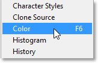
*Selecting the Color panel from the Window menu.*

And now the Color panel re-appears in the main column. Notice that the Swatches panel has also re-appeared along with it. That's because Photoshop remembered that the Color panel was grouped in with the Swatches panel when I closed it. It also remembered that the Color and Swatches panel group was directly above the Adjustments and Styles group. Photoshop does a great job of remembering our panel locations:

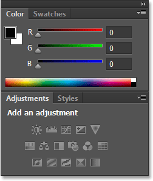
*The Color (and Swatches) panel re-appears.*

### A Note About The Checkmark

One quick but important note to point out before we continue is that when we're viewing the list of Photoshop's panels under the Window menu, the checkmark beside a panel's name not only means the panel is open but that it's also the currently *active* panel in its group. Other panels may also be open in the group but if they're not active (meaning they're nested in behind the active panel), they won't have a checkmark beside them. For example, if we look at my Layers panel, we see that it has two other panels - Channels and Paths - grouped in with it. The Layers panel is currently the active panel in the group:

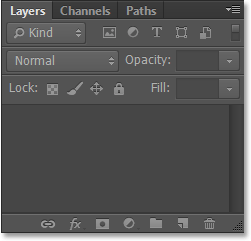
*The Layers panel, with Channels and Paths nested in behind it.*

If we look at my list of panels under the Window menu, we see that sure enough, the Layers panel has a checkmark beside its name. Yet even though the Channels and Paths panels are also open on the screen, because they're not currently active, neither one of them has a checkmark beside it:

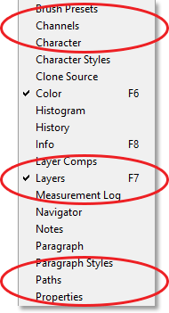
*Only the Layers panel, not Channels or Paths, gets the checkmark.*

I'll click on the Channels tab to make it the active panel in the group, sending the Layers panel to the background with the Paths panel:

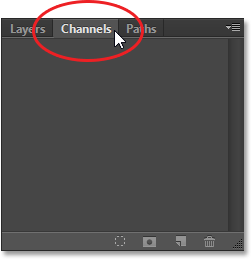
*Switching to the Channels panel.*

And now if we look again at my list of panels under the Window menu, we see that the Channels panel gets the checkmark. The Layers panel is still open (if I had closed it as we learned how to do earlier, it would have disappeared completely from the screen), but because it's no longer the active panel in the group, it no longer gets a checkmark. And of course, neither does the Paths panel. You can see how this can potentially get confusing. The checkmark means a panel is **open and active**. No checkmark means the panel may be closed (appearing nowhere on the screen) or it may just be nested in behind a different active panel in its group:

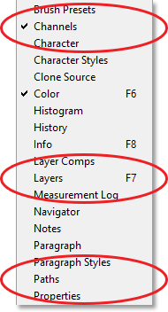
*The checkmark has moved from the Layers panel to the newly-active Channels panel.*

### The Secondary Panel Column

So far, we've been focusing all of our attention on the main panel column, but there's also a **secondary column** to its left. This second column can seem a little confusing at first because by default, the panels in this column appear only as **icons**:

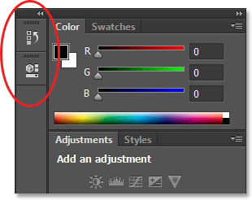
*A second panel column appears to the left of the main column.*

The two panels that initially appear in this second column are the **History** panel on top and the **Properties** panel below it, which may leave you asking, "How the heck are we supposed to know what they are just by looking at these weird icons?" Well, one way is that if you happen to have **Show Tool Tips** enabled in Photoshop's Preferences (it's on by default), the names of the panels will appear when you hover your mouse cursor over each icon.

A better way, though, is that if you hover your mouse cursor over the left edge of the column, your cursor will turn into a double-headed direction arrow. When it appears, click on the edge and, with your mouse button held down, drag it out towards the left to resize the panel. As you drag, you'll see the actual names of the panels appearing beside the icons, which is much more helpful. Release your mouse button once you've added enough space for the names to fit:

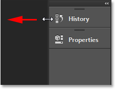
*Resizing the width of the second column to display the panel names along with the icons.*

### Expanding And Collapsing Panels

A good use for this secondary column is to hold panels we'll need but won't necessarily need to have open all the time. The **icon view** mode is a nice way to keep these panels quickly available to us without them taking up valuable screen space. If we click on a panel's icon (or its name), Photoshop will temporarily **expand** the panel to full size so we can work with it. Here, I'm expanding the History panel by clicking its name/icon:

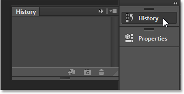
*Clicking on the History panel's name/icon to expand it to full size.*

To **collapse** the panel back to its icon view mode, we can either click on its name/icon again, or we can click the small **double arrow icon**:

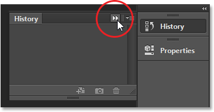
*Clicking the double arrow icon to collapse the panel.*

We can expand all the panels in the second column at once by clicking the even smaller **double arrow icon** in the top right corner of the second panel:

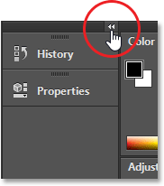
*Clicking the double arrow icon to expand the entire second panel.*

To collapse all the panels in the second column at once, click again on the same icon:

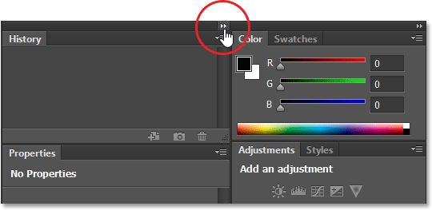
*Clicking the same double arrow icon to collapse the second panel.*

If you need even more space on your screen, you can also collapse the main panel column. You'll find a similar **double arrow icon** in the top right corner of the main column. Click on it to collapse the column:

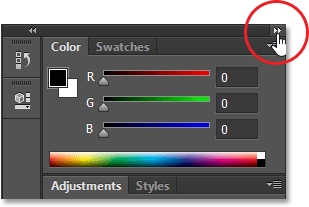
*Collapsing the main panel column.*

This will initially collapse the panels into the **icon/name view**:

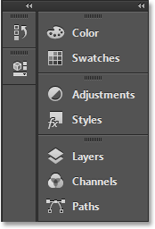
*The main column after initially collapsing the panels.*

To collapse the panel even further into just the icon view mode, hover your mouse cursor on the **dividing line** between the main and second columns. When your cursor changes to the double-headed direction arrow, click on the dividing line and drag it towards the right until only the icons are visible. While having both columns appearing only as icons can free up lots of screen space, you really need to have your icons memorized to work effectively like this. I wouldn't recommend it, but that's just me:

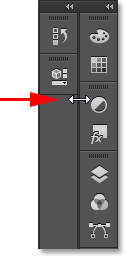
*Both columns of panels now appear in icon view mode.*

To instantly expand the main column back to full size, click again on the **double arrow icon** in the top right corner:

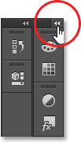
*Clicking the double arrow to expand the main column to full size.*

And now we're back to the column's default view mode, which is how I usually leave it:

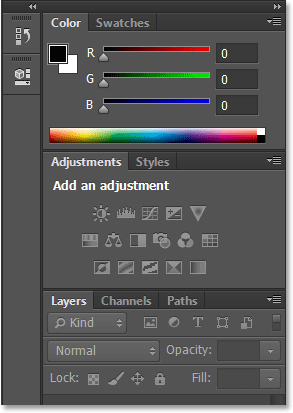
*The main column is now back to full size.*

### Moving Panels Between The Columns

We can move panels from one column to another just as easily as we can move them between groups. Here, I've opened a few more panels (the Histogram, Info and Navigator panels) by selecting them from under the Window menu. Photoshop automatically placed them in my secondary panel column, along with the History and Properties panels that were there initially.

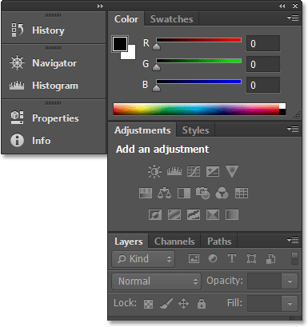
*Three new panels have been added to the second column.*

Let's say I want the Properties panel in the second column to be grouped in with the Adjustments panel in the main column. To do that, all I need to do is click on the Properties tab in the second column and, with my mouse button still held down, drag it over and into the Adjustments panel group until the same **blue highlight border** appears that we saw earlier:

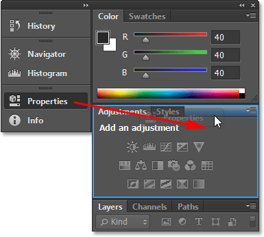
*Dragging the Properties panel into the Adjustments panel group.*

I'll release my mouse button and Photoshop drops the Properties panel into its new group and its new column. We can do the same thing in the opposite direction as well, moving a panel from the main column into the second column simply by clicking and dragging it:

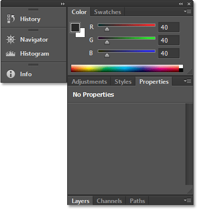
*The Properties panel is now nested in with the Adjustments and Styles panels.*

### Hiding All The Panels On The Screen

Finally, there's a couple of handy keyboard shortcuts for temporarily hiding all the panels on the screen. Pressing the **Tab** key on your keyboard once will hide all the panels along the right, as well as the Tools panel on the left of the screen and the Options Bar along the top. Basically, it will hide everything except the Menu Bar. Pressing **Tab** a second time will bring everything back.

To hide *only* the panels on the right, press **Shift+Tab** once. Press **Shift+Tab** a second time to bring them back:

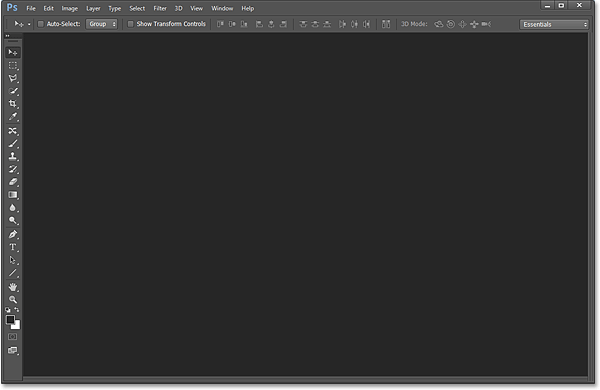
*The panels on the right have temporarily disappeared after pressing Shift+Tab.*

While the panels are hidden, if you move your mouse cursor to the far right of the screen, the panels will temporarily re-appear. Moving your cursor away from the right side of the screen will cause them to disappear again:

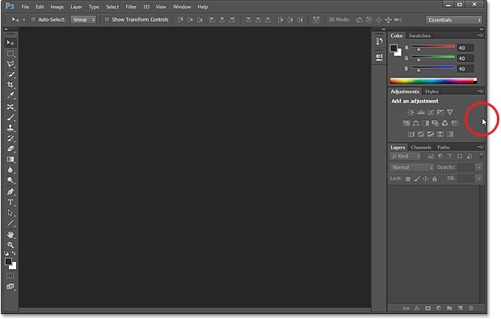
*Moving the mouse cursor to the right of the screen temporarily brings back the panels.*

One final note... If you've been following along making your own changes to the panels on your screen and you want to revert back to the default panel locations, simply reset your Essentials workspace using the steps covered at the very beginning of this tutorial.