# Managing Panels In Photoshop

> Source: [https://www.photoshopessentials.com/basics/managing-panels-photoshop-cc/](https://www.photoshopessentials.com/basics/managing-panels-photoshop-cc/)
> Downloaded and converted to Markdown.

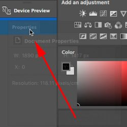

Learn how to work with panels in Photoshop. You'll learn how to show and hide panels, change panel layouts, how to restore the default layout, and more! Part of our Photoshop Interface series.

In this tutorial, we'll learn how to manage and organize the **panels** that make up such a large part of Photoshop's interface. Much of what we do in Photoshop is done using panels. There are different panels for different tasks. The **Layers** panel, for example, is where we work with layers in our document. To add an adjustment layer, we use the **Adjustments** panel, and we set options for adjustment layers using the **Properties** panel. We can choose colors from the **Color** or **Swatches** panels, or change the size and behavior of a brush using the **Brush** panel. We can even go back in time to a previous step in our workflow using Photoshop's **History** panel. And so much more! There's even a brand new panel in Photoshop CC, the **Libraries** panel, to help us manage our images and other design elements.

If you're new to Photoshop, all of these panels can seem overwhelming. In this tutorial, I'll show you how easy it is to work with Photoshop's panels, and how to manage and organize them on your screen. This version of the tutorial has been updated for [Photoshop CC](https://prf.hn/l/dlXjD2w). Photoshop CS6 users will want to follow along with our [Managing Panels in Photoshop CS6](/basics/managing-panels-in-photoshop-cs6/) tutorial.

This is lesson 5 of 10 in our [Learning the Photoshop Interface](/basics/learning-the-photoshop-interface/) series.

Let's get started!

## The Default "Essentials" Workspace

Before we begin, let's first make sure that the panels I'm seeing on my screen are the same as what you're seeing on your screen. To do that, we'll quickly reset Photoshop's default **workspace**. A workspace determines which of Photoshop's panels are displayed on your screen, and how those panels are arranged. Photoshop includes several built-in workspaces that we can choose from, and we can even save our own.

Photoshop's default workspace is known as the **Essentials** workspace. If you're new to Photoshop, you'll want to stick with the Essentials workspace for now. The Essentials workspace is a general-purpose workspace, suitable for many different tasks. It's also the workspace we use in our tutorials. Before we look at Photoshop's panels, let's make sure we're both using the Essentials workspace. And, we'll make sure that the workspace itself is set to its default layout.

### Choosing The Essentials Workspace

First, we'll choose the Essentials workspace. If you look in the upper right corner of the Photoshop CC interface, you'll find two icons. The magnifying glass icon on the left is for opening Photoshop's new **Search Bar**. I covered the Search Bar in the [Getting To Know The Photoshop Interface](/basics/getting-know-photoshop-interface/) tutorial so we won't look at it here. Instead, we want the rectangular icon directly beside it. This is Photoshop's **workspace selection** icon:

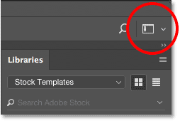
*Clicking the workspace selection icon.*

To see which of Photoshop's workspaces is currently active, or to choose a different workspace, click on the icon. At the top of the menu that appears is a list of workspaces you can choose from. The currently-active workspace has a checkmark beside its name. By default, Essentials should be active. If it isn't, click on it at the top of the list to select it:

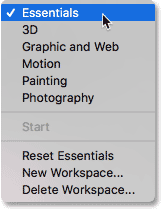
*The workspace selection menu. Essentials should be selected at the top.*

### Resetting The Essentials Workspace

With the Essentials workspace selected, let's make sure the panels are all set to their default layout. We do that by resetting the workspace. To reset the Essentials workspace, choose **Reset Essentials** from the menu:

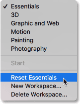
*Resetting the Essentials workspace.*

## Working With Photoshop's Panels

### The Panel Area

With the Essentials workspace selected and reset, let's look at Photoshop panels. The panels are displayed in columns in the **panel area** along the right of the interface. In Photoshop CC, there are three panel columns by default. The new Libraries panel gets its own column on the far right. The main panel column, where we find panels we use the most, is in the middle. And on the left is a narrow, secondary column of panels. I've darkened the rest of the interface in the screenshot to highlight the panel area on the right:

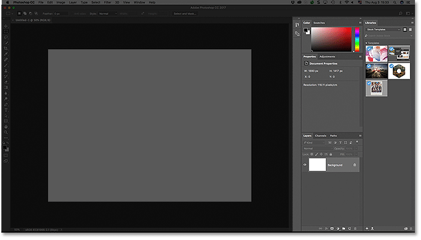
*Photoshop's panel area.*

### The Main Panel Column

The panels we generally used the most in Photoshop are found in the main column in the middle. By default, Photoshop opens three panels for us. At the top of the main column is the **Color** panel. Below the Color panel is the **Properties** panel. And at the bottom, we have the **Layers** panel. How do we know that we're looking specifically at the Color, Properties and Layers panels? We know because each panel has its name displayed in a **tab** at the top of the panel:

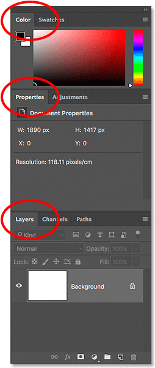
*Photoshop displays the Color, Properties and Layers panels by default.*

### Panel Groups

Notice that, along with the Color, Properties and Layers panels, there are other panels in the column as well. For example, the Color panel at the top has a **Swatches** tab to the right of it. The Properties panel has an **Adjustments** tab beside it. And to the right of the Layers panel at the bottom are *two* other tabs, **Channels** and **Paths**. With so many panels to work with in Photoshop, Adobe needed a way to prevent them from cluttering up the screen. The solution was to group related panels together into **panel groups**. A panel group can contain two or more individual panels. This allows multiple panels to fit within the space of a single panel.

How do panel groups work? Let's look at the Color panel. We know it's the Color panel because it says "Color" in the tab at the top. Yet beside the "Color" tab is another tab that says "Swatches". This other tab is for another panel that's grouped in with the Color panel. Photoshop can only display one panel in a group at a time. So while one panel is open, the other panel(s) in the group remain hidden behind it. The panel that's currently open in the group is known as the **active panel**. We can tell which panel in the group is active because the name of the active panel appears brighter than the others.

#### Switching Between Panels In A Group

To switch between panels in a group, click on the tabs. For example, on the left, we see that the Color panel is open, with the Swatches panel hiding in the background. On the right, I've clicked on the Swatches tab. This opens the Swatches panel and sends the Color panel into the background. To switch back to the Color panel, all I would need to do is click on the Color panel's tab:

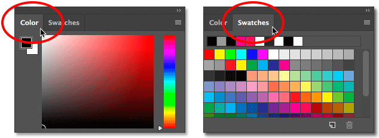
*Switching between the Color and Swatches panels by clicking the tabs.*

I'll do the same thing with the Properties panel which is currently active in a separate group. I can see from the tabs that the Adjustments panel is nested in beside it. To switch to the Adjustments panel, I'll click on its tab. This makes the Adjustments panel active and hides the Properties panel:

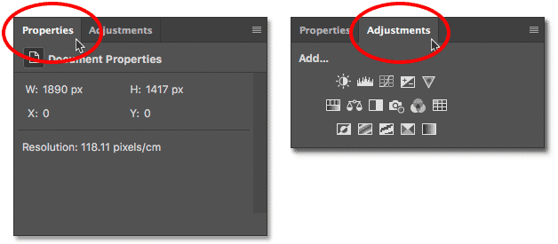
*Clicking the tabs to switch between the Properties (left) and Adjustments (right) panels in the group.*

### Changing The Order Of Panels In A Group

Let's learn how to change the order of panels in a group. Notice that the Properties panel is listed first in the group while the Adjustments panel appears second. That's the default layout, but we can easily change it. To rearrange the panels in a group, click on a panel's tab. Then, with your mouse button still held down, drag the tab left or right. Release your mouse button to drop the panel into place.

Here, I've clicked on the Properties tab to select it, and without lifting my mouse button, I'm dragging the panel towards the right. I'll drag it to the other side of the Adjustments tab:

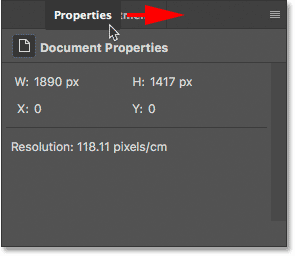
*To change the panel order, click and drag the tabs left or right.*

Once you've dragged the tab to where you want it, release your mouse button. Photoshop drops the tab into its new position within the group. Here, my Adjustments panel is now listed first in the group, with the Properties panel second:

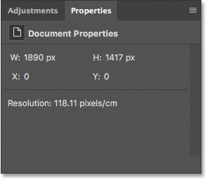
*The order of the tabs has been changed.*

### Moving Panels Between Groups

Next, let's learn how to move panels between groups. What if, instead of simply changing the order of the panels *within* a group, I want to move a panel to a *different* group? Let's say, for example, that I want to move the Adjustments panel into the same group that holds the Color and Swatches panels. To move a panel from one group to another, click on the panel's tab. Then, with your mouse button held down, drag the tab into the new group. A **blue highlight box** will appear around the group. The blue box tells you where Photoshop will drop the panel when you release your mouse button. Here, I'm dragging my Adjustments panel up into the Color and Swatches panel group:

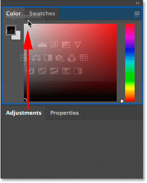
*A blue highlight box appears around the group I want to move the panel into.*

I'll release my mouse button, at which point Photoshop drops the Adjustments panel into the same group as the Color and Swatches panel. Notice that the Properties panel is now all by itself in its own group:

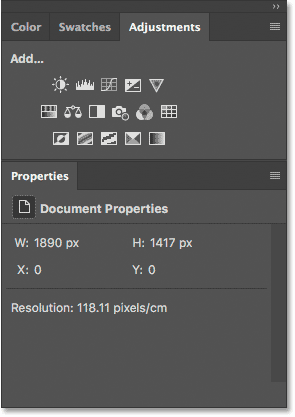
*Panels can be easily moved from one group to another.*

### Creating New Panel Groups

Along with moving panels from one group to another, we can also create new panel groups in Photoshop. As we just saw, by moving my Adjustments panel into a different group, I left my Properties panel sitting all by itself in its own group. But we can actually make a new group from any panel. To create a new panel group, click and hold on a panel's tab in an existing group. Then, drag the panel out of the group and drop it into a new location outside of any other group.

Let's say I want to isolate my Color panel and place it in its own group. And, I want the new group to appear directly above the Properties panel. To do that, I'll click on the Color panel's tab. Then, with my mouse button still held down, I'll begin dragging the tab down towards the Properties panel until a **blue highlight bar** appears between the two existing panels. It's important to note that this time, we're looking for a highlight *bar*, not a border:

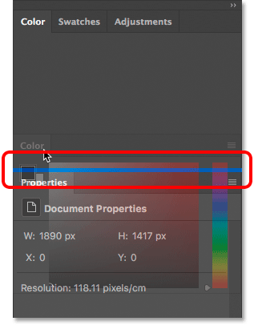
*Dragging the Color panel between two panel groups.*

When the highlight bar appears, I'll release my mouse button. Photoshop drops the Color panel into its own group between the two other groups:

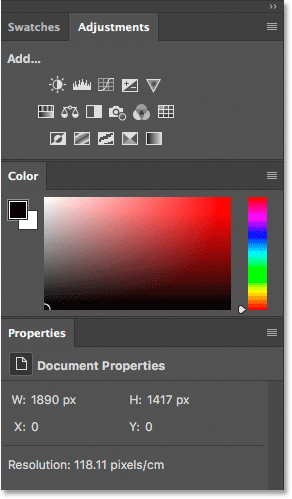
*A new group has been created for the Color panel.*

### Collapsing And Expanding Panel Groups

Next, let's learn how to maximize space in the panel area by collapsing and expanding panel groups. We can temporarily **collapse** a panel group so that only the tabs along the top of the group are displayed. This frees up more space for panels in other groups. To collapse a panel group, **double-click** on any tab in the group. This will collapse all panels in the group regardless of which tab you clicked on. Here, I've double-clicked on the Swatches tab. This collapses both the Swatches panel itself and the Adjustments panel beside it so that only their tabs are visible. Notice that the Color panel below them has grown taller to fill up the extra space:

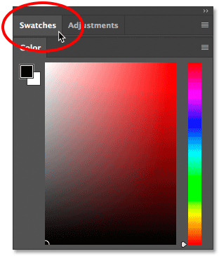
*To collapse all panels in a group, double-click on any of the tabs.*

To **expand** a group that you've collapsed to make the panels visible, click **once** on any tab in the group. Here, I've clicked once on the Swatches panel, and now the panel is once again visible. The Color panel below the group has reverted back to its original, smaller size. So, just to quickly summarize, double-click on a tab to collapse the panel group. Single-click on a tab to expand it:

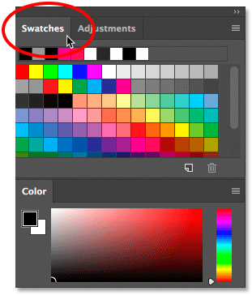
*To expand a collapsed panel group, single-click on a tab.*

### Closing A Single Panel

Along with collapsing and expanding panels in Photoshop, we can also close panels that we're not using. To close a **single panel** in a group, first click on the panel's tab to select it. Then click on the **menu icon** in the top right corner of the panel and choose **Close** from the menu. I'll click on my Swatches panel to make it active. Then, I'll click on the menu icon:

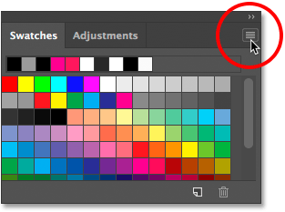
*To close a panel, click on its tab, then click the menu icon.*

To close the panel, I'll choose **Close**:

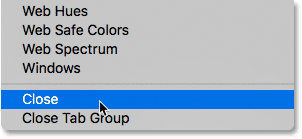
*Selecting the Close command from the Color panel menu.*

This closes that one specific panel without closing any other panels in the group. In this case, my Adjustments panel remains open even though I've closed the Swatches panel:

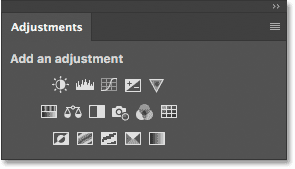
*The Adjustments panel is still open after closing the Swatches panel.*

### Closing A Panel Group

To close an entire **panel group**, rather than just a single panel within the group, click on the same **menu icon** in the top right corner:

*To close a panel group, click the menu icon.*

Then, choose **Close Tab Group** from the menu:

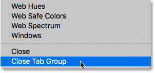
*Selecting the Close Tab Group command.*

And now the entire group (the Swatches panel and the Adjustments panel) has disappeared. My color panel, which was below the group a moment ago, has once again grown taller to fill up the space:

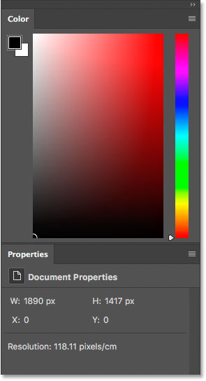
*Closing the top panel group created more room for the group below it.*

### Closing A Panel Or Group From The Tab

Another way to close a panel or panel group in Photoshop is to **right-click** (Win) / **Control-click** (Mac) directly on a panel's **tab**. To close just the panel itself, choose **Close** from the menu. To close the entire panel group, choose **Close Tab Group**. Here, I've right-clicked (Win) / Control-clicked (Mac) on the **Libraries** tab. In this case, since the Libraries panel is the only panel in the group, choosing either Close or Close Tab Group would result in the entire group being closed:

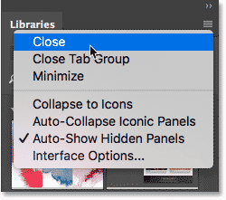
*Closing the Libraries panel from the tab itself.*

### Opening Panels From The Window Menu

All of Photoshop's panels can be accessed from the **Window** menu in the Menu Bar along the top of the screen. To re-open a panel after you've closed it, or to open any of Photoshop's other panels, click on the **Window** menu:

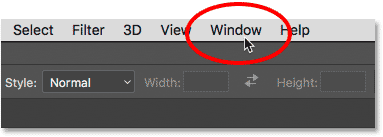
*Clicking on the Window menu in the Menu Bar.*

This opens a menu with, among other things, a complete list of every panel available to us in Photoshop. A **checkmark** beside a panel's name means that the panel is currently open and active on the screen:

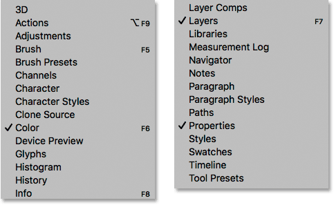
*The Window menu listing each of Photoshop's 29 panels.*

To open a panel that is not already open (no checkmark beside it), click on its name in the list. I'll re-open my Adjustments panel by selecting it:

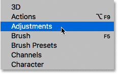
*Selecting the Color panel from the Window menu.*

### Photoshop's Sticky Panels

The Adjustments panel reappears at the top of the main panel column, exactly where it was before I closed it. And notice that my Swatches panel has also reappeared beside it in the same group, even though I didn't choose the Swatches panel from the list. That's because Photoshop remembers our panel layout. In this case, it remembered that my Adjustments and Swatches panels were grouped together. And it remembered that their panel group was sitting above my Color panel. Photoshop's interface elements, including panels and groups, are *sticky*. They remain in the same place unless, or until, we move them:

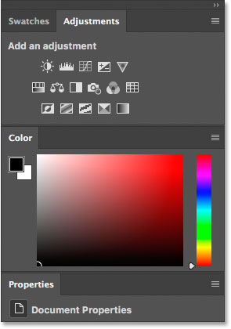
*Re-opening a panel also re-opens other panels that were grouped with it.*

### Open vs Active Panels

We've learned that the checkmark beside a panel's name under the Window menu means that the panel is currently open. But the checkmark also means that the panel is currently the **active panel** in the group. Other panels in the group may be open as well. But only the active panel in the group will have the checkmark.

For example, let's look at the **Layers** panel. The Layers panel has two other panels, **Channels** and **Paths**, grouped in with it. But the Layers panel is currently the active panel in the group:

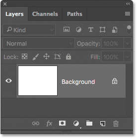
*The Layers, Channels and Paths group. The Layers panel is active.*

If we look at my list of panels under the Window menu, we see that sure enough, the Layers panel has a checkmark beside its name. Yet even though the Channels and Paths panels are also open on the screen, neither one of them has a checkmark:

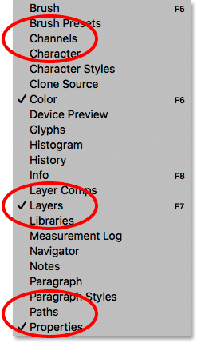
*Only the Layers panel (the active panel in the group) gets the checkmark.*

I'll click on the Channels tab to make it the active panel in the group. This sends the Layers panel to the background with the Paths panel:

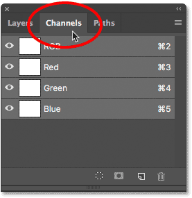
*Switching to the Channels panel.*

And now if we look again at my list of panels under the Window menu, we see that the Channels panel gets the checkmark. The Layers panel is still open, but because it's no longer the active panel in the group, it no longer gets a checkmark. And of course, neither does the Paths panel. You can see how this can potentially get confusing. The checkmark means a panel is **open and active**. No checkmark means the panel may be closed (appearing nowhere on the screen) or it may just be nested in behind a different active panel in its group:

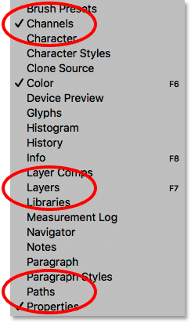
*The checkmark has moved from the Layers panel to the newly-active Channels panel.*

### The Secondary Panel Column

So far, we've been focusing our attention on the main panel column. But there's also a **secondary column** to its left. This second column can seem a little confusing at first because by default, the panels in this column appear only as **icons**:

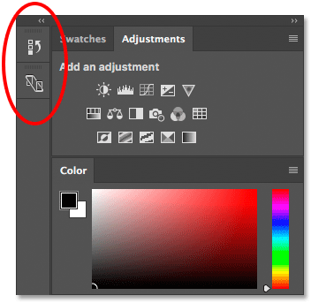
*A second panel column appears to the left of the main column.*

In Photoshop CC, the two panels that initially appear in this second column are the **History** panel on top and the **Device Preview** panel below it. This may leave you asking, "How the heck are we supposed to know which panels they are just by looking at these weird icons?" Well, one way is that if you happen to have **Show Tool Tips** enabled in Photoshop's Preferences (it's on by default), the names of the panels will appear when you hover your mouse cursor over each icon.

A better way, though, is that if you hover your mouse cursor over the left edge of the column, your cursor will turn into a double-headed direction arrow. Click on the column's edge and, with your mouse button held down, drag it out towards the left to resize the column. As you drag, you'll see the actual names of the panels appearing beside the icons, which is much more helpful. Release your mouse button once you've added enough space for the names to fit:

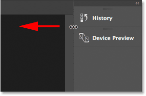
*Resizing the width of the second column to display the panel names along with the icons.*

### Expanding And Collapsing Secondary Panels

A good use for this secondary column is to hold panels we use but don't need to have open all the time. The **icon view** mode keeps these panels available without them taking up valuable screen space. To **expand** a panel to full size, click either on its icon or its name. Here, I'm expanding the History panel by clicking on it:

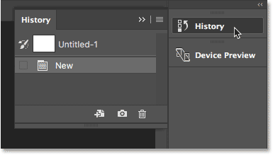
*Clicking on the History panel's name / icon to expand it to full size.*

To **collapse** the panel back to its icon view mode, either click again on its icon or name, or click the small **double arrow** icon in the upper right of the panel:

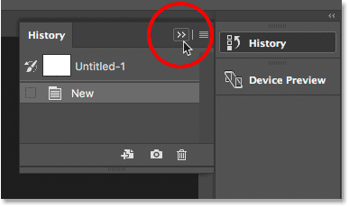
*Clicking the double arrow icon to collapse the panel.*

### Collapsing And Expanding The Secondary Panel Column

To expand all the panels in the second column at once, click the **double arrow** icon in the top right corner of the second panel:

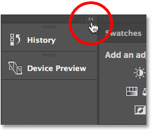
*Clicking the double arrow icon to expand the entire second panel.*

To collapse all the panels in the second column at once, click again on the same icon:

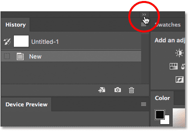
*Clicking the same double arrow icon to collapse the second panel.*

### Collapsing And Expanding The Main Panel Column

To free up even more space on the screen, you can also collapse the main panel column. To collapse the main column, click the **double-arrow** icon in the upper right:

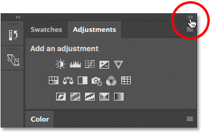
*Collapsing the main panel column.*

This will initially collapse the panels so that only their name and icon are visible:

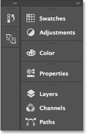
*The main column after initially collapsing the panels.*

To collapse the main panels into just their icons, hover your mouse cursor on the **dividing line** between the main and second columns. When your cursor changes into a double-headed direction arrow, click on the dividing line and drag it towards the right until only the icons are visible:

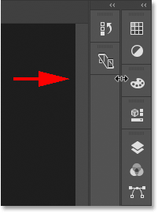
*Both columns of panels now appear in icon view mode.*

To instantly expand the main column back to full size, click again on the **double arrow icon** in the top right corner:

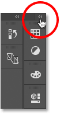
*Clicking the double arrow to expand the main column to full size.*

And now we're back to the column's default view mode, which is how I usually leave it:

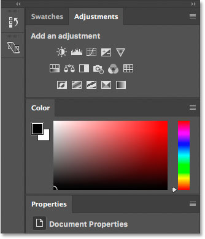
*The main column is now back to full size.*

### Moving Panel Groups Between Columns

We can move panels in Photoshop from one column to another just as easily as we can move them between groups. To move a panel between columns, click and hold on the panel's tab and drag the panel into the other column. The blue highlight box or bar tells you where the panel will be dropped when you release your mouse button.

Let's say I want to move my Properties panel from the main column into the secondary column. And, I want it to appear in its own, independent group in the second column. To do that, I'll click and hold on the Properties tab. Then I'll drag it over to the second column so that the blue bar appears directly below the Device Preview panel:

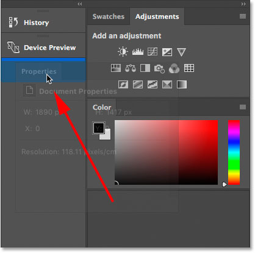
*Dragging the Properties panel from the main column to the secondary column.*

I'll release my mouse button, and now my Properties panel appears in its own group below Device Preview:

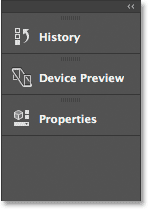
*The Properties panel is now in the secondary column.*

Next, I want to move my Adjustments panel into the same group as my Properties panel. I'll click and hold on the Adjustments tab in the main column. Then I'll drag it into the second column and over top of the Properties panel's tab so that the blue highlight box appears around the tab itself:

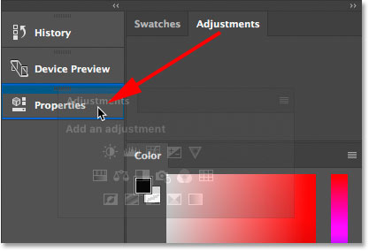
*Grouping the Adjustments panel in with the Properties panel in the second column.*

I'll release my mouse button, and now both panels share the same group in the second column:

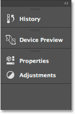
*Both panels have been moved from one column to the other.*

### Moving Panel Groups Between Columns

We can also move an entire panel group between columns. To select a panel group in the main column, click and hold on an empty spot beside the tabs along the top. In the secondary column, click and hold on the bar at the top of the group. Then, drag the group from one column to the other.

Let's say I want to move my Properties and Adjustments group back into the main column. To grab the entire group at once, I'll click and hold on the small **bar** at the top of the group:

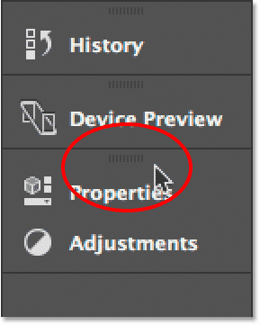
*Clicking the bar to select the panel group.*

Then, I'll drag the group into the main column so that the blue bar appears between the Swatches and Color panels:

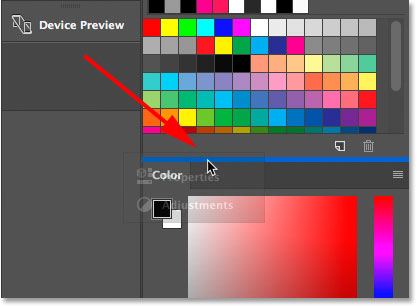
*Clicking the bar to select the panel group.*

When I release my mouse button, Photoshop drops the group between those two panels. And now, both panels are back in the main column:

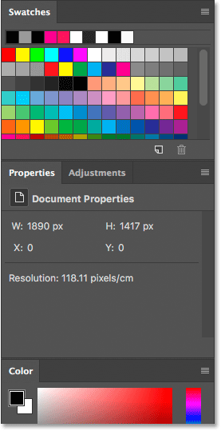
*The entire panel group has been moved at once.*

### How To Reset The Panels Back To Default Layout

Now that we know how to move panels around inside Photoshop, let's reset them back to the default layout. To reset Photoshop's panels, click the **workspace selection** icon just above the panel area:

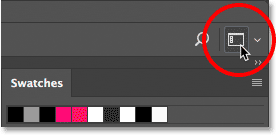
*Clicking the workspace selection icon.*

Then choose **Reset Essentials** from the menu. This resets the Essentials workspace and sends your panels back to the default layout:

*Choosing "Reset Essentials".*