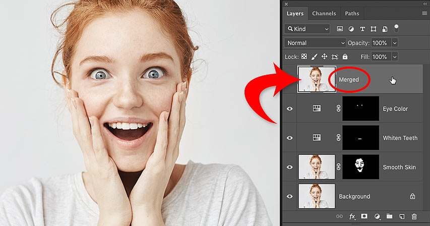
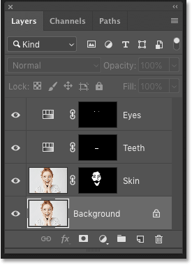
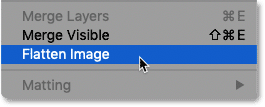
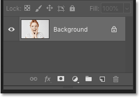
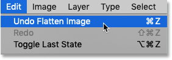
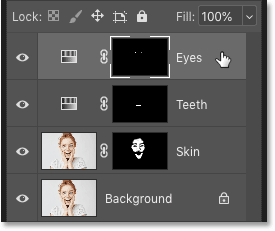
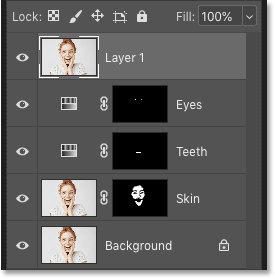
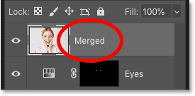

# How to Merge Layers in Photoshop Without Flattening Your Image

> Source: [https://www.photoshopessentials.com/basics/merge-layers-to-a-new-layer-without-flattening-your-image/](https://www.photoshopessentials.com/basics/merge-layers-to-a-new-layer-without-flattening-your-image/)
> Downloaded and converted to Markdown.

Need to merge layers in Photoshop? Don't flatten the image and lose all your work. Learn how to merge a copy of your existing layers onto a separate layer! For Photoshop CC and earlier.

When working with multi-layered Photoshop documents, you often reach a point where you need to flatten the image. Usually it's so you can sharpen the image for print or for uploading to the web. Or you may want to move the image to another layout or design.

But while Photoshop *does* have a Flatten Image command, it's not the solution you're looking for. When you flatten the image, you lose all of your layers. And if you save and then close the document after flattening the image, those layers are lost forever.

So in this tutorial, I'll show you a better way, one that's entirely non-destructive. You'll learn how to merge your layers onto a *separate layer* and keep your existing layers intact! 

But there's a trick. You won't find a "Merge All Layers To A New Layer" command anywhere in Photoshop. Instead, you need to know a secret keyboard shortcut. And while not everyone is a fan of keyboard shortcuts, I think you'll agree that this one is definitely worth knowing.

Let's get started!

## Why you should not flatten a Photoshop document

Before we learn how to merge layers onto a new layer, let's take a quick look at why flattening an image is a bad idea. I'm using [Photoshop CC](https://prf.hn/l/dlXjD2w) but you can follow along with any recent version.

In the **Layers panel**, we see that I've added several [layers](/photoshop-layers-learning-guide/) to my document. Along with the original image on the Background layer, I also have a separate layer for [smoothing skin](/photo-editing/smooth-skin/). Above that is a layer for [whitening teeth](/photo-editing/whiten-teeth/). And at the top is a layer for [changing eye color](/photo-editing/eye-color/):

*The Layers panel showing multiple layers in the document.*

If I was done working on the image, I might want to [print it,](/basics/how-to-resize-images-for-print-with-photoshop/) email it, or upload it to [the web](/basics/how-to-resize-images-for-email-and-photo-sharing-with-photoshop/). But first, I would want to [sharpen the image](/photo-editing/how-to-sharpen-images-in-photoshop-with-unsharp-mask/). And before I could sharpen it, I would need to merge all of my layers onto a single layer.

### The problem with flattening the image

One way to merge layers in Photoshop is to simply flatten the image. And I could do that by going up to the **Layer** menu in the Menu Bar and choosing the **Flatten Image** command:

*Going to Layer > Flatten Image.*

But here's the problem. By flattening the image, I've lost all of my layers. And if I save and close the document at this point, my layers will be gone for good, along with my ability to edit any of those layers in the future:

*The result after flattening the image.*

I'll undo that and restore my layers by going up to the **Edit** menu and choosing **Undo Flatten Image**:

*Going to Edit > Undo Flatten Image.*

## How to merge layers onto a new layer

Here's a better way to work. Rather than flattening the image, we can keep our existing layers and just merge a *copy* of them onto a brand new layer!

### Step 1: Select the top layer in the Layers panel

Whenever we add a new layer, Photoshop places it directly above the currently-selected layer. So since you'll most likely want the merged copy to appear above your existing layers, start by selecting the top layer in the Layers panel:

*Clicking the top layer to select it.*

### Step 2: Merge a copy of the layers onto a new layer

Then use the secret keyboard shortcut to merge a copy of your layers onto a new layer.

On a Windows PC, press **Shift+Ctrl+Alt+E**. On a Mac, press **Shift+Command+Option+E**. Basically, it's all three modifier keys, plus the letter E.

And if we look again in my Layers panel, we now see a brand new layer above the original layers. This new layer holds a merged copy of all the other layers in the document:

*Photoshop adds a new layer and merges a copy of the existing layers onto it.*

### Step 3: Rename the new layer "Merged"

At this point, it's a good idea to give the merged layer a more descriptive name. Double-click on the existing name (in my case, it's "Layer 1"), rename the layer "Merged", and then press **Enter** (Win) / **Return** (Mac) on your keyboard to accept it:

*Renaming the merged layer.*

And there we have it! That's how easy it is to avoid flattening your image by merging your layers onto a new layer in Photoshop!

Check out our [Photoshop Basics](/basics/) section for more tutorials! And don't forget, all of our tutorials are now available to [download as PDFs](/print-ready-pdfs)!