# Mini Bridge In Photoshop CS5

> Source: [https://www.photoshopessentials.com/basics/cs5/mini-bridge/](https://www.photoshopessentials.com/basics/cs5/mini-bridge/)
> Downloaded and converted to Markdown.

Photoshop CS2 introduced the world to Adobe Bridge, a separate companion program to Photoshop that replaced the old File Browser from previous versions and gave us an easy way to locate, manage and organize our ever-growing collection of photos. With Photoshop CS3 and CS4, Adobe continued to improve Bridge with new features and functionality, yet through it all, one obvious problem remained.

Since Bridge was a separate, stand-alone program, any time we needed to locate and open a new image, we had to switch out of Photoshop, over to Bridge, then back to Photoshop again once we found the one we were looking for. It certainly wasn't the most efficient way to work, and for projects like photo collages or other designs that required multiple images, all that switching back and forth between the two programs could easily derail your train of thought and break the creative flow.

With the release of Photoshop CS5, Bridge is still a separate program, but Adobe has introduced a brand new feature known as **Mini Bridge**, a new panel in Photoshop that acts sort of like a window between Photoshop and Bridge, allowing us to view and access our images in Bridge without needing to switch to it! With Mini Bridge, we can navigate to the folder that contains the image(s) we need, preview all the images in the folder, and open the ones we want without ever leaving Photoshop!

Of course, the word "Mini" in its name is a clue that Mini Bridge was not meant as a replacement for the full version of Bridge. There's many advanced features in Adobe Bridge CS5, like rating and labeling photos and adding them to collections, that are not available to us in Mini Bridge. But for simply locating, previewing and opening images, the new Mini Bridge really shines.

### Opening Mini Bridge

Since the whole purpose of Mini Bridge is to make finding and opening images fast and convenient, Adobe wanted to make sure that accessing Mini Bridge itself was also as convenient as possible, so they've added several different ways to get to it. If you have some time to kill, you can go up to the **File** menu at the top of the screen and choose the new **Browse in Mini Bridge** command:

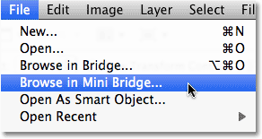
*Go to File > Browse in Mini Bridge.*

Or, you can go up to the **Window** menu, choose **Extensions**, and then choose **Mini Bridge**:

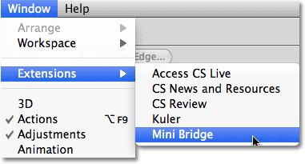
*Go to Window > Extensions > Mini Bridge.*

If you'd rather not take the scenic route, a faster way to open Mini Bridge is by clicking on the new **Mini Bridge** icon in the **Application Bar** at the top of the screen. You'll find it sitting beside the main Adobe Bridge icon:

*The Application Bar now contains a new Mini Bridge icon in Photoshop CS5.*

Or, if the Mini Bridge panel is collapsed on your screen, simply click on its **panel icon** to open it:

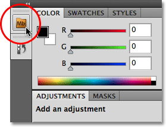
*Click the panel icon to open Mini Bridge. Click it again later to collapse it.*

### The Mini Bridge Home Page

Whichever way you choose to access it, Mini Bridge will open in the panel column along the right side of the screen:

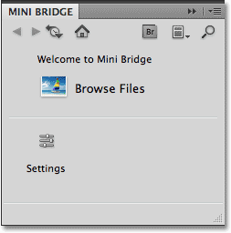
*The Mini Bridge as it first appears.*

When you first open Mini Bridge, it displays the Home Page with a short welcome message, a Browse Files option and a Settings option. You won't spend much time on this screen, but you can return to it at any time if you need to by clicking on the **Home Page** icon (the small house) in the row of icons along the top:

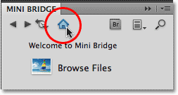
*Use the Home Page icon at any time to return to the main Home Page.*

### Browsing Files

To browse through the files and folders on your computer, click on the **Browse Files** button. For Mini Bridge to work, we need to have the full Adobe Bridge CS5 program open and running in the background, but by default, Mini Bridge will open it automatically for us when we click the Browse Files button if it's not open already:

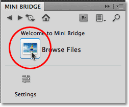
*Click the Browse Files button to navigate through your files and folders.*

Once we've selected Browse Files, the layout of the Mini Bridge panel changes, with the top half becoming the main folder navigation area and the bottom half becoming the area where we view and select the contents of the folder we've navigated to. Adobe refers to these areas as "pods", with the one on top being the **Navigation Pod** and the bottom one being the **Content Pod**:

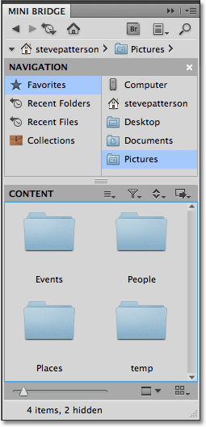
*The main Mini Bridge layout.*

The Navigation Pod takes up most of the space in the top half of Mini Bridge and is divided into two columns. The left column contains four main navigation headings - **Favorites**, which I currently have selected, as well as **Recent Folders**, **Recent Files**, and any **Collections** we've created in the full version of Bridge. As I mentioned earlier, we can't actually create Collections in Mini Bridge, but we can view any that we've already created. Clicking on any of these four main headings displays a related sub menu of choices in the right column. For example, with Favorites selected on the left, the right column is displaying the items that Adobe has gone ahead and selected for me as Favorites, like my Desktop, as well as my main Documents and Pictures folders:

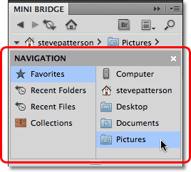
*Choose a main navigation category on the left, then a sub folder or category from the menu on the right.*

The Navigation Pod is limited to only two columns, so clicking on an item in the right column will display its contents in the Content Pod in the bottom half of the Mini Bridge panel. With my Pictures folder selected, we see that the Content Pod is displaying the sub folders that are inside my Pictures folder. To open folders in the Content Pod and view their contents, simply double-click on them. I'll double-click on the Places folder to open it:

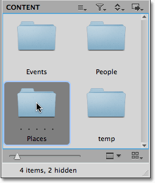
*Double-click on any folders in the Content Pod to open them.*

Inside my Places folder is another folder named Beach. I'll double-click on it to open it:

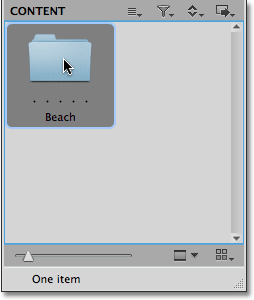
*Continue double-clicking on folders in the Content Pod until you reach your images.*

Finally, inside my Beach folder are my images, which appear in the Content Pod as small thumbnails with the file names listed below them, just like they'd appear in the full version of Bridge. Double-click on a thumbnail to open the image in Photoshop, or if the image is in the raw format, it will open inside the Camera Raw dialog box:

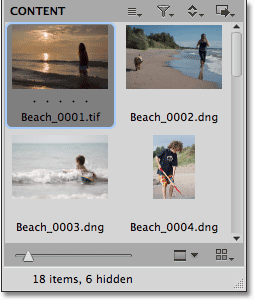
*Double-click on any thumbnails to open the images.*

### Customizing Mini Bridge

By default, the Content Pod is a little too small to be of much use, but there's some easy ways to customize the look of Mini Bridge and make it more useful. First, we can expand the size of the panel by clicking on any of its borders and dragging them outward. I'll drag out the left and bottom of Mini Bridge to make the panel larger. As the panel expands, so does the Content Pod, allowing us to see more of our images:

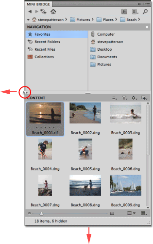
*Click and drag out any of the borders to make the Mini Bridge panel larger.*

We can also drag the dividing bar between the pods to change the amount of space that each pod is given inside the Mini Bridge panel. I'll click on the bar between the Navigation and Content Pods and drag it upward to give more room to the Content Pod:

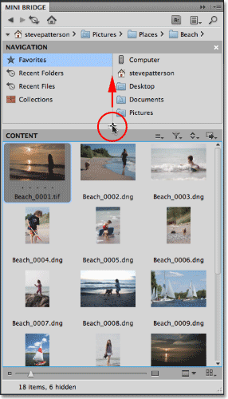
*Dragging the divider bar gives more room to the Content Pod and less to the Navigation Pod.*

The thumbnails are also a little too small to work with, but we can increase their size by dragging the thumbnail slider along the bottom of the Mini Bridge panel. The further you drag the slider towards the right, the larger the thumbnails appear:

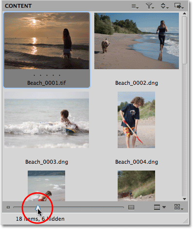
*Change the size of the image thumbnails using the slider below the Content Pod.*

Notice how, after increasing their size, the thumbnails in the bottom row are now too large to fit entirely within the Content Pod? If that bothers you, click on the **View** icon in the bottom right corner of Mini Bridge and select **Grid Lock** from the menu:

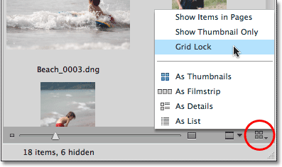
*Selecting Grid Lock from the View menu in the bottom right corner of Mini Bridge.*

This places the thumbnails inside a grid that limits their size so that as you drag the slider, the thumbnails will jump to the next available size that still allows them to fit entirely within the Content Pod rather than being partially cut off. To switch back to the normal view, click again on the View icon and then on Grid Lock to deselect it:

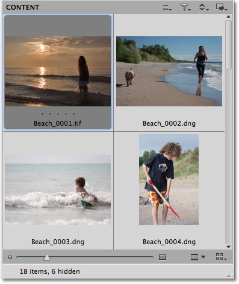
*The size of the thumbnails is now limited by the grid.*

By default, we scroll through the thumbnails in the Content Pod to view them all, but Mini Bridge also lets us view them as pages. Click again on the **View** icon in the bottom right corner and select **Show Items in Pages** from the top of the menu:

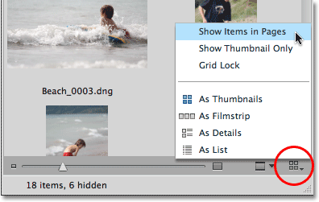
*Click on the View icon and select Show Items in Pages.*

Now, rather than having the thumbnails appear as a long list to scroll through, they appear as a collection of pages that we can easily move forward and back through by clicking on the **left and right arrows** in the bottom right corner of the Content Pod. The number of pages will depend on how many images are in the folder and the size of the thumbnails. To switch back to the scrollable thumbnail list, click again on the View menu and then on Show Items in Pages to deselect it:

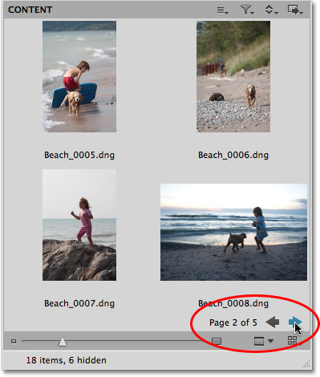
*Use the Forward and Back icons to move back and forth through the thumbnail pages.*

To make even more room for the thumbnails, you can turn off their file names and other information and display only the thumbnails themselves by selecting **Show Thumbnail Only** from the View menu:

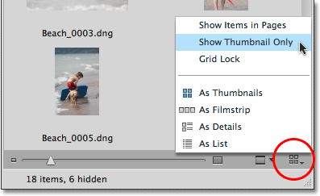
*Click on the View icon and select Show Thumbnail Only.*

Now, only the thumbnails appear in the Content Pod. To display the file names and other information again, click back on the View icon and deselect Show Thumbnail Only:

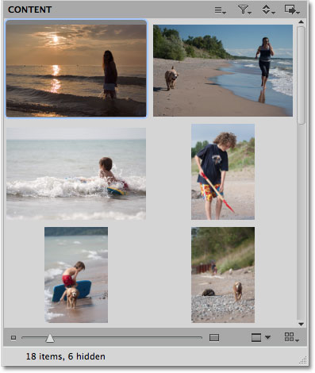
*Only the thumbnails themselves now appear.*

### Content Layouts

The full version of Adobe Bridge gives us four different layouts for how the thumbnails appear in the Content Panel and what information is displayed along with them, and Mini Bridge gives us access to these exact same layouts for the Content Pod. If we click again on the View icon, we see the four layouts listed at the bottom of the menu - **As Thumbnails**, **As Filmstrip**, **As Details**, and **As List**. The default layout is As Thumbnails, which is what we've seen so far, but I'll click on As Filmstrip to select it:

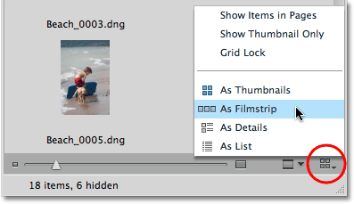
*Four different layouts for the Content Pod are available from the View menu.*

In the Filmstrip layout, the thumbnails appear in a single horizontal row that we can scroll through using the slider bar below them:

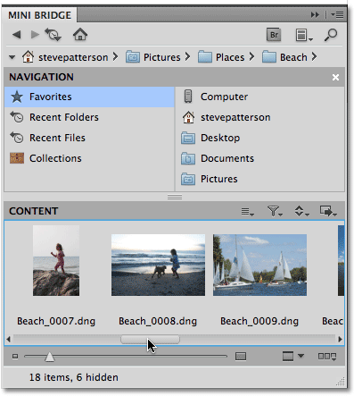
*Filmstrip mode lets us scroll horizontally through the thumbnails like a filmstrip.*

The As Details layout will display the thumbnails along with lots of information about them, like the date they were taken, the file size, file type, and so on. The As List layout will display them as a simple list, similar to how they would appear if you were viewing the contents of the folder with your computer's operating system. I'll switch back to the As Thumbnails layout.

### Previewing Images

Directly to the left of the View icon is the **Preview** icon. Click on a thumbnail that you want to see a larger preview of, then click on the Preview icon:

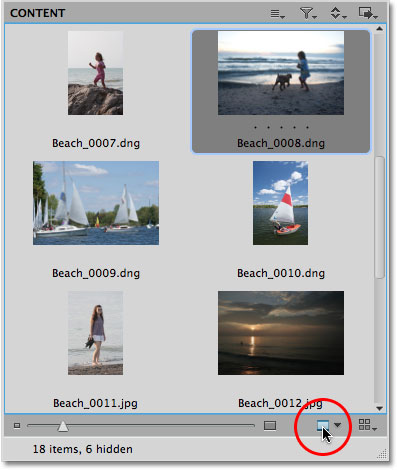
*Select a thumbnail to preview, then click on the Preview icon.*

You can also access the Preview command by pressing **Shift+Spacebar** if you prefer keyboard shortcuts. Either way, the Content Pod will temporarily be replaced with a larger version of the image, filling up as much of the space as possible. Click the **Close** button in the bottom right corner to close the preview and switch back to the normal Content Pod view:

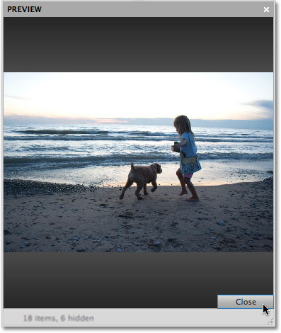
*In Preview mode, the selected image expands to fill the Content area.*

Clicking on the small arrow to the right of the Preview icon will open a menu with additional options for previewing images (**Slideshow**, **Review Mode** and **Full Screen Preview**), all of which are brought over from the full version of Adobe Bridge. Click on any of them in the list to select them, or click anywhere outside of the menu to close it:

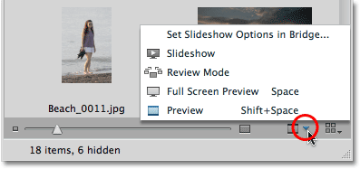
*Mini Bridge also shares the same preview options as the full Adobe Bridge.*

### Selecting, Filtering And Sorting The Images

In the top right corner of the Content Pod are some options for selecting, filtering, and sorting the images. Starting from left to right, the **Select** icon gives us standard options for selecting and deselecting images and for showing or hiding certain files:

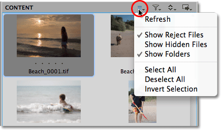
*Use the Select menu to quickly select or deselect all images.*

Next is the **Filter** icon, which lets us show or hide images based on the star rating or label we applied to them using the full version of Adobe Bridge:

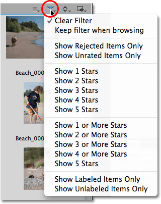
*Use the full version of Adobe Bridge to add ratings or labels to your images.*

By default, Mini Bridge sorts the images inside the Content Pod based on filename, but click on the **Sort** icon to bring up a menu with lots of other ways to sort them, including by file type, size, date created, and so on. Uncheck the **Ascending Order** option at the top of the menu if you'd prefer to view them in descending order:

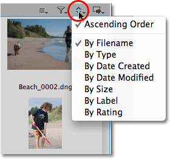
*Choose from lots of diferent ways to sort the images inside the Content Pod.*

The fourth and final icon in the Content Pod is the **Tools** icon, which has nothing to do with selecting, filtering or sorting images. Clicking on it gives us access to several of Photoshop's powerful features like **Photomerge** and **Merge to HDR Pro**, which is also new in Photoshop CS5:

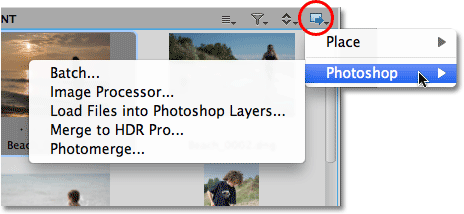
*Use the Tools menu for quick access to Photoshop features like Batch, Merge to HDR Pro or Photomerge.*

### Navigating Through Folders

In the top left corner of Mini Bridge, above the Navigation Pod, are some options that help us navigate easily through the folders on our computer. Use the **Browse** buttons to move back and forth through your folder browsing history, just as you would in your favorite web browser:

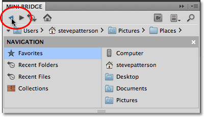
*Use the Back (left arrow) and Forward (right arrow) icons to move back and forth through your browsing history.*

The icon to the right of the Browse buttons lets us quickly jump to any parent folder, or to any recently viewed folder or file. It also gives us another way to access our Favorites:

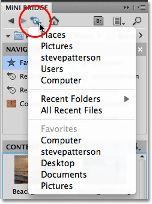
*Quickly jump to any parent folder, or any recently viewed folder or file.*

### The Path Bar

One of the most helpful navigation tools in Mini Bridge, as well as in the full version of Adobe Bridge, is the **Path Bar** which runs along the top just above the Navigation Pod. The Path Bar shows us the complete path to our currently selected folder. For example, reading it from right to left, it's showing me that I'm currently viewing my Beach folder, which is inside my Places folder, which is inside my Pictures folder, and so on. Not only does the Path Bar display this information, but we can use it to jump instantly to any folder listed in the path simply by clicking on its name:

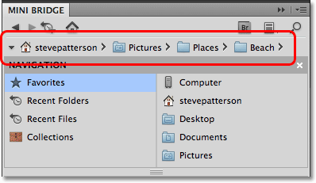
*The Path Bar shows us the complete path to the folder we're in, and lets us jump to any folder listed in the path.*

If, for some reason, you'd rather not view the Path Bar, click on the **Panel View** icon in the top right of Mini Bridge, then click on Path Bar to deselect it. Click it again later to turn it back on. You can also choose to show or hide the Navigation Pod and **Preview Pod** from here. We haven't seen the Preview Pod yet since it's turned off by default, so I'll select it from the list:

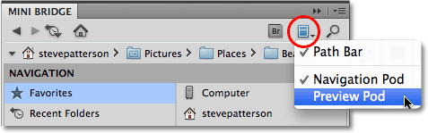
*Use the Panel View menu to show or hide the Path Bar, Navigation Pod or Preview Pod.*

### The Preview Pod

The Preview Pod appears to the right of the Navigation Pod, effectively cutting the width of the Navigation Pod in half, and displays a preview of the image that's currently selected in the Content Pod. Problem is, the preview is too small to be of any real use, so it's usually best to leave the Preview Pod turned off and let the Navigation Pod use up the space. As we saw earlier, a better way to preview images is with the Preview option in the bottom right corner of the Content Pod:

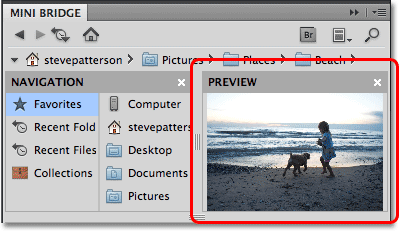
*The Preview Pod is great at taking up space but not much else. Best to leave it off.*

To search for specific files, click on the Search icon (the magnifying glass) in the top right corner of Mini Bridge:

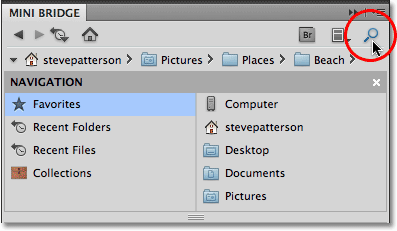
*Click on the magnifying glass to search for files.*

And finally, if you need access to advanced features in the full version of Adobe Bridge CS5, click on the **Adobe Bridge** icon to quickly jump to it:

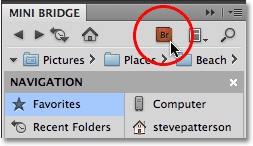
*The full version of Adobe Bridge CS5 is always just a click away.*