# Photoshop Actions – The Built-In Action Sets

> Source: [https://www.photoshopessentials.com/basics/photoshop-actions/more-built-in-actions/](https://www.photoshopessentials.com/basics/photoshop-actions/more-built-in-actions/)
> Downloaded and converted to Markdown.

If the dozen or so actions that make up the [Default Actions set in Photoshop](/basics/photoshop-actions/default-actions/) (or the Sample Actions set in Photoshop CS2, as we looked at previously) have you hungry for more, you'll be happy to know that there's lots more where that came from. And when I say "where that came from", I mean it quite literally. Photoshop's default actions are just a sample of all the actions that install with Photoshop, which explains why they're called "Sample Actions" in Photoshop CS2. Photoshop ships with several other action sets, and every action we find in the Default Actions set is taken from one of these other sets.

Each of these additional action sets can be found at the bottom of the Actions palette's menu. In Photoshop CS3, click on the menu icon in the top right corner of the Actions palette. In Photoshop CS2 and earlier, click on the small, right-pointing arrow in the top right corner of the Actions palette. The menu for the Actions palette will appear, and if we look down at the very bottom of the menu, we can see the additional action sets, with names like **Commands**, **Frames**, **Image Effects**, **Text Effects**, and so on:

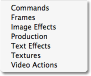
*Additional action sets are found at the bottom of the Actions palette's menu.*

#### Loading An Additional Action Set

To load any of these additional action sets into Photoshop, simply click on the name of the set. As soon as you click on the name, you'll see the action set appear in the Actions palette below the Default Actions set. For example, I'll click on the **Image Effects** set:

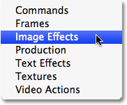
*Click on the name of an action set to select it.*

When I do, the Image Effects action set appears in my Actions palette directly below the Default Actions set. I'll click on the triangle to the left of the action set's name to twirl it up so we can see all of the image effects actions inside the set:

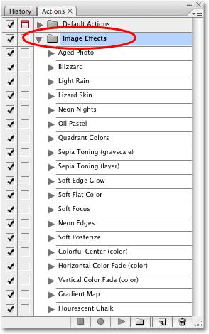
*The Image Effects action set is now loaded into Photoshop.*

As you can probably guess by the name of the action set, each of these actions contains the steps necessary to create various image effects when you play them. If you've spent some time with Photoshop's default actions, you may have already noticed that some of the actions in the Image Effects set, like the "Sepia Toning (layer)", "Quadrant Colors", and "Gradient Map" actions, are also included in the Default Actions set. As I mentioned previously, that's because the default actions are just a small sample of all of the actions that Photoshop comes with.

#### Playing An Action You've Loaded Into The Actions Palette

To play any of the actions you've loaded into Photoshop, simply select the action by clicking on it, then click on the *Play* icon at the bottom of the Actions palette. Here I have an image that I think would look good with a sepia tone effect:

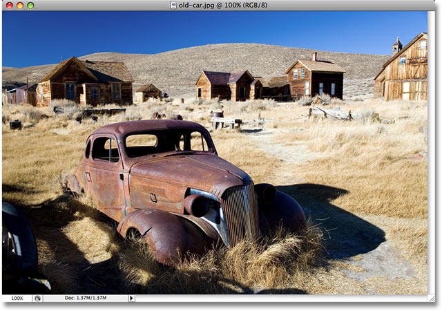
*A photo of an old car opened in Photoshop.*

One of the actions included in the Image Effects set (and also in the Default Actions set) is **Sepia Toning (layer)**, which will automatically add a sepia effect to my image for me. As I mentioned previously, the reason the word "layer" is included after the name of the action is simply to let us know that the effect will be applied to whichever layer we currently have selected. If I look in my Layers palette, I can see that I only have one layer at the moment, the Background layer which holds my photo, so there's no need to worry about which layer is selected:

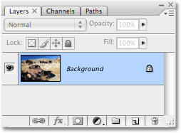
*The Layers palette showing the photo on the Background layer.*

To play the Sepia Toning action, I'll simply click on it to select it in the Actions palette, then I'll click on the *Play* icon at the bottom of the palette, just like I did when I ran the Vignette action earlier:

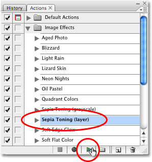
*Select the action you want to run, then click on the Play icon at the bottom of the Actions palette.*

If you look closely to the left of the Sepia Toning action's name, you'll notice that the dialog box toggle icon box is empty, which tells us that no dialog boxes will appear when we run this action. Photoshop will complete every step on its own without stopping to ask us anything along the way. And sure enough, after clicking the Play icon, Photoshop goes ahead and applies a sepia tone effect to my photo for me:

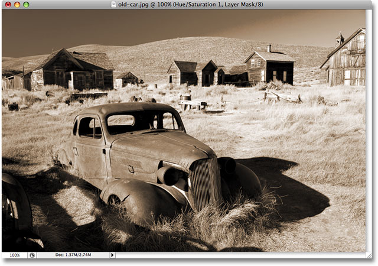
*The photo now has a sepia tone effect applied to it after running the action.*

Just as we saw with the Vignette action earlier, the result isn't too bad at all, especially for an action that's included for free with Photoshop! If I look in my Layers palette, I can see what Photoshop has done:

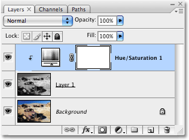
*The Layers palette after running the Sepia Toning action.*

Before running the action, we had only one layer, the Background layer. Now, with the action completed, we can see that we have three layers. If we look at the layer preview thumbnails, we can see that the layer directly above the Background layer, "Layer 1", contains a copy of the original image, and this copy has been desaturated (all the color has been removed). And at the very top of the layer stack, we find a Hue/Saturation adjustment layer, which is what's giving us our sepia color.

To see exactly what Photoshop has done with the action, let's twirl open the Sepia Toning action in the Actions palette, and we'll twirl open the individual steps as well so we can view all the details:

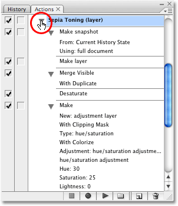
*Viewing the details of the Sepia Toning action in the Actions palette.*

Not only does this ability to view specific details of an action help us troubleshoot actions we're recording ourselves, it also allows us to analyze other people's actions so we can learn from them! In the case of our Sepia Toning action, we can see that the action consists of five main steps, beginning with "Make snapshot", which creates a snapshot in the History palette of how the image looked immediately before running the action. Photoshop then makes a new blank layer above the Background layer (step 2), merges the original image on the Background layer onto the new blank layer above it while keeping the Background layer intact (step 3), desaturates the image on the new layer (step 4), and finally, adds a Hue/Saturation adjustment layer, clips it to the layer below so that only the desaturated layer will be affected, selects the Colorize option, and sets the Hue, Saturation and Lightness values to create the sepia tone. All of these steps are performed automatically for us by Photoshop as part of the action!

Let's look at another of Photoshop's built-in actions, this time from a different action set. I'll load in the **Frames** action set by selecting it from the bottom of the Actions palette's menu, just as I did with the Image Effects set on the [previous page](/basics/photoshop-actions/default-actions/):

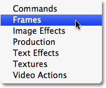
*Selecting the Frames action set from the Actions palette menu.*

This loads the Frames set into the Actions palette for me, directly below the Image Effects set. I'll twirl open the Frames set by clicking on the triangle to the left of the set's name so we can see all of the actions inside of it. As the name of the action set implies, each of these actions will create a frame effect for us:

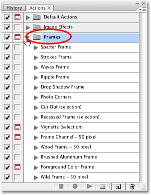
*The Actions palette displaying the individual actions inside the Frames set.*

If you look closely, you'll notice that the Vignette action we ran from the Default Actions set is also found here in the Frames set. You'll also find the "Frame Channel - 50 pixel" and "Wood Frame - 50 pixel" actions in both the Frames set and the Default Actions set. Of course, there's lots more frame actions available in the Frames set, and running any of them is as easy as selecting the one you want and clicking the Play icon at the bottom of the palette, just as we've done a couple of times already.

Let's try out one of these frame effects. Here's a photo that I want to apply a frame effect to:

*A photo of a grandmother and granddaughter.*

We've already seen what the Vignette action does, so this time, let's see what sort of effect the Photo Corners action will give us. I'll click on **Photo Corners** in the Actions palette to select it, then I'll click on the **Play** icon at the bottom of the palette:

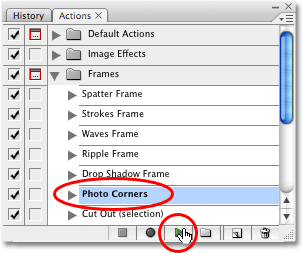
*Selecting and playing the Photo Corners action.*

Notice here as well that the dialog box toggle icon to the left of the Photo Corners action's name is empty, telling us that Photoshop will run through this entire action from beginning to end without popping up any dialog boxes asking us for information. And sure enough, after clicking the Play icon and waiting a couple of seconds for Photoshop to complete the steps, my image now has a photo corners effect applied to it:

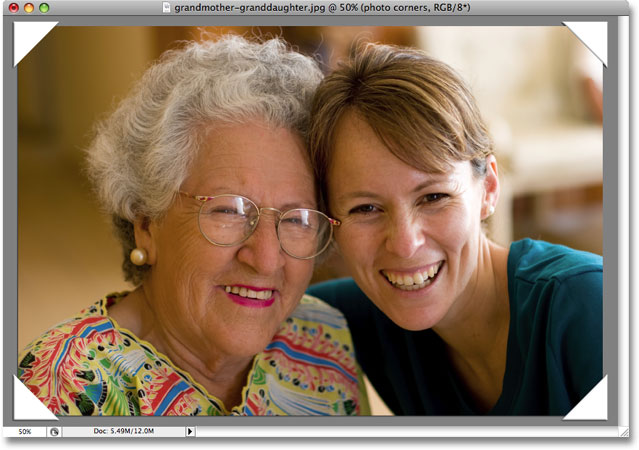
*The image now has a photo corners effect applied to it.*

As with many of the effects actions that Photoshop comes with, the end result probably won't win any awards, but if you don't have a lot of time and need something fast, they can certainly be helpful. Plus, if you're a beginner, playing these actions and checking out the details of each step is a great way to learn! In this case, we ran an action named Photo Corners and photo corners is what we got. Considering that we had to do absolutely nothing ourselves to create the effect other than play the action, and that the action is included for free with Photoshop, it's hard to find fault with it.

Having said that, I'm not a big fan of the colors that this action uses. I could probably live with the white photo corners themselves, but the gray background does nothing for me. Wouldn't it be great if we could edit the action and customize it ourselves? Well, guess what? We can! Editing an action is easy! At least, it's easy once you've figured out which steps you need to edit.