# How To Move JPEG Images From Lightroom To Photoshop

> Source: [https://www.photoshopessentials.com/basics/move-jpeg-images-lightroom-photoshop/](https://www.photoshopessentials.com/basics/move-jpeg-images-lightroom-photoshop/)
> Downloaded and converted to Markdown.

Learn how to seamlessly move a JPEG image from Adobe Lightroom over to Photoshop for further editing. Then learn how to move the edited version back to Lightroom when you're done! For Lightroom CC and Photoshop CC.

As we learned in the previous tutorial on [how to move raw files between Lightroom and Photoshop](/basics/move-raw-files-lightroom-photoshop/), Lightroom is primarily a raw image processor, meaning it was designed for improving and enhancing the look of photos that were captured and saved by your camera in the raw file format. Yet Lightroom can also be used just as easily with non-raw files such as JPEG, TIFF and Photoshop's own PSD format.

Even though raw files have serious advantages over JPEGs (check out our [Raw vs JPEG For Photo Editing](/photo-editing/raw-vs-jpeg-for-photo-editing/) tutorial for more details), JPEG remains the most popular and widely-used format for capturing and storing photographic images. In this tutorial, we'll learn how to move JPEG files between Lightroom and Photoshop, but everything we'll cover also applies to TIFFs and PSDs.

This lesson is part of my [Getting Images into Photoshop](/basics/opening-images-photoshop/ "How to open images into Photoshop") Complete Guide.

Let's get started!

### Step 1: Make Your Initial Image Adjustments In Lightroom

As with the previous tutorial, I won't be covering Lightroom or Photoshop in any great detail here so we can focus our attention on how to move JPEG files between them. Here's an image I'm currently working on in Lightroom's **Develop module**. I shot this one through the window of a train as it traveled through the mountains. It's not bad, but I was so focused on the scenery that I failed to notice the hydro wires running through the top of the frame:

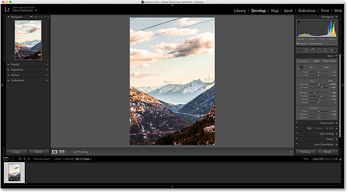
*A JPEG file open in Lightroom's Develop module.*

Here's a larger view of the image to make things easier to see:

*The overall photo is nice enough, but the wires along the top are a problem.*

This image was saved as a JPEG file. We know it's a JPEG because, if we look in the bar above the **Filmstrip** along the bottom of Lightroom, we can see not only the file's name but also the "**.jpg**" extension at the end:

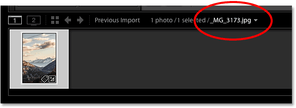
*The bar above the Filmstrip shows the file name and extension.*

I'd like to remove those wires, but I can't do that in Lightroom. That's because, as we learned in the [previous tutorial](/photo-editing/move-raw-files-lightroom-photoshop/), Adobe Lightroom is not a pixel editor. Rather than changing the pixels in an image, Lightroom works by storing instructions on how to improve and enhance the photo's appearance, and what it shows us on the screen is simply a *preview* of what the image *would* look like with those instructions applied. It doesn't actually apply our changes until we go to export the photo later, either for the web, print, or as we'll see, when passing the image over to Photoshop. Even then, Lightroom does not apply our changes to the original photo. Instead, it creates a *copy* of the image when we go to export it and applies our changes to the copy. The original photo is never harmed.

The advantage to the way Lightroom works is that everything we do is entirely non-destructive. We can make as many changes as we like without affecting the original image at all. Using Lightroom's simple and intuitive sliders, we can easily fix any overall exposure, contrast or color problems, and bring out hidden detail in the shadows and highlights. We can add some initial sharpening to the image, fix lens distortion issues, and even add some basic effects, like split toning or vignetting. There's lots that Lightroom can do.

Yet there's lots that Lightroom can *not* do. That's because there's only so much we can do without changing the pixels in the image. If I want to remove those wires, for example, I'll need to edit the pixels. Lightroom can't do it, but Photoshop definitely can. Photoshop's pixel-editing power is unmatched, and once we learn to use Lightroom and Photoshop together as a team, taking advantage of each program's unique strengths, then there's really nothing we can't do with our images.

The general rule in a good Lightroom/Photoshop workflow is to make as many improvements to the image as we can in Lightroom. In many cases, you'll find that Lightroom is all you need. But if you've done all you can in Lightroom and the image still needs further editing, like my issue here with the hydro wires, then it's time to pass the image over to Photoshop.

### Step 2: Move The Image To Photoshop

If we look in my **Basic** panel in Lightroom's Develop module, we see that I've made some initial adjustments to the exposure, contrast, and color:

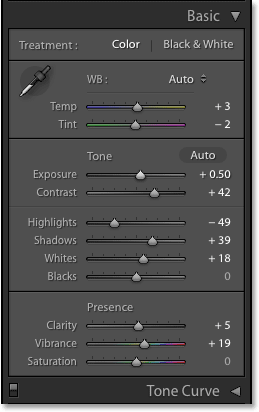
*The Basic panel in Lightroom is where we make most of our image adjustments.*

I've also added some initial sharpening in the **Detail** panel and fixed some lens distortion in the **Lens Corrections** panel. There really isn't much more that needs to be done with this image in Lightroom, so I'm ready to move it over to Photoshop.

To move a JPEG file from Lightroom to Photoshop, go up to the **Photo** menu (in Lightroom) in the Menu Bar along the top of the screen, choose **Edit In**, and then choose **Edit in Adobe Photoshop**. Your specific version of Photoshop will be listed, which in my case here is Photoshop CC 2015. Once you know where the actual command is located, you may find it's easier in the future to simply press **Ctrl+E** (Win) / **Command+E** (Mac) on your keyboard, but either way works:

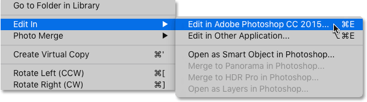
*In Lightroom, go to Photo > Edit In > Edit in Adobe Photoshop.*

Before sending the file to Photoshop, Lightroom will ask you what exactly it is that you want to send, and there's three options: **Edit a Copy with Lightroom Adjustments**, **Edit a Copy**, and **Edit Original**. If this is the first time you're sending the image to Photoshop from Lightroom, as it is for me with this image, choose the first option, **Edit a Copy with Lightroom Adjustments**, then click the **Edit** button. This will create a copy of your image for sending to Photoshop, and it will embed your Lightroom adjustments into the image so that they're visible in Photoshop. We'll look at the other two options later:

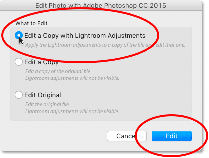
*Choosing "Edit a Copy with Lightroom Adjustments".*

This will launch Photoshop if it isn't already running, and then your image will open in Photoshop:

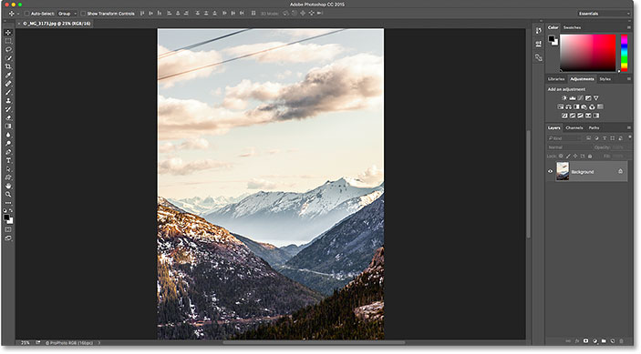
*The image has been moved to Photoshop, complete with the adjustments made in Lightroom.*

### Step 3: Edit The Image In Photoshop

With my image now open in Photoshop, I can remove the wires. I'll go through this quickly since removing wires from a photo is not really the focus of this tutorial. I'll start by adding a new blank layer to the document to keep my edits separate from the image itself. To do that, I'll click the **New Layer** icon at the bottom of the **Layers panel**:

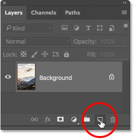
*Clicking the New Layer icon.*

Photoshop adds the new layer above the Background layer:

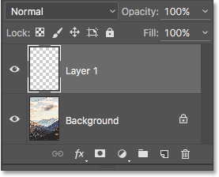
*A new blank layer appears.*

To remove the wires, I'll use Photoshop's **Spot Healing Brush Tool** which I'll grab from the **Toolbar** along the left of the screen:

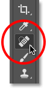
*Selecting the Spot Healing Brush Tool.*

In the **Options Bar** along the top of the screen, I'll make sure that **Content-Aware** and **Sample All Layers** are selected:

*Choosing "Content-Aware" and "Sample All Layers" in the Options Bar.*

I'll start with the lowest of the three wires. First, I'll resize my brush so it's just a little bit wider than the wire itself. To do that, I'll use the **left and right bracket keys** ( **[** and **]** ) on my keyboard. Pressing the left bracket key repeatedly will make the brush smaller. The right bracket key will make it larger:

*Making my brush size slightly wider than the area I want to remove.*

Since the wire runs in a straight line, I'll start by clicking with the Spot Healing Brush Tool at one end of the wire. Then, I'll press and hold my **Shift** key, move to the other end of the wire, and click again. This tells Photoshop to paint a straight line between the two spots where I clicked. At first, all we see is a dark gray overlay of where I painted. This is the area that Photoshop is analyzing, figuring out what to remove and what to replace it with:

*When removing long, straight sections such as wires, click at one end, then Shift-click at the other end.*

After a second or two, the overlay disappears, and so does the wire:

*Photoshop was able to quickly remove the first wire from the photo.*

I'll do the same thing with the wire above it, although this one looks like two wires overlapping each other since they branch off as they get closer to the left edge of the photo. I'll remove them in two passes. First, I'll click on the right end of the wire(s) with the Spot Healing Brush Tool. Then, I'll press and hold my **Shift** key and click on the left end to paint a straight line between the spots where I clicked:

*Painting over the second wire by clicking at one end, then Shift-clicking at the other.*

Photoshop takes a second or two to analyze the area, then does another excellent job of removing the wire. To get that remaining bit of wire that branched off above it, I'll again click on one end of the wire and then Shift-click on the other end to paint a straight line over it:

*Removing the section of wire I missed with the first pass.*

And just like magic, the wire has disappeared. Finally, I'll remove the remaining bit of wire in the upper left corner by clicking, then Shift-clicking on the ends:

*Removing the final wire from the upper left corner.*

And now, thanks to Photoshop's Spot Healing Brush Tool and a few simple clicks with the mouse, the wires are gone:

*The hydro wires were no match for Photoshop.*

### Step 4: Save And Close The Image

Now that I'm done with my Photoshop edits, I want to save my work and send the edited version back over to Lightroom. To do that, I'll go up to the **File** menu at the top of the screen and choose **Save**. It's very important that we choose "Save" and not "Save As". The reason is that Lightroom can automatically add the edited version to its catalog for us, but only if the edited version is saved into the *same folder* as the original image. If we choose "Save As", we run the risk of accidentally saving the file to the wrong location. Choosing "Save" will ensure that it's saved to the same folder as the original:

*Going to File > Save.*

With the image now saved, we can close out of it in Photoshop by going back up to the **File** menu and choosing **Close**:

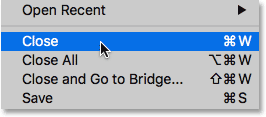
*Going to File > Close.*

### Step 5: Return To Lightroom

Now that we've saved and closed the image in Photoshop, we can return to Lightroom where we see the image now updated with our Photoshop edits. In my case, the wires along the top are now gone:

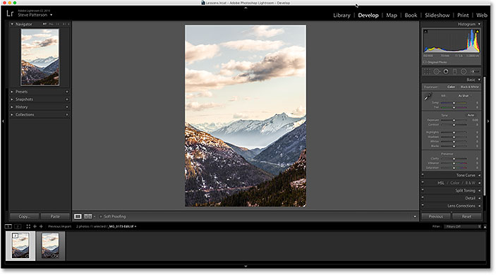
*The Photoshop edits are now visible in Lightroom.*

However, while it looks like the same image, if we look down in the **Filmstrip**, we see that I now actually have *two* versions of the image; one is the original, the other is the version I edited in Photoshop. That's because back when we sent the file over to Photoshop, we chose the "Edit a Copy with Lightroom Adjustments" option which told Lightroom to send Photoshop a copy of the image, not the original. The copy, which contains our Photoshop edits, has now been returned to Lightroom and added to its catalog along with the original.

There's a couple of ways we can tell that this is not the original image. First, if we look at the file's name above the Filmstrip, we see that it has "**-Edit**" appended to the end of the name, indicating that this is the edited version. Also, the original image was a JPEG file, but the edited version is no longer a JPEG. Instead, it was saved automatically as a **TIFF** file (with a "**.tif**" extension). This is Lightroom's default behavior. You can change it in Lightroom's Preferences, and we'll see how to do that in another tutorial:

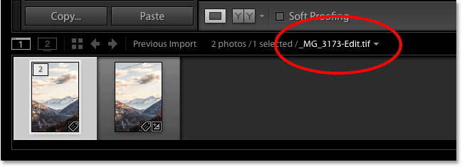
*The Photoshopped version was saved as a TIFF file with "-Edit" added to its name.*

Another way we can tell that this is not the original image is that, if we look in my **Basic** panel, we see that all of my sliders have been reset to zero, and that's because Lightroom considers this edited version to be a brand new file. We can still make further adjustments in Lightroom if we need to. We just don't have access to any of our previous editing history:

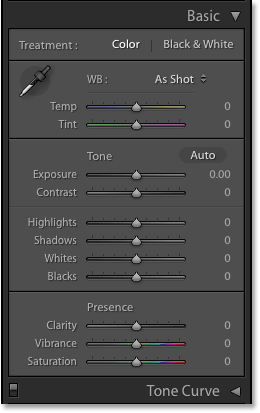
*All of the sliders in the Basic panel have been reset to zero.*

### Making Further Edits In Photoshop

Now that you're back in Lightroom, what if you need to make further edits to the image in Photoshop? All you need to do is make sure you have the correct version of the image selected in Lightroom (that is, the version with your previous Photoshop edits). Then, just as before, go up to the **Photo** menu, choose **Edit In**, and then choose **Edit in Adobe Photoshop**:

*Going once again to Photo > Edit In > Edit in Adobe Photoshop.*

Lightroom will again ask what it is exactly that you want to send over to Photoshop. This time, we don't need another copy of the image. We want to open the exact same file that we worked on previously in Photoshop. Since the first two options ("Edit a Copy with Lightroom Adjustments" and "Edit a Copy") will both make another copy of the image, they're not the options we want. Instead, we want to choose the third option, **Edit Original**.

If you *do* want to create another copy of the image at this point (maybe for experimenting with an idea), don't choose "Edit a Copy with Lightroom Adjustments" like we did originally. The reason is that this option will flatten your image when it opens in Photoshop, so any layers you added previously will be gone. Instead, choose the second option, **Edit a Copy**. This will send a new copy of the file over to Photoshop with all of your layers intact.

The only other important thing to note here is that if you’ve made any additional adjustments to the image in Lightroom since the last time you saved it in Photoshop, choosing either “Edit Original” or “Edit a Copy” will not pass those adjustments over to Photoshop. Instead, you’ll see the image in Photoshop as it appeared before those Lightroom adjustments were made. However, it’s only temporary. As soon as you return to Lightroom, the missing adjustments will reappear.

Since I don't need another copy of the file, I'll choose **Edit Original**, then I'll click the **Edit** button:

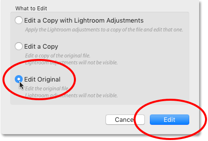
*Choose "Edit Original" to work on the same file as before in Photoshop.*

This re-opens my file in Photoshop, ready for further editing:

*The previously-edited file is back in Photoshop.*

If we look at the document **tab** above the image to view the name of the file, we see that I did open the TIFF file, not the original JPEG image:

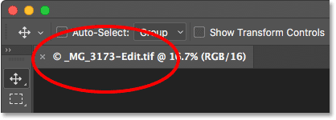
*The document tab shows us which image we opened from Lightroom.*

And, if we look in my Layers panel, we see that both of my previous layers are still intact:

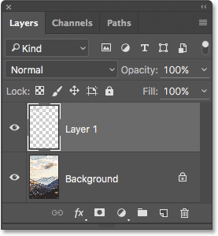
*The Layers panel showing the layer ("Layer 1") I added previously in Photoshop.*

When you're done with your latest round of Photoshop edits, save the file the same way you did before by going up to the **File** menu and choosing **Save**. Then, close the file by going back up to the **File** menu and choosing **Close**. Return to Lightroom, where you'll see your image updated with your latest changes.

### Where to go from here...

And there we have it! If you've been following along from the beginning, we've now covered all the ways to open images into Photoshop! But while opening images is important, so is knowing how to close them. In the next lesson, you'll learn [how to close an image in Photoshop](/basics/close-images-photoshop/ "How to close images in Photoshop"), including how to close multiple images at once!

You can also skip to one of the other lessons in this Complete Guide to [Getting Images into Photoshop](/basics/opening-images-photoshop/ "How to open images in Photoshop"). Or visit my [Photoshop Basics](/basics/ "Learn more") section for more tutorials!