# Moving Photos Between Tabbed Documents In Photoshop

> Source: [https://www.photoshopessentials.com/basics/move-photos-tabbed-documents/](https://www.photoshopessentials.com/basics/move-photos-tabbed-documents/)
> Downloaded and converted to Markdown.

In a previous tutorial, we looked at [how to move photos between Photoshop documents](/basics/moving-photos-between-documents/), an absolutely essential skill for blending photos together since we need both images to be inside the same document before we can do anything interesting with them. In that tutorial, we covered three simple ways to move photos - "drag and drop", the Duplicate Layer command, and "copy and paste" - that work with all versions of Photoshop.

In Photoshop CS4, though, Adobe made some rather big changes to Photoshop's interface by introducing [**tabbed document windows**](/basics/photoshop-cs4/tabbed-document-windows/). The classic floating document windows that have been part of Photoshop since forever are still around, but Adobe has been making a big push lately to create a consistent looking interface across all of its products so that anyone who's comfortable with using Photoshop, Illustrator, InDesign or any Creative Suite program can jump right into any of the other programs and feel at least somewhat familiar with it.

That's great for Adobe, but possibly not so great for anyone who's upgraded from an earlier version of Photoshop and suddenly finds that dragging and dropping photos between documents no longer works. Or at least, no longer works the way it used to. As we'll learn in this tutorial, you *can* still drag a photo from one tabbed document into another. It's just not quite as intuitive as it is with floating document windows.

### Photoshop Preferences

I mentioned a moment ago that floating document windows are still an option in Photoshop CS4 and CS5, and we can tell Photoshop which type of interface we prefer to use in the [Preferences](/basics/cs5/preferences/). On a PC, go up to the **Edit** menu in the Menu Bar along the top of the screen and choose **Preferences**. On a Mac, go up to the **Photoshop** menu and choose **Preferences**. You can also get to the Preferences with the handy keyboard shortcut **Ctrl+K** (Win) / **Command+K** (Mac). Either way opens the Preferences dialog box.

You'll see a list of various Preferences categories along the left of the dialog box. Click on the **Interface** category, second from the top:

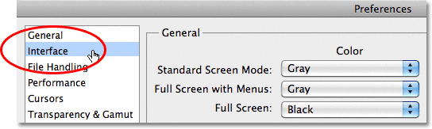
*Select the Interface category on the left.*

There, in the Panels & Documents section, you'll find an option that says **Open Documents As Tabs**:

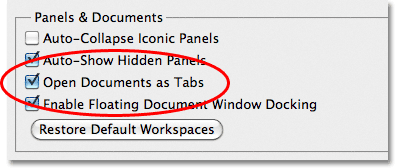
*The "Open Documents As Tabs" option in Photoshop's Interface Preferences.*

With his option selected (checked), Photoshop will open all images in tabbed document windows. If you prefer floating document windows, uncheck this option. In that case, you'll also want to uncheck the option below it, **Enable Floating Document Window Docking**. This tutorial assumes you're using the tabbed document window interface. And now, let's see how to move photos between them!

Here, I have two photos open in Photoshop, but unlike floating document windows which allow us to see both images at once, the tabbed document window interface only shows us one image at a time, at least by default. We'll see how to change that a bit later in the tutorial:

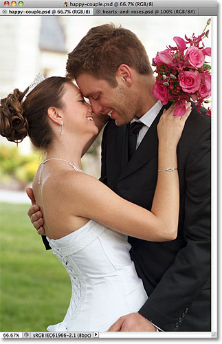
*One of two photos open in Photoshop using tabbed document windows.*

To switch between the photos, we need to click on their **name tabs** at the top of the document windows. The tab of the currently active document will appear highlighted. I'll click on the second photo's name tab to select it.

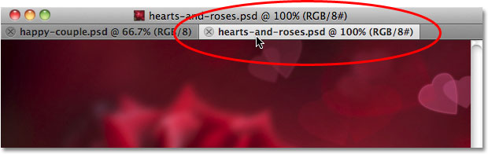
*Click on the name tabs at the top to switch between images.*

And now, we can see my second image:

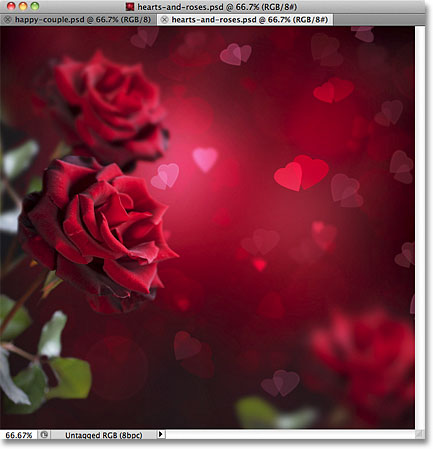
*The second image appears.*

With floating document windows, where we could see both images onscreen at once, dragging one photo into the other photo's document was simple. But how do you do it when you can only see one photo at a time? Well, it's not the most intuitive thing in the world, but it's actually very easy.

First, switch to the photo you want to move into the other document by clicking on its name tab. I want to move the wedding couple into the hearts and roses photo, so I'll click on the wedding couple's name tab to select it:

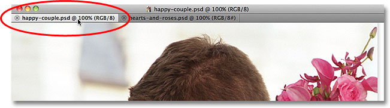
*Select the photo you need to move by clicking on its tab.*

We need Photoshop's **Move Tool** to move the photo, which you'll find at the top of the Tools panel. Click on its icon to select it:

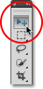
*Select the Move Tool.*

With the Move Tool selected, click anywhere inside the photo you need to move and, with your mouse button still held down, drag the photo up onto the name tab of the second document:

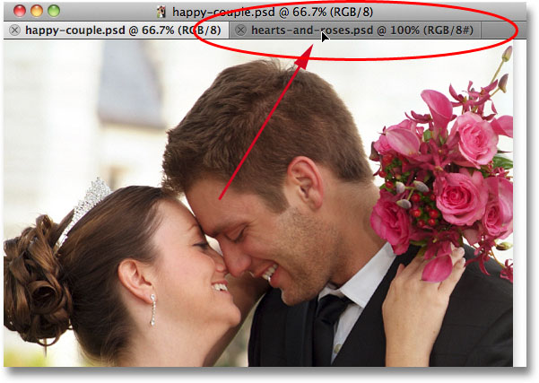
*Click inside the photo and drag it onto the name tab of the other document.*

Keep your mouse button held down as you hover the cursor over the name tab, and Photoshop will switch over to the second photo. Don't let go of your mouse button yet. Keep it held down and drag the cursor down into the second photo:

*Keep your mouse button held down and drag from the name tab into the second document.*

Release your mouse button at the spot where you want the photo to appear and Photoshop drops it into place. Or, hold down your **Shift** key just before releasing your mouse button and Photoshop will center the photo inside the document. Here, I've simply dropped it along the right of the second photo:

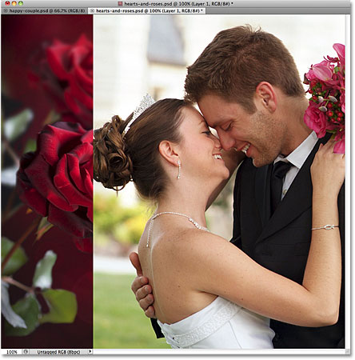
*Release your mouse button to drop the photo into the second document.*

If we look in the Layers panel, we see that the hearts and roses image, which was the original image in this document, is sitting on the Background layer, and the wedding couple photo has been added on its own layer above the Background layer:

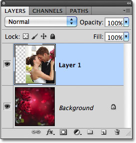
*The Layers panel showing both photos, each on its own layer in the same document.*

By default, tabbed document windows only show one image at a time, but there's a way to change that and make dragging and dropping between documents easier, which we'll look at next!

### The Arrange Documents Option

Another way to drag a photo from one document to another while using tabbed document windows is with the **Arrange Documents** option, which is part of the **Application Bar** that was also introduced in Photoshop CS4. On a Windows system, the Application Bar is combined with the Menu Bar at the top of the screen. On a Mac (which is what I'm using here), the Application Bar is separate and located directly below the Menu Bar:

*The Arrange Documents icon in the Application Bar.*

Earlier, I said that by default, tabbed document windows allow us to view only one image at a time, but here's where we can change that. Clicking on the Arrange Documents icon opens a menu with different layout choices for viewing multiple images on the screen at once. Since I only have two photos open at the moment, only the first two layouts - **2 up vertical** and **2 up horizontal** - are available to me. The others, which are for viewing 3, 4, 5 or 6 images at once, are grayed out but would be available if I had more images open. I'll select the 2 up vertical layout by clicking on its icon:

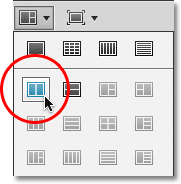
*Selecting the 2 up vertical layout.*

This displays both photos side by side each other on the screen:

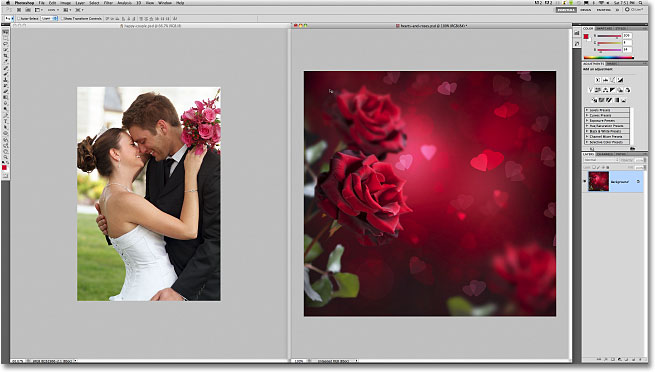
*The 2 up vertical layout lets us see both photos at once.*

At this point, dragging one of the photos into the other photo's document is as easy as if we were using floating document windows. Again, we need to have the **Move Tool** selected from the Tools panel. Click inside the photo you want to move to make it the active document. I'll click inside the wedding couple's photo to select it. Then, click again inside the photo and, with your mouse button still held down, drag the photo into the other document:

*Click and drag the photo into the other document, just as you would with floating document windows.*

Release your mouse button at the spot where you want the photo to appear, or hold down your Shift key, then release your mouse button, then release the Shift key to have Photoshop center the image inside the document, as I've done here:

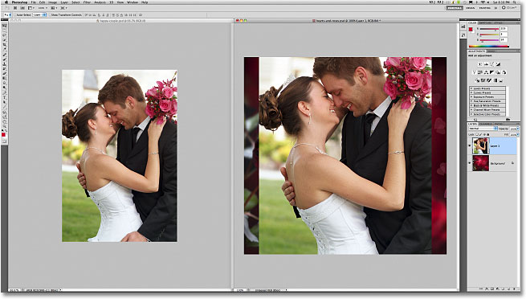
*Holding the Shift key before releasing my mouse button centered the photo in the document.*

And once again if we look in the Layers panel, we see that both photos are now inside the same document:

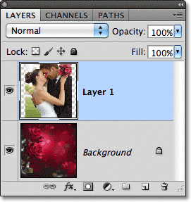
*The Layers panel again showing both photos, each on its own layer.*

To switch back to the normal tabbed document windows layout when you're done, click again on the **Arrange Documents** icon in the Application Bar, then click on the **Consolidate All** option in the top left corner of the layout choices:

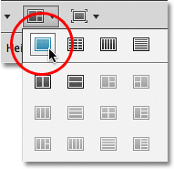
*Clcik again on the Arrange Documents icon, then click on the Consolidate All option.*

With both photos now inside the same document, I can blend them together to create a new image. I'll move the wedding couple a little to the right, then I'll go up to the top of the Layers panel and change their layer **blend mode** from Normal to **Overlay**. Finally, I'll use a [**layer mask**](/basics/layers/layer-masks/) to create a smooth transition between the roses and the left edge of the wedding couple photo. Here's what the Layers panel now looks like:

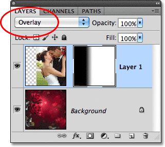
*The Layers panel showing the Overlay blend mode and the layer mask thumbnail.*

And here's my new image after blending the two photos together:

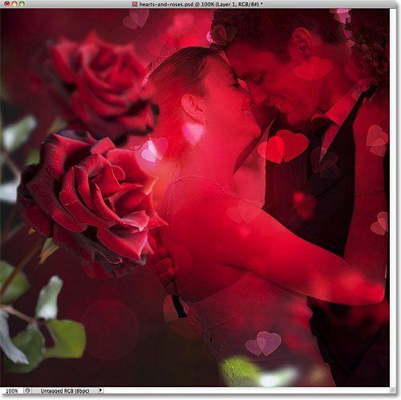
*The final result.*