# How To Move Raw Files From Lightroom To Photoshop

> Source: [https://www.photoshopessentials.com/basics/move-raw-files-lightroom-photoshop/](https://www.photoshopessentials.com/basics/move-raw-files-lightroom-photoshop/)
> Downloaded and converted to Markdown.

Learn how to easily move raw image files from Adobe Lightroom into Photoshop for further editing. Then how to return the edited version back to Lightroom when you’re done! Specifically, we’ll be looking at Lightroom CC and Photoshop CC and how to move an image seamlessly between them.

Both Lightroom and Photoshop have their place in a good image editing workflow. Rather than competing with each other for the title of "World's Best Image Editor", each program has its own unique strengths that balance out the other's weaknesses. Lightroom's non-destructive nature and intuitive controls are great for making initial *global* edits to the image; that is, improvements to the photo as a whole. With Lightroom, we can easily fix the exposure and white balance, enhance contrast and color saturation, add some initial sharpening, and more.

Yet for all its power, Lightroom is *not* a pixel editor. It works by storing instructions on how to improve and enhance the look of the image. What we see on the screen in Lightroom is nothing more than a *preview* of what the image *would* look like if we were to apply those instructions to the image. The benefit to this type of workflow is that it's entirely non-destructive; no matter what we do, the original photo remains safe and unharmed. The downside, though, is that there's only so much we can do non-destructively. At some point, we usually need to start making changes to the actual pixels in the image itself.

Lightroom can't do that. It's not a pixel editor, but Photoshop most definitely is! While there *are* ways to work non-destructively in Photoshop, its main strength is that it's a pixel editing powerhouse, making it great for *local* edits; that is, changes to a specific part of the photo. Photoshop has lots of features that are not available in Lightroom, like selection tools, layers and layer masks, blend modes, the ability to add text and graphics to our images, and much more. Photoshop also lets us work more creatively thanks to its many filters and its ability to composite multiple images together, something Lightroom simply can't do.

A good Lightroom/Photoshop workflow means we start off in Lightroom completing as much of the initial, global work as possible. Once we've done all we can in Lightroom, we then pass the image over to Photoshop for more localized or creative adjustments. Yet while we start off in Lightroom, we also *end* in Lightroom. That's because, along with being an image editor, Lightroom also manages and organizes our images, keeping track not only of our editing instructions but also where each image is stored on our computer, any ratings or keywords we've applied, the copyright information for each image, and lots more. Lightroom stores all of this information in a database which it calls a *catalog*, and because Lightroom and Photoshop work so seamlessly together, Lightroom can automatically add the edited version of our image to its catalog once we save our work in Photoshop! At least, it can if we follow the right steps, and we'll be learning all about those steps throughout this tutorial.

Lightroom was designed primarily as a raw image editor, but it can also work with non-raw files (JPEG, TIFF and PSD files). However, in this tutorial, we'll look specifically at raw files. There's a slight but important difference between moving raw and non-raw files from Lightroom to Photoshop, so we'll cover non-raw files in the [next tutorial](/photo-editing/move-jpeg-images-lightroom-photoshop/).

This lesson is part of my [Getting Images into Photoshop](/basics/opening-images-photoshop/) Complete Guide.

Let's get started!

### Step 1: Make Your Initial Image Adjustments In Lightroom

To keep us on track with the topic of this tutorial, I won't be covering Lightroom or Photoshop in any great detail here. Instead, I'll be skimming over certain things rather quickly (things that are not really important to the topic at hand) so we can focus our attention on how to move raw files between Lightroom and Photoshop.

As I mentioned, a good Lightroom/Photoshop workflow begins in Lightroom where we make our initial, global adjustments to the image. Here, we see an image that I've been working on in Lightroom's **Develop module**. This is a photo that I shot while on a cruise in Alaska (if you squint, you can see another cruise ship off in the distance):

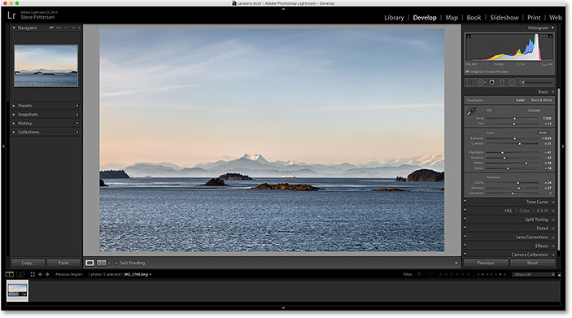
*A raw file open in Lightroom's Develop module.*

If we look in Lightroom's **Basic panel** in the column along the right, we see that I've already made some initial improvements to the white balance, exposure, contrast, color saturation, and more:

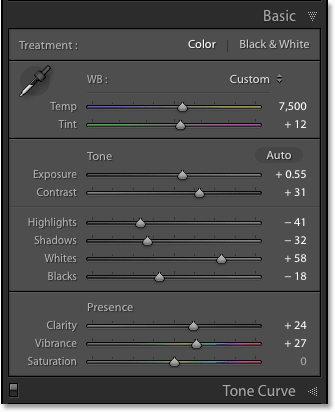
*The initial, global image enhancements.*

What's important to note here is that this is a *raw file*, meaning it was captured by my camera in the raw format. We know it's a raw file because, if we look in the bar above the **Filmstrip** along the bottom of Lightroom, we see that the file has a **.dng** extension at the end of its name. DNG stands for "Digital Negative" and it's Adobe's own version of the raw file format. Each camera manufacturer also has its own version of the raw format with its own three-letter extension (Canon uses .crw and .cr2, Nikon uses .nef, and so on). What's important here isn't the specific extension but that it is in fact a raw file, not a JPEG (.jpg), TIFF (.tif) or PSD (.psd) file. We'll be covering those in the next tutorial:

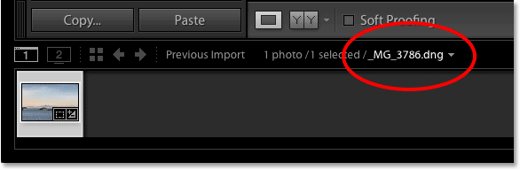
*The three letter extension tells us which type of file we're working with.*

### Step 2: Move The Image Over To Photoshop

Let's say I've done all I can with my photo in Lightroom, and now I'd like to add some text to the image. Lightroom doesn't have any features for adding text, but Photoshop does, so I'll need to move the raw file from Lightroom over to Photoshop.

You may think that you would first need to save the image somehow in Lightroom and then manually open it in Photoshop, but Lightroom and Photoshop actually work very well together as a team. To move a raw file over to Photoshop, all we need to do is go up to the **Photo** menu (in Lightroom) in the Menu Bar along the top of the screen, choose **Edit In**, and then choose **Edit in Adobe Photoshop** (your specific version of Photoshop will be listed, which in my case here is Photoshop CC 2015). You can also just press the keyboard shortcut, **Ctrl+E** (Win) / **Command+E** (Mac). Either way works:

*Going to Photo > Edit In > Edit in Adobe Photoshop.*

This will open Photoshop if it wasn't open already, and then the image itself will open in Photoshop:

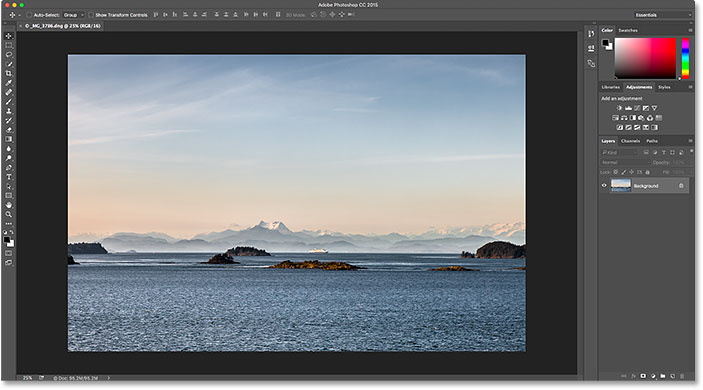
*The same image has been moved from Lightroom over to Photoshop.*

### What Happened To Camera Raw?

If you've worked with Photoshop and raw files in the past, you may be wondering what just happened here. How was Photoshop able to open a raw file directly?

Normally when we try to open a raw file in Photoshop, the image first opens in the **Adobe Camera Raw** plugin. That's because Photoshop, on its own, can't work with raw files. It's a pixel editor, not a raw image editor. It needs another program or plugin, like Camera Raw (pictured below), to first convert the raw file into pixels before Photoshop can even open it:

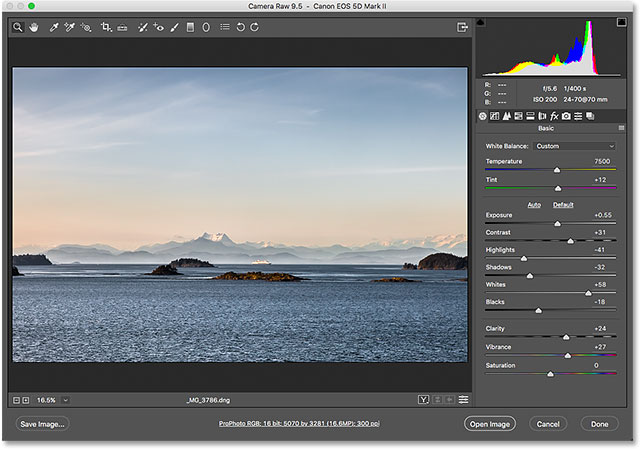
*The Adobe Camera Raw plugin normally appears when we try to open a raw file into Photoshop.*

And yet, when I passed my raw file from Lightroom over to Photoshop, the Camera Raw plugin did *not* appear. Instead, the image seemed to open directly into Photoshop. How was that possible when Photoshop can't open raw files?

It's possible because Lightroom and Camera Raw use the exact same *raw processing engine* under the hood. What happens when we pass a raw file from Lightroom over to Photoshop is that Camera Raw secretly steps in behind the scenes, looks at the editing instructions we made in Lightroom, and then uses those same instructions to convert the image from a raw file into pixels. In other words, the raw file didn't really open directly into Photoshop. Camera Raw stepped in behind the scenes and converted it into a pixel-based image for us using the edits we made in Lightroom.

### Step 3: Edit The Image In Photoshop

With my image now open in Photoshop, I can add my text. I'll quickly grab my **Type Tool** from the **Toolbar** along the left of the screen:

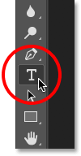
*Selecting the Type Tool in Photoshop.*

I've already chosen my font (Tahoma Bold) in the Options Bar and set my type color to white, so I'll click inside the document with the Type Tool and add my text. Since I shot this photo in Alaska, I'll type the word "ALASKA" (because I'm creative like that). To accept the text when I'm done, I'll press **Ctrl+Enter** (Win) / **Command+Return** (Mac) on my keyboard:

*Adding some text to the image in Photoshop.*

To resize and reposition the text, I'll go up to the **Edit** menu at the top of the screen and choose **Free Transform**:

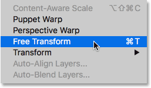
*Going to Edit > Free Transform.*

This places the Free Transform box and handles around the text. I'll press and hold my **Shift** key to lock in the aspect ratio of the text as I click and drag the **corner handles** to resize it. Then, I'll click and drag **inside** the Free Transform box to move the text into place. To accept it, I'll press **Enter** (Win) / **Return** (Mac) on my keyboard. Again, I'm going through this part rather quickly so we can focus more on how to move an image between Lightroom and Photoshop, and this is just one example of when you would need to do that. You can learn all about the Free Transform command in our [Free Transform Essential Skills](/basics/photoshops-free-transform-essentials/) tutorial:

*Resizing and moving the text with Free Transform in Photoshop.*

### Step 4: Save And Close The Image

Here's what my image now looks like in Photoshop with the text added:

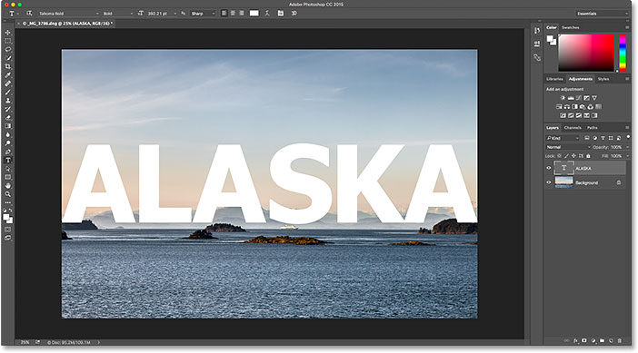
*The image after adding the text.*

Let's say that I'm happy with the way it looks for now and I want to save what I've done. This next part is very important because I also want to make sure that *Lightroom* knows what I've done with the image. After all, both programs are working as a team.

To save your work after passing an image from Lightroom over to Photoshop, go up to the **File** menu at the top of the screen and choose **Save**. And this is the important part; make sure you choose "Save" and *not* "Save As". The reason is that in order for Lightroom to be able to add the edited version of the image to its catalog (its database), the edited version needs to be saved in the *same folder* as the original image. If you save it anywhere else, it won't work. If we choose "Save As", we run the risk of saving the file to the wrong location and messing things up. By choosing "Save", the file will automatically be saved back to the same location as the original:

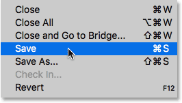
*Going to File > Save.*

Once you've saved your work, you can close the image in Photoshop by going up to the **File** menu and choosing **Close**:

*Going to File > Close.*

### Step 5: Return To Lightroom

With the image closed, return back to Lightroom where you'll find your image now updated with the edits you made in Photoshop:

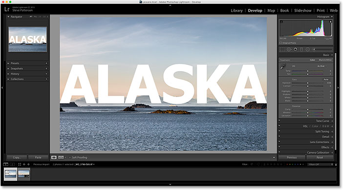
*The Photoshop edits are now visible in Lightroom.*

However, while it *looks* like the same image, if we look down in my **Filmstrip** along the bottom of Lightroom, we see that I now actually have not one but *two* versions of the same image. Why are there two versions? When we pass a raw file from Lightroom over to Photoshop, Lightroom doesn't actually pass the original image. Instead, it makes a *copy* of the image and passes the copy over to Photoshop. Again, that's because Photoshop can't work with raw files directly so it needs a separate, pixel-based version to work on.

I'll increase the size of my Filmstrip so we can get a better look at the thumbnails. Notice that only one of them (the one that's currently selected on the left) shows the text I added in Photoshop. This is the copy that Lightroom sent over to Photoshop and was then sent back to Lightroom. The other version (on the right) does not show the Photoshop text because it's the original version. It shows the adjustments I made in Lightroom but nothing more:

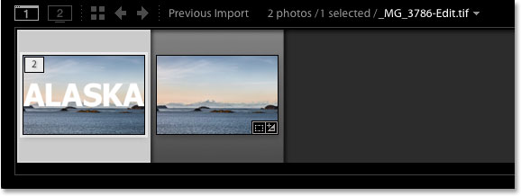
*Lightroom's catalog now includes both the original image and the copy edited in Photoshop.*

Another way we can tell that the version on the left is the Photoshopped version is that, if we look at the file's name, we see two important changes. First, the image is no longer a raw file. If you remember, the original image had a ".dng" extension. This new version was saved automatically as a **TIFF file**, indicated by the new **.tif** extension at the end. Second, the name of the file has been altered, with "**-Edit**" automatically added to the end of the name:

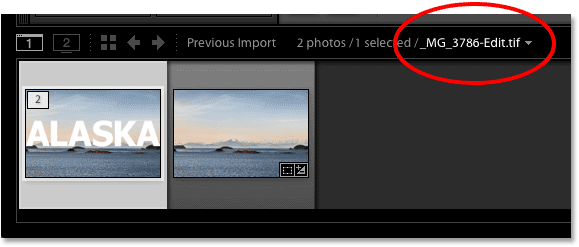
*The copy was automatically saved as a TIFF file with "-Edit" appended to the name.*

There's one more way we can tell that this is not the original image. If we look in my **Basic** panel, we see that all of the controls for exposure, contrast, color, etc., have been reset to zero. The original adjustments I made in the raw file were baked into the copy of the image when Lightroom passed it over to Photoshop. We can still make further adjustments in Lightroom if we need to, but we no longer have the same amount of flexibility that we had when we were working with the original raw image. That's why it's always best to make your Lightroom adjustments first before passing the file off to Photoshop:

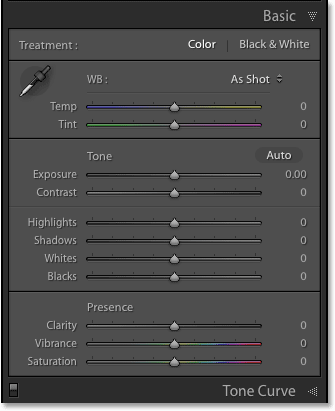
*The Basic panel no longer shows the original raw file adjustments.*

### Making Further Edits In Photoshop

What if we need to make additional edits to the image in Photoshop? For example, let's say I want to blend my text in with the image using a layer mask. I can't do that in Lightroom so I'll need to re-open the image in Photoshop.

As we've learned, the copy with my Photoshop edits is now a TIFF file, not a raw file, but regardless of which type of file it is, we still pass it over to Photoshop the same way. Simply go up to the **Photo** menu in Lightroom, choose **Edit In**, and then once again choose **Edit in Adobe Photoshop**. Or, press **Ctrl+E** (Win) / **Command+E** (Mac) on your keyboard:

*Going again to Photo > Edit In > Edit in Adobe Photoshop.*

However, this is where things are a little bit different from before. When we passed the raw file over to Photoshop, Lightroom automatically created a copy of the image and sent that copy to Photoshop. That's because Photoshop can't work with raw files directly. But this time, we're passing Photoshop a file type that it *can* work with. In this case, it's a TIFF file. Yet that doesn't mean Lightroom is just going to hand it over, no questions asked. Instead, Lightroom first wants to know what it is exactly that we want to send to Photoshop, and there's a few different options:

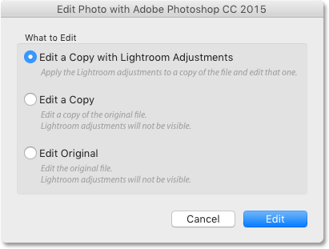
*With non-raw files, Lightroom asks what it should send to Photoshop.*

The first option, **Edit a Copy with Lightroom Adjustments**, is not what we want, at least not in this situation. This option will make yet another copy of the image, which we don't need, and it will include any additional changes that we've made in Lightroom since the last time we worked on the image in Photoshop. I haven't made any additional Lightroom changes, so there's nothing here to include.

But the main reason why this is not a good option when re-editing an image in Photoshop is that it has the unfortunate side effect of flattening the image and discarding your layers. In my case, my Type layer would be merged with the image itself, leaving my text completely uneditable. The Edit a Copy with Lightroom Adjustments option *is* useful in other situations, as we'll see in the next tutorial when we look at working with JPEG files in Lightroom. It's just not a good choice here.

The second option, **Edit a Copy**, is at least a better choice, if not the best, because it won't flatten your image, which means you'll keep your Photoshop layers. However, it will still make another copy of the image that we really don't need.

The best option for re-editing images in Photoshop is the third one, **Edit Original**. It won't make any unnecessary copies, letting you re-edit the same file, and it won't flatten your image, which means any layers you added previously in Photoshop will still be there. One important note, though, is that neither the Edit a Copy option nor the Edit Original option will pass along any additional changes you've made in Lightroom since the last time you worked on the image in Photoshop. This can cause a bit of confusion when the image appears in Photoshop since it will look like your most recent adjustments (if any) are missing. However, it's only temporary. As soon as you save your work in Photoshop and return to Lightroom, your Lightroom adjustments will again be visible, along with any changes you made in Photoshop.

I'll select **Edit Original**, then I'll click the **Edit** button:

*Choosing "Edit Original", then clicking the Edit button.*

This re-opens the TIFF file in Photoshop:

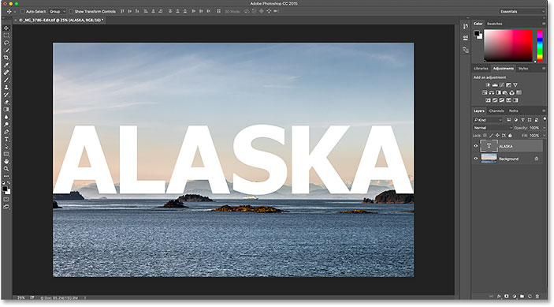
*The previously-edited image re-opens in Photoshop.*

If we look up in the **tab** along the top of the document in Photoshop to view the name of the file, we see that, sure enough, it's the same file as before:

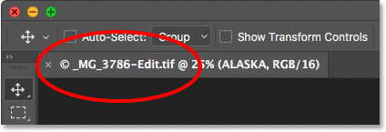
*The name of the file matches the one in Lightroom.*

And if we look in the **Layers panel**, we see that my Type layer from before is still there. The file is exactly as I left it:

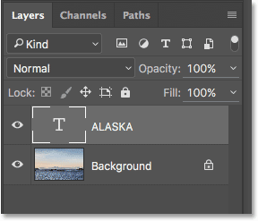
*The Layers panel showing my previous layers still intact.*

To blend my text in with the image, I'll first make sure my **Type layer** is selected. Then I'll add a layer mask to it by clicking on the **Add Layer Mask** icon at the bottom of the Layers panel. Again, I'm going through these steps fairly quickly since blending text with an image isn't the focus of this tutorial:

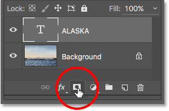
*Adding a layer mask to the Type layer.*

Now that I've added a layer mask, I'll grab the **Gradient Tool** from the Toolbar:

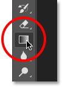
*Selecting the Gradient Tool.*

With the Gradient Tool in hand, I'll **right-click** (Win) / **Control-click** (Mac) inside the document to open Photoshop's **Gradient Picker**, then I'll make sure I have the **Black to White gradient** selected by double-clicking its thumbnail, which selects the gradient and closes out of the Gradient Picker:

*Choosing the Black to White gradient from the Gradient Picker.*

To blend the text in with the image, I'll click near the bottom of the text and drag upward towards the center, pressing and holding my **Shift** key as I drag to limit the angle in which I can move, which makes it easier to drag straight up vertically:

*Dragging a black to white gradient on the layer mask from the bottom towards the center of the text.*

I'll release my mouse button to complete the gradient. Since I've drawn the gradient on the layer mask, not on the layer itself, we don't see the actual gradient in the document. Instead, the bottom of the letters now blend in with the mountains behind them:

*The effect after drawing the gradient on the layer mask.*

Finally, to further help blend the text in with the image, I'll change the Type layer's **blend mode** in the upper left of the Layers panel from Normal to **Soft Light**:

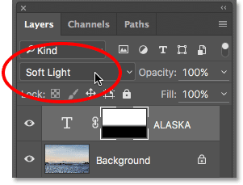
*Changing the Type layer's blend mode to Soft Light.*

Here's what the final result looks like:

*The final effect in Photoshop.*

Now that I'm done in Photoshop, I'll save my work just as I did before by going up to the **File** menu and choosing **Save**:

*Going again to File > Save.*

Then, to close the image in Photoshop, I'll go back up to the **File** menu and choose **Close**:

*Going to File > Close.*

With the image saved and closed in Photoshop, I'll return to Lightroom where we see the file now updated to reflect my most recent Photoshop edits:

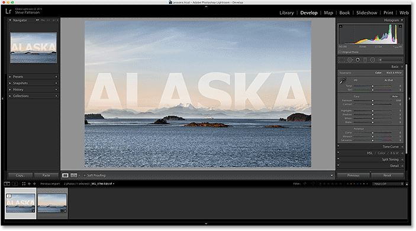
*Lightroom's catalog is once again updated with the changes made in Photoshop.*