# Moving Photos Between Documents In Photoshop

> Source: [https://www.photoshopessentials.com/basics/moving-photos-between-documents/](https://www.photoshopessentials.com/basics/moving-photos-between-documents/)
> Downloaded and converted to Markdown.

With its amazing ability to blend photos together in so many interesting ways, Photoshop's creative potential is truly limited only by our own skills and imagination.

But if you're new to Photoshop, blending even two images together can seem like an impossible task because Photoshop opens each new image in its own separate, independent document, and the only way to blend images together is if they're all inside the *same* document. Fortunately, moving photos from one document into another is easy, as we're about to see!

In this tutorial, we'll look at three common ways to move photos between documents that work with any version of Photoshop, so it makes no difference which version you're using. If you're using Photoshop CS4 or CS5, you'll want to read the [next tutorial](/basics/move-photos-tabbed-documents/) as well, as it looks at a potentially confusing change that Adobe made to the interface - **[tabbed documents](/basics/photoshop-cs4/tabbed-document-windows/)** - and how to move photos between them. For now, we'll focus only on ways that everyone can use.

Here, I have two photos open on my screen. I'm using Photoshop CS5 but all versions will look fairly similar. Each photo appears inside its own floating document window:

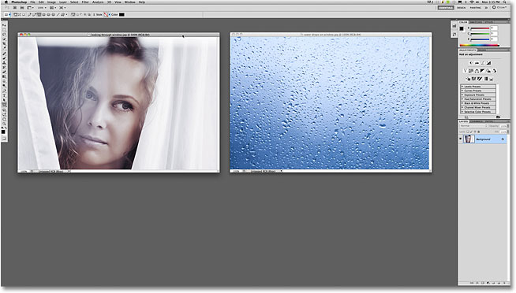
*Photoshop's interface, with two photos currently open.*

**CS4 and CS5 Users Only:** Just a quick note, if you are using Photoshop CS4 or CS5 and you're following along with your own images, they may be opening in tabbed documents rather than in floating document windows. As I mentioned earlier, we'll look more closely at these new tabbed documents in the next tutorial, but for now, if you're not seeing floating document windows, go up to the **Window** menu at the top of the screen, choose **Arrange**, and then choose **Float All in Windows** (again, this is for Photoshop CS4 and CS5 users only):

*For CS4 and CS5 users, go to Window > Arrange > Float All in Windows.*

Even though we're seeing two document windows on the screen, Photoshop, for the most part, only works with one document at a time (the other one just kind of sits there being ignored). The one we're working on is known as the "active" document, and the easiest way to tell which one is currently active is by looking in the **Layers panel**. For example, if we look in my Layers panel right now, we can see that the Background layer's **preview thumbnail** is displaying the photo of the woman looking through the curtains, which means it's the active document:

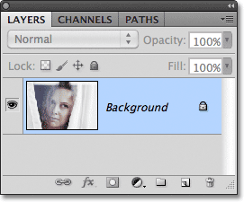
*The preview thumbnail shows us what's on the layer.*

To switch between documents and make a different one active, all we need to do is click anywhere inside of it. I'll click inside the photo of the water drops, which makes it the active document, and if we look again in the Layers panel, we see the water drops image sitting on the Background layer. The other photo no longer appears:

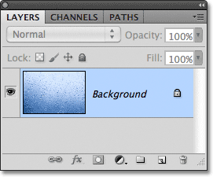
*With a different document now active, the Layers panel shows a different image.*

The important thing to note here is that only one photo at a time was appearing in the Layers panel, not both, and that's because each photo is open in a completely separate document. Yes, both photos are open in Photoshop and yes, I can see them both on my screen, but that's the end of it as far as Photoshop is concerned. All Photoshop sees is two totally independent documents that have nothing to do with each other. I'd like to blend these two photos together, but there's currently no way I can do it, not unless I can somehow move one of the photos into the other photo's document. Let's look at a few easy ways to do just that.

### Method 1: Drag and Drop

Moving a photo from one document to another in Photoshop can be a real drag. And by that, of course, I mean that the easiest and most common way to move an image between documents is to simply drag it! To do that, we need Photoshop's **Move Tool**, which you can access by clicking on its icon at the top of the Tools panel. Your Tools panel may appear as a single or double column depending on which version of Photoshop you're using, but the Move Tool is always at the top:

*Select the Move Tool.*

With the Move Tool active, click inside the photo you want to move. Then, with your mouse button still held down, drag it into the other photo's document window. I want to move the water drops photo into the other photo's document, so I'll click inside the water photo document, keep my mouse button held down, and drag the photo into the other document:

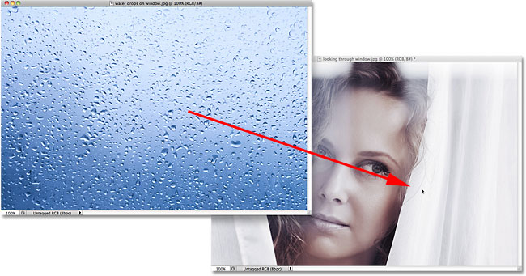
*Click inside one document, hold your mouse button down, and drag the photo into the other document.*

When you release your mouse button, Photoshop drops the photo into the other document:

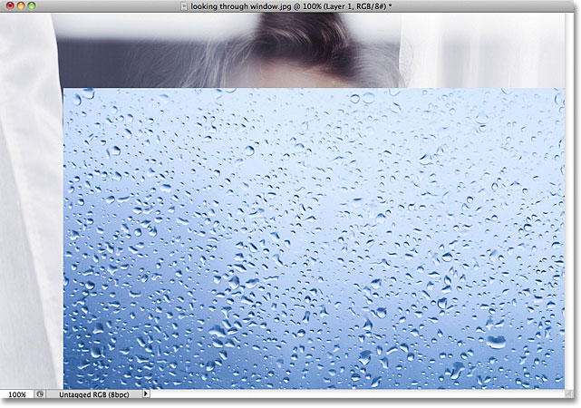
*A copy of the photo appears inside the other photo's document.*

Notice, though, that Photoshop simply dropped the photo at the spot where I released my mouse button, which in my case placed it in the bottom right of the document. That's kind of a sloppy way to work. A better way to move a photo is to hold down your **Shift** key as you're dragging from one document to another. In other words, click inside the photo you want to move, hold down Shift, drag the photo into the other document, then release your mouse button, *then* release the Shift key. Adding the Shift key tells Photoshop to center the photo inside the document.

I'll quickly undo my previous step by pressing **Ctrl+Z** (Win) / **Command+Z** (Mac), then I'll again drag the water drops photo into the other document, this time while holding down the Shift key. I'll release my mouse button, then release my Shift key (very important that you release your Shift key *after* releasing your mouse button), and here we can see that the water drops photo now appears in the center of the document:

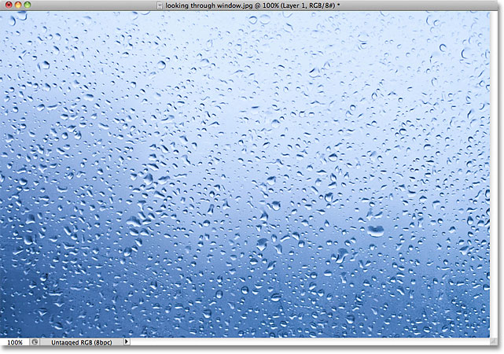
*The photo now appears in the center.*

If we look in the Layers panel, we see that we've successfully copied the photo into the other photo's document, as both photos are now showing, one on top of the other. The original photo is sitting on the Background layer, and Photoshop placed the water drops photo on its own new layer above it:

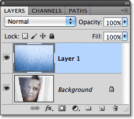
*When you move a photo from one document to another, Photoshop automatically adds a new layer for the photo.*

If the "drag and drop" approach isn't your thing, we'll look at two more ways to easily move photos between documents next!

### Method 2: Duplicating The Layer

If the freestyle "drag and drop" approach to moving photos between documents doesn't appeal to you, you can also use Photoshop's **Duplicate Layer** command. First, click inside the document that contains the photo you want to move, which makes it the active document. I'll click inside my water drops photo. Then, go up to the **Layer** menu in the Menu Bar along the top of the screen and choose **Duplicate Layer**:

*Go to Layer > Duplicate Layer.*

Alternatively, you can **Right-click** (Win) / **Control-click** (Mac) directly on the layer itself in the Layers panel and choose **Duplicate Layer** from the menu that appears:

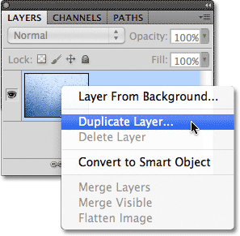
*Right-click (Win) / Control-click (Mac) on the layer and choose Duplicate Layer.*

Either way opens the Duplicate Layer dialog box. Enter a name for the layer that the photo will appear on in the other document. I'll name mine "Water drops". Then, in the Destination section at the bottom of the dialog box, select the name of the document you want to move the photo into. I'll select my "looking through window.jpg" document. Yours, of course, will probably be named something different:

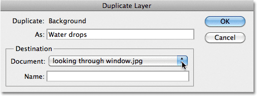
*Name the new layer, then select the destination document.*

Click OK when you're done, and Photoshop copies the photo from its original document into the new one. I can see in my Layers panel that the water drops photo is now sitting on a layer named "Water drops" above the Background layer:

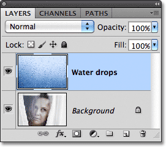
*Photoshop placed the photo on a new layer named "Water drops", since that's the name I gave it in the Duplicate Layer dialog box.*

### Method 3: Copy And Paste

Yet another way to move photos between documents is the standard "copy and paste" method which will be familiar to anyone who's been using a computer for any length of time. First, click inside the document that contains the photo you want to move. Then, go up to the **Select** menu at the top of the screen and choose **All** (or press **Ctrl+A** (Win) / **Command+A** (Mac) for the keyboard shortcut):

*Go to Select > All.*

This selects the entire photo. A selection outline will appear around its edges in the document window:

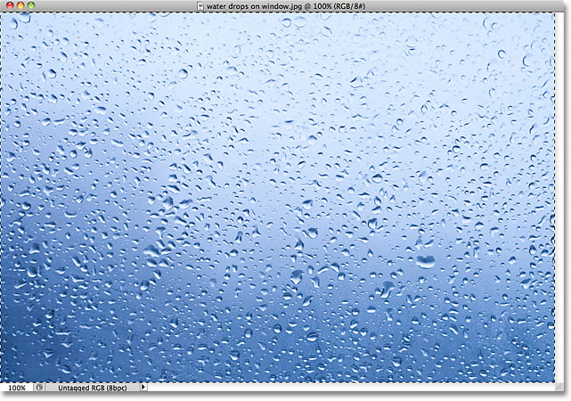
*Select the photo you want to move.*

With the photo selected, go up to the **Edit** menu and choose **Copy** (or press **Ctrl+C** (Win) / **Command+C** (Mac)), which copies the photo to the clipboard:

*Go to Edit > Copy.*

Click inside the document you want to copy the photo into to make it the active document, then go back up to the **Edit** menu and choose **Paste** (or press **Ctrl+V** (Win) / **Command+V** (Mac)):

*Go to Edit > Paste.*

Photoshop pastes the photo into the new document, and once again in the Layers panel, we see that the photo has been placed on its own layer above the original image on the Background layer:

*One photo has been copied and pasted into the other photo's document.*

With both photos now inside the same document, I'm ready to blend them together. An easy way to blend photos is to change the layer **blend mode**. With the water drops photo's layer active (active layers are highlighted in blue), I'll go up to the blend mode option in the top left of the Layers panel and simply change it from Normal to **Soft Light**:

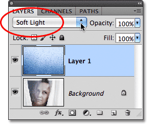
*Changing the top layer's blend mode to Soft Light.*

Changing the blend mode was all it took to combine the two photos into a whole new image, with the water drops now appearing on the window the woman is looking through:

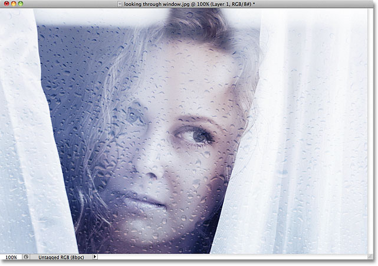
*Layer blend modes are an easy yet powerful way to achieve interesting results.*

And there we have it! Three simple ways - "drag and drop", duplicating the layer, and "copy and paste", to move photos between documents in Photoshop! Photoshop CS4 and CS5 users, be sure to check out the next tutorial as well to learn [how to move photos between tabbed document windows](/basics/move-photos-tabbed-documents/)! Visit our [Photoshop Basics](/basics/) section to learn more about Photoshop!