# How to use Content-Aware Crop in Photoshop

> Source: [https://www.photoshopessentials.com/basics/new-content-aware-crop-tool-photoshop-cc/](https://www.photoshopessentials.com/basics/new-content-aware-crop-tool-photoshop-cc/)
> Downloaded and converted to Markdown.

Learn how the Content-Aware Crop feature in Photoshop lets you easily add more room around your photos by filling the empty space with matching content!

Adobe first added content-aware capabilities to the Crop Tool in Photoshop CC 2015.5. And what content-aware cropping allows us to do is add more room around our images. Now when I say "more room", I don't just mean "empty space". The standard Crop Tool has always been able to do that. Instead, with content-aware cropping, we can actually extend the boundaries of an image by filling empty areas around a photo with matching detail. 

Content-aware crop can be extremely useful when cropping an image after straightening it, since rotating the image often leaves blank spaces in the corners. And it's also great for extending the top, bottom or sides of your photo to make room for text or to help the image fit better in your layout. Along with learning how to use it, we'll also learn why content-aware cropping works like magic in some cases, but not so much in others. To follow along, you'll need the [latest version of Photoshop](https://prf.hn/l/dlXjD2w).

Let's get started!

## Straightening and cropping a photo *without* Content-Aware

Here's an image I've opened in Photoshop that I downloaded from [Adobe Stock](https://prf.hn/l/dl2PZyY). I want to straighten and crop the image without losing any of the kids in the photo. But the boy in the yellow shirt on the right is very close to the edge, which could pose a problem. So let's see what happens if I try to straighten and crop it without using the Crop Tool's Content-Aware feature:

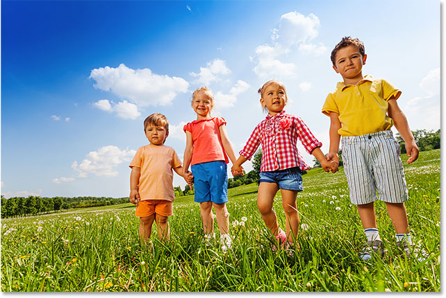
*The original image. Credit: Adobe Stock.*

### Selecting the Crop Tool

I'll select the Crop Tool from the [Toolbar](/basics/photoshop-tools-toolbar-overview/):

*Selecting the Crop Tool.*

### Where do I find the Content-Aware option?

With the Crop Tool selected, the **Content-Aware** option is found in the Options Bar along the top of the screen. For now, I’ll leave Content-Aware unchecked:

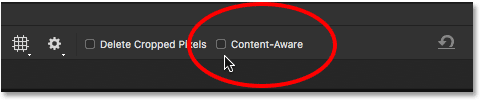
*The Content-Aware option for the Crop Tool, currently turned off.*

### Selecting the Straighten Tool

To straighten the image, I'll select the **Straighten Tool** in the Options Bar:

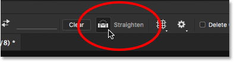
*Selecting the Straighten Tool.*

### Rotating and straightening the image

Then I'll draw a straight line across something in the image that should be straight, either vertically or horizontally, so Photoshop can use the angle of that line to [rotate and straighten the image](/basics/how-to-rotate-and-straighten-images-in-photoshop-cc/). For an outdoor photo like this one, ideally I could draw a straight line across the horizon in the background. But in this case, there really isn't an obvious horizon line thanks to the rolling hills, so I'll need to eyeball it.

I'll start by clicking to set a starting point for the line just below the trees in the lower left of the photo. And then, with my mouse button held down, I'll drag diagonally over to the right, again just below the trees. An angle of around 9° should work:

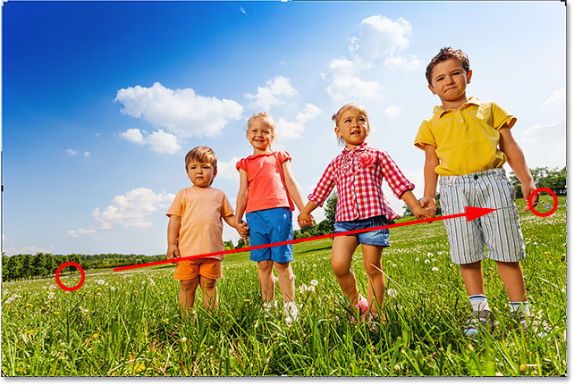
*Dragging a diagonal line across the image with the Straighten Tool.*

### The first problem - Empty space in the corners

I'll release my mouse button, at which point Photoshop rotates the photo to straighten it. It also draws a cropping border around the image. And here's the first problem. Notice how much of the image falls outside the crop area after straightening it. That's because rotating the image added a whole bunch of empty space around the photo, as we see by the *checkerboard pattern* in the corners of the document. 

Photoshop won't extend the crop border into the empty space, since we'd end up with empty space in the image. It will only extend the cropping border to the edges of the photo itself. At least, this is how things worked before the Content-Aware feature was added, which we'll look at in a moment:

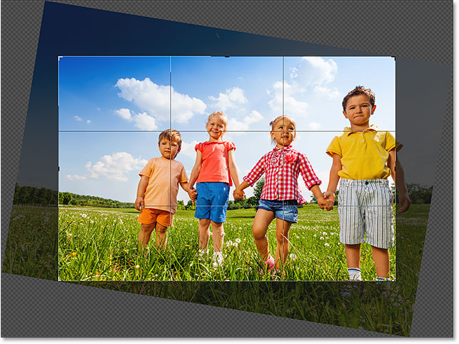
*Without Content-Aware, cropping will result in much of the photo being lost.*

### The second problem - Losing part of my subject

I'll accept the crop by pressing **Enter** (Win) / **Return** (Mac) on my keyboard. And this brings us to the second problem. Remember when I mentioned that the boy in the yellow shirt on the right was too close to the edge? Well, after straightening and cropping the image, part of him has now fallen completely *off* the edge! There was no way for Photoshop to crop the image after straightening it without cutting the boy's arm and feet out of the photo. Mom and dad probably wouldn't be too happy with this result:

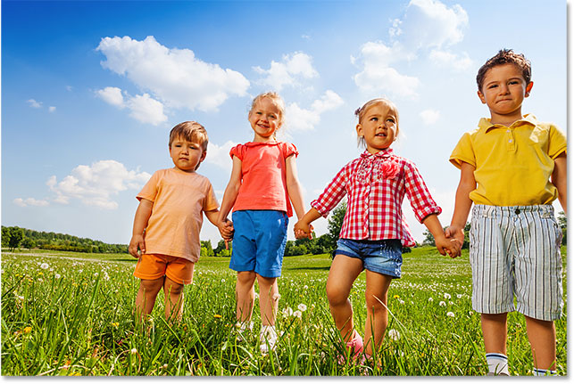
*Without Content-Aware, cropping the image cut part of the subject out of the photo.*

## How to straighten and crop an image *with* Content-Aware

So now that we've looked at how the Crop Tool works *without* Content-Aware, let's straighten and crop the image again, but this time with Content-Aware turned on. I'll undo my initial crop by going up to the **Edit** menu in the Menu Bar and choosing **Undo Crop**:

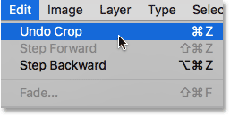
*Going to Edit > Undo Crop.*

This returns the image to its original state:

*The original image once again.*

### Step 1: Select the Crop Tool

I'll once again select the **Crop Tool** from the Toolbar:

*Making sure I have the Crop Tool selected.*

### Step 2: Turn on Content-Aware in the Options Bar

This time, I want to turn **Content-Aware** on, so I'll click inside its checkbox in the Options Bar:

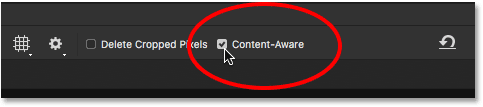
*Turning on content-aware cropping.*

### Step 3: Select the Straighten Tool

Then, still in the Options Bar, I'll again select the **Straighten Tool**:

*Selecting the Straighten Tool.*

### Step 4: Draw a line across something that should be straight

And just as before, I'll click and drag out a diagonal line with the Straighten Tool from left to right just below the trees in the background:

*Dragging the same diagonal line across the image with the Straighten Tool.*

### The Content-Aware difference

I'll release my mouse button to straighten the image. And this time, with Content-Aware turned on, we get a very different result. Rather than limiting the cropping area to just the image itself, Photoshop has extended it into some of the empty space in the corners.

Why is Photoshop suddenly okay with adding empty space to the image? The reason is that it's *not* going to add empty space. Instead, with Content-Aware enabled, Photoshop can use the image detail near those empty areas to automatically fill them in with *similar* detail. If there's lots of grass around the area, it can fill in the empty space with more grass. And if there's blue sky, it can fill the space with more blue sky. In other words, Photoshop is now saying, "Go ahead and include those empty areas, and let *me* figure out what should be there".

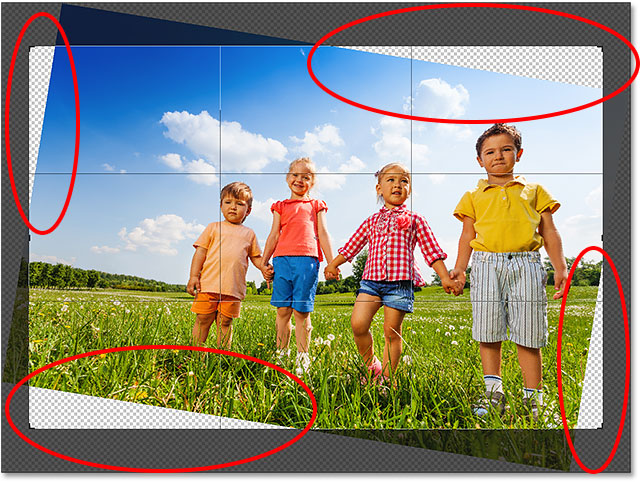
*The larger crop that Photoshop suggests with Content-Aware enabled.*

At this point, I could grab any of the sides or corners of the cropping box and extend them out even further into the empty areas. But keep in mind that the more we ask Photoshop to figure out on its own, the greater the risk that it will mess things up (just like the rest of us). How far you can push the Content-Aware feature will really depend on the image. Generally, for best results, try not to extend the cropping border much beyond the initial size that Photoshop suggests. But again, it will depend on your image.

### Step 5: Press Enter (Win) / Return (Mac) to crop the image

To accept the crop, I'll press **Enter** (Win) / **Return** (Mac) on my keyboard. This time, because Photoshop has a lot to figure out, we won't see instant results like we did before. Instead, we'll see a progress bar telling us how far along Photoshop is in the process:

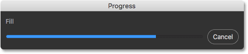
*The Progress bar keeps us company while we wait.*

In most cases, it shouldn't take more than a few seconds, and here we see the results. Thanks to content-aware cropping, Photoshop was able to fill the blank areas in the corners with more details. And the boy in the yellow shirt is still in one piece, with room to spare. There may be a few areas that will need a quick touch-up with one of Photoshop's retouching tools, like the Clone Stamp or the Healing Brush. But overall, content-aware cropping kept the image looking great:

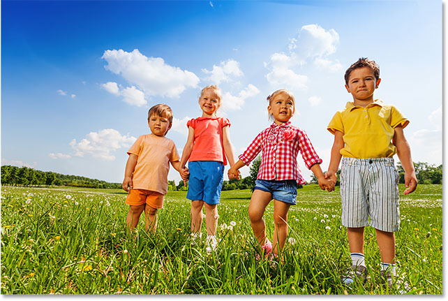
*The result after straightening and cropping with Content-Aware enabled.*

## Using content-aware crop to extend the edges of a photo

We've seen that content-aware cropping is great for straightening an image. But it's also useful for extending the edges of an image, adding more room to the top, bottom, left or right. Here's another [image](https://prf.hn/l/Gl3BN35), also downloaded from Adobe Stock, that I've opened in Photoshop:

*The original photo. Credit: Adobe Stock.*

### Step 1: Select the Crop Tool

Let's say I need to add more room above the balloons at the top. To do that, I'll once again select the **Crop Tool** from the Toolbar:

*Selecting the Crop Tool.*

This places the standard cropping border and handles around the image:

*The crop border and handles surround the photo.*

Since I want to drag the top handle without moving the others, I'll make sure the **Aspect Ratio** option in the Options Bar is set to **Ratio**, which it is by default. And I'll make sure that the **Width** and **Height** fields directly to the right of the Aspect Ratio option are both empty. If they were not empty, I'd want to click the **Clear** button to clear the values:

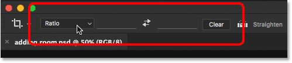
*Setting the Aspect Ratio option to Ratio, with the Width and Height fields empty.*

### Step 2: Turn on Content-Aware in the Options Bar

I'll make sure I have **Content-Aware** selected:

*Selecting the Content-Aware option.*

### Step 3: Drag one or more edges of the crop border outward

And then, to add more room to the top of the image, I'll click on the top handle and drag it upward:

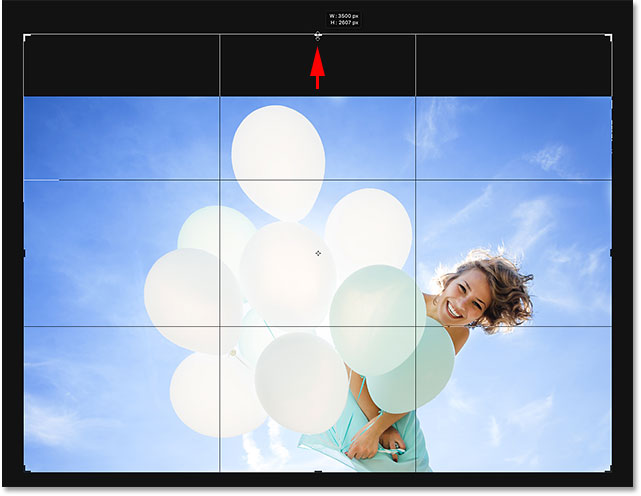
*Adding more room above the photo.*

When I release my mouse button, Photoshop fills the extra room with transparency (empty space), as we can see again by the checkerboard pattern:

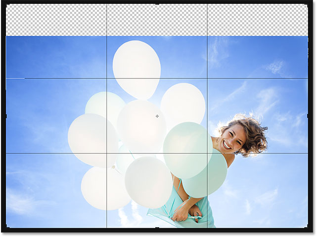
*The result so far after adding extra space above the image.*

### Step 4: Press Enter (Win) / Return (Mac) to crop the image

Then to accept the crop, I'll press **Enter** (Win) / **Return** (Mac) on my keyboard, and here's the result. Without content-aware cropping, Photoshop would have simply added the empty space and left it at that. But with Content-Aware enabled, Photoshop looked at the surrounding area and did a great job of filling the space with more blue sky and random clouds:

*The same photo, now with more room at the top.*

## Works like magic, except when it doesn't

The content-aware crop feature in Photoshop CC can be a real time-saver, and even a lifesaver, when we need to add more image detail around a photo. But along with knowing how it works, it's just as important to know its limitations, so we can keep our expectations in check. 

Content-aware cropping works best in areas of relatively solid color, like a clear blue sky, or in areas with lots of random detail, like grass, leaves, or a sandy beach. However, it doesn't work very well in areas that are too specific. In fact, the results can look pretty weird.

### When content-aware crop fails

For example, we saw that I was able to easily add more room above the balloons in this image, and that was because the area was fairly simple. All Photoshop had to do was figure out how to draw more blue sky and a few wispy clouds, and the result looked great. But watch what happens if I do the same thing to the *bottom* of the image, below the woman's dress. I'll click on the bottom crop handle and drag it down below the photo to add more room:

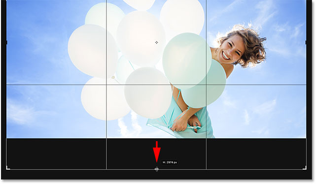
*Dragging the bottom of the cropping border into the area below the photo.*

Then I'll release my mouse button, at which point Photoshop temporarily fills the area with empty space, just like it did with the top of the image:

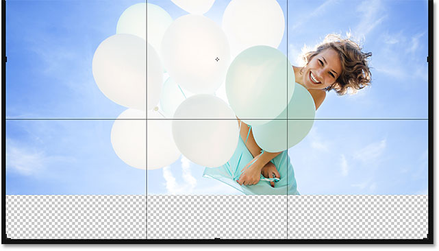
*The new area below the photo is filled with transparency.*

Finally, I'll press **Enter** (Win) / **Return** (Mac) on my keyboard to accept the crop. And here's where things go wrong. Essentially, I've asked Photoshop to figure out how to draw more of the woman's dress, and that's simply too detailed and too specific for Content-Aware to handle. Photoshop did try, but all it really did was copied part of her dress, along with her hands and part of her arms, and pasted them into the new area. It also messed up the clouds, and really, the whole thing is a disaster.

So, keep in mind that content-aware cropping works great with simple, random details. But the more specific you get, the less likely it is that you'll end up with the results you were hoping for:

*Need an extra set of hands? Content-Aware Crop to the rescue!*

And there we have it! So far in this series, we've learned everything you need to know about [cropping images with the Crop Tool](/basics/cropping-images-in-photoshop-complete-lesson-guide). But if you're tired of cropping photos as rectangles and squares, then in the next lesson, I show you how to have more fun by [cropping your images as circles](/basics/crop-image-circle-photoshop/)!

You can jump to any of the other lessons in this [Cropping Images in Photoshop](/basics/cropping-images-in-photoshop-complete-lesson-guide) series. Or visit our [Photoshop Basics](/basics/) section for more topics!