# New Darker Dialog Boxes In Photoshop CC 2015

> Source: [https://www.photoshopessentials.com/basics/new-darker-dialog-boxes-in-photoshop-cc-2015/](https://www.photoshopessentials.com/basics/new-darker-dialog-boxes-in-photoshop-cc-2015/)
> Downloaded and converted to Markdown.

In the November 2015 Creative Cloud updates, Adobe made a few important changes to the interface in Photoshop CC. One of these changes, and perhaps the biggest one, was the introduction of the new [Start screen and Recent Files panel](/basics/the-new-start-screen-and-recent-files-panel-in-photoshop-cc-2015/), both of which were designed to make opening files and creating new documents in Photoshop easier than ever.

Another change, and the one we'll look at in this tutorial, was the introduction of new **darker dialog boxes** in Photoshop. Back in Photoshop CS6, Adobe took the traditionally lighter interface and made it significantly darker, with the idea being that the darker interface would be less distracting to us as we worked on our images. Yet while the main interface was darkened, the individual dialog boxes remained just as light as they had been in previous versions. 

In the most recent version of Photoshop CC 2015, Adobe has finally brought the dialog boxes in line with the rest of the interface, and while this change is purely cosmetic, I think you'll agree that the darker look is a welcome improvement. And if you don't happen to agree, that's okay because the color of the dialog boxes can now be adjusted along with the rest of the interface in Photoshop's Preferences! Let's see how it all works.

### A Little History

Throughout most of Photoshop's history, the interface was much lighter than it is today. Here's what it looked like back in Photoshop CS5, which is pretty much how it had looked since Photoshop was first released more than two decades ago. There was nothing terribly wrong with the interface back then, but its lighter tone meant that the image was always competing for attention with the interface elements surrounding it  ([black and white portrait photo](http://www.shutterstock.com/pic.mhtml?id=61431187&src=id)):

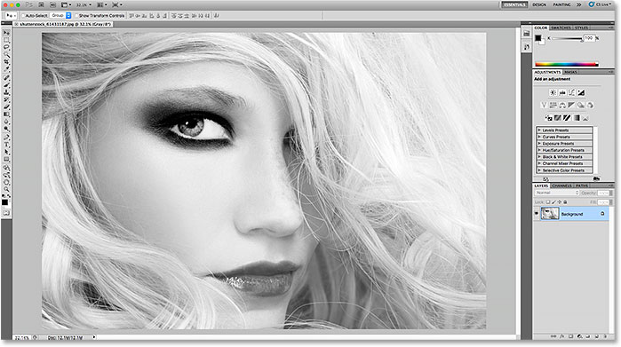
*The lighter interface in Photoshop CS5 (and earlier).*

In Photoshop CS6, Adobe surprised everyone by [making the interface  darker](/basics/interface-cs6/). After the initial shock wore off, most Photoshop users agreed that the darker tone was a  change for the better, making it  easier to focus on the image while the interface sat quietly in the background:

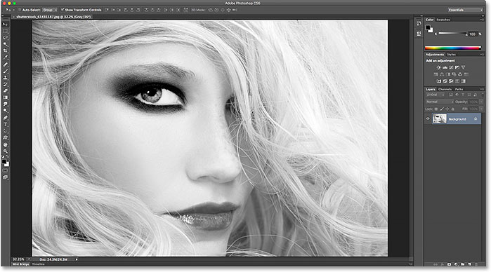
*The darker interface first introduced in Photoshop CS6.*

Yet while the main interface was now darker, the same was not true of the individual dialog boxes in Photoshop CS6. For whatever reason, Adobe chose to leave them with their original lighter tone. For example, here's the Smart Sharpen dialog box from Photoshop CS6. I'm using this specific dialog box as an example, but all dialog boxes in CS6 shared the same overall look. Notice how light the dialog box was compared with the image in its preview window, as if the dialog box itself was more important:

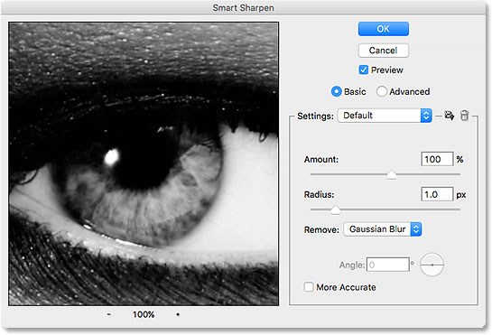
*An example of a lighter dialog box from Photoshop CS6.*

When viewed along with the rest of the interface in Photoshop CS6, it looked like the dialog box was separate from everything else:

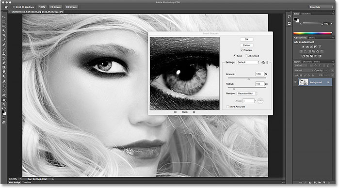
*Dialog boxes in Photoshop CS6 looked separate from the rest of the interface, often appearing as bright (or brighter) than the image itself.*

### The Darker Dialog Boxes in Photoshop CC 2015

This disconnect between Photoshop's main interface and its dialog boxes continued with the initial release of Photoshop CC and even into CC 2015. But with the November 2015 Creative Cloud updates, Adobe has finally brought everything together, giving the dialog boxes the same darker tone as the rest of the interface. Here's what the Smart Sharpen dialog box now looks like in Photoshop CC 2015. Again, I'm  using this one dialog box as an example, but all dialog boxes in CC 2015 now share the same darker look. Notice how much easier it is to focus on the image in the preview window now that the dialog box itself is darker:

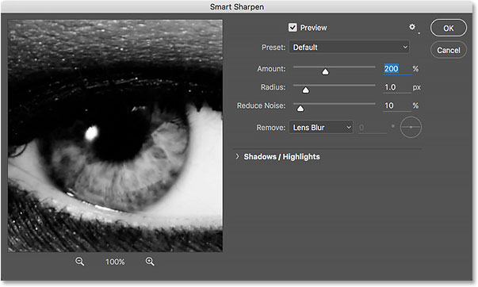
*The new dark dialog boxes in Photoshop CC 2015.*

Here's how it appears with the rest of the interface in Photoshop CC 2015, with everything now sharing a consistent look:

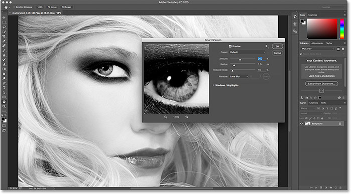
*Dialog boxes in Photoshop CC 2015 now blend seamlessly with the rest of the  interface.*

### Changing The Color Theme

When Adobe first introduced the darker interface in Photoshop CS6, they knew that not everyone would be happy with it, so they also introduced **color themes** in Photoshop's Preferences. Color themes let us easily change the color (the brightness level) of the interface, and there's four different ones to choose from ranging from very dark to very light. The problem, though, was that these color themes had no effect on the dialog boxes; no matter how light or dark we set the main interface in CS6, the dialog boxes kept their original lighter tone. But as of the November 2015 Creative Cloud updates, that's no longer the case. We can now use color themes to change the brightness of the entire interface, *including* the dialog boxes.

To get to the color themes, on a Windows PC, go up to the **Edit** menu in the Menu Bar along the top of the screen, choose **Preferences**, and then choose **Interface**. On a Mac, go up to the **Photoshop** menu, choose **Preferences**, and then choose **Interface**:

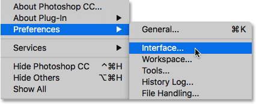
*Go to Edit > Preferences > Interface (Win) / Photoshop > Preferences > Interface (Mac).*

This opens the Preferences dialog box set to the Interface options. Notice that even the Preferences dialog box itself is now darker. The four color themes for the interface are found along the top, ranging from the darkest theme on the left to the lightest theme on the right. By default, the second theme from the left is selected:

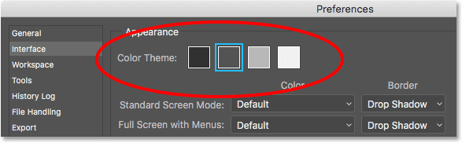
*The four color themes for the interface in Photoshop's Preferences.*

To change the brightness of the interface, simply choose a different theme. For example, to bring back the original lighter tone from Photoshop CS5 and earlier, select the theme furthest to the right. Notice that as soon as I select the new theme, the color of the Preferences dialog box  changes:

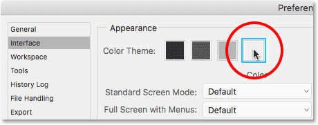
*Choosing the lightest of the four color themes.*

I'll click OK to close out of the Preferences dialog box, and here's what the interface now looks like. I've opened the Levels dialog box this time rather than Smart Sharpen just so we can see that, sure enough, all the dialog boxes in Photoshop are now affected by the color theme:

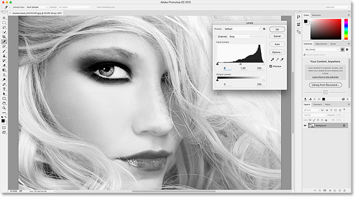
*The lightest of Photoshop's color themes. In CC 2015, dialog boxes are now included as part of the theme.*

I'll re-open my Preferences dialog box by going back up to **Edit** > **Preferences** > **Interface** (Win) / **Photoshop** > **Preferences** > **Interface** (Mac), then I'll choose a different color theme. This time, I'll select the first one on the left, which is even darker than the default theme. Notice once again that as soon as I select the new theme, the Preferences dialog box updates to the new brightness level:

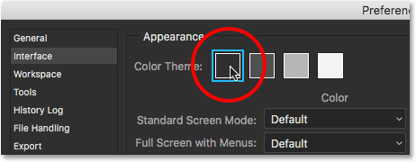
*Choosing the darkest of Photoshop's color themes.*

I'll click OK to close out of the Preferences dialog box, and here's what the darkest theme looks like, this time with the Curves dialog box open:

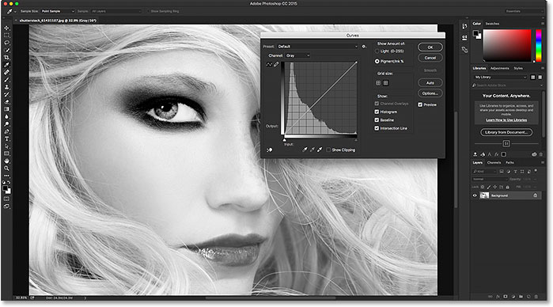
*The darkest of the color themes.*

Personally, I find this one a bit too dark, so to switch back to the default color theme, I'll simply re-open my Preferences dialog box to the Interface options and I'll select the second theme from the left:

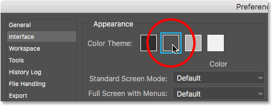
*Reselecting the default color theme.*

And now the main interface and the dialog boxes are back to the default brightness level once again:

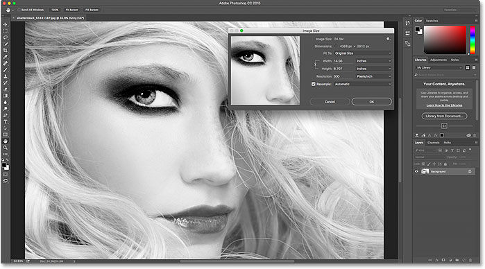
*The default color theme.*

### Changing the Color Theme From The Keyboard

We've seen how we can change the color theme from within the Preferences dialog box, but you can actually change it directly from your keyboard. Just press and hold your **Shift** key, then press the **F1** key repeatedly to cycle backwards through the four color themes (in other words, from lighter to darker), or press the **F2** key repeatedly to cycle forward (from darker to lighter). One thing to note, though, is that any dialog box that's currently open as you're changing the theme from the keyboard will not update to the new theme until you've closed the dialog box and re-opened it.