# New Guide Layout In Photoshop CC

> Source: [https://www.photoshopessentials.com/basics/new-guide-layout-in-photoshop-cc/](https://www.photoshopessentials.com/basics/new-guide-layout-in-photoshop-cc/)
> Downloaded and converted to Markdown.

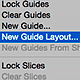

In this tutorial, we'll learn how to use the **New Guide Layout** option in Photoshop CC to easily create custom guide layouts.

With one simple dialog box, the New Guide Layout feature lets us create any number of rows and columns, add gutters, margins, and even save our guide layouts as presets!

The New Guide Layout option is only available in [Photoshop CC](https://prf.hn/l/dlXjD2w) and was first introduced in the **2014 Creative Cloud updates**. To use this feature, you'll need to be an Adobe Creative Cloud subscriber and you'll want to make sure your copy of Photoshop CC is up to date.

To follow along with this tutorial, you don't need anything fancy. You can use any image you already have open in Photoshop or simply create a new Photoshop document. Here's the image I have open on my screen. I chose this one simply because it's an interesting texture and it's nice and dark, which will make it easy for us to see the guides ([grunge wall texture](http://www.shutterstock.com/pic-192694445.html) from Shutterstock):

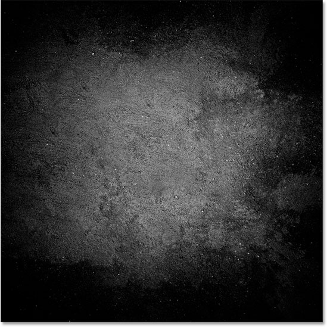
*The original image.*

### The Old Way Of Adding Guides In Photoshop

Before we learn all about the New Guide Layout feature, let's quickly look at the "old way" of adding guides. Traditionally, we would start by turning on Photoshop's rulers by going up to the **View** menu in the Menu Bar along the top of the screen and choosing **Rulers**:

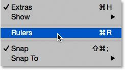
*Going to View > Rulers.*

This places the rulers along the top and left side of the document:

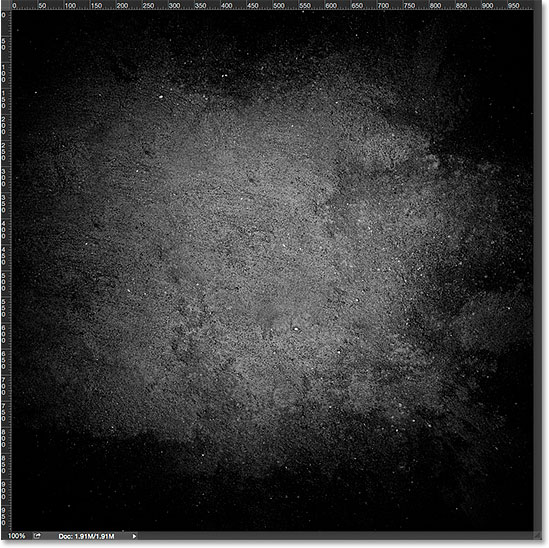
*The rulers are now visible along the top and left.*

To add a vertical guide, we would click inside the ruler on the left and, with our mouse button still held down, we'd drag a guide out from the ruler into the document:

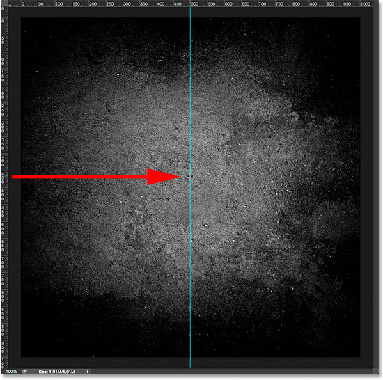
*Dragging a vertical guide out from the ruler on the left.*

To add a horizontal guide, we'd click inside the ruler along the top and, again with our mouse button still held down, we'd drag a guide downward from the ruler into the document:

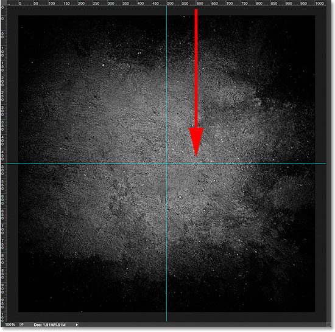
*Dragging a horizontal guide out from the ruler along the top.*

This way of adding guides by dragging them out from the rulers still works, even in the latest versions of Photoshop, but in Photoshop CC, there's a better way, and that's by taking advantage of the New Guide Layout option. Let's see how it works.

### The New Guide Layout Option

To access the New Guide Layout option, go up to the **View** menu at the top of the screen and choose **New Guide Layout**. Again, this is only available in Photoshop CC:

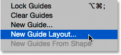
*Going to View > New Guide Layout.*

This opens the New Guide Layout dialog box. From this one dialog box, we can easily add any number of rows and columns to our layout. We can specify an exact width for the columns or an exact height for the rows, or let Photoshop space them out equally for us! We can add a gutter between the guides, and add margins along the top, left, bottom, and right of our document. We can even save our custom layout as a preset so we can load it again quickly the next time we need it!

If you haven't used the New Guide Layout feature before, the dialog box will appear with its default settings, which adds eight columns to the document, each separated by a gutter of 20 px. There are no rows added with the default settings, but we'll see how to easily add rows later:

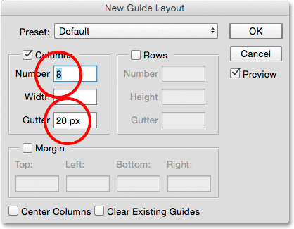
*The New Guide Layout dialog box.*

Here's what the default guide layout looks like. Notice, though, that my two original guides (the vertical and horizontal guide I dragged out from the rulers) are still there, cutting through the center of the document:

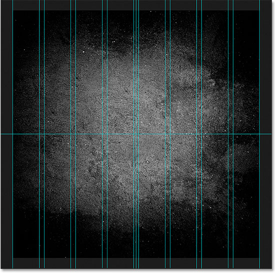
*The default guide layout, plus the original two guides.*

### Clear Existing Guides

To clear away any previous guides and keep only your new guide layout, select the **Clear Existing Guides** option at the bottom of the dialog box:

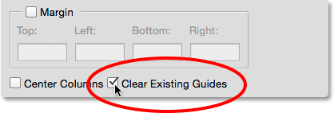
*Selecting "Clear Existing Guides".*

And now, those previous guides are gone, leaving me with just my new eight column layout:

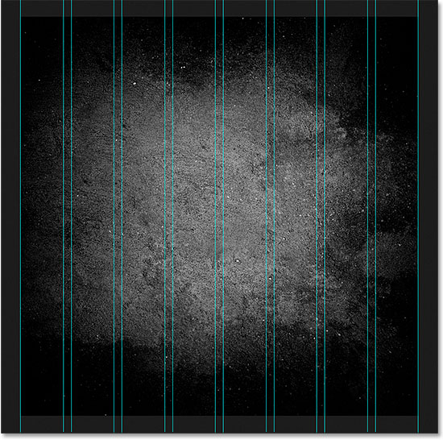
*The previous guides have been removed.*

### Changing The Number Of Columns

To change the number of columns in the layout, simply change the value in the **Number** field. I'll lower the value from 8 to **4**:

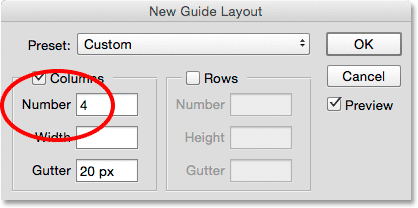
*Reducing the number of columns from 8 to 4.*

Photoshop instantly updates the layout, changing the number of columns and spacing them equally from left to right:

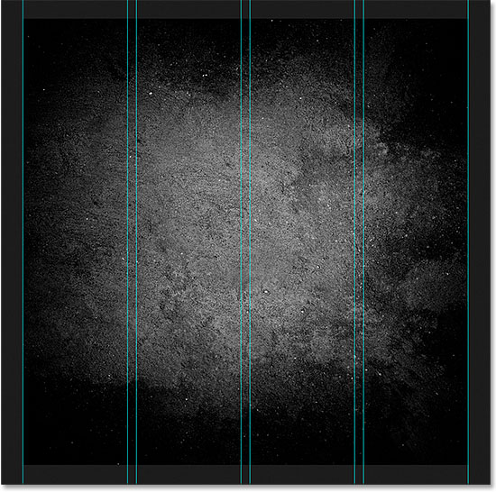
*The layout now contains four equally-spaced columns instead of eight, with a 20 px gutter between each one.*

### The Preview Option

If you're not seeing a live preview of your changes, make sure the **Preview** option in the dialog box is turned on (checked):

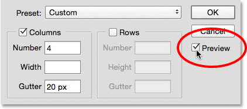
*The Preview option should be checked.*

### Changing The Gutter

The space between the columns (and rows) is known as the *gutter*. To increase or decrease the gutter, change the value in the **Gutter** field. The default gutter size is 20 px, which adds 20 pixels of space between each column. I'm actually going to remove the gutter completely by highlighting the Gutter value with my mouse and pressing the **Backspace** (Win) / **Delete** (Mac) key on my keyboard. This clears the Gutter value and leaves the field empty:

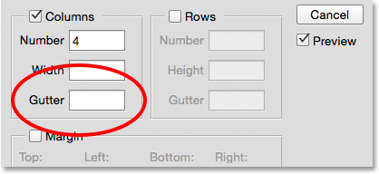
*Removing the space between the columns by clearing the Gutter value.*

With the Gutter field empty, there's no longer any space separating the columns:

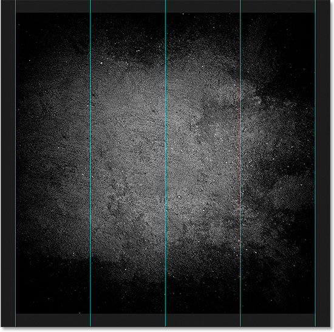
*The space between the columns has been removed.*

### Specifying A Column Width

By default, Photoshop will size the columns automatically so that they're spaced equally across the document from left to right, but we can set the width ourselves by entering a value into the **Width** field. For example, I'll enter a width for my columns of **150 px**:

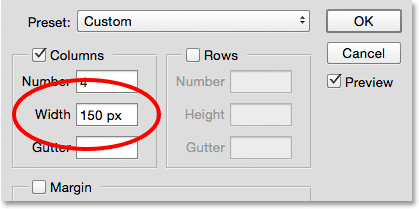
*Entering a specific width for the columns.*

Photoshop again updates the layout, this time setting the width of each column to exactly 150 px:

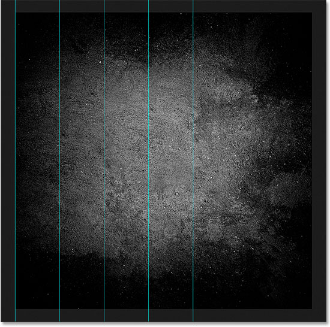
*The layout after specifying a width for the columns.*

### Centering The Columns

Notice that the columns are no longer centered in the document. Instead, they're pushed over to the left. To center them after you've entered a specific width, select the **Center Columns** option at the bottom of the dialog box:

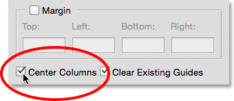
*Turning on the "Center Columns" option.*

With Center Columns checked, the columns are once again centered in the layout:

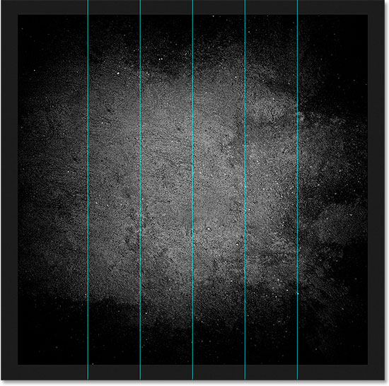
*The layout after centering the columns.*

### Adding Rows

To add rows to your layout, first select the **Rows** option (it's turned off by default):

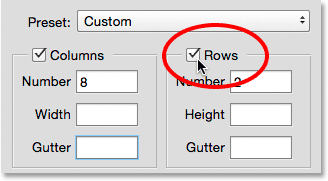
*Turning on the rows.*

Then, simply enter the number of rows you need into the **Number** field. You can enter a specific height for each row into the **Height** field, or leave it empty and let Photoshop space them out equally. You can also enter a **Gutter** value to add space between each row.

In my case, I'm going to set my number of rows to **3**, and I'll also change the number of columns to **3**. I'll leave the Width field for the columns and the Height field for the rows empty to let Photoshop space them out equally, and I'll also leave the Gutter fields empty:

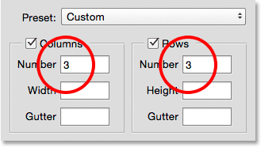
*Setting both the Columns and Rows to 3.*

This is a fast and easy way of creating a standard 3 by 3 grid, which I might want to use to help arrange and compose the various elements in my document using the "rule of thirds":

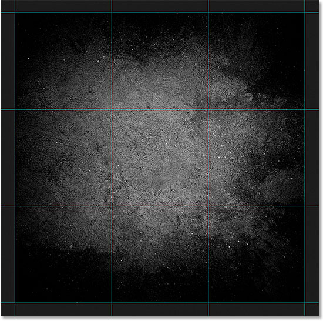
*A standard 3 by 3 grid easily created with the New Guide Layout feature.*

### Adding Margins

To add margins around the edges of the document, first select the **Margin** option to enable it, then enter the amount of space you want to add into the **Top**, **Left**, **Bottom** and **Right** boxes. In my case, I'll set all four values to **20 px**:

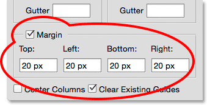
*Adding margins to the layout.*

This adds 20 pixels of space around the inside edges of my document. Photoshop automatically resizes the columns and rows accordingly:

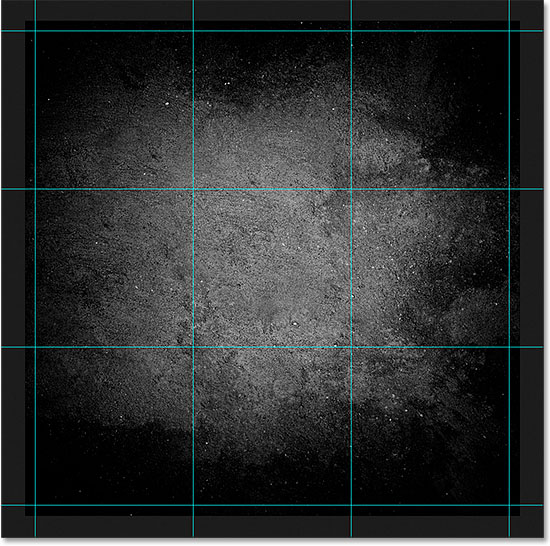
*The same 3 by 3 layout with margins added.*

We can even add negative margins by simply entering negative values. Negative margins can be useful when adding elements to a document or making selections that are larger than the document's viewable area (the canvas). I'll change each of the four values (Top, Left, Bottom, and Right) to **-20 px**:

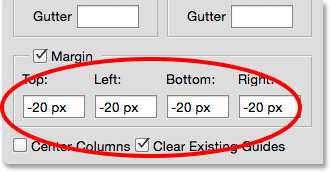
*Adding negative margins to the layout.*

This gives me the same 20 pixel-wide margins but moves them outside the document's viewable area. Once again, Photoshop resizes the columns and rows automatically:

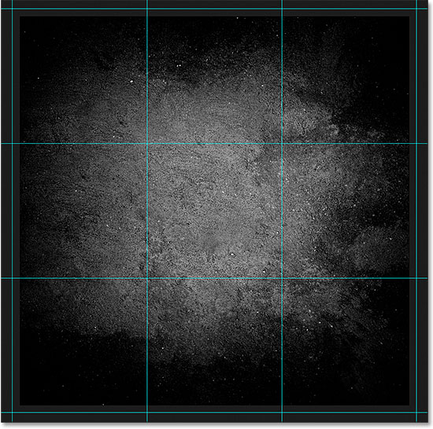
*The margins now sit outside the document area rather than inside.*

### Saving Your Custom Guide Layout As A Preset

If you know you'll need to create this same guide layout again in the future, you can save time by saving the layout as a preset. Click on the **Preset** box at the top of the dialog box (where it says "Custom"):

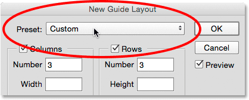
*Clicking the Preset selection box.*

This opens a menu with a few built-in preset layouts to choose from (8 Column, 12 Column, 18 Column, and 24 Column), but the option we want is **Save Preset**:

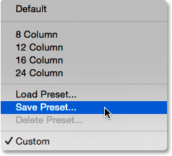
*Choosing the Save Preset option.*

When the Save dialog box appears, enter a descriptive name for your new preset into the **Save As** field. I'll name mine "cols-3-rows-3-margins-neg20px". Then, press the **Save** button:

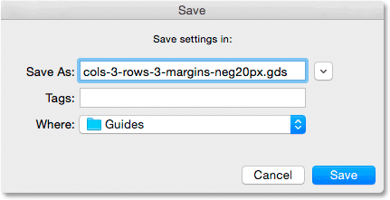
*Naming and saving the new preset.*

With the layout now saved as a preset, the next time you need it, you'll be able to quickly choose it from the Preset list:

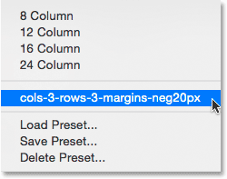
*The custom preset now appears in the list.*

Once you've created the guide layout you need, click **OK** to close out of the New Guide Layout dialog box:

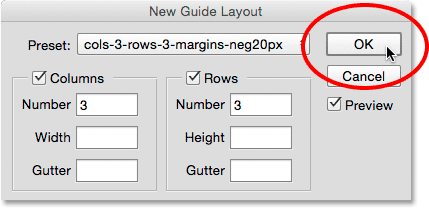
*Clicking OK to accept the new layout.*

### Hiding And Clearing The Guides

To temporarily hide your guide layout from view in the document, go up to the **View** menu, choose **Show**, then choose **Guides**. Do the same thing again to turn it back on. Or, simply press **Ctrl+;** (Win) / **Command+;** (Mac) on your keyboard to toggle the guides on and off:

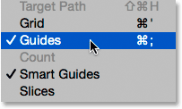
*Going to View > Show > Guides to turn the layout on and off.*

To clear the guide layout completely, go up to the **View** menu and choose **Clear Guides**:

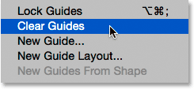
*Going to View > Clear Guides.*