# New Ways to Add Gradients in Photoshop

> Source: [https://www.photoshopessentials.com/basics/new-ways-to-add-gradients-in-photoshop-cc-2020/](https://www.photoshopessentials.com/basics/new-ways-to-add-gradients-in-photoshop-cc-2020/)
> Downloaded and converted to Markdown.

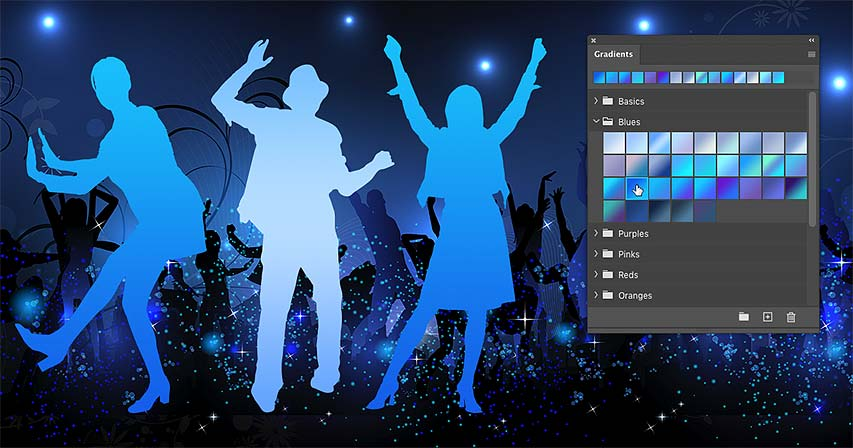

Adding gradients to images, shapes and type is now faster and easier than ever with the new Gradients panel in Photoshop CC 2020!

In the previous tutorial, we learned all about [the new Gradients panel](/basics/the-new-gradients-and-gradients-panel-in-photoshop-cc-2020/ "Learn more") in Photoshop CC 2020 and the many new and impressive gradients now included with Photoshop. I also showed you how to create and save your own gradients using Photoshop's Gradient Editor.

Along with the new Gradients panel itself, Photoshop CC 2020 also includes new and easy ways to *apply* gradients, including a great feature that lets you drag and drop gradients from the Gradients panel directly into your document. But exactly how Photoshop applies the gradient depends on which kind of layer you're working with.

So in this tutorial, I'll show you how to drag and drop gradients onto Background layers, pixel layers, shape layers, and type layers. I'll also show you a few keyboard tricks that let you change how the gradient is applied. And along the way, we'll look at how to combine gradients with Photoshop's blend modes to quickly add color effects to an image!

To follow along, you'll need [Photoshop CC 2020 or newer](https://prf.hn/l/dlXjD2w "Get Photoshop"). If you're an existing Creative Cloud subscriber, make sure that your copy of Photoshop is up to date.

Let's get started!

## How to apply a gradient to the Background layer

The easiest way to apply a gradient in Photoshop CC 2020 is to drag and drop it from the Gradients panel. To target a specific layer, simply drop the gradient directly onto the layer's contents. But just like with [color swatches in the improved Swatches panel](/basics/drag-and-drop-colors-swatches-in-photoshop-cc-2020/ "Learn more"), Photoshop will apply the gradient in different ways depending on which kind of layer it is. So let's start with the Background layer.

### The document setup

Here's [an image](https://prf.hn/l/dlgEVPq "View this image on Adobe Stock") open in Photoshop. I downloaded this one from Adobe Stock:

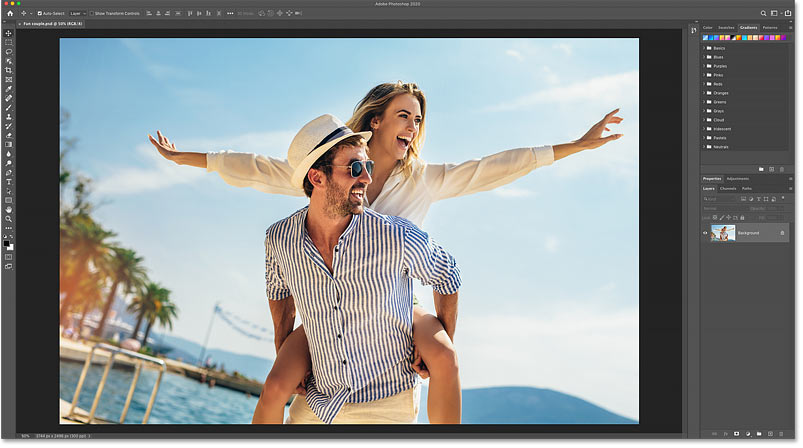

*The original image. Credit: Adobe Stock.*

In the [Layers panel](/basics/layers/layers-panel/ "Learn more about the Layers panel"), the image appears on the Background layer, currently the only layer in the document:

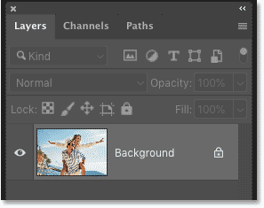

*The Layers panel showing the photo on the Background layer.*

### How to drag and drop a gradient

To apply a gradient to the [Background layer](/basics/background-layer-photoshop-cc/ "Learn more about the Background layer"), first choose a gradient in the [Gradients panel](/basics/the-new-gradients-and-gradients-panel-in-photoshop-cc-2020/ "Learn more about the Gradients panel"):

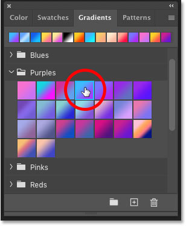

*Selecting a gradient in the Gradients panel.*

And then drag the gradient's thumbnail from the Gradients panel and drop it onto the image:

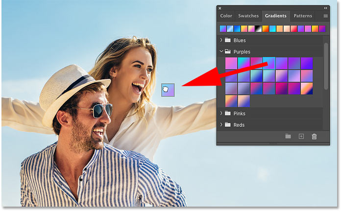

*Dragging and dropping the gradient into the document.*

The gradient fills the entire document, blocking the contents of the Background layer from view. I'll show you how to blend the gradient with the image in a moment:

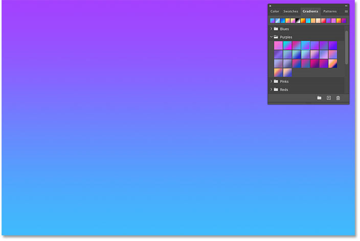

*The result after dragging and dropping the gradient.*

### Gradients are applied to backgrounds as Gradient fill layers

When applying a gradient to a Background layer, Photoshop keeps the gradient separate from the Background layer's contents by adding the gradient as a **Gradient fill layer** *above* the Background layer:

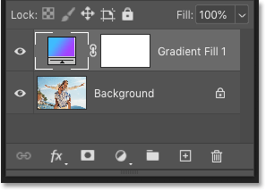

*The gradient was added as a Gradient fill layer.*

[Related: How to draw gradients with the Gradient Tool](/basics/how-to-draw-gradients-with-the-gradient-tool-in-photoshop/ "Learn more")

### How to choose a different gradient

To try a different gradient, first make sure the Gradient fill layer is selected in the Layers panel, and then simply click on a different gradient in the Gradients panel. Photoshop instantly updates the document with the new gradient colors:

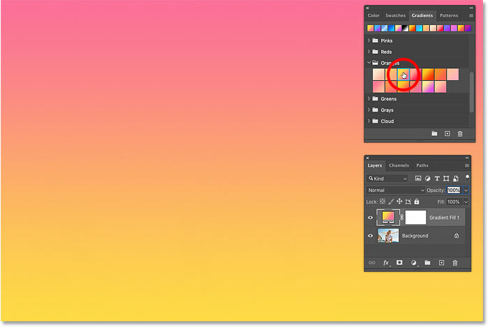

*Choosing different gradients is easy.*

### How to blend the gradient colors with the image

Obviously, blocking your image with a gradient is not very useful. But combining the Gradient fill layer with one of Photoshop's [blend modes](/photo-editing/layer-blend-modes/intro/ "Learn more about blend modes") is an easy way to add color effects to the image.

For example, I'll change the blend mode of the Gradient fill layer from Normal (the default mode) to **Color**:

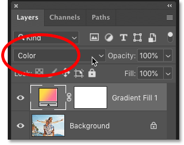

*Changing the Gradient fill layer's blend mode to Color.*

The [Color blend mode](/photo-editing/layer-blend-modes/color-blend-mode/ "Learn more about the Color blend mode") combines the colors from the gradient with the brightness values of the image. And just like that, we've added an interesting color effect.

Download my [Layer Blend Modes Complete Guide](/get-our-photoshop-layer-blend-modes-complete-guide-pdf/ "Learn more") PDF to learn all about Photoshop's blend modes:

*The result after changing the Gradient fill layer's blend mode.*

### Lowering the gradient's opacity

If the colors in the gradient are too strong, lower the **Opacity** value of the Gradient fill layer:

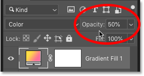

*Lowering the Opacity value.*

And with the [opacity](/basics/layers/opacity-vs-fill/ "Learn more about layer opacity") lowered, the effect is now less intense:

*The result after lowering the fill layer's opacity.*

## How to apply a gradient to a pixel layer

So that's how to apply gradients to the Background layer. Next, let's look at what happens when we drag and drop a gradient from the Gradients panel onto a normal pixel layer. I'll also show you how to access some options not found in the Gradients panel that let you change the appearance of the gradient.

### The document setup

For this part of the tutorial, I'll use the same image. But I've used the new [Object Selection Tool](/basics/object-selection-tool/ "Learn more about the Object Selection Tool") in Photoshop CC 2020 to select the couple in the photo and copy them to their own layer.

The Layers panel now shows the original image on the Background layer, and a copy of the couple on a separate pixel layer above it:

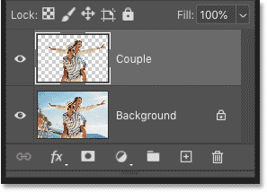

*The couple have been selected and copied to a separate layer.*

### How to target a specific layer

To target a specific layer when applying a gradient, simply drag and drop the gradient from the Gradients panel directly onto the layer's contents.

Since I want to apply the gradient to the couple, I'll drop the gradient onto them:

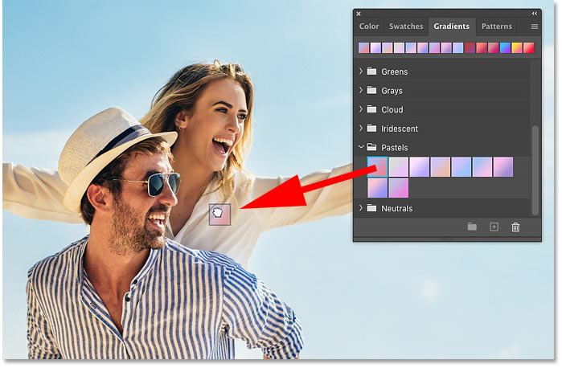

*Dragging a gradient onto the pixel layer's contents.*

And this time, the gradient is applied only to the couple (the contents of the pixel layer). The rest of the image is not affected:

*The gradient has been applied only to the contents of the targeted layer.*

### Gradients are added to pixel layers as clipped Gradient fill layers

When applying a gradient to a normal pixel layer, the gradient is added as a **Gradient fill layer** above the layer. And to keep the gradient from affecting all layers below it, the Gradient fill layer is *clipped* to the pixel layer using a [clipping mask](/basics/clipping-masks-essentials/):

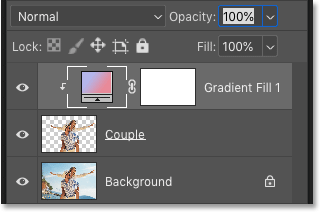

*The Gradient fill layer is clipped to the pixel layer.*

### How to access the Gradient Fill options

Once you've applied a gradient to a layer, you can access some options that let you change the appearance of the gradient. Double-click on the fill layer's **thumbnail**:

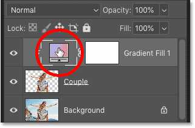

*Double-clicking on the fill layer's thumbnail.*

This opens Photoshop's **Gradient Fill** dialog box. From here, you can change the gradient **Style** from Linear (the default) to either Radial, Angle, Reflected or Diamond. You can change the **Angle** of the gradient, and you can swap the colors in the gradient by checking the **Reverse** option:

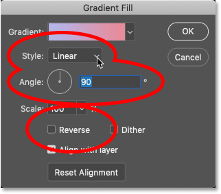

*The main options in the Gradient Fill dialog box.*

You can also choose a different gradient from the Gradient Fill dialog box by clicking the **arrow** to the right of the gradient swatch and then selecting a new gradient from the list. These are the same gradients found in the Gradients panel:

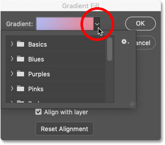

*Click the arrow to open the list of gradients.*

Or you can edit the colors of the current gradient by clicking directly on the **gradient swatch**. This opens Photoshop's **Gradient Editor**. I covered the Gradient Editor and how to edit gradients in the [previous tutorial](/basics/the-new-gradients-and-gradients-panel-in-photoshop-cc-2020/ "Learn more"):

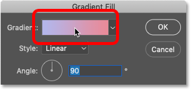

*Click the swatch to open the Gradient Editor.*

Click OK when you're done to close the Gradient Fill dialog box:

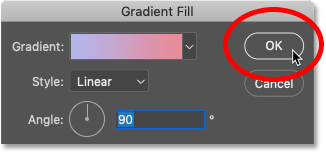

*Closing the dialog box.*

### Blending the gradient with the layer

Just like we saw earlier when applying a gradient to the Background layer, we can blend the colors of the gradient with the contents of the layer by changing the **blend mode** of the Gradient fill layer. Then use the **Opacity** value to fine-tune the intensity of the colors.

I'll again set the blend mode to Color, and I'll lower the opacity to 75 percent:

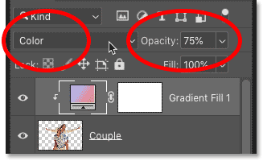

*The Blend Mode and Opacity options in the Layers panel.*

And here's my result:

*The effect with the gradient blended in with the layer.*

### Other ways to apply gradients to pixel layers

Before we move on to shape and type layers, here are a couple of keyboard shortcuts you can use for other ways to apply gradients to pixel layers.

To add a Gradient fill layer above a pixel layer without clipping to the pixel layer, press and hold the **Alt** (Win) / **Option** (Mac) key on your keyboard as you drag and drop the gradient onto the pixel layer's contents.

And to apply the gradient as a **Gradient Overlay** [layer effect](/basics/using-layer-effects-and-layer-styles-in-photoshop-cc-2020-complete-guide/ "Learn more") instead of a Gradient fill layer, press and hold **Ctrl+Alt** (Win) / **Command+Option** (Mac) as you drag and drop the gradient:

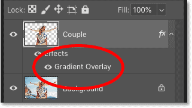

*Gradients can also be applied as Gradient Overlay effects.*

## How to apply gradients to shape layers

So far, we've seen that Photoshop applies gradients as Gradient fill layers when we drag and drop them onto the Background layer or a pixel layer. But that's not what happens when we drop them onto shape layers.

### The document setup

For our look at shape layers, I've created this separate document. The [background image](https://prf.hn/l/mejxmX0 "View image on Adobe Stock") was downloaded from Adobe Stock. In front of the image, I've placed three shapes of people. These are just a few of the many new shapes included with [Photoshop 2020](https://prf.hn/l/dlXjD2w "Get Photoshop CC"). And along the bottom, I've added the word "GRADIENTS":

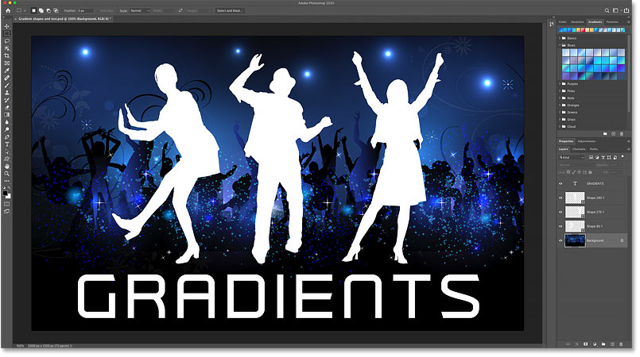

*A document containing both shapes and text.*

The Layers panel shows the image on the Background layer. Above that, each of the three shapes appears on its own shape layer. And at the top, we see the word "GRADIENTS" on a type layer:

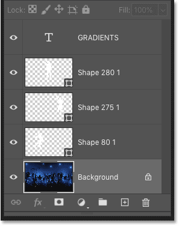

*An image, three shapes and some text.*

[Related: What makes vector shapes better than pixels?](/basics/vector-shapes-vs-pixel-shapes-in-photoshop/ "Learn more")

### Dragging and dropping a gradient onto a shape

Since my background image is mostly blue, I'll twirl open the Blues set in the Gradients panel. Then I'll drag and drop one of the gradients in the set onto the first shape on the left:

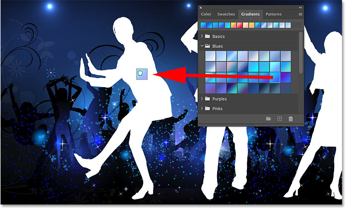

*Dragging and dropping a gradient onto the first shape.*

The shape is instantly filled with the gradient:

*The first gradient is added.*

### Gradients are applied directly to shapes

But this time in the Layers panel, notice that we don't see a Gradient fill layer. Instead, Photoshop applied the gradient directly to the shape itself. That's because unlike pixel layers, shape layers support gradient fills.

To open the Gradient Fill dialog box that we looked at earlier, double-click directly on the shape's **preview thumbnail**:

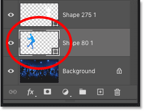

*The preview thumbnail showing the gradient added to the shape.*

### How to apply gradients to shapes as Gradient fill layers

Even though Photoshop applies gradients directly to shapes by default, you *can* apply them as Gradient fill layers. Just press and hold the **Ctrl** (Win) / **Command** (Mac) key on your keyboard as you drag and drop the gradient onto the shape:

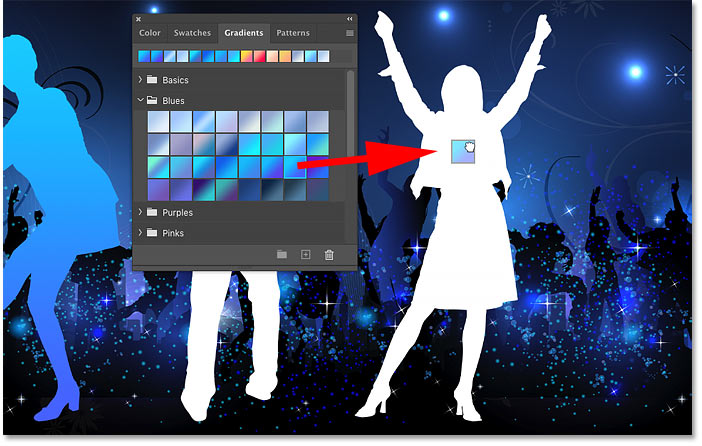

*Holding Ctrl (Win) / Command (Mac) while dragging and dropping the gradient.*

In the document, the result looks the same as before. The second shape is filled with the gradient:

*The result after dragging the same gradient onto the second shape.*

But because I held down my Ctrl (Win) / Command (Mac) key, this time Photoshop added the gradient as a Gradient fill layer that's clipped to the shape layer below it:

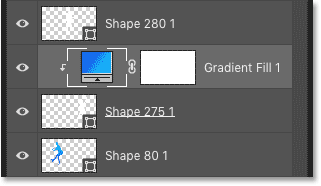

*The second gradient was added as a Gradient fill layer.*

### How to apply a gradient to a shape as a Gradient Overlay effect

And if you want to apply a gradient to a shape as a **Gradient Overlay** layer effect, press and hold **Ctrl+Alt** (Win) / **Command+Option** (Mac) on your keyboard as you drag and drop the gradient:

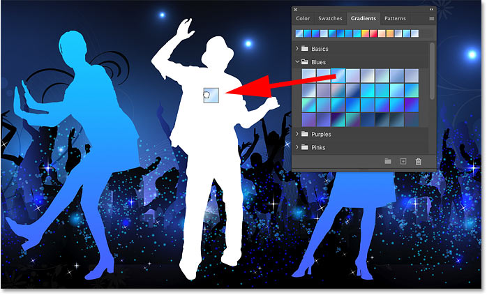

*Holding Ctrl+Alt (Win) / Command+Option (Mac) while dragging and dropping the gradient.*

Again in the document, the gradient fills the shape:

*The middle shape is filled with the gradient.*

But the gradient appears in the Layers panel as a Gradient Overlay effect below the shape layer:

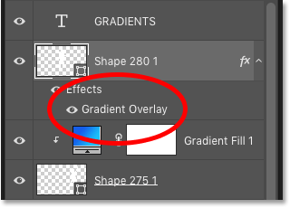

*The third gradient was added as a Gradient Overlay layer effect.*

### The gradient options in the Layer Style dialog box

When applying gradients as Gradient Overlay effects, you can access the options we saw earlier in the Gradient Fill dialog box by double-clicking on the words "Gradient Overlay" in the Layers panel.

Instead of Gradient Fill, this opens Photoshop's **Layer Style** dialog box where you'll find the same options. You can change the **Style** of the gradient, adjust the **Angle**, swap the colors by checking **Reverse**, and more. Click OK to close the dialog box when you're done:

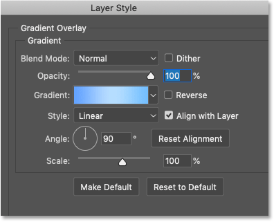

*The Gradient Overlay options in the Layer Style dialog box.*

## How to apply gradients to type layers

And finally, let's see what happens when we drag and drop a gradient onto a type layer.

I'll drag a gradient from the Gradients panel and drop it onto my text:

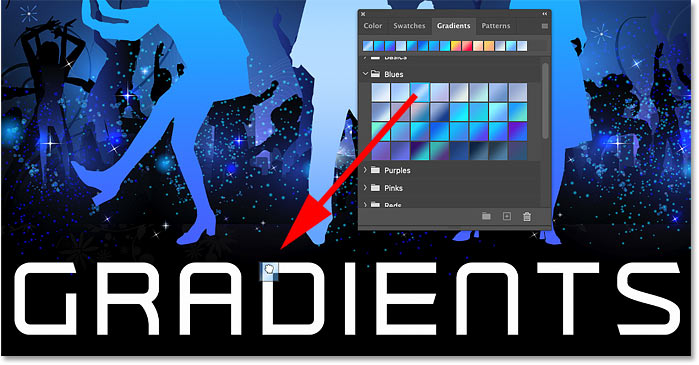

*Adding a gradient to the text.*

The text instantly updates with the gradient colors:

*The final design after filling the text with the gradient.*

### Gradients are applied to type as Gradient Overlay effects

But unlike shape layers, type layers in Photoshop do not support gradient fills. So in the Layers panel, we see that instead of filling the text directly, Photoshop applied the gradient as a **Gradient Overlay** layer effect.

You can also apply gradients to type layers as clipped Gradient fill layers by holding **Ctrl** (Win) / **Command** (Mac) on your keyboard as you drag and drop the gradient onto the text:

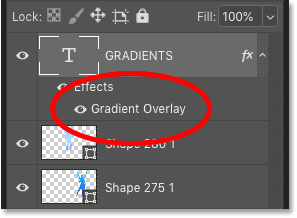

*Photoshop applies gradients to text as Gradient Overlay effects.*