# How to use the Object Selection Tool in Photoshop CC 2020

> Source: [https://www.photoshopessentials.com/basics/object-selection-tool/](https://www.photoshopessentials.com/basics/object-selection-tool/)
> Downloaded and converted to Markdown.

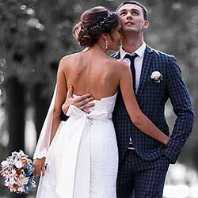

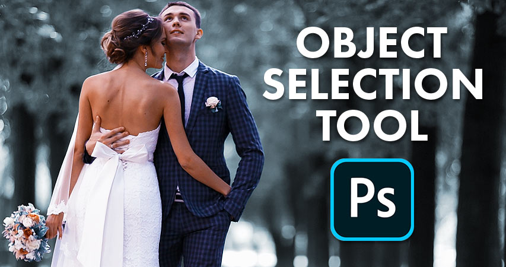

Ever wish you could select people or objects in your photos just by dragging around them? Now you can with the brand new Object Selection Tool in Photoshop CC 2020!

**Version Note:** This tutorial is for Photoshop 2020 and 2021. Photoshop 2022 users will want to read my updated [Using the Object Selection Tool and Object Finder in Photoshop 2022](/basics/using-the-object-selection-tool-and-object-finder-in-photoshop-2022/ "Read new version for Photoshop 2022") tutorial

In this tutorial, I show you how to use the new **Object Selection Tool in Photoshop CC 2020** to quickly select people, animals or other objects in your photos! Unlike Photoshop's [Select Subject](/basics/select-subject-select-and-mask-photoshop-cc-2018/ "Learn more") command which looks at the entire image and tries to identify the subject automatically, the Object Selection Tool lets you identify the subject yourself just by drawing a rough selection around it. Once you've drawn a quick selection, Photoshop automatically shrink-wraps the selection to the edges of your subject. And if the initial selection isn't perfect, you can easily add or subtract areas, again just by dragging around them. Let's see how it works.

The Object Selection Tool is brand new as of [Photoshop 2020](https://prf.hn/l/dlXjD2w "Get Photoshop"). So to follow along, make sure that your copy of Photoshop CC is up to date.

For this tutorial, I'll be using [this image](https://prf.hn/l/RmYONop "View image on Adobe Stock") that I downloaded from Adobe Stock. I'll use the Object Selection Tool to select the wedding couple in the foreground. And then once the couple is selected, I'll show you a quick way to leave your subject in color and turn the rest of the photo to black and white:

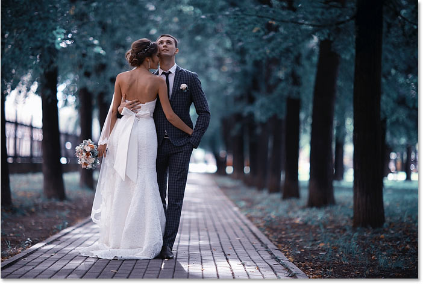
*The original image. Photo credit: Adobe Stock.*

Let's get started!

## Where do I find the Object Selection Tool?

In Photoshop CC 2020, the Object Selection Tool is found in the [toolbar](/basics/photoshop-tools-toolbar-overview/ "Learn more"), nested in with the [Quick Selection Tool](/basics/selections/quick-selection-tool/ "Learn more") and the [Magic Wand Tool](/basics/selections/magic-wand-tool/ "Learn more"). It has a keyboard shortcut of **W**:

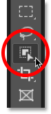
*The Object Selection Tool in the toolbar.*

If one of the other tools in that slot was previously active, click and hold on the tool's icon until a fly-out menu appears, and then choose the Object Selection Tool from the menu:

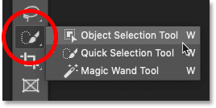
*Selecting the Object Selection Tool from the menu.*

[Related: How to customize the toolbar in Photoshop CC](/basics/custom-toolbar-photoshop/ "Learn more")

## The Object Selection Tool options

Let's take a quick look at a few important options for the Object Selection Tool in the Options Bar. Note that these options need to be set *before* drawing your selection, since they only apply to the next selection you make.

### Mode

There are two selection types that we can draw with the Object Selection Tool—**Rectangle** and **Lasso**— and we switch between them using the **Mode** option. Rectangle is the default mode, and it lets you draw a simple rectangular box, just like you could with the [Rectangular Marquee Tool](/basics/selections/rectangular-marquee-tool/ "Learn more"). And Lasso works like the [Lasso Tool](/basics/selections/lasso-tool/ "Learn more"), letting you draw a freeform selection around the object:

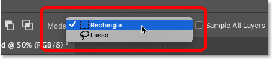
*Choose a selection type (Rectangle or Lasso) from the Mode option.*

#### Tip! How to use the Polygonal Lasso with the Object Selection Tool

Here's a hidden trick to use with the Object Selection Tool. When drawing your initial selection with the Mode set to Lasso, you can switch to the **Polygonal Lasso Tool** by pressing and holding the **Alt** (Win) / **Option** (Mac) key on your keyboard. The [Polygonal Lasso Tool](/basics/selections/polygonal-lasso-tool/ "Learn more") lets you simply click around the object to select it. Release the Alt (Win) / Option (Mac) key when you're done to complete the selection.

### Sample All Layers

By default, the Object Selection Tool looks for objects only on the active layer. But if you want your selection to be based on a composite of [all layers](/basics/understanding-photoshop-layers/ "Learn more") in your document, then turn on **Sample All Layers**. In most cases, you'll want to leave it off:

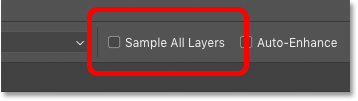
*The Sample All Layers option (off by default).*

### Auto-Enhance

**Auto-Enhance** adds a slight amount of smoothing to the edges of your selection. The difference with Auto-Enhance on or off is minimal, so it's usually fine to leave it off:

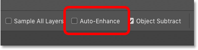
*The Auto-Enhance option (off by default).*

### Object Subtract

The **Object Subtract** option allows Photoshop to use its advanced Object Selection technology when subtracting unwanted areas from the initial selection. When Object Subtract is turned off, the Object Selection Tool behaves just like the standard Rectangular Marquee or Lasso Tool and simply removes whatever pixels you manually drag around. Object Subtract should almost always be left on.

We'll look more closely at the Object Subtract option a bit later in this tutorial:

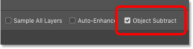
*The Object Subtract option (on by default).*

## How to select objects with the Object Selection Tool

The way the Object Selection Tool works is that we draw a selection outline around the general area where the object appears. Photoshop then looks inside the boundaries of that selection to find the object, and it wraps the selection outline around it. Once the initial selection is in place, we can add missing areas to the selection, or subtract areas from the selection, again just by dragging around them with the Object Selection Tool.

### Step 1: Draw an initial selection around the object

Start by drawing your initial selection. The default Rectangle mode usually works best. I'll draw a rectangular selection around the wedding couple. Try to stay fairly close to the object while still keeping it entirely within the selection boundaries:

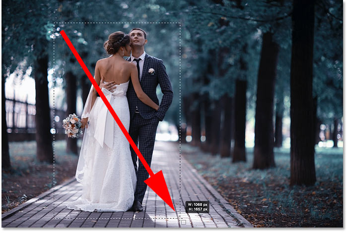
*Drawing an initial rectangular selection around my subject(s).*

### Tip! How to move the selection outline as you draw it

If you started your selection outline in the wrong spot, keep your mouse button held down and press and hold the **spacebar** on your keyboard. Drag your mouse to move the selection outline into place, and then release your spacebar to continue drawing the rest of the selection.

### The initial result

Once you have surrounded the object with your selection outline, release your mouse button. Photoshop analyzes the area within the selection, and after a few seconds, it shrink-wraps the outline around the object:

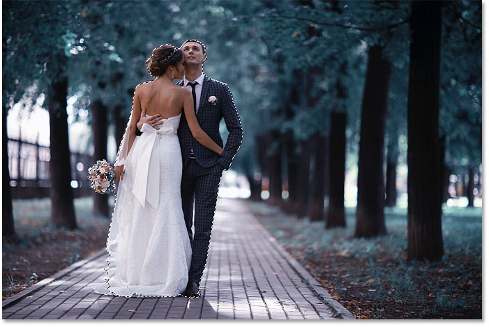
*Photoshop was able to isolate the couple from the background.*

### Step 2: Look for problems with the selection

While the initial results are often impressive, they're usually not perfect. You'll want to [zoom in and scroll](/basics/photoshop-zoom/ "Learn more") around the object looking for problems with the selection.

For example, here we see that Photoshop did a pretty bad job of selecting the flowers in the bouquet:

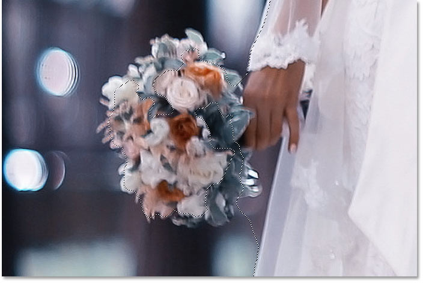
*Photoshop missed most of the flowers.*

### Step 3: Hold Shift and drag to add to the selection

To add a missing part of the object to your selection, press and hold your **Shift** key and drag another selection outline around it:

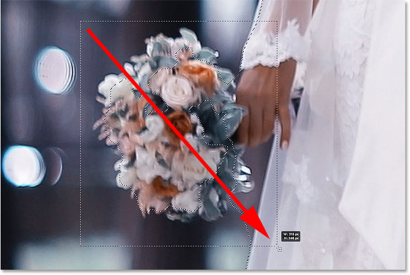
*Holding Shift and dragging a rectangular selection around the bouquet.*

Photoshop again analyzes the area within the selection boundaries, and just like that, the missing part is added:

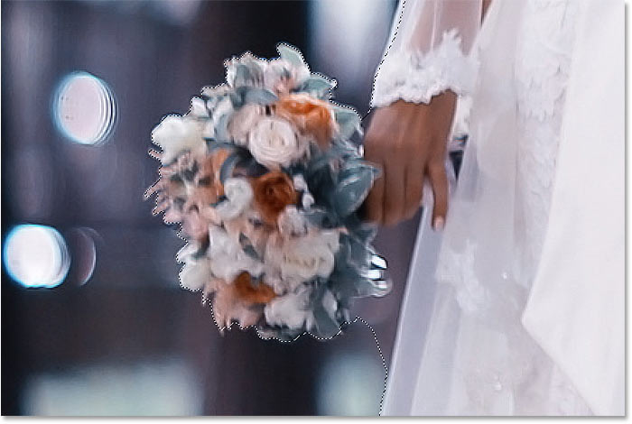
*The bouquet has been added to the main selection.*

### Step 4: Hold Alt (Win) / Option (Mac) and drag to subtract from the selection

To remove, or subtract, an unwanted area from the selection, press and hold the **Alt** (Win) / **Option** (Mac) key on your keyboard and drag around it.

With my image, notice that the area between the bouquet and the dress is also selected and needs to be removed:

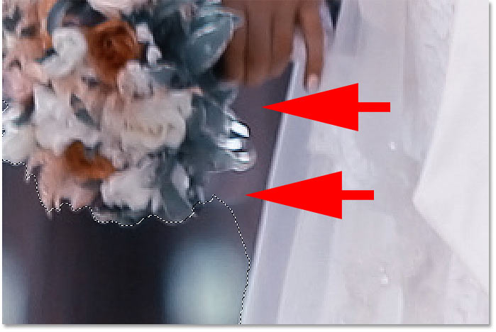
*An area that needs to be subtracted from the selection.*

#### Changing the tool mode from Rectangle to Lasso

Since this area is on a bit of an angle, I'll change the **Mode** option in the Options Bar from Rectangle to **Lasso**:

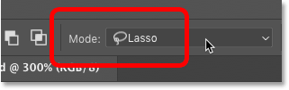
*Setting the Mode to Lasso.*

#### Drawing a selection around the area

Lasso mode lets us draw freeform selections with the Object Selection Tool. I'll hold my Alt (Win) / Option (Mac) key and I'll draw around the area that needs to be subtracted. Notice that I'm not drawing a precise selection. I'm simply drawing around and outside the general area:

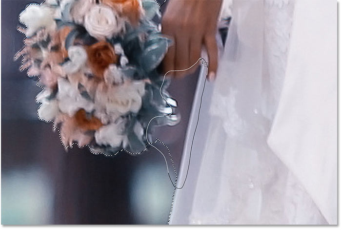
*Surrounding the area that needs to be subtracted from the selection.*

Release your mouse button, and the unwanted area is removed:

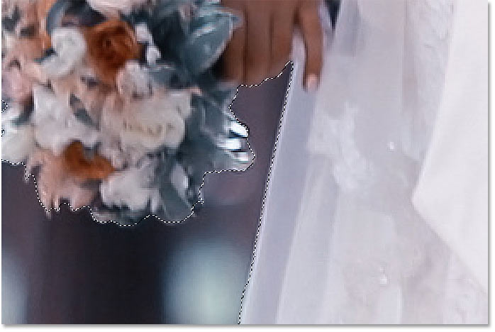
*The Object Selection tool was able to subtract the area from the selection.*

## What does the Object Subtract option do?

Earlier when we looked at the Object Selection Tool's options in the Options Bar, I mentioned that **Object Subtract** should usually be left on. Let's take a quick look at exactly what the Object Subtract option does.

Here's another problem area with my image. The space between the side of the man's suit jacket and his arm needs to be subtracted from the selection:

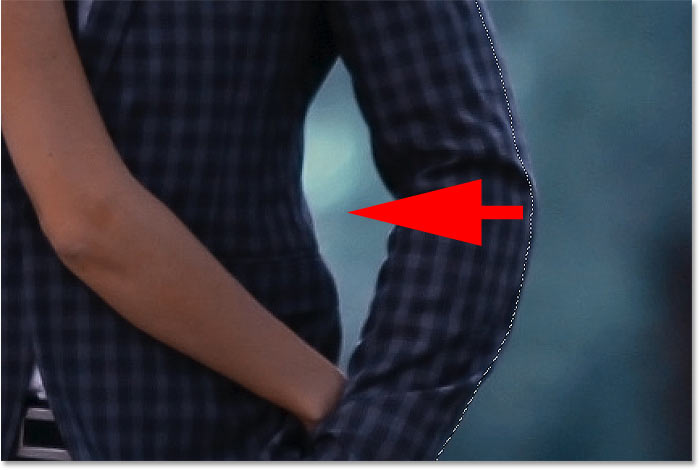
*Another area that needs to be subtracted from the selection.*

Since this area looks like it can easily fit inside a rectangular box, I'll switch the **Mode** option in the Options Bar from Lasso back to **Rectangle**:

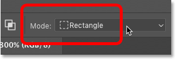
*Setting the tool mode to "Rectangle".*

### Removing an area with Object Subtract off

I'll turn Object Subtract **off**:

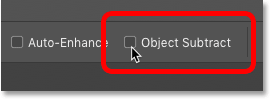
*Turning off "Object Subtract" in the Options Bar.*

And then to subtract from the selection, I'll press and hold **Alt** (Win) / **Option** (Mac) and I'll drag out a rectangular selection outline around it:

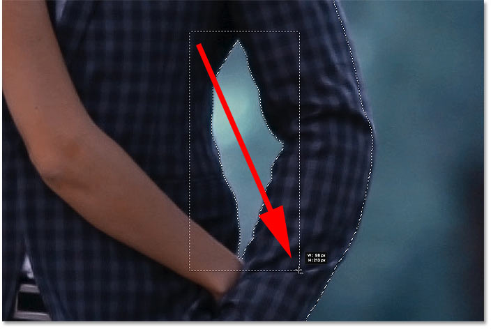
*Subtracting the area with "Object Subtract" turned off.*

But notice that instead of subtracting just the empty area in the middle, Photoshop subtracted *everything* within the selection. That's because turning Object Subtract off disables the advanced technology that the Object Selection Tool uses to analyze the image. Instead, it behaves like the standard Rectangular Marquee or Lasso Tool and just subtracts everything you drag around.

*The entire area was removed with "Object Subtract" turned off.*

### How to undo a step with the Object Selection Tool

I'll undo my last step by going up to the **Edit** menu in the Menu Bar and choosing **Undo Object Selection**. Or I could press **Ctrl+Z** (Win) / **Command+Z** (Mac) on my keyboard. Photoshop gives us multiple undos with the Object Selection Tool, so you can press Ctrl+Z (Win) / Command+Z (Mac) repeatedly to undo multiple steps:

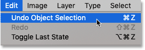
*Going to Edit > Undo Object Selection.*

### Removing an area with Object Subtract on

This time, I'll turn Object Subtract **on**:

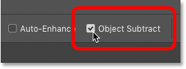
*Turning on "Object Subtract".*

Then I'll again hold **Alt** (Win) / **Option** (Mac) as I draw the same rectangular selection outline around the area:

*Subtracting the area with "Object Subtract" turned on.*

And with Object Subtract turned on, Photoshop is able to analyze the area within the selection, figure out which part of the selection needs to be removed, and subtracts only the area in the center:

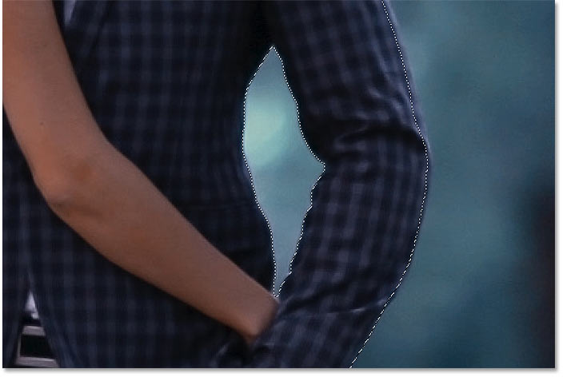
*The result with "Object Subtract" turned on.*

### When should I turn Object Subtract off?

If you're trying to subtract an area and the Object Selection Tool is having too much trouble, turn Object Subtract off to manually (and carefully) select the area yourself. Otherwise, leave Object Subtract turned on for the best results.

## Switching between "Add" and "Subtract" modes

When using the Object Selection Tool, you'll often need to switch back and forth between "Add" and "Subtract" mode in order to fine-tune a selection area.

For example, here we see some empty space between the couple that needs to be subtracted from the selection:

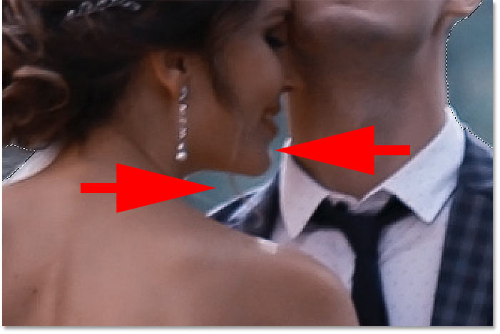
*Another area that needs to be deselected.*

### Subtracting from the selection

In the Options Bar, I'll set the **Mode** to **Lasso**:

*Setting the Mode to Lasso.*

And then to subtract it, I'll hold **Alt** (Win) / **Option** (Mac) and I'll draw a rough outline around the area:

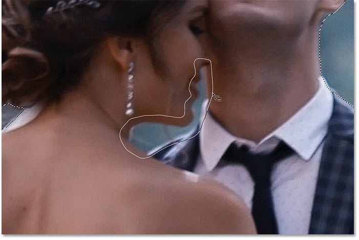
*Holding Alt (Win) / Option (Mac) to subtract from the selection.*

But notice that along with subtracting the empty space, Photoshop also removed some of the man's shoulder and his shirt collar, which means I need to add those areas back:

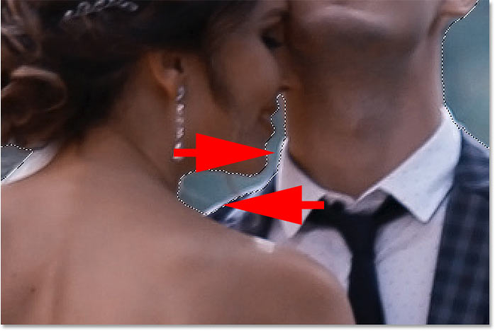
*Photoshop subtracted too much of the area.*

### Adding back some of the original selection

So to add them to the selection, I'll hold my **Shift** key as I drag around them:

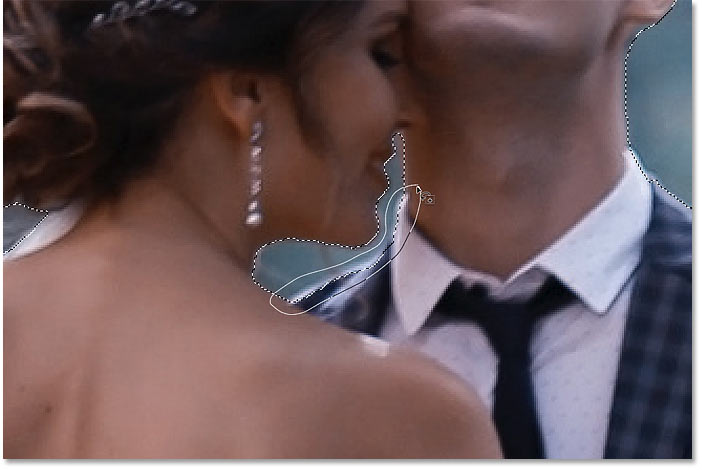
*Holding Shift to add areas to the selection.*

And now those areas are once again selected:

*The result after adding back part of the original selection.*

## Finishing up the selection

Continue making your way around the object, holding **Shift** to add to the selection or **Alt** (Win) / **Option** (Mac) to subtract from it, until the selection looks good. Here's my final result with the wedding couple selected in front of the background:

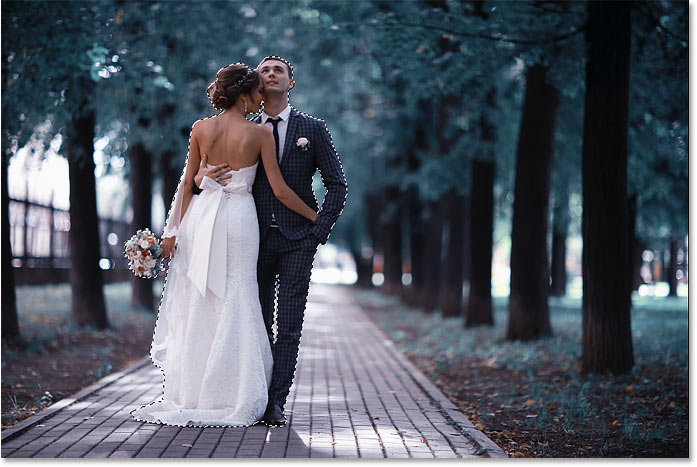
*The final selection using the Object Selection Tool.*

At this point, you could refine the selection further using Photoshop's **Select and Mask** workspace. But I'm going to save that for the next tutorial where we'll look specifically at using the Object Selection Tool with Select and Mask.

## How to convert the deselected area to black and white

Instead, let's look at how to quickly convert the rest of the image to black and white while leaving our subject in color. This part assumes that you have already selected your subject with the Object Selection Tool, or with any of [Photoshop's other selection tools](/basics/make-selections-photoshop/ "Learn more").

### Step 1: Invert the selection

At the moment, we have our subject(s) selected and everything else is deselected. To convert the background to black and white, we need to *invert* the selection so that everything *except* our subject is selected. To invert the selection, go up to the **Select** menu in the Menu Bar and choose **Inverse**:

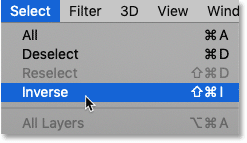
*Going to Select > Inverse.*

### Step 2: Add a Black & White adjustment layer

To convert the rest of the image to black and white, we'll use a Black & White adjustment layer.

In the [Layers panel](/basics/layers/layers-panel/ "Learn more"), click the **New Fill or Adjustment Layer** icon:

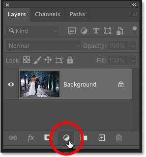
*Clicking the "New Fill or Adjustment Layer" icon.*

And choose **Black & White** from the list:

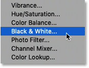
*Adding a Black & White adjustment layer.*

Photoshop adds the adjustment layer above the image, and it automatically converts our selection outline into a [layer mask](/basics/understanding-photoshop-layer-masks/ "Learn more"):

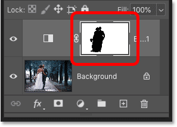
*The Layers panel showing the adjustment layer and the layer mask.*

And instantly, the surrounding area is converted to black and white while our subject remains in full color:

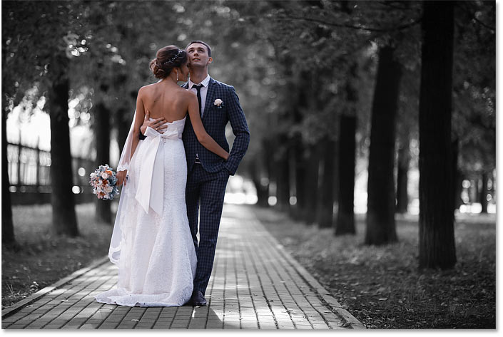
*The area surrounding the subject(s) is now in black and white.*

[Related: Create an easy Selective Color effect with Photoshop!](/photo-effects/easy-selective-color-effect-with-photoshop/ "Learn more")

### Step 3: Drag the color sliders to fine-tune the black & white conversion

The controls for the Black & White adjustment layer appear in Photoshop's **Properties panel**. To customize the black and white conversion, drag the individual **color sliders** left or right.

Each color slider lightens or darkens different parts of the image based on their original color. So the **Reds** slider affects the brightness of red areas, the **Yellows** slider effects yellows, and so on. If a slider has no effect on the brightness of the image, it's because no part of the image contained that color. I cover black and white conversions in much more detail in my [Converting Color Photos to Black and White](/photo-editing/converting-color-photos-to-black-and-white-in-photoshop/ "Learn more") tutorial:

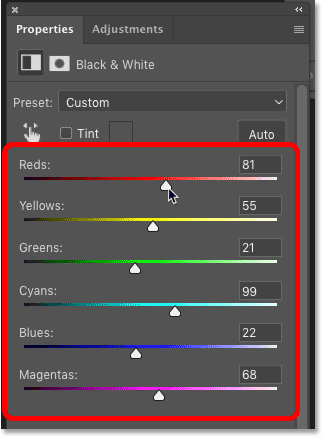
*Dragging the color sliders to adjust the black and white areas.*

Since the background in my image contained lots of cyan, I increased the brightness slightly by dragging the **Cyans** slider to the right. And here's my final result:

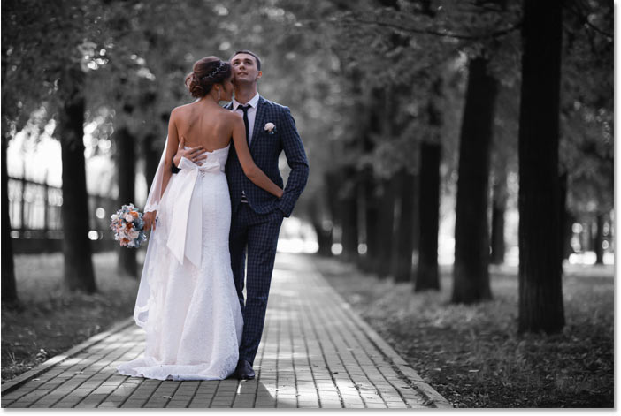
*The final result using the Object Selection Tool and a Black & White adjustment layer.*

And there we have it! That's how to quickly select objects in your photos using the brand new Object Selection Tool in Photoshop CC 2020! Check out our [Photoshop Basics](/basics/ "More Photoshop Basics tutorials") section for more tutorials. And don't forget, all of our Photoshop tutorials are available to [download as PDFs](/print-ready-pdfs/ "Learn more")!