# Layer Opacity vs Fill in Photoshop

> Source: [https://www.photoshopessentials.com/basics/layers/opacity-vs-fill/](https://www.photoshopessentials.com/basics/layers/opacity-vs-fill/)
> Downloaded and converted to Markdown.

Photoshop's Opacity and Fill options in the Layers panel both control the transparency of a layer and often behave exactly the same. In this tutorial, we learn the important difference between Opacity and Fill when working with layer styles!

One of the most common questions I receive from Photoshop users, and not just beginners, is "What the heck is the difference between the **Opacity** and **Fill** options in the Layers panel? Don't they both just do the same thing?". It's a good question because in most cases, they actually are exactly the same.

Both the Opacity and Fill options control a layer's **transparency**. That is, they control how much the currently selected layer allows other layers below it in the document to show through. Normally, to lower a layer's transparency, we lower the Opacity value. But if the Fill option also lowers transparency, well, what's the point of having two options that do the same thing? There must be a difference, right?

Right you are! The main difference between Opacity and Fill has to do with Photoshop's **layer styles**. If you haven't added any effects (styles) to your layer, like a stroke, drop shadow, bevel and emboss or outer glow, you'll get the same results when lowering either the Opacity or Fill values. If, on the other hand, you *do* have one or more layer styles applied, Opacity and Fill behave very differently. Let's look at an example.

This tutorial is Part 9 of our [Photoshop Layers Learning Guide](/photoshop-layers-learning-guide/).

Here's an image I have open in Photoshop. I've added some simple text to it - the word "dream":

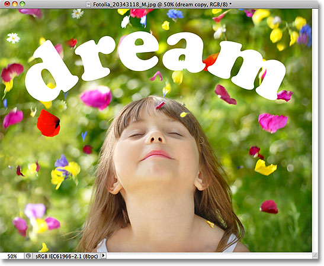
*The original image.*

If we look in my [Layers panel](../layers-panel/), we see the photo of the girl sitting on the Background layer, and the word "dream" is on a Type layer directly above it (the arch in the word was created by adding the [type on a path](/basics/type-on-a-path/)). I also have a copy of my Type layer above the original, but I've turned that layer off for the moment:

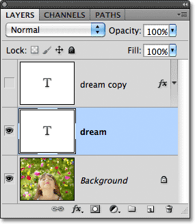
*The Layers panel showing the Background layer, the text layer above it, and a copy of the text at the top, which is temporary hidden.*

The Opacity option is located in the top right corner of the Layers panel, and the Fill option is directly below it. By default, both values are set to 100%, which means my text, which is on the layer that's currently selected, is completely visible in the document:

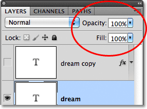
*The Opacity and Fill options, both set to 100%.*

Let's see what happens if I lower the **Opacity** value down to 50%:

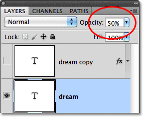
*Reducing the opacity of the Type layer to 50%.*

With Opacity lowered to 50%, the word "dream" in my document becomes 50% transparent, allowing the image below it to partially show through:

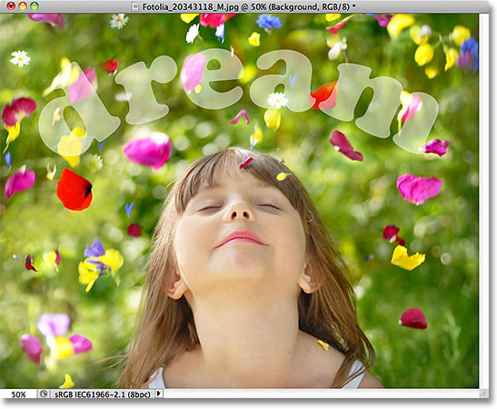
*The image after lowering the Opacity value of the text to 50%.*

I'll raise the Opacity value back up to 100%, and this time, I'll lower the **Fill** value down to 50%:

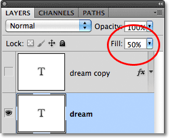
*Lowering Fill to 50%.*

With Fill set to 50%, the text once again becomes 50% transparent in the document, and we get the exact same result as we saw a moment ago when we lowered the Opacity value:

*Lowering Fill to 50% produces the exact same result.*

### Opacity vs Fill With Layer Styles

So far, we've seen no difference at all between the Opacity and Fill options, but that was on a layer without any layer styles applied to it. Let's see what happens if we try a different layer. I'm going to turn off my Type layer by clicking on its **layer visibility icon**:

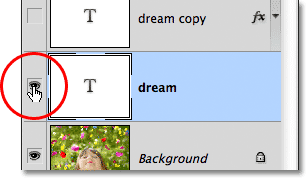
*Turning off the original text layer.*

This hides the original text in the document. Then I'll click on the copy of the Type layer above it to select the layer and I'll turn the layer on in the document by clicking once again on its layer visibility icon:

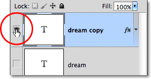
*Selecting and turning on the copy of the text layer.*

This new layer contains the exact same text as before, but with one important difference. I've added a few layer styles to it - a stroke, a faint drop shadow and a bevel and emboss effect. We can see the stroke around the letters and the drop shadow behind them. The bevel and emboss effect is hard to see at the moment with the text currently filled with solid white:

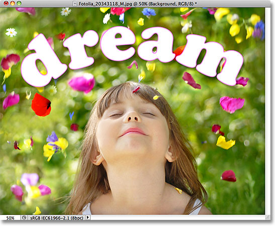
*The same text but with a few layer effects added.*

I'll twirl open the list of effects in the Layers panel by clicking on the small arrow to the right of the "fx" icon, just so we can see that I do in fact have a Drop Shadow, Bevel and Emboss and Stroke effect applied to the text:

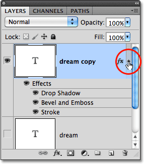
*Twirling the layer styles open to view the list of effects being added to the text.*

Let's see what happens with this new layer if I lower the Opacity value down to 50%:

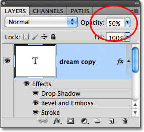
*Once again lowering Opacity to 50%.*

By lowering the Opacity value of the new layer, we've made everything on the layer 50% transparent. By "everything", I mean not only the text itself but also the layer styles applied to it. Anything and everything on the layer is now 50% transparent after lowering the Opacity value:

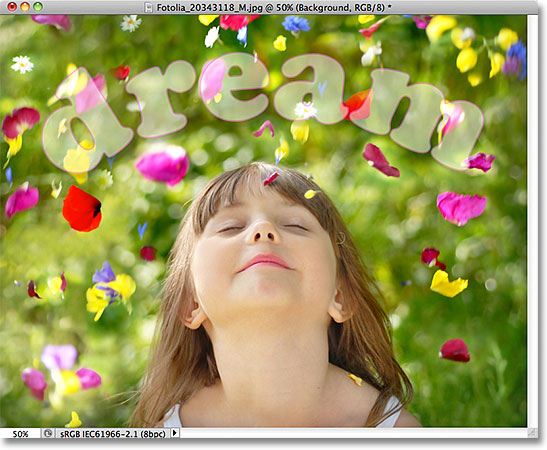
*Lowering the Opacity value caused everything on the layer, including the layer styles, to become 50% transparent.*

So far, no big surprises. I'll raise the Opacity value back up to 100%, and now I'll lower the Fill value to 50%:

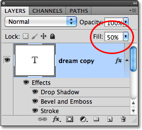
*Lowering Fill to 50%.*

Here is where we see the difference between Opacity and Fill. Lowering the Opacity value made *everything* on the layer 50% transparent, but by lowering the Fill value to 50%, only the *text itself* becomes 50% transparent. The layer styles I've applied to the text remain 100% visible! The Stroke, Drop Shadow and Bevel and Emboss effects were not affected at all by the Fill value. In fact, with the text itself now 50% transparent, we can start to see the Bevel and Emboss effect I applied to it:

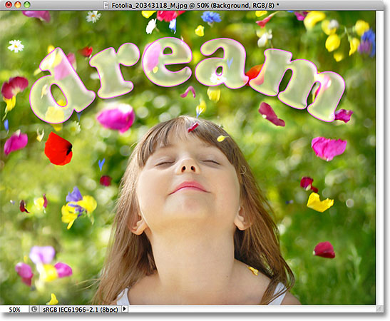
*The Fill value made the text partially transparent, but had no effect on the layer styles.*

Let's lower the Fill value all the way down to 0% and see what happens:

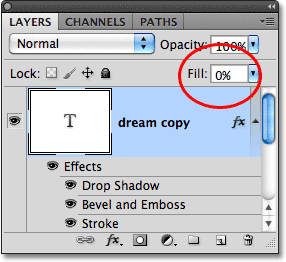
*Lowering Fill to 0%.*

With Fill set to 0%, the text becomes completely transparent in the document, but the layer styles applied to it remain completely visible! The Fill value has no affect on the layer styles at all, allowing me to easily create an interesting text effect that would have been impossible using the Opacity value:

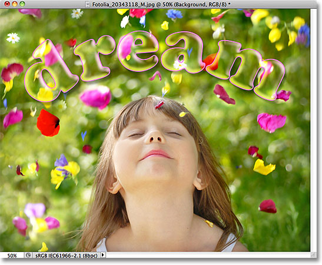
*The text is now 100% transparent, yet the layer styles remain 100% visible.*

And that's the difference between Opacity and Fill. The **Opacity** value controls the transparency of **anything and everything** on a layer, *including* layer styles. The **Fill** value, on the other hand, affects only the **actual contents** of the layer, which in my case here was the text. Layer styles, which Photoshop treats as separate from a layer's actual contents, remain 100% visible and are unaffected by the Fill value.

As I mentioned at the beginning, in most cases when you need to reduce the transparency of a layer, simply lower the Opacity value. But if you have layer styles applied to it and need to keep the styles themselves 100% visible, as in the case with the text effect I created in this example, leave the Opacity value set to 100% and lower the Fill value instead.

### Where to go from here...

And there we have it! In the next tutorial in our [Layers Learning Guide](/photoshop-layers-learning-guide/), we'll learn how to speed up our Photoshop workflow with some essential [layers power shortcuts](/basics/layer-shortcuts/)! Or visit our [Photoshop Basics](/basics/) section to learn more about Photoshop!