# How To Open Images Into Camera Raw

> Source: [https://www.photoshopessentials.com/basics/open-image-camera-raw/](https://www.photoshopessentials.com/basics/open-image-camera-raw/)
> Downloaded and converted to Markdown.

Learn how to open images, including raw files, JPEGs and TIFFs, directly into Photoshop's amazingly powerful image editing plugin known as Camera Raw.

So far in this series on getting our images into Photoshop, we've learned [how to set Photoshop as your default image editor](/basics/how-to-make-photoshop-your-default-image-editor/ "How to set Photoshop as your default image editor"). We learned [how to open images from within Photoshop itself](/basics/open-images-photoshop-cc/ "How to open images in Photoshop"). And we learned how to open images into Photoshop using [Adobe Bridge](/basics/open-images-photoshop-adobe-bridge/ "How to open images into Photoshop from Adobe Bridge").

Yet even though Photoshop is still the world's most powerful and popular image editor, times have changed. These days, especially if you're a photographer, you're less likely to open your images into Photoshop itself (at least initially) and more likely to open them into Photoshop's image editing plugin, Camera Raw.

Camera Raw was originally designed to let us process raw files. That is, images that were captured using your camera's raw image file format. But Camera Raw has grown to include support for JPEG and TIFF images as well.

Unlike Photoshop which is used by people in virtually every creative profession, Camera Raw was built with photographers in mind, using a simple layout that matches a normal photo editing workflow from start to finish. This makes editing images in Camera Raw much more natural and intuitive. And, Camera Raw is completely non-destructive, meaning that nothing we do to an image is permanent. We can make any changes we like, any time we like, and we can even restore the original, unedited version at any time.

We're going to cover Camera Raw is great detail in its own series of tutorials. For now, let's learn how to open our images directly into Camera Raw. We'll start with raw files since they're the easiest to open. Then, we'll learn how to open JPEG and TIFF images.

The best way to open images into Camera Raw is by using **Adobe Bridge**, so that's what I'll be using here. If you're not yet familiar with Adobe Bridge, I covered the basics, including how to install Bridge, in the previous [How To Open Images From Adobe Bridge](/basics/open-images-photoshop-adobe-bridge/ "How to open images into Photoshop from Adobe Bridge") tutorial. Be sure to check that one out before you continue.

This lesson is from my [Getting Images into Photoshop](/basics/opening-images-photoshop/ "How to open images into Photoshop") Complete Guide.

Let's get started!

## Opening Adobe Bridge From Photoshop

To open Adobe Bridge from within Photoshop, go up to the **File** menu (in Photoshop) in the Menu Bar along the top of the screen and choose **Browse in Bridge**:

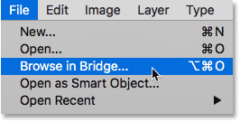
*Going to File > Browse in Bridge.*

This launches Bridge where we see that I've already navigated to the folder on my Desktop that holds my images. There's three images in the folder, and Bridge displays them as thumbnails in the **Content** panel in the center:

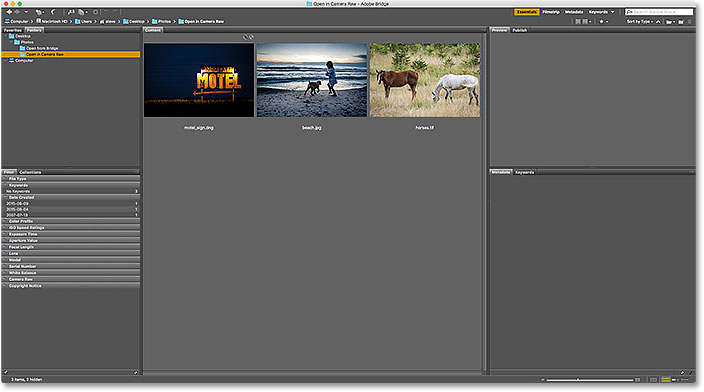
*Bridge displaying thumbnails of the images in the folder.*

If we look closer, we see that all three images are of a different file type. The first image on the left ("motel_sign.dng") is a raw file. The second image ("beach.jpg") is a JPEG. And the third image ("horses.tif") is a TIFF file:

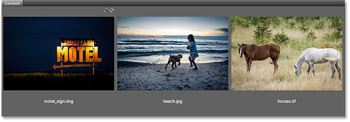
*Three images, three different file types.*

## How To Open Raw Files Into Camera Raw

Let's start with the raw file ("motel_sign.dng"). Since Camera Raw was originally designed for processing raw files, opening raw files into Camera Raw is easy. All we need to do is **double-click** on the raw file's **thumbnail** in Bridge:

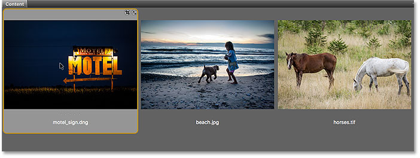
*Double-clicking on the raw file's thumbnail.*

This instantly opens the image into Camera Raw, ready for editing. Again, since Camera Raw is a big topic, we're going to cover it in detail in its own series of tutorials:

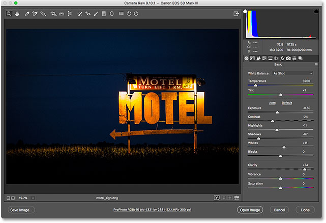
*The raw file opens in Camera Raw. Image © Steve Patterson.*

### Moving The Image From Camera Raw Into Photoshop

If I want to move the image from Camera Raw into Photoshop, all I would need to do is click the **Open Image** button in the bottom right of the Camera Raw dialog box. This applies to all three file types, not just raw files:

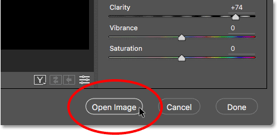
*Click "Open Image" to send the image from Camera Raw to Photoshop.*

### Closing Camera Raw And Returning To Bridge

Or, if I'm done editing the image in Camera Raw and simply want to close Camera Raw and return to Adobe Bridge, I would click the **Done** button:

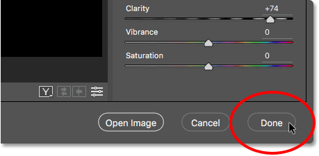
*Clicking the "Done" button in the lower right corner.*

This closes the Camera Raw dialog box and returns me to Bridge. And that's really all there is to opening raw files into Camera Raw:

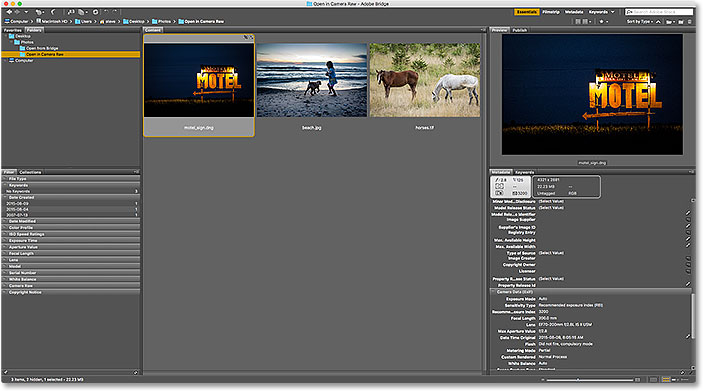
*Back to Adobe Bridge.*

## How To Open JPEG Files Into Camera Raw

[Opening a JPEG file into Camera Raw](/photo-editing/two-ways-to-open-jpeg-files-in-adobe-camera-raw/ "Two ways to open JPEG files in Adobe Camera Raw") is a bit less intuitive. Camera Raw fully supports JPEG images. But by default, Adobe Bridge opens JPEGs not into Camera Raw but into Photoshop. I'll double-click on my JPEG file's thumbnail ("beach.jpg") in the Content panel in Bridge:

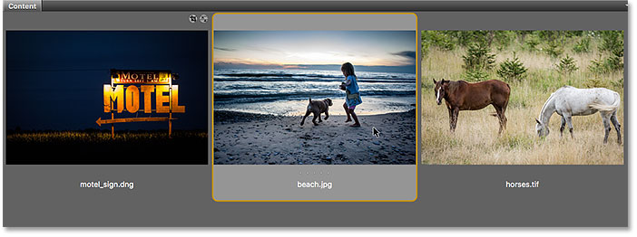
*Double-clicking on the JPEG file's thumbnail.*

And here we see that sure enough, Bridge skipped the Camera Raw dialog box and sent my JPEG image straight into Photoshop:

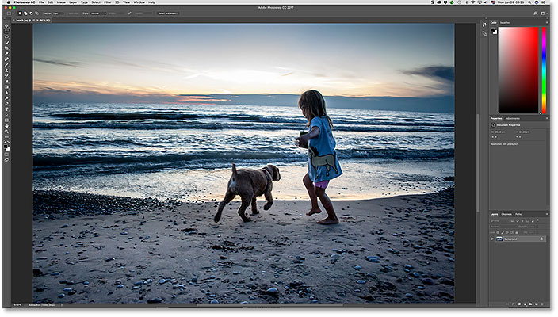
*The JPEG image opens in Photoshop, not in Camera Raw. Image © Steve Patterson.*

That's not what I wanted, so to close the image in Photoshop and return to Bridge, I'll go up to the **File** menu and choose **Close and Go to Bridge**:

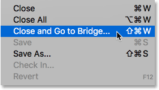
*Going to File > Close and Go to Bridge.*

Double-clicking on the JPEG file's thumbnail didn't work, but it's still easy to open JPEGs into Camera Raw from Bridge. All we need to do is click on the JPEG file's thumbnail to select it. Then, go up to the **File** menu (in Bridge) at the top of the screen and choose **Open in Camera Raw**. Notice that there's also a handy keyboard shortcut we can use, **Ctrl+R** (Win) / **Command+R** (Mac):

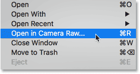
*Going to File > Open in Camera Raw.*

We can also **right-click** (Win) / **Control-click** (Mac) on the JPEG file's thumbnail in Bridge and choose the same **Open in Camera Raw** command from the menu:

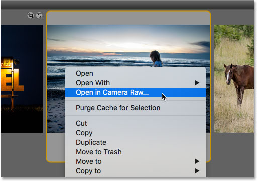
*Choosing "Open in Camera Raw" from the thumbnail's menu.*

Either way opens the JPEG file in Camera Raw:

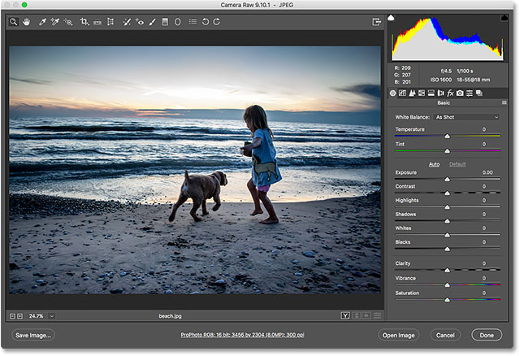
*The JPEG image now opens in Camera Raw.*

### Editing The JPEG Image In Camera Raw

While I'm in the Camera Raw dialog box, I'll make a simple edit to my image. I'll boost the color saturation by dragging the **Vibrance** slider to the right, to a value of around +40. I know we haven't covered anything about Camera Raw yet, but the reason I'm doing this will become clear in a moment:

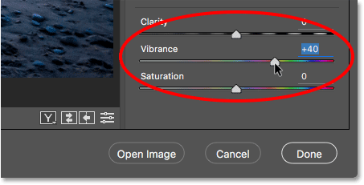
*Dragging the Vibrance slider in Camera Raw to increase color saturation.*

Here we see that the colors are now looking a bit more vibrant:

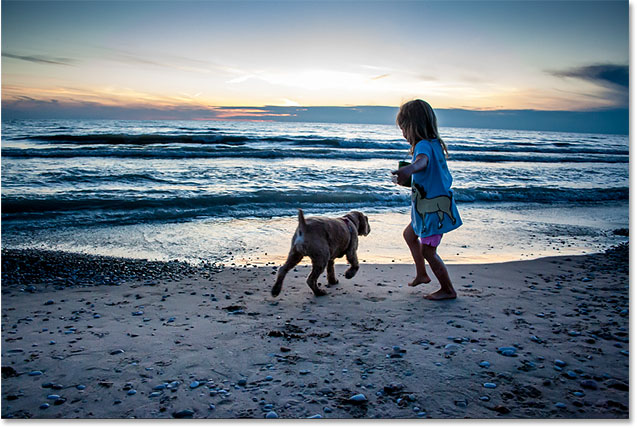
*The result after increasing the Vibrance setting in Camera Raw.*

### Closing The JPEG Image And Returning To Bridge

Now that I've made that one simple change, I'll close the Camera Raw dialog box and return to Bridge by clicking the **Done** button:

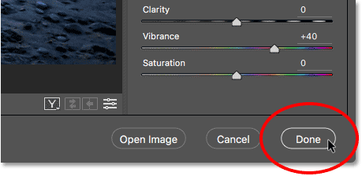
*Clicking Done to accept the edit and return to Bridge.*

### The Camera Raw Settings Icon

This returns me to Bridge. But notice that something is different. If we look in the upper right of the JPEG file's thumbnail, we see an icon that wasn't there before.

This icon tells me that I now have one or more Camera Raw settings applied to the image. In this case, it's the adjustment I made with the Vibrance slider:

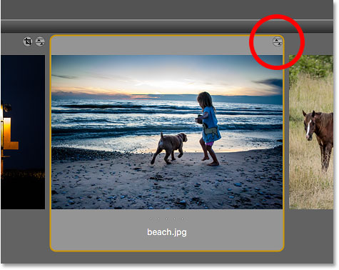
*A Camera Raw settings icon appears in the upper right of the JPEG thumbnail.*

### Opening JPEG Files With Camera Raw Settings Applied

Earlier, we saw that when we double-click on a JPEG file's thumbnail, Adobe Bridge opens the image in Photoshop, not in Camera Raw. But, whenever we already have Camera Raw settings applied to a JPEG file, Adobe Bridge will automatically re-open the image in Camera Raw just by double-clicking on it.

I'll double-click on the thumbnail, just as I did before:

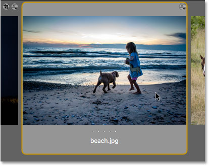
*Double-clicking the JPEG file thumbnail, this time with Camera Raw settings applied.*

And this time, because I had already made at least one adjustment to the image in Camera Raw, Bridge re-opens the image in Camera Raw for further editing:

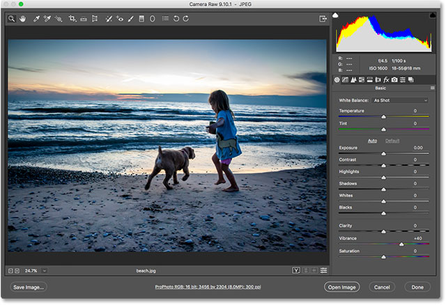
*Adobe Bridge automatically sends the image back to Camera Raw.*

To close the image and return to Bridge, I'll once again click the **Done** button:

*Clicking the Done button to return to Bridge.*

## How To Open TIFF Files Into Camera Raw

The same rules for opening JPEG files into Camera Raw from Bridge also apply to TIFF files. Camera Raw fully supports TIFF images. But by default, double-clicking on a TIFF file's thumbnail in Bridge will open the image in Photoshop, not in Camera Raw.

To open a TIFF file into Camera Raw, click on its thumbnail to select it. Here, I've selected my "horses.tif" image:

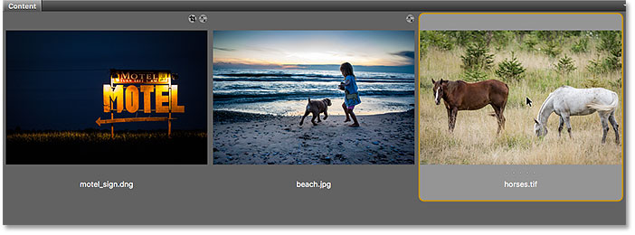
*Clicking on the TIFF file in the Content panel.*

Then, just as we did with the JPEG image, go up to the **File** menu and choose **Open in Camera Raw**. Or, **right-click** (Win) / **Control-click** (Mac) on the thumbnail itself and choose **Open in Camera Raw** from the menu.

Or, another way to open images into Camera Raw, and this applies to all three file types (raw, JPEG and TIFF) is by clicking the **Open in Camera Raw** icon at the top of the Bridge interface:

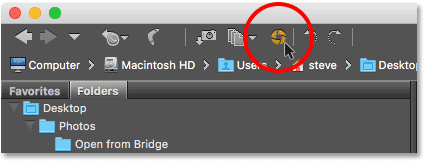
*Clicking the "Open in Camera Raw" icon.*

Any way you choose opens the TIFF file into Camera Raw:

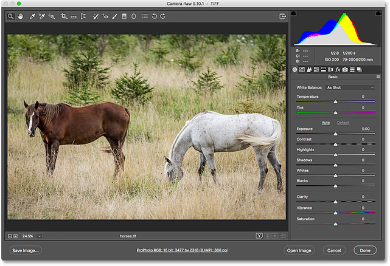
*Adobe Bridge opens the TIFF file in Camera Raw. Image © Steve Patterson.*

### Editing The TIFF Image In Camera Raw

Just as I did with my JPEG image, I'll make a quick edit to my TIFF file. This time, I'll use Camera Raw to convert the photo to black and white.

Along the right of the Camera Raw dialog box is the panel area. The **Basic** panel is the one that's open by default (which is where I made my Vibrance adjustment earlier), but there are other panels available as well. We can switch between panels by clicking on the **tabs** just above the current panel's name.

To convert my image to black and white, I'll open the **HSL / Grayscale** panel by clicking on its tab (fourth from the left). Then, I'll choose the **Convert to Grayscale** option by clicking inside the checkbox. Finally, I'll click the **Auto** option to let Camera Raw convert the image to black and white on its own:

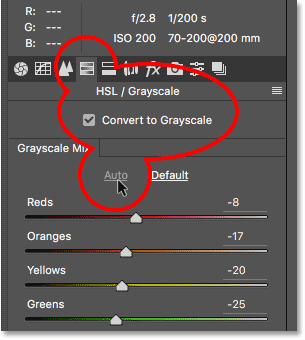
*Converting the image to black and white using the HSL / Grayscale panel.*

Here's what Camera Raw came up with. It's not the most impressive black and white conversion, but for our purposes here, it will do just fine:

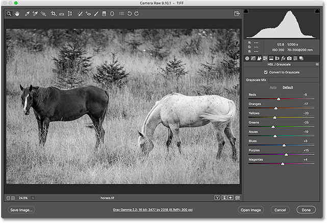
*The Auto black and white conversion in Camera Raw.*

### Closing The TIFF File And Returning To Bridge

To close the TIFF file in Camera Raw and return to Bridge, I'll click the **Done** button:

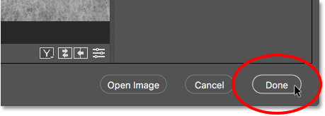
*Clicking "Done" to return to Adobe Bridge.*

### Opening TIFF Files With Camera Raw Settings Applied

Back in Bridge, we see that I now have that same icon that we saw with the JPEG file, this time in the upper right of the TIFF file's thumbnail. The icon is telling me that I have one or more Camera Raw settings applied to the image.

Notice also that Bridge has updated the thumbnail to reflect the changes I made in Camera Raw. In this case, the thumbnail has changed from color to black and white. Bridge also updated my JPEG file's thumbnail after I increased the Vibrance in Camera Raw, but because the change was subtle, it wasn't as easy to see:

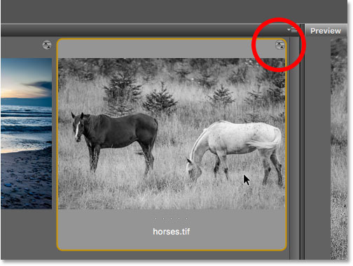
*The Camera Raw settings icon appears in the upper right of the TIFF thumbnail.*

Just as with JPEG files, TIFF files that already have one or more Camera Raw settings applied to them will automatically re-open in Camera Raw when we double-click on their thumbnail.

I'll double-click on my "horses.tif" thumbnail, and here we see that the image re-opens for me in Camera Raw, with my previous black and white conversion already applied:

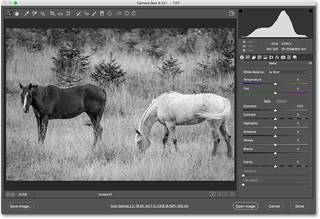
*The TIFF file re-opens in Camera Raw.*