# Open Image vs Place Image in Photoshop

> Source: [https://www.photoshopessentials.com/basics/open-image-vs-place-image/](https://www.photoshopessentials.com/basics/open-image-vs-place-image/)
> Downloaded and converted to Markdown.

Learn the difference between the Open command and the Place Embedded command in Photoshop and which is better for blending two images together! Watch the video or follow along with the written tutorial below it.

In this tutorial, I show you the difference between *opening* an image and *placing* an image in Photoshop. As we'll see, both the Open command and the Place command let you select an image and open it. But where that image ends up once it’s in Photoshop depends on which command you use. One will open the image in its own separate document. The other lets you open the image as a layer in an *existing* document, which makes it easy to blend two images together! Let's see how they work.

Let's get started!

## Which version of Photoshop do I need?

I'm using Photoshop 2021 but you can follow along with any recent version. [Get the latest Photoshop version here](https://adobe.prf.hn/click/camref:1100lrdjJ/destination:https%3A%2F%2Fwww.adobe.com%2Fproducts%2Fphotoshop.html).

## How to open an image in Photoshop

For this lesson, I'll open two images into Photoshop, first using the Open command and then using a separate command called Place Embedded. I currently have no images or documents open.

### The Open command

Let’s start with the Open command, which you can get to by going up to the **File** menu in the Menu Bar and choosing **Open**:

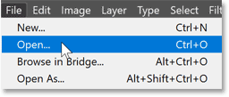
*Photoshop's Open command.*

### The Place Embedded command

But before I select it, if we look further down the list, there’s another command under the File menu called **Place Embedded**. And this is what we use to *place* an image into Photoshop:

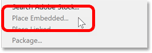
*Photoshop's Place Embedded command.*

At the moment, the Place Embedded command is grayed out, which means we can’t select it. And the reason is that I currently have no other documents open. Before we can place an image, we need to have at least one document already open. You’ll see why in a moment.

### Opening the first image

So since we can’t select Place Embedded, I’ll choose **Open**:

*Going to File > Open.*

Then I’ll navigate to the folder on my computer that holds my images. In this case, I have two jpeg images. The first is a portrait and the second is a texture. I’ll click on the portrait image to select it, and then I’ll click **Open**:

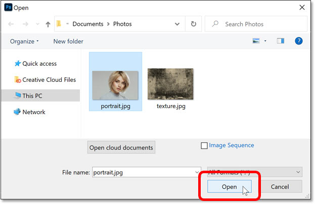
*Selecting and opening the first image.*

And [the image](https://adobe.prf.hn/click/camref:1100lrdjJ/destination:https%3A%2F%2Fstock.adobe.com%2Fimages%2Fbeauty-portrait-of-female-face-with-natural-skin%2F205506435) opens in Photoshop as expected:

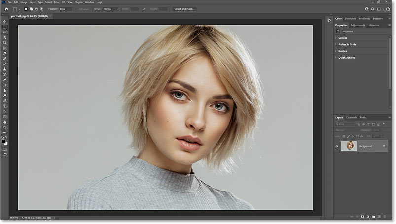
*The first image opens in Photoshop.*

Now what has actually happened is that Photoshop created a new document to hold the image, and it placed the image inside it. The name of the document appears in the **tab** just below the Options Bar:

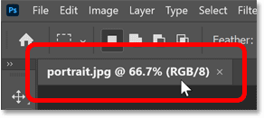
*The document tab.*

[Related: Learn ALL the ways to get your images into Photoshop](/basics/opening-images-photoshop/)

### Opening the second image

I need my second image as well, the texture image. So I’ll open it by going back to the **File** menu:

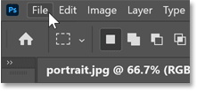
*Opening the File menu in the Menu Bar.*

And this time, since I already have one document open, notice that the **Place Embedded** command is no longer grayed out, which means I *could* select it:

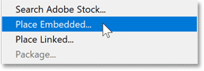
*The Place Embedded command is now available.*

But to see the difference between Open and Place Embedded, I’ll ignore it for now and I’ll once again choose the **Open** command:

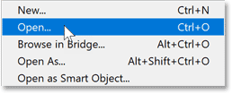
*Going again to File > Open.*

Then I’ll select my texture image and I’ll click **Open**:

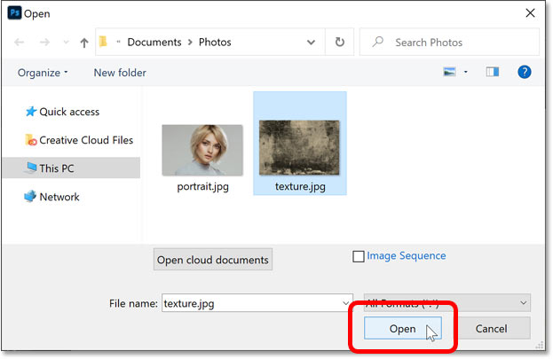
*Selecting and opening the second image.*

And the [second image](https://clk.tradedoubler.com/click?p(264303)a(2982769)g(22913540)url(https://stock.adobe.com/images/grunge-59/3393246)) opens in Photoshop:

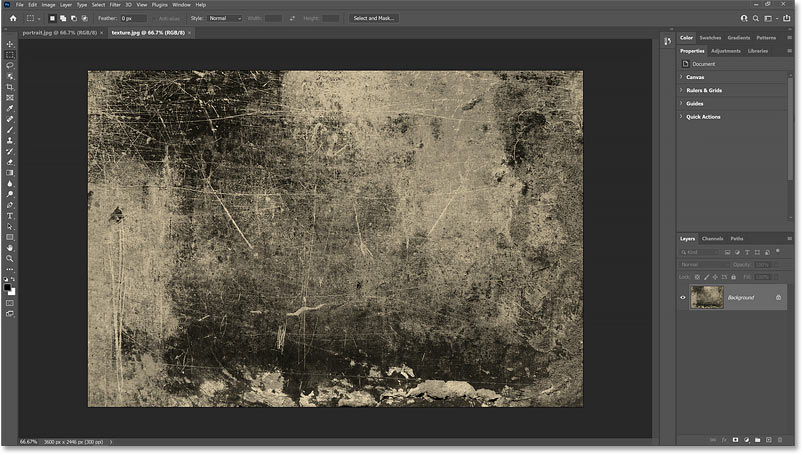
*The second image opens in Photoshop.*

### Two open images, two separate Photoshop documents

But notice that the second image opened in a separate document, and I now have two documents open, one for each image. We can switch between the documents by clicking the **tabs** at the top, but the images are completely separate from each other:

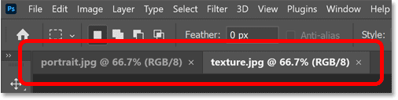
*Click the tabs to switch between open documents.*

Each document has its own [Layers panel](/basics/layers/layers-panel/) showing the image on the Background layer. But because the images are in separate documents, there’s no way for them to interact:

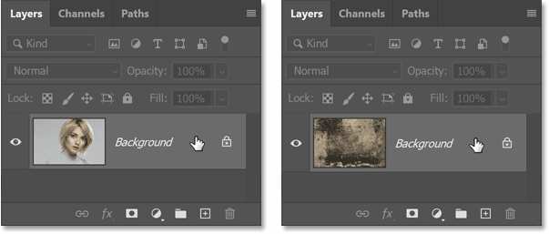
*The Layers panel for the first document (left) and the second document (right).*

[Related: Learn how to move images between Photoshop documents!](/basics/5-ways-move-images-photoshop-documents/)

## How to place an image in Photoshop

Having images open in separate documents is fine when we're working on each image independently and we don’t need them to interact. So for those times, the Open command works great.

But what if we want to blend or combine the two images together? In that case, having them in separate documents doesn't work. Instead, we need a way to open both images into the *same* document. And that is where *placing* an image comes in. And to place an image in Photoshop, we use the **Place Embedded** command.

### Closing the second image

I’ll close my texture image for now by clicking the small **x** in its tab:

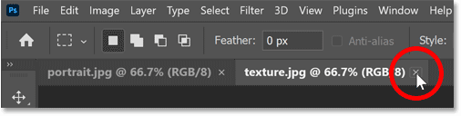
*Closing the second document.*

### Leaving the first image open

But remember that to place an image into Photoshop, we need to have at least one document already open. So I’ll leave my portrait image open:

*Leaving the first document open.*

### Placing the second image

Then to place the second image into this document, I’ll go up to the **File** menu:

*Opening the File menu.*

But instead of choosing the Open command, I’ll choose **Place Embedded**:

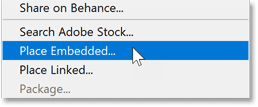
*Choosing the Place Embedded command.*

I’ll select the texture image and then I’ll click **Place**:

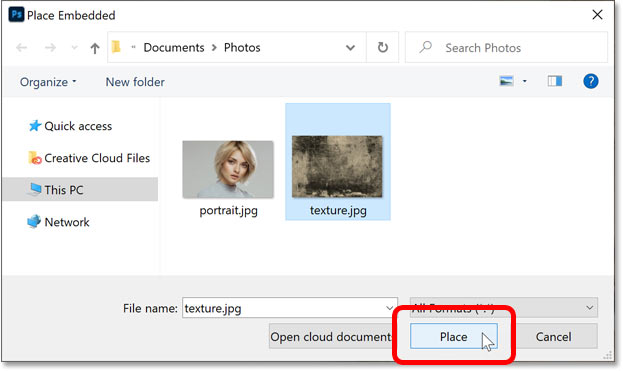
*Selecting and placing the second image.*

### Two open images, one Photoshop document

And this time, instead of opening in a separate document, it opens in the same document as the first image:

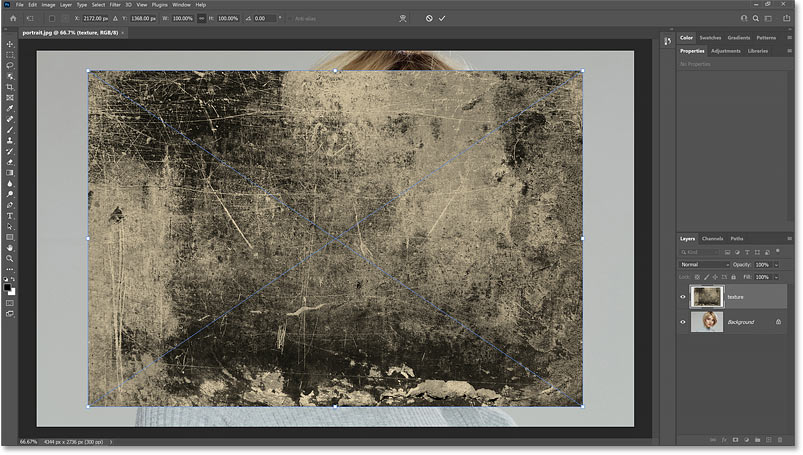
*The second image opens in the same document as the first image.*

By default, Photoshop opens the Free Transform command so we can resize the image before placing it. Since my texture is a bit smaller than the portrait, I’ll drag the **handles** to make it larger:

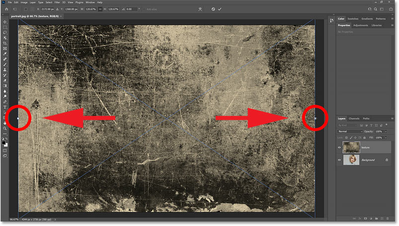
*Scaling the image with Free Transform before placing it.*

Then to accept it and close Free Transform, I’ll click the **check mark** in the Options Bar:

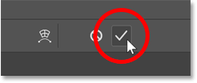
*Clicking the check mark.*

### Placed images open as layers

In the Layers panel, notice that the second image opened on its own layer above the first image.

If I turn the texture image off by clicking its **visibility icon**:

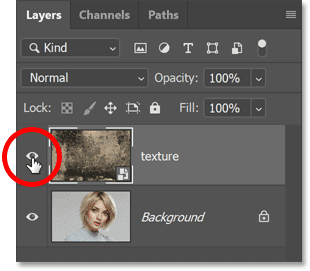
*Turning off the texture image layer.*

The portrait image reappears:

*The first image is once again visible.*

And if I turn the texture layer back on:

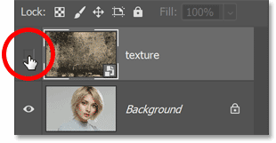
*Turning on the texture image layer.*

The texture reappears. So by using the Place Embedded command instead of the Open command, I was able to open both images into the same document:

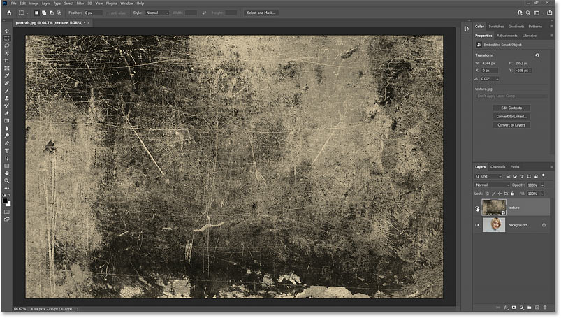
*The second image is visible.*

## Blending the two images together

And because both images are in the same document, I can blend them together. The easiest way to do that is with Photoshop’s blend modes.

### Changing the layer blend mode

With the texture layer selected, I’ll change the blend mode from Normal to **Soft Light**:

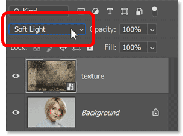
*Changing the texture's blend mode to Soft Light.*

This blends the texture with the image below it:

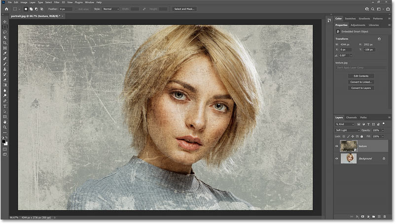
*The result with the texture's blend mode set to Soft Light.*

[Related: Learn 3 easy ways to blend two images together!](/basics/three-ways-to-blend-two-images-together-photoshop/)

### Lowering the layer opacity

Then to fade the texture, I’ll lower the **opacity** of the texture layer from 100 percent down to **60 percent**:

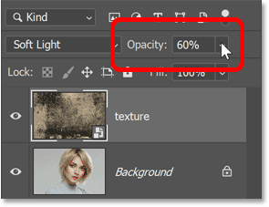
*Fading the texture by lowering the Opacity value.*

And here's the final result with the texture looking more subtle:

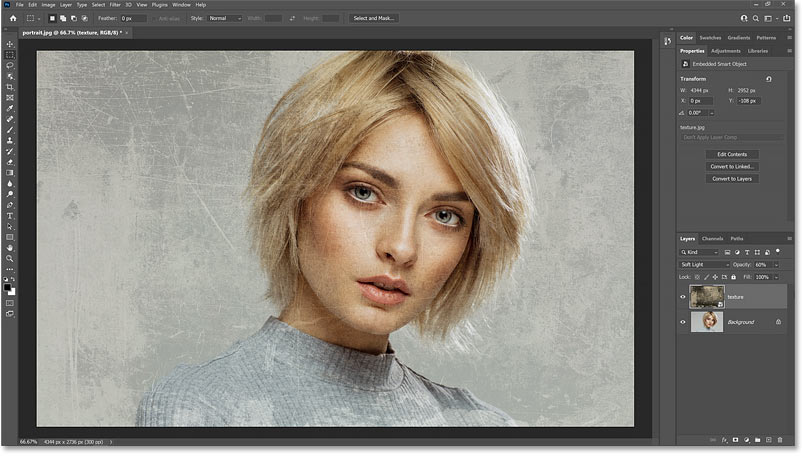
*The blending effect after lowering the texture's opacity.*

And there we have it! That’s the difference between opening an image and placing an image in Photoshop. Use the Open command when all you have is a single image or you want to open multiple images in separate documents. And use Place Embedded to place an image into an existing document.

Now that you know how to place a single image into an existing document, check out my other tutorial where I show you [how to load multiple images as layers](/basics/open-multiple-images-as-layers-in-photoshop/) into a document. Visit my [Photoshop Basics](/basics/) section for more topics. And don't forget, all of my tutorials are now available to [download as PDFs](/print-ready-pdfs/)!