# How To Open Images Into Photoshop From Adobe Bridge

> Source: [https://www.photoshopessentials.com/basics/open-images-photoshop-adobe-bridge/](https://www.photoshopessentials.com/basics/open-images-photoshop-adobe-bridge/)
> Downloaded and converted to Markdown.

Learn how to open images into Photoshop using Adobe Bridge, the free companion app included with Photoshop and with all Creative Cloud subscriptions. We learn how to install Bridge CC using the Creative Cloud app, along with everything you need to know to start using Bridge right away!

In the previous tutorial, we learned [how to open images from within Photoshop itself](/basics/open-images-photoshop-cc/ "How to open images in Photoshop") using the new Start workspace in Photoshop CC. But while the Start workspace makes it easy to choose images from a list of recently-opened files, it isn't very helpful when it comes to finding and opening *new* images. That's because the Start workspace still forces us to use our computer's operating system to navigate through our files.

We did learn [how to set Photoshop as our default image editor](/basics/how-to-make-photoshop-your-default-image-editor/ "How to make Photoshop your default image editor"). But while that's great for *opening* images, it still doesn't help us find the images we need.

That's where Adobe Bridge comes in. Many people don't realize that Photoshop includes a free companion program known as Adobe Bridge. Bridge is essentially a file browser, similar to your operating system's file browser, but with a *lot* more features. It may not share the same image organizing and editing capabilities as Adobe Lightroom (in fact, Bridge has no image editing features at all). But Bridge is still an incredibly powerful and useful program that makes finding our images and opening them into Photoshop both easy and intuitive.

In this tutorial, we won't cover every single feature of Adobe Bridge. Instead, we'll look at the essential features you need to know about so you can say goodbye to your operating system's file browser and start opening your images from Bridge!

This lesson is part of my [Getting Images into Photoshop](/basics/opening-images-photoshop/ "How to get images into Photoshop") Complete Guide.

Let's get started!

## How To Install Adobe Bridge CC

In Photoshop CS6 and earlier, Adobe Bridge installed automatically with Photoshop. But now that Adobe has switched everything over to the Creative Cloud, that's no longer the case. Bridge is still included with every Creative Cloud subscription, but even if you've installed Photoshop CC, Bridge CC needs to be installed separately.

We install Bridge CC using the **Creative Cloud app**. To open the Creative Cloud app from within Photoshop, go up to the **Help** menu in the Menu Bar along the top of the screen and choose **Updates**:

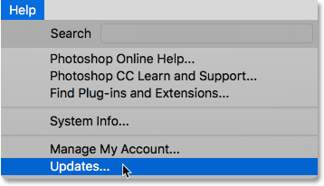
*Going to Help > Updates.*

When the Creative Cloud app opens, switch to the **Apps** section at the top:

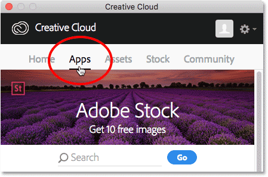
*Choosing "Apps" in the Creative Cloud app.*

Scroll through the list of apps that you've installed on your computer. If you see Bridge CC in the list (and it has an **Open** button beside it), then Bridge CC is already installed and you're good to go:

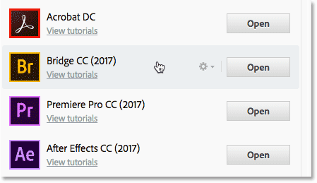
*The Creative Cloud app showing Bridge CC already installed.*

If you don't see Bridge CC in the list of installed apps, scroll down to the list of additional apps. When you find Bridge CC, click the **Install** button. Then just sit back and relax for a few minutes while it installs. That's all there is to it:

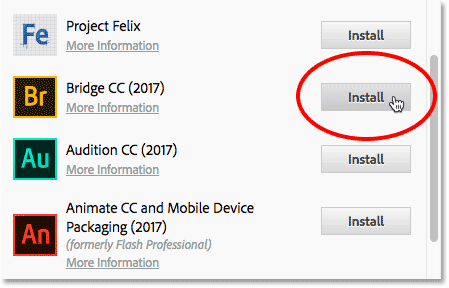
*If Bridge CC is not yet installed, click the Install button.*

## How To Open Adobe Bridge

Now that we know that Bridge is installed, to open Bridge from within Photoshop, go up to the **File** menu and choose **Browse in Bridge**:

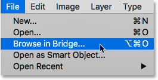
*In Photoshop, go to File > Browse in Bridge.*

This opens Bridge, which is made up of a collection of **panels**. We have panels for navigating to our images, panels for viewing our images, panels for viewing additional information about our images, and more:

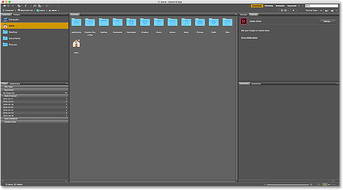
*The Adobe Bridge CC interface.*

## Finding Our Images Using Bridge

To navigate to our images in Bridge, we use the **Folders** panel. You'll find it in the upper left, nested in with the Favorites panel. By default, the Favorites panel is the one that's open. To switch to the Folder's panel, click on the Folders **tab** at the top:

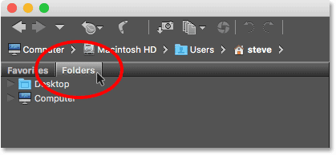
*Opening the Folders panel by clicking its tab.*

The Folders panel displays the folders and directories on your computer in a top-down view, starting with main directories like our Desktop and our computer's hard drive.

A **triangle** to the left of a folder or directory's name means there are sub-folders inside of it. Click on the triangle to twirl the folder open and view its sub-folders. Continue making your way down through your folders until you get to the one that holds your images.

In my case, I know that my images are in a folder named "Open from Bridge" which is inside a folder named "Photos" on my Desktop. To get to my "Open from Bridge" folder, I'll start by clicking the triangle next to my Desktop to twirl the Desktop open. Then, I'll click on the triangle next to my "Photos" folder to twirl *it* open, where I find my "Open from Bridge" folder sitting inside it:

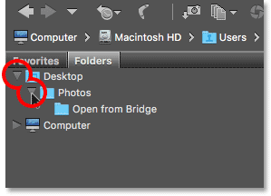
*Clicking the triangles to navigate down through my folders.*

## Viewing Your Images In Bridge

To view the images inside a folder, click on the folder's name in the Folders panel. In my case, I'll click on my "Open from Bridge" folder:

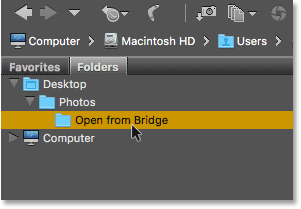
*Click on a folder to select it.*

The contents of the folder appear as thumbnails in the **Content** panel in the middle of the Bridge interface. Here we see that I have five images in the folder, each displayed as a thumbnail:

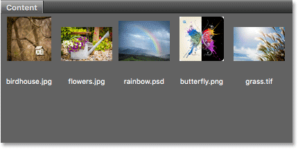
*The Content panel displays thumbnails of your images.*

### Changing The Thumbnail Size

By default, the thumbnails are fairly small. We can change their size using the **slider** along the bottom right of the Bridge interface. Drag the slider to the right to make the thumbnails larger, or to the left to make them smaller:

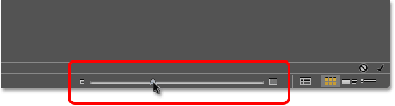
*Use the slider to adjust the size of the thumbnails in the Content panel.*

Here we see that after dragging the slider to the right, my thumbnails are now much bigger:

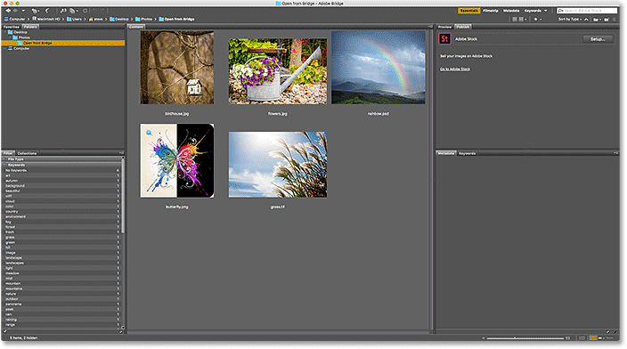
*The Content panel now displaying larger thumbnails.*

## Selecting An Image

To select an image, simply click on its thumbnail in the Content panel. Here I'm clicking on my "flowers.jpg" image, second from the left, top row:

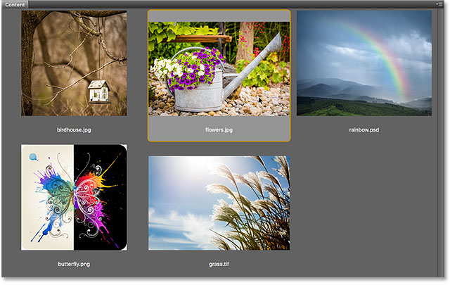
*Clicking on an image to select it.*

A preview of the selected image appears in the **Preview** panel in the upper right of Bridge. Note that the Preview panel is nested in with the Publish panel. You may need to click the Preview panel's **tab** at the top to open it:

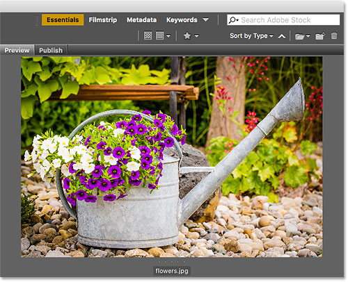
*A preview of the selected image appears in the Preview panel.*

Along with the preview in the Preview panel, you'll find lots of additional information about the selected image, including the exposure settings, the pixel dimensions and file size, the type of camera and lens that were used, and lots more, in the **Metadata** panel directly below the Preview panel. Use the scroll bar along the right to scroll through all of the information:

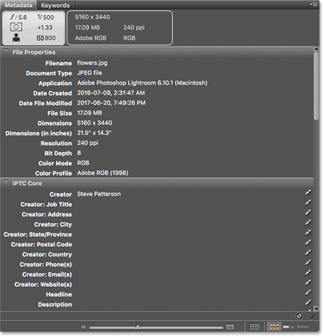
*View everything you'd want to know about the image in the Metadata panel.*

## Viewing A Fullscreen Preview

Along with the thumbnails in the Content panel and the preview in the Preview panel, we can also view a **fullscreen preview** of our selected image. Simply press the **spacebar** on your keyboard. This will hide the Bridge interface and display your image fullscreen. To exit fullscreen mode, press the spacebar once again:

*Press the spacebar to toggle the fullscreen preview on and off.*

## How To Open An Image Into Photoshop

Finally, to open an image from Bridge into Photoshop, **double-click** on its thumbnail in the Content panel. I'll double-click on my "flowers.jpg" image:

*Double-click on a thumbnail to open the image in Photoshop.*

And here we see my image now open in Photoshop, ready for editing:

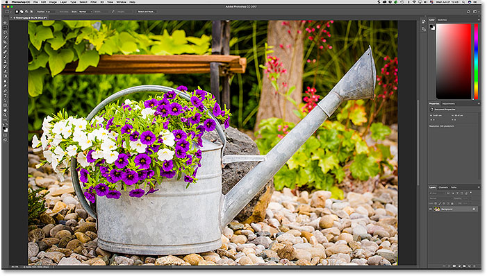
*The selected image opens in Photoshop.*

## Closing The Image And Returning To Bridge

To close the image in Photoshop and return to Bridge, go up to the **File** menu and choose **Close**:

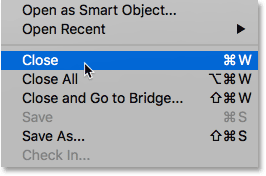
*In Photoshop, go to File > Close.*

Then, to return to Bridge, go back up to the **File** menu and choose **Browse in Bridge**:

*Going to File > Browse in Bridge.*

Or, to close your image and return to Bridge both in one shot, go up to the **File** menu and choose **Close and Go to Bridge**:

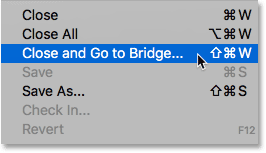
*Going to File > Close and Go to Bridge.*

This returns you to Bridge where you can choose the next image you want to open into Photoshop:

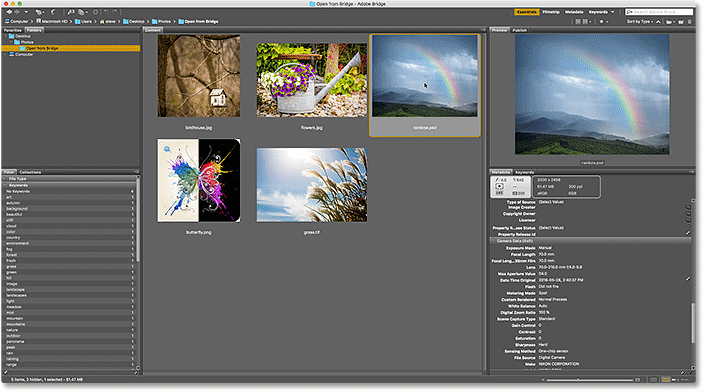
*Selecting a different image in Bridge.*