# How to Open Images in Photoshop

> Source: [https://www.photoshopessentials.com/basics/open-images-photoshop-cc/](https://www.photoshopessentials.com/basics/open-images-photoshop-cc/)
> Downloaded and converted to Markdown.

Learn all the ways to open images in Photoshop, including how to use the new Home Screen and the difference between opening JPEG and raw files!

In the first lesson in this series on [Getting Images into Photoshop](/basics/opening-images-photoshop/ "Getting Images into Photoshop Complete Guide"), we learned [how to set Photoshop as our default image editor](/basics/how-to-make-photoshop-your-default-image-editor/ "How to make Photoshop your default image editor") so we can open images directly from File Explorer in Windows or Finder on a Mac. This time, we'll learn how to open images from within Photoshop itself.

Opening images may sound like a no-brainer. But when you're dealing with a program as massive as Photoshop, even a simple task like opening an image can be less obvious than you'd expect. And in the most recent versions of Photoshop, Adobe has added a new Home Screen that gives us even more ways to open images. So even if you've been using Photoshop for years, there's always something new to learn.

### Two ways to work in Photoshop

There are actually two different ways to start working in Photoshop. One is to [create a new blank Photoshop document](/basics/create-new-documents-photoshop-cc/ "Learn more") and then import images, graphics and other assets into it. And the other is to open an existing image. In most cases, especially if you're a photographer, you'll want to start by opening an image, and that's what we'll be learning how to do here. We'll also look at the important difference between opening a standard JPEG file and opening a photo that was captured in the raw format. 

To get the most from this tutorial, you'll want to be using the [latest version of Photoshop](https://prf.hn/l/dlXjD2w), and you'll want to make sure that your copy is [up to date](/basics/update-photoshop-cc/).

Let's get started!

## How to open an image from Photoshop's Home Screen

First, let's look at how to open images using a recent addition to Photoshop known as the **Home Screen**. When we launch Photoshop CC without opening an image, or if we close our document and have no other documents open, then Photoshop displays the Home Screen. 

### Opening a recent file

If you've worked on previous images or documents, you'll see them listed on the Home Screen as thumbnails. To reopen a recent file into Photoshop so you can continue working on it, just click on its thumbnail:

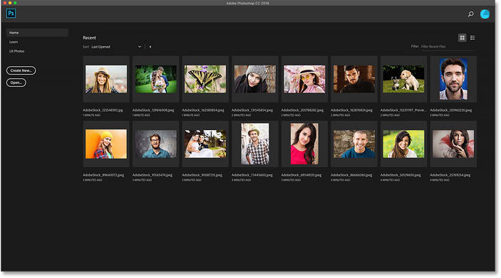
*The Home Screen lets you quickly view and reopen recent files.*

### Opening a new image from the Home Screen

But if this is the first time you've launched Photoshop, or you've cleared your Recent Files history, you won't see any thumbnails. Instead, the Home Screen will appear in its initial state with various boxes you can click on to learn more about Photoshop. The content on the Home Screen is dynamic and changes from time to time, so yours may look different from what we're seeing here:

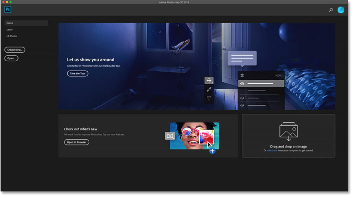
*The Home Screen without any recent file thumbnails.*

To open a new image from the Home Screen, click the **Open** button in the column along the left:

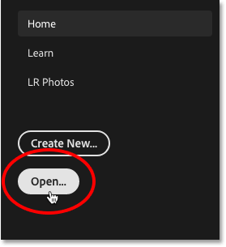
*Clicking the Open button on the Home Screen.*

This opens the File Explorer on a Windows PC or the Finder on a Mac (which is what I'm using here). Navigate to the folder that holds your images, and then double-click on an image to open it. I'll open a JPEG image for now, but later on, we'll learn how to open raw files as well:

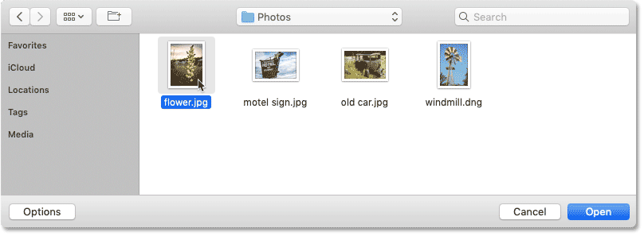
*Selecting an image by double-clicking on it.*

The image will open in Photoshop, ready for editing:

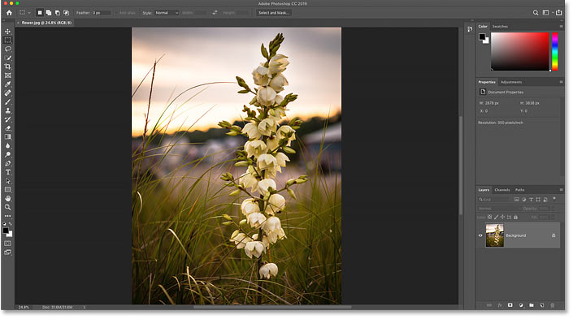
*The first image opens in Photoshop.*

### Closing an image

To close the image, go up to the **File** menu in the Menu Bar along the top of the screen and choose **Close**:

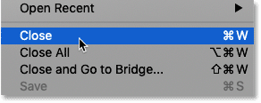
*Going to File > Close.*

### Reopening the image from the Home Screen

Since no other images were open, Photoshop returns me to the Home Screen. And I now see a thumbnail of the image that was previously open. To reopen it, I can just click on its thumbnail:

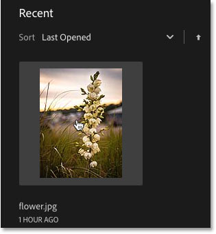
*Clicking the thumbnail on the Home Screen.*

And the same image opens again:

*The first image reopens.*

## How to open a second image from the Home Screen

What if you've already opened an image, as I have here, and now you want to open a second image? We've already seen that we can open images from Photoshop's Home Screen, and we can switch back to the Home Screen at any time by clicking the **Home button** in the upper left of Photoshop's interface:

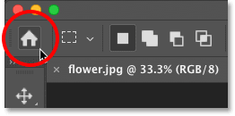
*Click the Home button to return to the Home Screen.*

Then back on the Home Screen, click again on the **Open** button:

*Clicking the Open button to open another image.*

Navigate to your images folder and double-click on your second image:

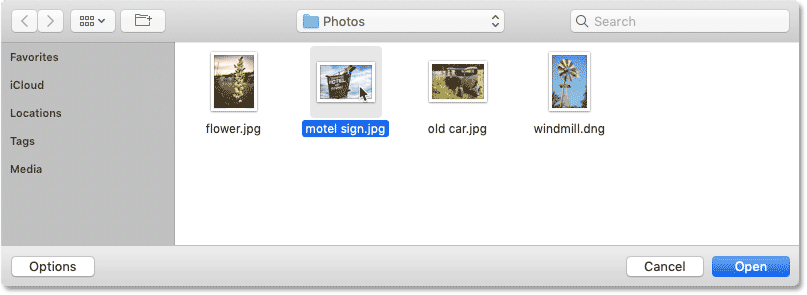
*Selecting a second image.*

And the image opens in Photoshop:

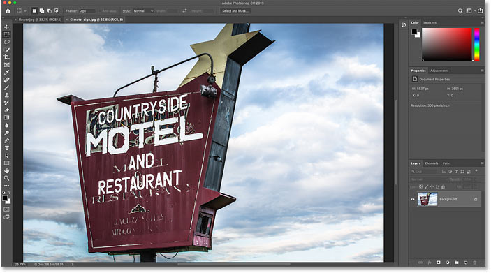
*The second image opens.*

### How to switch between multiple open images

To switch between open images, click the **tabs** along the top of the documents:

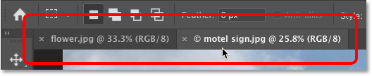
*Use the tabs to switch between images.*

## What to do if Photoshop's Home button is missing

If you're using Photoshop CC 2019 or later and the Home button in the upper left corner is missing, check Photoshop's Preferences to make sure that the Home Screen has not been disabled.

On a Windows PC, go up to the **Edit** menu. On a Mac, go up to the **Photoshop CC** menu. From there, choose **Preferences** and then **General**:

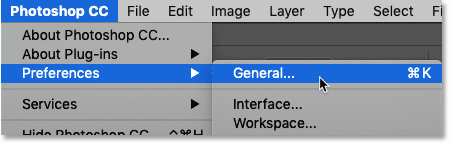
*Going to Edit (Win) / Photoshop CC (Mac) > Preferences > General.*

In the Preferences dialog box, look for the option that says **Disable the Home Screen** and make sure it is not selected. If it is, uncheck it. Then click OK to close the dialog box. Note that you will need to quit and restart Photoshop for the change to take effect:

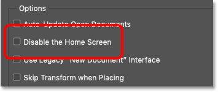
*Make sure "Disable the Home Screen" is not checked.*

## How to open images from Photoshop's File Menu

While the Home Screen is a great new feature and I use it all the time, the more traditional way to open an image in Photoshop is by going up to the **File** menu in the Menu Bar and choosing **Open**. Or you can press the keyboard shortcut, **Ctrl+O** (Win) / **Command+O** (Mac). That's "O" for "Open":

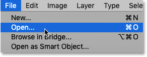
*Going to File > Open.*

This again opens the File Explorer on a Windows PC or the Finder on a Mac. I'll double-click on a third image to select it:

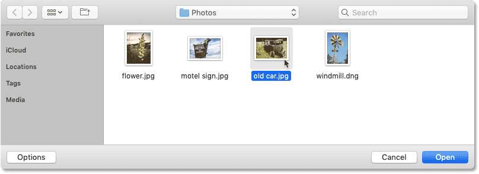
*Selecting a third image to open.*

And just like the previous two images, the third image opens in Photoshop:

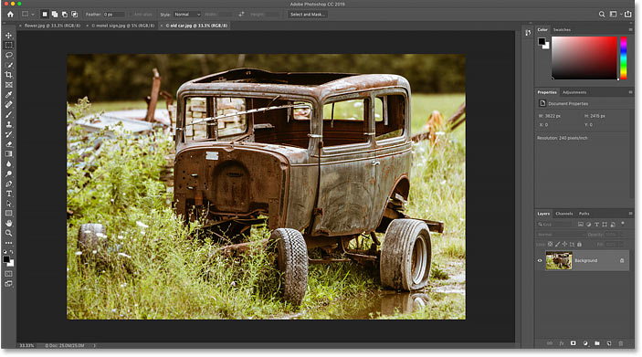
*A third image opens.*

And we can see in the **tabs** along the top of the documents that I now have three images open. Photoshop only lets us work on one image at a time but we can have as many images open as we need. To switch between images, just click on the tabs:

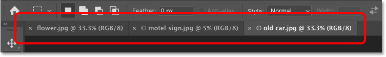
*Switching between open images by clicking the tabs.*

## How to close images in Photoshop

To close an image without closing any other photos you've opened, first select the image you want to close by clicking its tab. Then, go up to the **File** menu and choose **Close**:

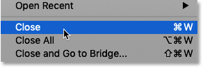
*Going to File > Close.*

Or a faster way is by clicking the small "**x**" icon in the tab itself:

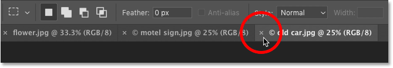
*Click the "x" to close a single image without closing any others.*

And to close all open images at once, rather than closing individual tabs, go up to the **File** menu and choose **Close All**. This will close the images and return you to Photoshop's Home Screen:

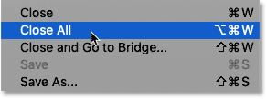
*Going to File > Close All.*

## How to open raw files in Photoshop

So far, all of the images I've opened in Photoshop have been [JPEG files](/essentials/jpeg-compression/ "Learn more"). We know they were JPEG files because each one had a ".jpg" file extension at the end of its name. But what about *raw files*? That is, images that were captured using your camera's raw file format?

To open a raw file from the Home Screen, click the **Open** button:

*Clicking the Open button to open a raw file.*

Then select the raw file you want to open. Each camera manufacturer has its own version of the raw format, with its own 3-letter extension. For example, Canon raw files typically have a ".cr2" extension, Nikon uses ".nef" and Fuji uses ".raf".

In my case, my raw file has a ".dng" extension which stands for *Digital Negative*. This is Adobe's own version of the raw format:

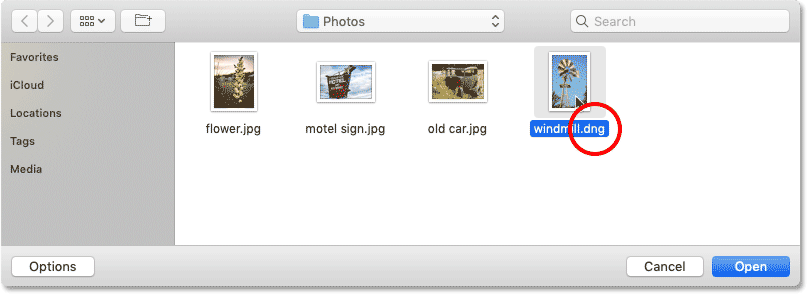
*Selecting a raw file to open in Photoshop.*

### Photoshop's Camera Raw plugin

Rather than opening directly into Photoshop like JPEG files, raw files first open in a Photoshop plugin known as **Camera Raw**. Camera Raw is often thought of as a *digital darkroom* because it's used to process the raw image (correcting exposure and color, adding some initial sharpening, and much more) before sending the image off to Photoshop.

If you're familiar with Adobe Lightroom, you'll be right at home in Camera Raw since Lightroom and Camera Raw both share the same image processing engine and the same editing options:

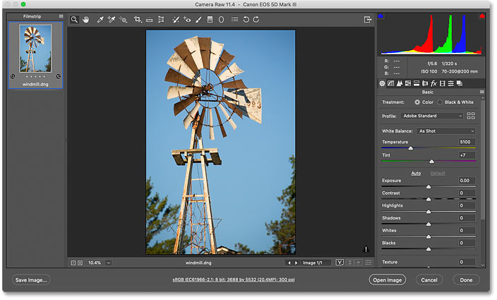
*Photos captured as raw files open in Camera Raw.*

[Related: Raw vs JPEG for photo editing](/photo-editing/raw-vs-jpeg-for-photo-editing/ "Learn more")

### Closing Camera Raw without opening the image in Photoshop

In fact, Camera Raw offers so many image adjustments that in some cases, you'll be able to complete all your work directly in Camera Raw and have no need to send the image off to Photoshop. Editing images in Camera Raw goes way beyond the scope of this tutorial, so I'll cover Camera Raw in detail in other lessons.

For now, if you're happy with the image and just want to close Camera Raw without moving over to Photoshop, click the **Done** button. All of your Camera Raw settings will be saved along with the raw file and will reappear the next time you open it:

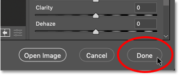
*Clicking Done to accept and close Camera Raw.*

### How to move the image from Camera Raw to Photoshop

But if the image needs further editing in Photoshop, you can close Camera Raw and move the image over to Photoshop by clicking **Open Image**:

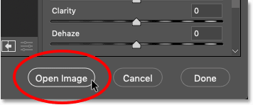
*Clicking Open Image to open it in Photoshop.*

The image opens in Photoshop with all of the edits you made previously in Camera Raw:

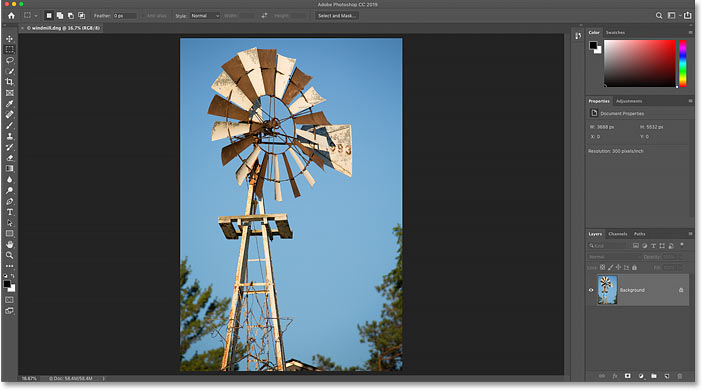
*The image moves from Camera Raw into Photoshop.*

### Closing the image

To [close the image](/basics/close-images-photoshop/ "Learn more") when you're done, go up to the **File** menu and choose **Close**:

*Going to File > Close.*

And this again returns us to Photoshop's Home Screen where we see all of our recent files as thumbnails, ready to be reopened when needed:

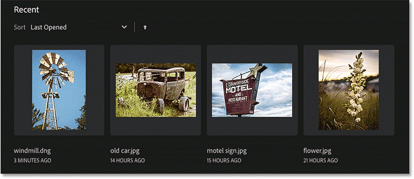
*Back to the Home Screen.*