# Open Multiple Images As Layers In Photoshop

> Source: [https://www.photoshopessentials.com/basics/open-multiple-images-as-layers-in-photoshop/](https://www.photoshopessentials.com/basics/open-multiple-images-as-layers-in-photoshop/)
> Downloaded and converted to Markdown.

Learn two ways to import images as layers into a Photoshop document, one that lets you open multiple images as layers and one that's best for importing a single image as a layer.

Whether we are compositing images, creating a collage or designing a layout in Photoshop, we often need to import multiple images into the same document, with each image added on its own layer. But that's not what happens when we open multiple files. Instead, Photoshop opens the images in separate documents, forcing us to move them [from one document to another](/basics/5-ways-move-images-photoshop-documents/).

So in this tutorial, I show you how to open images as layers using two different methods.

- How to use **Load Files into Stack** to import multiple images as layers into Photoshop.
- How to use **Place Embedded** to import a single image as a layer.

We'll also look at a few options in Photoshop's Preferences that can help you import images even faster. And as a bonus, I'll finish off the tutorial by blending my images into a simple double exposure effect.

## Which Photoshop version do I need?

I'm using [Photoshop 2025](https://adobe.prf.hn/click/camref:1100lrdjJ/destination:https%3A%2F%2Fwww.adobe.com%2Fproducts%2Fphotoshop.html) but any recent version will work.

Let's get started!

## How to open multiple images as layers in Photoshop

Here's how to import multiple images as layers into a Photoshop document using the **Load Files into Stack** command, which not only loads your images but even creates the Photoshop document for you.

### Step 1: Open the Load Files into Stack command

In Photoshop, go up to the **File** menu, choose **Scripts** and then **Load Files into Stack**.

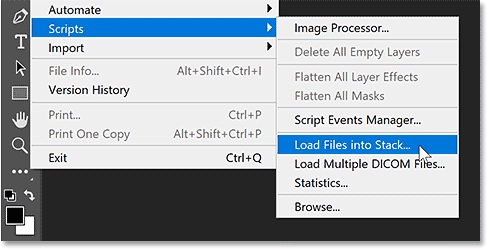
*Going to File > Scripts > Load Files into Stack.*

### Step 2: Select your images

In the Load Layers dialog box, set **Use** to either **Files** or **Folder**.

- Files lets you select individual images within a folder.
- Folder will load every image in the folder you select.

I'll choose Files. Then click **Browse**.

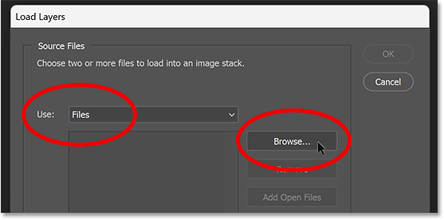
*The Load Layers options.*

Select the files you want to import. I'll select all three images in the folder.

Notice the names of my images ("portrait.jpg", "sunset.jpg" and "texture.jpg"). Photoshop will use the file names as the layer names so it's a good idea to rename your files first.

Then click **Open**.

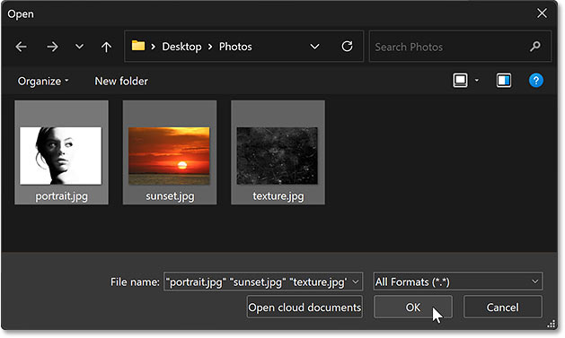
*Selecting the images to load as layers in Photoshop.*

Back in the Load Layers dialog box, the selected files are listed.

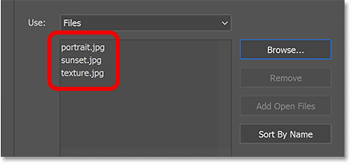
*The names of the images that will be imported into Photoshop.*

If you selected an image by mistake, click on its name in the list, then click the **Remove** button.

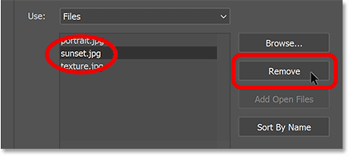
*Remove any images you don't need before importing.*

### Step 3: Import the images

Leave the two options at the bottom of the dialog box ("Attempt to Automatically Align Source Images" and "Create Smart Object after Loading Layers") unchecked.

Then click OK to load your images into Photoshop.

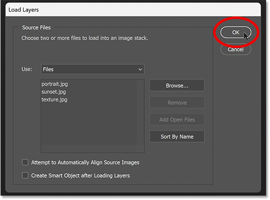
*Clicking OK to load the files.*

Photoshop creates a new document and imports the images into it. Each image is added on its own layer.

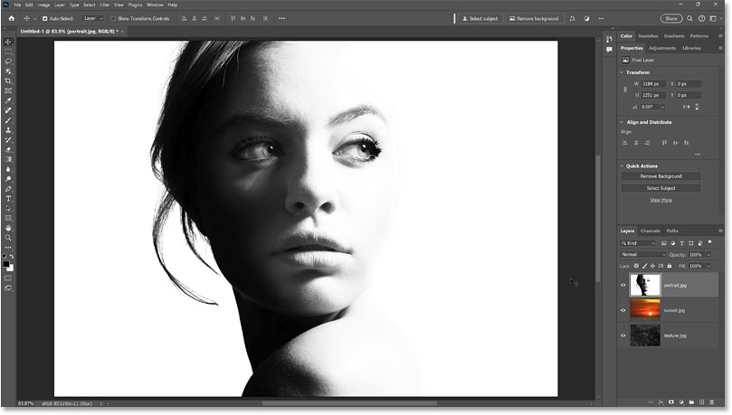
*The images are opened as layers in a new Photoshop document.*

The [Layers panel](/basics/layers/layers-panel/) shows the images on separate layers, with the file names as the layer names.

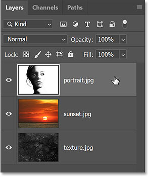
*Photoshop's Layers panel.*

You can toggle the layers on and off by clicking the **visibility icons.**

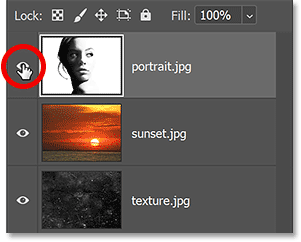
*Use the visibility icons to show or hide layers.*

## How to import a single image as a layer in Photoshop

So that's how to open multiple images as layers using the Load Files into Stack command, which creates a new Photoshop document in the process.

Here's how to import a single image as a layer into an existing Photoshop document using the **Place Embedded** command.

In the Layers panel, I'll delete my "portrait" layer (by dragging it onto the trash bin) so I can import it again.

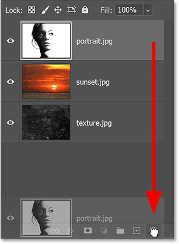
*Deleting one of the layers.*

### Step 1: Choose the Place Embedded command

To import a single image to your document, go up to the **File** menu and choose **Place Embedded**.

There's also a similar command called **Place Linked** which will simply link to the file on your computer. But to load the image directly into your document, choose Place Embedded.

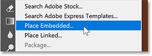
*Going to File > Place Embedded.*

### Step 2: Select the image you want to import

Select the image you want to import and click **Place**.

I'll import my portrait image.

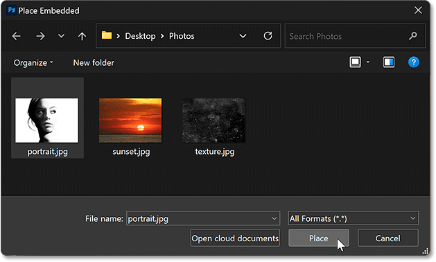
*Selecting the image to place into the document.*

### Step 3: Accept and close Free Transform

Before placing the image, Photoshop opens the [Free Transform](/basics/transform-and-warp-images-with-free-transform-in-photoshop-cc-2019/) command so you can resize the image if needed.

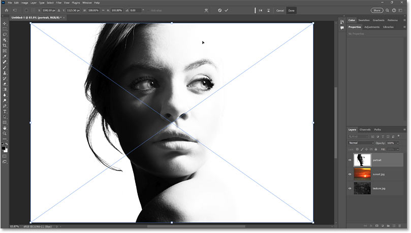
*Photoshop opens Free Transform before placing the image into the document.*

Click the **checkmark** in the Options Bar to accept the size and close Free Transform.

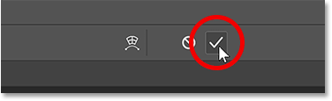
*Clicking the checkmark.*

### The image is imported as a smart object

Photoshop places the image into the document and adds it on its own layer.

But notice that the layer was converted to a **smart object**, indicated by the icon in the lower right of the thumbnail.

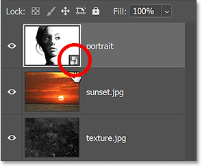
*Photoshop places the image as a smart object.*

### The problem with smart objects

[Smart objects](/basics/how-to-create-smart-objects-in-photoshop/) in Photoshop are very powerful and great for [scaling images without losing quality](/basics/scale-resize-images-smart-objects-photoshop/).

But smart objects also have limitations. The biggest one is that they are not directly editable.

For example, I'll select the [Rectangular Marquee Tool](/basics/selections/rectangular-marquee-tool/) from the [toolbar](/basics/photoshop-tools-toolbar-overview/).

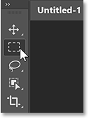
*Selecting the Rectangular Marquee Tool.*

Then I'll draw a selection outline around the woman's eyes.

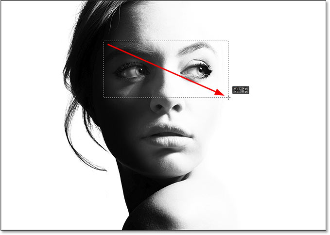
*Selecting part of the smart object.*

[Related: How to use the Object Selection Tool in Photoshop](/basics/using-the-object-selection-tool-and-object-finder-in-photoshop-2022/)

I'll invert the selection by going up to the **Select** menu and choosing **Inverse**.

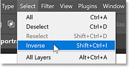
*Going to Select > Inverse.*

Then I'll press the **Backspace** (Win) / **Delete** (Mac) key on my keyboard to delete everything around my initial selection.

But instead of deleting the area, Photoshop warns that it could not complete my request because the smart object is not directly editable. So I'll click OK to close it.

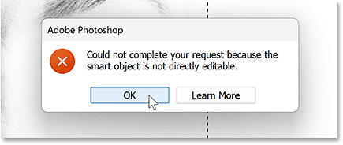
*Photoshop could not edit the smart object.*

[Related: How to edit smart objects in Photoshop](/basics/how-to-edit-and-replace-smart-object-contents-in-photoshop/)

### How to convert a smart object to a normal layer

Depending on what you'll be doing with the image, a smart object may not be what you want.

In that case, the smart object will need to be *rasterized* (converted into a normal layer) after placing it into your document.

To rasterize the smart object:

- **Right-click** (Win) / **Control-click** (Mac) on an empty gray area next to the smart object's name.
- Choose **Rasterize Layer** from the menu.

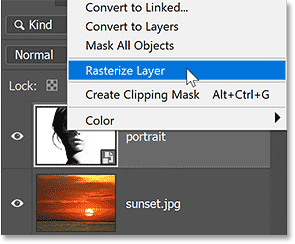
*Rasterizing the smart object.*

The smart object is converted to a normal layer and the smart object icon disappears.

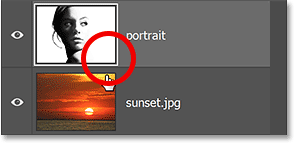
*The smart object has been converted to a pixel layer.*

If I now press **Backspace** (Win) / **Delete** (Mac) on my keyboard, this time Photoshop deletes the selection as expected.

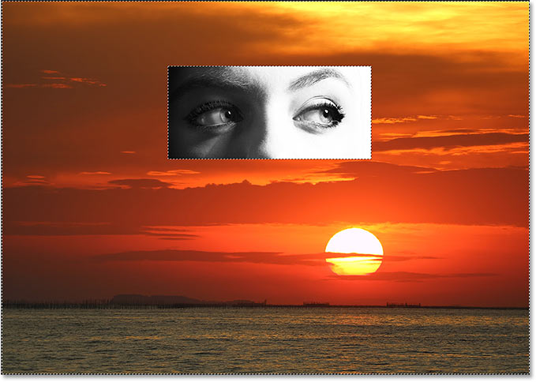
*The layer is now editable.*

## Photoshop Preferences for importing images faster

Let's look at a few options in Photoshop's Preferences that can help you import an image even faster when using the Place Embedded command.

To open the Preferences:

- **Windows**: Go to Edit > Preferences > General.
- **Mac**: Go to Photoshop > Settings > General.

### Skip Transform when Placing

Turn on **Skip Transform when Placing** to skip the Free Transform command when placing an image.

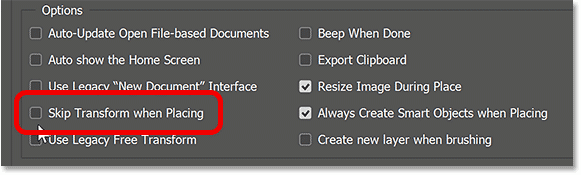
*The "Skip Transform when Placing" option.*

### Always Create Smart Objects when Placing

Turn off **Always Create Smart Objects when Placing** to avoid converting the into a smart object.

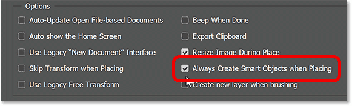
*The "Always Create Smart Objects when Placing" option.*

### Resize Image During Place

By default, if you place an image into a document and the image is larger than the canvas size, Photoshop will automatically resize the image to fit the canvas. In other words, it will make your image smaller.

If you would rather resize images yourself using Free Transform, then uncheck **Resize Image During Place**.

Click OK to close the Preferences dialog box when you're done.

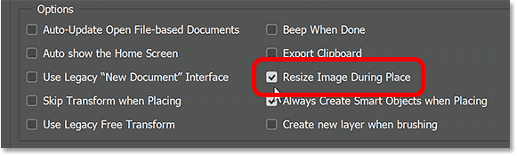
*The "Resize Image During Place" option.*

## Bonus: Blending the layers to create a double exposure

We've learned how to import multiple images at once into Photoshop using the Load Files into Stack command, and how to add more images using the Place Embedded command.

So I'll finish off this tutorial by quickly blending my three images together to create a simple double exposure effect.

I'm starting with my [portrait image](https://adobe.prf.hn/click/camref:1100lrdjJ/destination:https%3A%2F%2Fstock.adobe.com%2Fca%2Fimages%2Fhigh-contrast-black-and-white-portrait-of-a-beautiful-girl%2F183500097) above the other two layers, which places it in front of the other images.

*The portrait image.*

### Moving one layer above another

In the Layers panel, I'll drag my sunset layer above the portrait layer.

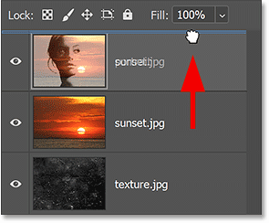
*Dragging the sunset above the portrait.*

The [sunset image](https://adobe.prf.hn/click/camref:1100lrdjJ/destination:https%3A%2F%2Fstock.adobe.com%2Fimages%2Fsunset-on-red-yellow-sky-back-soft-evening-cloud-over-horizon-sea%2F283279085) is now visible in front of the portrait image.

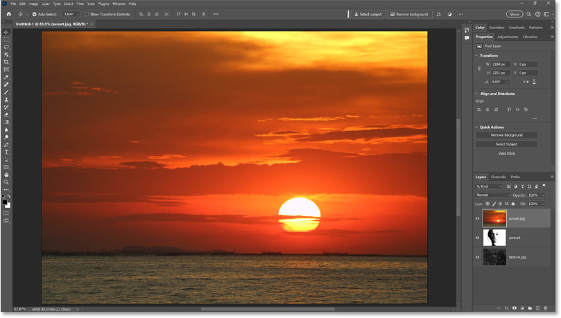
*The sunset image.*

### Changing layer blend mode

To blend the sunset with the portrait, I'll change the [blend mode](/photo-editing/layer-blend-modes/intro/) of the sunset layer to **Screen**.

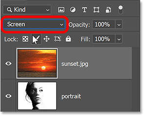
*Changing the layer's blend mode to Screen.*

The [Screen blend mode](/photo-editing/layer-blend-modes/screen/) keeps the white areas of the portrait visible and reveals the sunset in the darker areas.

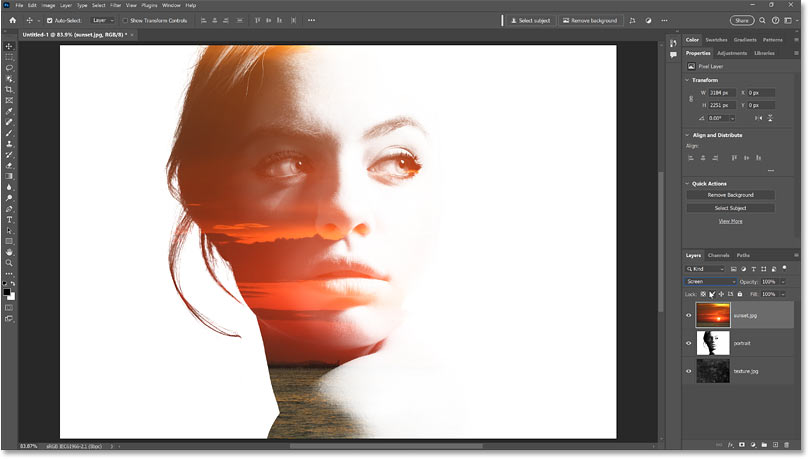
*The result after changing the blend mode of the sunset layer to Screen.*

### Moving the bottom layer to the top

Next I'll drag my texture layer above the sunset layer.

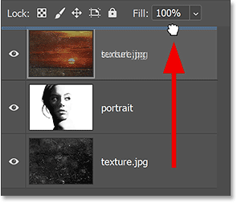
*Dragging the texture layer to the top of the stack.*

And now the [texture image](https://adobe.prf.hn/click/camref:1100lrdjJ/destination:https%3A%2F%2Fstock.adobe.com%2Fimages%2Fblack-scratched-grunge-background-old-film-effect-space-for-text%2F233327250) is visible in front of the other images.

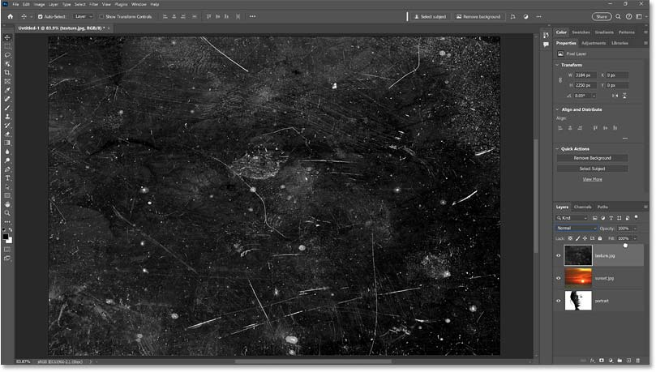
*The texture image.*

### Changing the layer blend mode and opacity

To hide the dark areas of the texture and keep only the lighter areas, I'll change the **blend mode** to **Screen**.

I'll also lower the layer's [opacity](/basics/layers/opacity-vs-fill/) down to **70%**:

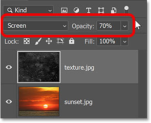
*Changing the blend mode and lowering the opacity of the texture.*

Here's the result with the texture now blended into the effect.

*The result with the texture blending with the other images.*

[Related: Learn three easy ways to blend images in Photoshop!](/basics/three-ways-to-blend-two-images-together-photoshop/)

### Merging layers onto a new layer

Finally, to add a bit more contrast to the effect, I'll [merge all three layers](/basics/merge-layers-to-a-new-layer-without-flattening-your-image/) onto a new layer above them.

To merge all layers onto a new layer, press:

- **Windows**: Ctrl+Shift+Alt+E
- **Mac**: Command+Shift+Option+E

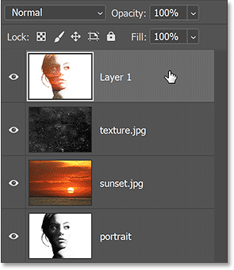
*Merging all three layers onto a new layer.*

[Learn more: The essential Photoshop layers power shortcuts](/basics/layer-shortcuts/)

### Increasing the image contrast

Then to quickly increase the effect's contrast, I'll go up to the **Image** menu and choose [Auto Contrast](/photo-editing/auto-tone-auto-contrast-and-auto-color-in-photoshop/):

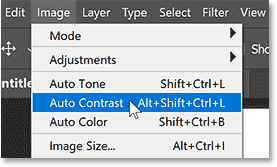
*Going to Image > Auto Contrast.*

And here is my final double-exposure effect.

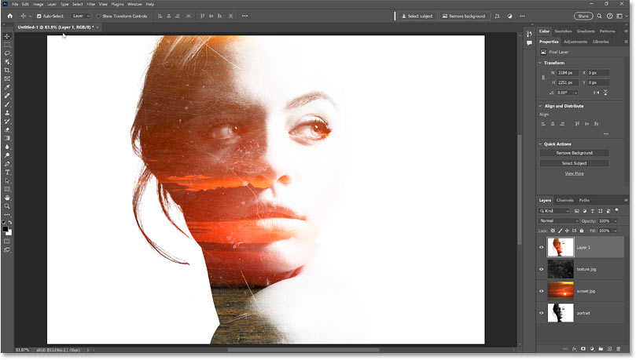
*The double exposure effect created by blending the imported layers.*

And there we have it! That's how to import images as layers in Photoshop.