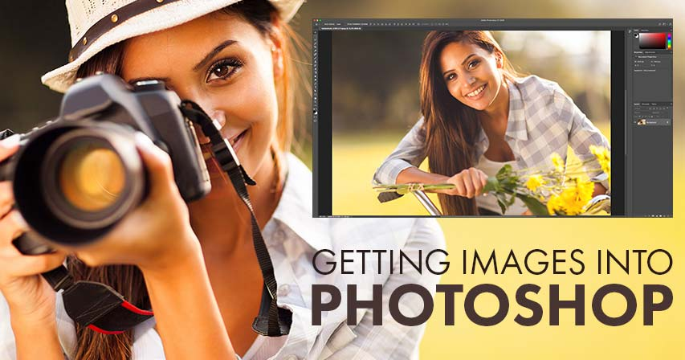

# Getting Images into Photoshop – Complete Guide

> Source: [https://www.photoshopessentials.com/basics/opening-images-photoshop/](https://www.photoshopessentials.com/basics/opening-images-photoshop/)
> Downloaded and converted to Markdown.

Learn the many ways of getting your images into Photoshop with Chapter 2 of our Photoshop training series! Includes how to open images from Lightroom, Camera Raw, Adobe Bridge and more!

Before we can do anything with our photos, we first need to get them *into* Photoshop. Opening images may not sound like a topic that needs an entire series of tutorials. But Photoshop is no ordinary program. And like pretty much everything we do in Photoshop, there's more than one way to open an image.

In this chapter, I take you through each of them. We start in lesson 1 by learning [how to set Photoshop as our default image editor in Windows 10](/basics/make-photoshop-your-default-image-editor-in-windows-10/ "View tutorial"). And in lesson 2, we learn [how to set Photoshop as your default image editor in Mac OS X](/basics/default-image-editor-mac/ "View Lesson 2"). Lesson 3 shows you [how to create new Photoshop documents](/basics/create-new-documents-photoshop-cc/ "View Lesson 3") from scratch, and in lesson 4, you'll learn [how to open existing images in Photoshop](/basics/open-images-photoshop-cc/ "View Lesson 4")!

Lesson 5 is all about [Adobe Bridge](/basics/open-images-photoshop-adobe-bridge/ "View Lesson 5"), the file browser included with Photoshop, and why it's a better way to select and open your images. The only problem with Bridge is that it can sometimes open a file in the wrong program. We fix that in lesson 6 by learning how to set up [file type associations](/basics/adobe-bridge-file-type-associations/ "View Lesson 6") in Bridge!

In lesson 7, you'll learn [how to open images directly into Camera Raw](/basics/open-image-camera-raw/ "View Lesson 7"), Photoshop's powerful image editing plugin. And, if you're an Adobe Lightroom user, you'll want to learn how to move your images from Lightroom into Photoshop for further editing. Lesson 8 covers [how to move raw files from Lightroom to Photoshop](/basics/move-raw-files-lightroom-photoshop/ "View Lesson 8"), while lesson 9 shows you [how to move JPEG files between Lightroom and Photoshop](/basics/move-jpeg-images-lightroom-photoshop/ "View Lesson 9"). And finally, in lesson 10, we finish off this chapter by learning [how to close our images in Photoshop](/basics/close-images-photoshop/ "View Lesson 10"), including how to close all open images at once!

Need printable versions of these tutorials? All of our Photoshop tutorials are now available to [download as PDFs](/print-ready-pdfs/ "Download the PDFs")! Let's get started!

Some of the lessons in this chapter build on previous lessons. If you haven't already, be sure to read through [Chapter 1 - Getting Started with Photoshop](/basics/getting-started-photoshop/ "Learn the basics of Photoshop, Chapter 1") before starting Chapter 2.

Completed all 10 lessons in this chapter? Congratulations! You're ready to move on to [Chapter 3 - Learning The Photoshop Interface](/basics/learning-the-photoshop-interface/ "View Chapter 3")! Or visit our [Photoshop Basics](/basics/ "View our Photoshop Basics tutorials") section for more chapters and tutorials.