# Photoshop Brushes – Other Dynamics

> Source: [https://www.photoshopessentials.com/basics/photoshop-brushes/brush-dynamics/other-dynamics/](https://www.photoshopessentials.com/basics/photoshop-brushes/brush-dynamics/other-dynamics/)
> Downloaded and converted to Markdown.

In the previous tutorial, we looked at how Photoshop's **[Color Dynamics](/basics/photoshop-brushes/brush-dynamics/color-dynamics/)** options allow us to dynamically change and control various aspects of our brush's color as we paint. In this tutorial, we'll look at the sixth and final Brush Dynamics category in the Brushes panel, the one with the least descriptive and interesting name - **Other Dynamics**!

Just as with Color Dynamics, the options found in Other Dynamics have nothing to do with the shape of our brush. Instead, they allow us to dynamically control the **opacity** and **flow** of our brush's color! What do "opacity" and "flow" mean, and how are they different from each other? Before we look at how to dynamically change them from within the Brushes panel, let's first see how we normally access these options so we can see what they do.

## The Options Bar

Whenever we have the Brush Tool selected in Photoshop, the **Options Bar** along the top of the screen shows us various options that affect how the brush works. Two of these options are **Opacity** and **Flow**, and you'll find them side by side each other:

*With the Brush Tool selected, the Opacity and Flow options appear in the Options Bar.*

**Opacity**

Opacity controls the translucency of the brush color as we paint. When the Opacity value is set to 100% (the default value), the brush color is opaque, completely blocking anything below the area we're painting over from view. At 0% opacity, the brush color is transparent, allowing anything we paint over to show through (effectively making the brush color invisible). A value between 0% and 100% will make the brush color semi-transparent, with higher values making the color more opaque than lower values.

I'll paint a simple brush stroke using one of Photoshop's standard round brushes. I'll paint with black (by setting my Foreground color to black) and I'll increase the Spacing value to 50% in the Brush Tip Shape section of the Brushes panel so the individual brush tips will be easy to see, giving the stroke a "bumpy" look to it, with each "bump" being a new stamp of the brush tip. Here's my brush stroke with the Opacity value set to its default 100%:

*With opacity set to 100%, a black brush stroke looks, well, black.*

Let's see what happens when I lower my brush opacity down to 25%:

*Lowering the brush opacity down to 25%.*

This time, even though I'm still painting with black, the brush color appears as a much lighter gray:

*The brush color now appears much lighter.*

The reason is that by lowering the opacity value, the white background of the document is now showing through the brush color. With a brush opacity of 25%, it means we're seeing only 25% of the brush color mixed in with 75% of the white background.

Here's the important part. Notice that even in the areas where the brush stroke looped back over itself, the opacity value didn't change. It remained at 25% throughout the entire length of the stroke, even in areas that were painted over twice. Also, even though the brush tips themselves are overlapping each other, it made no difference to the opacity level. That's the big difference between opacity and flow. Opacity controls the translucency of the **entire brush stroke**. Flow, on the other hand, controls the opacity level of **each individual brush tip**!

The only way I can affect the opacity of my initial brush stroke is by releasing my mouse button (or lifting my pen off the tablet) to end the first stroke, then painting a second, *different* brush stroke that passes over top of the first one. Here, I'll paint a second stroke, also at 25% opacity. The second stroke appears as the same light gray color, but in areas where the two strokes overlap each other, the opacity levels combine to create darker, more opaque sections:

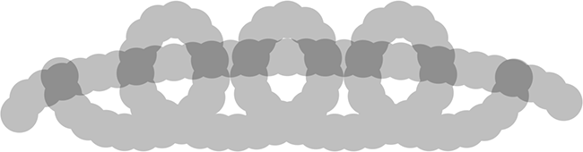
*The areas where the two strokes intersect are darker because of the combined opacity of the two strokes.*

**Flow**

I'm going to increase my Opacity value back up to 100% and this time, I'll lower the **Flow** value down to 25%:

*Lowering the Flow value to 25%.*

Here's the same brush stroke again but with flow set to 25% instead of the opacity. This time, we're seeing something quite different. The stroke still starts out with the same light gray color, since we're still allowing the white background to show through, but the areas where the individual brush tips overlap each other are darker and more opaque, and the areas where the brush loops back over itself (where multiple brush tips are overlapping) are even darker:

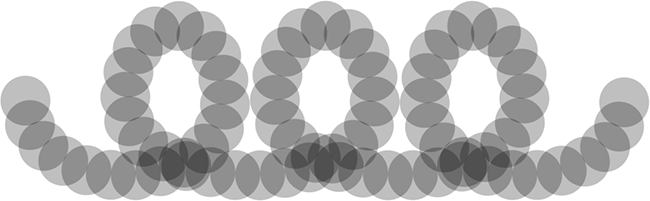
*With the Flow option, the opacity levels of the individual brush tips combine to become more opaque in areas where they overlap each other.*

Again, Flow controls the opacity level of each individual brush tip, unlike Opacity which controls the transparency of the stroke as a whole. With Flow, areas in the stroke where the brush tips overlap become more opaque than areas that don't overlap as the opacity levels of those areas combine. If I lower the spacing of my individual brush tips (I'll lower it to around 13% in the Brush Tip Shape section of the Brushes panel) and paint another stroke, we see much darker and more opaque results. Flow is still set to 25%, but because the brush tips are now closer together, they overlap more, and the more they overlap, the more opaque the brush stroke becomes:

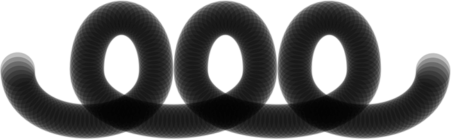
*The closer the brush tips are to each other, the more they overlap, creating a darker, more opaque brush stroke.*

If I leave my brush tip spacing the same and paint the same stroke again, this time with Opacity set to 25% instead of Flow (which I'll set back to its default 100%), we're back to seeing the same uniform transparency level throughout the entire stroke. The fact that the brush tips are close together and overlapping each other so much makes no difference with the Opacity option, since all it cares about is the transparency of the stroke as a whole:

*"Brush tips overlapping? I didn't even notice," says the Opacity option, which cares only about the stroke itself.*

Now that we've seen what the Opacity and Flow options are all about and how we normally set them in the Options Bar, let's see how we can dynamically control them from the Brushes panel!

## Other Dynamics

To change our brush opacity and/or flow dynamically as we paint, we use the Opacity and Flow options in the Other Dynamics section of the Brushes panel. Click directly on the words **Other Dynamics** to access the options:

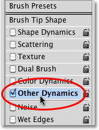
*Click directly on the words Other Dynamics in the Brushes panel.*

As soon as you click on the words, the Opacity and Flow options appear on the right side of the Brushes panel. Just as we've seen with other Brush Dynamics categories, each one comes with both a **Control** option, allowing us to choose from various ways to control the opacity or flow ourselves, and a **Jitter** slider which let's Photoshop change them randomly:

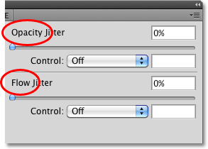
*Opacity and Flow each come with a Control option and a Jitter slider.*

**The Options Bar vs The Brushes Panel**

Before you change any of the settings here in the Other Dynamics section, make sure you've set the Opacity and Flow options in the Options Bar back to 100% first, otherwise your results may not be what you expected. The reason is that the Opacity and Flow options in the Brushes panel are directly linked to the ones we just looked at in the Options Bar. If, for example, you've set the Opacity value in the Options Bar to 25%, the opacity of your brush color will never exceed 25% no matter what settings you've chosen with the Other Dynamics options. The same goes for the Flow option.

## Opacity Control

To control the opacity of the brush color dynamically as you paint, click on the **Control** drop-down box directly below the Opacity Jitter slider and choose either **Fade**, **Pen Pressure**, **Pen Tilt**, or **Stylus Wheel** (if you have an air brush pen). Fade will fade out the opacity of the brush color based on the number of steps you specify and is the only Control option available if you don't have a pen tablet installed (you can still choose one of the other options but it won't actually do anything). I'll select **Pen Pressure**, since I am using a pen tablet:

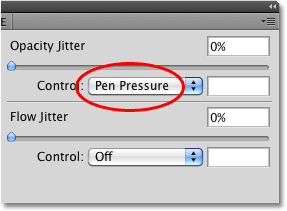
*Selecting Pen Pressure to control the opacity of the brush color.*

With the opacity now being controlled by pen pressure, the more pressure I apply to the tablet with my pen, the more opaque the brush color becomes. Less pressure gives me a more transparent brush color:

*More pen pressure in the center of the stroke created a more opaque color. Less pressure on either end gave me more transparency.*

## Flow Control

The Control options for Flow work the same way. Click on the **Control** drop-down box directly below the Flow Jitter slider and choose how you want to control the flow from the list. The same options (Fade, Pen Pressure, Pen Tilt, and Stylus Wheel) are available. I'll choose **Pen Pressure** once again:

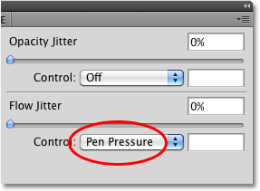
*Opacity and Flow both share the same Control options (Fade, Pen Pressure, Pen Tilt, and Stylus Wheel).*

When opacity was being controlled by pen pressure, we saw quite a bit of difference between the transparency levels throughout the brush stroke as varying amounts of pressure were applied to the tablet. With flow controlled by pen pressure, we end up with a brush stroke that's darker overall, even with the exact same amounts of pen pressure being applied. Since the brush tips are overlapping, their opacity levels are mixing together, giving us more opaque results than what the same amount of pen pressure gave us when we were controlling the opacity:

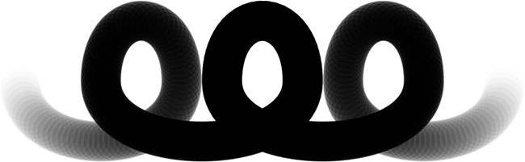
*With the same amount of pen pressure applied, Flow will give us a more opaque brush stroke than Opacity.*

## Opacity And Flow Jitter

Finally, we can add randomness to the brush opacity or flow (or both at once) using their respective **Jitter** sliders. The further we drag a slider towards the right, the more variety we'll see as we paint:

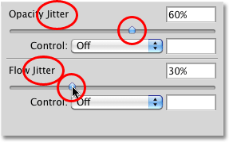
*Use the Opacity Jitter and Flow Jitter sliders to let Photoshop change them randomly.*

Both jitter options will create somewhat similar results, since Photoshop will randomly change the transparency level of each new brush tip. The difference once again is that Flow Jitter will usually give us a darker, more opaque result overall as the opacity levels of overlapping brush tips mix together. Here's a brush stroke with Opacity Jitter set to 100%. The individual brush tips are obvious, but the transparency levels are not affected by overlapping areas:

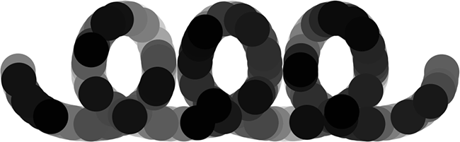
*A brush stroke with Opacity Jitter set to 100%.*

And here's my brush stroke with Flow Jitter set to 100% (Opacity Jitter has been set back to 0%). This time, we see very few light, transparent areas and many more dark, opaque areas:

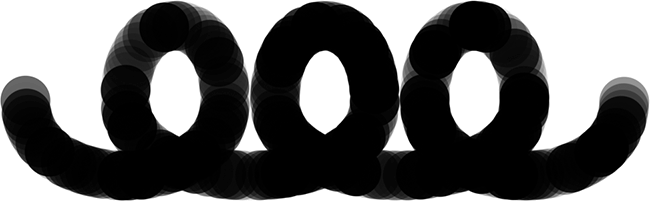
*The same brush stroke with Flow Jitter set to 100%.*