# Photoshop Type – The Paragraph Panel

> Source: [https://www.photoshopessentials.com/basics/type/paragraph-panel/](https://www.photoshopessentials.com/basics/type/paragraph-panel/)
> Downloaded and converted to Markdown.

In the previous tutorial, we looked at Photoshop's [Character panel](/basics/type/character-panel/), one of the two panels where we find our options for working with type. As its name implies, the Character panel is where we go for character-based text options like leading, kerning and tracking, baseline shift, and so on.

As we'll learn in this tutorial, the **Paragraph panel** contains the paragraph-based options - alignment, justification, paragraph spacing, and more! Together, these two panels give us full access to every single type option available in Photoshop!

### Accessing The Paragraph Panel

As we learned in the previous tutorial, the Character and Paragraph panels are grouped together into a single **panel group**. One way to access the Paragraph panel is by going up to the **Window** menu in the Menu Bar along the top of the screen and choosing **Paragraph** from the list:

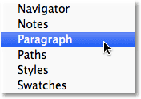
*Go to Window > Paragraph.*

Or, you can click on the Character and Paragraph panels **toggle icon** in the Options Bar along the top of the screen:

*Click on the Character and Paragraph panels toggle icon.*

This will open the Character and Paragraph panel group. If you selected Paragraph from under the Window menu, the group will automatically open to the Paragraph panel. If you clicked on the toggle icon in the Options Bar, the group will open to the Character panel, but we can easily switch between the two panels simply by clicking on their **name tabs** at the top of the group. I'll click on the Paragraph tab:

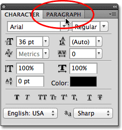
*Click on the Paragraph panel's name tab at the top of the group to switch to it.*

This opens the Paragraph panel:

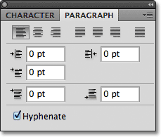
*The Paragraph panel.*

### The Alignment Options

Along the top of the Paragraph panel is a row of icons for aligning and justifying our text. The first three icons on the left of the row are the **alignment** options. From left to right, we have **Left Align Text**, **Center Text**, and **Right Align Text**:

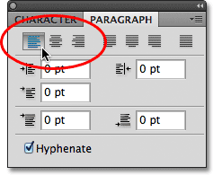
*The Left Align Text, Center Text and Right Align Text options.*

If these options look familiar, it's because they're the exact same alignment options found in the **Options Bar** when we have the Type Tool selected. It makes no difference if you set your alignment in the Options Bar or the Paragraph panel. The Left Align Text option is selected for us by default:

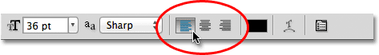
*The same type alignment options can be accessed from the Options Bar.*

Choosing Left Align Text (the default choice) will align your type with the left side of the text box (when using [area type](/basics/type/area-type/)):

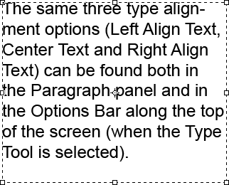
*An example of left-aligned paragraph (area) type.*

The Center Text option will center each line of type in the paragraph:

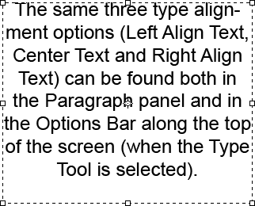
*Center-aligned paragraph type.*

Right Align Text will align the type with the right side of the text box:

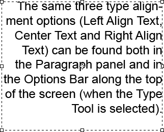
*Right-aligned paragraph type.*

### The Justification Options

The next four icons in the row along the top of the Paragraph panel are the **justification** options. From left to right, we have **Justify Last Left**, **Justify Last Centered**, **Justify Last Right**, and finally, **Justify All**. These options are only available in the Paragraph panel. In fact, all of the options we'll look at from this point on are found exclusively in the Paragraph panel. The only options here that can also be found in the Options Bar are the alignment options we looked at a moment ago:

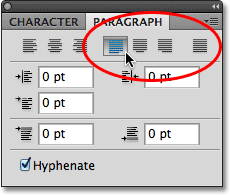
*The type justification options (Last Left, Last Centered, Last Right, and Justify All).*

When we choose any of these justification options, Photoshop re-adjusts the spacing between the words so that every line of type in the paragraph fills the entire width of the text box from left to right, creating a "block" of text. The only difference between the four options is how Photoshop handles the very last line in the paragraph. With Justify Last Left, Photoshop aligns the last line to the left side of the text box:

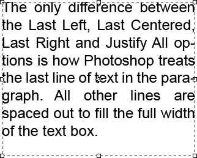
*The Justify Last Left option aligns the last line of the paragraph to the left.*

Justify Last Centered will center the last line:

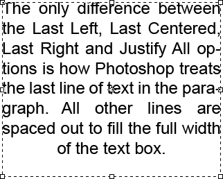
*The Justify Last Centered option centers the last line of the paragraph.*

Justify Last Right will align the last line to the right side of the text box:

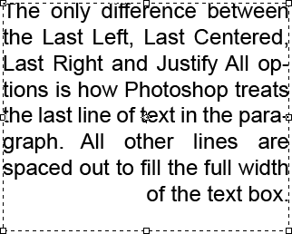
*The Justify Last Right option aligns the last line of the paragraph to the right.*

Justify All will treat the last line the same as all the other lines, spacing the words out to fill the entire width of the text box:

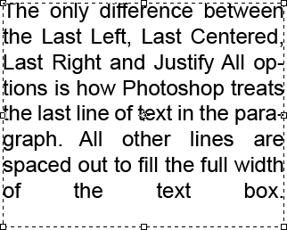
*The Justify All option justifies the entire paragraph including the last line.*

### The Indent Options

Below the alignment and justification icons are three **indent** options - **Indent Left Margin** (top left), **Indent Right Margin** (top right), and **Indent First Line** (bottom left). All three are set to 0 pt by default:

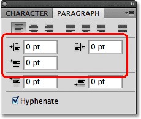
*Clockwise from top left - Indent Left Margin, Indent Right Margin, and Indent First Line.*

These options allow us to add space between the entire paragraph and the left or right sides of the text box, or we can add space just to the first line of the paragraph. To change the value for any of the indent options, either click inside the input box and enter a value manually or, if you're using Photoshop CS or higher, move your mouse cursor over the option's icon to the left of the input box, which will turn your cursor into a **scrubby slider**, then click and hold your mouse button down and drag towards either the left or right. Dragging towards the right will increase the indent value while dragging towards the left will decrease it.

As an example, I'll increase my Indent Left Margin value to 16 pt:

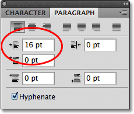
*Increasing the Indent Left Margin option to 16 pt.*

And we can see that I now have a small amount of space between my paragraph and the left side of the text box:

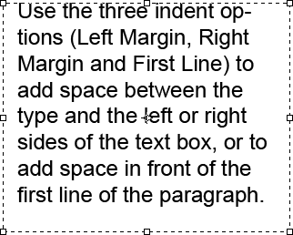
*Space has been added between the left side of the paragraph and the left side of the text box.*

If I select the Right Align Text option, then increase my Indent Right Margin value to 16 pt:

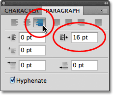
*Switching to the Right Align Text option and increasing the Indent Right Margin option to 16 pt.*

We see that I now have space between the paragraph and the right side of the text box:

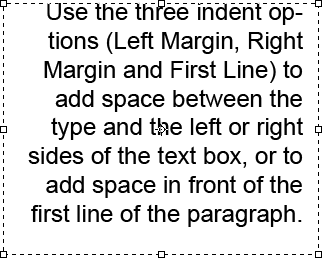
*Space how appears between the right side of the paragraph and the right side of the text box.*

I'll re-select the Left Align Text option in the top left corner of the Paragraph panel, then I'll increase my Indent First Line option to 24 pt:

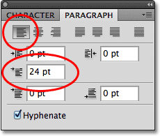
*Switching back to the Left Align Text option and increasing the Indent First Line option to 24 pt.*

This aligns the text to the left side of the text box and indents only the first line by 24 pt:

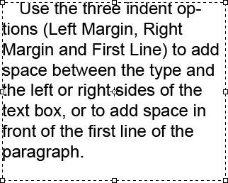
*Only the first line of the paragraph is indented by 24 pt.*

### The Paragraph Spacing Options

Photoshop also gives us options for adding space either before or after a paragraph using the appropriately-named **Add Space Before Paragraph** (left) and **Add Space After Paragraph** (right) options:

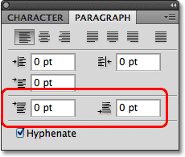
*The Space Before (left) and Space After (right) paragraph spacing options.*

Typically, we'd use one or the other, not both at once, and I usually use the Space Before option. Here's a text box containing three paragraphs of text which, at the moment, are not separated at all from each other:

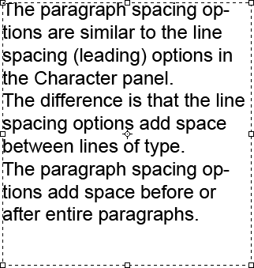
*Three paragraphs of text sitting directly above and below each other with no space in between.*

I'll click and drag over the bottom two paragraphs to select them. I don't need to add any space above the first paragraph so there's no need to include it in the selection:

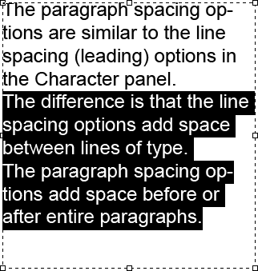
*Selecting the second and third paragraphs in the text box.*

With my two paragraphs selected, I'll increase the Space Before value to 14 pt. You can either enter a value manually into the input boxes or use the scrubby sliders (Photoshop CS and higher):

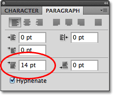
*Setting the Add Space Before Paragraph option to 14 pt.*

This adds space above each of the two paragraphs I selected, making it easier to see where each paragraph begins and ends:

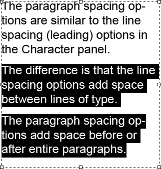
*The three paragraphs are now spaced apart.*

As we covered in the first tutorial in this series, [Photoshop Type Essentials](/basics/type/photoshop-type-essentials/), to commit your changes and exit out of text editing mode, click on the **checkmark** in the Options Bar:

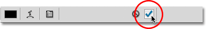
*Click the checkmark to accept your changes.*

Or, if you have a numeric keypad on your keyboard, you can press the **Enter** key on the keypad. If you don't have a numeric keypad, you can press **Ctrl+Enter** (Win) / **Command+Return** (Mac) to accept the changes.

### Hyphenate

The final option down at the bottom of the Paragraph panel is **Hyphenate**, which is enabled (checked) by default:

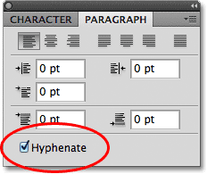
*The Hyphenate option is checked by default.*

Hyphenation is especially helpful when using any of the justification options because it lets Photoshop break longer words up onto separate lines, making it easier to space the words out in a way that's more visually appealing. However, if you're not a fan of hyphenation or you just don't want to use it for a specific situation, simply uncheck the option to disable it.

### Resetting The Paragraph Panel

Finally, if you've made changes to the Paragraph panel options and want to quickly reset them back to their defaults, click on the **menu icon** in the top right corner of the panel:

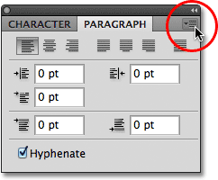
*Click on the menu icon in the top right corner.*

Then select **Reset Paragraph** from the menu of options that appears:

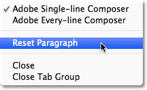
*Choose "Reset Paragraph" to instantly reset all the Paragraph panel options to their defaults.*