# Making Selections With The Pen Tool In Photoshop

> Source: [https://www.photoshopessentials.com/basics/selections/pen-tool-selections/](https://www.photoshopessentials.com/basics/selections/pen-tool-selections/)
> Downloaded and converted to Markdown.

When it comes to making selections in Photoshop, there's really two types of people - those who know how to use the *Pen Tool*, and those who struggle. Most people put off learning how to use the Pen Tool for as long as possible, while others never get around to learning it, believing it's just too confusing, too complicated, and just plain unnatural.

Ultimately, their work in Photoshop suffers for it, since they're stuck relying on the Lasso Tool for just about everything they can't select with the Rectangular or Elliptical Marquee Tools. In this **Adobe Photoshop tutorial**, we're going to put an end to the suffering. We're going to learn just how easy it really is to make selections with the Pen Tool.

Now, when I say "easy", I don't mean you're going to read this tutorial and be instantly transformed into a Pen Master. Learning how to use the Pen Tool is a lot like learning how to ride a bike. Once you've learned, it will seem completely natural and you'll wonder how anyone could possibly not know how to use something so simple. But getting to that point requires a little practice and effort, and while reading every book there is on how to ride a bike may teach you the fundamentals of how the pedals, gears and brakes work, it's not until you're on the bike struggling to keep your balance that the real learning begins.

One of the great things about the Pen Tool is that it's not something that's exclusive to Photoshop. Far from it! Virtually every popular photo editing, graphics and page layout program uses the Pen Tool in one form or another, so once you've learned how to use it in Photoshop, you'll already have a good understanding of how to use it in lots of other programs as well!

This tutorial is from our [How to make selections in Photoshop](/basics/make-selections-photoshop/) series.

### Where Do I Find The Pen Tool?

Before we start talking about what the Pen Tool is or how to use it, we should look at where to find it in Photoshop first. You'll find the Pen Tool in the Tools palette, grouped in with the Shape Tools, the Type Tool, and the Path Selection (the white arrow) and Direct Selection (the black arrow) Tools (see the image on the left).

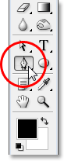
*Photoshop's Pen Tool*

Of course, this may raise the question of why, if we can make selections with the Pen Tool, is it not grouped in with the other selection tools (the Rectangular Marquee Tool, the Elliptical Marquee Tool, the Lasso Tool, etc.) at the top of the Tools palette? Why is it down there with those other tools which are clearly not selection tools?

That's an excellent question, and there just happens to be an equally excellent answer to go with it, which we'll get to in a moment.

### Why Is It Called The "Pen" Tool?

One of the first stumbling blocks to learning how to use the Pen Tool, as with many other things in Photoshop, is its name, since after all, if there's one thing that everyone who's ever tried to use it knows, this thing is *not* a pen. At least, not the sort of pen you'd normally think of when you hear the word "pen". Try writing your name with it in the same way you might sign your name on a piece of paper with a pen and you'll probably end up with a twisted, tangled mess and things looping all over each other (of course, I suppose that could very well be how you sign your name).

*Pierre Bezier*

So if it doesn't act like a traditional ink pen, why is it called the Pen Tool? The Pen Tool has actually been called several things over the years, and by that, I don't mean the sort of things you may have called it in moments of frustration. You may have heard it referred to as the *Bezier Pen* or the *Bezier Tool*, and that's because it was created by a man named *Pierre Bezier* (that's him on the left), a French engineer and all-around smart guy who came up with the fancy math that powers the tool while working for the Renault car company (the Pen Tool was originally created to help design cars).

You may also have heard the Pen Tool referred to as the *Paths Tool*, and that's really the most appropriate name for it. The Pen Tool is all about drawing "paths". To make selections with the Pen Tool, we simply convert the path or paths we've drawn into selections. It always begins, though, with a path.

### What Is A Path?

A "path" is, quite honestly, something that may seem a little out of place inside a program like Photoshop. The reason is because Photoshop is primarily a *pixel-based* program. It takes the millions of tiny square pixels that make up a typical digital image and does things with them. Paths, on the other hand, have absolutely *nothing* to do with pixels, which is why I said they may seem out of place in a program that's used mainly for editing and drawing pixels.

A path is really nothing more than a line that goes from one point to another, a line that is completely independent of and cares nothing about the pixels underneath it. The line may be straight or it may be curved, but it always goes from one point to another point, and as I mentioned, it has nothing at all to do with the pixels in the image. A path is completely separate from the image itself. In fact, a path is so separate that if you tried to print your image with a path visible on your screen, the path would not appear on the paper. Also, if you saved your image as a JPEG file and uploaded it to a website, even if you saved the image with the path visible on your screen in Photoshop, you won't see it in the image on the website. Paths are for your eyes and Photoshop only. No one else will ever see them, unless they happen to walk past your computer while you're working.

We always need a minimum of two points to create a path, since we need to know where the path starts and where it ends. If we use enough points that we can bring our path back to the same point it started from, we can create different shapes out of paths, which is exactly how Photoshop's various *Shape Tools* work. The Rectangle Tool uses paths, connected by points, to draw a rectangular shape. The Ellipse Tool uses paths, connected by points, to draw an elliptical shape, and so on. It's also how Photoshop's *Type Tool* works, although Photoshop handles type a bit differently than it handles regular shapes, but all type in Photoshop is essentially made from paths. In fact, you can convert type into shapes, which then gives you all of the same path editing options with type that you get when working with shapes.

You may also have heard paths referred to as *outlines*, and that's a pretty good description of what a path is, or at least, what a path can be. We can draw a square path, and if we do nothing else with it, as in we don't fill it with a color or apply a stroke to it, then all we have is a basic outline of a square. Same with a circle or any other shape we draw. The path itself is just the outline of the shape. It's not until we do something with the path, like fill it, apply a stroke, or convert it into a selection, that the path actually becomes something more than a basic outline.

You can select an entire path using the *Path Selection Tool* (also known as the "black arrow" tool), or you can select individual points or path *segments* using the *Direct Selection Tool* (the "white arrow" tool). A path "segment", or "line segment" as it's sometimes called, is any path between two points. A rectangular path, for example, would be made up of four points (one in each corner), and the individual paths connecting the points together along the top, bottom, left, and right to create the shape of the rectangle are the path segments. The actual path itself is the combination of all of the individual path segments that make up the shape.

That can be a little confusing, so let's see what I mean. Open a new document inside Photoshop. It doesn't matter what size it is. I'll choose the 640x480 size from the list of presets, but as I said, it doesn't matter what size you choose. Select your Pen Tool from the Tools palette. You can also select the Pen Tool simply by pressing the letter *P* on your keyboard.

*The Two Pen Tool Modes*
Now, before we continue, we first need to make sure we're working with paths, and that's because the Pen Tool actually has two different modes it can work in, and by default, it uses the other one. With the Pen Tool selected, if we look up in the Options Bar at the top of the screen, we'll see a group of three icons:

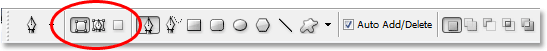
*The Options Bar in Photoshop showing the group of three icons representing each of the three Pen Tool modes.*

I know I said there's two modes the Pen Tool can work in and yet, as if to make things more confusing, there's *three* icons, but the icon on the right, which is the *Fill pixels* icon, is grayed out and not available when working with the Pen Tool. It's only available when working with the various Shape Tools, so there's really only two icons we need to look at.

The icon on the left is the *Shape layers* icon, also known as "not the one we want", and it's the one that's selected by default. If we were to work with the Pen Tool with that icon selected, we'd be drawing shapes, just as if we were using any of the various Shape Tools, except that instead of drawing a predefined shape like a rectangle or an ellipse, we could draw any shape we wanted. As I said though, that's not what we want. We want the icon beside it, the *Paths* icon, so go ahead and click on it to select it:

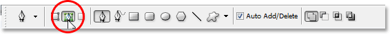
*Photoshop Tutorials: Click on the "Paths" icon in the Options Bar to work with paths with the Pen Tool.*

With the Pen Tool selected and the Paths icon selected in the Options Bar, click once anywhere inside your document. Don't click and drag, just click. When you do, you'll add a small square point. I've enlarged it here:

*Click once inside the document with the Pen Tool to add a point.*

This first point we've just added is the starting point of our path. Now at the moment, we don't actually have a path. All we have is a starting point. The "point" is technically called an *anchor* or *anchor point*, and it's named that because it *anchors* the path into place. This first point will anchor the beginning of the path to this spot inside the document. As we add more points, each of them will anchor the path into place at that location.

Let's add another point. Click somewhere else inside the document. Anywhere will do. I'm going to click somewhere to the right of my initial point:

*Photoshop Tutorials: Add a second anchor point by clicking somewhere else inside the document.*

I've now added a second anchor point, and look what's happened. I now have a straight line joining the two points together! That straight line is my path. As I mentioned earlier, we need a minimum of two points to create a path, since we need to know where the path starts and where it ends, and now that we have both a starting and an end point, Photoshop was able to connect the two points together, creating our path.

Let's add a few more points just for fun. Click a few more times at different spots inside the document. Again, don't click and drag, just click:

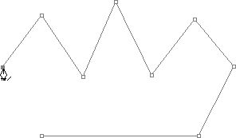
*Add additional points by clicking at different spots inside the document.*

In the image above, I've added seven more anchor points by clicking at different spots with the Pen Tool, and each time I added one, the length of my path increased because a new path "segment" was added between the previous point and the new point. My path now consists of nine anchor points and eight path segments. I could continue clicking around inside the document to add more anchor points and path segments, but what I'd really like to do now is *close* my path so it forms a complete shape.

*Closing A Path*
To close a path, all we need to do is click once again on our initial starting point. When you hover your mouse cursor over the starting point, you'll see a small circle appear in the bottom right corner of the pen icon:

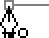
*A small circle appears in the bottom right corner of the pen icon when hovering the cursor over the initial starting point of the path.*

That circle tells us that we're about to come "full circle" with our path, finishing it off where it began. To close it, simply click directly on the starting point.
We can see below that my path has become a closed path and is now a basic outline of a shape:

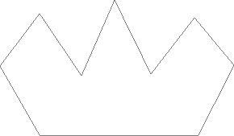
*The path is now closed, finishing at the starting point, creating a closed path.*

Even though this path was drawn just for fun as an example of how to draw a basic path with the Pen Tool, I can easily turn this path into a selection. For that, we need Photoshop's *Paths palette*, and we'll look at that next.

### Turning A Path Into A Selection

So far, we've looked at what a path is and how to draw a basic path with Photoshop's Pen Tool. But how do you go about making a selection from the path?

Easy! There's a couple of ways to turn a path into a selection, including a handy keyboard shortcut, but before we look at the quick way, let's look at the official way. The "official way" involves using Photoshop's *Paths palette*, which you'll find grouped in with the Layers palette and the Channels palette:

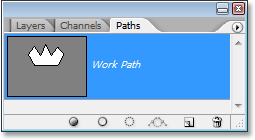
*Photoshop's Paths Palette.*

At first glance, the Paths palette looks very similar to Photoshop's Layers palette, and Adobe purposely made it like that so you'll feel more comfortable using it. We can see a thumbnail preview of the shape of the path we just created, and by default, Photoshop names the path "Work Path", which is basically a fancy way of saying "temporary", as in if you were to create a different path now without renaming this path to something else first, this one would be replaced by the new path. You can only have one "Work Path", so if you want to keep it, you'll need to double-click on its name in the Paths palette and name it something else before creating a new path.

Since my path looks a bit like a crown, I'm going to double-click on the name "Work Path", which with bring up Photoshop's *Save Path* dialog box, and I'm going to rename my path "Crown":

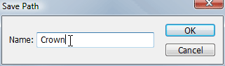
*You can save a temporary "Work Path" simply by renaming it.*

I'll click OK when I'm done, and now if I look in my Paths palette again, I can see that sure enough, my "Work Path" has been renamed "Crown":

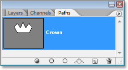
*The Paths palette showing that the path has been renamed "Crown".*

By renaming it, the path is now saved and won't disappear on me if I go to create a new path. Also, any saved paths are saved with the Photoshop document, so now, if I save my document, the path will be saved with it and the next time I open the document, the path will still be there in the Paths palette.

Saving a path is not something you need to do in order to turn it into a selection. In most cases when using the Pen Tool to make selections, you won't have any need for the path once you've made a selection from it, so there won't be any need to save it. If you did want to save it though, just rename it to something other than "Work Path" and it's saved.

To turn the path into a selection, if we look at the bottom of the Paths palette, we can see several icons. These icons allow us to do different things with our path. The first icon on the left is the *Fill path with Foreground color* icon, and as its name implies, clicking on it will fill our path with our current Foreground color. Interesting, but that's not what we want. The second icon from the left is the *Stroke path with brush* icon, which will apply a stroke to our path using whatever brush we currently have selected.

This is a great way to create interesting effects in Photoshop, but for what we're doing here, turning a path into a selection, it's not what we want either. The one we want is the third icon from the left, the *Load path as a selection* icon:

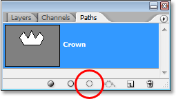
*The "Load path as a selection" icon at the bottom of the Paths palette.*

As soon as I click on this icon, my path inside my document becomes a selection, as if I had created it using any of Photoshop's more common selection tools:

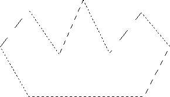
*The path has now been converted into a selection.*

It's that easy! In fact, it's even easier than that because there's a keyboard shortcut for turning a path into a selection without having to switch to the Paths palette at all. When you've drawn your path and you're ready to turn it into a selection, simply press *Ctrl+Enter* (Win) / *Command+Return* (Mac) to have Photoshop convert the path into a selection.

By now, it may be a little more obvious to you why, even though the Pen Tool is very much a selection tool, it's not grouped in with the other selection tools at the top of the Tools palette. The reason is because the Pen Tool is primarily a path tool. It creates selections by first creating paths, and for that reason, it has more in common with the various Shape Tools and the Type Tool, all of which use paths, than it has with the basic selection tools like the Rectangular Marquee Tool or the Lasso Tool, which make selections based only on pixels.

Let's look at a practical example of what we've learned so far. Here we have a photo of a stop sign in front of some rocky cliffs:

*A photo of a stop sign.*

Let's say I wanted to select that stop sign so I can copy it onto its own layer. The stop sign is made up of nothing more than a series of straight lines, which is going to make this extremely easy. First, I need a starting point for my path, so I'll start in the top left corner of the sign by clicking once to place an initial anchor point. In this case, it doesn't really matter where I start the path, but I'll start in the top left corner:

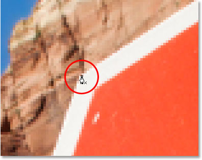
*Clicking once in the top left corner of the stop sign to begin the path with an initial anchor point.*

Notice how I'm zoomed in here as I click. You'll find it easier when making selections with the Pen Tool to zoom in a little on your image. That way, you can be sure you're keeping your path just inside the area you want to select.

Right now, I don't have a path, I just have a starting point for my path. To create the path, all I need to do is go around the sign adding an anchor point in each corner where the path needs to change direction. As I add each anchor point, a new path segment will appear joining the previous anchor point with the new one, until I've gone all the way around the sign. To close the path, I'll simply click back on the initial starting point. It's a little hard to see in the screenshot below, but I now have a path around the entire stop sign, including the post it's attached to, simply by going around clicking in the corners where the path needs to change direction:

*A path now appears all around the stop sign in the image.*

If I look in my Paths palette now, I can see very clearly that I have a path in the shape of the stop sign:

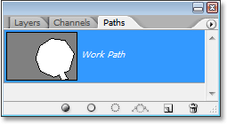
*Photoshop's Paths palette showing the path drawn around the stop sign.*

Notice how Photoshop has named the path "Work Path", which means that this path is temporary and I'll lose it if I create a different path without saving this one first by renaming it. Even if I don't create a new path, I'll still lose it when I close out of the document unless I save it first. I have no need to save this path though, so I won't worry about it. In most cases, you won't need to worry about it either.

To convert my path into a selection, I'll click on the *Load path as a selection* icon at the bottom of the Layers palette, or I could just as easily press *Ctrl+Enter* (Win) / *Command+Return* (Mac):

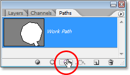
*Click on the "Load path as a selection" icon in the Paths palette, or press "Ctrl+Enter" (Win) / "Command+Delete" (Mac) to convert the path into a selection.*

As soon as I do, my path is converted into a selection, and the stop sign is now selected:

*The stop sign is now selected after converting the path into a selection.*

I'll switch back over to my Layers palette, and to copy the stop sign onto its own layer, I'll use the keyboard shortcut *Ctrl+J* (Win) / *Command+J* (Mac), which places the sign on its own layer above the Background layer:

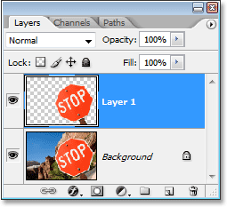
*The stop sign has now been copied onto its own separate layer.*

With the sign now on its own layer, I can do whatever I like with it, swapping the background with a different image, or making the background black and white while leaving the sign in color, whatever I can think of. The point is that I was able to easily select the sign by clicking in the corners with the Pen Tool, which created a path around the sign, and then I simply converted the path into a selection.

So far in our look at making selections with the Pen Tool in Photoshop, we've learned that the Pen is every bit a selection tool as Photoshop's more common selection tools like the Rectangular Marquee and the Lasso Tools, but that instead of making selections based on pixels as those other tools do, the Pen Tool draws paths which can then be easily converted into selections, either from the Paths palette or by using the quick keyboard shortcut.

That's why the Pen is found not at the top of the Tools palette with those other pixel-based selection tools but is instead grouped in with the path tools, like the various Shape Tools, the Type Tool, and the Path Selection and Direct Selection Tools. The Pen Tool is all about paths, not pixels.

We've learned that we can add anchor points inside our document, which *anchor* the path in place, by simply clicking in different spots with the Pen Tool, and as we add more and more anchor points, we create a path as each new point is connected to the previous point by a new path segment. We've also learned that a path is what's typically referred to as a "non-printing-element", which means that no matter how many paths we add, none of them will be visible on the paper when we go to print the image. They also will not be visible if we display the image on a website. Paths are visible only to us when working inside Photoshop (although other programs like Adobe Illustrator also support paths). It's not until we do something with the path, like fill it with a color, apply a stroke to it, or convert it into a selection, that the path becomes something more than just a basic, non-printing outline of a shape.

We saw how easy it would be to use the Pen Tool to select something like a stop sign by outlining it with a path made up of a series of straight path segments and then turning the path into a selection. That's great, but really, we haven't done anything yet that we couldn't have done more easily with something like the Lasso Tool, or even better, the Polygonal Lasso Tool which was built specifically for selecting flat-sided shapes like our stop sign. Chances are, unless you have some strange fascination with road signs, sooner or later you're going to want to select something a little more interesting, and by "interesting" I mean more challenging. And by "challenging", I mean something that contains curves. Selecting a curved object in Photoshop is usually when you find yourself losing all respect for the basic selection tools. Fortunately, it also happens to be the time when the Pen Tool really shines!

Before we continue, I should point out that everything we've done up to this point has been pretty simple. Click here, click there, convert the path into a selection, done. This next part where we get into drawing curves isn't quite as simple, although it's certainly not difficult, but if this is your first time with the Pen Tool or you don't have much experience with it, working with curves may seem a bit unnatural and even a little overwhelming. This is definitely where the "riding the bike" analogy comes in. You may fall off a few times at first and wonder how anyone manages to do it, but the more you practice and the more you stick with it, the more sense it all starts to make. In no time at all, it will seem like second nature to you and you'll suddenly understand why so many people swear that the Pen Tool is the single greatest selection tool in all of Photoshop! Seriously, it really is.

### Getting A Handle On Direction Handles

Let's start again with the Pen Tool. Open up a new blank Photoshop document, or simply delete what you've done so far in the existing document so we're starting fresh. Then with the Pen Tool selected and the Paths option selected in the Options Bar (remember, it defaults to the Shape layers option so you'll need to make sure you have the Paths option selected), click once anywhere inside your document, just as we did before. This time though, rather than just clicking to add an anchor point, click and then drag your mouse a short distance away from the anchor point before releasing your mouse button:

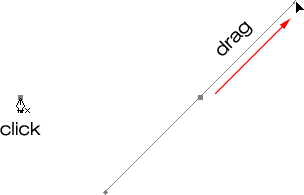
*Click anywhere inside the document with the Pen Tool, then drag a short distance away from the anchor point.*

When you're done, you'll see an anchor point with two lines extending out from it. At first glance, you may think we've somehow managed to drag out a path with the Pen Tool. After all, it looks like we have three anchor points, one on either end and one in the middle, with two path segments connecting them. If we look a bit closer though, we can see that the points on either end are a bit smaller than the one in the middle, and that they're actually a different shape. The one in the middle is square, and as we've seen, an anchor point is square, but the ones on either end seem to be diamond-shaped. Are some anchor points square and some diamond-shaped?

Nope. All anchor points are square, and they're all the same size, which means those smaller, diamond-shaped points on the ends are not anchor points. And if they're not anchor points, that means the lines are not path segments, since we need at least two anchor points to create a path and right now the only anchor point we have is the one in the middle. So what exactly are those lines then that are extending out from the anchor point? They're *direction handles*!

"Ah, direction handles!" you say. "Now I get it!"

... ... ................

"Wait, no I don't. What the heck are direction handles?"

Direction handles are, well, handles, and they're used only when creating curved path segments. There's no need for direction handles when creating straight path segments. There's usually two of them, although sometimes there's only one, and as we've already seen, they extend out from anchor points. They're called "handles" because, as we'll see in a moment, you can actually grab them and move them around.

Direction handles control two things. They control the *angle* of the curve, and they control the *length* of the curve, and they do it in a really neat way. The reason there's usually two of them is because one of them controls the angle and length of the curve coming *into* the anchor point, and the other controls the angle and length of the curve flowing *out from* the anchor point.

Before we look at how to draw curves with the direction handles, let's first see how to control the handles themselves, since our success with drawing curves will depend a lot on our ability to control the handles. Don't worry, it's not, as they say, rocket science. There's just a few simple things you need to learn. We've already seen how to create direction handles, by clicking with the Pen Tool and then dragging away from the anchor point. The further away from the anchor point we drag, the longer the direction handles will be. The longer the handle, the longer the curve. Short handle, short curve. Long handle, long curve.

One of the nice things you'll learn rather quickly about the Pen Tool is that it is *extremely* forgiving. There's no reason at all to worry about getting things right the first time when drawing paths with it because we can go back and fix things up easily when we're done! Did you place an anchor point in the wrong spot? No problem! Just move it where you need it! We'll see how to do that in a moment. Did you drag out a direction handle in the wrong direction? Not a problem. Grab the handle and rotate it into the direction you need. Again, we'll see how to do that. Is one of your direction handles too long or too short? No problem at all. Just click on it and then drag it longer or shorter as needed (yep, we're going to see how to do that, too). Paths are fully editable at all times, so there's absolutely no reason to worry about making a mistake or getting it right the first time. Doesn't that make you feel a little better already?

### Rotating And Resizing Direction Handles

As I mentioned, they're called direction "handles" because you can grab them like handles and move them around. Let's see how to do that. First, we'll look at how to *rotate both handles at the same time*. Using the anchor point and the two direction handles we've already created, hold down your *Ctrl* (Win) / *Command* (Mac) key. You'll see your Pen Tool icon temporarily turn into the *Direct Selection Tool* (the white arrow) icon, and that's because with the Pen Tool selected, holding "Ctrl/Command" becomes a quick shortcut for temporarily accessing the Direct Selection Tool which is what we use to select different parts of our path. Then simply click directly on the small diamond shape at the end of either of the direction handles (clicking on the "line" itself won't work, so you always need to click on the diamond shape at the end of a handle to do anything with it) and drag it around the anchor point to rotate it. As you rotate one of the handles, the other handle rotates along with it in the opposite direction, sort of like a see-saw. You may also notice that as soon as you start dragging the handle, your mouse cursor icon will change once again, this time into the *Move Tool* icon, since we're moving something from one spot to another:

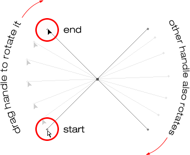
*Hold "Ctrl" (Win) / "Command" (Mac) and click on the end of either of the direction handles, then drag the handle to rotate it around the anchor point. As you drag one handle, the other rotates in the opposite direction.*

You can release your "Ctrl/Command" key once you've started dragging the handle. No need to keep it down the whole time.

To *resize a direction handle* as you're rotating it, simply drag the end of the handle in towards the anchor point to make it shorter or drag it away from the anchor point to make it longer. As I mentioned above, a shorter handle will make the curve shorter, and a longer handle will make the curve longer. You can't resize both handles at the same time though, so if you need to resize both of them, you'll need to drag each one longer or shorter separately. The only thing you can do to both of them at the same time is rotate them. If you've already released your mouse button after rotating the handles and the cursor has changed back into the Pen Tool icon and you need to resize one of the handles, you'll need to hold down "Ctrl/Command" once again to temporarily switch back to the Direct Selection Tool and then click and drag the end of the handle to resize it:

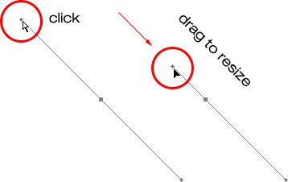
*Drag the ends of the handles in towards the anchor point to shorten them, or drag them away from the anchor point to make them longer.*

Now let's look at how to *rotate the handles independently of each other*. To rotate one handle without affecting the other one, first release your mouse button if you've been rotating or resizing the handles so your cursor changes back into the Pen Tool icon. Then, instead of holding down "Ctrl/Command", which moves both handles at once, hold down your *Alt* (Win) / *Option* (Mac) key and click on the end of either of the direction handles. You'll see your cursor change into the *Convert Point Tool* icon, which looks like a simplified arrow made of only two lines, almost like an upside down letter "v" (except that it's not quite upside down). Then, simply drag the handle around the anchor point to rotate it, just as you did before, and this time, the handle will rotate independently of the other one, breaking the connection between them:

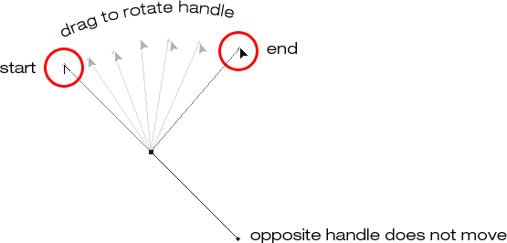
*Hold down "Alt" (Win) / "Option" (Mac) and click on the end of either of the direction handles, then drag the handle to rotate it around the anchor point independently of the other handle.*

Again, you can release your "Alt/Option" key after you've started dragging. You don't have to hold it down the whole time.

You can also *resize direction handles* using the "Alt/Option" key in exactly the same way as you can with the "Ctrl/Command" key. If you're in the process of rotating a handle, simply drag it in towards the anchor point to make it shorter or away from the anchor point to make it longer. If you've already released your mouse button and your cursor is showing the Pen Tool icon again, you'll need to hold down "Alt/Option" once again, then click on the end of the handle and drag it to resize it.

Is there a difference between resizing the handles using "Ctrl/Command" and using "Alt/Option" to do it? Yes there is. If you haven't yet "broken the connection" between the handles by dragging one independently of the other, resizing a handle using "Ctrl/Command" will keep the handles connected together. It won't resize both handles at once, but it won't break the connection between them either so you'll still be able to rotate them together if you need to. If you resize a handle using "Alt/Option", you'll break the connection between the handles. Even if you don't rotate the handle as you're resizing it, the connection will still be broken.

What if you've broken the connection between the handles by rotating them using "Alt/Option" and then want to rotate them together again? Can you "rebuild the connection", so-to-speak, by selecting one of them while holding down "Ctrl/Command" as before? Good question, and the answer is no. Once you've broken the connection between the handles, the "Ctrl/Command" key on its own won't bring it back. You'll need to select one of the handles while holding *Ctrl+Alt* (Win) / *Command+Option* (Mac) at that point in order to move the handles together again.

### Quick Summary So Far ...

We've covered a lot of information here about working with direction handles, so before we move on and start drawing some actual curves, let's do a quick recap:

- To *add an anchor point,* simply click with the Pen Tool.
- To *add an anchor point with direction handles extending out from it,* click with the Pen Tool, then drag away from the anchor point before releasing your mouse button. The further you drag, the longer the direction handles will be.
- To *rotate the direction handles together,* hold down *Ctrl* (Win) / *Command* (Mac), which will temporarily switch you to the *Direct Selection Tool*, then click on the end of either handle and drag it around the anchor point. The other handle will rotate in the opposite direction.
- To *rotate the direction handles independently,* hold down *Alt* (Win) / *Option* (Mac), which will temporarily switch you to the *Convert Point Tool*, then click on the end of either handle and drag it around the anchor point. The other handle will not rotate.
- To *resize handles without breaking the connection between them,* hold down *Ctrl* (Win) / *Command* (Mac) to switch to the *Direct Selection Tool*, then click on the end of either handle. Drag it towards the anchor point to make it shorter, or drag it away from the anchor point to make it longer.
- To *resize handles and break the connection between them,* hold down *Alt* (Win) / *Option* (Mac) to switch to the *Convert Point Tool*, then click on the end of either handle. Drag it towards the anchor point to make it shorter, or drag it away from the anchor point to make it longer.
- To *rotate the direction handles together after breaking the connection,* hold down *Ctrl+Alt* (Win) / *Command+Option* (Mac), then click on the end of either handle and drag it around the anchor point. The other handle will once again rotate with it.

Okay, that pretty much covers the basics of how to control the direction handles. Let's see how we can use them to draw some curves!

We've covered a lot of ground so far. We know about anchor points and direction handles. We know that in order to draw straight path segments, all we need to do is lay down a series of anchor points wherever we need them simply by clicking with the Pen Tool, and as we add more and more anchor points, we add more straight sections to our path. We know how to create direction handles and how to rotate them, either together or separately, and how to resize them.

We know how to turn a path into a selection by clicking on the "Load path as selection" icon at the bottom of the Paths palette or by simply pressing "Ctrl+Enter" (Win) / "Command+Return" (Mac) on the keyboard. One thing I didn't mention yet is that regardless of whether our path consists of straight lines,
curves, or a combination of straight lines and curves, converting it into a selection is done exactly the same way, and we've already learned how to do it, which means we're well on our way to mastering making selections with the pen! All we need to do is get a bit of practice drawing curves, which is exactly what we're about to do!

[Still scrolling? Download this tutorial as a PDF!](/print-ready-pdfs/)

### Drawing A Curve

Let's once again start fresh, either by opening up a new blank document in Photoshop or by deleting what you've already done. We're going to draw our first curve so we can put all of our newly-aquired direction handle knowledge to use. First, with the Pen Tool selected and the Paths option selected in the Options Bar, click once somewhere in your document to add an anchor point. Just click, don't click and drag. You should have one single anchor point on the screen when you're done.

Then, move your mouse cursor up and to the right of your initial anchor point. Click again to add a second anchor point, but this time, drag your mouse a little to the right of the anchor point to drag out direction handles. Hold down *Shift* as you drag to constrain your movement to a horizontal direction. As you drag out the direction handles, you'll see your path appearing as a curve between the two anchor points! The further you drag your mouse, the longer you make the direction handles, and the more of a curve you create:

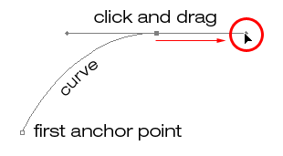
*Click once to add an anchor point, then click and drag out a second anchor point with direction handles, creating a curved path segment between the two points.*

Click down and to the right of the second anchor point to add a third anchor point. This time, don't click and drag, just click:

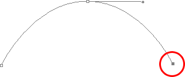
*Add a third anchor point down and to the right of the second one by clicking with the Pen Tool.*

As soon as you add the third anchor point, a second path segment will appear, joining the second anchor point with the third one. And because our second anchor point has direction handles extending from it, this new path segment is also curved! We now have a nice, smooth arc starting from the first point on the left, then passing through the anchor point with the direction handles up top, and coming to an end at the third point.

One thing you may have noticed, and you can see it in the screenshot above, is that when you added the third anchor point, the direction handle extending out the left side of the second anchor point disappeared. It's still there, Photoshop simply hid it from view. To see it again, use the keyboard shortcut we've already learned to temporarily switch to the *Direct Selection Tool*, which is by holding down the *Ctrl* (Win) / *Command* (Mac) key, and then click on the second anchor point to select it. As soon as you do, the missing direction handle reappears as if it was there the whole time (which it was):

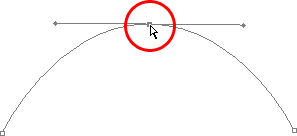
*Hold down the "Ctrl" (Win) / "Command" (Mac) key to temporarily switch to the Direct Selection Tool, then click on the top anchor point to select it. The missing anchor point reappears.*

With your "Ctrl/Command" key still held down so you still have access to the Direct Selection Tool, try resizing each direction handle by clicking on the end of each one to select it and then dragging it towards and away from its anchor point. Again, hold "Shift" as you drag to constrain your movement horizontally, and watch what happens. As you increase the length of a handle, you get more of a curve, and as you decrease its length, you get less of a curve. Also notice that each handle controls its own side of the curve. The handle on the left controls the curve coming into the anchor point from the left, and the handle on the right controls the curve flowing out from the anchor point on the right.

Here, I've made my handle on the left shorter, and as we can see, there's much less of a curve now than there was originally, almost becoming a straight line. I've also made the handle on the right longer, and as a result, the curve on the right is now much more pronounced. The faint curve is the original for comparison:

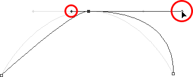
*Change the shape of the curves by resizing the direction handles. The left handle controls the left curve, and the right handle controls the right curve.*

I'm going to undo my changes by pressing *Ctrl+Alt+Z* (Win) / *Command+Option+Z* (Mac) a couple of times to set my direction handles back to their original sizes so they're equal length once again. Now let's try rotating the handles. Hold down "Ctrl/Command" once again to access the Direct Selection Tool, then click on the end of either handle to select it and try rotating it around the anchor point. Since we selected the handle with "Ctrl/Command", both handles rotate together. Here I've dragged my left handle down and to the right, and the angle of the curve on the left changed along with it, now appearing as more of a slope as it rises up towards the anchor point. By dragging the left handle down and to the right, I caused the right handle to rotate up and to the left, and again, the angle of the curve on the right changed along with it, now rising above the anchor point briefly before making a steep decent down to the anchor point on the right. Again, the faint curve is the original for comparison:

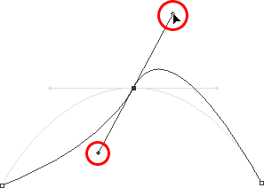
*Rotate the direction handles to change the angle of the curves. Select a handle while holding "Ctrl" (Win) / "Command" (Mac) to rotate both handles together.*

*The Dreaded "Loop"*
One thing you want to avoid is rotating the handles too far, which will cause your path segments to overlap and create loops. Here, I've rotated my handles all the way around so that the left handle is now on the right and the right handle is on the left, and notice what's happened. My path segments are now overlapping each other, creating a loop:

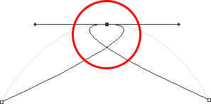
*Rotating the direction handles too far causes the path segments to overlap, creating an unwanted loop in the path.*

Loops can be caused by rotating the direction handles too far, as I've done above, but more often than not, they're caused by a handle being too long, making the curve too long and causing it to overlap with itself. If that happens, which it does sometimes as you're drawing a path, simply shorten the length of the direction handle. Most people end up creating a whole bunch of loops in their path when they first start working with the Pen Tool, so don't think you're the only one. No need to panic or become frustrated though. As I said, the problem is most likely being caused by a direction handle being too long, and all you need to do is shorten the handle to "un loop" the loop!

I'm going to press *Ctrl+Alt+Z* (Win) / *Command+Option+Z* (Mac) a few times once again to undo my changes and reset my path back to the nice smooth arc I started with. Now, what about rotating the direction handles independently of each other? As we learned on the previous page, to rotate the handles separately, instead of selecting them with "Ctrl/Command", we simply select them while holding down *Alt* (Win) / *Option* (Mac), which gives us temporary access to the *Convert Point Tool*. Click on the end of a handle to select it, then drag it with your mouse to rotate it and this time, the other handle will stay in place, breaking the connection between them.

Here, I've selected the handle on the right while holding "Alt/Option" and then rotated it down and to the left. Notice how once again, the angle of the path segment on the right changes to match the new direction of the handle, and this time, the handle on the left, along with the path segment on the left, both stay in place. My path now looks a bit like a shark fin:

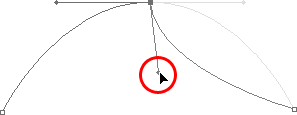
*Hold down "Alt" (Win) / "Option" (Mac) to temporarily access the "Convert Point Tool", then click on the end of a direction handle to select it and rotate it independently of the other handle.*

### Moving An Anchor Point

One thing we haven't looked at yet is how to move an anchor point. If you recall, I mentioned on the previous page that the Pen Tool is extremely forgiving, and one of the reasons for it, besides being able to rotate and resize our direction handles after we've created them, is that we can easily move anchor points from one spot to another if we need to. As we've already learned, anchor points *anchor* a path into place. The anchor points themselves, however, are *not* anchored into place. You can move an anchor point anywhere, anytime, and any path segments that are connected to it will move and adjust right along with it.

To move an anchor point, hold down *Ctrl* (Win) / *Command* (Mac) to temporarily access the Direct Selection Tool as we've already been doing, then simply click on the anchor point to select it and drag it to its new location with your mouse. Any path segments connected to it will move with it to the new location. Here, I've dragged my middle anchor point down a bit from its original location (again, the faint path marks the original location for comparison). Notice how the path itself has changed shape to adjust to the new location of the anchor point:

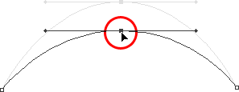
*Hold down "Ctrl" (Win) / "Command" (Mac) and click on an anchor point to select it, then drag it to a new location. Any path segments connected to the point will move with it, changing shape as needed.*

Normally, when outlining an object with a path to select it using the Pen Tool, you won't need to move to an anchor point quite as far as what I've done above, but it's very common to go back around your path after you've created it and nudge a few anchor points here and there to fine-tune the path. Once you've selected an anchor point, you can nudge it up, down, left or right using the *arrow keys* on your keyboard.

### Combining Straight Paths With Curves

What if I didn't want both of my path segments to be curves? What if what I needed was for the first path segment to be curved, but the second one needed to be straight? Let's see how to do that. I'm going to delete my existing path and start over again. First, I'll click to add an anchor point to start things off. Then, just as before, I'll click to add a second anchor point up and to the right of my initial point, and this time, I'll drag out direction handles, which will create a curved path connecting the two points, giving me exactly what I had way up at the start of this page:

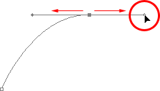
*Click once to add an anchor point, then click to add a second anchor point and drag out direction handles to create a curve.*

I now have my initial curve, but I want my next path segment to be straight. If I was to simply click somewhere to add another anchor point right now, I would get another curve because I have that direction handle extending out from the right side of the last anchor point I added. What I need to do is get rid of that one direction handle. Without a direction handle controlling the angle and length of a curve, we get a straight line.

To remove the handle, leaving only the handle on the left of the anchor point, all I need to do is hold down *Alt* (Win) / *Option* (Mac), which will again temporarily switch me to the *Convert Point Tool*, and then I just click directly on the anchor point. When I do, the direction handle on the right disappears, leaving only the one on the left:

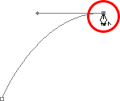
*Hold down "Alt" (Win) / "Option" (Mac) and click directly on the anchor point to remove the direction handle on the right, leaving only the one on the left.*

Now, with the direction handle gone, if I click to add a new anchor point, I get a straight path segment between the two points:

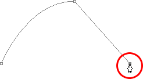
*With the direction handle on the right now gone, clicking to add a new anchor point adds a straight path segment between the two points.*

I now have a curved path segment on the left and a straight one on the right! What if I wanted the exact opposite? Suppose I needed to start with a straight path segment and then follow it with a curve? To do that, first I'll start by clicking to add an initial anchor point. Then, since I want a straight path segment, all I need to do is click somewhere else to add a second anchor point, and I automatically get a straight path connecting the two points:

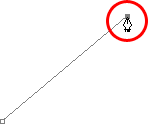
*Click with the Pen Tool to add an initial anchor point, then click again somewhere else to add a second anchor point and create a straight path segment between them.*

I'm going to keep my mouse button held down after clicking to add my second anchor point because I want my next path segment to be curved, and we know that in order to create a curve, we need a direction handle. To add a handle extending out from the right of my anchor point, I'm going to hold down *Alt* (Win) / *Option* (Mac), and with my mouse button still down, I'm simply going to to drag to the right of the anchor point. As I do, a direction handle will drag out along with it:

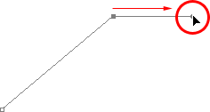
*Hold down "Alt" (Win) / "Option" (Mac) and drag out a direction handle on the right of the anchor point.*

Notice that the direction handle extended only from the right of the anchor point, not from both sides, leaving my straight path segment on the left in place. And now that I have my direction handle on the right, all I need to do to create my curve is click to add a third point:

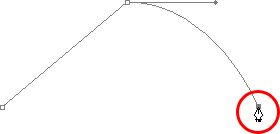
*Click to add a third anchor point, which creates a curved path segment between the previous anchor point and the new one.*

And there we go! I now have a straight path segment on the left, followed by a curved segment on the right. Of course, most paths you draw are going to consist of more than just three anchor points. Let's say I wanted to continue this path, moving in the same general direction towards the right, and I want my next path segment to be curved as well. Just as I did a moment ago, I would leave my mouse button held down after clicking to add my third point. I would hold down *Alt* (Win) / *Option* (Mac) and I would drag out another direction handle. So far, we've only been dragging handles out towards the right, but what you really want to do is drag your handles out in the general direction you want the curve to follow. I want to create a curve that goes up and to the right, so I'm going to drag out a small handle in that same general direction:

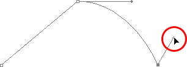
*Drag out your direction handles in the general direction of the curve.*

*Tip!* A good practice to get into is to keep your direction handles small when first dragging them out, since you never really know how long or at what exact angle they need to be until the actual curve appears, and the curve doesn't appear until you've added both of its anchor points. Once you've added both points and the curve appears, you can easily go back and make any adjustments you need to the handles. You may even want to wait until you've drawn the entire path before worrying about adjusting the handles.

With my direction handle created, I'm going to click to add a fourth anchor point, and I'm going to drag out direction handles from it as well:

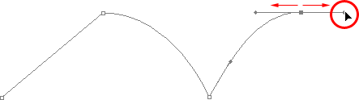
*Adding a fourth anchor point along with direction handles extending from it.*

I now have a third segment added to my path, this one being a curve. Notice that this curve actually has *two* direction handles controlling it, one extending from the right of my third anchor point and one extending from the left of my fourth point:

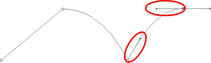
*The third path segment now has two direction handles, one on either end, working together to control the curve.*

The overall shape of this curve is now being controlled by the length and direction of both of these handles. Watch what happens to the curve when I move the handles. I'll drag the bottom handle down and to the right, and I'll drag the top handle up and to the left. I'll also drag both of these handles longer. The faint curve is the original for comparison:

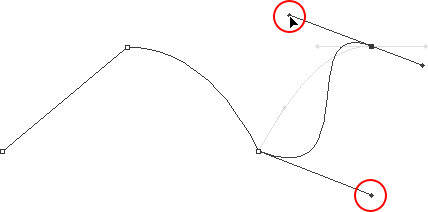
*Changing the direction and/or length of either handle changes the overall shape of the curve. After rotating and lengthening both handles, the curve now appears in an "S" shape.*

The curve is now a bit "S" shaped, and that's because the bottom handle is controlling the angle and length of the curve as it flows out from the third anchor point, while the top handle is controlling the angle and length of the curve as it flows into the fourth point. Changing the length and/or direction of either handle will change the overall shape of the curve.

I'm going to press *Ctrl+Alt+Z* (Win) / *Command+Option+Z* (Mac) a couple of times to undo the changes I made, so the curve is once again in a simple arc shape as it was a moment ago, and I think I'll finish off this path with another straight segment, which means I'll need to remove that direction handle extending out from the right side of the fourth anchor point. We've already learned how to do that, by holding down *Alt* (Win) / *Option* (Mac) and clicking directly on the anchor point itself:

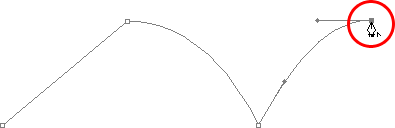
*Hold down "Alt" (Win) / "Option" (Mac) and click directly on the anchor point to remove the direction handle on the right.*

With the direction handle gone, all I need to do now to add a straight path segment is click to add another anchor point:

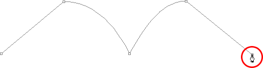
*The direction handle on the right is now gone, so we can add a straight path segment simply by clicking to add another anchor point.*

We could continue this path for as long as we wanted, adding more straight segments and curves, but I think we'll stop here because we've pretty much covered everything we need to know about drawing paths with the Pen Tool at this point. That was a lot of information to take in, especially if this is your first time learning about paths. As I mentioned at the beginning, you won't become a Pen Master simply by reading through this tutorial, just as you won't learn how to ride a bike, or drive a car, learn to swim, or play the piano simply by reading about it. But hopefully you have some sense at this point of how to draw paths with the Pen Tool, how to draw straight path segments, how to draw curves by dragging out direction handles, how to change the length and angle of the curve by rotating and resizing the handles, and how to combine straight and curved segments in a path.

To finish off our look at making selections with the Pen Tool, let's see a practical example of how to select an object with curves.

Here, we have a photo of a couple of dolphins leaping out of the water. Definitely a couple of very curvy creatures:

*A photo of two dolphins jumping out of the water.*

Let's say we want to select these dolphins so we can use them for a design or a collage, or whatever the case may be. If you were to try selecting them with the Lasso Tool, which is most likely what you would end up using if you didn't know how to use the Pen Tool, not only would you have a tough time, you'd have an even tougher time trying to convince yourself that you were happy with the results when you were done. The reason is because the Lasso Tool simply isn't capable of making curved selections very well. The biggest problem with it, besides being a pixel-based selection tool, is that it relies on you having a steady enough hand to move it smoothly around the curves. Even if you don't suffer from a caffeine addiction, you could drive yourself crazy trying to draw a perfectly smooth curve with your mouse, or even with a pen tablet, and when you've finally given up, you'll still be left with a selection full of rough, jagged edges that just scream "amateur!". No one likes to be called an amateur, especially when there's no need for it thanks to the Pen Tool!

*Examine The Object First*
Whenever you're about to select something with the Pen Tool, before you begin, take a moment to examine the object carefully to get a sense of where you're going to need to place your anchor points. Forget about all the details in the object and focus only on its shape. Where are the areas where the shape changes direction? Which parts of the shape are straight? Which parts are curved? If there's a curve, is it a smooth, continuous arc or does the angle change at a spot along the curve? Visualize in your mind where you're going to need to place your anchor points, because when you place one, you always want to be thinking about the next one and what the path segment between the two points needs to look like.

*A Tool Of Elegance*
One more thing to keep in mind is that the Pen Tool is meant to be a tool of elegance. It's not a nail gun or a staple gun. You don't want to just go clicking around your shape adding anchor points all "willy nilly" (that's a technical term). When using it to draw curves, you want those curves to be nice and smooth, otherwise we might as well just stick with the Lasso Tool. To keep the curves flowing smoothly, we need to limit the number of anchor points we use to create them. That's why you want to take a moment to examine the object first and visualize where the anchor points need to be. If you can outline a large section of the shape using only one curve with an anchor point on either end, that's what you want to do, because that's what's going to give you the kind of results you're looking for. The kind of results that scream "definitely *not* an amateur!".

Let's select these dolphins. I'm going to start my path in the middle of the photo, at the spot where the side of the dolphin on the left overlaps the rear flipper of the dolphin on the right. There's no right or wrong place to begin a path. This is just where I've decided to start. The first part of that rear flipper is straight, so since I don't need a direction handle to create a straight path segment, I'm simply going to click once with my Pen Tool to add my first anchor point, which will serve as the starting point for my path:

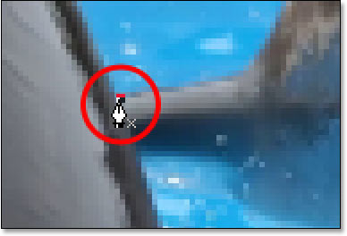
*Adding the first anchor point.*

As I mentioned earlier, you'll probably find it helpful to zoom in on your image as you're drawing your path. To scroll the image around on the screen as you're zoomed in, hold down the *spacebar*, which will switch you temporarily to the *Hand Tool* and allow you to move the image around on the screen by clicking and dragging it.

The top of that flipper actually has a slight curve to it as it approaches the dolphin's tail section, so for my second anchor point, I'm going to click at the point where the flipper and tail section meet, and I'm going to drag out short direction handles, dragging up and to the right in the direction that the tail section is moving. Notice that I've now created a slight curve along the flipper:

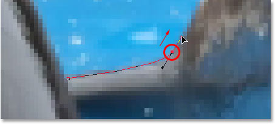
*Adding the second anchor point and dragging out small direction handles to add a slight curve to the first path segment.*

As I continue up along the tail, I can see that it stays straight for a short distance, followed by a curve to the right, so I'm going to click to add a third anchor point at the spot where the curve begins. This gives me a straight path segment between the previous point and the new one. I know there's a short direction handle extending out from the previous anchor point, which normally means that my new path segment will be a curve, not a straight section, but because the handle is so short and is also moving in the same direction as the path segment, there is no noticeable curve to it. Consider it a "mostly straight" path segment:

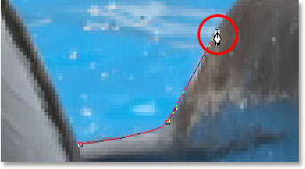
*Clicking to add the third anchor point, creating a (mostly) straight path segment.*

Continuing along, we come to the first real curve in our path. For this, I'm going to need to drag out a direction handle from the anchor point I just added, so I'm going to hold down *Alt* (Win) / *Option* (Mac), then drag out a handle in the general direction where I want the curve to flow as it starts. Notice how I'm only dragging out a handle from the one side of the anchor point, not both:

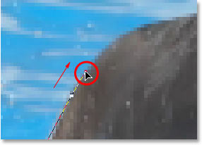
*Hold "Alt" (Win) / "Option" (Mac) to drag out a direction handle from one side of an anchor point.*

To add the curve, I'll click and drag at the spot where the curve ends, shaping the curve as I drag out the handles until it matches the curve of the dolphin's tail. If I needed to, I could also go back and change the length and direction of the handle at the start of the curve to fine-tune it, but in this case, I don't need to do that:

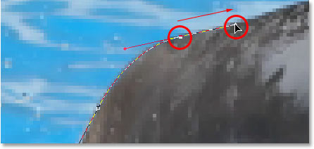
*Adding an anchor point at the opposite end of the curve and dragging out direction handles from it, rotating and resizing them as needed until the curve matches the curve of the object.*

The next area of the dolphin is pretty straight, right up until its back begins to merge with its dorsal fin, at which point there's another curve, so I'm going to click to add an anchor point just before the curve up the dorsal fin begins, which is going to give me another "mostly straight" path segment between the previous point and the new point. Then I'm going to once again hold down *Alt* (Win) / *Option* (Mac) and drag out a direction handle as I prepare for my next path segment which will be curved:

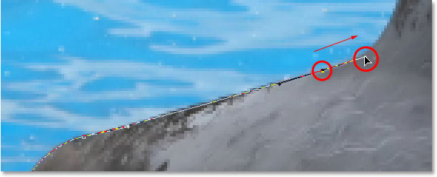
*Click to add an anchor point, then hold down "Alt" (Win) / "Option" (Mac) and drag out a direction handle to prepare for the next path segment.*

The left side of the dorsal fin consists mainly of one continuous curve upward until it gets near the very top, at which point the shape changes, so to create this curve, I'm going to click and drag at the point near the top where the curve will change direction. As we can see in the screenshot, this adds a curved path segment between the previous anchor point and the new one, but the curve is not yet following along the shape of the fin. It's going to need some fine-tuning:

![Adding a curve along the left side of the dorsal fin.](