# Using the Perspective Crop Tool in Photoshop

> Source: [https://www.photoshopessentials.com/basics/perspective-crop-tool-photoshop/](https://www.photoshopessentials.com/basics/perspective-crop-tool-photoshop/)
> Downloaded and converted to Markdown.

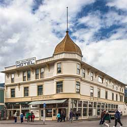

Learn how to crop your images and fix perspective distortions at the same time using the Perspective Crop Tool in Photoshop! For Photoshop CC and CS6.

Whenever we photograph our subject on an angle, we get what's called *keystone distortion*, or *keystoning*. This means that, rather than the edges of our subject looking straight and perpendicular, they look as if they're leaning back or tilting inward towards the horizon. To fix the perspective, and crop the image at the same time, we can use Photoshop's Perspective Crop Tool. And in this tutorial, I'll show you how it works!

Adobe first added the Perspective Crop Tool in Photoshop CS6. I'll be using [Photoshop CC](https://prf.hn/l/dlXjD2w) here but CS6 users can also follow along.

Let's get started!

## A little perspective on the problem

Here's a photo I've opened in Photoshop that has some issues with perspective. Because the photo was shot from the ground and looking up at the hotel, the building seems to be leaning back as it rises upward, making the top look more narrow than the bottom. And the smaller building to the left of the hotel also looks like it's leaning backwards. In fact, *everything* in this photo seems to be tilting inward towards some imaginary center point high above the image:

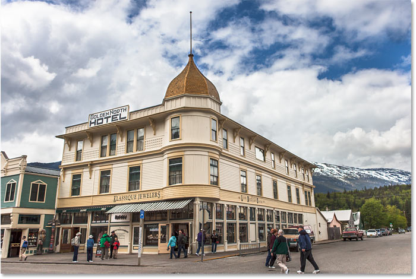
*Photos of buildings often suffer from perspective distortion. Photo credit: Steve Patterson.*

## How to fix the perspective with the Perspective Crop Tool

Let's see how the Perspective Crop Tool can fix this problem.

### Step 1: Select the Perspective Crop Tool

You'll find the Perspective Crop Tool nested in behind the standard Crop Tool in the [Toolbar](/basics/photoshop-tools-toolbar-overview/). To get to it, click and hold the Crop Tool's icon until a fly-out menu appears showing the other tools also available in that spot. Then choose the **Perspective Crop Tool** from the list:

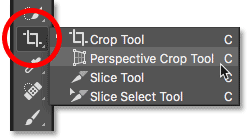
*Click and hold on the standard Crop Tool to access the Perspective Crop Tool.*

[Related: How to customize the Toolbar in Photoshop](/basics/custom-toolbar-photoshop/)

### Step 2: Draw a crop border around the image

Unlike Photoshop's standard [Crop Tool](/basics/how-to-crop-images-photoshop-cc/), the Perspective Crop Tool does *not* automatically place a cropping border around the image. So the first thing we need to do is draw one ourselves. To do that, I'll click in the top left corner of the photo and, with my mouse button held down, I'll drag diagonally downward to the bottom right corner:

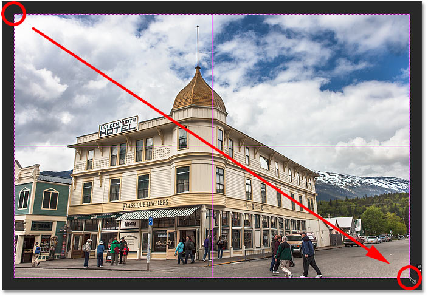
*Click and drag out an initial crop box around the image.*

I'll release my mouse button, at which point Photoshop adds a crop border around the image. And just like we'd see with the standard Crop Tool, *handles* appear around the border. There's one at the top, bottom, left and right, and one in each corner:

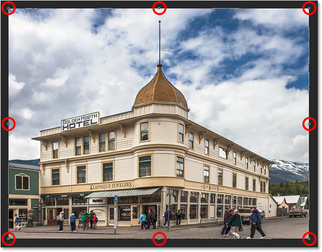
*The handles around the crop border.*

#### The Perspective Grid

Notice that a grid also appears inside the crop border. This is the *perspective grid*, and it's what allows us to fix our perspective problem, as we'll see in a moment:

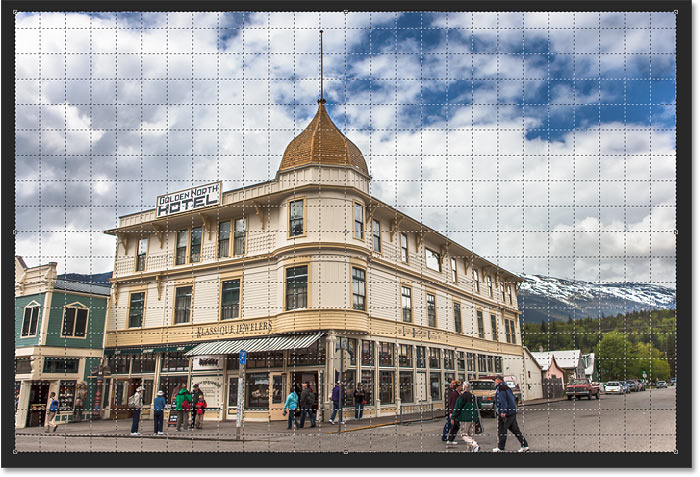
*The perspective grid inside the crop border.*

If you're not seeing the grid, make sure you have the **Show Grid** option selected (checked) in the Options Bar along the top of the screen:

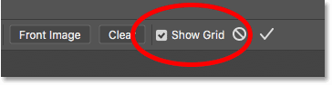
*Make sure "Show Grid" is selected.*

### Step 3: Line up the perspective grid with the edges of your subject

To fix the perspective problem, all we need to do is drag the corner crop handles left or right to line up the vertical grid lines with something in the image that should be vertically straight. For example, with my photo, the sides of the hotel should be straight. So to correct the perspective, I'll drag the corner handles inward until the grid lines and the sides of the building are tilting at the same angles.

I'll start by dragging the handle in the **top left corner** towards the right until the vertical grid line closest to the left side of the hotel lines up with the angle of that side of the building. As I drag the handle, I'll also press and hold my **Shift** key. This makes it easier to drag the handle straight across horizontally:

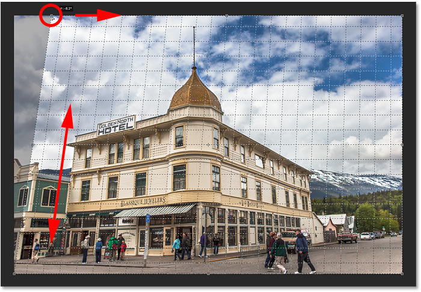
*Matching the perspective grid line with the left side of the building.*

Then I'll drag the handle in the **top right corner** towards the left until the vertical grid line closest to the right side of the hotel is tilting at the same angle as that side of the building. Again, I'll press and hold my **Shift** key as I drag so it's easier to drag straight across:

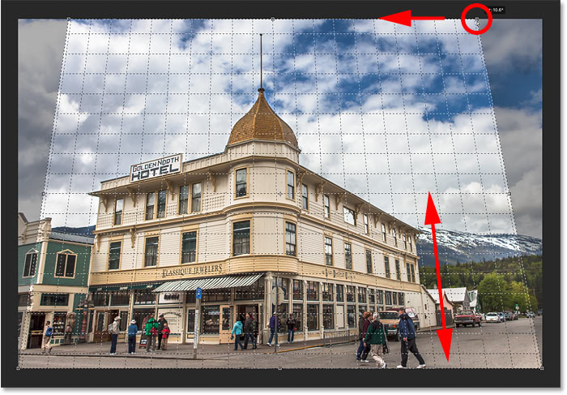
*Matching the grid line with the right side of the building.*

Adjusting the grid line on one side of your subject may throw off the other side, so you may need to go back and forth a bit with the handles. But after a bit of fine-tuning, you should have both sides of the grid lined up with something that should be vertically straight. You can also drag the handles in the bottom left and right corners of the crop border if you need to, but in my case it wasn't necessary.

Just like with the standard Crop Tool, the darker areas outside the crop border will be cropped away once the crop is applied:

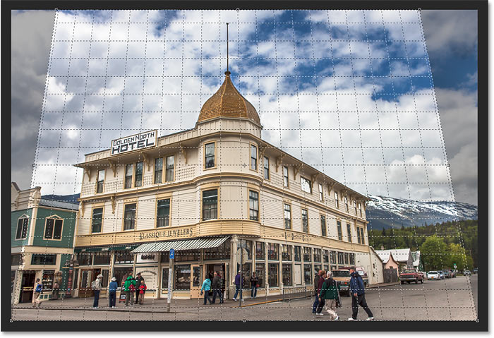
*To fix the perspective, the shaded areas outside the crop border will be tossed away.*

### Step 4: Adjust the crop border

Once you've lined up the grid lines with the angles of your subject, you can drag the top, bottom, left or right handles to reshape the crop border and crop away more of the image. Here, I'm dragging the left and right sides inward:

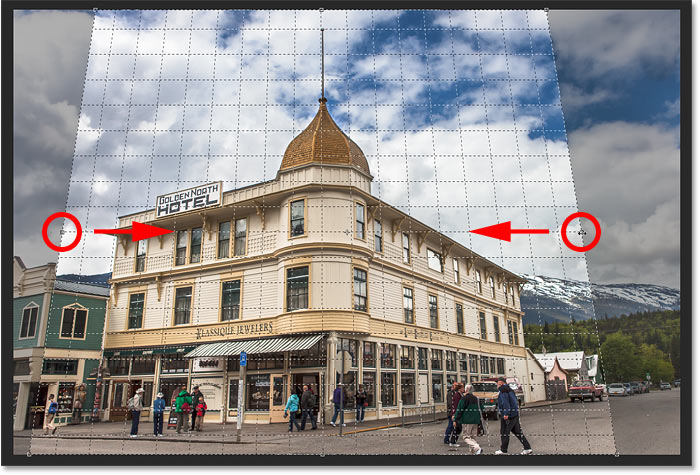
*Making further adjustments to the crop border.*

### Step 5: Apply the crop

When you're ready to crop the image, click the **checkmark** in the Options Bar. Or press **Enter** (Win) / **Return** (Mac) on your keyboard:

*Clicking the checkmark to apply the perspective crop.*

Photoshop instantly crops away the area outside the crop box and fixes the perspective problem in one shot. The hotel in my photo, as well as everything else that was tilted, now appears vertically straight.

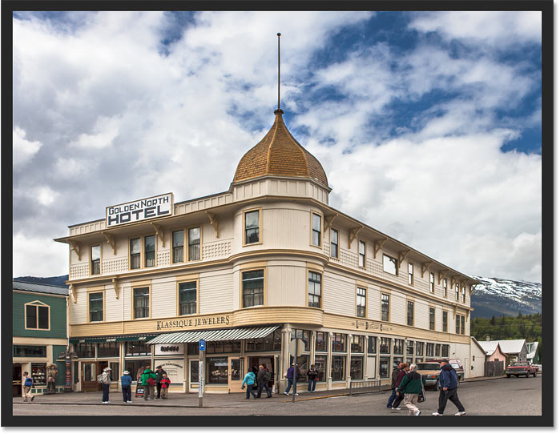
*The hotel is no longer leaning backwards.*

One problem with the Perspective Crop Tool is that it's not an exact science. After you've applied the crop, you may find that your image still looks a bit "wonky" (technical term), and that's because the angles of your grid lines didn't quite match up with your subject. If that happens, undo the crop by pressing **Ctrl+Z** (Win) / **Command+Z** (Mac) on your keyboard and then try again. It may take a couple of tries, but stick with it and you'll get it right.

## How to fix the "squished" look after correcting the perspective

Another problem you may run into with the Perspective Crop Tool is that everything in your image may look a bit vertically "squished" after applying the crop. In my case, the hotel no longer looks as tall as it did originally, and the people walking in front of it all look shorter. We can fix this problem by stretching the image using Photoshop's [Free Transform](/basics/photoshops-free-transform-essentials/) command.

### Step 1: Unlock the Background layer

Before we do that, we first need to look at the [Layers panel](/basics/layers/layers-panel/) where we see that my photo is currently sitting on the [Background layer](/basics/background-layer-photoshop-cc/):

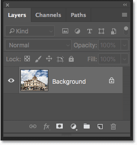
*The Layers panel showing the image on the Background layer.*

The problem is that Photoshop won't let us use Free Transform on a Background layer. But the easy solution is to simply rename the layer. In Photoshop CC, click on the **lock icon**. In CS6, press and hold the **Alt** (Win) / **Option** (Mac) key on your keyboard and **double-click** on the Background layer. This will instantly rename the layer to "Layer 0":

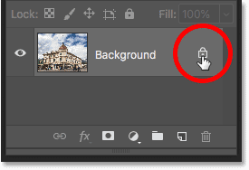
*Unlocking the Background layer.*

### Step 2: Choose the Free Transform command

With the layer renamed, go up to the **Edit** menu in the Menu Bar and choose **Free Transform**:

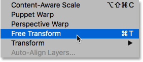
*Go to Edit > Free Transform.*

### Step 3: Stretch the image vertically

Photoshop places the Free Transform box and handles around the image. To stretch the image, I'll click on the **top handle** and, with my mouse button held down, I'll drag it straight up. Again, this isn't an exact science so all we can really do is eyeball it. But I'll drag the handle upward until the hotel and the people in the photo all look roughly as tall as they should be. Or in this case, as tall as I can make them without losing the very top of the building:

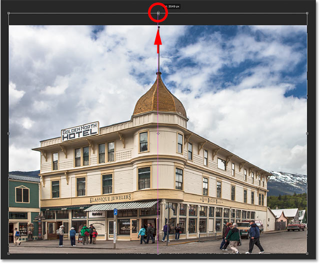
*Stretching the photo vertically to restore the height.*

### Step 4: Click the checkmark

When you're happy with the results, click the **checkmark** in the Options Bar to apply the transformation. You can also apply it by pressing **Enter** (Win) / **Return** (Mac) on your keyboard:

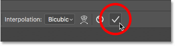
*Clicking the checkmark in the Options Bar to apply the Free Transform command.*

And with that, we're done! Here for comparison is my original image once again with the perspective problem:

*The original photo with the original problem.*

And here, after correcting the perspective, cropping the image and "unsquishing" it with Free Transform, is my final result:

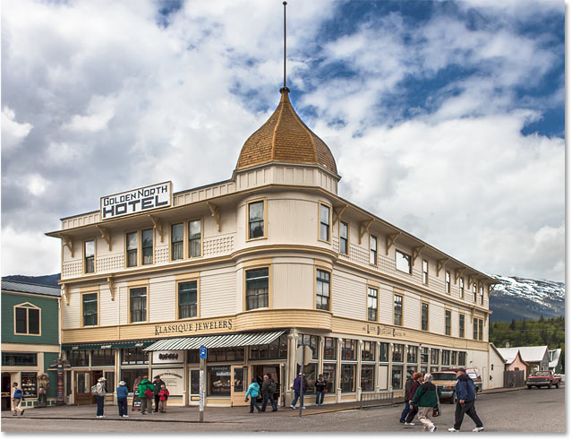
*The final result.*

And there we have it! That's how to crop images and fix perspective distortions at the same time using the Perspective Crop Tool in Photoshop! In the next lesson, I show you how the Crop Tool makes it easy to crop and resize your photos to [match any frame size](/basics/crop-and-resize-photos-to-match-frame-sizes-with-photoshop-cc/) you need!

You can jump to any of the other lessons in this [Cropping Images in Photoshop](/basics/cropping-images-in-photoshop-complete-lesson-guide) series. Or visit our [Photoshop Basics](/basics/) section for more topics!