# The Background Layer In Photoshop CS5

> Source: [https://www.photoshopessentials.com/basics/photoshop-background-layer/](https://www.photoshopessentials.com/basics/photoshop-background-layer/)
> Downloaded and converted to Markdown.

*Before we begin...* This version of our Background Layer tutorial is for Photoshop CS5 and earlier. If you're using Photoshop CS6, please see our updated [Background Layer](/basics/layers/background-layer/) tutorial. For Photoshop CC, see our [Background Layer in Photoshop CC](/basics/background-layer-photoshop-cc/) tutorial.

In the previous tutorial, we learned the essential skills for working with layers inside Photoshop's [Layers panel](/basics/layers/layers-panel/). We learned how to add new layers, delete layers, move layers above and below each other, how to add adjustment layers and layer styles, change a layer's blend mode and transparency level, and much more, all from within the Layers panel!

But before we get into more of the amazing things we can do with layers, there's one special type of layer we need to look at, and that's the **Background layer**. The reason we need to learn about it is because there's a few things we can do with normal layers that we can't do with the Background layer, and if we're not aware of them ahead of time, they can easily lead to confusion and frustration.

Here's an image of a photo frame that I've just opened in Photoshop.

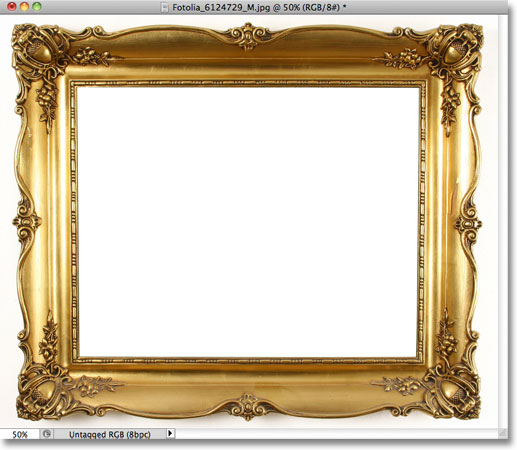
*The original image.*

Whenever we open a new image in Photoshop, it opens inside its own document and Photoshop places the image on its own layer named Background, as we can see by looking in my Layers panel. Notice that the word Background is written in italics, which is Photoshop's way of telling us there's something special about this particular layer:

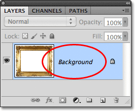
*The Layers panel showing the image on the Background layer.*

Photoshop names this layer Background for the simple reason that it serves as the background for our document. Any additional layers we add to the document will appear above the Background layer. Since its whole purpose is to serve as a background, there's a few things Photoshop won't allow us to do with it. Let's take a quick look at these few simple rules we need to remember. Then, at the end of the tutorial, we'll learn an easy way to get around every single one of them!

### Rule 1: We Can't Move The Contents Of A Background Layer

One of the things we can't do with a Background layer is move its contents. Normally, to move the contents of a layer, we grab the **Move Tool** from the top of the Tools panel:

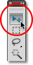
*Selecting the Move Tool from the Tools panel.*

Then we simply click with the Move Tool inside the document and drag the contents around with our mouse. Watch what happens, though, when I try to drag the photo frame to a different location. Photoshop pops open a dialog box telling me it can't move the contents because the layer is locked:

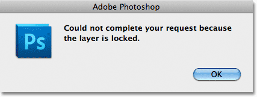
*Instead of moving the photo frame, Photoshop informs me that the layer is locked.*

If we look again at the Background layer in my Layers panel, we can see a small **lock icon**, letting us know that sure enough, this layer is locked in place and we can't move it. There's no way to unlock a Background layer, but as I said, at the end of the tutorial, we'll see how to get around this little rule of not being able to move its contents, as well as how to get around the other rules we're about to look at:

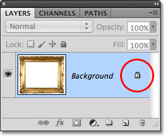
*The lock icon lets us know that some aspect of this layer is locked.*

### Rule 2: No Transparent Pixels

In a moment, I'm going to import another image into my document and place it inside my photo frame, but the center of the frame is currently filled with white, which means I need to delete that white area before I can place my photo inside of it. Normally, when we delete pixels on a layer, the deleted area becomes transparent, allowing us to see through it to the layer(s) below. Let's see what happens, though, when I try to delete something on the Background layer.

First, I need to select the area inside the frame, and since it's filled with solid white, I'll use the [**Magic Wand Tool**](/basics/layers/../selections/magic-wand-tool/). In Photoshop CS2 and earlier, we can select the Magic Wand just by clicking on its icon in the Tools panel. In Photoshop CS3 and higher (I'm using Photoshop CS5 here), the Magic Wand is hiding behind the [Quick Selection Tool](/basics/layers/../selections/quick-selection-tool/), so click on the Quick Selection Tool and hold your mouse button down for a second or two until a fly-out menu appears showing the other tool(s) nested behind it, then select the Magic Wand Tool from the list:

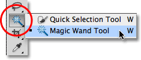
*Selecting the Magic Wand Tool.*

With the Magic Wand Tool in hand, I'll click anywhere inside the center of the frame to instantly select the entire white area. A selection outline appears around the edges letting me know the area is selected:

*The white area inside the frame is now selected.*

To delete the area inside the frame, I'll press **Backspace** (Win) / **Delete** (Mac) on my keyboard, but instead of deleting the area and replacing it with transparency as we'd expect on a normal layer, Photoshop mysteriously pops open the **Fill** dialog box so I can choose a different color to fill the area with:

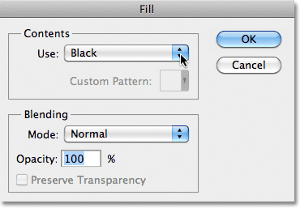
*Instead of deleting the area, Photoshop pops open the Fill dialog box.*

I'll click Cancel to close out of the Fill dialog box since that wasn't at all what I wanted to do. What I wanted to do was delete the white area inside the frame, not fill it with a different color. Maybe Photoshop just got confused, so I'll try something different. I'll go up to the **Edit** menu in the Menu Bar along the top of the screen and choose **Cut**:

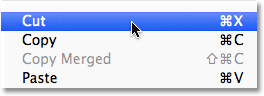
*Selecting Cut from the Edit menu.*

On a normal layer, this would cut the selected area from the layer, leaving a transparent area in its place, yet once again, we get an unexpected result. This time, as if its purposely messing with me, Photoshop fills the area with black:

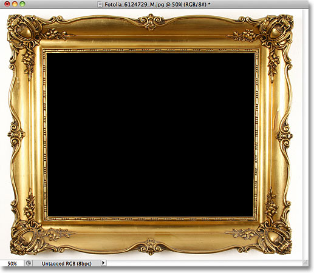
*The white area inside the frame is now filled with black.*

Say what? Where did the black come from? As it turns out, Photoshop filled the area with black because if we look at my Foreground and Background **color swatches** near the bottom of the Tools panel, we see that my **Background color** (the lower right swatch) is currently set to black, and Photoshop filled the area with the Background color. If my Background color had been set to purple, it would have filled the area with purple. It just happened to be set to black:

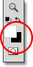
*The Foreground (upper left) and Background (lower right) color swatches.*

So why won't Photoshop delete the white area inside the frame? Why does it keep wanting to fill it with a different color instead? The reason is because **Background layers don't support transparency**. After all, since the Background layer is supposed to be the background of the document, there shouldn't be any need to see through it because there shouldn't be anything behind it to see. The background is, after all, the background! No matter how I try, I will never be able to delete the area inside the center of the frame as long as the image remains on the Background layer. How, then, will I be able to display another photo inside the frame? Let's leave this problem alone for the time being. We'll come back to it a bit later.

### Rule 3: We Can't Move The Background Layer Above Another Layer

Here's the photo I want to place inside my photo frame.

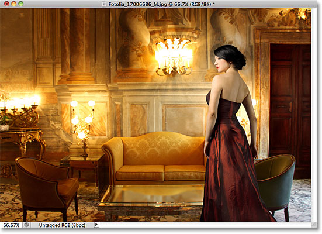
*The image that will be placed inside the frame.*

The image is currently open inside its own document window, so I'll quickly copy it into the photo frame's document by pressing **Ctrl+A** (Win) / **Command+A** (Mac) to select the entire photo, then I'll press **Ctrl+C** (Win) / **Command+C** (Mac) to copy the image to the clipboard. I'll switch over to the photo frame's document, then I'll press **Ctrl+V** (Win) / **Command+V** (Mac) to paste the image into the document. Photoshop places the image on a new layer named "Layer 1" above the photo frame on the Background layer:

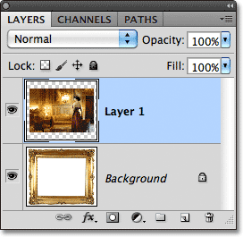
*The second photo is placed on its own layer above the Background layer.*

And we can see the new photo appearing in front of the frame in the document window:

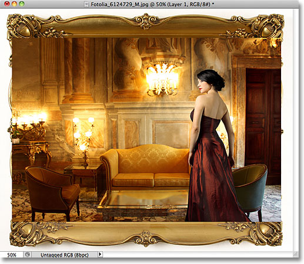
*The second image appears in front of the photo frame.*

In order for my second photo to appear inside the frame, I need to rearrange the order of the layers in the Layers panel so that the frame appears above the photo. Normally, moving one layer above another is as easy as clicking on the layer we need to move and dragging it above the other layer, but that's not the case when the layer we need to move is the Background layer. When I click on the Background layer and try dragging it above the photo on Layer 1, Photoshop displays a circle icon with a diagonal line through it (the international "not gonna happen" symbol), letting me know that for some reason, it's not going to let me do it:

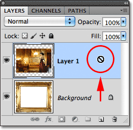
*The circle with the diagonal line through it tells me I can't drag the Background layer above Layer 1.*

The reason it won't let me drag the Background layer above Layer 1 is because **the Background layer must always remain the background of the document**. Photoshop won't allow us to move it above any other layers.

### Rule 4: We Can't Move Other Layers Below The Background Layer

Okay, so we can't move the Background layer above another layer. What if we try moving another layer *below* the Background layer? I'll click on Layer 1 and try to drag it below the Background layer, but this doesn't work either. I get the same little ghostbusters symbol telling me that Photoshop won't let me do it:

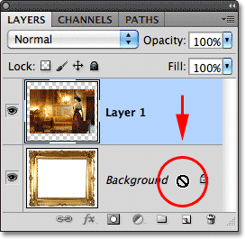
*The same "not gonna happen" icon appears when trying to drag Layer 1 below the Background layer.*

Again, the reason is because the Background layer must always remain the background of the document. We can't drag it above other layers and we can't drag other layers below it.

### The Easy Solution

Let's quickly recap. We've learned that Photoshop won't let us move the contents of the Background layer with the Move Tool because the layer is locked in place. We learned that the Background layer doesn't support transparency, so there's no way to delete anything on the layer. And we learned that the Background layer must always remain the bottom layer in the Layers panel. We can't drag it above other layers, and we can't drag other layers below it.

Since the Background layer's whole purpose in life is to be the background of the document, each of these rules makes sense. Yet as with most rules, there's ways around them for times when we need to break them. In this case, there's an easy way around all of them at once! All we need to do is **rename the Background layer** to something other than Background! To rename the Background layer, you *could* go up to the **Layer** menu at the top of the screen, choose **New**, and then choose **Layer From Background**:

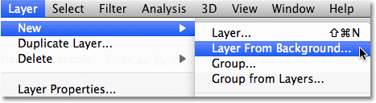
*Go to Layer > New > Layer From Background.*

A faster way, though, is to simply double-click directly on the word *Background* in the Layers panel:

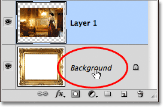
*Double-click directly on the Background layer's name.*

Either way opens the **New Layer** dialog box where we can enter a new name for the layer. The default name of "Layer 0" works fine. Any name other than Background will work, so unless you have something specific you want to name the layer, simply click OK to accept Layer 0 as the new name and close out of the dialog box:

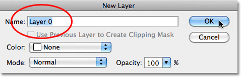
*You can accept Layer 0 as the new name for the layer or enter a different name if you prefer.*

**TIP:** For an even faster way to rename the Background layer, simply hold down your **Alt** (Win) / **Option** (Mac) key and double-click on the word *Background*. Photoshop will instantly rename the layer "Layer 0", bypassing the New Layer dialog box completely.

We can now see that the name of the Background layer has been changed to Layer 0:

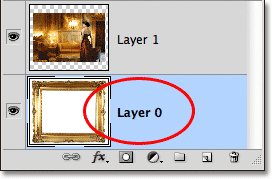
*The Background layer has been renamed Layer 0.*

And just by renaming it, we've converted the Background layer into a normal layer, which means we're no longer bound by any of the rules we just looked at! We can move the contents of the layer with the Move Tool, we can delete anything on the layer and replace it with transparency, and we can freely move the layer above or below other layers!

For example, I still need to move my photo frame above the image on Layer 1. Now that the frame is no longer on the Background layer, it's easy! I can just click on Layer 0 in the Layers panel and drag it upward until a thin highlight bar appears above Layer 1:

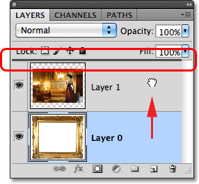
*Dragging Layer 0 above Layer 1.*

I'll release my mouse button, and Photoshop drops Layer 0 above Layer 1, exactly as I needed:

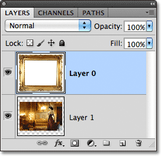
*Layer 0 now appears above Layer 1, which would not have been possible while Layer 0 was still the Background layer.*

We saw earlier that I was unable to delete the white area inside the frame while the image was on the Background layer, but now that I've renamed it to Layer 0, it's no longer a problem. I'll click inside the area with the Magic Wand Tool to instantly select it, just as I did before:

*The white area inside the frame is once again selected.*

Then, I'll press **Backspace** (Win) / **Delete** (Mac) on my keyboard, and this time, instead of being greeted by the Fill dialog box, Photoshop actually does what I expected, deleting the area from the layer and revealing the photo behind it:

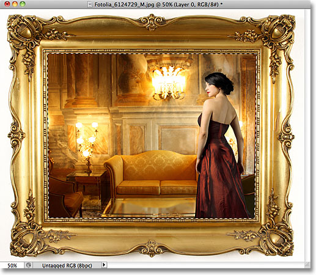
*The area inside the frame has finally been deleted, revealing the photo underneath.*

I'll press **Ctrl+D** (Win) / **Command+D** (Mac) on my keyboard to deselect the area inside the frame and remove the selection outline. Then, just to quickly finish things off, I'll click on Layer 1 in the Layers panel to select it and make it the active layer:

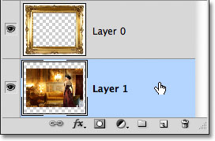
*Selecting Layer 1.*

I'll grab the Move Tool from the Tools panel, click on the photo and drag it into position inside the frame. Even though Layer 1 is now the bottom layer in the document, it's not an actual Background layer so it's not locked in place. I'm free to move it anywhere I want:

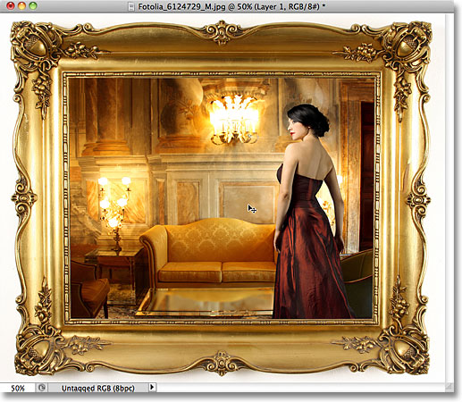
*Dragging the photo into position inside the frame.*

As we've seen, Background layers are special types of layers in Photoshop with certain limitations placed on them. We can't move their contents, we can't delete anything on them, and they always have to remain the bottom layer in the document. In most cases, these limitations are of little concern to us because we generally don't work directly on the Background layer anyway. But if you do need to override them, simply rename the Background layer to anything other than *Background*, which will instantly convert it to a normal layer, and you're good to go!