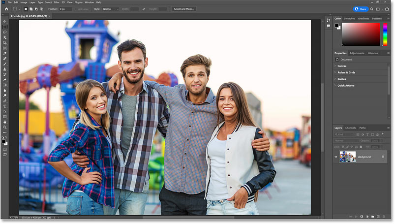
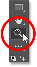
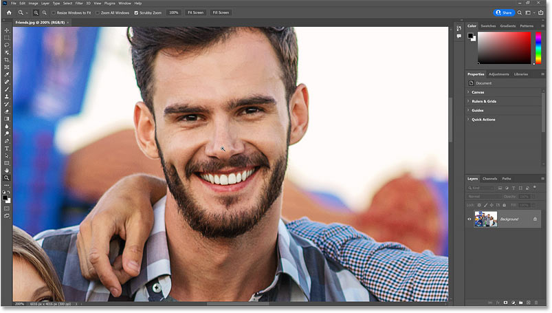
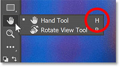
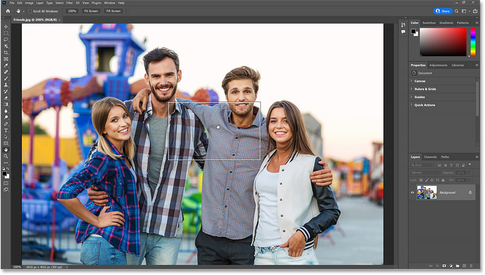
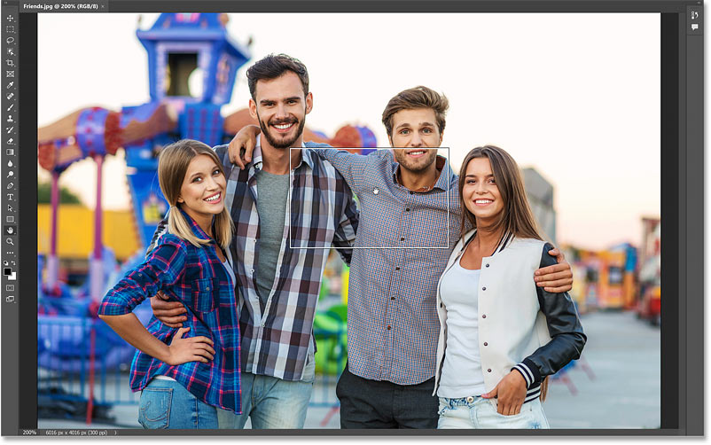
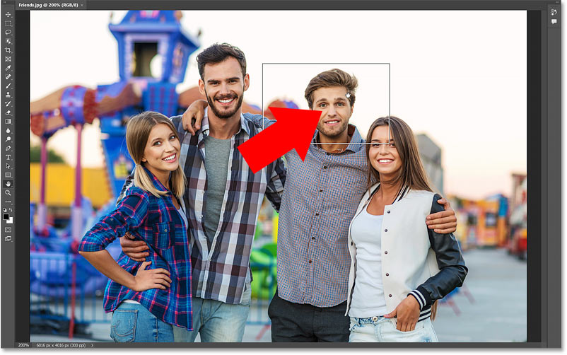
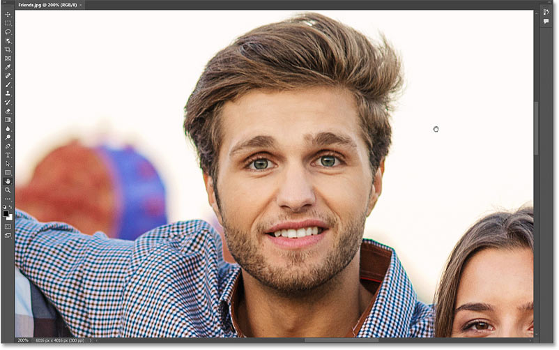
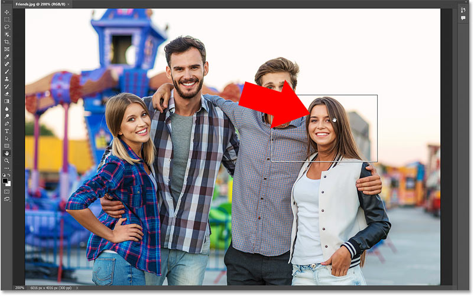
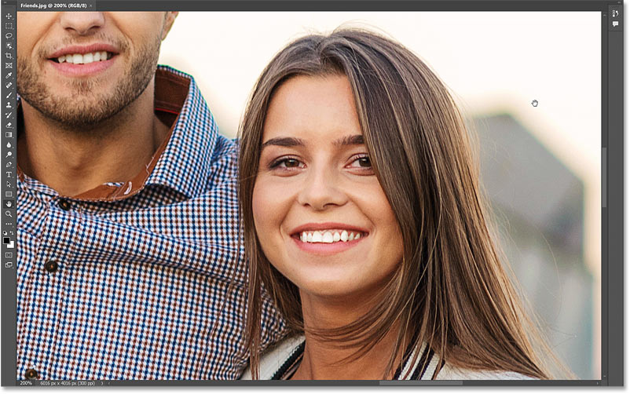

# Navigate Images Fast with Birds Eye View in Photoshop

> Source: [https://www.photoshopessentials.com/basics/photoshop-birds-eye-view-tutorial/](https://www.photoshopessentials.com/basics/photoshop-birds-eye-view-tutorial/)
> Downloaded and converted to Markdown.

This tutorial shows you how to navigate images using Birds Eye View, one of Photoshop's best hidden features and the fastest way to zoom in and out to inspect different parts of your image!

Photoshop has a hidden navigation feature called **Birds Eye View** that makes it easy, and even fun, to pan from one part of your image to another. When zoomed in, Birds Eye View instantly zooms the image out so it fits entirely on the screen, giving you a "birds eye view" of where you are. You can then zoom in on a different area just by clicking and dragging a box over the area and releasing your mouse button. In other words, Birds Eye View lets you quickly zoom in and out of your image without the need to manually zoom in and out.

I briefly covered Birds Eye View in the first lesson in this series where we [learned the basics of zooming and panning images](/basics/photoshop-zoom/ "View tutorial") in Photoshop. But because it's such a useful feature, it really deserves a tutorial of its own.

Let's get started!

## Which Photoshop version do I need?

I'm using Photoshop 2022 but any recent version will work. You can [get the latest Photoshop version here](https://adobe.prf.hn/click/camref:1100lrdjJ/destination:https%3A%2F%2Fwww.adobe.com%2Fproducts%2Fphotoshop.html "Get the latest version of Adobe Photoshop").

## Opening an image

To show how Birds Eye View works, I've opened [this image](https://adobe.prf.hn/click/camref:1100lrdjJ/destination:https%3A%2F%2Fstock.adobe.com%2Fstock-photo%2Fcheerful-crowd-standing-together-outdoors%2F121719884 "View this image on Adobe Stock") from Adobe Stock.

*An image newly opened in Photoshop.*

## Step 1: Zoom in on the image

To use Birds Eye View, we first need to be zoomed in. So select the [Zoom Tool](/basics/photoshop-zoom/ "Learn more about the Zoom Tool") from Photoshop's [toolbar](/basics/photoshop-tools-toolbar-overview/ "Learn more about the Toolbar"):

*Selecting the Zoom Tool.*

Then click on an area with the Zoom Tool to zoom in, and click repeatedly to zoom in closer.

Here I've zoomed in on the man's face by clicking a few times on his nose:

*Zooming in with the Zoom Tool.*

## Step 2: Press and hold H, then click and hold on the image

To pan or scroll an image when zoomed in, we normally use Photoshop's [Hand Tool](/basics/photoshop-zoom/ "Learn more about the Hand Tool"). And the keyboard shortcut for selecting the Hand Tool is to press the letter **H**.

*The Hand Tool has a keyboard shortcut of H.*

To use Birds Eye View, we need the Hand Tool's keyboard shortcut. So on your keyboard, press and hold the letter **H**. Even if the Hand Tool is already selected in the toolbar, you still need to hold H.

Then with the H key held down, click and hold on the image. Photoshop zooms the image out so it fits entirely on the screen, giving you a "birds eye view" of your photo.

*Hold H, then click and hold on the image for the Birds Eye View.*

## Step 3: Drag the rectangle to a new location

Notice the **rectangle** that appears around the Hand Tool's cursor while you are zoomed out. The rectangle represents your [document window](/basics/tabbed-and-floating-documents-in-photoshop/ "Learn more about document windows in Photoshop"). And the area inside the rectangle is where you'll zoom in next when you release your mouse button.

*The Birds Eye View rectangle.*

Keep your mouse button down and drag the rectangle to a different area where you want to zoom in.

*Drag the rectangle to a new location.*

## Step 4: Release your mouse button to zoom in

Then release your mouse button and you'll instantly zoom in on the new area, at the same zoom level you were at previously.

*Release your mouse button to zoom in.*

As long as you keep holding the H key on your keyboard, you can keep clicking and holding on the image to zoom out to Birds Eye View and dragging the rectangle to a new location.

*Keep the H key down to keep zooming in and out with Birds Eye View.*

Then release your mouse button to zoom in.

*Birds Eye View makes it easy to inspect different areas quickly.*

And there we have it! In the next lesson in my [Navigating Images in Photoshop series](/basics/photoshop-image-navigation/ "View chapter"), we'll learn how Photoshop's [Rotate View Tool](/basics/photoshop-rotate-view-tool/ "Continue to next lesson") lets us rotate our view of the image without actually rotating the image itself.

Or visit our [Photoshop Basics](/basics/ "Learn more") section for more topics! And don't forget, all of my tutorials are now available to [download as PDFs](/print-ready-pdfs/ "Learn more")!