# Photoshop’s Brush Tool Hidden Tips and Tricks

> Source: [https://www.photoshopessentials.com/basics/photoshop-brush-tool-hidden-tips-tricks/](https://www.photoshopessentials.com/basics/photoshop-brush-tool-hidden-tips-tricks/)
> Downloaded and converted to Markdown.

Learn secret, pro-level tips and tricks for working with Photoshop's brushes and the Brush Tool, including faster ways to change your brush size, choose brush colors, switch between brush blend modes, and more! For Photoshop CC and CS6.

In this tutorial, I share hidden tips and tricks you can use with Photoshop's Brush Tool that make working with brushes faster and easier! I'm using [Photoshop CC](https://prf.hn/l/dlXjD2w) but these tips will also work with Photoshop CS6. Let's get started!

## Tip #1: Select the Brush Tool from your keyboard

This first tip isn't much of a secret but it's still a good one to know. Rather than selecting the Brush Tool from the [toolbar](/basics/photoshop-tools-toolbar-overview/ "Learn more"), a faster way to select it is by pressing the letter **B** (for "Brush Tool") on your keyboard:

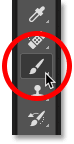
*Press "B" to quickly select the Brush Tool.*

## Tip #2: Show the crosshair in the brush cursor

When using the Brush Tool, it often helps to know the exact center of your brush cursor so you can see exactly where you're painting. You can show a crosshair in the center by enabling it in [Photoshop's Preferences](/basics/essential-photoshop-preferences-beginners/ "Learn more").

To open the Preferences on a Windows PC, go up to the **Edit** menu in the Menu Bar. On a Mac, go up to the **Photoshop CC** menu. From there, choose **Preferences**, and then **Cursors**:

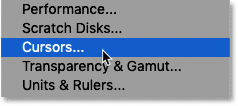
*Opening the Cursors Preferences.*

Select the option that says "**Show Crosshair in Brush Tip**" and then click OK to close the dialog box:

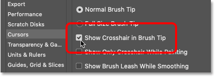
*Selecting "Show Crosshair in Brush Tip"*

The next time you paint with the Brush Tool, you'll see a crosshair in the center of the cursor:

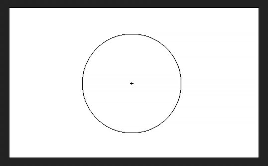
*The crosshair marks the center of the brush cursor.*

[Related: Get over 1000 more brushes in Photoshop CC!](/basics/get-more-brushes-photoshop-cc-2018/ "Learn more")

## Tip #3: How to paint with smoother brush strokes

As you paint with the Brush Tool, you may notice that the edges of your strokes look kind of "bumpy":

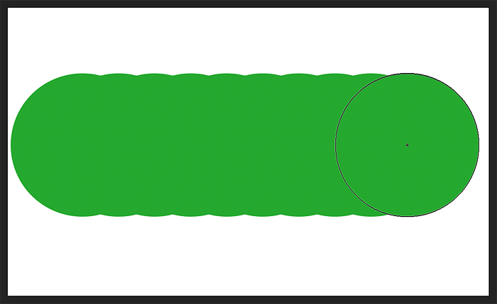
*Photoshop's default brush strokes have bumpy edges.*

The reason is that Photoshop does not paint a continuous stroke. Instead, it paints by laying down a series of individual dots. And each one of those "bumps" in the stroke is a single dot. By default, Photoshop spaces the dots too far apart, making them too obvious. But we can close up the spacing for smoother strokes, and we do that in the Brush Settings panel.

To open it, go up to the **Window** menu in the Menu Bar and choose **Brush Settings**. If you're using Photoshop CS6, the Brush Settings panel is called the **Brush** panel:

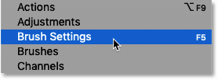
*Going to Window > Brush Settings.*

### The Spacing option

At the bottom of the panel is the **Spacing** option, along with a preview below it showing your brush stroke with your current settings. The default Spacing of **25%** is too high. This value is a hold-over from years ago when computers were not as fast as they are today. Back then, smaller Spacing values would have slowed Photoshop down. But if you're using a newer computer, there's no reason to keep this old setting:

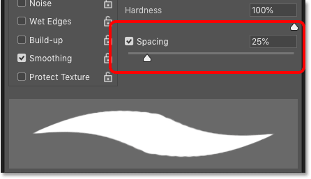
*The default Spacing value for the brush stroke.*

If we increase the Spacing value, we see the individual dots that make up the stroke:

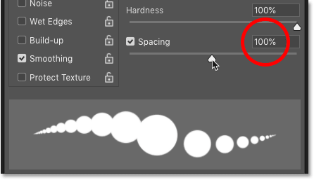
*The dots become obvious at higher Spacing values.*

Lowering the value back down to 25% does help, but those bumps are still there. So these days, the best Spacing value to use is **10%**. This gives you a much smoother and cleaner brush stroke without sacrificing speed and performance:

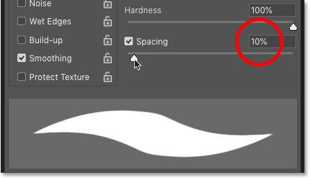
*Lowering the Spacing to 10%.*

I'll paint another stroke, and this time with the Spacing lowered to 10%, the edges look much smoother:

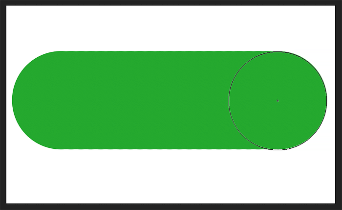
*The lower Spacing value smooths out the edges.*

## Tip #4: Faster ways to change your brush size

Next, let's look at some faster ways to change the size of your brush.

### The Brush Preset Picker

The most common way to change your brush size is by **right-clicking** (Win) / **Control-clicking** (Mac) in the document to bring up the Brush Preset Picker. From here, you can drag the **Size** slider left or right to adjust the brush size as needed:

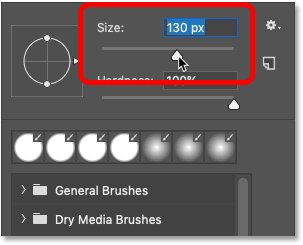
*Changing the brush size from the Brush Preset Picker.*

### The bracket keys

But a faster way to change your brush size is by using the **left and right bracket keys** ( **[** and **]** ) on your keyboard. You'll find them next to the letter "P". Press the left bracket key ( [ ) repeatedly to make your brush smaller or the right bracket key ( ] ) to make it larger.

As you press the keys, the size of your brush cursor changes. And in the **Options Bar**, you'll see the value for the current brush size updating:

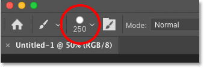
*The current brush size is shown in the Options Bar.*

### The HUD (Heads Up Display)

The only problem with the bracket keys is that they make your brush larger or smaller in incremental steps. But if you need more control over your brush size, or if your keyboard does not include the bracket keys, you can change the brush size using the **HUD**, or **Heads Up Display**.

To access the HUD on a Windows PC, press and hold the **Alt** key on your keyboard and **right-click** in the document. On a Mac, press and hold your **Control** and **Option** keys and **left-click**. Keep your mouse button held down and you'll see the HUD showing a preview of your brush cursor, along with its current size (Diameter), the Hardness of the brush, and the Opacity. Note that the red color you're seeing is not your brush color. It's just the color of the brush preview, and I'll show you how to change it in a moment:

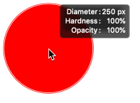
*The HUD (Heads Up Display).*

Once your mouse button is down, you can release the Alt key (Win) or the Control and Option keys (Mac). The HUD will stay open for as long as your mouse button is held down. Then to adjust the brush size, drag left or right. Dragging to the right will make the brush larger, and dragging to the left will make it smaller. As you drag, the size of the brush preview will change and you'll see the Diameter value updating:

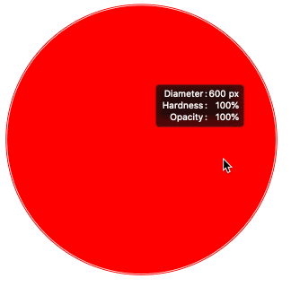
*Drag left or right with the HUD to change your brush size.*

## Tip #5: Changing the brush hardness with the HUD

Along with using the HUD to change your brush size, you can also use it to adjust the brush hardness. The current Hardness value is shown below the Diameter value. To decrease the hardness, keep your mouse button held down and drag up. Lowering the hardness makes the brush edges softer, and the softer the edges, the more feathering you'll see around the preview's outline. Or drag down to make the brush edges harder:

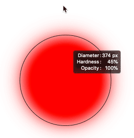
*Drag up or down with the HUD to change the brush hardness.*

### How to change the HUD's brush preview color

If you don't like the red color of the brush preview, or it's hard to see in front of your image, you can change the color in Photoshop's Preferences. A quick way to open the Preferences is by pressing **Ctrl+K** (Win) / **Command+K** (Mac) on your keyboard. Then in the Preferences dialog box, select the **Cursors** category on the left:

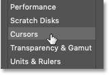
*Selecting the Cursors preferences.*

To change the preview color, just click the **Brush Preview** color swatch and choose a new color from the Color Picker. Then click OK to close the Preferences dialog box:

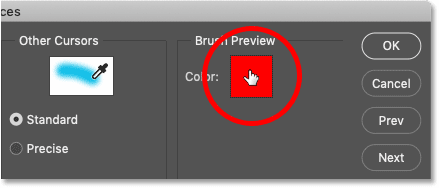
*Click the Brush Preview color swatch to choose a new color.*

## Tip #6: Using the HUD Color Picker

We've seen that we can change Photoshop's brush size and hardness using the HUD. But we can also use the HUD to quickly choose our brush color, and to choose new colors as we paint.

The current brush color is shown in the **Foreground color swatch** in the Options Bar. And the most common way to change the brush color is to click on the swatch:

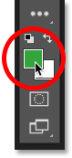
*Clicking the Foreground color swatch.*

And then choose a new color from the Color Picker:

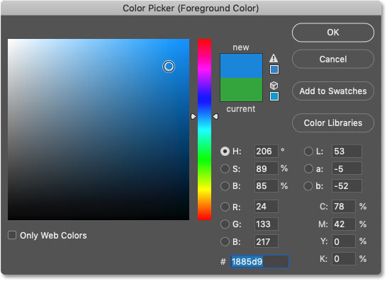
*Choosing a new brush color from the Color Picker.*

### The HUD Color Picker

But the problem with choosing brush colors like this is that each time we need a different color, we have to take our eyes off our work. A better and faster way is to use the **HUD Color Picker**.

To open the HUD Color Picker on a Windows PC, press and hold your **Shift** and **Alt** keys and **right-click** in the document. On a Mac, press and hold the **Command**, **Control** and **Option** keys and **left-click**.

This opens the default HUD Color Picker, with a **Hue strip** along the right and what Adobe calls the **Hue cube** on the left. Once your mouse button is down, you can release the Shift and Alt keys (Win) or the Command, Control and Option keys (Mac). The HUD Color Picker will stay open for as long as your mouse button stays down:

*The default HUD Color Picker.*

To choose a brush color, first drag your mouse cursor into the Hue strip on the right, and then drag up or down inside the strip to select a hue, or the main color:

*Choosing a main brush color from the Hue strip.*

Then drag your cursor into the Hue cube on the left. Drag up or down inside the cube to set the brightness of the color, and drag left or right to set the saturation. Once you've chosen your color, release your mouse button to close the HUD:

*Setting the brightness and saturation in the Hue cube.*

### How to choose a different HUD Color Picker

If you find that the HUD Color Picker is too small, that's because Photoshop chooses the smallest version by default. But there are other sizes we can use, and even a different type of Color Picker.

Press **Ctrl+K** (Win) / **Command+K** (Mac) to open Photoshop's Preferences. Then look for the **HUD Color Picker** option at the top. By default, it's set to Hue Strip (Small):

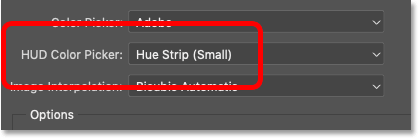
*The HUD Color Picker option in Photoshop's Preferences.*

Click on the option to select a different size (Medium or Large) for the Hue Strip. Or you can switch to a **Hue Wheel**, with various sizes to choose from:

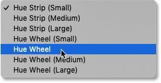
*Setting the HUD Color Picker to "Hue Wheel".*

The Hue Wheel works the same as the Hue Strip. Start by dragging your mouse cursor into the outer wheel to choose the main color. Then drag into the cube in the center and drag up or down inside the cube to set the brightness, and left or right to set the saturation:

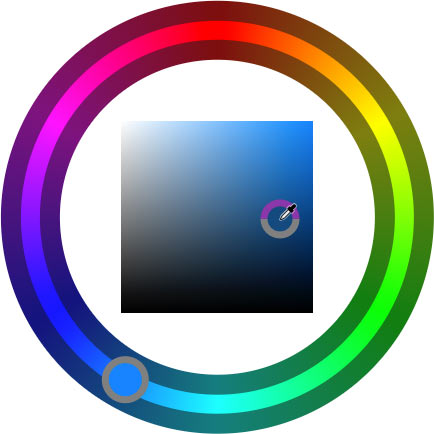
*Choosing a color from the Hue Wheel.*

[Related: How to save custom brushes in Photoshop CC!](/basics/save-custom-brush-presets-photoshop-cc2018/ "Learn more")

## Tip #7: A faster way to choose brush blend modes

Finally, let's look at a faster way to switch between Photoshop's **brush blend modes**. Along with [layer blend modes](/photo-editing/layer-blend-modes/intro/ "Learn more"), found in the Layers panel, which control how a layer blends and interacts with the layers below it, Photoshop also includes *brush* blend modes. The brush blend modes are found in the Options Bar whenever a brush tool is active:

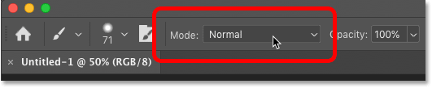
*The brush blend modes in the Options Bar.*

Brush blend modes control how the brush interacts with the layer, and how your brush stroke interacts with other brush strokes. Clicking the Blend Mode option in the Options Bar opens the complete list of blend modes for the brush tool, and most of them are the same as what you'd find in the Layers panel:

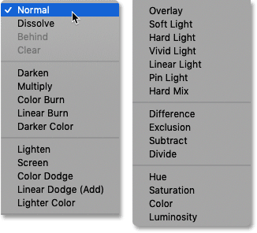
*Photoshop's brush blend modes.*

But rather than choosing them from the Options Bar, a faster way to switch between brush blend modes as you're working is by holding your **Shift** key and **right-clicking** in the document. Or on a Mac, hold your **Shift** and **Control** keys and **left-click**. Then choose the blend mode you need from the list.

For example, I'll paint an initial brush stroke using the default Normal blend mode:

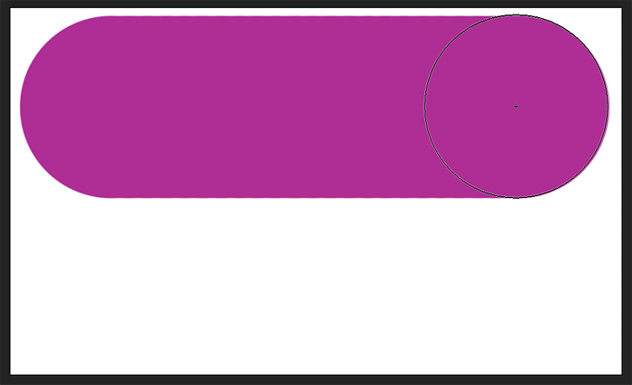
*Painting a brush stroke with the blend mode set to Normal.*

Then I'll leave the blend mode set to Normal and I'll paint a second stroke that partially overlaps the first one. But notice that all I'm doing is covering more area. The brush strokes are not interacting in any interesting way:

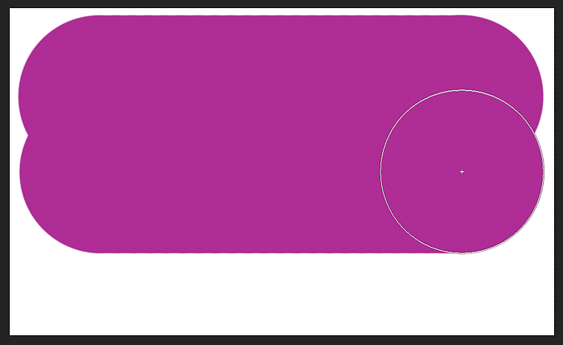
*Painting a second stroke, also set to Normal.*

I'll undo that last stroke by going up to the **Edit** menu and choosing **Undo Brush Tool**, or by pressing **Ctrl+Z** (Win) / **Command+Z** (Mac) on my keyboard:

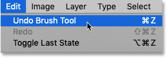
*Going to Edit > Undo Brush Tool.*

### Painting with brush blend modes

And then I'll bring up the list of brush blend modes by holding **Shift** and **right-clicking** in the document. Or on a Mac, I would hold **Shift+Control** and **left-click**. Then from the menu, I'll choose the **Multiply** blend mode:

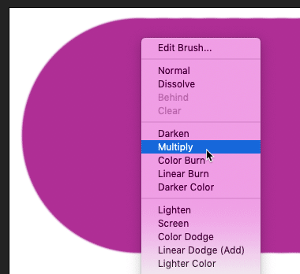
*Selecting the Multiply brush blend mode.*

The [Multiply blend mode](/photo-editing/layer-blend-modes/multiply/ "Learn more") works the same way with brushes as it does with layers. It multiplies overlapping brush strokes together to create a darker effect.

I'll paint another brush that overlaps the first one. And this time, with the blend mode set to Multiply, the area that overlaps becomes darker:

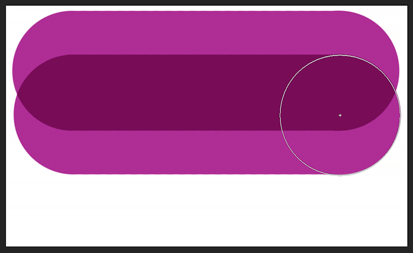
*Multiply darkens overlapping brush strokes.*

And if I paint a third stroke, the area that overlaps the first two strokes darkens even more:

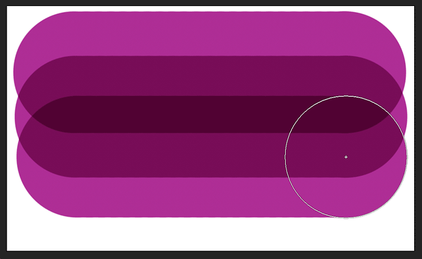
*The effect grows darker as more brush strokes overlap.*

[Related: Photoshop Blend Modes Tips and Tricks](/basics/blend-mode-tips-tricks/ "Learn more")

### Resetting the brush blend mode

When you're done with the brush, remember to set the blend mode back to **Normal**, otherwise you might get unexpected results the next time you use it:

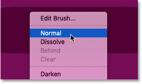
*Setting the brush blend mode back to Normal.*

And there we have it! That's some hidden, time-saving tips and tricks you can use with the Brush Tool in Photoshop! Check out our [Photoshop Basics](/basics/ "More Photoshop Basics tutorials") section for more tutorials. And don't forget, all of our Photoshop tutorials are available to [download as PDFs](/print-ready-pdfs/ "Learn more")!