# The Improved And Enhanced Color Panel – Photoshop CC 2014

> Source: [https://www.photoshopessentials.com/basics/photoshop-cc-2014-color-panel/](https://www.photoshopessentials.com/basics/photoshop-cc-2014-color-panel/)
> Downloaded and converted to Markdown.

In this tutorial, we'll take a quick look at the improvements and enhancements Adobe has made to the **Color panel** in Photoshop as part of the Creative Cloud 2014 updates.

As we'll see, not only is the Color panel now fully resizable, but it also gives us two new ways of choosing colors — the **Hue Cube** and the **Brightness Cube** — both of which have been borrowed from Photoshop's Color Picker and designed to make choosing colors in Photoshop faster and more intuitive.

Of course, to benefit from these new features in Photoshop CC 2014, you'll need to be a monthly subscriber to [Photoshop](https://prf.hn/l/dlXjD2w).

If you're working in Photoshop's default [Essentials workspace](/basics/photoshop-cs6-workspaces/), you'll find the Color panel in its usual spot at the top of the [panel area](/basics/managing-panels-in-photoshop-cs6/) along the right side of the interface ([colorful model photo](http://www.shutterstock.com/pic.mhtml?id=143556679) from Shutterstock):

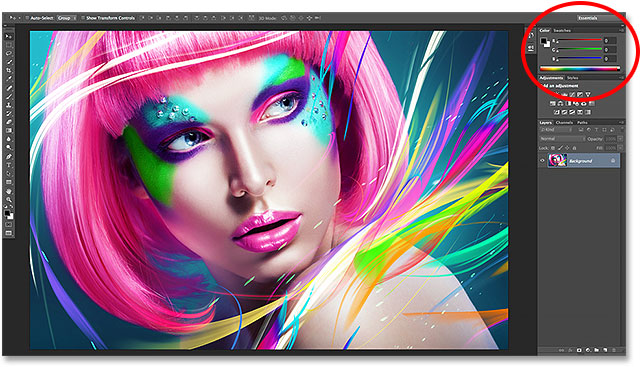
*The Color panel is found (by default) at the top of the panel area on the right.*

If you're not seeing the Color panel, you can select it by going up to the **Window** menu in the Menu Bar along the top of the screen and choosing **Color** from the list of panels. A checkmark next to a panel's name means it's currently open somewhere on your screen:

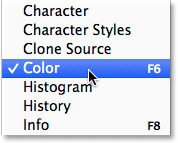
*Each of Photoshop's panels can be turned on and off from the Window menu.*

### Resizing The Color Panel

In Photoshop CC 2014, we can now resize the Color panel and make it as large as we like. To make it wider, move your mouse cursor to the left edge of the panel. You'll see your cursor change into a **left and right-pointing arrow**. Click and drag towards the left to resize the panel. Note that this actually resizes the entire **panel column**, not just the Color panel itself, so all panels in the column will be made wider along with it:

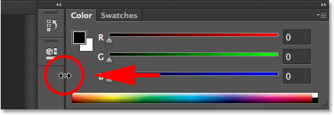
*Dragging towards the left to make the Color panel wider.*

Making a panel wider in Photoshop is nothing new, but now in CC 2014, we can also make the Color panel longer. Move your mouse cursor to the bottom edge of the Color panel. When you see your cursor change into an **up and down-pointing arrow**, click and drag downward to resize it:

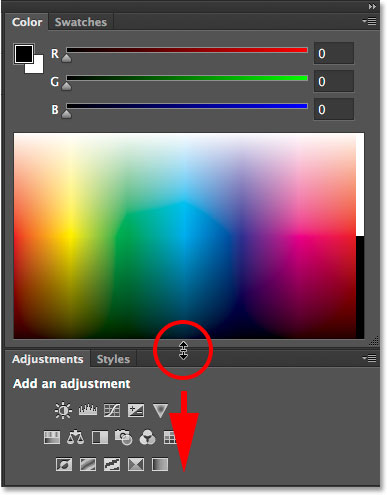
*Dragging downward to make the Color panel longer.*

If you want to resize the Color panel on its own without affecting the size of other panels, click on the **name tab** at the top of the panel (where it says "Color") and drag the panel away from the other panels into the document area:

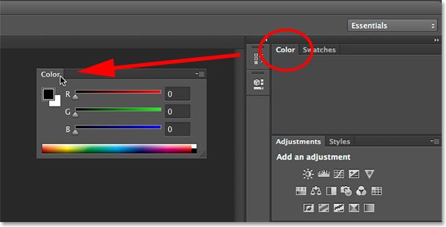
*Undocking the Color panel from the other panels in the column.*

With the panel now undocked from the rest, it becomes even easier to resize it. Simply click and drag either of the bottom corners to make the Color panel as large as you need:

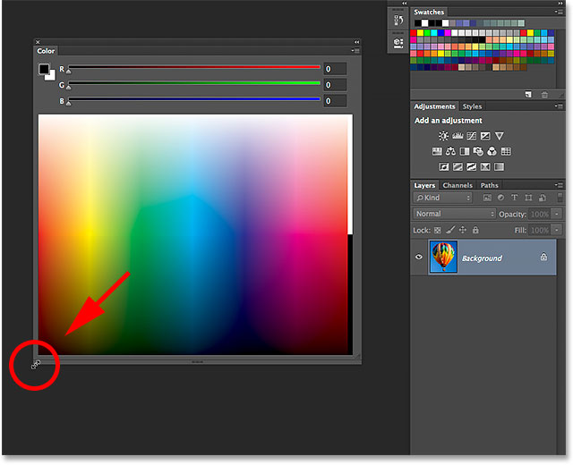
*Clicking and dragging the bottom corner.*

Now, you may be thinking, "Well, that's sort of cool, but what's the point? You've made the Color panel bigger, sure, but why? What's the benefit?" An excellent question, and certainly, when using the Color panel in its default **RGB Sliders** mode (with sliders for mixing red (R), green (G) and blue (B) to create the colors we need), there isn't much of a reason to resize it. However, Photoshop CC 2014 introduces two new ways to choose colors, and as we're about to see, it's these new options — the **Hue Cube** and the **Brightness Cube** — that make resizing the Color panel such a great and useful feature.

### The New Hue And Brightness Cubes

Just to give you a sense of where the Hue Cube and Brightness Cube come from, before CC 2014, choosing a color in Photoshop usually meant a trip to the **Color Picker**. For example, if I wanted to change my **Foreground color**, the traditional way to do it would be to click on the Foreground **color swatch** near the bottom of the Tools panel:

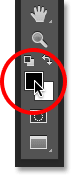
*Clicking the Foreground color swatch.*

This would open the Color Picker (and still does, by the way) where I could select the color I need:

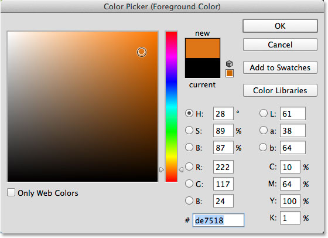
*The Color Picker has been the most common way to choose colors in Photoshop.*

The Color Picker gives us lots of different ways to choose colors, but by far the most common way is by first selecting a main **hue** (often thought of as the actual color itself) from the narrow vertical bar:

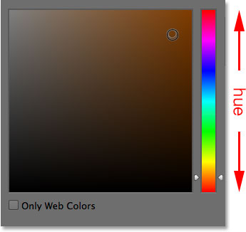
*The main hue strip.*

Once we've chosen the hue, we then choose a **brightness** and **saturation** level for the color from the larger square (the "cube") on the left. The brightness levels run from top to bottom while the saturation levels run from left to right:

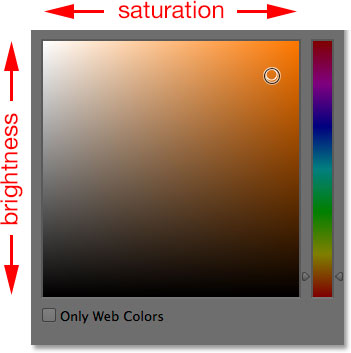
*The brightness and saturation box.*

The reason the Color Picker is set up like this initially is because by default, the **H** option is selected in the center of the dialog box. H stands for **Hue**, which means we're selecting colors based primarily on their hue, with brightness and saturation as secondary attributes:

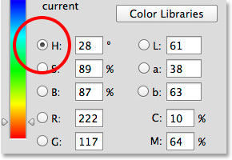
*The Color Picker is set to Hue by default.*

Watch what happens if we switch from H to **B**:

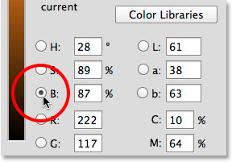
*Switching the color selection mode from H to B.*

B stands for **Brightness**, and by switching from H to B, we've changed the way the Color Picker is set up. We're now selecting colors based primarily on their brightness, with hue and saturation as secondary attributes. The narrow vertical bar on the right becomes the area where we select a main brightness level for the color:

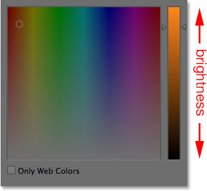
*With B selected, we choose a brightness from the main strip.*

Then, once we've chosen the brightness we need, we choose a hue and saturation from the square on the left. The hue values now run from left to right while the saturation levels run from top to bottom:

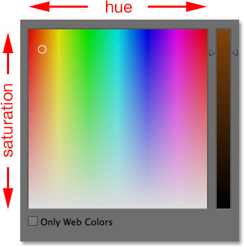
*The hue and saturation box.*

One big inconvenience with the Color Picker has always been that the whole time it's open on the screen, it effectively locks us out of the rest of Photoshop, preventing us from doing any more work until we click OK to close out of it:

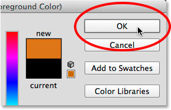
*The Color Picker needs to be closed before we can continue working.*

But now, thanks to the new Photoshop CC 2014 updates, we can select colors in the same ways we just looked at without needing to open the Color Picker, and that's because these same options are now built right into the Color panel itself! To find them, we just need to click on the **menu icon** in the upper right corner of the Color panel:

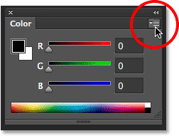
*Clicking the Color panel's menu icon.*

The two new options, Hue Cube and Brightness Cube, are listed at the top of the menu. I'll choose the first one, Hue Cube:

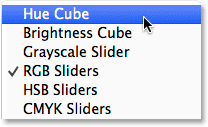
*Selecting Hue Cube from the Color panel menu.*

With Hue Cube selected, the Color panel now lets us choose a color the same way we'd choose it from the Color Picker when H (Hue) is selected. We first choose a hue from the narrow vertical bar on the right, and then we choose a saturation and brightness level for the color from the larger square on the left:

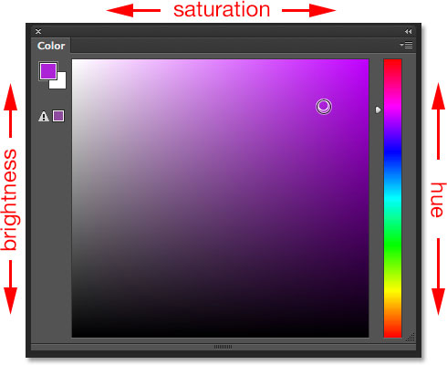
*The Color panel set to Hue Cube behaves just like the Color Picker set to H (Hue).*

We can switch between the Foreground and Background colors using the **color swatches** in the upper left corner of the Color panel, which are the same as the color swatches near the bottom of the Tools panel. Keep the upper left swatch selected to choose a Foreground color, or click on the bottom right swatch to switch to the Background color:

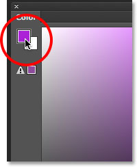
*Use the swatches to switch between the Foreground (upper left) and Background (bottom right) colors.*

I'll select the second new option, Brightness Cube, from the menu:

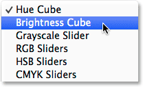
*Selecting the Brightness Cube from the Color panel menu.*

With Brightness Cube chosen, the Color panel now acts just like the Color Picker when set to B (Brightness). We select a main brightness for the color from the vertical bar on the right, then we choose a hue and saturation from the square on the left:

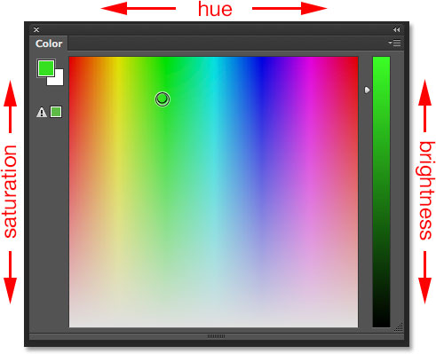
*The Color panel set to Brightness Cube behaves just like the Color Picker set to B (Brightness).*

The great thing about being able to choose colors like this from the Color panel, rather than the Color Picker, is that we can leave the Color panel open on the screen the entire time we're working, letting us change colors effortlessly and on the fly without needing to open up a separate dialog box (and being blocked from doing anything else in Photoshop while the dialog box is open). Here, we see my Color panel again in the upper right of the interface where it appears by default, but this time, it's set to the Hue Cube rather than the default RGB Sliders mode. Also, I've resized it to make it larger, as we learned how to do earlier, so that while it takes up more screen real estate, it also gives me a wider range of colors to choose from as I'm working:

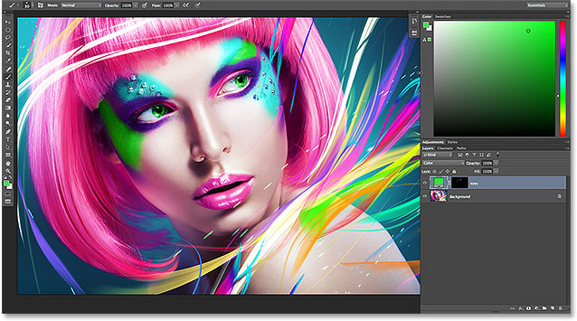
*The resized Color panel set to Hue Cube.*

Of course, the Hue Cube and Brightness Cube are only two of the many ways Photoshop's Color Picker gives us for selecting colors, so these new Color panel options haven't completely replaced it. What they've certainly done, though, is greatly reduced the need for it. The next time you're doing any sort of colorizing work in Photoshop, rather than jumping to the Color Picker every time you need to change colors, try out the newly-resizable Color panel, set it to either Hue Cube or Brightness Cube, and see for yourself how much of a difference it makes to your design or retouching workflow.