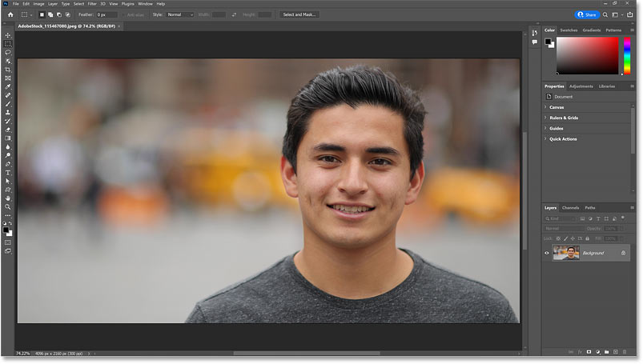
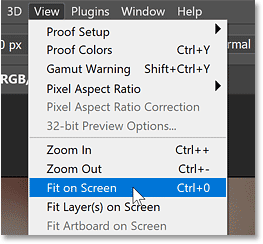
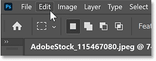
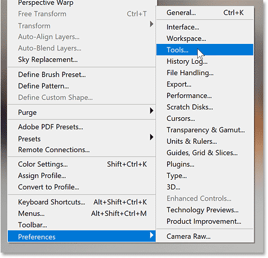
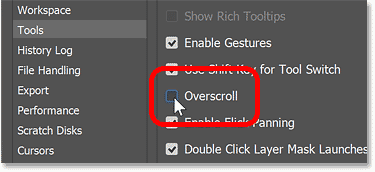
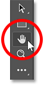
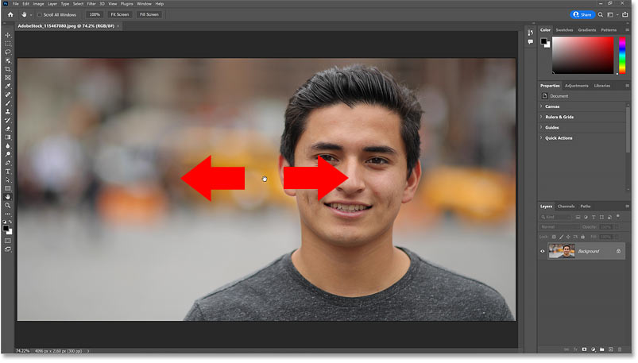
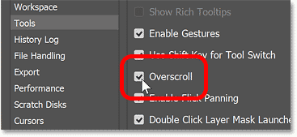
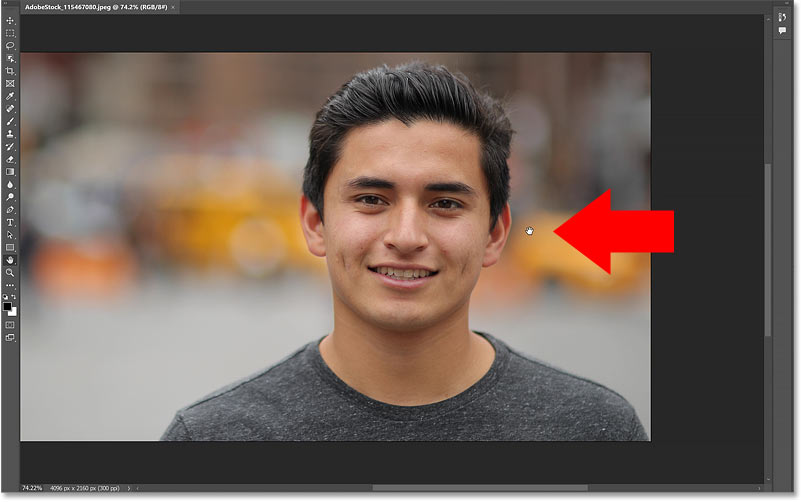

# Scroll Images at Any Zoom Level with Overscroll in Photoshop

> Source: [https://www.photoshopessentials.com/basics/photoshop-cc-overscroll/](https://www.photoshopessentials.com/basics/photoshop-cc-overscroll/)
> Downloaded and converted to Markdown.

Learn how to use Overscroll in Photoshop to pan or scroll an image within the document window even when the image is already zoomed out to fit on screen.

Photoshop's Overscroll feature allows us to pan or scroll an image at any zoom level, even when we're zoomed out far enough to fit the entire image on screen. This can be very handy when the image needs editing or retouching along an edge or in a corner because Overscroll lets us drag that area into the center of the document window without needing to zoom in. Let's see how it works.

I'm using [Photoshop 2022](https://prf.hn/l/dlXjD2w) but you can follow along with any recent version.

Let's get started!

## Opening an image

To show how Overscroll works, I've opened [this image](https://prf.hn/l/DRPwN0Z) from Adobe Stock.

*Opening an image in Photoshop.*

## Zooming out to fit the image on screen

Photoshop always lets us pan or scroll an image when we're zoomed in close. So Overscroll is only needed when we're zoomed out far enough to view the entire image at once.

If you're zoomed in, you can quickly zoom out to fit the image on screen by going up to the **View** menu in the Menu Bar and choosing the **Fit on Screen** command. Or by pressing the keyboard shortcut, **Ctrl+0** (Win) / **Command+0** (Mac).

*Going to View > Fit on Screen.*

## Turning Overscroll off

In the most recent versions of Photoshop, Overscroll is turned on by default in Photoshop's Preferences. So to see what it does, let's turn Overscroll off.

Open the Preferences by going up to the **Edit** menu on a Windows PC or the **Photoshop** menu on a Mac.

*Opening the Edit (Win) / Photoshop (Mac) menu.*

From there, choose **Preferences** and then **Tools**.

*Opening the Tools preferences.*

Look for the **Overscroll** option and uncheck it to turn it off. Then click OK to close the Preferences dialog box.

*Turning Overscroll off.*

## Selecting the Hand Tool

To pan or scroll an image, we use Photoshop's Hand Tool. Select the Hand Tool from the toolbar.

*Selecting the Hand Tool.*

## Scrolling the image with Overscroll off

Then with the Hand Tool active, click on the image and try to pan or scroll it around within the document window. With Overscroll turned off, the image does not move. That's because the entire image is already visible on screen so Photoshop figures there's no reason for us to move it.

But what if I want to do some retouching work on the man's skin at my current zoom level? He's positioned off to the side of the image, but the retouching would be easier if I could drag him into the center of my document window. With Overscroll turned off, though, I can't move him. At least not without zooming in closer, which I don't want to do.

*Photoshop won't let us pan an image that fits on screen with Overscroll turned off.*

## Turning Overscroll on

Thankfully, turning Overscroll on solves the problem. Go back to the **Edit** menu on a Windows PC or the **Photoshop** menu on a Mac. Choose **Preferences**, and then **Tools**.

Click inside Overscroll's checkbox to turn it back on, and then click OK to close the Preferences dialog box.

*Turning Overscroll back on in the Tools preferences.*

## Scrolling the image with Overscroll on

Then click and drag your image with the Hand Tool. With Overscroll turned on, even though the image fits on screen, Photoshop still lets us pan or scroll it anywhere we want within the document window.

And I can now scroll the man into the center where it will be easier for me to work.

*Overscroll lets us pan the image even when it fits on screen.*