# Photoshop Crop Tool Tips and Tricks

> Source: [https://www.photoshopessentials.com/basics/photoshop-crop-tool-tips-and-tricks/](https://www.photoshopessentials.com/basics/photoshop-crop-tool-tips-and-tricks/)
> Downloaded and converted to Markdown.

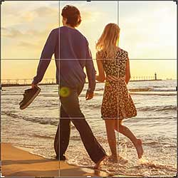

Learn the essential tips and tricks you can use with the Crop Tool to speed up your workflow when cropping images in Photoshop!

You'll learn time-saving keyboard shortcuts, a few ways to customize the Crop Tool, and even how to use the Crop Tool to quickly add a border around your image! If you're new to Photoshop and not sure how to crop images, be sure to check out my previous tutorial where I [cover the basics](/basics/how-to-crop-images-photoshop-cc/).

I'll be using [Photoshop CC](https://prf.hn/l/dlXjD2w) but everything here is fully compatible with Photoshop CS6.

Here's [the image](https://prf.hn/l/mejxPk0) I'll be using from Adobe Stock:

*The original image. Photo credit: Adobe Stock.*

Let's get started!

## The Crop Tool keyboard shortcuts

Let's start with the Crop Tool's keyboard shortcuts.

### How to select the Crop Tool

To select the Crop Tool, rather than grabbing it from the [Toolbar](/basics/photoshop-tools-toolbar-overview/), just tap the letter **C** on your keyboard.

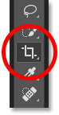
*Press "C" to select the Crop Tool.*

### How to lock the aspect ratio of the crop border

As you're resizing the crop border, you can lock the aspect ratio by holding down your **Shift** key as you drag a corner handle.

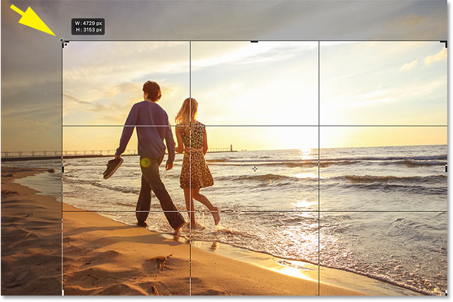
*Shift + drag a corner handle to lock the aspect ratio.*

### How to resize the crop border from its center

To resize the border from its center, press and hold the **Alt** (Win) / **Option** (Mac) key while dragging a handle.

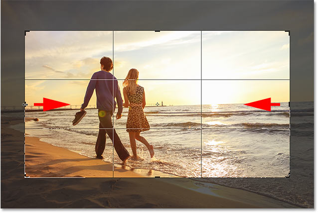
*Alt (Win) / Option (Mac) + drag a handle to resize the border from its center.*

### How to lock the aspect ratio *and* resize from center

And to both lock the aspect ratio *and* resize the border from its center, hold **Shift+Alt** (Win) / **Shift+Option** (Mac) and drag one of the corners.

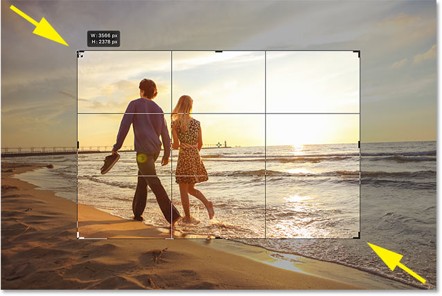
*Shift + Alt (Win) / Option (Mac) + drag a corner handle to lock the aspect ratio and resize from center.*

### How to swap the orientation of the crop border

To swap the orientation of the crop border between portrait and landscape, press the letter **X**.

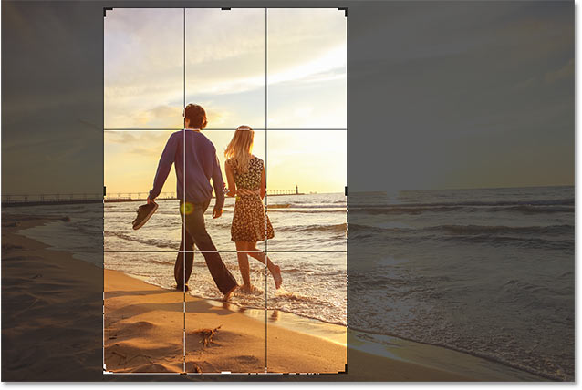
*Tap "X" to swap the orientation.*

### Show or hide the cropped area

If you want to hide the area outside the crop border to get a better sense of what the cropped version will look like, press **H**.

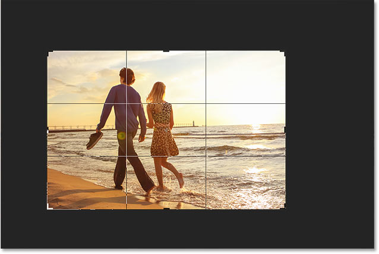
*Press "H" to hide the area outside the crop border.*

Then press **H** again to bring the cropped area back.

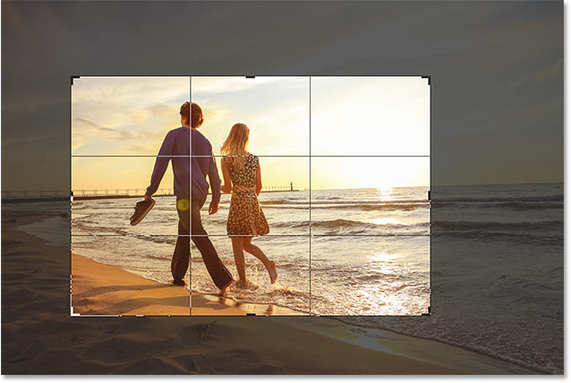
*Press "H" again to show the cropped area.*

### How to move the crop border, not the image

By default, when we click and drag inside the crop border, we move the image around inside it while the border stays in place. To move the *border*, not the image, you can switch to "Classic Mode" by pressing the letter **P**. Then drag to move the border around inside the image. Press P again to return to the default mode.

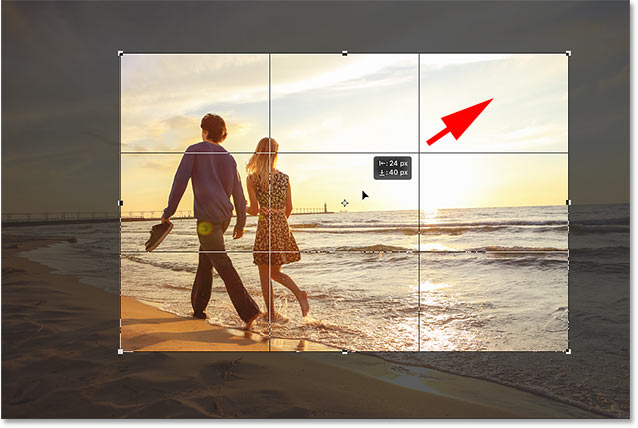
*Press "P" to toggle Classic Mode on and off.*

### Temporarily select the Straighten Tool

If you need to straighten your image, you can temporarily access the Straighten Tool by pressing and holding your **Ctrl** (Win) / **Command** (Mac) key while the Crop Tool is active.

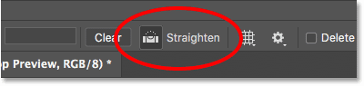
*Hold Ctrl (Win) / Command (Mac) to temporarily access the Straighten Tool.*

Drag across something that should be straight, either vertically or horizontally, and then release your mouse button to rotate the image.

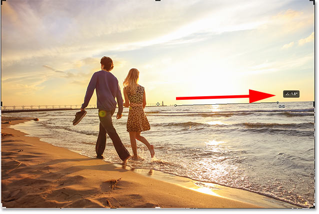
*Dragging across the horizon line with the Straighten Tool.*

Once you've straightened the image, release the Ctrl (Win) / Command (Mac) key to switch back to the Crop Tool.

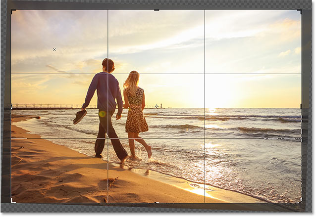
*Release Ctrl (Win) / Command (Mac) to return to the Crop Tool.*

### Cancel the crop

To cancel the crop, press the **Esc** key on your keyboard.

*Cancel the crop to return to the original image.*

### Cycle through the crop overlays

Let's look at a couple of tips to use with the crop overlay that appears inside the border. By default, Photoshop displays the **Rule of Thirds** overlay, which can help with our composition.

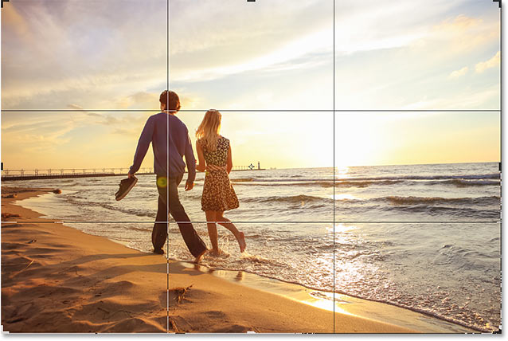
*The Rule of Thirds overlay appears by default.*

But if you click the **Overlay** icon in the Options Bar:

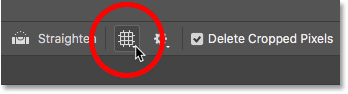
*Clicking the Overlay icon.*

You'll see that there are other overlays we can choose from:

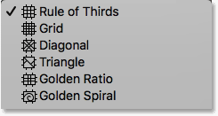
*Photoshop includes 6 different crop overlays.*

To quickly cycle through them from your keyboard, press the letter **O**.

*Tap "O" to cycle through the crop overlays.*

### Showing and hiding the crop overlay

Also by default, Photoshop displays the overlay at all times, even when you're not resizing the crop border. But if you click the **Overlay** icon in the Options Bar:

*Clicking the Overlay icon.*

You'll find a couple of other options to choose from. If you choose **Auto Show Overlay**, then Photoshop will only display the overlay while you're actually resizing the border, which makes it easier to see your image. And choosing **Never Show Overlay** prevents the overlay from appearing at all. To switch back to the default mode, choose **Always Show Overlay** from the list:

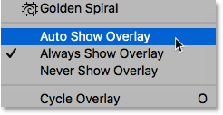
*The overlay display options.*

### Crop the image

To crop the image, press **Enter** (Win) / **Return** (Mac) on your keyboard. Or, just double-click inside the crop border.

*Press **Enter** (Win) / **Return** (Mac) to commit the crop.*

### Undo the crop

And if you need to undo the crop, press **Ctrl+Z** (Win) / **Command+Z** (Mac).

*Press Ctrl+Z (Win) / Command+Z (Mac) to undo the crop.*

## How to add more canvas space with the Crop Tool

Finally, the Crop Tool isn't just for *cropping* images. It can also be used to add *more* canvas space around the image, giving us an easy way to add a border.

If we look in the [Layers panel](/basics/layers/layers-panel/), we see my image sitting on the [Background layer](/basics/background-layer-photoshop-cc/):

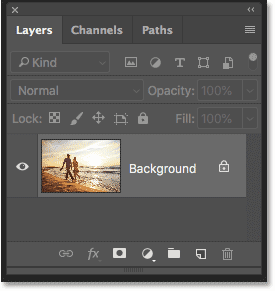
*The Layers panel.*

### Step 1: Duplicate the Background layer

To keep the border separate from the image, it's a good idea to duplicate the image first. To do that from your keyboard, press **Ctrl+J** (Win) / **Command+J** (Mac). A copy of the image appears above the original:

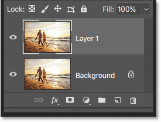
*Press Ctrl+J (Win) / Command+J (Mac) to duplicate the image.*

### Step 2: Set your background color

Photoshop will fill the new canvas space with your current **Background color**, which by default is **white**:

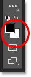
*The Background color swatch in the Toolbar.*

### Step 3: Select the Crop Tool

Select the **Crop Tool**, either from the Toolbar or by pressing the letter **C**:

*Press "C" to select the Crop Tool.*

### Step 4: Turn on "Delete Cropped Pixels"

And in the Options Bar, make sure that the **Delete Cropped Pixels** option is turned on:

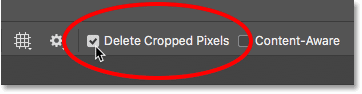
*Make sure "Delete Cropped Pixels" is checked.*

### Step 5: Drag the crop handles away from the image

Then drag the handles away from the image to add more canvas space. Hold **Alt** (Win) / **Option** (Mac) as you drag to resize the canvas from its center. As you do, you'll see Photoshop filling the extra space with your Background color:

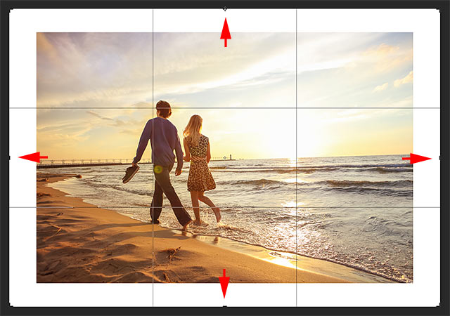
*Drag the crop handles to add more canvas space around the image.*

### Step 6: Crop the image

To accept it, press **Enter** (Win) / **Return** (Mac):

*The Crop Tool makes it easy to add a border around your image.*

And there we have it! That's some tips and tricks you can use when cropping images with the Crop Tool in Photoshop! In the next lesson, I show you how to use Photoshop's [Perspective Crop Tool](/basics/perspective-crop-tool-photoshop/) to both crop images and fix common perspective problems at the same time!

You can jump to any of the other lessons in this [Cropping Images in Photoshop](https://www.photoshopessentials.com/basics/cropping-images-in-photoshop-complete-lesson-guide) series. Or visit our [Photoshop Basics](https://www.photoshopessentials.com/basics/) section for more topics!