# Photoshop CS5 Layers Panel Essentials

> Source: [https://www.photoshopessentials.com/basics/photoshop-cs5-layers-panel-essentials/](https://www.photoshopessentials.com/basics/photoshop-cs5-layers-panel-essentials/)
> Downloaded and converted to Markdown.

In the [previous tutorial](/basics/layers/layers-intro/), we looked briefly at what layers are and how they make working in Photoshop so much easier. But before we can start taking advantage of all that layers have to offer us, we need to learn some essential skills for working in Photoshop's Command Central for layers - the **Layers panel**.

The Layers panel (known as the Layers *palette* in earlier versions of Photoshop) is where we handle all of our layer-related tasks, from adding and deleting layers to adding layer masks and adjustment layers, changing layer blend modes, turning layers on and off in the document, renaming layers, grouping layers, and anything else that has anything to do with layers.

Since it's one of the most commonly used panels in all of Photoshop, Adobe set things up so that the Layers panel opens automatically for us each time we launch the program.

By default, you'll find it in the lower right of the screen. I'm using Photoshop CS5 here but regardless of which version you're using, you'll find the Layers panel in the same general location:

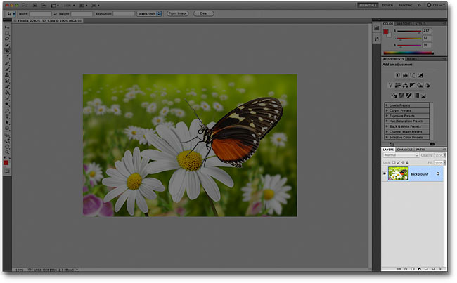
*The Layers panel is highlighted in the lower right.*

If, for some reason, the Layers panel is not appearing on your screen, you can access it (along with all of Photoshop's other panels) by going up to the **Window** menu in the Menu Bar along the top of the screen and choosing **Layers**. A checkmark to the left of a panel's name means it's currently displaying on the screen. If there's no checkmark, it means it's currently hidden:

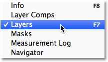
*All of Photoshop's panels can be turned on or off from the Window menu in the Menu Bar.*

I've just opened an image in Photoshop:

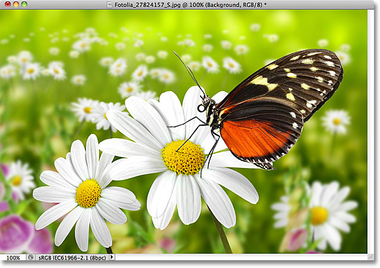
*A newly opened image.*

Even though I've done nothing so far with the image other than open it, the Layers panel is already giving us some information. Let's take a closer look at what we're seeing:

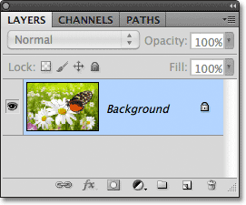
*Photoshop's Layers panel.*

### The Name Tab

First of all, how do we know that what we're looking at is, in fact, the Layers panel? We know because it says so in the **name tab** at the top of the panel:

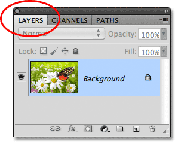
*The name tab tells us we're looking at the Layers panel.*

You may have noticed that there are two other name tabs to the right of the Layers tab - Channels and Paths - both of which appear grayed out:

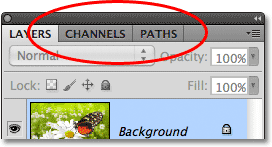
*The Channels and Paths tabs appear to the right of the Layers tab.*

These are two other panels that are grouped in with the Layers panel. There's so many panels in Photoshop that fitting them all on the screen while still leaving room to work can be a challenge, so Adobe decided to group some panels together into **panel groups** to save space. To switch to a different panel in a group, simply click on the panel's name tab. The tab of the panel that's currently being displayed in the group appears highlighted. Don't let the fact that the Layers panel is grouped in with these two other panels confuse you, though. The Channels and Paths panels have nothing to do with the Layers panel, other than the fact that both are also commonly used in Photoshop, so we can safely ignore them while we look specifically at the Layers panel.

### The Layer Row

Each time we open a new image in Photoshop, the image opens in its own document and is placed on a single layer. Photoshop represents layers in the document as rows in the Layers panel, with each layer getting its own row. Each row gives us various bits of information about the layer. I only have one layer in my document at the moment, so my Layers panel is displaying a single row, but as we add more layers, additional rows will appear:

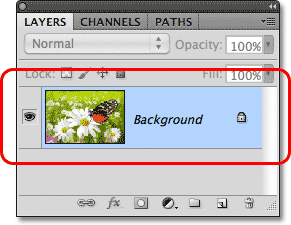
*The Layers panel displays layers as rows of information.*

### The Layer Name

Photoshop places the new image on a layer named **Background**. It's named Background because it serves as the background for our document. We can see the name of each layer displayed in its row. The Background layer is actually a special type of layer in Photoshop which we cover in the [next tutorial](/basics/layers/background-layer/):

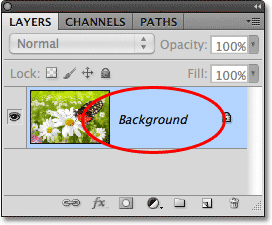
*The Layers panel displays the name of each layer.*

### The Preview Thumbnail

To the left of a layer's name is a small thumbnail image known as the layer's **preview thumbnail** because it shows us a small preview of what's on that specific layer. In my case, the preview thumbnail is showing me that the Background layer contains my image. I probably could have guessed that on my own since my document only has the one layer, but it's nice to know that Photoshop has my back:

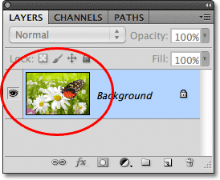
*The preview thumbnail shows us what's on each layer.*

### Adding A New Layer

To add a new layer to a document, click on the **New Layer** icon at the bottom of the Layers panel:

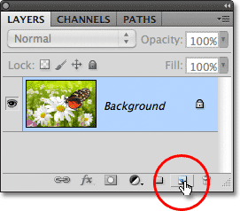
*Click the New Layer icon to add a new layer to the document.*

A new layer appears in the Layers panel directly above the Background layer. Photoshop automatically names new layers for us. In this case, it named the layer "Layer 1". Notice that we now have two layer rows in the Layers panel, each representing a different layer:

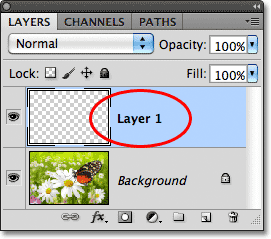
*A new layer named Layer 1 appears in the Layers panel.*

If we look in the new layer's preview thumbnail, we see a **checkerboard pattern**. The checkerboard pattern is Photoshop's way of representing transparency. Since there's nothing else being displayed in the preview thumbnail, this tells us that at the moment, the new layer is blank:

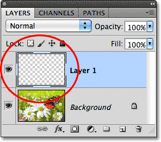
*When we add a new layer to a document, it begins life as a blank slate.*

If I click again on the New Layer icon:

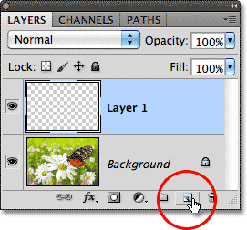
*Clicking a second time on the New Layer icon.*

Photoshop adds another new layer to my document, this time naming it "Layer 2", and we now have three layer rows, each representing one of the three layers in the document:

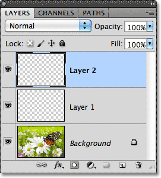
*Three layers, each on its own row in the Layers panel.*

### Moving Layers

We can move layers above and below each other in the Layers panel simply by dragging them. Right now, Layer 2 is sitting above Layer 1, but I can move Layer 2 below Layer 1 by clicking on Layer 2 and, with my mouse button still held down, dragging the layer downward until a highlight bar appears between Layer 1 and the Background layer. This is the spot where the layer will be placed:

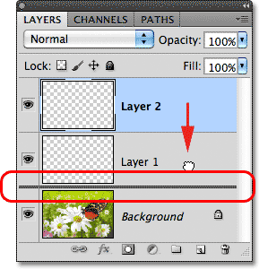
*To move a layer, click and drag it above or below another layer.*

Release your mouse button when the highlight bar appears, and Photoshop drops the layer into its new position:

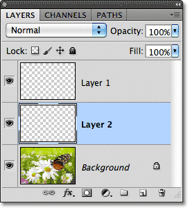
*Layer 2 now sits between Layer 1 and the Background layer.*

The only layer we can't move in the Layers panel is the Background layer. We also can't move other layers below the Background layer. All other layers can be dragged above or below other layers as needed.

### The Active Layer

You may have noticed that when I only had the one Background layer in my document, it was highlighted in blue in the Layers panel. Then, when I added Layer 1, it became the highlighted layer. And now Layer 2 is the highlighted layer. When a layer is highlighted, it means it's currently the **active layer**. Anything we do in the document is done to the contents of the active layer. Each time we add a new layer, Photoshop automatically makes it the active layer, but we can manually change which layer is the active layer simply by clicking on the one we need. Here, I'll make Layer 1 the active layer by clicking on it, and we see that it becomes highlighted:

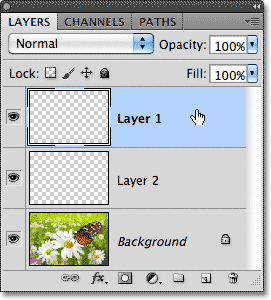
*Layer 1 is now the active layer in the document.*

### Deleting A Layer

To delete a layer, simply click on it and, with your mouse button still held down, drag it down onto the **Trash Bin** icon at the bottom of the Layers panel. Release your mouse button when you're over the icon. Here, I'm deleting Layer 1:

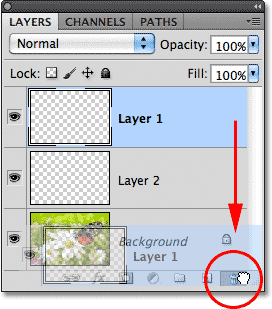
*Delete layers by clicking and dragging them on to the Trash Bin.*

I'll delete Layer 2 as well by clicking and dragging it down onto the Trash Bin:

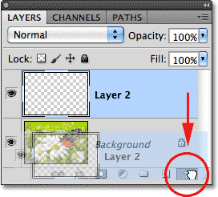
*Dragging Layer 2 onto the Trash Bin to delete it.*

And now I'm back to having just a single layer, the Background layer, in my document:

*The two blank layers have been deleted.*

### Copying A Layer

We've seen how to add a new blank layer to a document, but we can also make a copy of an existing layer using the Layers panel. To copy a layer, click on it and, with your mouse button held down, drag it down onto the **New Layer** icon. I'll make a copy of my Background layer:

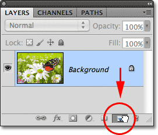
*Dragging the Background layer onto the New Layer icon to make a copy of it.*

Release your mouse button when you're over the New Layer icon. A copy of the layer will appear above the original. In my case, Photoshop made a copy of my Background layer and named it "Background copy". Notice that it also made this new layer the active layer:

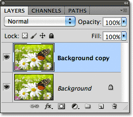
*A copy of the layer is placed above the original.*

I'm going to quickly apply a couple of Photoshop's blur filters to my Background copy layer just so we have something different on each layer. Here's what my image looks like after applying the blur filters:

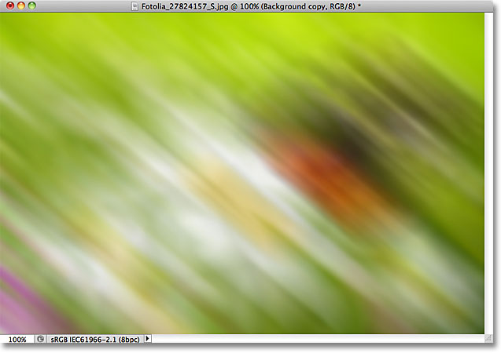
*The image after blurring the Background copy layer.*

It may look like I've blurred the entire image, but if we look in the Layers panel, we see that's not the case. Since the Background copy layer was the active (highlighted) layer when I applied the blur filters, only the Background copy layer was affected. We can see the blurred image in the Background copy layer's preview thumbnail. The original image on the layer below it was not affected, and its preview thumbnail is still showing the original, untouched photo:

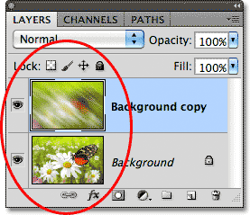
*The preview thumbnails now show very diferent images on each layer.*

### The Layer Visibility Icon

If I want to see the original photo again in the document, I can simply turn the blurred layer off by clicking on its **layer visibility** icon. When the little eyeball is visible in the box, it means the layer is visible in the document. Clicking the icon will hide the eyeball and hide the layer:

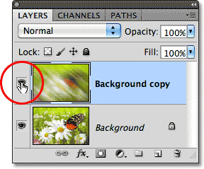
*Click the layer visibility icon to turn a layer off in the document.*

With the blurred layer hidden, the original photo reappears in the document. The blurred layer is still there, we just can't see it at the moment:

*The original image reappears in the document.*

To turn the blurred layer back on, I just need to click on its empty layer visibility icon:

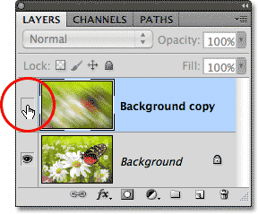
*The layer visibility icon appears empty when a layer is turned off.*

And this turns the blurred layer back on the document, once again hiding the original photo from view:

*The blurred layer reappears.*

### Renaming A Layer

As we've seen, Photoshop automatically names layers for us as we add them, but the names it gives them, like "Layer 1" and "Background copy", are pretty generic and not very helpful. When we only have a couple of layers in a document, the names may not seem very important, but when we find ourselves working with 10, 20 or even 100 or more layers, it's much easier to keep them organized if they have meaningful names. Thankfully, Photoshop makes it easy to rename a layer. Simply **double-click** directly on a layer's name in the Layers panel, then type in a new name. I'll change the name of my Background copy layer to "Blur". When you're done, press **Enter** (Win) / **Return** (Mac) on your keyboard to accept the name change:

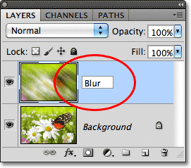
*Double-click on a layer's name, type in a new name, then press Enter (Win) / Return (Mac).*

### Adding a Layer Mask

Layer masks are essential for much of our Photoshop work. We won't get into the details of them here, but to add a layer mask on a layer, make sure the layer you want to add it to is selected, then click on the **Layer Mask** icon at the bottom of the Layers panel:

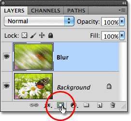
*Add a layer mask by clicking on the Layer Mask icon.*

A **layer mask thumbnail** will appear to the right of the layer's preview thumbnail, letting you know the mask has been added:

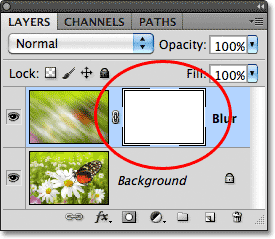
*A layer mask thumbnail appears.*

With the layer mask added, I can paint on it with a brush, using black as my paint color, to reveal part of the original image below the Blur layer:

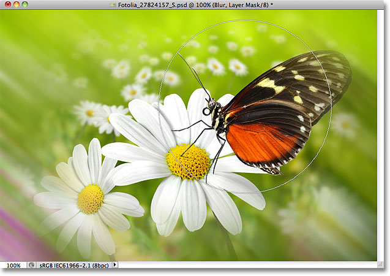
*Using the layer mask to reveal some of the orginal image.*

If you have no idea what I just did there, don't worry. Layer masks are a whole other topic, but you can learn more about them in our **[Understanding Layer Masks in Photoshop](/basics/layers/layer-masks/)** tutorial.

### Adding Fill Or Adjustment Layers

To the right of the Layer Mask icon at the bottom of the Layers panel is the **New Fill or Adjustment Layer** icon. It's the icon that looks like a circle split diagonally between black and white:

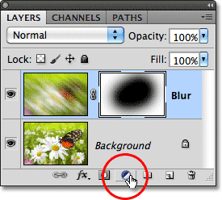
*The New Fill or Adjustment Layer icon.*

Clicking on it opens up a list of fill and adjustment layers we can choose from. Just as an example, I'll select a **Hue/Saturation** adjustment layer from the list:

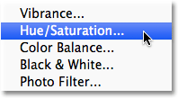
*Selecting a Hue/Saturation adjustment layer.*

Hue/Saturation lets us easily change the colors in an image. In Photoshop CS4 and CS5, the controls for the adjustment layer appear in the Adjustments Panel. In CS3 and earlier, they open in a separate dialog box. I'll quickly colorize my image by selecting the **Colorize** option, then I'll set the **Hue** value to **195** for a blue color and I'll increase the color **Saturation** value to **60**. Again, don't worry if anything I'm doing here seems foreign to you. I'm going through some things quickly just so we can get an overall picture of how much we can do in the Layers panel:

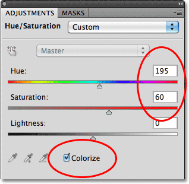
*The Hue/Saturation controls and options.*

Here's my image after colorizing it:

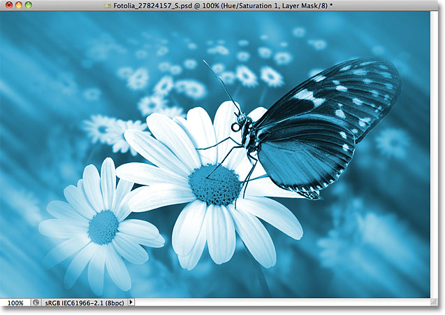
*The image after colorizing it with a Hue/Saturation adjustment layer.*

Adjustment layers are another topic that falls outside the scope of this tutorial, but the reason why I went ahead and added one anyway was so we can see that any adjustment layers we add to a document appear in the Layers panel just like normal layers. Here, my Hue/Saturation adjustment layer is sitting above the Blur layer:

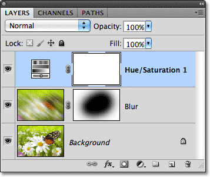
*The Layers panel displays any fill or adjustment layers we've added to the document.*

More information on Photoshop's adjustment layers can be found in our **[Non-Destructive Photo Editing With Adjustment Layers](/photo-editing/adjustment-layers/)** tutorial and our **[Reducing File Sizes With Adjustment Layers](/photo-editing/photoshop-file-size/)** tutorial, both of which are located in the [Photo Editing](/photo-editing/) tutorials section.

### Changing A Layer's Blend Mode

The Layers panel is also where we can change a layer's **blend mode**, which changes how the layer blends in with the layer(s) below it in the document. The blend mode option is found in the top left corner of the Layers panel directly below its name tab. It doesn't actually say "Blend Mode" anywhere, but it's the box that says "Normal" in it by default. To select a different blend mode, click on the word "Normal" (or whatever other blend mode happens to be selected at the time), then choose a different blend mode from the list that appears. I'll select the **Color** blend mode from the list:

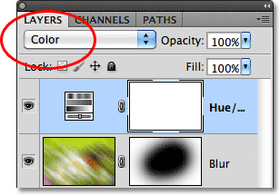
*Clicking on the word "Normal" will open a list of other layer blend modes to choose from.*

By changing the blend mode of the Hue/Saturation adjustment layer from Normal to Color, only the colors themselves in the image are now affected by the adjustment layer. The brightness values (the lights, darks and all the shades in between) are not affected, and we can see that my image now appears a bit brighter than it did a moment ago:

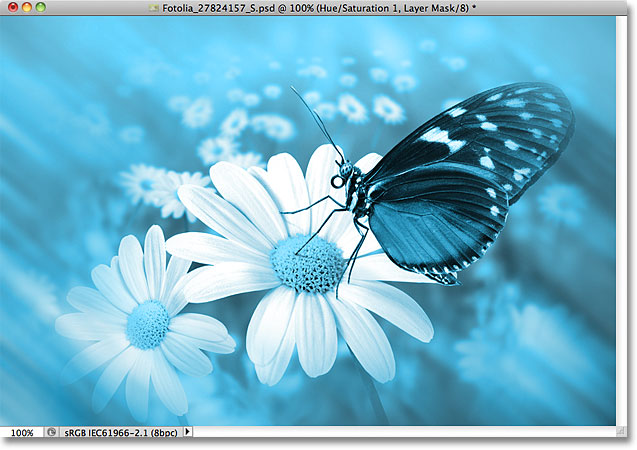
*Only the colors in the image are now being changed. The brightness values are unaffected.*

For more information on Photoshop's layer blend modes, including the Color blend mode, see our [**Five Essential Blend Modes For Photo Editing**](/photo-editing/layer-blend-modes/) tutorial.

### The Opacity And Fill Options

We can control a layer's level of **transparency** from the Layers panel using the **Opacity** option directly across from the blend mode option. An opacity value of 100% (the default value) means we can't see through the layer at all, but the more we lower the opacity value, the more the layer(s) below it will show through in the document. I'm going to lower the opacity of my Hue/Saturation adjustment layer down to 70%:

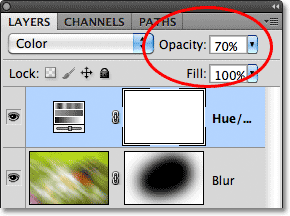
*The Opacity option controls a layer's transparency level.*

With the opacity lowered slightly, the original colors of the image begin to show through:

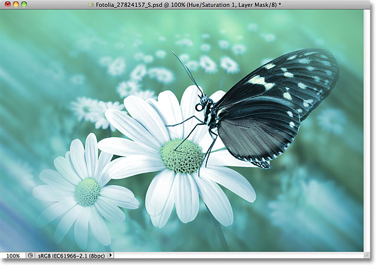
*The original colors now partially show through the adjustment layer.*

Directly below the Opacity option is the **Fill** option which also controls a layer's transparency value. In most cases, these two options (Opacity and Fill) behave exactly the same way, but there is one important difference between them that has to do with **layer styles**. Again, we won't get into the details here, but we cover it in our **[Layer Opacity vs Fill](/basics/layers/opacity-vs-fill/)** tutorial.

### Grouping Layers

Earlier, we learned that one of the ways we can keep our layers better organized in the Layers panel is by renaming them to something more meaningful. Another way is to group layers together into a **layer group**. We can create a new layer group by clicking on the **New Group** icon at the bottom of the Layers panel. It's the icon that looks like a folder (which is essentially what a layer group is). However, I'm not going to actually click on it because there's a bettter way to create a layer group:

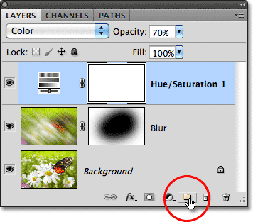
*The New Group icon.*

The problem (it's more of an inconvenience, really) with clicking the New Group icon is that it creates a new but empty group, requiring us to manually drag layers into the group ourselves. It's not a big deal, but there's a better way. I want place my Blur layer and my adjustment layer into a new group, so the first thing I'll do is select both of them at once. I already have the adjustment layer selected (highlighted), so to select the Blur layer as well, I simply need to hold down my **Shift** key as I click on the Blur layer, and now both layers are selected:

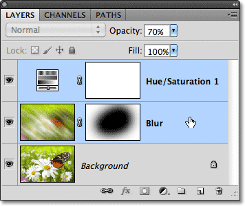
*Hold down Shift and click on other layers to select them as well.*

With both layers now selected, I'll click on the **menu icon** in the top right corner of the Layers panel (in earlier versions of Photoshop, the menu icon looks like a small arrow). This opens the Layers panel menu. Select **New Group from Layers** from the menu choices:

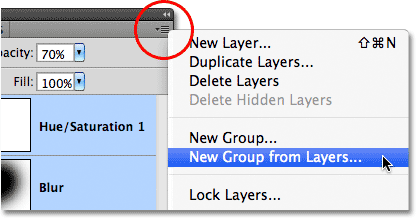
*Choose "New Group from Layers" from the Layers panel menu.*

Before creating the new group, Photoshop will pop open the New Group from Layers dialog box, giving us a chance to name the group and set a couple of other options. I'll just click OK to accept the default name and settings:

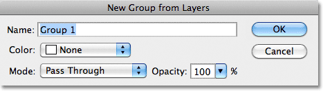
*The New Group from Layers dialog box.*

Photoshop creates the new group, giving it the default name "Group 1" and adds my two selected layers into the group. Layer groups are very much like folders in a filing cabinet. We can open the folder to see what's inside, and we can close the folder to keep everything neat and tidy. By default, layer groups are closed in the Layers panel. To open them and view the layers inside, click on the small triangle to the left of the folder icon:

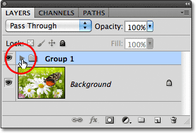
*The two selected layers are now hidden inside the group. Click the triangle to open it.*

This twirls the group open, and we can now see and access the layers inside of it if needed. To close the group again, just click again on the triangle icon:

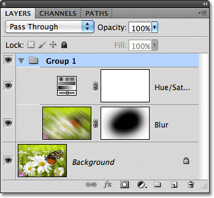
*Layer groups are great for keeping things organized.*

There's lots of cool things we can do with layer groups in Photoshop, but since this is just an overview of the Layers panel, we'll save a more detailed discussion of layer groups for another tutorial.

### Layer Styles

Also on the bottom of the Layers panel is the **Layer Styles** icon:

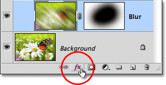
*The Layer Styles icon.*

Layer styles are easy ways to add lots of different effects to layers, including drop shadows, strokes, glows, and more! Clicking the Layer Styles icon opens a list of styles to choose from. We have a complete series on Photoshop's layer styles coming up:

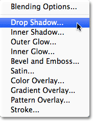
*The Layer Styles menu.*

### Locking Layers

Finally, the Layers panel also gives us a few different ways that we can lock certain aspects of a layer. For example, if part of a layer is transparent, we can lock the transparent pixels so that we're only affecting the actual contents (the image pixels) on the layer. Or we can lock the image pixels. We can lock the position of the layer so we can't accidentally move it around inside the document. There's four lock options to choose from, each represented by a small icon, and they're located just below the blend mode option. From left to right, we have **Lock Transparent Pixels**, **Lock Image Pixels**, **Lock Position**, and **Lock All**:

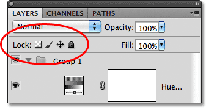
*The four layer lock options.*

If any or all of these options are selected, you'll see a small **lock icon** appear on the far right of the locked layer, as we can see on the Background layer which is locked by default:

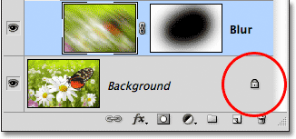
*A small lock icon indicates one of more aspects of the layer is locked.*

### Changing The Thumbnail Image Size

One last feature of the Layers panel that often comes in handy is the option to change the size of the thumbnails. Larger thumbnail images may make it easier for us to preview the contents of each layer, but they also take up more room, limiting the number of layers we can see at once in the Layers panel without having to start scrolling. To view more layers, we can simply make the thumbnail images smaller, and we can do that by clicking on the **menu icon** in the top right corner of the Layers panel, then choosing **Panel Options** from the menu:

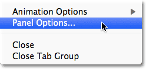
*Click on the menu icon in the top right corner, then choose Panel Options.*

This opens the Layers Panel Options dialog box. At the top of the dialog box is the **Thumbnail Size** option with three size choices and an option to turn the thumbnail images off (None). I wouldn't recommend choosing None, but I'll select the smaller of the three sizes:

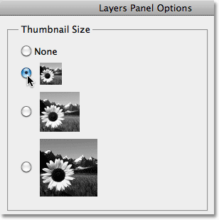
*Choose one of three thumbnail sizes, or choose None to turn them off in the Layers panel (not recommended).*

Once you've chosen a size, click OK to close out of the dialog box, and we can see in my Layers panel that everything now looks more compact. You can go back and change the thumbnail size at any time:

*Smaller thumbnail images leave more room for more layers.*