# Saving And Switching Workspaces In Photoshop CS6

> Source: [https://www.photoshopessentials.com/basics/photoshop-cs6-workspaces/](https://www.photoshopessentials.com/basics/photoshop-cs6-workspaces/)
> Downloaded and converted to Markdown.

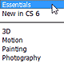

**Version note:** This tutorial is for Photoshop CS6. If you're using Photoshop CC, please see the updated [How To Use Workspaces in Photoshop CC](/basics/photoshop-workspaces/) tutorial.

In a [previous tutorial](/basics/managing-panels-in-photoshop-cs6/), we learned how to manage and arrange all of the panels that make up a large part of the interface in Photoshop CS6, like the Layers panel, History, Adjustments, and so on.

In that tutorial, we learned the difference between panels and panel groups, where to find and access all of Photoshop's panels, how to move panels from one group to another, how to expand, collapse, minimize and close panels, and more.

Once we've chosen the panels we'll need for our editing or design task and we've taken the time to arrange them in some sort of orderly fashion on the screen, wouldn't it be great if there was some way to save our custom panel layout so we could quickly choose it again the next time we need it? Thankfully, there is, and we do it by saving our layout as a **workspace**.

A workspace is simply Photoshop's way of knowing which panels to display on the screen and how to arrange them, and we can choose different workspaces depending on the type of task we're performing. You may want one panel arrangement for photo editing, a different one for digital painting, another one for working with type, and so on, and each panel layout can be saved and chosen as a workspace. In fact, Photoshop includes several built-in workspaces for us to choose from, and in this tutorial, we'll learn how to switch between these built-in workspaces, how to create our very own custom workspaces, and how to revert back to Photoshop's default panel layout when needed.

Before we go on, I should note that Photoshop's workspaces also allow us to save [custom keyboard shortcuts](/basics/custom-keyboard-shortcuts/) and even customized menus for the Menu Bar along the top of the screen. However, the most common use for workspaces is simply to save and switch between panel layouts, and that's what we'll be covering in this tutorial.

### The Default Workspace

When we first install Photoshop, we're presented with the default workspace which is called **Essentials**. It's sort of a general purpose workspace containing some of the more commonly used panels, like Layers, Channels, Adjustments and History, plus a few others. As we learned in the [Managing Panels in Photoshop CS6](/basics/managing-panels-in-photoshop-cs6/) tutorial, the panels are located in two columns along the far right of the screen. There's a **main column** on the right that's expanded so we can see the contents of these panels, and there's also a **secondary panel** to the left of the main panel. The secondary panel is collapsed into **icon view** to save screen space, but we can click on the icons to expand and collapse these panels as needed:

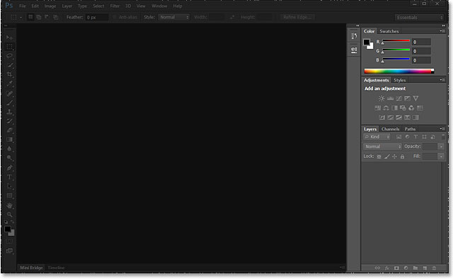
*The panels (highlighted) along the right of the interface.*

Let's take a closer look at the panels that make up the default Essentials workspace. In the main column on the right, we have three **panel groups**. The first group at the top holds the **Color** and **Swatches** panels, the middle group holds the **Adjustments** and **Styles** panels, and the bottom group holds three panels - **Layers**, **Channels** and **Paths**. In the secondary column on the left, we have two panels, **History** on top and **Properties** below it, both of which are collapsed into just their icon view mode:

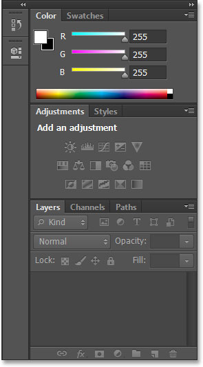
*The panels that make up the Essentials workspace.*

### Switching Between Workspaces

Essentials isn't the only workspace available to us. Photoshop includes other built-in workspaces that we can choose from, and we can select any of them at any time from the **workspace selection box** in the top right corner of the screen (directly above the main panel column). Here, we can see that by default, the workspace is set to Essentials:

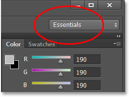
*The workspace selection box.*

If we click on the box, we open a menu showing the other workspaces we can choose from, each one focused on a more specific task. For example, I'll click on the **Painting** workspace to select it:

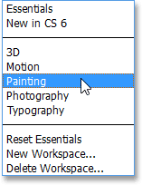
*Choosing the Painting workspace from the menu.*

Simply by choosing a different workspace, we get a different set of panels on the screen. In this case, the original panel set from the Essentials workspace has been replaced with a set more useful for digital painting. Some of the panels are the same as before, like Layers, Channels, and Paths because they're still useful for painting, but the Adjustments and Styles panels in the middle group have been replaced with the **Brush Presets** panel, and the Color panel has been replaced with the **Navigator** panel in the top group:

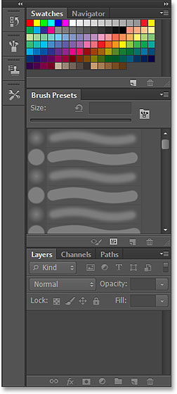
*The main column now displays a set of panels better suited for painting.*

If I make the second panel column a bit wider by clicking and dragging its left edge out further towards the left, we can see not only the icons for the new panels but also their names. Again, we see panels better suited for painting, like the **Brush** panel, **Clone Source** and **Tool Presets**. The History panel is the only hold-over here from the Essentials workspace because it's useful for painting as well:

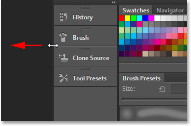
*Dragging the second column wider to view the panel names.*

I won't go through all of Photoshop's built-in workspaces since you can easily do that on your own, but as one more quick example, I'll click again on the workspace selection box in the top right corner of the screen and this time, I'll choose the **Photography** workspace from the menu:

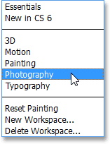
*Switching from Painting to the Photography workspace.*

Once again, Photoshop displays a different set of panels for us (I've resized the secondary column so we can see the names of the panels along with their icons). The Photography workspace gives us panels we'll most likely need for photo editing, including some new ones like the **Histogram**, **Info** and **Actions** panels:

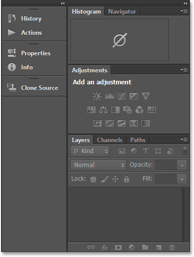
*The panels that make up the Photography workspace.*

### Saving Your Own Custom Workspace

Having these different built-in workspaces to choose from is great, but what's even better is that we can create and save our own custom workspaces. I'm going to switch back to the default Essentials workspace for a moment by clicking on the workspace selection box and choosing **Essentials** from the very top of the menu:

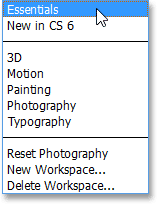
*Switching back to the Essentials workspace.*

This brings back the same default set of panels we saw at the beginning of the tutorial:

*Back to the default panels.*

Since I covered everything we need to know about selecting and arranging panels and panel groups in the [Managing Panels in Photoshop CS6](/basics/managing-panels-in-photoshop-cs6/) tutorial, I'll go ahead and quickly make some changes to my panel layout to customize things more to the way I like to work. Here we can see that I've closed the panels I don't use very often (like Color, Swatches and Styles) and instead I've placed the Histogram panel at the top of the main column. I've grouped the History and Actions panels in with the Layers panel (since all three panels tend to take up a lot of space) and I've moved the Channels and Paths panels, as well as the Adjustments panel, over to the secondary column. I've also opened a few additional panels from under the Window menu in the Menu Bar along the top of the screen and placed them in the secondary column as well. Finally, I've resized the secondary column so I can see the panel names with the icons:

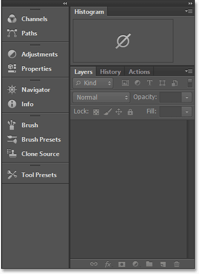
*My custom panel layout.*

To save your new panel layout as a custom workspace, click again on the workspace selection box in the top right corner of the screen and this time, instead of choosing one of the already existing workspaces, choose **New Workspace** from the menu:

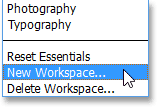
*Choosing New Workspace from the list.*

Photoshop will open the **New Workspace** dialog box for us so we can give our new workspace a name. I'll name mine something highly creative, like "Steve's Workspace", but unless your name also happens to be Steve, you may want to choose something different. At the bottom of the dialog box are options for including custom keyboard shortcuts and menus with our workspace, but I'm going to leave those blank:

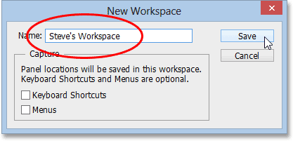
*Give your new workspace a name.*

Once you've entered a name, click the **Save** button to save your new custom workspace, and that's all there is to it! If you click again on the workspace selection box, you'll see your custom workspace displayed at the very top of the list so you can easily switch to it anytime you need:

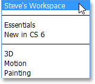
*Any new custom workspace you save is added to the list.*

### Resetting A Workspace

Whenever we make changes to an existing workspace, Photoshop remembers those changes the next time we select the workspace, and this can actually cause a bit of confusion if you're not aware of it. To show you what I mean, a moment ago, I created my own panel layout to save as a custom workspace, but if you remember, I was actually in the default Essentials workspace as I was opening, closing and moving panels around. Now that I've saved my new panel arrangement as a custom workspace, let's see what happens if I switch back to the default Essentials workspace:

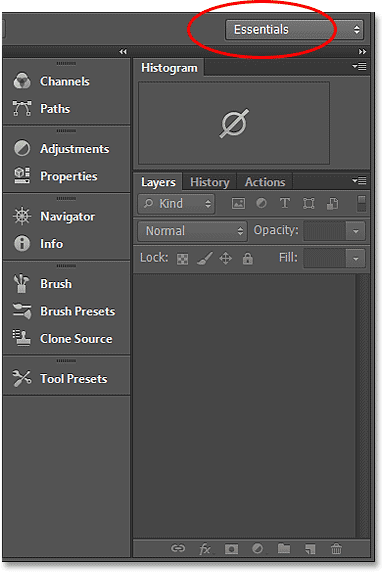
*The Essentials workspace no longer shows the default panels.*

Hmm, what's going on here? It says that I have the Essentials workspace selected, but I'm still seeing the same custom panel layout I created for my new workspace. That's because Photoshop remembered all the changes I made while I was still in the Essentials workspace and it keeps these changes until I reset the workspace myself.

To reset the Essentials workspace back to its original layout, I need to click on the workspace selection box and choose **Reset Essentials** from the list:

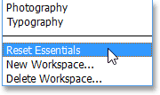
*Choosing "Reset Essentials" from the menu.*

And now things are back to the way we expected. The original panel layout has returned:

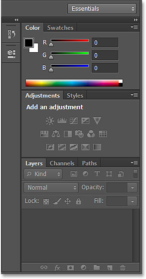
*The panels after resetting the Essentials workspace.*