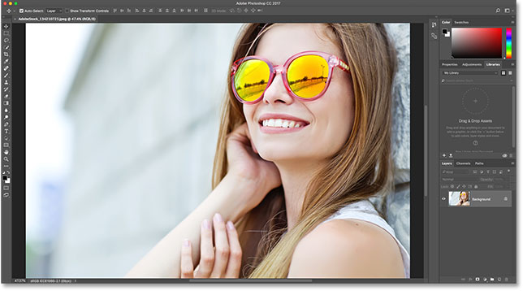
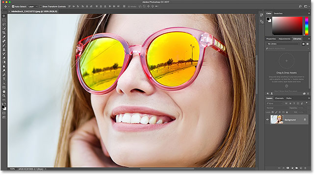
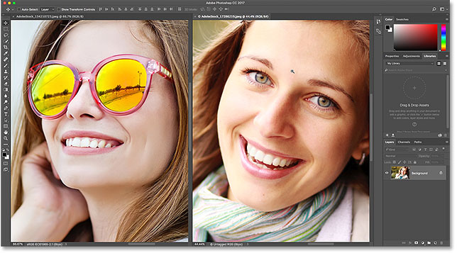
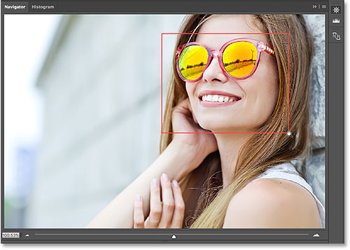

# Photoshop Image Navigation: Tips Tricks and Shortcuts

> Source: [https://www.photoshopessentials.com/basics/photoshop-image-navigation-tips-tricks-and-shortcuts/](https://www.photoshopessentials.com/basics/photoshop-image-navigation-tips-tricks-and-shortcuts/)
> Downloaded and converted to Markdown.

Speed up your workflow with this list of essential tips, tricks and shortcuts for navigating images in Photoshop. Covers basic image navigation commands, the Zoom Tool, the Hand Tool, the Navigator panel, and the Rotate View Tool. For Photoshop CC and CS6.

In this tutorial, you'll find all the tips, tricks and shortcuts you need to know for navigating images like a pro in Photoshop, and all in one convenient list. You'll learn the fastest ways to use Photoshop's basic image navigation commands, like **Zoom In**, **Zoom Out**, **Fit on Screen**, and **100%**. You'll also learn the tips and tricks for getting the most out of Photoshop's image navigation tools (the **Zoom Tool**, the **Hand Tool**, and the **Rotate View Tool**). And, you'll learn the best way to zoom into your images using Photoshop's **Navigator panel**. All of the tips, tricks and shortcuts covered here are fully compatible with both [Photoshop CC](https://prf.hn/l/dlXjD2w) and Photoshop CS6.

This is lesson 7 of 7 in [Chapter 4 - Navigating Images in Photoshop](/basics/photoshop-image-navigation/).

Let's get started!

## Basic image navigation shortcuts

### Zoom in and Zoom out

The **Zoom In** and **Zoom Out** commands are the most basic ways of zooming in or out of an image in Photoshop. You'll find them both under the **View** menu in the Menu Bar. To use the Zoom In command from your keyboard, on a Windows PC, press and hold your **Ctrl** key and press the "**+**" (plus) sign. On a Mac, press and hold your **Command** key and press the "**+**" (plus) sign.

To use the Zoom Out command from your keyboard, on a Windows PC, press and hold your **Ctrl** key and press the "**-**" (minus) sign. On a Mac, press and hold your **Command** key and press the "**-**" (minus) sign.

### Fit on Screen

Photoshop's **Fit on Screen** command displays your image at the largest possible zoom level while still being able to view it entirely on the screen. Like the Zoom In and Zoom Out commands, you'll find it under the **View** menu in the Menu Bar. To select Fit on Screen from your keyboard, on a Windows PC, press **Ctrl**+**0**. On a Mac, press **Command**+**0**. You can also select Fit on Screen by double-clicking on the **Hand Tool** in the Toolbar (sunglasses photo from [Adobe Stock](https://prf.hn/l/Y3gN4NY)):

*Press Ctrl+0 (Win) / Command+0 (Mac) to fit the image on your screen. Photo credit: Adobe Stock.*

### 100%

The **100%** command (known as "Actual Pixels" in earlier versions of Photoshop) instantly jumps your image to a zoom level of 100%. At this zoom level, each pixel in your image takes up exactly one pixel on your screen, letting you view the image in full detail. This is the ideal zoom level for [image sharpening](/photo-editing/sharpen-high-pass/). The 100% command can be found under the **View** menu in the Menu Bar. To select 100% from the keyboard, press **Ctrl**+**1** (Win) / **Command**+**1** (Mac). You can also select it by double-clicking on the **Zoom Tool** in the [Toolbar](/basics/photoshop-tools-toolbar-overview/).

*Press Ctrl+1 (Win) / Command+1 (Mac) to zoom the image to 100%.*

### Screen navigation shortcuts

Here's some handy shortcuts you can use to quickly navigate around your image while you're zoomed in. Press the **Home** key on your keyboard to instantly jump to the upper left of the image, or the **End** key to jump to the lower right. Press the **Page Up** key to move up one full screen, or **Page Down** to move down one full screen. Pressing **Ctrl**+**Page Up** (Win) / **Command**+**Page Up** (Mac) will move you one full screen to the left, while **Ctrl**+**Page Down** (Win) / **Command**+**Page Down** (Mac) will move one full screen to the right.

## Zoom Tool shortcuts

### Selecting the Zoom Tool

To quickly select Photoshop's [Zoom Tool](/basics/photoshop-zoom/), press the **Z** key on your keyboard. With the Zoom Tool selected, click on your image to zoom in. To switch the Zoom Tool from "zoom in" to "zoom out" mode, press and hold the **Alt** (Win) / **Option** (Mac) key on your keyboard.

To *temporarily* switch to the Zoom Tool when any other tool is active, press and hold **Ctrl**+**spacebar** (Win) / **Command**+**spacebar** (Mac) on your keyboard. Click on the image to zoom in, and then release the keys to switch back to the previous tool.

To temporarily switch to the Zoom Tool and zoom *out* from the image, press **Ctrl**+**Alt**+**spacebar** (Win) / **Option**+**spacebar** (Mac). Click on the image to zoom out, and then release the keys.

### Zoom all open images

If you have two or more images open in Photoshop, you can [zoom all images](/basics/zoom-and-pan-all-images-at-once-in-photoshop/) at the same time. Just press and hold the **Shift** key on your keyboard as you're zooming in or out. To switch back to zooming a single image at a time, release the Shift key.

*Press and hold Shift while zooming to zoom all open images at once.*

### Continuous zoom

To zoom in continuously on the same spot, click and hold on the image with the Zoom Tool. Photoshop will gradually zoom in closer until you release your mouse button. To zoom out continuously, add your **Alt** (Win) / **Option** (Mac) key.

### The "Spring-Loaded" Zoom Tool

Most of Photoshop's tools can be accessed as *spring-loaded* tools. Pressing and holding the keyboard shortcut for a tool will temporarily switch you to that tool for as long as the key is held down. When you release the key, you'll switch back to the previously-active tool.

To use the Zoom Tool as a spring-loaded tool, press and hold the **Z** key on your keyboard. Click on the image to zoom in, or add the **Alt** (Win) / **Option** (Mac) key to zoom out, and then release the Z key to revert back to your previous tool.

### Scrubby zoom

Photoshop's **Scrubby Zoom** feature is the fastest way to zoom images. Press and hold **Ctrl+spacebar** (Win) / **Command+spacebar** (Mac) on your keyboard to temporarily access the Zoom Tool, and then click on the image and drag left or right. Dragging to the right will zoom you in, while dragging to the left will zoom you out. Drag slower or faster to change the speed of the zoom.

## Hand Tool shortcuts

### Selecting the Hand Tool

To scroll, or pan, images in Photoshop, we use the [Hand Tool](/basics/photoshop-zoom/). To select the Hand Tool from the keyboard, press the **H** key. Or, to *temporarily* switch to the Hand Tool when any other tool is active, press and hold your **spacebar**. Click and drag the image to reposition it within the document window, and then release the spacebar to switch back to the previous tool.

### Scroll all open images

To scroll all open images at once, with the Hand Tool selected, press and hold your **Shift** key as you click and drag one of the images.

### Birds Eye View

When zoomed in on an image, Photoshop's [Birds Eye View](/basics/photoshop-birds-eye-view-tutorial/) feature lets you quickly jump from one part of an image to another. To use Birds Eye View, press and hold the **H** key (the shortcut for the Hand Tool) on your keyboard. Photoshop instantly zooms the image out so that it fits entirely on the screen, giving you a "birds eye view" of where you are. Drag the **rectangle** over the area where you want to zoom in, and then release your H key. Photoshop will instantly zoom in to the selected area, and you'll return to your previously-active tool.

## Navigator Panel shortcuts

### Selecting the area to zoom in

When using Photoshop's [Navigator panel](/basics/how-to-use-the-navigator-panel-in-photoshop/), the fastest way to zoom in on your image is by dragging a selection around the area you need. Press and hold your **Ctrl** (Win) / **Command** (Mac) key and drag out a selection (a View Box) around the area where you want to zoom in. Release your mouse button, and Photoshop will instantly zoom in to that area.

*In the Navigator panel, hold Ctrl (Win) / Command (Mac) and draw a selection to zoom in.*

## Rotate View Tool shortcuts

### Selecting the Rotate View Tool

The [Rotate View Tool](/basics/photoshop-rotate-view-tool/) in Photoshop lets you easily rotate the viewing angle of an image as you work. You can select the Rotate View Tool from the keyboard by pressing the letter **R**.

### Rotating your view in steps

By default, the Rotate View Tool will rotate the angle freely as you drag. To snap the angle to incremental steps of 15 degrees, press and hold your Shift key as you drag.

### The "spring-loaded" Rotate View Tool

The best way to use the Rotate View Tool is as a spring-loaded tool. When any other tool is active, press and hold the **R** key to temporarily switch to the Rotate View Tool. Click and drag inside the document window to rotate your view, and then release the R key to switch back to the previous tool and continue working.

### Resetting the view

To reset your view and restore the image to its upright position, press the **Esc** key on your keyboard. Or, double-click on the **Rotate View Tool** in the Toolbar.