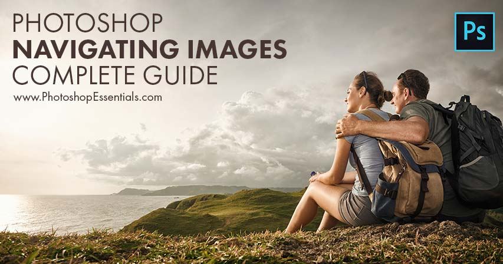

# Complete Guide to Navigating Images in Photoshop

> Source: [https://www.photoshopessentials.com/basics/photoshop-image-navigation/](https://www.photoshopessentials.com/basics/photoshop-image-navigation/)
> Downloaded and converted to Markdown.

Learn how to zoom, pan and navigate your images like a pro in Photoshop with Chapter 4 of our Photoshop Basics training series!

In lesson 1, you'll start with the [basics of zooming and scrolling in Photoshop](/basics/photoshop-zoom/), learning all about the **Zoom Tool**, the **Hand Tool** and Photoshop's basic navigation commands. Then in lesson 2, you'll move from navigating a *single* image to learning [how to zoom and scroll multiple images at once](/basics/zoom-and-pan-all-images-at-once-in-photoshop/)!

Lesson 3 looks at Photoshop's [Navigator panel](/basics/how-to-use-the-navigator-panel-in-photoshop/) and why it's a great way to keep track of where you are in an image when you're zoomed in! And in lesson 4, you'll learn how to scroll an image at any zoom level using a new option in Photoshop CC known as [Overscroll](/basics/photoshop-cc-overscroll/).

[Birds Eye View](/basics/photoshop-birds-eye-view-tutorial/) is an amazing yet hidden feature in Photoshop that lets you instantly jump from one part of an image to another. You'll learn the secret trick to using Birds Eye View in lesson 5. And if you've ever drawn with a pencil, you know that rotating the paper can make it easier to work. Lesson 6 shows you how to do the same thing with your image using Photoshop's [Rotate View Tool](/basics/photoshop-rotate-view-tool/). And finally, in Lesson 7, we'll round up all of the essential [tips, tricks and shortcuts](/basics/photoshop-image-navigation-tips-tricks-and-shortcuts/) for navigating your images like a pro in Photoshop!

Need printable versions of these tutorials? All of our Photoshop tutorials are now available to [download as PDFs](/print-ready-pdfs/)! Let's get started!

Completed all the lessons in this chapter? Congratulations! It's time to move on to [Chapter 5 - How to Resize Images in Photoshop](/basics/how-to-resize-images-in-photoshop-complete-guide/)! Or for more chapters, and for our latest tutorials, see our [Photoshop Basics](/basics/) section!