# Photoshop Layer Masks Advanced Tips and Tricks

> Source: [https://www.photoshopessentials.com/basics/photoshop-layer-masks-advanced-tips-and-tricks/](https://www.photoshopessentials.com/basics/photoshop-layer-masks-advanced-tips-and-tricks/)
> Downloaded and converted to Markdown.

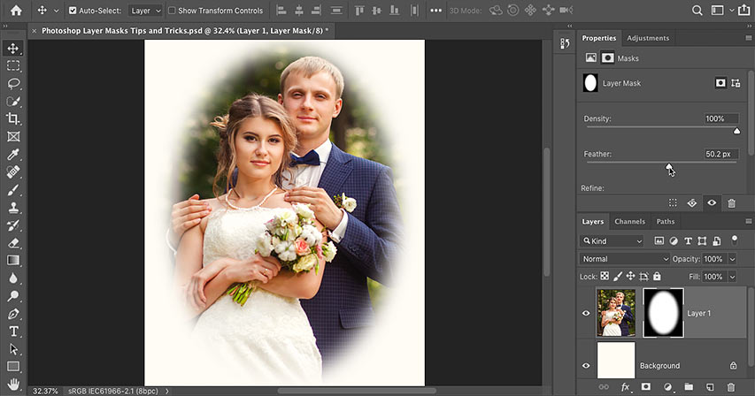

Unlock the full power of layer masks in Photoshop with over a dozen must-know tips and tricks! Learn how to copy, move, fade and feather layer masks, and more! For Photoshop CC and CS6.

Layer masks are used to show or hide different parts of a layer, by filling different areas of the mask with either white, black or gray. White areas on a layer mask show those parts of the layer, while black areas on the mask hide them. And gray will partially show or hide areas depending on the shade of gray you use. The darker the shade, the more the layer fades from view.

Knowing how to use layer masks is an essential Photoshop skill. And in this tutorial, you'll learn the advanced tips and tricks for working with layer masks that will help you edit and composite images like a pro! 

If you're brand new to layer masks, you'll want to first learn the basics by checking out my [Layer Masks for Beginners](/basics/understanding-photoshop-layer-masks/) tutorial. I'm using [Photoshop CC](https://prf.hn/l/dlXjD2w) but any recent version will work. Let's get started!

## Photoshop layer mask tips and tricks

Let's start with a couple of tips you can use when adding a layer mask to your document. 

Here's an [image](https://prf.hn/l/BOxVbw1) I've opened in Photoshop:

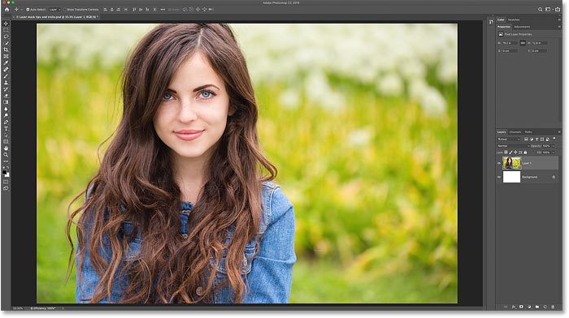

*The original image. Photo credit: Adobe Stock.*

And if we look in the **Layers panel**, we see the image sitting on its own [layer](/photoshop-layers-learning-guide/) above the Background layer:

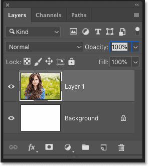

*The Layers panel showing the photo on a separate layer.*

### Tip #1: How to add a layer mask that hides the contents of a layer

Normally, to add a layer mask, we click the **Add Layer Mask** icon:

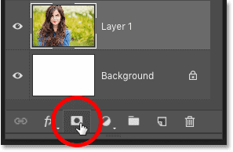

*Clicking the Add Layer Mask icon.*

And by default, Photoshop adds a white-filled layer mask which keeps the entire layer visible:

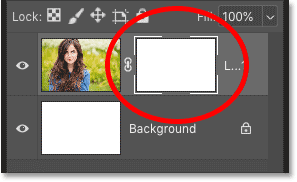

*Layer masks are usually filled with white.*

But you can also add a layer mask that *hides* the entire contents of your layer. Just press and hold the **Alt** (Win) / **Option** (Mac) key on your keyboard as you click the **Add Layer Mask** icon. Instead of white, Photoshop fills the mask with *black*, hiding the layer's contents from view:

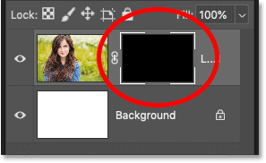

*Add a black layer mask to hide the contents of the layer.*

### Tip #2: How to hide the selected area when adding a layer mask

The same is true when turning a *selection* into a layer mask. Here, I've used the [Elliptical Marquee Tool](/basics/selections/elliptical-marquee-tool/) to draw a circular selection outline around my subject:

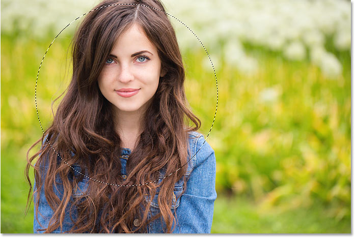

*Making a selection before adding the layer mask.*

I'll click the **Add Layer Mask** icon:

*Adding a layer mask.*

And Photoshop converts the selection into a layer mask. By default, the area inside the selection remains visible (filled with white on the mask), while everything outside the selection is hidden (filled with black):

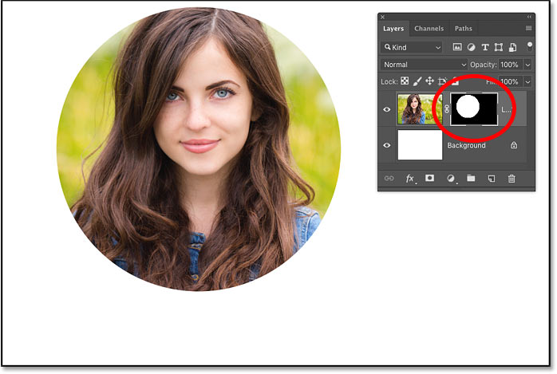

*Converting a selection into a layer mask normally keeps the area inside the selection visible.*

But if you'd rather *hide* the area inside the selection and keep everything *outside* of it visible, press and hold **Alt** (Win) / **Option** (Mac) as you click the **Add Layer Mask** icon. This fills the selected area with black on the mask, and fills everything outside the selection with white:

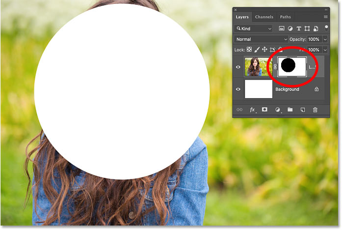

*Hold Alt (Win) / Option (Mac) to invert the layer mask when creating it from a selection.*

### Tip #3: How to invert a layer mask

To invert the colors of an *existing* layer mask, making white areas black and black areas white, make sure the layer mask itself is active:

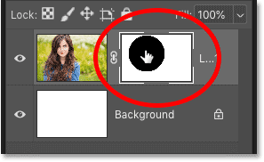

*Clicking the thumbnail to select the layer mask.*

Then go up to the **Image** menu in the Menu Bar, choose **Adjustments**, and then choose **Invert**. Or use the faster keyboard shortcut, **Ctrl+I** (Win) / **Command+I** (Mac):

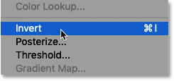

*Going to Image > Adjustments > Invert.*

With the mask inverted, we're back to seeing my subject, and everything around her is once again hidden:

*The result after inverting the layer mask.*

### Tip #4: How to view a layer mask in the document

To view the layer mask itself in the document, press and hold **Alt** (Win) / **Option** (Mac) on your keyboard and click on the **layer mask thumbnail**. This replaces your view of the image with the mask:

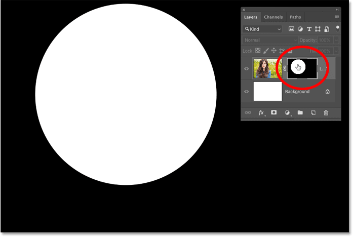

*Alt / Option-clicking on the mask's thumbnail to view the layer mask in the document.*

And then to switch back to viewing the image, either Alt / Option-click once again on the layer mask thumbnail, or simply click on the layer's thumbnail beside it:

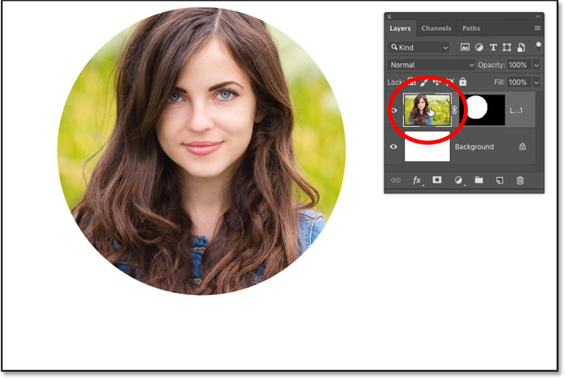

*Clicking the layer's thumbnail to return to the image.*

### Tip #5: How to view your layer mask in Quick Mask mode

To view your layer mask in Quick Mask mode as a red overlay, press the **backslash** key ( **\** ) on your keyboard. Press the backslash key again to return to the normal view:

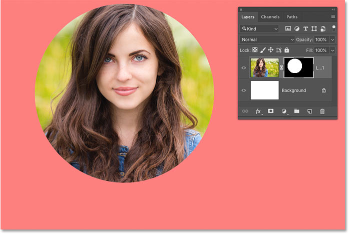

*Toggle Quick Mask mode on and off using the backslash key ( \ ).*

### Tip #6: How to disable a layer mask

To disable a layer mask so you can view the entire layer, press and hold your **Shift** key and click the **layer mask thumbnail**. A red "X" appears in the thumbnail letting you know that the mask is turned off. Then Shift-click the thumbnail again to turn the mask back on:

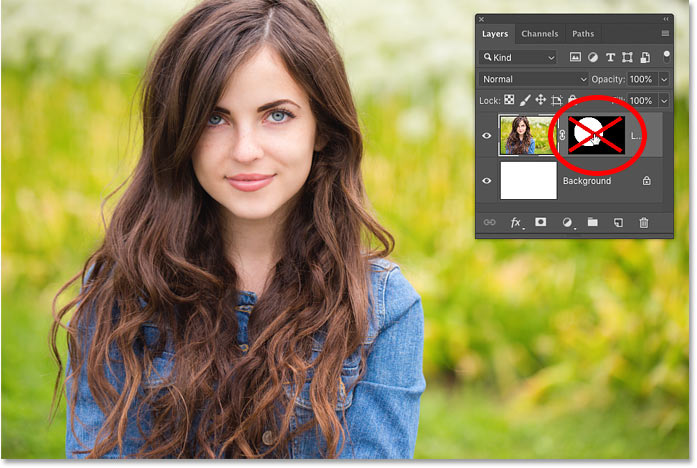

*Toggle a layer mask on and off by Shift-clicking its thumbnail.*

### Tip #7: How to unlink a layer mask from its layer

By default, a layer and its mask are linked together, so moving one also moves the other. To unlink them so you can move the layer and the mask separately, click the **link icon** between the two thumbnails:

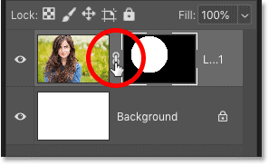

*Clicking the link icon to unlink the mask from its layer.*

#### Moving the layer mask without moving the layer

Then, to move the layer mask, first select the **Move Tool** from the [Toolbar](/basics/photoshop-tools-toolbar-overview/) (keyboard shortcut: V):

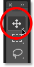

*Selecting the Move Tool.*

Click the layer mask thumbnail to select it:

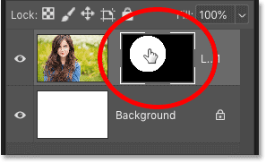

*Selecting the layer mask.*

And then drag in the document to move the mask around. As you drag the mask, the image stays in place:

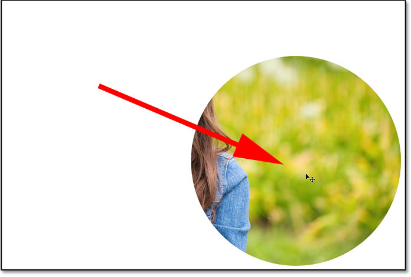

*Moving the layer mask without moving the contents of the layer.*

#### Moving the layer without moving the mask

To move the layer without moving the mask, click the layer's thumbnail to select it:

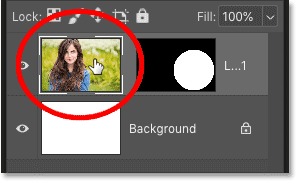

*Selecting the layer contents.*

And then click and drag with the Move Tool to move the image around inside the mask:

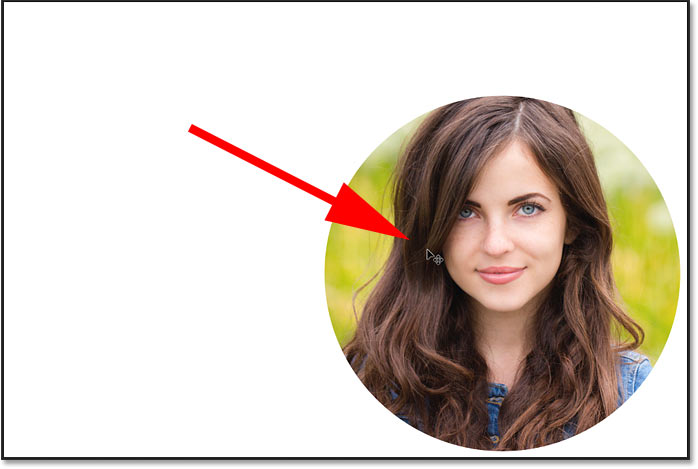

*Moving the layer without moving the mask.*

#### How to relink the layer and the layer mask

To relink the layer and the mask, click between the two thumbnails to restore the link icon:

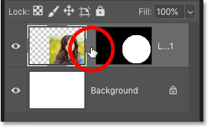

*Relinking the layer and the layer mask.*

And now when you click and drag in the document, you'll move both the layer and the mask at the same time:

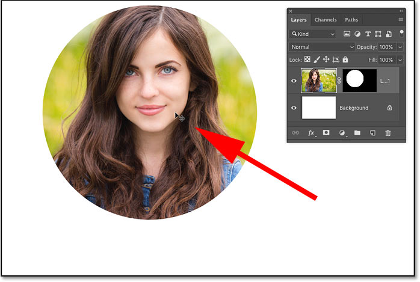

*Moving both the layer and the mask at once.*

### Tip #8: How to switch between the layer and its mask from the keyboard

We've seen that you can switch between the layer and the layer mask from the Layers panel. Click the layer's thumbnail (on the left) to select the contents of the layer, or click the mask's thumbnail (on the right) to select the layer mask.

But you can also switch between the layer and the mask from your keyboard:

- To select the layer, press **Ctrl+2** (Win) / **Command+2** (Mac).
- To select the mask, press **Ctrl+backslash** ( **\** ) (Win) / **Command+backslash** ( **\** ) (Mac).

### Tip #9: How to move a layer mask from one layer to another

Next, let's learn how to move or copy a layer mask from one layer to another. I've added a [second image](https://prf.hn/l/9mo9VNk) to my document and placed it on a layer above the first one. The second image is blocking the original one from view:

*A second image added above the first. Photo credit: Adobe Stock.*

To *move* a layer mask to another layer, simply click and drag the mask thumbnail onto the new layer in the Layers panel:

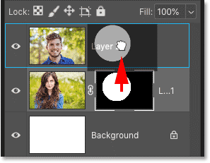

*Moving the mask onto the layer above it.*

Release your mouse button to drop the mask into place:

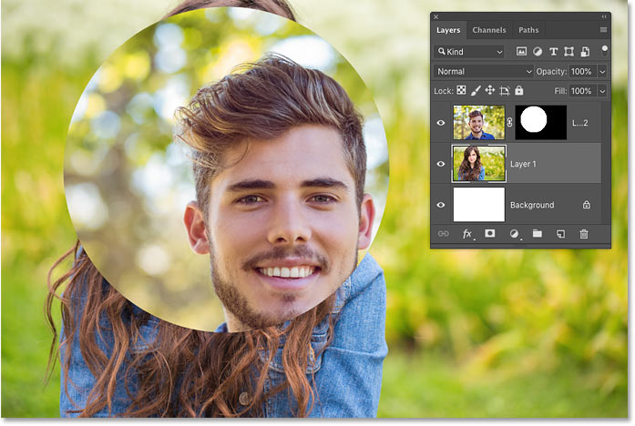

*The layer mask is now affecting the top image, not the one below it.*

### Tip #10: How to copy a layer mask to another layer

To *copy*, rather than just move, a layer mask to another layer, press and hold **Alt** (Win) / **Option** (Mac) as you drag the mask thumbnail to the other layer:

*Alt / Option-drag to copy a mask to another layer.*

Release your mouse button, and now both layers share an identical mask:

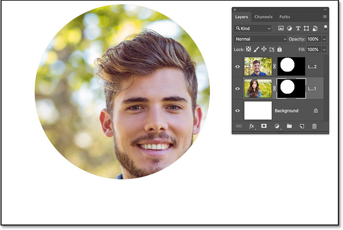

*The result after copying the mask from the first image onto the second image.*

You can then use the Move Tool to reposition the masks and the layer contents in the document:

*Copying a layer mask is an easy way to create simple layouts.*

### Tip #11: How to delete a layer mask

To delete both a layer *and* its layer mask, click on the layer in the Layers panel to select it. Here I'm selecting the top layer:

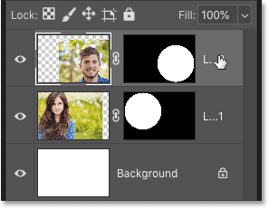

*Selecting the layer to delete.*

And then to delete it, press **Backspace** (Win) / **Delete** on your keyboard. Both the layer and the mask are gone:

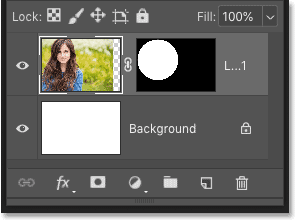

*Deleting both the layer and the mask at once.*

To delete just the layer mask itself, **right-click** (Win) / **Control-click** (Mac) on the layer mask thumbnail and choose **Delete Layer Mask** from the menu:

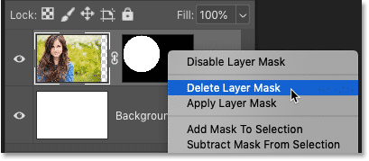

*Right / Control-clicking on the mask thumbnail and choosing "Delete Layer Mask".*

This deletes the mask but keeps the layer:

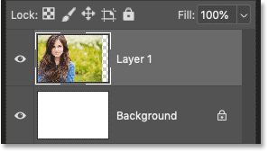

*The layer still remains after deleting its mask.*

## How to fade or feather a layer mask

Finally, let's look at two powerful layer mask options in Photoshop's **Properties panel**. The first option, **Density**, lets you fade the effect of your layer mask. And the second, **Feather**, makes it easy to soften your layer mask edges. Let's see how they work.

In [this image](https://prf.hn/l/ZYkOEd5), I want to use a layer mask to add a vignette effect around the couple:

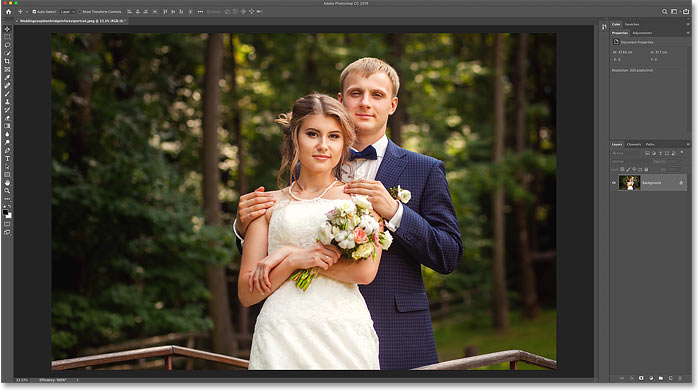

*The original image. Credit: Adobe Stock.*

I've gone ahead and added an initial layer mask around them:

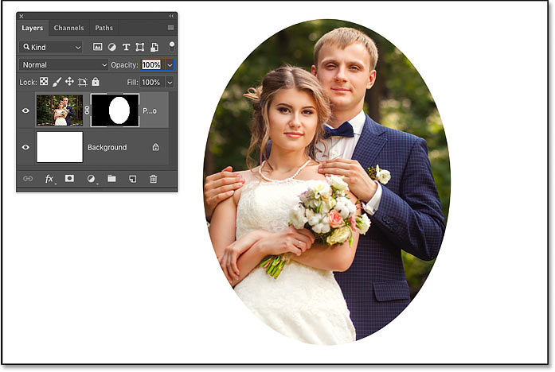

*The initial layer mask.*

If you're not seeing the layer mask options in the Properties panel, make sure the **layer mask icon** is selected at the top:

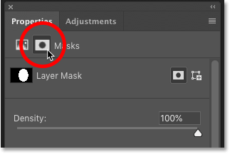

*The Properties panel lets you switch between the layer and the mask.*

### Tip #12: How to fade a layer mask

To fade the effect of a layer mask, use the **Density** slider. The more you lower the Density from its default value of 100%, the more the areas that were hidden by the mask will show through:

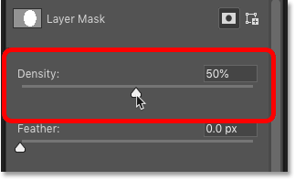

*Fading the layer mask using the Density slider.*

Here we see that at a Density value of 50%, the rest of the image outside of my selection is now 50% visible. And notice in the layer mask thumbnail that the areas of the mask that were once black are now a much lighter gray:

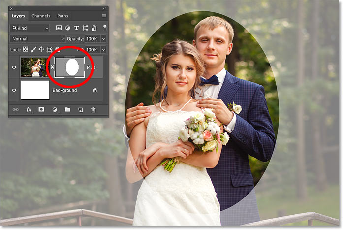

*The result after fading the layer mask using Density.*

Being able to fade a layer mask can be very useful, but it's not the effect I'm going for with this image. So I'll increase the Density back to 100% to hide the areas around my selection:

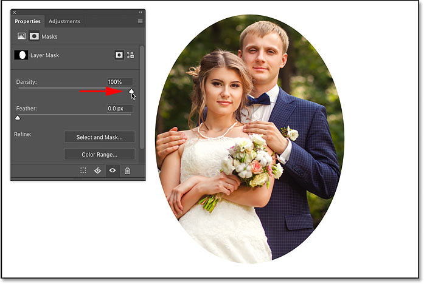

*Resetting the Density option back to 100%.*

### Tip #13: How to feather a layer mask

What I want to do instead is soften the edges of my layer mask to create a vignette effect. And I can do that easily using the **Feather** option in the Properties panel. To soften the edges, drag the Feather slider to the right. The further you drag, the softer the mask edges appear:

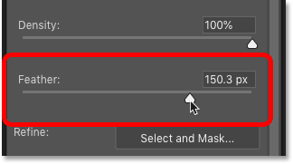

*Softening the layer mask edges with the Feather slider.*

And just by dragging the Feather slider, I'm able to quickly create my vignette effect:

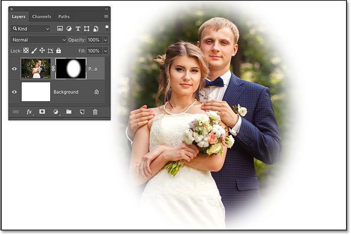

*The result using the Feather option in the Properties panel.*

And there we have it! That's over a dozen tips and tricks you can use to unlock the full power of layer masks in Photoshop! Check out our [Photoshop Basics](/basics/) section for more tutorials! And don't forget, all of our tutorials are now available to [download as PDFs](/print-ready-pdfs)!