# Photoshop Layers Essential Shortcuts

> Source: [https://www.photoshopessentials.com/basics/photoshop-layers-essential-shortcuts/](https://www.photoshopessentials.com/basics/photoshop-layers-essential-shortcuts/)
> Downloaded and converted to Markdown.

When it comes to getting the most out of Photoshop with the least amount of effort, there's two things you *absolutely* need to know - how to use [layers](/layers/) and how to get around inside Photoshop using [keyboard shortcuts](/custom-keyboard-shortcuts/). 

We've combined the two and rounded up the essential shortcuts for working with layers! Learning these power shortcuts will not only increase your productivity, they'll also boost your confidence as you take a giant leap forward on the road to Photoshop mastery! 

Adobe made several major changes to the Layers palette in Photoshop CS2, so while many of these shortcuts work with any recent version of Photoshop, I've noted the cases where the shortcut only works with a specific version of the program (i.e. Photoshop CS2 or higher).

**Update:** Using Photoshop CS6 or CC? You'll want to follow along with the [updated version](/basics/layer-shortcuts/) of this tutorial.

### Open And Close The Layers Palette

To open the Layers palette if it isn't already open on your screen, press the *F7* key at the top of your keyboard. You can also press *F7* to close the Layers palette.

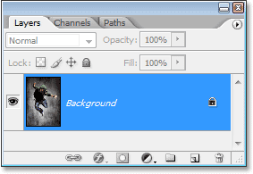
*Press "F7" to open and close the Layers palette.*

### Create A New Layer

To create a new layer, press *Shift+Ctrl+N* (Win) / *Shift+Command+N* (Mac). This will pop-up Photoshop's *New Layer* dialog box where you can name the layer, as well as set some other options:

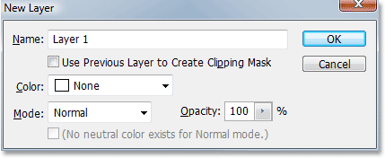
*Press "Shift+Ctrl+N" (Win) / "Shift+Command+N" (Mac) to add a new layer and access the "New Layer" dialog box.*

To create a new layer and bypass the "New Layer" dialog box, press *Shift+Ctrl+Alt+N* (Win) / *Shift+Command+Option+N* (Mac).

### Create A New Layer Below The Currently Selected Layer

By default, Photoshop adds a new layer above the layer currently selected in the Layers palette. To tell Photoshop to add the new layer *below* the currently selected layer, hold down the *Ctrl* (Win) / *Command* (Mac) key and click on the *New Layer* icon at the bottom of the Layers palette:

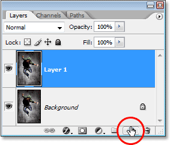
*Hold down "Ctrl" (Win) / "Command" (Mac) and click on the "New Layer" icon to add a new layer below the currently selected layer.*

This adds a new layer below the layer that was selected:

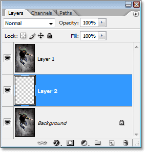
*The new layer appears below the layer that was selected.*

Note that this does not work with the Background layer, since Photoshop doesn't allow any layers to be below the Background layer.

### Copy A Layer, Or Copy A Selection To A New Layer

To copy a layer, or to copy a selection to a new layer, press *Ctrl+J* (Win) / *Command+J* (Mac). Here, I've made a copy of the Background layer:

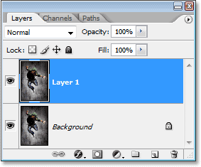
*Press "Ctrl+J" (Win) / "Command+J" (Mac) to copy a layer, or to copy a selection to a new layer.*

To access the "New Layer" dialog box when you copy a layer or copy a selection to a new layer, press *Ctrl+Alt+J* (Win) / *Command+Option+J* (Mac).

### Select All Layers At Once (Photoshop CS2 and higher)

To select all layers at once in Photoshop CS2 and higher, press *Ctrl+Alt+A* (Win) / *Command+Option+A* (Mac). Note that this selects all layers *except* the Background layer.

### Select All Similar Layers At Once (Photoshop CS2 and higher)

To select all similar layers at once in Photoshop CS2 and higher, such as all text layers, adjustment layers or shape layers, *Right-click* (Win) / *Control-click* (Mac) on one of the layers, then choose *Select Similar Layers* from the menu that appears:

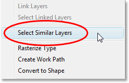
*"Right-click" (Win) / "Control-click" (Mac) on a layer, then choose "Select Similar Layers" from the menu to have Photoshop select all layers of the same type.*

### Select Multiple Layers (Photoshop CS2 and higher)

This is where most people who upgrade to Photoshop CS2 (or CS3) from earlier versions of Photoshop get confused, since the old familiar link column on the left is gone as of Photoshop CS2. To select multiple layers that are all directly above or below each other in the Layers palette, click once on the top layer to select it, then hold down your *Shift* key and click on the bottom layer (or vice versa). This will select the top layer, the bottom layer, and all the layers in between:

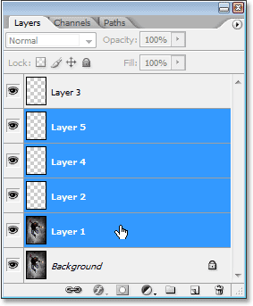
*Click on the top layer, then hold down the "Shift" key and click on the bottom layer to select both layers at once plus every layer in between.*

Another way to select multiple layers that are all directly above or below each other (again, this only works in Photoshop CS2 and higher) is to hold down *Shift+Alt* (Win) / *Shift+Option* (Mac) and use the *left or right bracket keys* ( *[* or *]* ). The right bracket key will add the layer *above* the currently selected layer to your selection and will continue moving up the layer stack if you continue pressing it, while the left bracket key will add the layer *below* the currently selected layer to your selection and will continue moving down the layer stack if you continue pressing it.

To select multiple layers that are not directly above or below each other, hold down your *Ctrl* (Win) / *Command* (Mac) key and click on each layer you want to select:

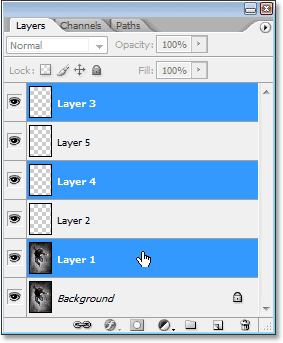
*To select multiple layers that are scattered throughout the Layers palette, hold down "Ctrl" (Win) / "Command" (Mac) and click on each layer individually to select it.*

### Quickly Select The Top Or Bottom Layer (Photoshop CS and earlier)

Here's one that's just for people using Photoshop CS and earlier, since it no longer works in Photoshop CS2 or higher. To quickly select the *top layer* in the Layers palette, press *Shift+Alt+]* (Win) / *Shift+Option+]* (Mac).

To quickly select the *bottom layer* in the Layers palette (including the Background layer), press *Shift+Alt+[* (Win) / *Shift+Option+[* (Mac).

### Scroll Through The Layers

To scroll through the layers in the Layers palette, hold down your *Alt* (Win) / *Option* (Mac) key and use the *left and right bracket keys* ( *[* and *]* ). The right bracket key scrolls upward through the layers, and the left bracket key scrolls down.

### Move Layers Up And Down The Layer Stack

To move a layer *up* the layer stack, hold down your *Ctrl* (Win) / *Command* (Mac) key and press the *right bracket key*. The more times you press the right bracket key, the higher up you'll move the layer.

To move a layer *down* the layer stack, hold down your *Ctrl* (Win) / *Command* (Mac) key and press the *left bracket key*. The more times you press the left bracket key, the further down you'll move the layer.

Note that this does not work with the Background layer, since you can't move the Background layer. Also, you won't be able to move any other layers below the Background layer.

### Jump A Layer Directly To The Top Or Bottom Of The Layer Stack

To jump a layer straight to the *top* of the layer stack, press *Shift+Ctrl+]* (Win) / *Shift+Command+]* (Mac). Here, I've jumped "Layer 1" directly above "Layer 2" and "Layer 3":

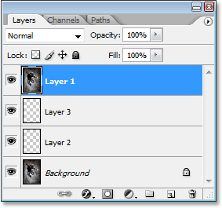
*Press "Shift+Ctrl+]" (Win) / "Shift+Command+]" (Mac) to instantly jump a layer to the top of the layer stack.*

To jump a layer straight to the *bottom* of the layer stack, or at least to the spot just above the Background layer (since nothing can go below the Background layer), press *Shift+Ctrl+[* (Win) / *Shift+Command+[* (Mac)

Again, neither of these shortcuts work with the Background layer.

### Show / Hide Layers

Most people who've been using Photoshop for a while know that you can temporarily hide or show a layer by clicking on its *Layer Visibility* icon (the eyeball) on the left of the layer in the Layers palette:

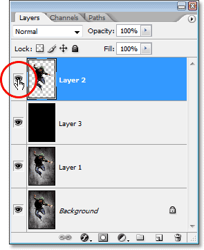
*Click on the Layer Visibility (eyeball) icon to temporarily show or hide a layer.*

What a lot of people don't know is that you can temporarily turn off every other layer in the Layers palette *except* for that one layer by holding down your *Alt* (Win) / *Option* (Mac) key and clicking on the *Layer Visibility* icon. Notice how the eyeball is visible only for "Layer 2" in the screenshot below, telling us that all the other layers are hidden:

*Hold down "Alt" (Win) / "Option" (Mac) and click on the Layer Visibility icon to temporarily hide all the other layers.*

To turn all the layers back on again, hold down *Alt* (Win) / *Option* (Mac) and click again on the same *Layer Visibility* icon.

One little trick many people don't know is that if you hold down *Alt* (Win) / *Option* (Mac) and click on the *Layer Visibility* icon to hide all the layers except for that one layer, you can then cycle through your layers by continuing to hold down your *Alt* (Win) / *Option* (Mac) key and pressing the *left or right bracket keys*. The right bracket key will cycle up through the layers, while the left bracket key will cycle down. As you come to each new layer, Photoshop will make that layer visible and leave all the others hidden. This is a great way to scroll through your document and see exactly what's on each layer.

### Select The Entire Layer

To select an entire layer, not just the contents of the layer, press *Ctrl+A* (Win) / *Command+A* (Mac).

### Select The Contents Of A Layer (Photoshop CS and earlier)

In Photoshop CS and earlier, to select the contents of a layer, hold down *Ctrl* (Win) / *Command* (Mac) and click anywhere on the layer in the Layers palette.

### Select The Contents Of A Layer (Photoshop CS2 and higher)

This is another area where people who are upgrading to Photoshop CS2 or CS3 from an earlier version of Photoshop run into problems. To select the contents of a layer in Photoshop CS2 or higher, hold down *Ctrl* (Win) / *Command* (Mac) and click directly on the layer's *preview thumbnail* in the Layers palette:

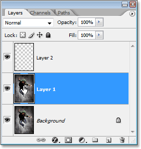
*Select the contents of a layer in Photoshop CS2 or higher by holding down "Ctrl" (Win) / "Command" (Mac) and clicking directly on the layer's preview thumbnail.*

### Create A New Layer Group From Layers (Photoshop CS2 and higher)

In Photoshop CS and earlier, we had Layer Sets. As of Photoshop CS2, we have *Layer Groups*. Same thing, different name. To create a Layer Group from a layer or from several layers, first select the layer(s) you want to include in the Layer Group, then press *Ctrl+G* (Win) / *Command+G* (Mac):

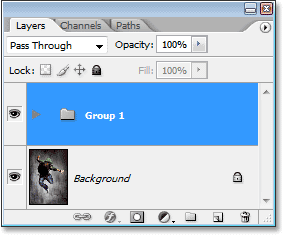
*Select the layer(s) you want to group together, then press "Ctrl+G" (Win) / "Command+G" (Mac).*

To ungroup the layers, select the Layer Group folder in the Layers palette and press *Shift+Ctrl+G* (Win) / *Shift+Command+G* (Mac).

### Merging Layers

To merge a layer with the layer directly below it in the Layers palette, press *Ctrl+E* (Win) / *Command+E* (Mac).

To merge multiple layers, first select the layers you want to merge (in Photoshop CS and earlier you'll need to link them), then press *Ctrl+E* (Win) / *Command+E* (Mac).

In Photoshop CS2 and higher, you can merge two or more layers onto a new layer while keeping the original layers. First select the layers you want to merge, then press *Ctrl+Alt+E* (Win) / *Command+Option+E* (Mac).

To merge all layers, press *Shift+Ctrl+E* (Win) / *Shift+Command+E* (Mac). This will flatten the image onto a single layer.

To merge all layers onto a separate layer and keep the originals (this works in all recent versions of Photoshop), first create a new blank layer above all the other layers in the Layers palette, then press *Shift+Ctrl+Alt+E* (Win) / *Shift+Command+Option+E* (Mac).

### Create A Clipping Mask (Photoshop CS and earlier)

To create a clipping mask in Photoshop CS and earlier, press *Ctrl+G* (Win) / *Command+G* (Mac).

To release the clipping mask, press *Shift+Ctrl+G* (Win) / *Shift+Command+G* (Mac).

### Create A Clipping Mask (Photoshop CS2 and higher)

To create a clipping mask in Photoshop CS2 and higher, press *Ctrl+Alt+G* (Win) / *Command+Option+G* (Mac).

The same shortcut also releases the clipping mask.

### Cycle Through Layer Blend Modes

When trying to decide on a layer blend mode, most people choose one from the *Blend Mode* drop-down list in the top left corner of the Layers palette, see what effect it has on their image, then they choose a different one from the list, see what effect it has, then they choose another, and so on, and so on. There's a much better way.

To cycle through all the different layer blend modes, just hold down your *Shift* key and use the *+* (plus) and *-* (minus) keys. The plus key scrolls down through the list, and the minus key scrolls up:

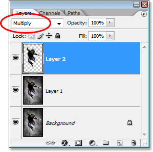
*Hold down "Shift" and use the "+" and "-" keys on your keyboard to cycle through all the layer blend modes.*

### Changing The Opacity Of A Layer

To quickly change the opacity of a layer, first make sure you have the *Move Tool* selected by pressing the letter *V* on your keyboard to select it, then simply type a number. Type "5" for 50% opacity, "8" for 80% opacity, "3" for 30% opacity, and so on. If you need a more specific opacity value, like 25%, just type "25" quickly. For 100% opacity, simply type "0". Whatever opacity value you enter appears in the *Opacity* option in the top right corner of the Layers palette (across from the Blend Mode option):

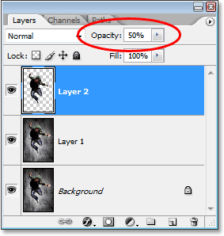
*Select the layer in the Layers palette, then simply type a number to change the layer's opacity value.*

And there we have it! Check out our [Photoshop Basics](/basics/) section for more Photoshop tutorials!