# How to rotate Photoshop’s canvas with the Rotate View Tool

> Source: [https://www.photoshopessentials.com/basics/photoshop-rotate-view-tool/](https://www.photoshopessentials.com/basics/photoshop-rotate-view-tool/)
> Downloaded and converted to Markdown.

Photoshop's Rotate View Tool makes editing, drawing and painting in Photoshop easier than ever. Learn how to rotate your view as you work, and how to take advantage of "spring-loaded" tools in Photoshop for the best results! For Photoshop CC and CS6.

If you've ever drawn with a pencil, or even colored with a crayon, you know that sometimes, turning the paper to rotate your view makes it easier to work. The same is true with our images. Rotating the view of an image can make it easier to edit or retouch certain areas. Photoshop lets us rotate our view using the **Rotate View Tool**. We'll learn how to use the Rotate View Tool in this tutorial.

Notice that the name of the tool is Rotate *View*, not Rotate *Image*. Much like rotating the paper doesn't really rotate the drawing (it just rotates the paper *underneath* the drawing), Photoshop's Rotate View Tool doesn't actually rotate our image. Instead, it rotates the *canvas* that the image is sitting on. In other words, it rotates our *view* of the image, but not the image itself.

This is important to understand, because [rotating an image](/photo-editing/how-to-rotate-and-straighten-images-in-photoshop-cc/ "Learn how to rotate and straighten an image") in Photoshop is a *destructive* edit. Each time we rotate an image, Photoshop needs to redraw the pixels. And each time it redraws the pixels, the image loses detail. Since the Rotate View Tool rotates the canvas, not the image itself, the image is never harmed. We're free to change the angle as many times as we need without any loss in quality. And, we can easily return the image to its original angle when we're done. Let's see how it works! I'll be using [Photoshop CC](https://prf.hn/l/dlXjD2w "Learn more about Adobe Creative Cloud") but this tutorial is fully compatible with Photoshop CS6.

This is lesson 6 of 7 in [Chapter 4 - Navigating Images in Photoshop](/basics/photoshop-image-navigation/ "View Chapter").

Let's get started!

To follow along, you can [open any image](/basics/open-images-photoshop-cc/ "How to open images in Photoshop") in Photoshop. Here's the photo I'll be using. I've actually opened two images, but we'll save the second one for later ([portrait photo](https://prf.hn/l/Y3kO9dy "View this image on Adobe Stock") from Adobe Stock):

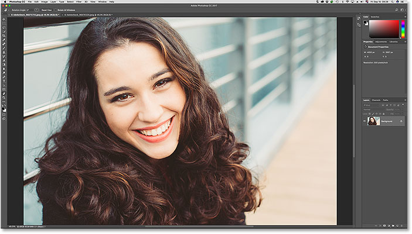
*An image open in Photoshop. Photo credit: Adobe Stock.*

### Selecting The Rotate View Tool

Photoshop's Rotate View Tool is located in the same spot as the **Hand Tool** in the [Toolbar](/basics/photoshop-tools-toolbar-overview/ "Learn more about the Toolbar"). By default, the Hand Tool is the tool that's visible, and the Rotate View Tool is hiding behind it. To select the Rotate View Tool, click and hold on the Hand Tool's icon until a fly-out menu appears. Then, choose the **Rotate View Tool** from the menu. Notice that the Rotate View Tool has a keyboard shortcut of **R**. This will become important in a few moments:

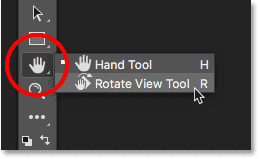
*By default, the Rotate View Tool is nested behind the Hand Tool.*

### How To Rotate Your View

With the Rotate View Tool selected, the easiest way to rotate your view of the image is to simply click and drag inside the document window. Click on the image with the Rotate View Tool and keep your mouse button held down. A **compass** appears in the center. The **red direction marker** at the top of the compass always points to the actual top of the image, so that even when you've rotated the angle, you'll always know which way is up:

*Click and hold with the Rotate View Tool to display the compass.*

To rotate the view, keep your mouse button held down and drag the image. You can drag clockwise or counterclockwise as needed. Notice that the compass continues to point to the actual top of the image as you rotate the view. By default, Photoshop lets you rotate the angle freely. But if you press and hold your **Shift** key as you drag, you'll rotate the view in steps of 15 degrees:

*Keep your mouse button held down and drag the image to rotate the view.*

### Entering A Specific Rotation Angle

If you know the exact angle you need, you can enter it directly into the **Rotation Angle** box in the Options Bar. Click inside the box to highlight the current angle, and then type in your new value. Don't worry about the degrees symbol ( ° ) because Photoshop will include it automatically. Press **Enter** (Win) / **Return** (Mac) on your keyboard when you're done to accept it. Or, press **Shift+Enter** (Win) / **Shift+Return** (Mac) to keep the new value highlighted. This lets you quickly type in different angles without needing to click inside the box each time:

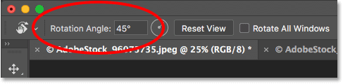
*Use the Rotation Angle option to rotate the view at specific angles.*

### Changing The Rotation Angle With The Scrubby Slider

Another way to rotate your view of the image is by using Photoshop's **Scrubby Slider**. Hover your mouse cursor directly over the words "Rotation Angle" in the Options Bar. Your cursor will change into a hand icon with direction arrows pointing left and right. This is the Scrubby Slider cursor. Click and drag to the right to increase the rotation angle, or drag to the left to decrease it. By default, you'll increase or decrease the angle in 1 degree increments. Press and hold your **Shift** key as you drag with the Scrubby Slider to change the angle in steps of 10 degrees:

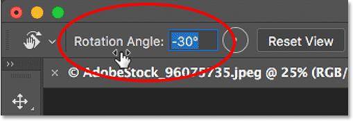
*Click and drag over the words "Rotation Angle" to use the Scrubby Slider.*

### Resetting The View

To reset your view and restore the image to its upright position, click the **Reset View** button in the Options Bar. Or, press the **Esc** key on your keyboard. You can also reset the view by double-clicking on the Rotate View Tool in the Toolbar:

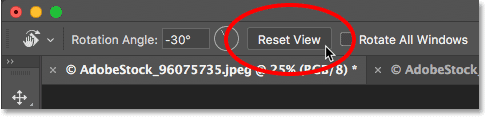
*Click the "Reset View" button in the Options Bar to reset the angle.*

### Using The "Spring-Loaded" Rotate View Tool

Photoshop has a great feature known as **spring-loaded tools**. If you know the keyboard shortcut for a specific [tool](/basics/photoshop-tools-toolbar-overview/ "Learn more about Photoshop tools"), pressing and holding that key on your keyboard will temporarily switch you to that tool for as long as the key is held down. When you release the key, you'll switch back to the previously-active tool. Using the "spring-loaded" version of the Rotate View Tool is the fastest way to work.

Earlier, when we learned how to select the Rotate View Tool from the Toolbar, we saw that the tool has a keyboard shortcut of **R**. When any other tool is active, press and hold the "R" key on your keyboard to temporarily switch to the Rotate View Tool. Click and drag the image to rotate your view, and then release the "R" key to return to the previous tool. In "spring-loaded" mode, you won't have access to any of the Rotate View Tool's options in the Options Bar. So to reset your view when you're done, press the **Esc** key on your keyboard:

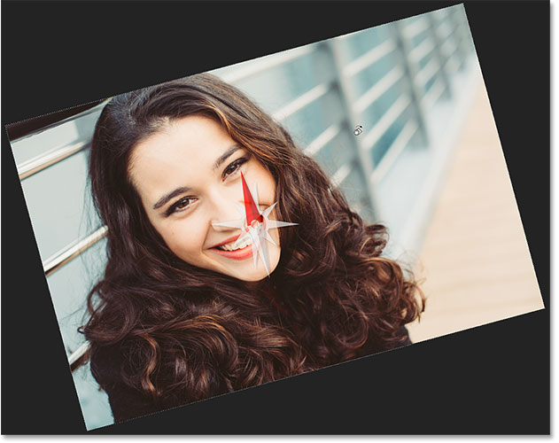
*Press and hold "R" at any time to access the "spring-loaded" version of the Rotate View Tool.*

### Rotating The View For All Open Images At Once

So far, we've learned how to rotate the view for a single image. But Photoshop makes it just as easy to rotate the view for multiple images at the same time. Here's a second image from the same series that I've opened. Photoshop opens each image in its own separate document. I switched to this second image by clicking on its [tab](/basics/tabbed-and-floating-documents-in-photoshop/) above the document window ([portrait photo](https://prf.hn/l/DRqoyob "View this image on Adobe Stock") from Adobe Stock):

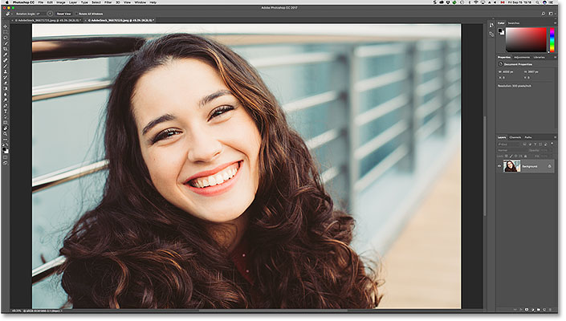
*A second image open in Photoshop. Photo credit: Adobe Stock.*

[Related: Working With Tabbed And Floating Documents In Photoshop](http://www.photoshopessentials.com/basics/tabbed-and-floating-documents-in-photoshop/ "View tutorial")

#### Viewing Multiple Images On The Screen

By default, we can only view one document at a time. But it's easy to view two or more documents at once using Photoshop's [multi-document layouts](/basics/view-multiple-images-photoshop/ "Learn more"). You'll find them by going up to the **Window** menu in the Menu Bar and choosing **Arrange**. From there, choose a layout based on the number of images you've opened. I've opened two photos, so I'll select the **2-up Vertical** layout:

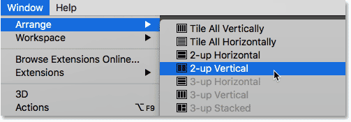
*Going to Window > Arrange > 2-up Vertical.*

With the "2-up Vertical" layout selected, my images now appear side-by-side on the screen. To switch back to Photoshop’s default layout when you’re done, go back up to the **Window** menu, choose **Arrange**, and then choose **Consolidate All to Tabs**:

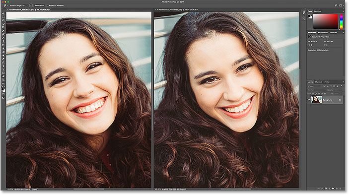
*A second image open in Photoshop. Photo credit: Adobe Stock.*

### The "Rotate All Windows" Option

To rotate all open images at once, make sure you've selected the Rotate View Tool from the Toolbar, since the "spring-loaded" method won't give you access to the tool's options. Then, select the **Rotate All Windows** option in the Options Bar:

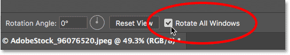
*Use the "Rotate All Windows" option to rotate the view for all open images.*

Click and hold on any image and then drag to rotate its view. At first, it will look like the view for only that one image is being rotated. Here, I'm rotating the image on the left. The image on the right hasn't yet moved:

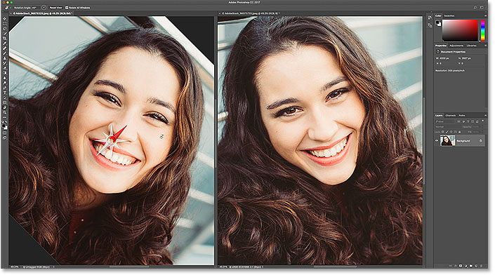
*Click and drag inside one of the documents to rotate its view.*

As soon as you release your mouse button, the view for the other image(s) will instantly rotate to the same angle:

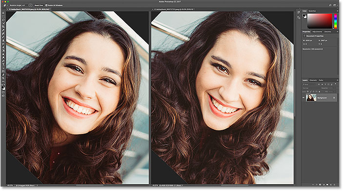
*The other documents rotate to the same angle when you release your mouse button.*

### Resetting The View For All Open Images

To reset the view for all open images, make sure you still have the **Rotate All Windows** option selected in the Options Bar. Then, click the **Reset View** button:

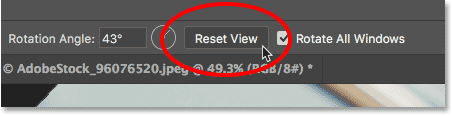
*Resetting the view for both images at once.*

### The "Match Rotation" Option

Finally, if you're viewing multiple open images at different angles, you can instantly match them all to the *same* angle. First, select the document with the rotation angle you want the others to match. Then, go up to the **Window** menu, choose **Arrange**, and then choose **Match Rotation**. All documents will jump to the same viewing angle as the document you selected:

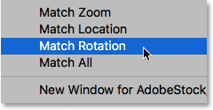
*Use "Match Rotation" to easily match the viewing angle for all open images.*