# Photoshop Screen Modes And Interface Tricks

> Source: [https://www.photoshopessentials.com/basics/photoshop-screen-modes-interface-tricks/](https://www.photoshopessentials.com/basics/photoshop-screen-modes-interface-tricks/)
> Downloaded and converted to Markdown.

Learn all about Screen Modes in Photoshop and how to use them to maximize your work area by hiding the interface! Includes all three Screen Modes (Standard, Full Screen With Menu Bar and Full Screen) and how to switch between them, plus some handy keyboard tricks!

When it comes to working in Photoshop, there has always been one frustrating issue. With so many panels, tools, menus and options available, Photoshop's interface can crowd and clutter up the screen. And the more room the interface takes up, the less room we have for viewing our images. As camera technology improves, our photos get bigger and bigger. This makes finding ways to minimize the interface and maximize our work area extremely important. Of course, some lucky Photoshop users get to work with dual monitors. Dual monitors let you move your panels to one screen while you view and edit your image on the other. The rest of us, however, need to find a more practical (and less expensive) solution.

Thankfully, there's an easy way to overcome this problem, and that's by taking advantage of Photoshop's **Screen Modes**. A *Screen Mode* controls how much of Photoshop's interface is displayed on your screen, and there are three Screen Modes to choose from. The **Standard Screen Mode** displays the entire interface. It's the mode Photoshop uses by default, and the one that takes up the most room. But there's also a **Full Screen Mode With Menu Bar** option that hides *some*, but not all, of the interface elements. And, there's a **Full Screen Mode** in Photoshop which *completely* hides the interface, giving your image full access to the entire screen. 

In this tutorial, we'll look at each of Photoshop's three Screen Modes and learn how to switch between them. We'll also learn some handy keyboard tricks for getting the most out of this great feature. I've updated this tutorial for [Photoshop CC](https://prf.hn/l/dlXjD2w) but everything is fully compatible with Photoshop CS6. This is lesson 10 of 10 in our [Complete Guide to Learning the Photoshop Interface](/basics/learning-the-photoshop-interface/) series. Let's get started!

## Where To Find The Screen Modes

There are two places to find the Screen Modes in Photoshop. One is in the **Menu Bar** along the top of the screen. Go up to the **View** menu in the Menu Bar and choose **Screen Mode**. From here, you can switch between **Standard Screen Mode**, **Full Screen Mode With Menu Bar**, and **Full Screen Mode**. The checkmark next to the Standard Screen Mode means that it's currently active. We'll be looking at each of these Screen Modes as we go along, so leave the Standard mode selected for now:

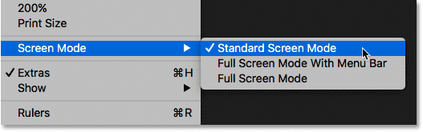
*Viewing the Screen Modes from the View menu.*

Another place to find the Screen Modes is in the [Toolbar](/basics/photoshop-tools-toolbar-overview/) along the left of the screen. The **Screen Mode** icon is the last icon at the very bottom. Click and hold on the icon to view a fly-out menu, and then choose a Screen Mode from the list. The little square next to the Standard Screen Mode means it's currently active. Again, leave the Standard mode selected for now:

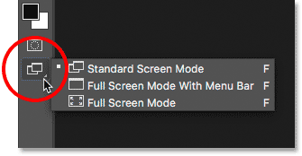
*Viewing the Screen Modes at the bottom of the Toolbar.*

## The Standard Screen Mode

Let's start by looking at the Standard Screen Mode. Here's an image I currently have open in Photoshop ([woman with mask photo](https://prf.hn/l/NJ5g4mA) from Adobe Stock):

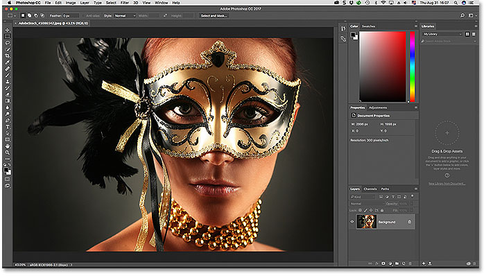
*The Standard screen mode in Photoshop.*

By default, Photoshop uses the Standard Screen Mode, which is the mode we're looking at here. Standard Screen Mode displays the entire [Photoshop interface](/basics/interface-cs6//basics/getting-know-photoshop-interface/), including the [Toolbar](/basics/photoshop-tools-toolbar-overview/) on the left and the [panels](/basics/managing-panels-in-photoshop-cs6//basics/managing-panels-photoshop-cc/) on the right. It also includes the **Menu Bar** and the **Options Bar** along the top. The **tab** above the [document window](/basics/tabbed-and-floating-documents-in-photoshop/), **scroll bars** along the right and bottom, and the **Status Bar** in the bottom left of the document window, are all displayed as well. The Standard Screen Mode gives us quick access to everything we'd need, but it also takes up the most screen real estate.

### Screen Modes vs View Modes

It may not look like the interface is getting in the way of my image, but that's because I'm viewing the image using the **Fit on Screen** View Mode. Unlike Screen Modes which show or hide different parts of the interface, *View Modes* in Photoshop control the [zoom level](/basics/image-navigation-essentials-zooming-panning-photoshop/) of the document. You can view your image in the same View Mode that I'm using by going up to the **View** menu in the Menu Bar and choosing **Fit on Screen**:

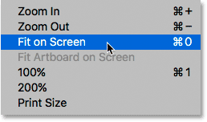
*Selecting "Fit on Screen" from the View menu.*

In the Fit on Screen mode, Photoshop sets the zoom level to whatever it needs for the image to fit entirely within the viewable area of the document window. Let's see what happens if we choose a different View Mode. I'll go back up to the **View** menu in the Menu Bar, and this time, I'll choose **100%**:

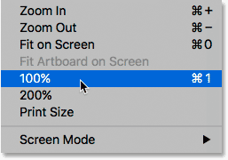
*Switching to the 100% View Mode.*

The 100% View Mode instantly jumps the zoom level to 100%, meaning that each pixel in the photo now takes up exactly one pixel on your screen. This allows us to see the image in full detail. But it also means that the photo is now much too large to fit entirely within the document's viewable area. And this is where the interface starts getting in the way. The panels along the right are the biggest problem, blocking much of the image from view. The issue is even worse on smaller screens running at lower [screen resolutions](/essentials/the-72-ppi-web-resolution-myth/):

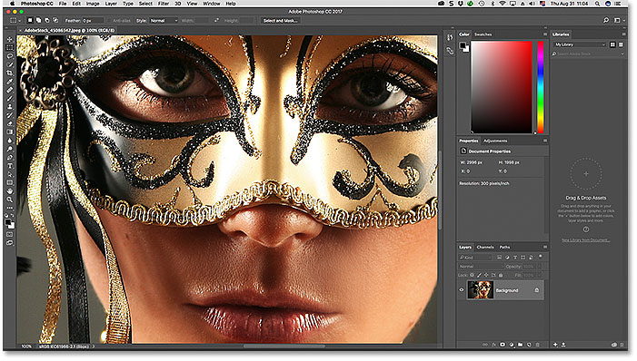
*The interface clutter becomes more of a problem as we zoom in closer to the image.*

## Full Screen Mode With Menu Bar

If you want to give yourself a bit more room to work, you can switch to the second of Photoshop's three screen modes, known as Full Screen Mode With Menu Bar. To select it, go up to the **View** menu, choose **Screen Mode**, and then choose **Full Screen Mode With Menu Bar**. Or, a faster way is to click and hold on the **Screen Mode** icon at the bottom of the Toolbar and then choose **Full Screen Mode With Menu Bar** from the list:

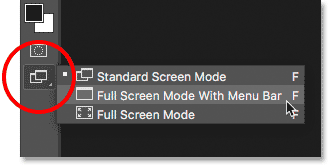
*Selecting "Full Screen Mode With Menu Bar" from the Toolbar.*

Full Screen Mode With Menu Bar hides any interface elements that were part of the document window itself. This includes the **tab** at the top, the **scroll bars** along the right and bottom of the image, and the **Status Bar** in the lower left of the document window. It also hides the buttons for minimizing, maximizing and closing Photoshop which are normally found in the upper left of the interface. Also, if you had two or more images open in separate [tabbed documents](/basics/tabbed-and-floating-documents-in-photoshop/), only the active document remains visible. All of Photoshop's other interface elements (the Toolbar, panels, Menu Bar and Options Bar) remain on the screen:

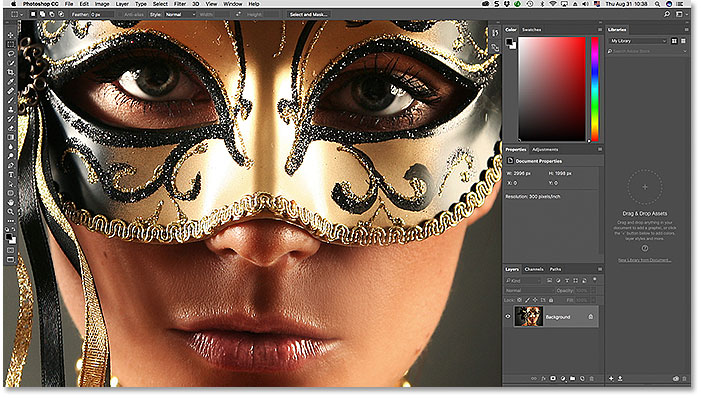
*Full Screen Mode With Menu Bar hides any interface elements related to the document window itself.*

## Full Screen Mode

To fully maximize your work area, switch to the third of Photoshop's three screen modes, known simply as Full Screen Mode. You can select it by going up to the **View** menu at the top of the screen, choosing **Screen Mode**, and then choosing **Full Screen Mode**. Or, click and hold on the **Screen Mode** icon at the bottom of the Toolbar and choose **Full Screen Mode** from the fly-out-menu:

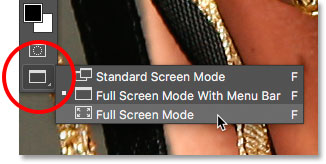
*Choosing "Full Screen Mode" from the Toolbar.*

If this is the first time you've selected Full Screen Mode, Photoshop will pop open a dialog box explaining the basics of how Full Screen Mode works. I'll explain it in more detail in a moment. If you don't want to see this message every time you switch to Full Screen Mode, click the **Don't show again** checkbox. Then, click the **Full Screen** button:

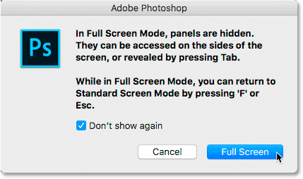
*Photoshop explains how Full Screen Mode works before you switch to it.*

In Full Screen Mode, Photoshop completely hides the interface. This leaves just the image itself visible, turning your entire screen into your work area:

*It may not look like it, but this image is still open in Photoshop. Full Screen Mode hides the interface.*

### Accessing The Interface From The Sides

You may be thinking, "Gee, that's really great, but how am I supposed to work with the interface completely hidden?" Well, you could always rely on Photoshop's keyboard shortcuts if you happen to have them all memorized. But you actually don't need to be a Photoshop expert or a power user to work in Full Screen Mode. There's an easy way to bring back the interface when you need it. 

#### Showing The Toolbar In Full Screen Mode

To temporarily show the **Toolbar** so you can switch tools while in Full Screen Mode, simply hover your mouse cursor anywhere along the **left edge** of the screen. Once you've selected a tool, drag your mouse cursor away from the edge and the Toolbar will disappear:

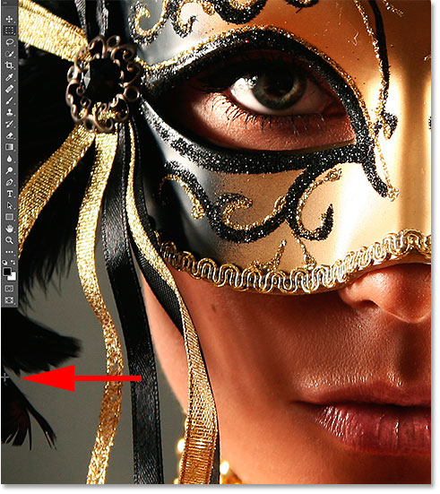
*In Full Screen Mode, move your mouse cursor to the left edge to show the Toolbar.*

#### Showing The Panels In Full Screen Mode

To temporarily show the **panels** while in Full Screen Mode, hover your mouse cursor anywhere along the **right edge** of the screen. When you're done with the panels, drag your cursor away from the edge to hide them once again:

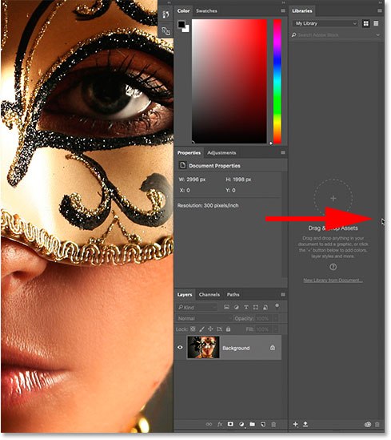
*In Full Screen Mode, move your mouse cursor to the right edge to show the panels.*

### How To Exit Out Of Full Screen Mode

Since Photoshop's interface is completely hidden while you're in Full Screen Mode, you may be wondering how to get out of it and bring back the interface. To exit Full Screen Mode, simply press the **Esc** key on your keyboard. This will return you to the Standard Screen Mode.

## Showing And Hiding The Interface From The Keyboard

You can also temporarily show and hide the interface directly from your keyboard. These keyboard shortcuts work in all Screen Modes, not just Full Screen Mode, and they're a great way to give yourself extra room when you need it. In any of the three Screen Modes, press the **Tab** key on your keyboard to show or hide the Toolbar on the left, the Options Bar along the top and the panels on the right. Here, I'm still in Full Screen Mode, but try it out in both Standard and Full Screen Mode With Menu Bar to see how it works:

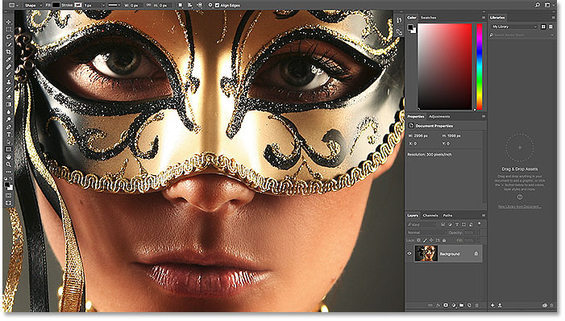
*Press the Tab key to show the Toolbar, the panels and the Options Bar.*

To show and hide just the panels on the right, press **Shift+Tab** on your keyboard. Again, I'm still in Full Screen Mode here, but this works in all three of Photoshop's Screen Modes:

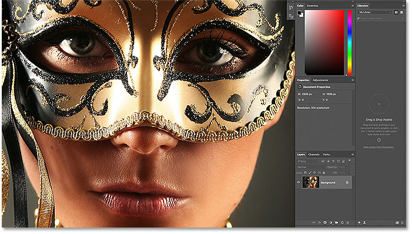
*Showing just the right-side panels in Full Screen Mode by pressing Shift+Tab.*

## The Fastest Way To Switch Screen Modes

We've seen how to switch between Photoshop's Screen Modes from the View menu in the Menu Bar and from the Screen Mode icon in the Toolbar. But the fastest way to switch between Screen Modes is by cycling through them from the keyboard. Press the letter **F** on your keyboard to cycle from Standard Screen Mode to Full Screen Mode With Menu Bar. Press **F** again to switch to Full Screen Mode. Pressing **F** one more time will take you from Full Screen Mode back to the Standard Screen Mode. To cycle backwards through the screen modes, press **Shift+F**.

Finally, I mentioned earlier that you can exit out of Full Screen Mode by pressing the **Esc** key on your keyboard, This returns you to Standard Screen Mode. Pressing **F** while in Full Screen Mode does the same thing.