# Drawing Selections with the Marquee Selection Tools in Photoshop

> Source: [https://www.photoshopessentials.com/basics/photoshop-selection-basics-the-rectangular-and-elliptical-marquee-tools/](https://www.photoshopessentials.com/basics/photoshop-selection-basics-the-rectangular-and-elliptical-marquee-tools/)
> Downloaded and converted to Markdown.

New to Photoshop selection tools? Start here! Learn how to draw selections using the Rectangular Marquee Tool and the Elliptical Marquee Tool, and how to combine basic selections into more complex shapes! Includes examples of how to use these selection tools with your images!

In this tutorial, I show you how to make selections in Photoshop using the two most basic and yet most useful selection tools, the **Rectangular Marquee Tool** and the **Elliptical Marquee Tool**. If you're new to Photoshop, these are the two selection tools you want to learn first.

Together they're known as Photoshop's **geometric selection tools** because they draw selection outlines in rectangular or elliptical shapes. And while they may seem basic, they're both incredibly useful, and you'll come back to them again and again.

Along with showing you how to draw simple selections with these tools, I’ll also show you how to create more complex selections by combining two or more selection outlines together. And we’ll look at a few examples of how you might use each tool in your Photoshop work.

Let's get started!

## Which version of Photoshop do I need?

I'm using Photoshop 2022 but any recent version will work. [Get the latest Photoshop version here](https://adobe.prf.hn/click/camref:1100lrdjJ/destination:https%3A%2F%2Fwww.adobe.com%2Fproducts%2Fphotoshop.html).

## Where to find the Rectangular and Elliptical Marquee Tools

The Rectangular Marquee Tool and the Elliptical Marquee Tool are found in the same spot in the [toolbar](/basics/photoshop-tools-toolbar-overview/), directly below the Move Tool. By default, the **Rectangular Marquee Tool** is visible.

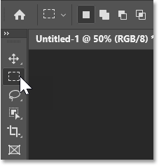

*The Rectangular Marquee Tool icon in the toolbar.*

But if you click and hold on its icon, you'll find the **Elliptical Marquee Tool**. There is also a **Single Row Marquee Tool** and **Single Column Marquee Tool**, but they select only a single row or a single column of pixels. Since they're not very useful, I won't be covering them here.

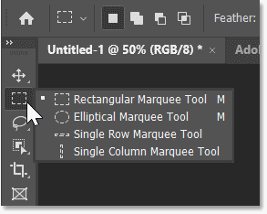

*Photoshop's Marquee selection tools.*

### The Rectangular and Elliptical Marquee Tool keyboard shortcuts

Notice that both the Rectangular and the Elliptical Marquee Tool share the letter **M** as their **keyboard shortcut**. So if you have a different tool active, like the Move Tool, pressing M will select whichever marquee tool is visible in the toolbar.

To switch to the other tool, hold the **Shift** key on your keyboard and press **M**. And then to switch back to the previous marquee tool, press Shift+M again.

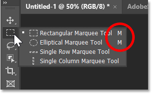

*The Rectangular and Elliptical Marquee Tool keyboard shortcut.*

## How to draw selections with the Rectangular Marquee Tool

The Rectangular and Elliptical Marquee Tools are very similar. In fact, the only difference is that one draws rectangular selection outlines and the other draws elliptical selection outlines. Other than that, they behave exactly the same.

So I'll start by showing you the basics of how a tool works. And for that, I'll keep things simple and use a plain white background to make the selection outlines easier to see. Then once we've covered the basics, I'll switch over to an image.

### Selecting the Rectangular Marquee Tool from the toolbar

We’ll start with the Rectangular Marquee Tool. But you can also jump to the [Elliptical Marquee Tool](#elliptical).

I'll select the Rectangular Marquee Tool from the toolbar.

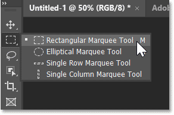

*Selecting the Rectangular Marquee Tool.*

### How to draw a rectangular selection outline

The Rectangular Marquee Tool is used for drawing rectangular or square selection outlines. If you click and drag with the tool, you'll draw a freeform rectangular selection. The outline is indicated by what's commonly called the <q>marching ants</q>. Anything inside the outline is selected, and anything outside is not.

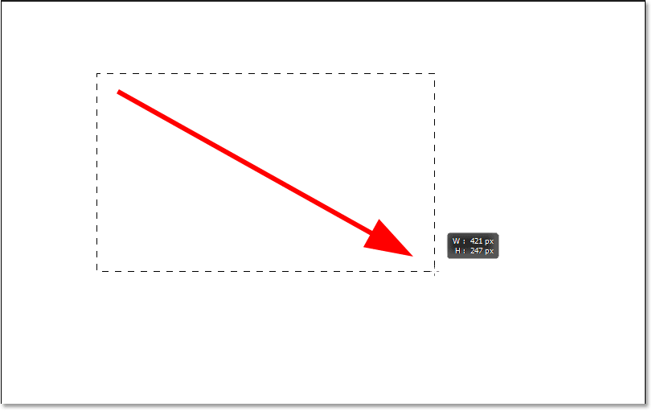

*Click and drag to draw a freeform rectangular selection outline.*

If you click and drag *outside* of an existing selection outline, you'll clear the selection and draw a new one.

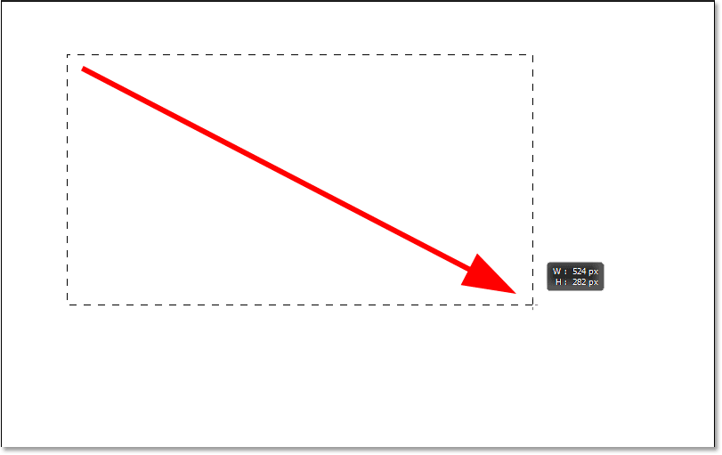

*Click and drag outside an existing selection to draw a new selection outline.*

And if you click and drag *inside* a selection, you'll move the outline around. You won't move the actual pixels inside the selection. just  the outline itself. That's because we're dragging with a selection tool. 

If we were to drag with the Move Tool inside the selection, we would move the actual pixels. I won't do that here, but we'll come back to that when we switch over to an image.

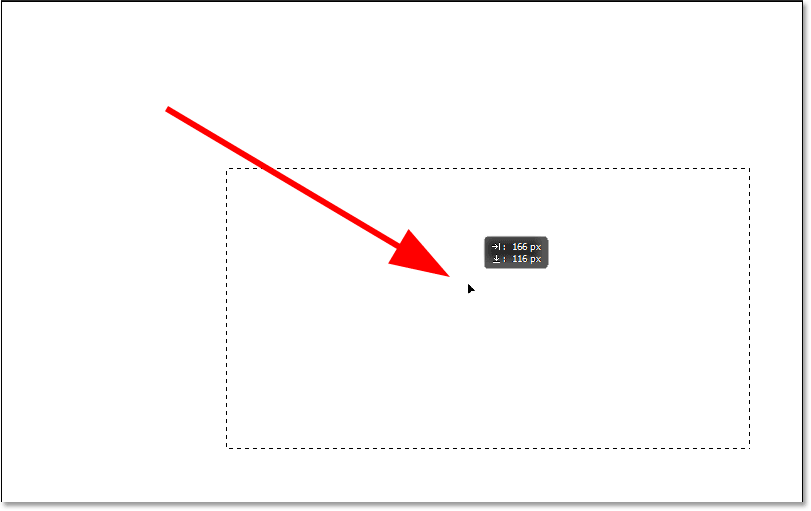

*Click and drag inside a selection outline to reposition it.*

### How to reposition the outline as you draw the selection

If you start drawing a selection and then hold the **spacebar** on your keyboard, you can drag to reposition the outline. Then release the spacebar to continue drawing.

### How to remove a selection outline

To remove a selection outline when you’re done with it, go up to the **Select** menu in the Menu Bar and choose **Deselect**. Or press the keyboard shortcut **Ctrl+D** on a Windows PC or **Command+D** on a Mac. Or just click anywhere in the document with your selection tool to deselect it.

If you cleared the selection by mistake, you can bring it back by going up to the **Edit** menu and choosing **Undo Deselect** or by pressing **Ctrl+Z** on a PC or **Command+Z** on a Mac.

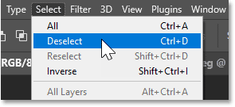

*The Deselect command under the Select menu.*

### Drawing a rectangular selection outward from its center

Notice that every time we drag, we draw the selection outline from its corner. But you can also draw it outward from its center. After you start dragging, hold the **Alt** key on a PC or the **Option** key on a Mac and then continue dragging. When you're done, release your mouse button and then release the Alt or Option key.

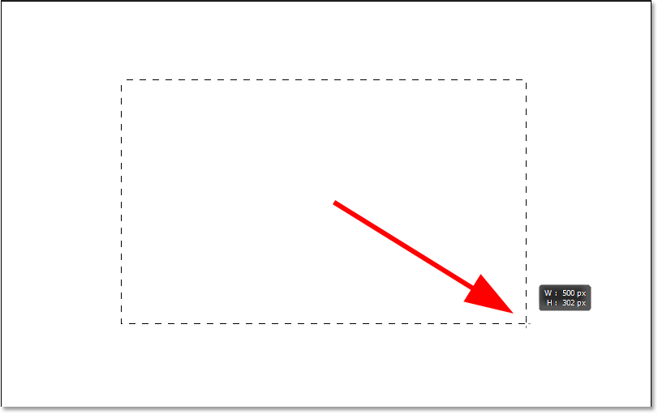

*Begin dragging, then hold Alt (Win) / Option (Mac) to draw the selection from its center.*

### How to draw a selection outline as a perfect square

To draw a selection as a perfect square, begin dragging with the Rectangular Marquee Tool. Then hold the **Shift** key on your keyboard and continue dragging. When you're done, release your mouse button and then release the Shift key. 

Always remember to release your mouse button first and *then* whichever key you were holding down. If you release the key first, you'll lose the effect that the key was having. In this case, the square would revert back to a rectangle. So I’ll keep the Shift key down, then I'll release my mouse button, and then the Shift key.

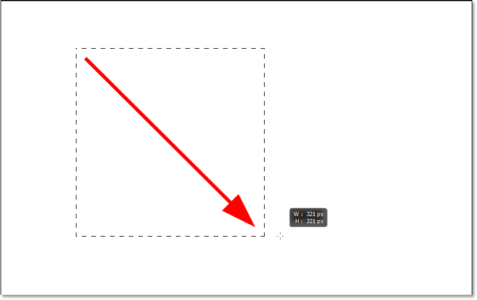

*Begin dragging, then hold Shift to draw the selection as a perfect square.*

### Drawing a rectangular selection at a fixed size or ratio

By default, the Rectangular Marquee Tool draws selections freely at any size or aspect ratio. That's because in the Options Bar, the **Style** option is set to **Normal**. But we can also draw a selection at a fixed ratio or a fixed size.

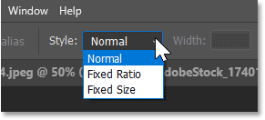

*The Style option in the Options Bar, set to Normal by default.*

#### Fixed Ratio

If you set the style to **Fixed Ratio**,  enter the ratio you need into the **Width** and **Height** fields. A ratio of 1 to 1 will draw a perfect square. If I set the Width to 4 and the Height to 6, I'll draw a selection at a 4 x 6 ratio. 

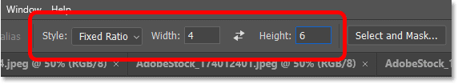

*Setting the Style to Fixed Ratio and entering a ratio into the Width and Height fields.*

You can flip the orientation of the aspect ratio by clicking the **swap icon** between the Width and Height fields.

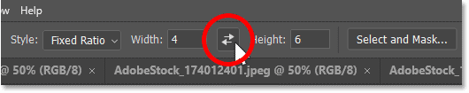

*Click the swap icon to switch between landscape or portrait orientation.*

But you'll need to draw another selection outline for the change to take effect.

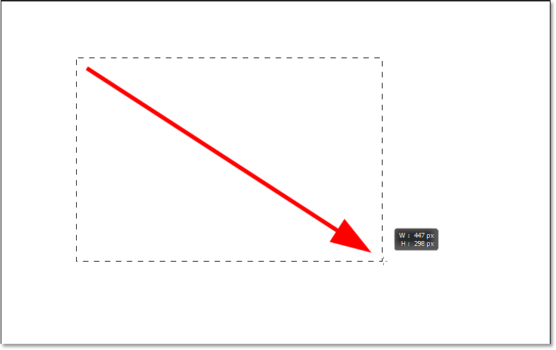

*Drawing a rectangular selection outline at a fixed ratio.*

### Fixed Size

If you set the style to **Fixed Size**, enter a value in pixels, inches or whichever measurement type you need into the **Width** and **Height** fields. I'll set the Width to 400 px. Then I'll press the **Tab** key on my keyboard to jump over to the Height, and I'll enter 300 px.

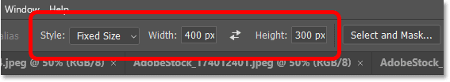

*Setting the Style to Fixed Size and entering the size into the Width and Height fields.*

With your width and height entered, all you need to do is click in the document and release your mouse button to instantly draw a selection outline at that exact size. If you click and drag, you can reposition the outline. Then release your mouse button to accept it.

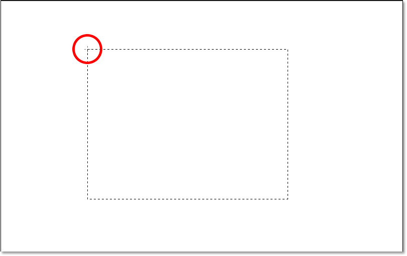

*Click and release to draw the selection at a fixed size.*

When you're done, remember to switch the **Style** option back to **Normal** or you'll be stuck at that size or aspect ratio the next time you draw a selection.

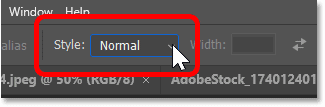

*Resetting the Style back to Normal.*

## How to add, subtract or intersect a rectangular selection

So far, we’ve learned how to draw one selection outline at a time. But we can also combine selection outlines to create more complex selections. 

Along the left of the Options Bar is a row of four icons. From left to right, we have **New selection**, **Add to selection**, **Subtract from selection**, and **Intersect with selection**. The first icon, New selection, is active by default which is why we draw a new selection each time we drag with the tool. But we can also add to the existing selection, or subtract an area from it. And we can even keep the selection only in the area where our new selection and the existing selection overlap.

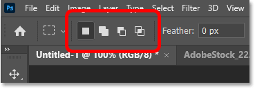

*The New, Add, Subtract and Intersect selection options.*

But the problem with choosing one of these icons in the Options Bar is that they are sticky, meaning that they remain selected until you choose a different one. So a better way to access these options is by using their keyboard shortcuts.

### The Add to selection keyboard shortcut

To add your next selection to the existing selection, press and hold the **Shift** key on your keyboard. You'll see a **plus sign** in the lower right of your cursor. Then drag out a selection outline.

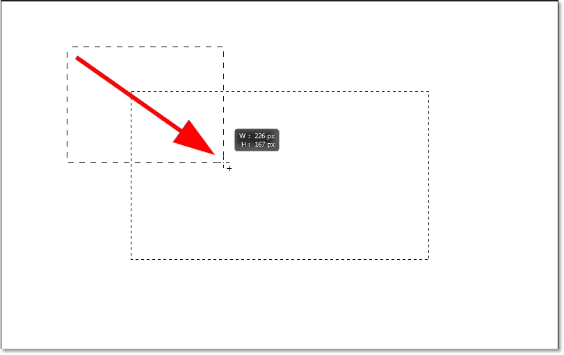

*Hold Shift and drag to add the next selection to the existing selection.*

The new one is added to the previous selection.

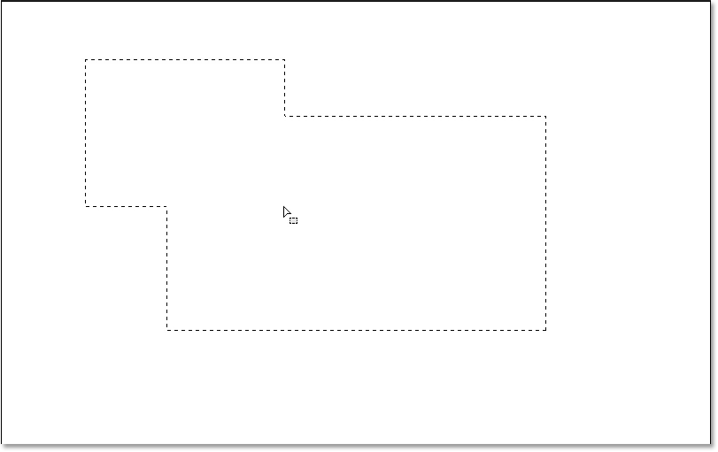

*The two selection outlines have been combined into one.*

The selection outlines don't need to overlap. You can add a completely different area to the selection by holding **Shift** and dragging. This way, you can have two or more parts of your image selected at once.

Then to clear all of the selections at once, press **Ctrl+D** on a Windows PC or **Command+D** on a Mac.

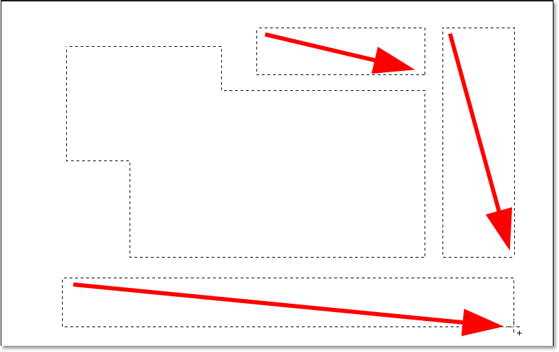

*Hold Shift and dragging to add multiple areas to the selection.*

### The Subtract from Selection keyboard shortcut

To subtract an area from the existing selection, press and hold the **Alt** key on a PC or the **Option** key on a Mac. A **minus sign** appears in the lower right of the cursor. Then drag around the area you want to subtract.

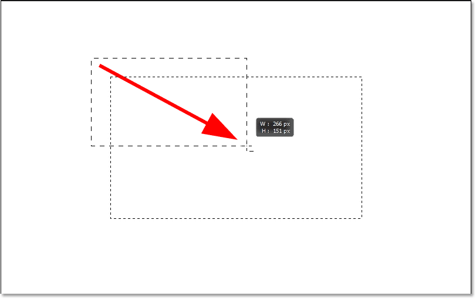

*Hold Alt (Win) / Option (Mac) and drag to subtract from the selection.*

Release your mouse button and the area is subtracted. I'll undo it by pressing **Ctrl+Z** on a PC or **Command+Z** on a Mac.

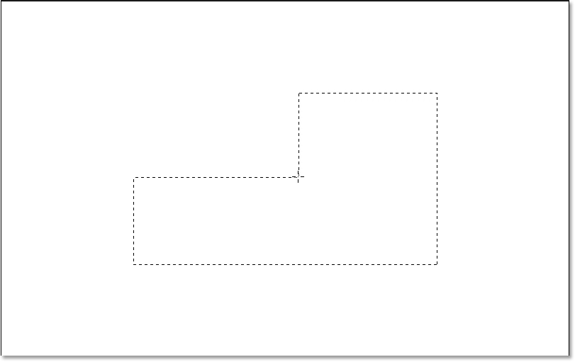

*The selected area was subtracted from the original selection outline.*

### The Intersect with Selection keyboard shortcut

Finally, to keep the selection only in the area where your next selection and the existing selection overlap or intersect, hold **Shift+Alt** on a PC or **Shift+Option** on a Mac. You'll see a small **x** in the lower right of your cursor. Then drag around part of your existing selection.

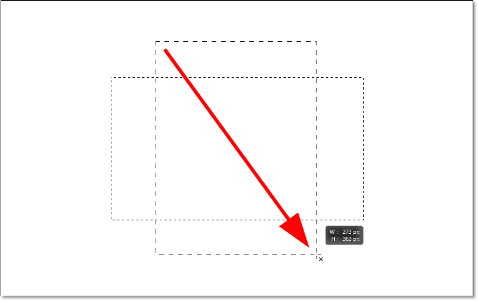

*Hold Shift+Alt (Win) / Shift+Option (Mac) and drag to keep only where the two selections intersect.*

When you release your mouse button, you'll keep only the area where the two selection outlines overlapped.

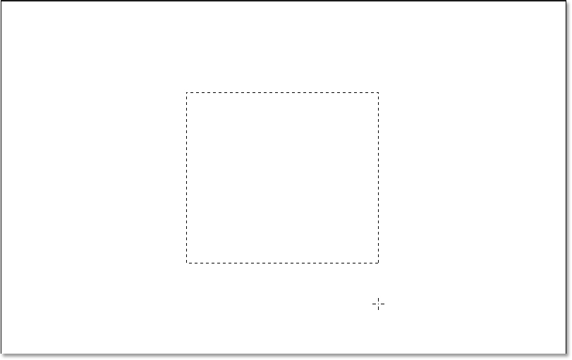

*Only the area where the selection outlines overlapped remains selected.*

### The Feather option

There's one more option in the Options Bar we need to look at, which is **Feather**. Feather adds softness or blurring to your selection edges. So if I was to increase the Feather amount from 0 (the default) to 2 px, I would add a 2 px blur to the edge of the next selection I draw.

But the problem here is that you need to set the Feather amount *before* drawing the selection. Changing it afterwards has no effect. So if you don't know how much blurring you need, this option isn't very useful. Plus you need to reset it back to 0 each time, otherwise you'll keep adding the same amount of blur to all of your selections.

There are ways to add feathering after you draw the selection, and we’ll look at one of them when we switch over to the images, which we’ll do next. So in most cases, you'll want to leave the Feather value in the Options Bar set to 0. 

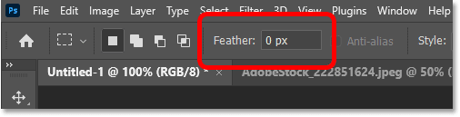

*The Feather option.*

## Three ways to use the Rectangular Marquee Tool

That's the basics of how to draw selections with the Rectangular Marquee Tool in Photoshop. Now let's look at a few common ways to use it, including how to **crop an image around your selection**, how to **copy your selection to a new layer**, and how to **convert your selection outline into a layer mask**.

I’ll also show you how to resize your selection outline after you draw it using Photoshop’s **Transform Selection** command, and how to soften the edges using the **Feather** option in the Properties panel.

## Cropping an image with the Rectangular Marquee Tool

We'll start with cropping the image. I'll switch over to my [first image](https://adobe.prf.hn/click/camref:1100lrdjJ/destination:https%3A%2F%2Fstock.adobe.com%2Fimages%2Fclose-up-portrait-of-young-smiling-handsome-guy-in-blue-t-shirt-isolated-on-gray-background%2F222851624) which I downloaded from Adobe Stock.

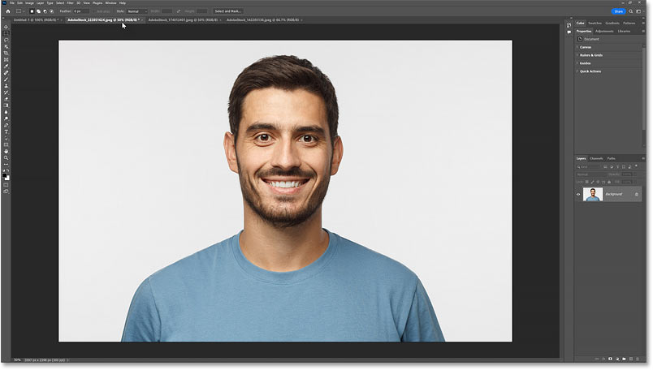

*The first image.*

Since it’s rare to find something in an image that’s a perfect rectangle or square, the Rectangular Marquee Tool is more often used to select a general area. And one way to use it is as a quick and easy Crop Tool.

Of course, Photoshop does include [a dedicated Crop Tool](/basics/how-to-crop-images-photoshop-cc/) with more features. But if you just need something fast, the Rectangular Marquee Tool works great.

### Step 1: Draw a rectangular selection outline

Just drag a selection outline around the area you want to keep. Hold the **spacebar** as you drag if you need to reposition it, and then release the spacebar to continue dragging.

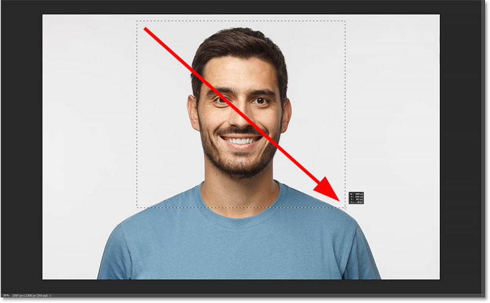

*Drawing a rectangular selection outline to use as a crop border.*

### Step 2: Go to Image > Crop

Go up to the **Image** menu and choose **Crop**.

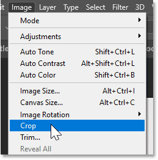

*Going to Image > Crop.*

Photoshop crops away everything outside your selection. You can then clear the selection by pressing **Ctrl+D** on a PC or **Command+D** on a Mac.

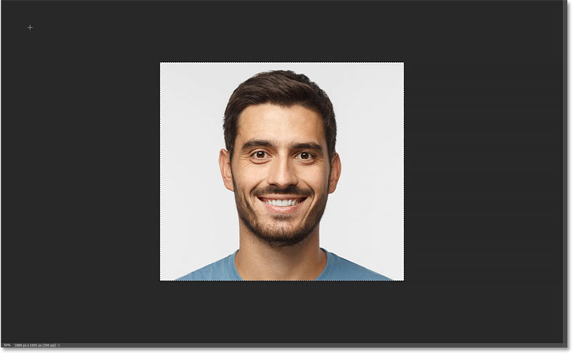

*The areas outside the selection outline are cropped away.*

## Resizing a selection outline with Transform Selection

Here's a great tip. If you drag out a selection outline and it's not exactly right, you don't need to start over and draw a new one. You can resize an existing selection outline using Photoshop's Transform Selection command.

### Step 1: Go to Select > Transform Selection

With a selection outline active, go up to the **Select** menu and choose **Transform Selection**.

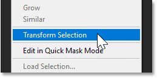

*Going to Select > Transform Selection.*

### Step 2: Drag the handles to resize the outline

The Transform Selection command works like Photoshop's [Free Transform](/basics/transform-and-warp-images-with-free-transform-in-photoshop-cc-2019/) command but with selection outlines instead of pixels.

Just drag any of the handles to resize the outline. By default, the aspect ratio is locked. So when we drag one of the handles, they all move together. To adjust one side at a time, hold the **Shift** key as you drag.

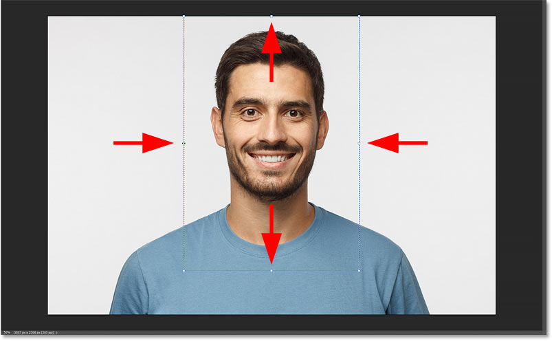

*Resizing the selection outline with Transform Selection.*

Then to accept it and close the Transform Selection command, click the **checkmark** in the Options Bar.

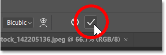

*Clicking the checkmark.*

## Copying a selection to a new layer

Next I'll show you how to copy your selection to its own layer, and we'll use it to create a simple picture-in-picture effect.

I'll switch over to my [second image](https://adobe.prf.hn/click/camref:1100lrdjJ/destination:https%3A%2F%2Fstock.adobe.com%2Fimages%2Ftwo-girlfriends-having-fun-at-azur-studio-background%2F174012401), also from Adobe Stock.

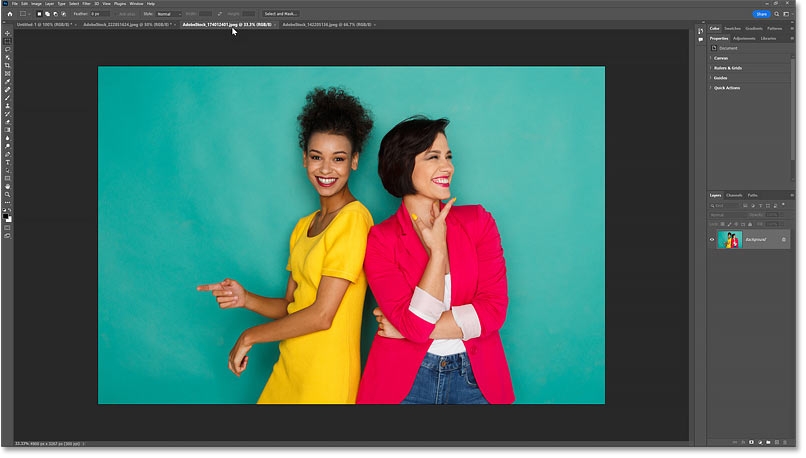

*The second image.*

### Step 1: Draw a rectangular selection outline

Start by dragging out a selection outline with the Rectangular Marquee Tool.

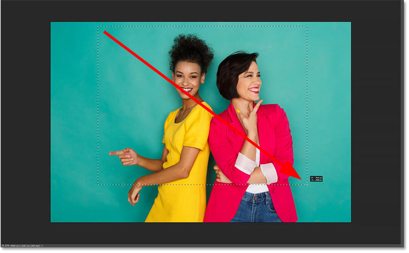

*Drawing a rectangular selection outline.*

### Dragging the selection with the Move Tool

Before we copy the selection to a new layer, I just want to show you the difference between dragging inside the selection outline with a selection tool and dragging with the **Move Tool**.

I'll select the Move Tool from the toolbar.

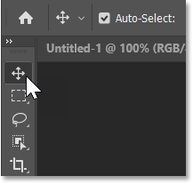

*Selecting the Move Tool.*

We know that if we drag inside the selection with a selection tool, we move the selection outline itself. But if we drag inside it with the Move Tool, we move the actual pixels.

*Dragging inside the selection outline with the Move Tool moves the pixels.*

Notice that not only have we cut a hole in the image by moving the selection, but Photoshop is filling the missing area with white. That’s because, in the [Layers panel](/basics/layers/layers-panel/), we see that we’re working on the [Background layer](/basics/background-layer-photoshop-cc/).

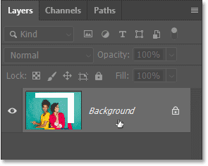

*The Layers panel showing the image on the Background layer.*

Since Background layers do not support transparency, Photoshop needs to fill that missing area with something. So it fills it with our current **Background color**. And by default, the Background color is white, as we see in the toolbar.

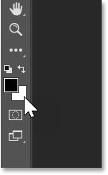

*The Foreground (upper left) and Background (lower right) color swatches.*

I'll undo moving the selection by going up to the **Edit** menu and choosing **Undo Move**. Or by pressing **Ctrl+Z** on a PC or **Command+Z** on a Mac.

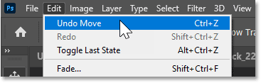

*Going to Edit > Undo Move.*

### Step 2: Choose the New Layer via Copy command

A better way to work is to copy the selection to its own layer by going up to the **Layer** menu, choosing **New**, and then **Layer via Copy**. Or by pressing one of Photoshop's most useful keyboard shortcuts, **Ctrl+J** on a PC or **Command+J** on a Mac.

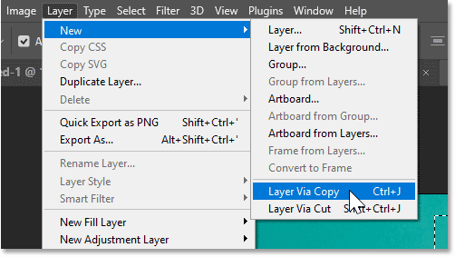

*Going to Layer > New > Layer via Copy.*

It won’t look like anything has happened to the image except that our selection outline is gone. But in the Layers panel, we see that the selection was copied to a new layer above the Background layer.

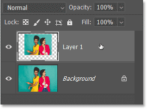

*The selected area was copied to a new layer above the image.*

If we turn off the Background layer by clicking its **visibility icon**:

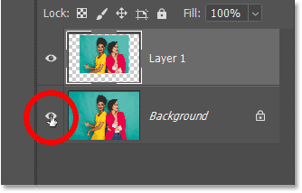

*Turning off the Background layer.*

We see just the area we selected, surrounded by transparency. This means that we can now do something with our selection without affecting the rest of the image below it. Or we can do something to the image without affecting the selection above it. Let's do both by creating a simple picture-in-picture effect.

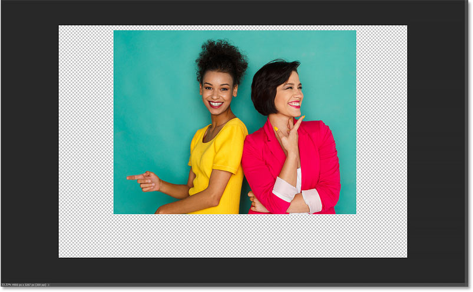

*With the Background layer off, we see just the area we selected.*

### Step 3: Select the Background layer

Start by converting the rest of the image to black and white. In the Layers panel, select the **Background layer**.

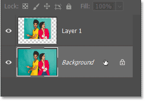

*Selecting the Background layer.*

### Step 4: Add a Hue/Saturation adjustment layer

Still in the Layers panel, click the **New Fill or Adjustment Layer** icon.

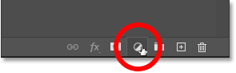

*Clicking the New Fill or Adjustment Layer icon.*

Then choose a **Hue/Saturation** adjustment layer from the list.

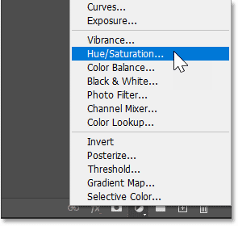

*Choosing Hue/Saturation.*

The adjustment layer appears between the original image on the Background layer and the layer that holds our selection. This means it will affect only the layer below it, not the layer above it.

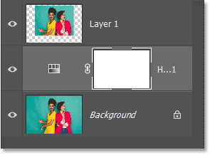

*The adjustment layer is added between the two layers.*

### Step 5: Lower the Saturation value

The options for the Hue/Saturation adjustment appear in the [Properties panel](/basics/using-the-enhanced-properties-panel-in-photoshop/). To remove the color from the image, drag the Saturation slider all the way to the left.

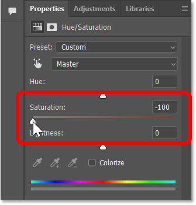

*Dragging the Saturation slider in the Properties panel.*

Since the adjustment layer is not affecting the layer above it, the area we selected remains in color while the rest of the image surrounding it has the color removed.

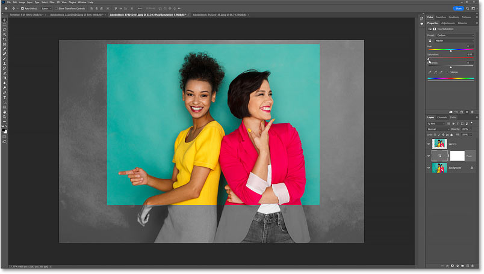

*The result after desaturating the image below the adjustment layer.*

### Step 6: Select the top layer

Complete the picture-in-picture effect by adding a white border around the selection.

In the Layers panel, click on the top layer to select it.

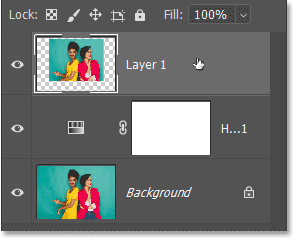

*Selecting the top layer.*

### Step 7: Add a Stroke layer effect

Add a stroke by going up to the **Layer** menu, choosing **Layer Style**, and then **Stroke**.

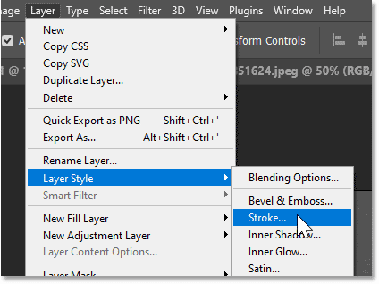

*Going to Layer > Layer Style > Stroke.*

In the Layer Style dialog box, click the **color swatch** and choose **white** from the Color Picker by setting the **R**, **G** and **B** values each to **255**. Then set the **Position** to **Inside**, and choose a width for the border by dragging the **Size** slider.

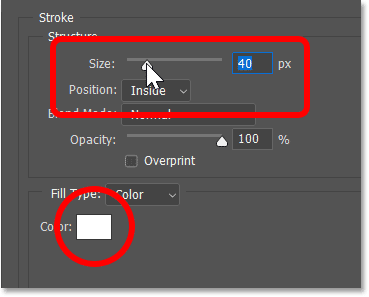

*The Stroke options in the Layer Style dialog box.*

Click OK to close the dialog box. And we now have our selection in color, a border around the selection, and everything surrounding it in black and white. All thanks to that initial selection we made with the Rectangular Marquee Tool.

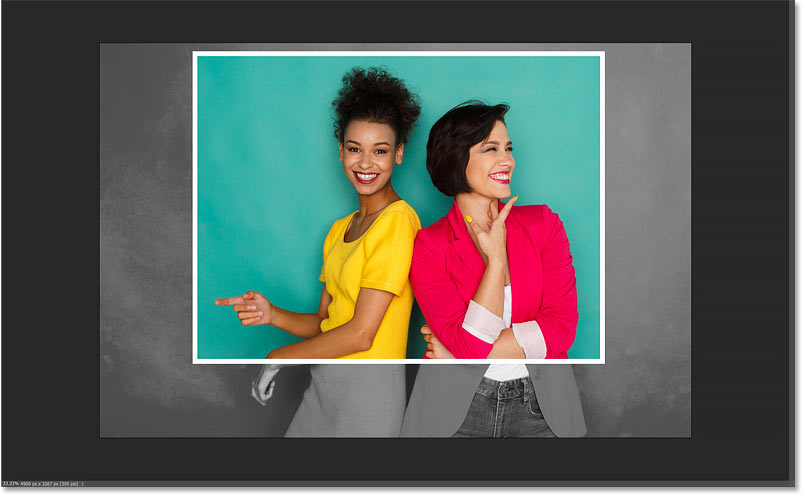

*An easy picture-in-picture effect.*

## Converting a selection outline into a layer mask

Before we move on to the Elliptical Marquee Tool, let's quickly look at how to turn our selection outline into a **layer mask**. And how we can then soften the edges of the mask using the Feather option in the Properties panel.

I'll switch over to my [third image](https://adobe.prf.hn/click/camref:1100lrdjJ/destination:https%3A%2F%2Fstock.adobe.com%2Fimages%2Fromantic-golden-sunset-river-lake-fog-loving-couple-small-rowing-boat-date-beautiful-lovers-ride-during-happy-woman-man-together-relaxing-water-nature-around%2F142205136) from Adobe Stock. Just like we did last time, we'll keep part of the image in color and convert the rest of it to black and white. But this time, we'll do things differently.

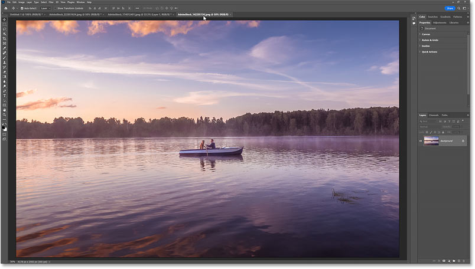

*The third image.*

### Step 1: Draw a rectangular selection outline

Start by dragging a rectangular selection outline around the area that should remain in color.

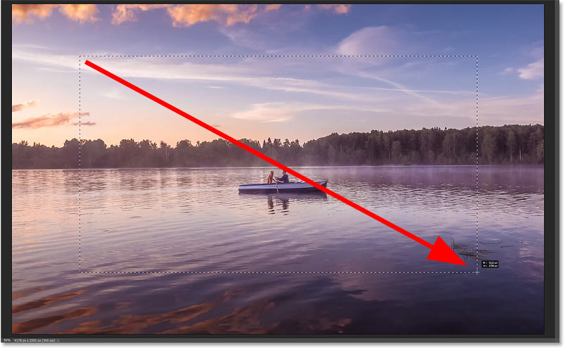

*Selecting an area in the center that will remain in color.*

### Step 2: Add a Hue/Saturation adjustment layer

But instead of copying the selection to its own layer, just add the Hue/Saturation adjustment layer by clicking the **New Fill or Adjustment Layer icon** in the Layers panel:

*Clicking the New Fill or Adjustment Layer icon.*

And choosing **Hue/Saturation.**

*Choosing Hue/Saturation.*

### The selection outline is converted into a layer mask

The adjustment layer is added above the image. And notice that Photoshop used the selection outline to create a [layer mask](/basics/understanding-photoshop-layer-masks/) for the adjustment layer, which we can see in the **layer mask thumbnail**. The white part of the mask is the area that was inside the selection outline, and the black area is everything that was outside.

The way a layer mask works is that the **white** part is where the contents of the layer are **visible** in the document and the **black** part is where the contents are **hidden**. Since we’re using the mask with an adjustment layer, the mask controls which part of the image is being affected by the adjustment layer and which part is not. 

If you think of the edges of the thumbnail as representing the edges of the image, the adjustment layer is affecting only that smaller white-filled area in the center.

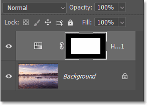

*The selection outline has been converted to a layer mask for the adjustment layer.*

### Step 3: Lower the Saturation value

To remove the color, go up to the Properties panel and drag the **Saturation** slider all the way to the left.

*Dragging the Saturation slider in the Properties panel.*

But Photoshop removes the color from the area we selected, not the area around it.

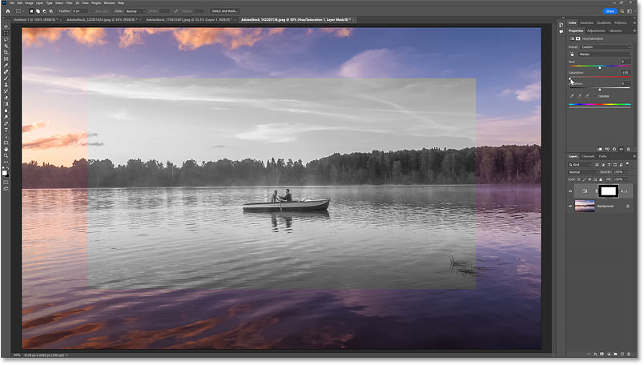

*The color is removed from the wrong part of the image.*

### Step 4: Invert the layer mask

To fix that, we need to invert the layer mask. In the Layers panel, make sure the **layer mask thumbnail** is selected.

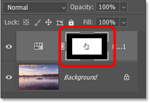

*Selecting the layer mask thumbnail.*

Then in the Properties panel, click the **Invert** button.

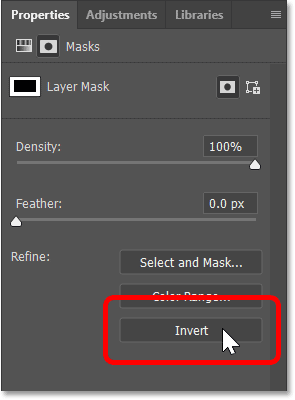

*Clicking Invert.*

After inverting the mask, which turned the white parts black and the black parts white, the adjustment layer is now affecting only the areas that were outside our initial selection, while the area in the center remains in color.

*The result after inverting the layer mask.*

### Step 5: Increase the Feather amount in the Properties panel

Finally, instead of adding another border like we did last time, this time we'll soften the edges to create a smooth transition between the color area in the center and the desaturated areas around it.

Since we converted the selection outline to a layer mask, we can simply blur the mask by going up to the Properties panel and dragging the **Feather** slider to the right.

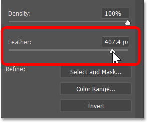

*Increasing the Feather value to soften the mask edges.*

After feathering the layer mask, the hard edges are replaced with smooth, gradual transitions. And that's our look at using the Rectangular Marquee Tool.

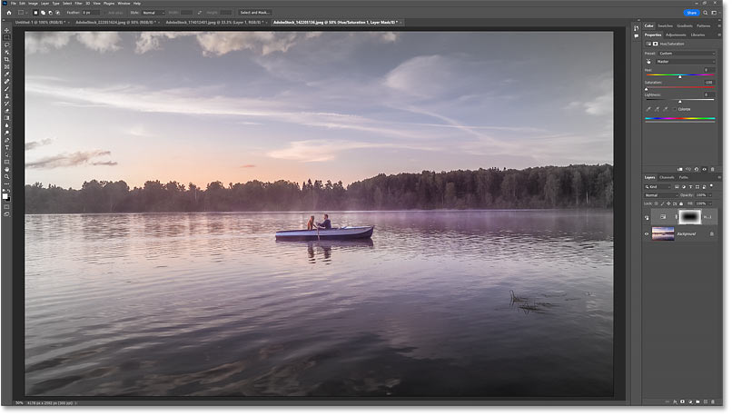

*The effect after feathering the layer mask.*

## How to draw selections with the Elliptical Marquee Tool

Now let's switch from the Rectangular Marquee Tool to the Elliptical Marquee Tool so we can quickly cover the basics.

### Selecting the Rectangular Marquee Tool from the toolbar

Select the Elliptical Marquee Tool from the toolbar. If the Rectangular Marquee Tool is visible, click and hold on its icon and then choose the Elliptical Marquee Tool from the list.

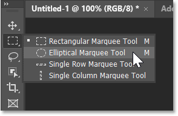

*By default, the Elliptical Marquee Tool is hiding behind the Rectangular Marquee Tool.*

### Drawing an elliptical selection outline

The Elliptical Marquee Tool works exactly the same as the Rectangular Marquee Tool. The only difference is that it draws elliptical selection outlines, not rectangles. If you click and drag with the tool, you'll draw a freeform elliptical selection.

Click and drag outside an existing selection outline to clear the selection and draw a new one. Or click and drag inside the outline with a selection tool to reposition the outline. To reposition the outline as you draw it, hold the **spacebar** on your keyboard, drag the outline into place, and then release the spacebar and continue dragging.

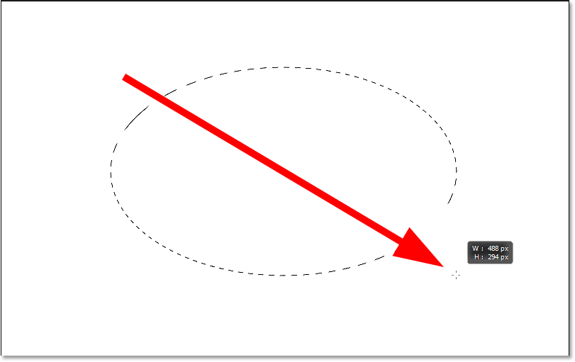

*Click and drag to draw a freeform elliptical selection outline.*

### How to deselect a selection

To remove the selection outline when you're done, go up to the **Select** menu and choose **Deselect**. Or press the keyboard shortcut **Ctrl+D** on a PC or **Command+D** on a Mac. Or just click in the document with your selection tool.

### Drawing an elliptical selection outline from its center

To draw an elliptical selection outline from its center, begin dragging, then hold the **Alt** key on a PC or the **Option** key on a Mac and continue dragging.

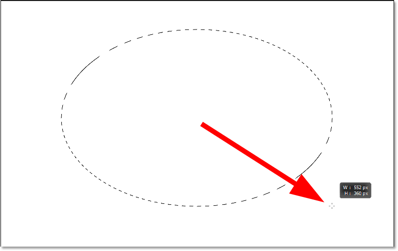

*Drawing the elliptical selection outline from its center.*

### How to draw a selection as a perfect circle

To draw a selection outline as a perfect circle, begin dragging with the Elliptical Marquee Tool. Then hold the **Shift** key on your keyboard and continue dragging. Add the **Alt** key or the **Option** key on a Mac to draw the circle outward from its center. When you’re done, remember to release your mouse button first,  then whichever key or keys you were holding down.

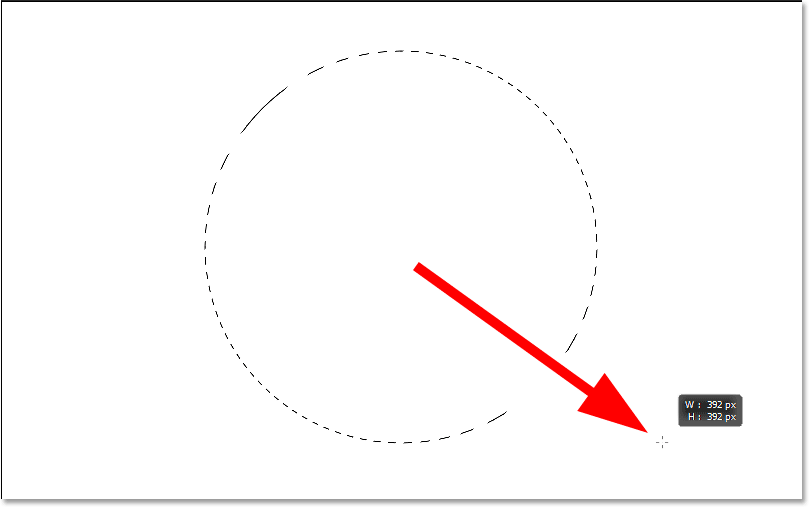

*Drawing the elliptical selection outline as a circle.*

### The Anti-alias option

In the Options Bar, we have the same options we had with the Rectangular Marquee Tool. The only new one is **Anti-alias** which adds a slight blur to the selection edges to keep them from looking too jagged. Anti-alias you should be left on.

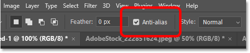

*The Anti-alias option, on by default.*

### How to add, subtract and intersect elliptical selections

On the left of the Options Bar are the same **New selection**, **Add to selection**, **Subtract from selection** and **Intersect with selection** options that we had with the Rectangular Marquee Tool. But again you should avoid using these icons and instead use their keyboard shortcuts.

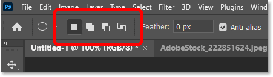

*The New, Add, Subtract and Intersect selection icons.*

To add your next selection outline to the existing selection outline, hold the **Shift** key on your keyboard and then drag.

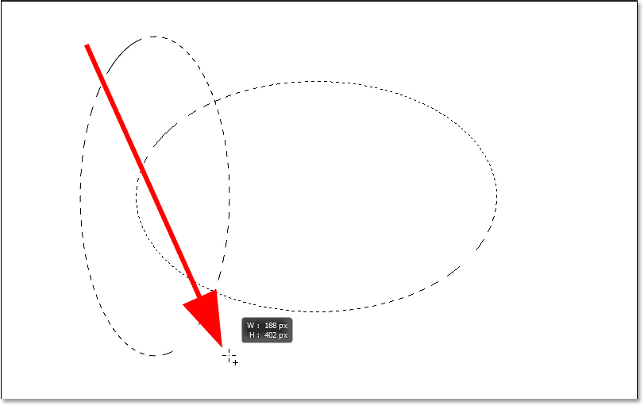

*Hold Shift and drag to add the selection to the existing selection.*

Release your mouse button and the two selections are combined together.

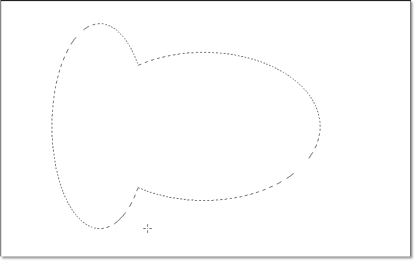

*The two selection outlines have been combined into one.*

To subtract the next selection from the existing selection, hold the **Alt** key on a PC or the **Option** key on a Mac and then drag around the area you want to subtract.

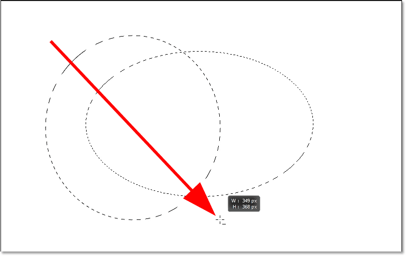

*Hold Alt (Win) / Option (Mac) and drag to subtract the selection from the existing selection.*

Release your mouse button and the area is subtracted.

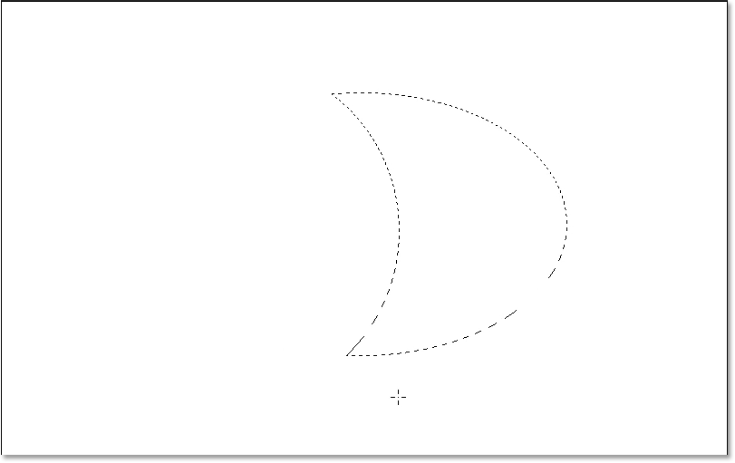

*The new selection removed part of the previous selection.*

And to keep only the area where the next selection and the existing selection intersect, hold **Shift+Alt** on a PC or **Shift+Option** on a Mac as you drag.

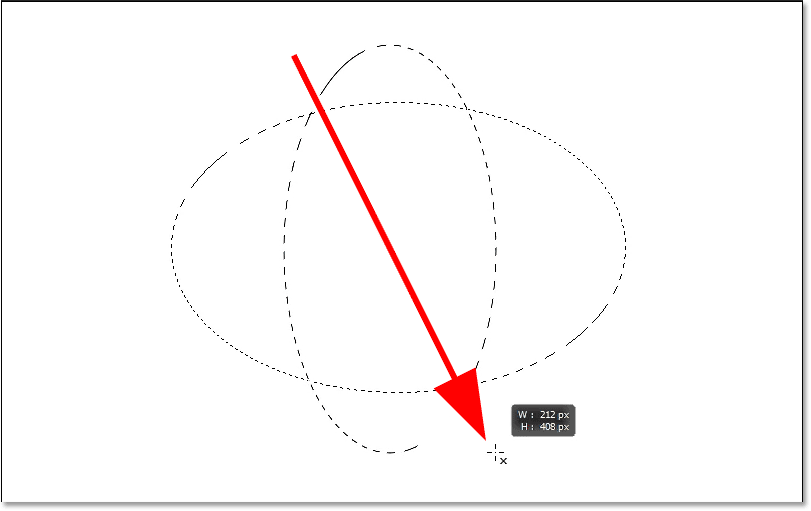

*Hold Shift+Alt (Win) / Shift+Option (Mac) and drag to intersect the two selection outlines.*

Release your mouse button and only the area where the two selection outlines overlapped remains selected.

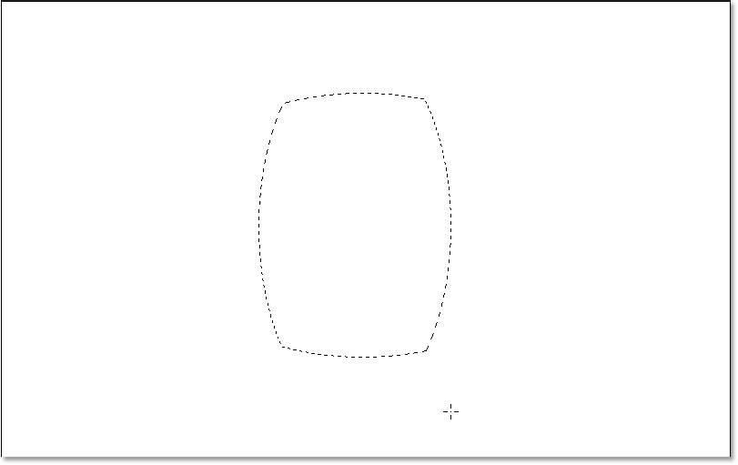

*Only the intersection of the two selection outlines remains.*

### The Style options

We have the same **Style** option for the Elliptical Marquee Tool that we had with the Rectangular Marquee Tool. With Style set to **Normal**, we can drag an elliptical selection outline at any size or aspect ratio. But we also have Fixed Ratio and Fixed Size.

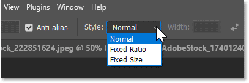

*The Style options for the Elliptical Marquee Tool.*

If I choose **Fixed Ratio** and set the ratio to 2 to 1:

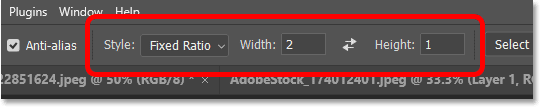

*Setting the Style to Fixed Ratio and the ratio to 2 to 1.*

My selection outline will be twice as wide as it is tall.

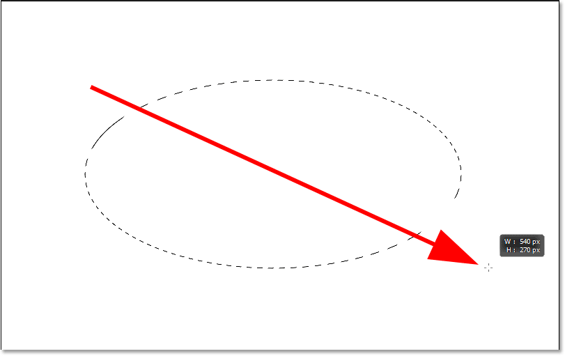

*Drawing the elliptical selection and the 2:1 ratio.*

And if I choose **Fixed Size** and I set the **Width** to **400 px** and the **Height** to **300 px**:

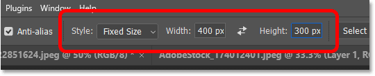

*Setting the Style to Fixed Size and entering Width and Height values.*

Then all I need to do is click in the document to draw an elliptical selection at that exact size. Or I can click and drag to reposition the outline before releasing my mouse button.

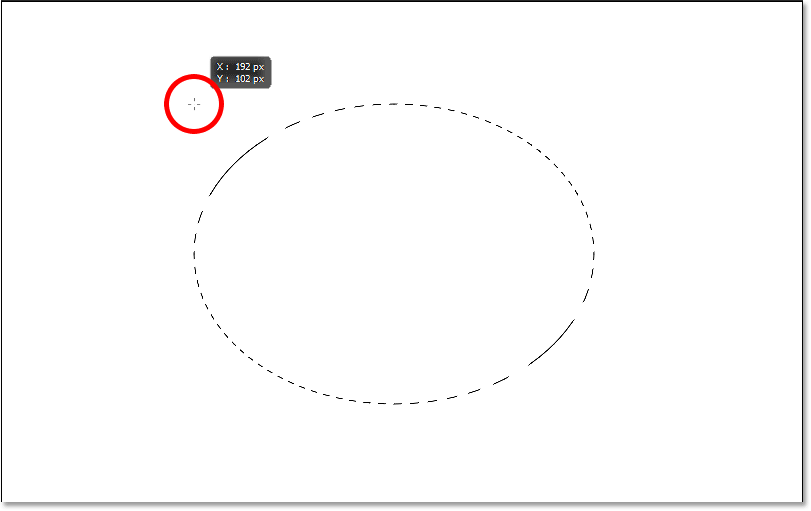

*Click and release to draw the elliptical selection outline at the fixed size.*

Again remember to set the Style option back to **Normal** when you’re done, otherwise you’ll keep drawing outlines at that fixed size or ratio. 

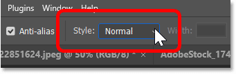

*Resetting the Style back to Normal.*

### The Feather option

Lastly, we have the same **Feather** option that we had with the Rectangular Marquee Tool, which blurs the selection edges. But unless you know the exact feather amount you need, it’s best to leave it at 0 here. You can adjust it afterwards using something like the Feather option in the Properties panel, which we’ll be looking at again with one of our images.

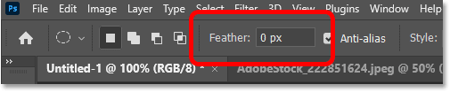

*The Feather option.*

## Three ways to use the Elliptical Marquee Tool

That's the basics of drawing selection outlines with the Elliptical Marquee Tool. So let's move on to the images and look at three common ways to use it. 

I'll show you how to **crop an image as an elliptical shape** and why it's different from cropping with the Rectangular Marquee Tool. Then we'll look at how to **draw two elliptical selection outlines at the same size**. And finally, I'll show you how to **create a classic vignette effect**.

## Cropping an image as an elliptical shape

We'll start with how to crop an image using the Elliptical Marquee Tool. Earlier we saw that we can use the Rectangular Marquee Tool as a quick way to crop an image. We can do the same thing with the Elliptical Marquee Tool. But instead of cropping as a rectangle or square, we can crop it as an elliptical shape or a circle. 

I’ll use [this image](https://adobe.prf.hn/click/camref:1100lrdjJ/destination:https%3A%2F%2Fstock.adobe.com%2Fimages%2Fpretty-curly-african-american-woman-confesses-in-love-makes-heart-gesture-shows-her-true-feelings-has-happy-expression-wears-casual-red-t-shirt-poses-over-pink-background-relationship-concept%2F328746485) from Adobe Stock. 

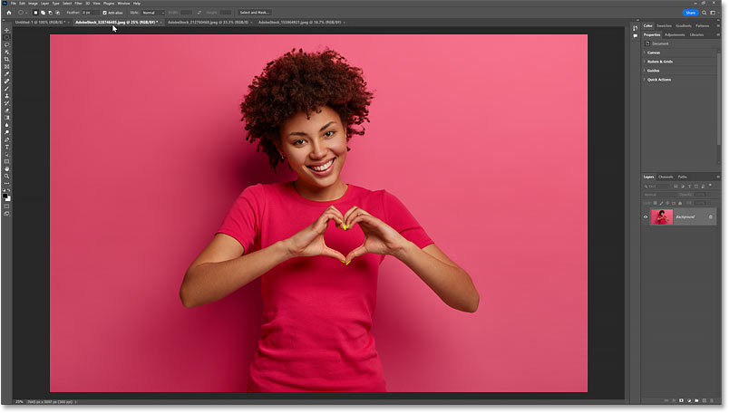

*The first image.*

### Step 1: Draw an elliptical selection outline

With the Elliptical Marquee Tool active, drag an elliptical selection outline around the area you want to keep. Hold the **spacebar** as you drag if you need to reposition the outline, and then release the spacebar to continue dragging.

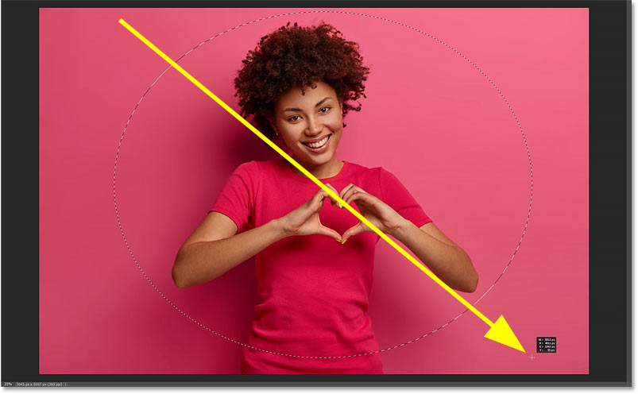

*Drawing an elliptical selection outline to use as a crop border.*

### Why cropping with the Elliptical Marquee Tool is different

But here's why cropping with the Elliptical Marquee Tool is different from using the Rectangular Marquee Tool. If we go up to the **Image** menu and choose **Crop** like we did with the Rectangular Marquee Tool:

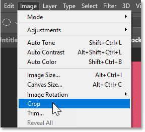

*Going to Image > Crop.*

Then even though our selection outline is elliptical, Photoshop still crops the image as a rectangle. It just uses the top, bottom, left and right of the elliptical outline as the boundaries for the rectangle. 

Since that didn't work, I'll undo the crop by pressing **Ctrl+Z** on a PC or **Command+Z** on a Mac.

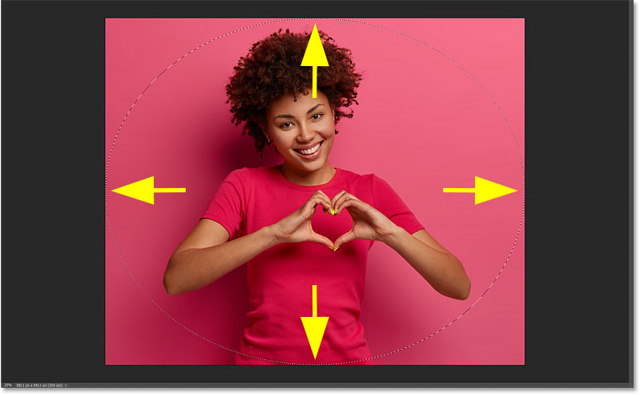

*Photoshop uses the elliptical selection edges as the rectangular crop boundaries.*

### Step 2: Unlock the Background layer

When we crop an image as an elliptical shape, what we really want is to delete everything outside the selection and replace it with transparency. 

So if your image is on the **Background layer**, click the **lock icon** to convert it to a normal layer. Background layers don’t support transparency, but normal layers do.

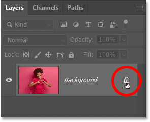

*Click the lock icon to convert the Background layer to a normal layer.*

### Step 3: Invert the selection

Then with your selection outline in place, go up to the **Select** menu and choose **Inverse**. This selects everything that was outside your selection and deselects everything that was inside.

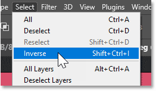

*Going to Select > Inverse.*

### Step 4: Press Backspace (Win) / Delete (Mac)

Press the **Backspace** key on a PC or the **Delete** key on a Mac, and Photoshop deletes everything around the area you initially selected.

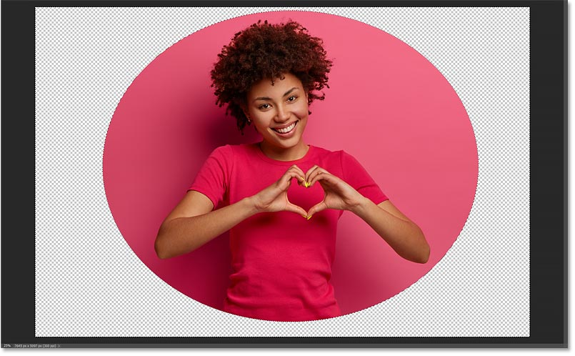

*The area around the initial selection is now filled with transparency.*

### Step 5: Remove the selection outline

Clear the selection outline by going up to the **Select** menu and choosing **Deselect**, or by pressing **Ctrl+Z** on a PC or **Command+Z** on a Mac.

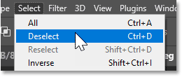

*Going to Select > Deselect.*

### Step 6: Trim away the extra space

Then to crop away all of the extra space, go up to the **Image** menu and instead of choosing Crop, choose **Trim**.

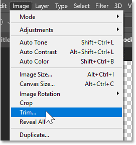

*Going to Image > Trim.*

In the Trim dialog box, choose **Transparent Pixels** at the top. Make sure **Top**, **Bottom**, **Left** and **Right** are all selected, and then click OK.

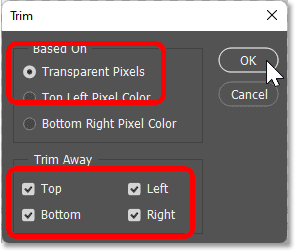

*The Trim options.*

And we're left with the transparency only in the corners.

To learn more about cropping an image in a circle, including how to save the file with the transparent background, check out my [Crop Images in a Circle Shape](/basics/crop-image-circle-photoshop/) tutorial.

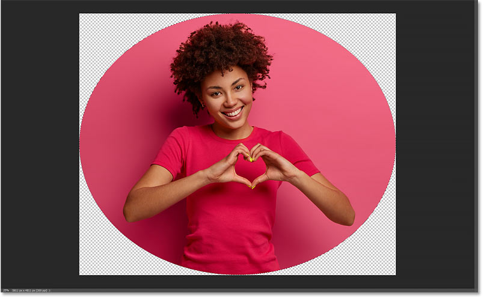

*The result after trimming the extra space.*

## Drawing two elliptical selections at the same size

I’ll switch over to a different image. And with [this image](https://adobe.prf.hn/click/camref:1100lrdjJ/destination:https%3A%2F%2Fstock.adobe.com%2Fimages%2Fportrait-of-young-smiling-people-guy-and-girl-20s-in-basic-clothing-posing-together-at-camera-with-happy-look-isolated-over-concrete-gray-wall-indoor%2F212760468), I'll show you how to draw a second selection outline at the same size as the first one.

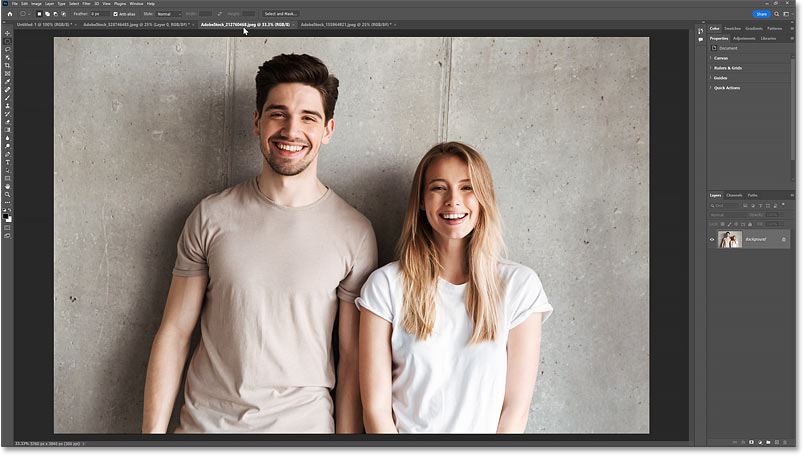

*The second image.*

### Step 1: Draw a circular selection outline

I want to add a circle around each person's face. So I’ll start with the guy on the left. With the Elliptical Marquee Tool active, I’ll begin dragging an elliptical selection outline around him. Then to force the outline into a circle, I’ll hold the **Shift** key on my keyboard and continue dragging.

To reposition the outline so he's centered inside it, I’ll keep the Shift key down and add the **spacebar** as I drag. 

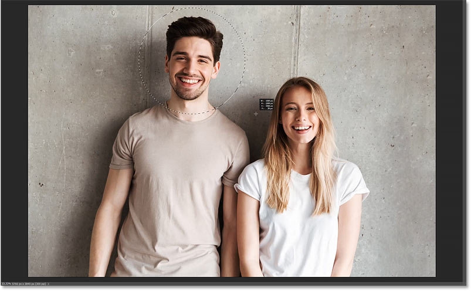

*Drawing a circular selection outline around the man's face.*

### Step 2: Use the HUD to check the outline's dimensions

But before I release my mouse button, notice that the **Heads-Up Display** is showing the width and height of my selection outline. They’re both **1500 pixels**. I want my next selection outline to be the same size. So I’ll remember 1500 pixels and then I’ll release my mouse button, at which point the display disappears.

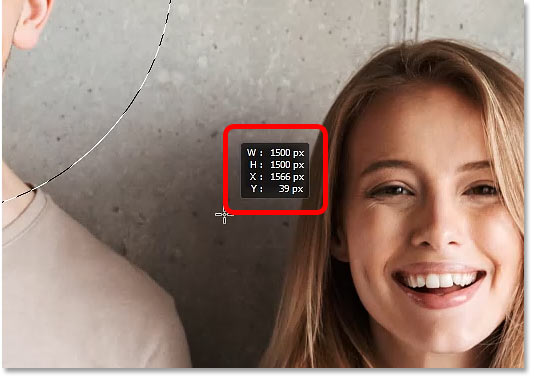

*The Heads-Up Display shows the width and height of the selection outline.*

### Step 3: Change the Style to Fixed Size and enter the dimensions

To draw my next selection at the same size, I’ll change the **Style** in the Options Bar from Normal to **Fixed Size**. Then I’ll set both the **Width** and the **Height** to that same **1500 pixels**.

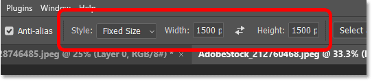

*Changing the Style to Fixed Size and entering an exact width and height.*

### Step 4: Hold Shift and click to draw the selection outline

To add my next selection to the existing selection, I’ll hold the **Shift** key on my keyboard. Then I’ll **click and hold** to instantly draw my second selection outline at the same size as the first one.

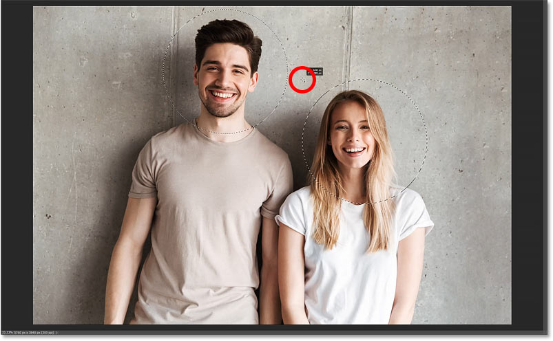

*Holding Shift, then clicking and holding to add the next selection at the same size.*

With my mouse button still down, I’ll drag to reposition the outline so the woman's face is centered inside it. Then to complete it, I'll release my mouse button.

*Dragging the second selection outline into place before releasing the mouse button.*

### Step 5: Reset the Style back to Normal

Before I forget, I'll reset the **Style** back to **Normal** so I don't keep drawing selections at the same size.

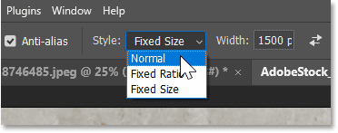

*Resetting the Style back to Normal.*

### Step 6: Copy the selections to a new layer

Now that both selections are in place, I'll copy them to a new layer above the image by pressing **Ctrl+J** on a PC or **Command+J** on a Mac.

And if I turn off the Background layer in the Layers panel by clicking its **visibility icon**:

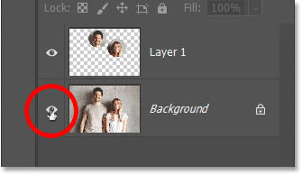

*Turning off the Background layer.*

We see just the areas I selected.

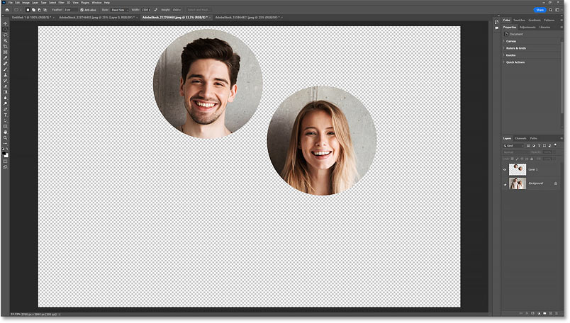

*Viewing only the contents of the new layer.*

### Step 7: Add a stroke around the selections

I'll quickly add a stroke around them by clicking on the top layer in the Layers panel to select it.

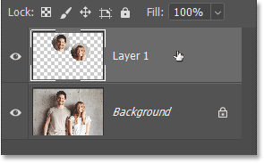

*Selecting the top layer.*

Another way to add a stroke is to click the **fx** icon at the bottom of the Layers panel:

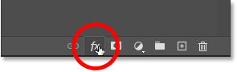

*Clicking the layer effects icon.*

And choose **Stroke** from the list.

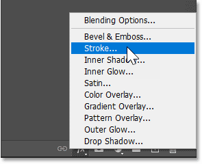

*Adding a Stroke layer effect.*

In the Layer Style dialog box, my stroke **color** is already set to **white** from when we added one earlier. So with the **Position** still set to **Inside**, I'll lower the **Size** to around **30 pixels**.

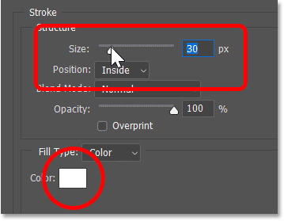

*The Stroke options.*

And since both selections are on the same layer, the stroke appears around both.

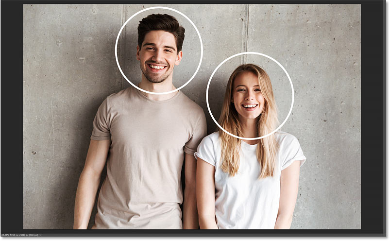

*The stroke is added to both selections at once.*

### Step 8: Colorize the rest of the image

Just for fun, I'll quickly colorize the rest of the image. In the Layers panel, I'll select the **Background layer**:

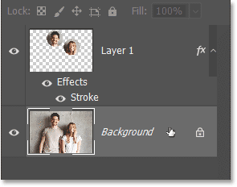

*Selecting the Background layer.*

Then I'll click the **New Fill or Adjustment Layer** icon:

*Clicking the New Fill or Adjustment Layer icon.*

And add a **Hue/Saturation** adjustment layer.

*Choosing Hue/Saturation.*

The adjustment layer again appears between the Background layer and the top layer, which means it will affect the layer below it but not the layer above it.

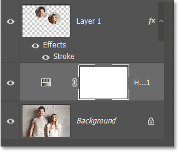

*The adjustment layer will affect only the Background layer.*

In the Properties panel, I'll click the **Colorize** option. Then I'll choose a color by dragging the **Hue** slider. I'll go with blue by setting the value to **200**.

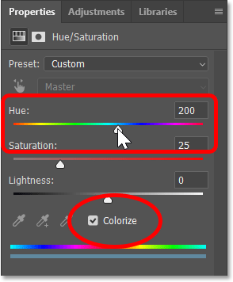

*Click Colorize and then dragging the Hue slider.*

This colorizes everything outside the circles.

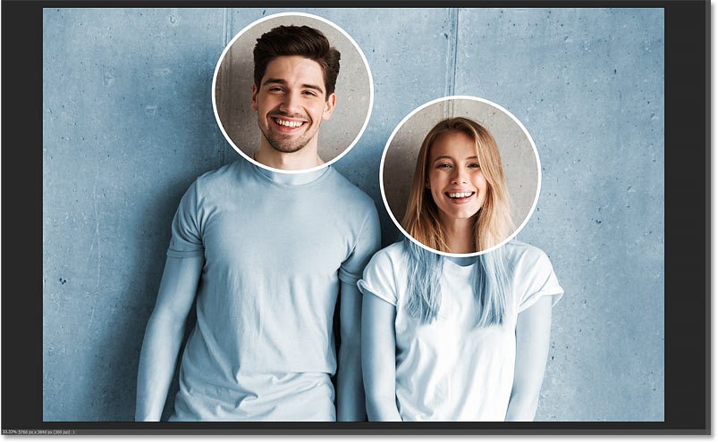

*The rest of the image is colorized with blue.*

And then to fade the color, I'll lower the **Opacity** of the adjustment layer to around **60 percent**.

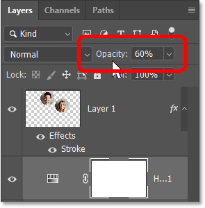

*Lowering the opacity of the adjustment layer.*

And here's the final result. Another effect made easy thanks to the Elliptical Marquee Tool.

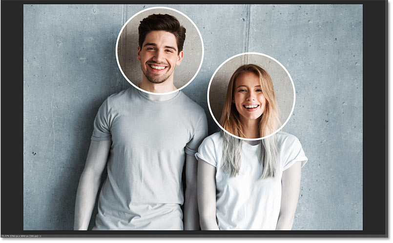

*The final effect.*

## Creating a classic vignette effect

Let’s finish up by looking at a classic use for the Elliptical Marquee Tool, which is to create a vignette effect.

I’ll switch over to my [final image](https://adobe.prf.hn/click/camref:1100lrdjJ/destination:https%3A%2F%2Fstock.adobe.com%2Fimages%2Fportrait-of-a-wedding-couple-in-a-loft-room%2F155964921).

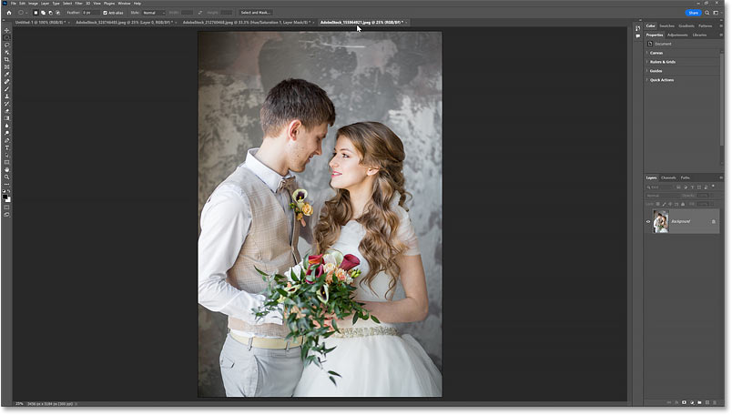

*The third image.*

### Step 1: Draw an elliptical selection outline

We want to make sure that the selection outline is centered in the image. So with the Elliptical Marquee Tool active, click in the top left corner of the image to start the selection and drag all the way down to the bottom right.

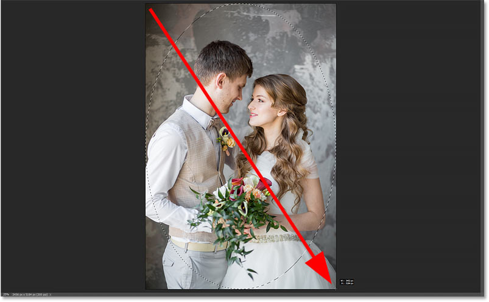

*Dragging an elliptical selection outline from the top left to the bottom right of the image.*

### Step 2: Resize the selection outline with Transform Selection

Then to resize the selection outline, go up to the **Select** menu and choose **Transform Selection**.

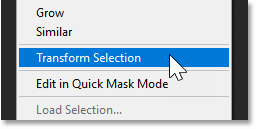

*Going to Select > Transform Selection.*

Hold the **Alt** key on a PC or the **Option** key on a Mac to resize the selection outline from its center and drag one of the handles inward to make the outline a bit smaller, leaving room around the edges for the border.

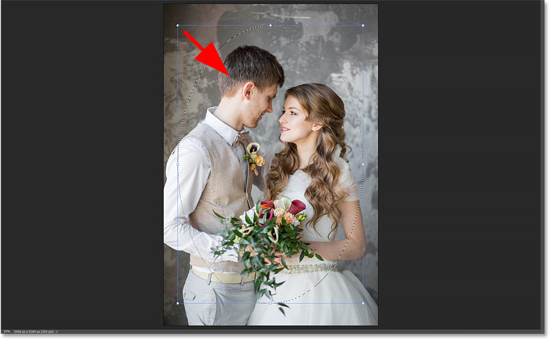

*Hold Alt (Win) / Option (Mac) and drag a handle to resize the selection outline from its center.*

Click the checkmark in the Options Bar to accept.

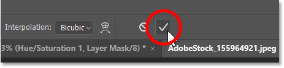

*Clicking the checkmark to close the Transform Selection command.*

### Step 3: Invert the selection

At the moment, we have the couple in the center selected. But what we need is to have everything around them selected, which means we need to invert the selection. So go up to the **Select** menu and choose **Inverse**.

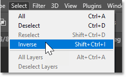

*Going to Select > Inverse.*

### Step 4: Add a Solid Color fill layer

Add a Solid Color fill layer above the image by going up to the **Layer** menu, choosing **New Fill Layer** and then **Solid Color**.

![Adding a Solid Color fill layer above the image](https://pe-images.s3.amazonaws.com/basics/2022/rectangular-elliptical-marquee-tool/add