# Photoshop Shapes And Shape Layers Essentials

> Source: [https://www.photoshopessentials.com/basics/shapes/photoshop-shape-essentials/](https://www.photoshopessentials.com/basics/shapes/photoshop-shape-essentials/)
> Downloaded and converted to Markdown.

In this tutorial, we'll learn the essentials of working with **shapes** and **Shape layers** in Photoshop! We'll start by learning how to use the five geometric shape tools - the **Rectangle Tool**, the **Rounded Rectangle Tool**, the **Ellipse Tool**, the **Polygon Tool**, and the **Line Tool**. Then, in the next tutorial, we'll learn how to add more complex shapes to our documents with Photoshop's **Custom Shape Tool**.

Most people think of Photoshop as a photo editing program, and if you were to ask someone to recommend a good drawing program, Adobe Illustrator would usually be at the top of their list. It's true that Illustrator's drawing and illustration features are far beyond Photoshop's, but Photoshop has more drawing ability than you might expect for a pixel-based image editor, thanks in large part to its Shape tools and Shape layers which make it easy to add simple vector-based graphics and shapes to our designs and layouts.

This tutorial is for Photoshop CS5 and earlier. Photoshop CS6 users will want to check out the fully updated [How To Draw Vector Shapes In Photoshop CS6](/basics/how-to-draw-vector-shapes-in-photoshop-cs6/) tutorial.

### The Shape Tools

Photoshop gives us six Shape tools to choose from - the Rectangle Tool, the Rounded Rectangle Tool, the Ellipse Tool, the Polygon Tool, the Line Tool, and the Custom Shape Tool, and they're all nested together in the same spot in the Tools panel. By default, the Rectangle Tool is the one that's visible in the Tools panel, but if we click on the tool's icon and hold our mouse button down for a second or two, a fly-out menu appears showing us the other Shape tools we can choose from:

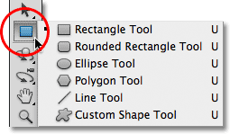

*All six Shape tools are located in the same spot in the Tools panel.*

Once you have a Shape tool selected, if you need to switch to a different one, there's no need to go back to the Tools panel (although you can if you want to) because Photoshop gives us access to all of the Shape tools directly from the **Options Bar** along the top of the screen. For example, I'll select the Rectangle Tool from the Tools panel:

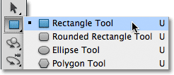

*Selecting the Rectangle Tool.*

With the Rectangle Tool selected, a row of six icons appears in the Options Bar, with each icon representing a different Shape tool. The tools are listed from left to right in the same order they appear in the Tools panel, so again we have the Rectangle Tool, the Rounded Rectangle Tool, the Ellipse Tool, the Polygon Tool, the Line Tool, and the Custom Shape Tool. Simply click on one of the icons to choose the tool you need:

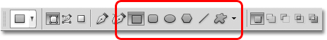

*All six Shape tools can be selected directly from the Options Bar (after one of them is first selected from the Tools panel).*

### The Shape Layers Option

Before we start drawing any shapes, we first need to tell Photoshop which type of shape we want to draw, and by that, I don't mean rectangles or circles. Photoshop actually lets us draw three very different kinds of shapes - **vector shapes**, **paths**, or **pixel-based shapes**. We'll look more closely at the differences between the three and why you'd want to use each one in another tutorial, but in most cases, you'll want to be drawing vector shapes, which are the same types of shapes we'd be drawing in a program like Illustrator. Unlike [pixels](/essentials/pixels.php), vector shapes are resolution-independent and fully scalable, which means we can make them as big as we like and resize them as often as we like without any loss of image quality. The edges of vector shapes will always remain crisp and sharp, both on the screen and when we go to print them.

To draw vector shapes, select the **Shape Layers** option in the Options Bar. It's the first of three icons near the far left (the Paths option is the middle of the three icons followed by the Fill Pixels option on the right):

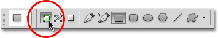

*Select the Shape Layers option to draw vector shapes.*

### Choosing A Color For The Shape

With the Shape Layers option selected, the next thing we need to do is choose a color for our shape, and we do that by clicking on the **color swatch** to the right of the word **Color** in the Options Bar:

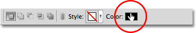

*Click on the color swatch to choose a color for the shape.*

Photoshop will pop open the **Color Picker** where we can choose the color we want to use. I'll choose red. Click OK once you've chosen a color to close out of the Color Picker:

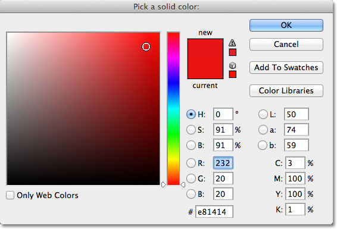

*Choose a color for your shape from the Color Picker.*

Don't worry about choosing the wrong color for your shape if you're not sure which color you'll need. As we'll see, Shape layers make it easy to go back and change the color of a shape at any time after we've drawn it.

### The Rectangle Tool

As you can probably guess from its name, Photoshop's Rectangle Tool lets us draw four-sided rectangular shapes. Simply click in the document to set the starting point for your shape, then keep your mouse button held down and drag diagonally to draw the rest of the shape. As you drag, you'll see a thin outline of what the shape will look like:

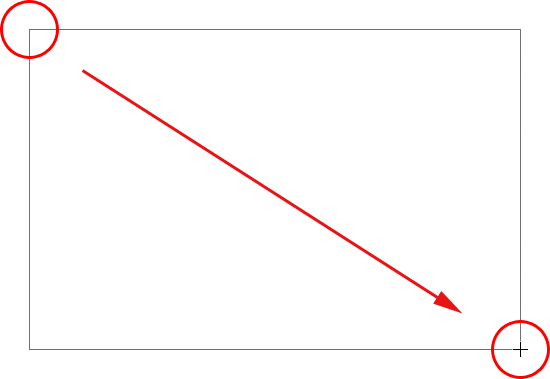

*Dragging out a rectangle shape. As you drag, only an outline of the shape appears.*

When you're happy with the look of your shape, release your mouse button, at which point Photoshop fills the shape with the color you selected in the Options Bar:

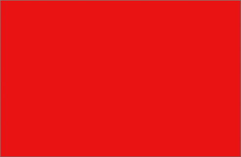

*Photoshop fills the shape with color when you release your mouse button.*

### Drawing A Shape From Its Center

If you need to draw a rectangle (or any shape) from its center rather than from a corner, click inside the document where the center of the rectangle should be and begin dragging out the shape as you normally would. Once you begin dragging, press your **Alt** (Win) / **Option** (Mac) key and keep it held down as you continue dragging. The Alt / Option key tells Photoshop to draw the shape out from its center. This works with all of the Shape tools, not just the Rectangle Tool:

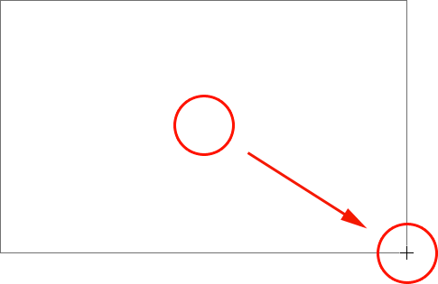

*Hold down Alt (Win) / Option (Mac) after you begin dragging to draw a shape from its center.*

### Drawing Squares

We can also draw squares with the Rectangle Tool. To draw a square, click inside the document and begin dragging out a rectangular shape. Once you've started dragging, press your **Shift** key on your keyboard and keep it held down while you continue dragging out the shape. Holding the Shift key down will force the shape into a perfect square no matter which direction you drag in. You can also add the **Alt** (Win) / **Option** (Mac) key to draw the square out from its center (so you would press and hold **Shift+Alt** (Win) / **Shift+Option** (Mac)):

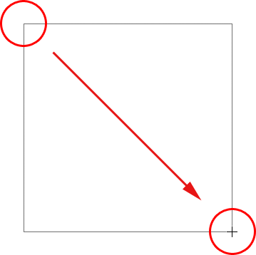

*Hold down Shift as you drag with the Rectangle Tool to draw a perfect square.*

Again, Photoshop will display only a thin outline of the square as you're dragging, but when you release your mouse button, Photoshop fills it with color:

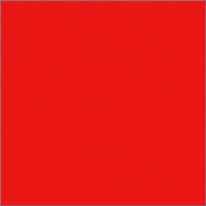

*Photoshop always waits till you release your mouse button before filling the shape with color.*

### The Shape Options

If you look in the Options Bar, directly to the right of the six Shape tool icons, you'll see a **small down-pointing arrow**. Clicking on the arrow opens a list of additional options for whichever Shape tool you have selected. With the Rectangle Tool selected, for example, clicking on the arrow brings up the Rectangle Options.
With the exception of the Polygon Tool and the Line Tool, which we'll look at later, you won't find yourself using this menu very often because we've already learned how to access the main options directly from the keyboard.

For example, the **Unconstrained** option is selected for us by default, and that's just the normal behavior of the Rectangle Tool, allowing us to draw rectangular shapes of any size or aspect ratio. The **Square** option lets us draw squares, but we can do that just by holding down the Shift key as we drag. And the **From Center** option will draw the shape from its center, but again, we can already do that by holding down our Alt (Win) / Option (Mac) key as we drag:

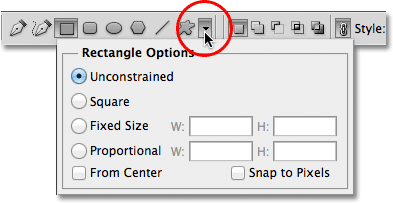

*Click on the small arrow to view additional options for the Rectangle Tool.*

### Shape Layers

Before we check out the rest of the Shape tools, let's quickly take a look at what's happening in the Layers panel. If you remember at the beginning of the tutorial, we learned that to draw vector shapes in Photoshop, we need to make sure we have the Shape Layers option selected in the Options Bar, and now that I've drawn a shape, we see that I have an actual Shape layer in my document, which Photoshop has named "Shape 1". Each new vector shape we draw is placed on its own Shape layer which look different from normal pixel-based layers. On the left of a Shape layer is a **color swatch** icon, which displays the current color of our shape, and to the right of the color swatch is a **vector mask thumbnail**:

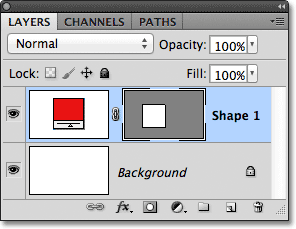

*Shape layers have a color swatch on the left and a vector mask thumbnail to the right of it.*

Earlier I mentioned that we don't need to worry about choosing the correct color for a shape because we can easily change its color after we've drawn it, and we can do that by double-clicking directly on the Shape layer's color swatch:

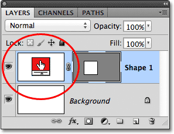

*To change an existing shape's color, double-click on its color swatch.*

Photoshop will re-open the Color Picker for us so we can choose a different color for the shape. I'll choose blue this time:

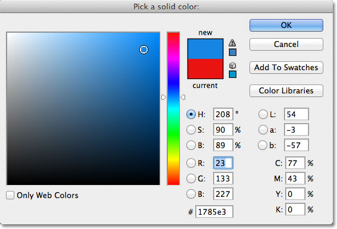

*Choosing a different color from the Color Picker.*

I'll click OK to close out of the Color Picker, and Photoshop changes the color of my square shape from red to blue:

*It's easy to go back and change the color of a shape at any time.*

To the right of the color swatch on a Shape layer is the vector mask thumbnail. The white area inside the thumbnail represents our shape. Vector masks are similar to pixel-based [layer masks](/basics/layers/layer-masks/) in that they reveal some parts of a layer while hiding other parts, and by that, I mean that when we draw a vector shape, Photoshop actually fills the *entire layer* with our chosen color, but it only displays the color inside the shape area. It hides the color in the areas outside the shape. This isn't something you really need to know to work with shapes in Photoshop, but it's always nice to understand what it is you're looking at. The gray area around the shape in the vector mask thumbnail is the area on the layer where the color is being hidden from view, while the white area is where the color is visible:

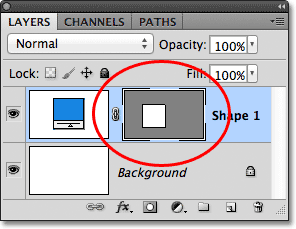

*The white area on the vector mask represents the visible shape area on the layer.*

To make it easier to see how Photoshop is displaying the vector shape, we can actually turn vector masks off temporarily by holding down our **Shift** key and clicking directly on the vector mask thumbnail. A big red X will appear in the thumbnail letting us know the mask is now off:

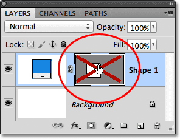

*Hold Shift and click on a vector mask to turn it off.*

With the vector mask turned off, the entire layer is revealed in the document, and we can see that it's completely filled with the blue color I chose for my shape. If you look closely, you can see the thin outline of where the shape is sitting on the layer:

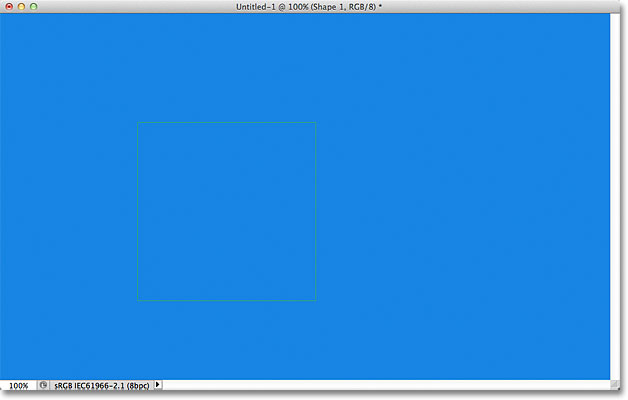

*Turning the vector mask off shows that the entire layer itself is filled with color.*

To turn a vector mask back on, simply hold down Shift and click again on its thumbnail in the Layers panel. With the mask back on, all of the color outside the shape is once again hidden from view, and all we can see is the color inside the shape itself. The white areas around the shape in my document window are from my Background layer below it:

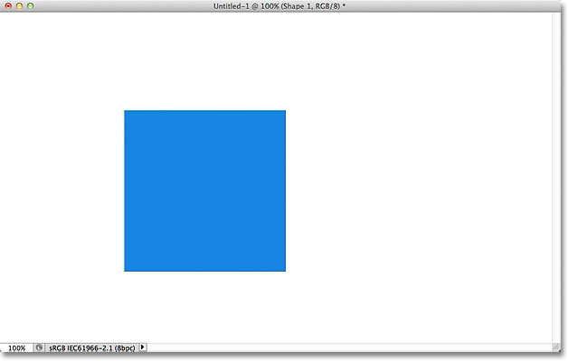

*The document after turning the Shape layer's vector mask back on.*

Now that we've looked at Shape layers, let's see what other types of shapes we can draw in Photoshop using the other geometric Shape tools.

### The Rounded Rectangle Tool

The Rounded Rectangle Tool is very similar to the standard Rectangle Tool except that it lets us draw rectangles with nice rounded corners. We control the roundness of the corners using the **Radius** option in the Options Bar. The higher the value we enter, the more rounded the corners will appear. I'll set my Radius value to 50 px:

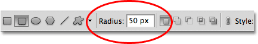

*Use the Radius value to set the roundness of the corners.*

To draw a rounded rectangle after you've entered a Radius value, click inside the document to set a starting point, then keep your mouse button held down and drag out the rest of the shape. Just as we saw with the normal Rectangle Tool, Photoshop displays a thin outline of the shape while you're drawing it:

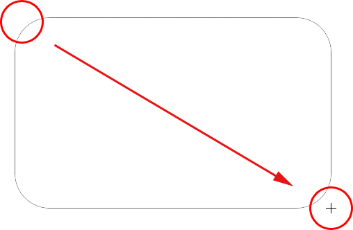

*Dragging out a rounded rectangle after setting the Radius value in the Options Bar.*

When you release your mouse button, Photoshop completes the shape and fills it with color:

*The shape is filled with color when you release your mouse button.*

Here's another rectangle, this time with my Radius value set to 150 px, large enough (in this case anyway) to make the entire left and right sides of the rectangle appear curved:

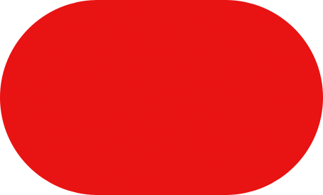

*A higher Radius value produces more rounded corners.*

And here's a rectangle but with a much lower Radius value of only 10 px, giving me very small rounded corners:

*A smaller Radius value gives us less rounded corners.*

Unfortunately, there's no way to preview how rounded the corners will appear with our chosen Radius value before we actually draw the rectangle. Also, we can't adjust the Radius value on the fly while we're drawing the shape like we can in Illustrator, and Photoshop doesn't let us go back and make simple changes to the corners after we've drawn it, which means that drawing rounded rectangles is very much a "trial and error" type of thing. If you're not happy with the roundness of the corners after you've drawn the shape, press **Ctrl+Z** (Win) / **Command+Z** (Mac) to quickly undo the step, then enter a different Radius value into the Options Bar and try again.

Just as the Rectangle Tool lets us draw squares, the Rounded Rectangle lets us draw rounded squares. Simply hold down your **Shift** key after you start dragging to force the rounded rectangle into a square shape. Hold down the **Alt** (Win) / **Option** (Mac) key after you start dragging to draw the rounded rectangle (or square) out from its center.

If we click on the small arrow in the Options Bar to bring up the Rounded Rectangle Options, we see that it shares the exact same options as the normal Rectangle Tool, such as **Unconstrained**, **Square** and **From Center**, and again, we already know how to access them from the keyboard:

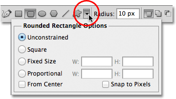

*The Rectangle Tool and Rounded Rectangle Tool share the same list of options.*

### The Ellipse Tool

Photoshop's Ellipse Tool lets us draw elliptical or circular shapes. Just as with the Rectangle and Rounded Rectangle Tools, click inside the document to set a starting point, then keep your mouse button held down and drag out the rest of the shape:

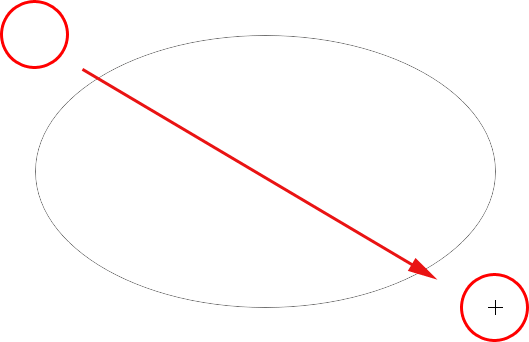

*Drawing an elliptical shape with the Ellipse Tool.*

Release your mouse button to complete the shape and have Photoshop fill it with color:

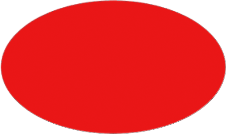

*The color-filled elliptical shape.*

Hold your **Shift** key down after you start dragging with the Ellipse Tool to force the shape into a perfect circle. Holding your **Alt** (Win) / **Option** (Mac) key down after you start dragging will draw the shape from its center:

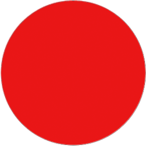

*Begin dragging, then add the Shift key to draw a perfect circle.*

Clicking on the small arrow in the Options Bar brings up the Ellipse Options, which again are nearly identical to the Rectangle and Rounded Rectangle Options. The only difference of course is that the Ellipse Tool has an option to draw a circle rather than a square:

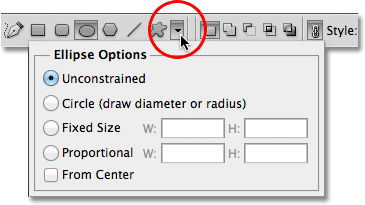

*The Ellipse Tool also shares the same basic options as the Rectangle and Rounded Rectangle Tools.*

### The Polygon Tool

The Polygon Tool is where things start to get interesting. While the Rectangle Tool is limited to drawing four-sided polygons, the Polygon Tool lets us draw polygons with as many sides as we like. It even lets us draw stars, as we'll see in a moment.

Enter the number of sides you need for your polygon shape into the **Sides** option in the Options Bar. The default value is 5, but you can enter any value from 3 to 100:

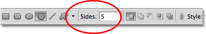

*Use the Sides option to tell Photoshop how many sides you need for your polygon shape.*

Once you've entered the number of sides, click in the document and drag out your polygon shape. Photoshop always draws polygon shapes out from their center so there's no need to hold down your Alt (Win) / Option (Mac) key. Holding your **Shift** key down after you start dragging will limit the number of angles on which the shape can be drawn, which can help to position the shape the way you need it:

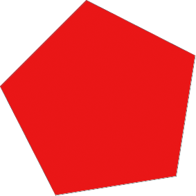

*The Polygon Tool is great when we need something other than a four-sided rectangle.*

Setting the Sides option to 3 for the Polygon Tool gives us an easy way to draw a triangle:

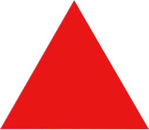

*A simple triangle drawn with the Polygon Tool.*

And here's a polygon shape with the Sides option set to 12:

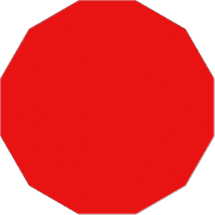

*A twelve-sided polygon shape.*

### Drawing Stars With The Polygon Tool

To draw stars with the Polygon Tool, click on the small arrow in the Options Bar to bring up the Polygon Options, then select **Star**:

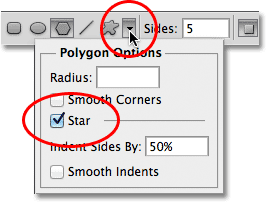

*Choose Star from the Polygon Options menu.*

With the Star option selected, just click inside the document and drag out a star shape. The **Sides** option in the Options Bar controls the number of points in the star, so with the default Sides value of 5, for example, we get a 5-pointed star:

*A 5-pointed star drawn with the Polygon Tool.*

Changing the Sides value to 8 gives us an 8-pointed star:

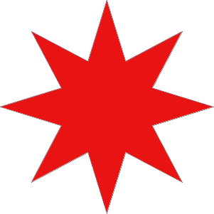

*Set the number of points in the star with the Sides option.*

We can create a starburst shape by increasing the indent of the points using the **Indent Sides By** option. The default value is 50%. I'll increase it to 90%:

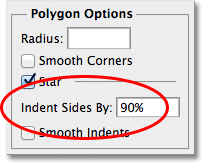

*Increasing the star's indent value to 90%.*

Here's my star shape with the indent set to 90%. I've also increased the number of sides to 16:

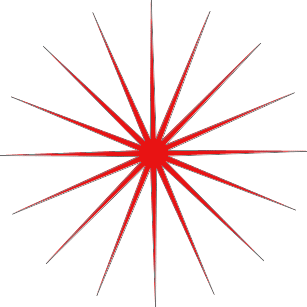

*Increase the Sides and Indent values to create a starburst shape.*

By default, stars have sharp corners on the ends of their points, but we can make them rounded by choosing the **Smooth Corners** option:

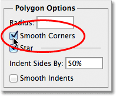

*Selecting the Smooth Corners option.*

Here's a standard 5-pointed star with the Smooth Corners option enabled:

*The Smooth Corners option gives stars a friendly look to them.*

We can smooth the indents as well and make them rounded by selecting the **Smooth Indents** option:

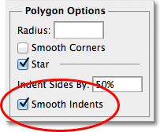

*Selecting the Smooth Indents option.*

And again, we get a different look to our star shape:

*A star shape with Smooth Indents enabled.*

### The Line Tool

Finally, the Line Tool, which is the last of Photoshop's geometric Shape tools, lets us draw simple straight lines, but we can also use it to draw arrows. Set the thickness of the line by entering a value, in pixels, into the **Weight** option in the Options Bar. I'll set mine to 16 px:

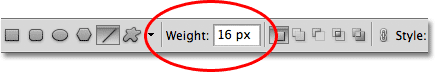

*Use the Weight option to set the line thickness.*

Then simply click in the document and drag out your line shape. Hold the **Shift** key down after you start dragging to limit the direction you can draw the line in, which makes it easy to draw horizontal or vertical lines:

*Hold Shift as you drag to draw horizontal or vertical lines.*

To add arrowheads to the lines, click on the small arrow in the Options Bar to bring up the **Arrowheads** options. Photoshop lets us add arrowheads to either the start or end of a line, or both. If you want the arrowhead to appear in the direction you're drawing the line, which is usually the case, select the **End** option. Make sure you select this option before drawing the line, since Photoshop doesn't let us go back and add arrowheads after the line has already been drawn:

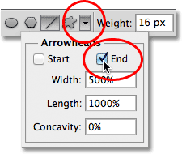

*Select End in the Arrowheads options to add an arrowhead in the direction the line was drawn.*

Here's a line shape similar to the previous one, this time with an arrowhead on the end:

*The Line Tool makes it easy to draw direction arrows.*

If the default size of the arrowhead doesn't work for you, you can adjust it using the **Width** and **Length** options. We can also make the arrowhead appear concave using the **Concavity** option. The default value is 0%. I'll increase it to 50%:

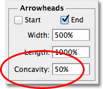

*Increase the Concavity option to change the shape of the arrowhead.*

This changes the shape of the arrowhead. Again, make sure you set the Concavity option before drawing the line, otherwise you'll need to delete the shape and draw it again:

*An arrowhead with the Concavity value set to 50%.*

### Hiding The Outline Around The Shape

If you look closely at your shape after you've drawn it (regardless of which Shape tool you used), you'll often see a thin outline appearing around it which you may find annoying. The outline appears around the shape whenever the shape's vector mask is selected, and it's always selected by default after we draw a new shape.

If you look at the shape's layer in the Layers panel, you'll see that the vector mask thumbnail has a white highlight border around it which tells us that the mask is in fact selected. You can hide the outline around the shape by deselecting its vector mask. To do that, simply click on the vector mask thumbnail. The highlight border around the thumbnail will disappear and so will the outline around the shape in the document:

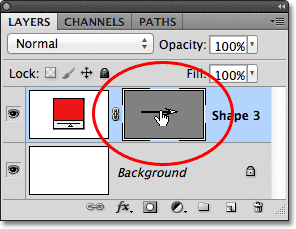

*Click on the vector mask thumbnail to deselect it and hide the outline around the shape.*